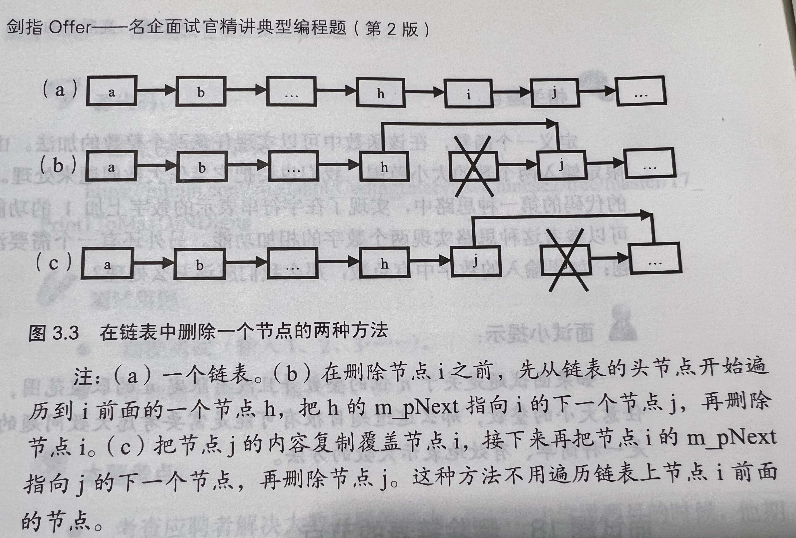

# 面试题3：数组中重复的数字
TODO: 太乱了，后面回来做
## 1. 可以修改目标数组

## 2. 不能修改目标数组


&emsp;
&emsp; 
# 面试题4：二维数组中的查找
## 1. 题目描述
&emsp;&emsp;  在一个 `n * m` 的二维数组中，每一行都按照从左到右递增的顺序排序，每一列都按照从上到下递增的顺序排序。请完成一个高效的函数，输入这样的一个二维数组和一个整数，判断数组中是否含有该整数。现有矩阵 `matrix` 如下：
```
[
  [1,   4,  7, 11, 15],
  [2,   5,  8, 12, 19],
  [3,   6,  9, 16, 22],
  [10, 13, 14, 17, 24],
  [18, 21, 23, 26, 30]
]
```
给定 `target = 5`，返回 `true`。
给定 `target = 20`，返回 `false`。

## 2. 解答
### 2.1 解题思路
从右上角开始走，利用这个顺序关系可以在`O(m+n)`的复杂度下解决这个题：
> 如果当前位置元素比target小，则row++
> 如果当前位置元素比target大，则col--
> 如果相等，返回true
> 如果越界了还没找到，说明不存在，返回false
> 

### 2.2 代码实现
```cpp
class Solution {
public:
    bool findNumberIn2DArray(vector<vector<int>>& matrix, int target) {
        if(matrix.empty() || matrix[0].empty()){
            cout << "Input error: empty array." << endl;
            return false;
        }

        int row = 0;
        int col = matrix[0].size() - 1;

        for(; row < matrix.size(); ++row){
            for(; col >= 0 ; --col){
                if(target == matrix[row][col])
                    return true;
                else if(target > matrix[row][col])
                    break;
                else if(target < matrix[row][col])
                    continue;
            }
        }

        return false;
    }
};
```
看了书上的实现后，发现遍历可以通过一个`while`来实现：
```cpp
class Solution {
public:
    bool findNumberIn2DArray(vector<vector<int>>& matrix, int target) {
        if(matrix.empty() || matrix[0].empty()){
            cout << "Input error: empty array." << endl;
            return false;
        }

        int row = 0;
        int col = matrix[0].size() - 1;

        while(row < matrix.size() && col >= 0){
            if(target == matrix[row][col])
                return true;
            else if(target > matrix[row][col])
                ++row;
            else if(target < matrix[row][col])
                --col;           
        }

        return false;
    }
};
```

## 3. 优化
&emsp;&emsp;  结合二分法可以再次降低复杂度。


&emsp;
&emsp; 
# 面试题5：替换空格
## 1. 题目描述
请实现一个函数，把字符串 s 中的每个空格替换成"%20"。示例 1：
```
输入：s = "We are happy."
输出："We%20are%20happy."
```
## 2. 解答
### 2.1 C++解法
这个就没啥难度了，直接用`std::string`很容易就能解决
```cpp
class Solution {
public:
    string replaceSpace(string s) {
        if(s.empty()){
            cout << "Erro: Empty string." << endl;
            return "";
        }

        size_t sp_cnt = count(s.begin(), s.end(), ' ');
        cout << "sp_cnt" << sp_cnt << endl;

        // string ret_str[s.size() + 2*sp_cnt];
        string ret_str;
        for(int i = 0; i < s.size(); ++i){
            if(s[i] == ' '){
                ret_str.push_back('%');
                ret_str.push_back('2');
                ret_str.push_back('0');
            }
            else
                ret_str.push_back(s[i]);
        }
        return ret_str;
    }
};
```
**收获：**
> ① `std::string`似乎不能指定长度。
> ② `std::string`在`push_back()`的时候只能一次插入一个`char`
> 

### 2.2 c语言解法
#### 2.2.3 思路
思路如下：
> ① 先遍历一次目标字符串，计算出空格的个数`n`，然后在原字符串的基础上加上`2n`就是要返回的字符串长度；
> ② 填充新字符串的时候从后往前遍历，这样比较容易实现一点；
> 
```cpp
char* replaceSpace(char* s){
    if(s == NULL){
        printf("Bad input, null pointer.");
        return NULL;
    }

    int len = strlen(s) + 1; // 把 \0 给加上
    int sp_cnt = 0;

    for(int i = 0; i < len; ++i){
        if(s[i] == ' ')
            ++sp_cnt;
    }

    int len_new= len + 2*sp_cnt;
    char *ret_str = malloc(sizeof(char) * len_new);

    for(int i = len-1; i >= 0; --i){
        if(s[i] == ' '){
            ret_str[--len_new] = '0';
            ret_str[--len_new] = '2';
            ret_str[--len_new] = '%';
        }else{
            ret_str[--len_new] = s[i];
        }
    }    
    return ret_str;
}
```
LeetCode和书上不太一样，书上要求的是通过实参传进去的指针返回，而LeetCode是要求通过返回值来返回，因此需要通过`malloc()`来动态分配内存，要不然返回的就是局部变量

**收获：**
> ① `strlen()`返回的长度不包含`\0`；
> ② `malloc()`是按字节分配的，返回的是一个指针，语法如下：`char *ptr = malloc(sizeof(char) * len);`
> 


&emsp;
&emsp; 
# 剑指 Offer 06. 从尾到头打印链表
## 1 题目详情
输入一个链表的头节点，从尾到头反过来返回每个节点的值（用数组返回）。示例 1：
```
输入：head = [1,3,2]
输出：[2,3,1]
```

## 2 C++实现
### 2.1 解题思路
&emsp;&emsp; 先顺序遍历链表，在遍历过程中将节点的值`push_back`到一个`voctor`中，直到最后一个节点；
&emsp;&emsp; 返回的时候把前面构建的`vector`逆序返回(通过`rbeing()`和`rend()`构建一个新的`vector`)
### 2.2 代码实现
```cpp
/**
 * Definition for singly-linked list.
 * struct ListNode {
 *     int val;
 *     ListNode *next;
 *     ListNode(int x) : val(x), next(NULL) {}
 * };
 */
class Solution {
public:
    vector<int> reversePrint(ListNode* head) {
        vector<int> ret;
        if(head == NULL){
            cout << "Bad Input: null pointer" << endl;
            return ret;
        }
        
        ListNode* ptr = head;
        while(ptr != NULL){
            ret.push_back(ptr->val);
            ptr = ptr->next;
        }
        return vector<int>(ret.rbegin(), ret.rend());
    }
};
```

## 3 c语言实现
### 3.1 解题思路
&emsp;&emsp; 书中用的是`std::stack`实现的，但问题时，既然都用C++标准库了，为什么不直接用`std::vector`。
&emsp;&emsp; 书中还提供了另一种解法：利用函数递归，但存在函数调用栈溢出的问题。


&emsp;
&emsp; 
# 剑指 Offer 07：重建二叉树
## 1. 题目详情
复习了几种遍历再来 TODO:


&emsp;
&emsp; 
# 剑指 Offer 08：
复习了几种遍历再来 TODO:


&emsp;
&emsp; 
# 剑指 Offer 09：用两个栈实现队列
## 1. 题目详情
&emsp;&emsp; 用两个栈实现一个队列。队列的声明如下，请实现它的两个函数 `appendTail` 和 `deleteHead` ，分别完成在队列尾部插入整数和在队列头部删除整数的功能。(若队列中没有元素，`deleteHead` 操作返回 `-1` )
示例 1：
```
输入：
["CQueue","appendTail","deleteHead","deleteHead"]
[[],[3],[],[]]
输出：[null,null,3,-1]
```
示例 2：
```
输入：
["CQueue","deleteHead","appendTail","appendTail","deleteHead","deleteHead"]
[[],[],[5],[2],[],[]]
输出：[null,-1,null,null,5,2]
```

## 2 C++实现
### 2.1 解题思路
&emsp;&emsp; 


```cpp
class CQueue {
public:
    stack<int> in;
    stack<int> out;
    CQueue() {

    }
    
    void appendTail(int value) {
        in.push(value);
    }
    
    int deleteHead() {
        int ret = -1;
        if(out.empty()){
            while(!in.empty()){
                out.push(in.top());
                in.pop();
            }
        }
        if(out.empty())
            return ret;
        else{
            ret = out.top();
            out.pop();
        }
        return ret;
    }
};

/**
 * Your CQueue object will be instantiated and called as such:
 * CQueue* obj = new CQueue();
 * obj->appendTail(value);
 * int param_2 = obj->deleteHead();
 */
```


&emsp;
&emsp; 
# 剑指 Offer 10- I. 斐波那契数列
## 1. 题目详情
写一个函数，输入 n ，求斐波那契（Fibonacci）数列的第 n 项（即 F(N)）。斐波那契数列的定义如下：
```
F(0) = 0,   F(1) = 1
F(N) = F(N - 1) + F(N - 2), 其中 N > 1.
```
斐波那契数列由 0 和 1 开始，之后的斐波那契数就是由之前的两数相加而得出。
答案需要取模 `1e9+7（1000000007）`，如计算初始结果为：`1000000008`，请返回 `1`。
示例 1：
```
输入：n = 2
输出：1
```
示例 2：
```
输入：n = 5
输出：5
```
提示：
```
0 <= n <= 100
```

## 2. 解答
```cpp
class Solution {
public:
    int fib(int n) {
        if(n < 0){
            cout << "ERROR: Bad input." << endl;
            return -1;
        }

        long long n_2 = 0, n_1 = 1, ret = 0;
        while(n-- > 0){
            n_2 = n_1;
            n_1 = ret;
            ret = (n_1 + n_2) %1000000007;
        }
        return ret;
    }
};
```


&emsp;
&emsp; 
# 剑指 Offer 10- II. 青蛙跳台阶问题
## 1. 题目详情
一只青蛙一次可以跳上`1`级台阶，也可以跳上`2`级台阶。求该青蛙跳上一个 `n` 级的台阶总共有多少种跳法。
答案需要取模 `1e9+7（1000000007）`，如计算初始结果为：`1000000008`，请返回 `1`。
示例 1：
```
输入：n = 2
输出：2
```
示例 2：
```
输入：n = 7
输出：21
```
示例 3：
```
输入：n = 0
输出：1
```
提示：
```
0 <= n <= 100
```
TODO: 书上还有另一个扩展，也看看


&emsp;
&emsp; 
# 剑指 Offer 11. 旋转数组的最小数字
## 1. 题目详情
&emsp;&emsp; 把一个数组最开始的若干个元素搬到数组的末尾，我们称之为数组的旋转。
&emsp;&emsp; 给你一个可能存在 重复 元素值的数组 `numbers` ，它原来是一个升序排列的数组，并按上述情形进行了一次旋转。请返回旋转数组的最小元素。例如，数组 `[3,4,5,1,2]` 为 `[1,2,3,4,5]` 的一次旋转，该数组的最小值为`1`。  
示例 1：
```
输入：[3,4,5,1,2]
输出：1
```
示例 2：
```
输入：[2,2,2,0,1]
输出：0
```

## 2. 解答
```cpp
class Solution {
public:
    int minArray(vector<int>& numbers) {
        size_t n = numbers.size();
        if(n == 0){
            cout << "Error: Bad input." << endl;
            return -1;
        }

        if(n <= 1)
            return numbers[n-1];
        int ret = numbers[0];
        int i = 1;
        for(; i < n; ++i){
            if(numbers[i-1]>numbers[i])
                ret = numbers[i];
        }

        return ret;
    }
};
```
## 3. 更优解
&emsp;&emsp; 可以用二分法
TODO:


&emsp;
&emsp; 
# 剑指 Offer 12. 矩阵中的路径
## 1. 题目详情

## 2. 解答
&emsp;&emsp; 用回溯法，写一个深度优先遍历的功能函数，然后递归调用它即可。
```cpp
class Solution {
public:
    bool exist(vector<vector<char>>& board, string word) {
        // 此处边界判断

        for(size_t row = 0; row < board.size(); ++row){
            for(size_t col = 0; col < board[0].size(); ++col){
                if (dfs(board, row, col, word, 0) == true)
                    return true;
            }
        }
        return false;
    }

private:  
    // index是字符串单词word的下标
    bool dfs(vector<vector<char>>& board, size_t row, size_t col, string word, size_t index){
        // 判断是否越界、字符比较
        if(row >= board.size() || row < 0 || col >= board[0].size() || col < 0 || board[row][col] != word[index])
            return false;
        // 如果word的每个字符都查找完了，意味着目标字符串存在，直接返回true
        if(word.size()-1 == index)
            return true;
        board[row][col] = '\0'; // 防止字符被重复利用
        bool res = dfs(board, row+1, col, word, index+1) || 
                    dfs(board, row-1, col, word, index+1) ||
                    dfs(board, row, col+1, word, index+1) ||
                    dfs(board, row, col-1, word, index+1);
        board[row][col] = word[index]; // 恢复网格字符串
        return res;
    }
};
```


&emsp;
&emsp; 
# 剑指 Offer 13. 机器人的运动范围
TODO:


&emsp;
&emsp; 
# 剑指 Offer 14- I. 剪绳子
## 1. 题目详情
&emsp;&emsp; 给你一根长度为 `n` 的绳子，请把绳子剪成整数长度的 `m` 段（`m、n`都是整数，`n>1`并且`m>1`），每段绳子的长度记为 `k[0],k[1]...k[m-1]` 。请问 `k[0]*k[1]*...*k[m-1]` 可能的最大乘积是多少？例如，当绳子的长度是`8`时，我们把它剪成长度分别为`2、3、3`的三段，此时得到的最大乘积是`18`。

示例 1：
```
输入: 2
输出: 1
解释: 2 = 1 + 1, 1 × 1 = 1
```
示例 2:
```
输入: 10
输出: 36
解释: 10 = 3 + 3 + 4, 3 × 3 × 4 = 36
```
提示：
```
2 <= n <= 58
```

## 2. 解答
### 2.1 动态规划
首先定义函数`F(n)`为把长度为`n`的绳子剪成若干段后各段长度乘积的最大值：
> &emsp;&emsp; 在剪第一刀的时候，我们有 `n-1` 种可能的选择，也就是剪出来的第一段绳子的可能长度分别为 `1,2, ... ,n-1`。因此`F(n) = max(F(n) / F(n-1))`，其中`0< n < n`
> &emsp;&emsp; 这是一个从上至下的递归公式。由于递归会有很多重复的子问题，从而有大量不必要的重复计算。一个更好的办法是按照从下而上的顺序计算，也就是说我们先得到 `f(2)、f(2)`，再得到 `f(4)、f(5)`，直到得到 `f(n)`。
> &emsp;&emsp; 当绳子的长度为`2`时，只可能剪成长度都为 `1`的两段，因此`f(2)`等于 `1`。
> &emsp;&emsp; 当绳子的长度为`3`时，可能把绳子剪成长度分别为 `1`和`2`的两段或者长度都为`1` 的三段，由于 `1×2>1×1×1`，因此`f(3)=2`。
> 
```cpp
class Solution {
public:
    int cuttingRope(int n) {
        // 当n<=3时直接返回
        if(n < 2)
            return 0;
        if(n == 2)
            return 1;
        if(n == 3)
            return 2;

        vector<int> results(n+1);
        results[0] = 0;
        results[1] = 1;
        results[2] = 2;
        results[3] = 3;

        int max = 0;
        for(int i = 4; i <= n; ++i){
            max = 0;
            for(int j = 1; j <= i/2; ++j){
                int tmp = results[j]*results[i-j];
                if(tmp > max)
                    max = tmp;
            }
            results[i] = max;
        }
        return results[n];
    }
};
```

### 2.2 贪心算法
此解法的核心思路是：
> 尽可能把绳子分成长度为3的小段，这样乘积最大
> 
至于为什么是这样，可以看看网上的证明。步骤如下：
> ① 如果 n == 2，返回1，如果 n == 3，返回2，两个可以合并成n小于4的时候返回n - 1
> ② 如果 n == 4，返回4
> ③ 如果 n > 4，分成尽可能多的长度为3的小段，每次循环长度n减去3，乘积res乘以3；最后返回时乘以小于等于4的最后一小段
> ④ 以上②和③可以合并
> 
```cpp
class Solution {
public:
    int cuttingRope(int n) {
        if(n < 2)
            return 0;
        if(n == 2)
            return 1;
        if(n == 3)
            return 2;

        int times_of_3 = n / 3; // 倍数
        int remainder = n % 3;  // 余数
        if(remainder == 0) // 被整除
            return pow(3, times_of_3);
        else if(remainder == 1) // 余数为1
            return pow(3, times_of_3-1) * 4;
        else // 余数为 2
            return pow(3, times_of_3) * 2;
    }
};
```

# 剑指 Offer 14- II. 剪绳子 II
&emsp;&emsp; 这题和之前有些不一样，前面那题`2 <= n <= 58`，而这题`n`可以到`120`，这可能会导致算数溢出的问题。
&emsp;&emsp; 为了解决潜在的算数溢出问题，标准库`math.pow()`就不能用了，需要自己编写一个`pow()`方法，每次迭代的时候对`1000000007`取余。
```cpp
class Solution {
public:
    int cuttingRope(int n) {
        if(n < 2)
            return 0;
        if(n == 2)
            return 1;
        if(n == 3)
            return 2;

        int times_of_3 = n / 3; // 倍数
        int remainder = n % 3;  // 余数
        long res = 0;
        if(remainder == 0)
            res =  pow(3, times_of_3);
        else if(remainder == 1)
            res =  pow(3, times_of_3-1) * 4;
        else // 即 remainder == 2
            res =  pow(3, times_of_3) * 2;
        return  res % 1000000007;
    }

private:
    long pow(int n, int times){ // 返回值也是long
        long res = 1; // 注意此处必须是long，不能是int，因为int会溢出
        while(times-- > 0)
            res = (res * 3) % 1000000007;
        return res;
    }
};
```


&emsp;
&emsp; 
# 剑指 Offer 15. 二进制中1的个数
## 1. 题目详情 
&emsp;&emsp; 编写一个函数，输入是一个无符号整数（以二进制串的形式），返回其二进制表达式中数字位数为 '1' 的个数（也被称为 汉明重量).）。

提示：
* 请注意，在某些语言（如 Java）中，没有无符号整数类型。在这种情况下，输入和输出都将被指定为有符号整数类型，并且不应影响您的实现，因为无论整数是有符号的还是无符号的，其内部的二进制表示形式都是相同的。
* 在 Java 中，编译器使用 二进制补码 记法来表示有符号整数。因此，在上面的 示例 3 中，输入表示有符号整数 -3。

示例 1：
```
输入：n = 11 (控制台输入 00000000000000000000000000001011)
输出：3
解释：输入的二进制串 00000000000000000000000000001011 中，共有三位为 '1'。
```
示例 2：
```
输入：n = 128 (控制台输入 00000000000000000000000010000000)
输出：1
解释：输入的二进制串 00000000000000000000000010000000 中，共有一位为 '1'。
```
示例 3：
```
输入：n = 4294967293 (控制台输入 11111111111111111111111111111101，部分语言中 n = -3）
输出：31
解释：输入的二进制串 11111111111111111111111111111101 中，共有 31 位为 '1'。
```
提示：
* 输入必须是长度为 32 的 二进制串 。

## 2. 知识回顾
这题应该通过位移来做，在这里先复习一下移位的相关概念
> (1) 位移有两种：逻辑移位和算数移位
> (2) 对于**无**符号整数，这两种之间没有差异；
> (3) 对于**有**符号整数：
> &emsp;① 对于左移，逻辑左移=算数左移，右边都是统一添`0`;
> &emsp;② 对于右移，逻辑右移，左边统一添0；算数右移，左边添加的数和符号有关，左侧添加符号位(即正数添0，负数添1)。
> 
左移运算符（<<）
> 左移运算符是用来将一个数的各二进制位左移若干位，移动的位数由右操作数指定（右操作数必须是非负值），其右边空出的位用0填补，高位左移溢出则舍弃该高位。
> 
右移运算符（>>）
> 对无符号数,右移时左边高位移入0；对于有符号的值,如果原来符号位为0(该数为正),则左边也是移入0。如果符号位原来为1(即负数),则左边移入0还是1,要**取决于所用的OS采用的是算数右移还是逻辑右移**。有的系统移入0,有的系统移入1。移入0的称为“逻辑移位”,即简单移位；移入1的称为“算术移位”。
> 
## 3. 解答
```cpp
class Solution {
public:
    int hammingWeight(uint32_t n) {
        size_t count = 0;
        while(n != 0){
            if(n&1 == 1)
                ++count;
            n = n>>1; // 右移一位
        }
        return count;
    }
};
```


&emsp;
&emsp; 
# 剑指 Offer 16. 数值的整数次方
## 1. 题目详情
实现 `pow(x, n)` ，即计算 `x` 的 `n` 次幂函数。不得使用库函数，同时不需要考虑大数问题。
示例 1：
```
输入：x = 2.00000, n = 10
输出：1024.00000
```
示例 2：
```
输入：x = 2.10000, n = 3
输出：9.26100
```
示例 3：
```
输入：x = 2.00000, n = -2
输出：0.25000
解释：2-2 = 1/22 = 1/4 = 0.25
```
提示：
```
-100.0 < x < 100.0
-231 <= n <= 231-1
-104 <= xn <= 104
```

## 2. 解答
```cpp
class Solution {
public:
    double myPow(double x, int n) {
        double res = 0.0;
        if(n == 0)
            res = 1.0;
        else if(n == 1)
            res = x;
        else if(n > 1)
            res = func(x, n);
        else{ // n < 0
            long n2 = 0 - static_cast<long>(n); // 用long是为了防止溢出
            res = 1.0 / func(x, n2);
        }
        return res;
    }
private:
    double func(double x, long long n){
        if(n == 0)
            return 1;
        else if(n == 1)
            return x;
        double res = func(x, n>>1);
        res *= res;
        if(n & 0x1 == 1) //奇数
            res *= x;
        return res;
    }
};
```


&emsp;
&emsp; 
# 剑指 Offer 17. 打印从1到最大的n位数
## 1. 题目详情
输入数字 n，按顺序打印出从 1 到最大的 n 位十进制数。比如输入 3，则打印出 1、2、3 一直到最大的 3 位数 999。
示例 1:
```
输入: n = 1
输出: [1,2,3,4,5,6,7,8,9]
```
说明：
> ① 用返回一个整数列表来代替打印
> ② n 为正整数
> 

## 2. 解答
### 2.1 解题思路
&emsp;&emsp; 
TODO: 要考虑大数问题


&emsp;
&emsp; 
# 剑指 Offer 18. 删除链表的节点
## 1. 题目详情
给定单向链表的头指针和一个要删除的节点的值，定义一个函数删除该节点。
返回删除后的链表的头节点。
注意：此题对比原题有改动
示例 1:
```
输入: head = [4,5,1,9], val = 5
输出: [4,1,9]
解释: 给定你链表中值为 5 的第二个节点，那么在调用了你的函数之后，该链表应变为 4 -> 1 -> 9.
```
示例 2:
```
输入: head = [4,5,1,9], val = 1
输出: [4,5,9]
解释: 给定你链表中值为 1 的第三个节点，那么在调用了你的函数之后，该链表应变为 4 -> 5 -> 9.
```
说明：
> 题目保证链表中节点的值互不相同
> 若使用 C 或 C++ 语言，你不需要 free 或 delete 被删除的节点
> 

## 2. 解答
### 2.1 常规解法：时间复杂度O(n)
```cpp
/**
 * Definition for singly-linked list.
 * struct ListNode {
 *     int val;
 *     ListNode *next;
 *     ListNode(int x) : val(x), next(NULL) {}
 * };
 */
class Solution {
public:
    ListNode* deleteNode(ListNode* head, int val) {
        if(head == NULL){
            cout << "Bad input." << endl;
            return head;
        }

        // 如果要删除的是头结点
        if(head->val == val)
            return head->next;

        ListNode *pre=head, *cur=head;
        while(cur!=NULL && cur->val != val){
            pre = cur;
            cur = pre->next;
        }

        pre->next = cur->next;

        return head;
    }
};
```

### 2.2 一个巧妙的解法：时间复杂度O(1)
&emsp;&emsp; **注意，这个是书上的题目，leecode有些不一样，书中的`DeleteNode()`给的形参是一个节点，而LeetCode给的是一个`int`。**
&emsp;&emsp; 在上面的解法中，之所以需要从头开始查找，是因为我们需要得到将被删除的结点的前面一个结点。在单向链表中，结点中没有指向前一个结点的指针，所以只好从链表的头结点开始顺序查找。
&emsp;&emsp; 那是不是一定需要得到被删除的结点的前一个结点呢？答案是否定的。我们可以很方便地得到要删除的结点的一下结点。如果我们把下一个结点的内容复制到需要删除的结点上覆盖原有的内容，再把下一个结点删除，那是不是就相当于把当前需要删除的结点删除了？
&emsp;&emsp; 我们还是以前面的例子来分析这种思路。我们要删除结点i，先把i的下一个结点j的内容复制到i，然后把i的指针指向结点j的下一个结点。此时再删除结点j，其效果刚好是把结点i给删除了（如图3.3（c）所示）。
<div align="center"></div>

&emsp;&emsp; **上述思路还有一个问题**：如果要删除的结点位于链表的尾部，那么它就没有下一个结点，怎么办？我们仍然从链表的头结点开始，顺序遍历得到该结点的前序结点，并完成删除操作。
&emsp;&emsp; **最后需要注意的是**，如果链表中只有一个结点，而我们又要删除链表的头结点（也是尾结点），此时我们在删除结点之后，还需要把链表的头结点设置为NULL。
&emsp;&emsp; 有了这些思路，我们就可以动手写代码了。下面是这种思路的参考代码：
```cpp
// 注意，和leetcode上面不一样的是，这里给出的是待删除的节点 pToBeDeleted，而不是一个int值 val
void DeleteNode(ListNode** pListHead, ListNode* pToBeDeleted) 
{
    if(!pListHead || !pToBeDeleted)
        return;

    // 要删除的结点不是尾结点
    if(pToBeDeleted->m_pNext != nullptr)
    {
        ListNode* pNext = pToBeDeleted->m_pNext;
        pToBeDeleted->m_nValue = pNext->m_nValue;
        pToBeDeleted->m_pNext = pNext->m_pNext;
 
        delete pNext;
        pNext = nullptr;
    }
    // 链表只有一个结点，删除头结点（也是尾结点）
    else if(*pListHead == pToBeDeleted)
    {
        delete pToBeDeleted;
        pToBeDeleted = nullptr;
        *pListHead = nullptr;
    }
    // 链表中有多个结点，删除尾结点
    else
    {
        ListNode* pNode = *pListHead;
        while(pNode->m_pNext != pToBeDeleted)
        {
            pNode = pNode->m_pNext;            
        }
 
        pNode->m_pNext = nullptr;
        delete pToBeDeleted;
        pToBeDeleted = nullptr;
    }
}
```
&emsp;&emsp; 接下来我们分析这种思路的时间复杂度。对于`n－1`个非尾结点而言，我们可以在`O（1）`时把下一个结点的内存复制覆盖要删除的结点，并删除下一个结点；对于尾结点而言，由于仍然需要顺序查找，时间复杂度是`O（n）`。因此总的平均时间复杂度是`[（n－1）*O（1）＋O（n）]/n`，结果还是`O（1）`，符合面试官的要求。
&emsp;&emsp; 值得注意的是，上述代码仍然不是完美的代码，因为它基于一个假设：要删除的结点的确在链表中。我们需要`O（n）`的时间才能判断链表中是否包含某一结点。受到`O（1）`时间的限制，我们不得不把确保结点在链表中的责任推给了函数`DeleteNode`的调用者。在面试的时候，我们可以和面试官讨论这个假设，这样面试官就会觉得我们考虑问题非常全面。