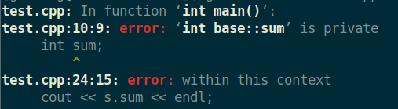
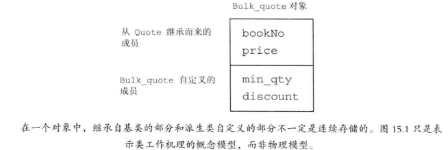
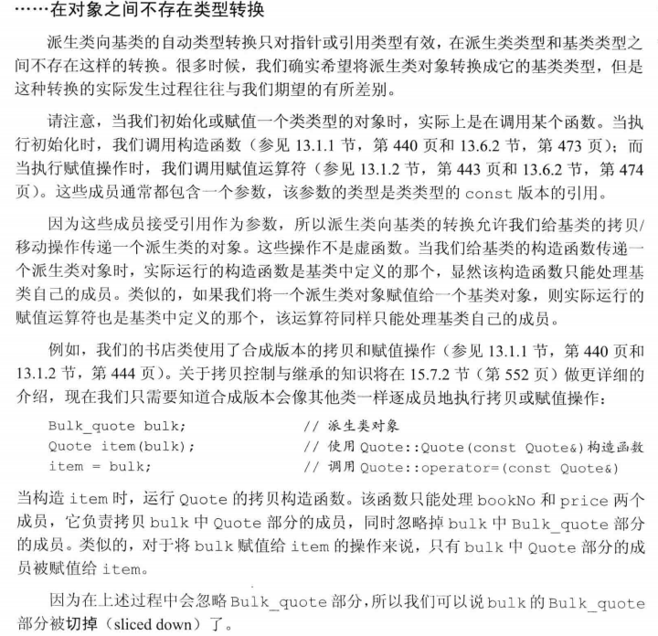

- [第十五章 面向对象程序设计](#第十五章-面向对象程序设计)
  - [1. 面向对象程序设计 有哪些原则？](#1-面向对象程序设计-有哪些原则)
  - [2. 数据抽象](#2-数据抽象)
  - [3. 继承](#3-继承)
    - [3.1 什么是 继承、基类、派生类？](#31-什么是-继承基类派生类)
    - [3.2 基类、派生类 分别负责定义哪些成员？](#32-基类派生类-分别负责定义哪些成员)
    - [3.3 基类的哪些成员会被派生类继承？](#33-基类的哪些成员会被派生类继承)
    - [3.4 如何继承一个类？](#34-如何继承一个类)
  - [4. 动态绑定(dynamic binding)](#4-动态绑定dynamic-binding)
    - [4.1 什么是动态绑定？](#41-什么是动态绑定)
    - [4.2 什么时候会发生动态绑定？](#42-什么时候会发生动态绑定)
    - [4.3 C++是如何实现动态绑定的？](#43-c是如何实现动态绑定的)
    - [4.4 如果发生动态绑定，什么时候可以确定 调用的是哪个版本的虚函数？](#44-如果发生动态绑定什么时候可以确定-调用的是哪个版本的虚函数)
    - [4.5 一个说明动态绑定的例子](#45-一个说明动态绑定的例子)
  - [5. 定义基类 和 派生类](#5-定义基类-和-派生类)
    - [5.1 基类需要完成哪些工作？](#51-基类需要完成哪些工作)
    - [5.2 派生类需要做哪些工作？](#52-派生类需要做哪些工作)
    - [5.3 基类的派生类的实例](#53-基类的派生类的实例)
      - [5.3.1 在上面的例子中，类`Bulk_quote`有哪些成员？](#531-在上面的例子中类bulk_quote有哪些成员)
  - [7. 派生类能否访问基类的私有成员？](#7-派生类能否访问基类的私有成员)
  - [8. 如果基类中未提供访问私有成员的`public`函数，那在派生类中这些基类的私有成员是否 “存在“ 呢？还会不会被继承呢？？](#8-如果基类中未提供访问私有成员的public函数那在派生类中这些基类的私有成员是否-存在-呢还会不会被继承呢)
  - [9. 单继承](#9-单继承)
  - [10. 为什么需要`protected`？](#10-为什么需要protected)
  - [11. 一个派生类对象由哪几个部分组成？](#11-一个派生类对象由哪几个部分组成)
  - [12. 使用`struct`和`class`关键字定义类的时候有哪些区别？](#12-使用struct和class关键字定义类的时候有哪些区别)
  - [14. 派生类的构造函数](#14-派生类的构造函数)
    - [14.1 派生类如何初始化从基类中继承的成员？](#141-派生类如何初始化从基类中继承的成员)
      - [14.1.1 上面的构造函数`Bulk_quote::Bulk_quote()`的执行过程是？](#1411-上面的构造函数bulk_quotebulk_quote的执行过程是)
    - [14.2 如果派生类没有显示调用基类的构造函数对继承自基类成员进行初始化 会发生什么？](#142-如果派生类没有显示调用基类的构造函数对继承自基类成员进行初始化-会发生什么)
  - [15. 基类中的静态成员](#15-基类中的静态成员)
    - [15.1 静态成员和数量 和 派生类的数量有关吗？](#151-静态成员和数量-和-派生类的数量有关吗)
    - [15.2 派生类如何访问基类中的静态成员？](#152-派生类如何访问基类中的静态成员)
  - [16. 如何对派生类进行前向声明？](#16-如何对派生类进行前向声明)
  - [17. 被用作基类的类需要满足什么条件？](#17-被用作基类的类需要满足什么条件)
  - [18. 什么是 直接基类(direct base) 和 间接基类(indirect base)？](#18-什么是-直接基类direct-base-和-间接基类indirect-base)
  - [19. 如何一个类不希望自己被继承，应该如何做？](#19-如何一个类不希望自己被继承应该如何做)
  - [20. 动态类型 与 静态类型](#20-动态类型-与-静态类型)
    - [20.1 什么是 动态类型 和 静态类型？](#201-什么是-动态类型-和-静态类型)
    - [20.2 如何理解“一个对象（变量）的静态类型和动态类型不一定相等”这句话？](#202-如何理解一个对象变量的静态类型和动态类型不一定相等这句话)
    - [20.3 什么情况下一个表达式(变量) 的 动态类型 和 静态类型 会不一样？](#203-什么情况下一个表达式变量-的-动态类型-和-静态类型-会不一样)
    - [20.4 为什么需要区分 变量的 动态类型 和 静态类型？](#204-为什么需要区分-变量的-动态类型-和-静态类型)
    - [20.5 在什么状态下，动态类型 才能发挥作用？](#205-在什么状态下动态类型-才能发挥作用)
  - [21. 派生类及其对象 和 基类 之间的类型转换](#21-派生类及其对象-和-基类-之间的类型转换)
    - [21.1 为什么  派生类及其对象 可以向 基类 转换？](#211-为什么--派生类及其对象-可以向-基类-转换)
    - [21.2 如何进行 派生类及其对象 到 基类 的类型转换？](#212-如何进行-派生类及其对象-到-基类-的类型转换)
    - [21.3 什么时候可以进行派生类到基类的转换？什么时候不能？](#213-什么时候可以进行派生类到基类的转换什么时候不能)
    - [21.4 能否从基类 向 派生类 转换？为什么？](#214-能否从基类-向-派生类-转换为什么)
    - [21.5基类和派生类 对象 之间可以互相赋值吗？为什么？](#215基类和派生类-对象-之间可以互相赋值吗为什么)
      - [21.1.1 行不行？](#2111-行不行)
      - [21.1.2 为什么？](#2112-为什么)
    - [21.6  当使用派生类对 一个基类对象 初始化(或赋值) 的时候 会发生什么？原理是？](#216--当使用派生类对-一个基类对象-初始化或赋值-的时候-会发生什么原理是)
    - [21.7 如何理解 `派生类和基类的自动转换只针对指针或引用类型` 这句话，因为我们可以将 派生类对象 赋给 基类对象，而基类对象 并不是指针或引用](#217-如何理解-派生类和基类的自动转换只针对指针或引用类型-这句话因为我们可以将-派生类对象-赋给-基类对象而基类对象-并不是指针或引用)
    - [21.8 如何把一个从一个基类 转换为 它的派生类？](#218-如何把一个从一个基类-转换为-它的派生类)
  - [22. 下面的代码正确吗？](#22-下面的代码正确吗)
  - [23. 下面的代码原理是什么？](#23-下面的代码原理是什么)
    - [23.1 `Quote item(bulk);`](#231-quote-itembulk)
    - [23.2 `item = bulk;`](#232-item--bulk)
    - [23.3 总结](#233-总结)
  - [24.存在继承关系的类型之间的转换规则是怎样的？](#24存在继承关系的类型之间的转换规则是怎样的)
  - [25. 虚函数(virtual function)](#25-虚函数virtual-function)
    - [25.1 什么是虚函数(virtual function)](#251-什么是虚函数virtual-function)
    - [25.2 如何声明虚函数？](#252-如何声明虚函数)
    - [25.3 虚函数 和 非虚函数的成员函数 有什么区别？](#253-虚函数-和-非虚函数的成员函数-有什么区别)
    - [25.4 如果派生类没有覆盖它继承的虚函数 会发生什么？](#254-如果派生类没有覆盖它继承的虚函数-会发生什么)
      - [25.5 如何覆盖基类的虚函数？](#255-如何覆盖基类的虚函数)
    - [25.6 虚函数 和 动态绑定 的关系是？](#256-虚函数-和-动态绑定-的关系是)
    - [25.7 在什么时候可以确定 调用的是哪个版本的虚函数 ？](#257-在什么时候可以确定-调用的是哪个版本的虚函数-)
    - [25.8 `override`关键字 有何作用？](#258-override关键字-有何作用)
    - [25.8.1 规则](#2581-规则)
    - [25.8.2 实际应用场景](#2582-实际应用场景)
    - [25.9 基类如果不希望自己的某个成员函数被派生类重写，应该怎么做？](#259-基类如果不希望自己的某个成员函数被派生类重写应该怎么做)
    - [25.10 虚函数 和 默认实参](#2510-虚函数-和-默认实参)
      - [25.10.1 使用虚函数的默认实参时需要注意什么？](#25101-使用虚函数的默认实参时需要注意什么)
      - [25.10.2 为什么会发生上述的这种情况呢？](#25102-为什么会发生上述的这种情况呢)
      - [25.10.3 虚函数使用 默认实参的时候需要注意什么？](#25103-虚函数使用-默认实参的时候需要注意什么)
    - [25.11 在派生类重写的函数中，如果要调用基类中相应的虚函数，应该怎么做？](#2511-在派生类重写的函数中如果要调用基类中相应的虚函数应该怎么做)
    - [25.12 为什么 基类和派生类中的虚函数必须有相同的形参列表？](#2512-为什么-基类和派生类中的虚函数必须有相同的形参列表)
    - [25.13 对于下面的几个类的定义，后面的这些语句正确吗？正确的话该语句调用的是哪个函数？](#2513-对于下面的几个类的定义后面的这些语句正确吗正确的话该语句调用的是哪个函数)
  - [27. 多态(polymorphism)](#27-多态polymorphism)
    - [27.1 什么是多态？](#271-什么是多态)
    - [27.2 C++的多态是怎么实现的？](#272-c的多态是怎么实现的)
    - [27.3 动态多态 发生的条件？](#273-动态多态-发生的条件)
  - [28. 在一个类中，哪些函数可以在编译时确定？哪些必须则运行时才能确定？](#28-在一个类中哪些函数可以在编译时确定哪些必须则运行时才能确定)
  - [30 `final`关键字 的作用是？](#30-final关键字-的作用是)
  - [31. 纯虚函数(pure virtual function) 和 抽象基类(abstract base class)](#31-纯虚函数pure-virtual-function-和-抽象基类abstract-base-class)
    - [32.1 纯虚函数 基本概念](#321-纯虚函数-基本概念)
      - [32.1.1 什么是 纯虚函数？](#3211-什么是-纯虚函数)
      - [32.1.2 如何定义虚函数？](#3212-如何定义虚函数)
      - [32.1.3 纯虚函数 需要提供定义吗？](#3213-纯虚函数-需要提供定义吗)
    - [32.1.3 纯虚函数 和 普通的虚函数 有何区别？](#3213-纯虚函数-和-普通的虚函数-有何区别)
    - [32.2 抽象基类](#322-抽象基类)
      - [32.2.1 什么是 抽象基类？](#3221-什么是-抽象基类)
      - [32.2.2 抽象基类 一般用来做什么？](#3222-抽象基类-一般用来做什么)
      - [32.2.3 抽象基类 和 普通的类有何区别？](#3223-抽象基类-和-普通的类有何区别)
    - [32.3 在`Quote` 和 `Bulk_quote` 之间加一个抽象基类`Disc_quote`来表示](#323-在quote-和-bulk_quote-之间加一个抽象基类disc_quote来表示)
  - [33 派生类的成员(或友元) 能否访问 基类的`protected`成员？为什么？](#33-派生类的成员或友元-能否访问-基类的protected成员为什么)
    - [33.1 能不能？](#331-能不能)
    - [33.2 为什么？](#332-为什么)
  - [34. 访问控制 与 继承](#34-访问控制-与-继承)
    - [34.1 C++中有哪几种 访问说明符？](#341-c中有哪几种-访问说明符)
    - [34.2 有哪些继承方式？它们之间有何区别？](#342-有哪些继承方式它们之间有何区别)
    - [34.2.1 哪几种？](#3421-哪几种)
    - [34.2.2 区别](#3422-区别)
    - [34.3 继承访问说明符 的作用是？](#343-继承访问说明符-的作用是)
      - [34.3.2 编写一个类`alpha`，它包含和`Priv_Derv`类一样的成员以及一样的访问权限](#3432-编写一个类alpha它包含和priv_derv类一样的成员以及一样的访问权限)
      - [34.3.3 下面的代码有何问题？](#3433-下面的代码有何问题)
    - [34.4 一个类 对其继承而来的成员 的访问权限 与什么有关？](#344-一个类-对其继承而来的成员-的访问权限-与什么有关)
    - [34.5 在编写类的时候，我们需要考虑哪几种用户？](#345-在编写类的时候我们需要考虑哪几种用户)
    - [34.6 派生类 向 基类转换 的可访问性](#346-派生类-向-基类转换-的可访问性)
    - [34.7 友元关系可以继承吗？](#347-友元关系可以继承吗)
  - [35. 如何改变个别成员的可访问性？](#35-如何改变个别成员的可访问性)
  - [36. 在继承一个类的时候，默认是什么继承？](#36-在继承一个类的时候默认是什么继承)
  - [37. 当发生 派生类->基类 的转换后，转换后的基类能否访问派生类成员？为什么？](#37-当发生-派生类-基类-的转换后转换后的基类能否访问派生类成员为什么)
    - [37.1 能不能？](#371-能不能)
    - [37.2 为什么？](#372-为什么)
  - [38. 当 基类和派生类 中有同名的成员时会发生什么？](#38-当-基类和派生类-中有同名的成员时会发生什么)
  - [39. 我们知道 派生类会隐藏同名的基类成员，那如何在派生类中使用基类中该同名的成员呢？](#39-我们知道-派生类会隐藏同名的基类成员那如何在派生类中使用基类中该同名的成员呢)
  - [40. 如果派生类中有一个和基类同名 但参数列表不一样的函数，那基类中的函数在该派生类中是否可见？为什么？](#40-如果派生类中有一个和基类同名-但参数列表不一样的函数那基类中的函数在该派生类中是否可见为什么)
  - [41. C++类中的函数调用解析过程是怎样的？](#41-c类中的函数调用解析过程是怎样的)
  - [42. 虚析构函数（Virtual Destructors）](#42-虚析构函数virtual-destructors)
    - [42.1 为什么要定义虚析构函数？](#421-为什么要定义虚析构函数)
    - [42.2 如何定义 虚析构函数？](#422-如何定义-虚析构函数)
    - [42.3 如果`Quote`没有定义虚析构函数，下面的代码将发生什么？ `Quote *itemP = new Bulk_quote;  delete itemP; `](#423-如果quote没有定义虚析构函数下面的代码将发生什么-quote-itemp--new-bulk_quote--delete-itemp-)
    - [42.4 虚析构函数会对基类和派生类的定义产生什么影响？](#424-虚析构函数会对基类和派生类的定义产生什么影响)
    - [42.5 一个小例子](#425-一个小例子)
    - [42.5.1 为什么会这样？](#4251-为什么会这样)
    - [42.5.2 这会导致什么结果？](#4252-这会导致什么结果)
    - [42.5.3 如何修改？](#4253-如何修改)
    - [42.6 如果基类的析构函数不是虚函数，但是又想继承该基类，应该怎么办？](#426-如果基类的析构函数不是虚函数但是又想继承该基类应该怎么办)
  - [43. 合成拷贝控制和继承](#43-合成拷贝控制和继承)
    - [43.1 派生类的 合成控制成员的运行规则是怎样的？](#431-派生类的-合成控制成员的运行规则是怎样的)
  - [44. 如果基类的拷贝控制成员是删除的，派生类的对应成员 会是什么状态？ 为什么？](#44-如果基类的拷贝控制成员是删除的派生类的对应成员-会是什么状态-为什么)
  - [45. 如果基类中的析构函数 不可访问或被删除，对派生类有何影响？为什么？](#45-如果基类中的析构函数-不可访问或被删除对派生类有何影响为什么)
  - [46. 如果基类中的移动操作 不可访问或被删除，对派生类有何影响？为什么？](#46-如果基类中的移动操作-不可访问或被删除对派生类有何影响为什么)
  - [47. 什么情况下需要给基类定义移动操作？为什么？](#47-什么情况下需要给基类定义移动操作为什么)
  - [48. 派生类的拷贝控制成员](#48-派生类的拷贝控制成员)
    - [48.1 编写 派生类的拷贝控制成员们 的时候，我们需要注意什么？](#481-编写-派生类的拷贝控制成员们-的时候我们需要注意什么)
    - [48.2 生类的 拷贝构造函数、移动构造函数](#482-生类的-拷贝构造函数移动构造函数)
      - [48.2.1 如何正确的编写 派生类的 拷贝构造函数、移动构造函数？](#4821-如何正确的编写-派生类的-拷贝构造函数移动构造函数)
      - [48.2.2 下面的代码有什么问题？会造成什么后果？怎么修改？](#4822-下面的代码有什么问题会造成什么后果怎么修改)
    - [48.2 派生类的 赋值运算符](#482-派生类的-赋值运算符)
      - [48.2.1 编写 派生类的 赋值运算符 时要注意什么？](#4821-编写-派生类的-赋值运算符-时要注意什么)
      - [48.2.2 如何调用派 基类的赋值运算符？](#4822-如何调用派-基类的赋值运算符)
    - [48.3 派生类的 析构函数](#483-派生类的-析构函数)
      - [48.3.1 如何编写？](#4831-如何编写)
      - [48.3.2 派生类对象在析构时，资源的释放顺序是怎样的？](#4832-派生类对象在析构时资源的释放顺序是怎样的)
  - [49 继承的构造函数](#49-继承的构造函数)
  - [50 容器与继承](#50-容器与继承)
    - [50.1 下面的代码将发生什么？如何修改？](#501-下面的代码将发生什么如何修改)
    - [50.2 使用容器来存放继承体系中的对象时，需要注意什么？为什么？](#502-使用容器来存放继承体系中的对象时需要注意什么为什么)
    - [50.3 我们应该怎么在容器中存放 继承体系中的对象？](#503-我们应该怎么在容器中存放-继承体系中的对象)
    - [50.4 下面的代码的输出是什么？为什么？](#504-下面的代码的输出是什么为什么)
    - [50.5 编写BASKET类](#505-编写basket类)
    - [50.6](#506)
    - [50.7](#507)
    - [50.8](#508)
    - [基类如何强制派生类一定要覆盖某个函数？](#基类如何强制派生类一定要覆盖某个函数)
  - [覆盖(override)](#覆盖override)
  - [类派生列表中的 访问说明符 的作用是？](#类派生列表中的-访问说明符-的作用是)
    - [虚函数、动态绑定、运行时多态之间的关系](#虚函数动态绑定运行时多态之间的关系)
  - [C++ 类在内存中的存储方式](#c-类在内存中的存储方式)
  - [参考文献](#参考文献)
# 第十五章 面向对象程序设计

## 1. 面向对象程序设计 有哪些原则？
&emsp;&emsp; 面向对象程序设计(object-oriented programming) 的核心思想 基于三个基本概念：数据抽象、继承、动态绑定：
> 使用数据抽象，我们将类的接口和实现分离；
> 使用继承，可以对相似的关系进行建模；
> 使用动态绑定，可以在一定程度上忽略相似类的区别，并以统一的方式使用它们的对象，即在运行时选择执行函数的版本。
> 


&emsp;
&emsp;
## 2. 数据抽象
&emsp;&emsp; 用数据抽象，可以将 类的接口和实现分离，这样只需提供一个头文件给用户就行了，类的实现 对于用户来说是不可见的。


&emsp;
&emsp;
## 3. 继承
### 3.1 什么是 继承、基类、派生类？
&emsp;&emsp; 通过继承(inheritance)联系在一起的类构成一种层次关系。通常在层次关系的根部有一个基类(base class)，其它类都是 直接或间接地 从基类继承而来，这些继承而得到的类称为派生类(derived class)。

### 3.2 基类、派生类 分别负责定义哪些成员？
&emsp;&emsp; 基类负责定义在层次关系中所有类共同拥有的成员，而每个派生类定义各自特有的成员。

### 3.3 基类的哪些成员会被派生类继承？
&emsp;&emsp; 每个类都会继承它直接基类的所有成员。

### 3.4 如何继承一个类？
&emsp;&emsp; 派生类必须通过使用 类派生列表(class derivation list)明确指出它是从哪个(哪些)基类继承而来的。
&emsp;&emsp; 类派生列表的形式是：首先是一个冒号，后面紧跟以逗号分隔的基类列表，其中每个基类前面可以有访问说明符：
```cpp
class bulk_quote : public Quote {
public:
    double net_price(std::size_t n) const override;
};
```


&emsp;
&emsp;
## 4. 动态绑定(dynamic binding)
### 4.1 什么是动态绑定？
&emsp;&emsp; 通过动态绑定(dynamic binding)，我们能用同一段代码分别处理基类和派生类对象：
我们来看下面的代码：
```cpp
// 基类
class Quote {
public:
    std::string isbn() const;
    virtual double net_price(std::size_t n) const;
};

// 派生类
class Bulk_quote : public Quote {
public:
    double net_price(std::size_t n) const override;
};

double print_total(ostream &os, const Quote &item, size_t n)
{
    // 根据 item形参的类型来确定调用  Quote::net_price() 还是 Bulk_quote::net_price()
    double ret = item.net_price(n);
    os << "ISBN: " << item.isbn() // 调用的是基类的isbn()，即 Quote::isbn+
        << " # sold: " << n << " total due: " << ret << endl;
    return ret;
}
```
对于下面的调用：
```cpp
Quote basic;
Bulk_quote bulk;
print_total(cout, basic, 20); // 调用 Quote::net_price()
print_total(cout, bulk, 20); // 调用 Bulk_quote::net_price()
```
> 第一条调用语句将一个`Quote对象`传入了`print_total()`，因此当`print_total()`调用`net_price`的时候执行的是`Quote`的版本；
> 第二条调用语句将一个`Bulk_quote对象`传入了`print_total()`，因此当`print_total()`调用`net_price`的时候执行的是`Bulk_quote`的版本；
> 
在上诉的代码的运行中，函数的运行版本由实参决定，即在运行时选择函数的版本，这就叫动态绑定，也称为运行时绑定(run-time binding)

### 4.2 什么时候会发生动态绑定？
C++ primer原文：在C++语言中，当我们**使用 基类的引用(或指针) 调用一个虚函数时**将发生动态绑定。
&emsp;&emsp; 简单地说，虚函数是动态绑定的基础；动态绑定是实现运行时多态的基础。而要触发 动态绑定，需满足如下两个条件：
> (1)  只有虚函数才能进行动态绑定，非虚函数不进行动态绑定。
> (2)  必须通过 **基类类型**的引用或指针 进行函数调用。
> 
通过基类指针或基类引用做形参，当实参传入不同的派生类(或基类)的指针或引用，在函数内部触发 动态绑定，从而来 运行时 实现多态的。
**此时可以结合动态类型和静态类型来复习。**

### 4.3 C++是如何实现动态绑定的？
&emsp;&emsp; 通过虚函数。当我们**使用指针或引用调用虚函数时**，该调用将执行动态绑定，编译器将根据引用或指针所绑定的对象类型来决定调用对应版本的函数：该调用可能执行基类的版本(指针指向基类的对象)，也可能某个派生类的版本(指针指向派生类的对象)。

### 4.4 如果发生动态绑定，什么时候可以确定 调用的是哪个版本的虚函数？
&emsp;&emsp; 如果发生动态绑定，则只有在运行时才能确定调用的是 基类版本的函数 还是 派生类版本的函数，编译时是不能确定的。

### 4.5 一个说明动态绑定的例子
```cpp
class Base{
public:
    virtual void func() { cout << "I am in base." << endl;}
};

class Derived : public Base{
public:
    virtual void func() { cout << "I am in Derived." << endl;}
};

int main()
{
    Base *pb, b;
    Derived d;
    
    pb = &b;        // 此时 pb 的动态类型和静态类型一致，都是Base
    pb -> func();   // 静态绑定，运行的是 Base::func()

    pb = &d;        // 此时 pb 的动态类型为Derived，静态类型为Base，它们不一致
    pb -> func();   // 引发动态绑定，调用的是 Derived::func()

    return 0;
}
```
编译后，运行结果为：
```
I am in base.
I am in Derived.
```


&emsp;
&emsp;
## 5. 定义基类 和 派生类
### 5.1 基类需要完成哪些工作？
(1) 基类通常都应该定义一个虚析构函数，即使该函数不执行任何实际操作也是如此。
(2) 基类必须将它的两种成员函数区分开来：一种是基类希望其派生类进行覆盖的函数；另一种是基类希望派生类直接继承而不要改变的函数。对于前者，基类应该将其定义为虚函数。

### 5.2 派生类需要做哪些工作？
(1) 派生类必须使用 类派生列表 明确指出继承的是哪个基类；
(2) 派生类必须对对基类的虚函数进行重新声明和覆盖

### 5.3 基类的派生类的实例
```cpp
class Quote {
public:
    Quote() = default; 
    Quote(const std::string &book, double sales_price):
                    bookNo(book), price(sales_price) { }
    std::string isbn() const { return bookNo; }

    // returns the total sales price for the specified number of items
    // derived classes will override and apply different discount algorithms
    virtual double net_price(std::size_t n) const 
                { return n * price; }

    // dynamic binding for the destructor
    virtual ~Quote() = default; 
private:
    std::string bookNo; // ISBN number of this item
protected:
    double price = 0.0; // normal, undiscounted price
};


class Bulk_quote : public Quote { // Bulk_quote inherits from Quote
public:
    Bulk_quote() = default;
    Bulk_quote(const std::string&, double, std::size_t, double);
    // overrides the base version in order to implement the bulk purchase discount policy
    double net_price(std::size_t) const override;
private:
    std::size_t min_qty = 0; // minimum purchase for the discount to apply
    double discount = 0.0;  // fractional discount to apply
};
```
#### 5.3.1 在上面的例子中，类`Bulk_quote`有哪些成员？
**自己定义的**：
&emsp; 成员函数：`net_price()`
&emsp; 数据成员：`discount`、`min_qty`
**从基类继承的：**
&emsp; 成员函数：`isbn()`
&emsp; 数据成员：`bookNo`、`price`
**注意：**`bookNo成员`是基类的私有成员，虽然派生类`Bulk_quote`从基类继承了该成员，但是不能通过常规手段访问它。


&emsp;
&emsp;
## 7. 派生类能否访问基类的私有成员？
**不能直接访问：**
&emsp;&emsp; 派生类是不能直接访问基类的`private`成员的，要是可以访问的话就不需要引入`protected`关键字了。
来看下面的代码：
```cpp
class base{
public:
    base(int a = 6):sum(a) { };
private:
    int sum;
};

class son:public base{
public:
    son()= default;
private:
    int number;
};


int main(void)
{
    son s;
    cout << s.sum << endl;
    return 0;
}
```
编译的时候报错了
<div align="center">  </div>
<center> <font color=black> <b> 图1 访问基类的私有成员的报错信息 </b> </font> </center>

**但是可以通过成员函数来访问：**
```cpp
class base{
public:
    base(int a = 6):sum(a) { };
    int get_sum(){return sum; }
private:
    int sum;
};

class son:public base{
public:
    son()= default;
private:
    int number;
};


int main(void)
{
    son s;
    cout << "sum : " << s.get_sum() << endl;
    return 0;
}
```
输出结果：
> sum : 6
> 


&emsp;
&emsp;
##  8. 如果基类中未提供访问私有成员的`public`函数，那在派生类中这些基类的私有成员是否 “存在“ 呢？还会不会被继承呢？？
&emsp;&emsp; 其实在派生类中，这些基类的私有成员的确是存在的，而且会被继承，只不过程序员无法通过正常的渠道访问到它们。
考察如下程序，通过一种特殊的方式访问了类的私有成员。
```cpp
class base{
public:
    base(int a = 6):sum(a) { };
    int get_sum(){return sum; }
private:
    int sum;
    void private_printer(){cout << "你好，我是基类的私有成员函数"<<endl;}
};

class son:public base{
public:
    son()= default;
    void print_base(){
        int* p = reinterpret_cast<int*>(this);//
        cout << *p << endl;
    }   
    
//    void usePrivateFunction(){
//        void(*func)()=NULL;
//        asm("mov eax,A::privateFunc;mov func,eax;");
//        func();
//    }
private:
    int number;
};

int main(void)
{
    son s;
    s.print_base();
    //s.usePrivateFunction();
    return 0;
}
```
输出结果：
> 6
> 
由上面的结果可知：虽然`基类base`没有提供访问`私有成员变量sum`的公有方法，但是在`派生类son`的对象中包含了`基类的私有成员变量sum`
&emsp;&emsp; 综上所述，类的私有成员一定存在，也一定被继承到派生类中。只不过收到C++语法的限制，在派生类中访问基类的私有成员只能通过间接的方式进行。


&emsp;
&emsp;
## 9. 单继承
&emsp;&emsp; 大多数类都只继承自一个类，这种形式的继承被称为 单继承。


&emsp;
&emsp;
## 10. 为什么需要`protected`？
&emsp;&emsp; 派生类可以继承那些定义在基类中的成员，但派生类的成员函数不能访问基类的私有成员，若基类希望某些成员可以被派生类所访问但不能被其它用户访问，可以将该成员声明为`protected`
| 关键字      | 作用                       |
| ----------- | -------------------------- |
| `public`    | 所有用户都能访问           |
| `private`   | 仅友元和类本身可以访问     |
| `protected` | 子类、友元和类本身可以访问 |


&emsp;
&emsp;
## 11. 一个派生类对象由哪几个部分组成？
&emsp; 一个派生类对象包含多个组成部分：
> &emsp;&emsp;① 一个含有派生类自己定义的非静态成员的子对象，
> &emsp;&emsp;② 一个与该派生类继承的基类对象的子对象
> 
就拿前面定义过的 派生类`Bulk_quote` 和基类`Bulk_quote` 来说，虽然C++标准没有明确规定派生类的对象在内存中如何分布，但是我们可以认为 派生类`Bulk_quote`的队形包含下图的两个部分：
<div align="center">  </div>
<center> <font color=black> <b> 图2 Bulk_quote对象的概念结构 </b> </font> </center>


&emsp;
&emsp;
## 12. 使用`struct`和`class`关键字定义类的时候有哪些区别？
它们之间有两个区别：
**① 类成员默认访问说明符的区别：**
&emsp; 在`struct`中，成员默认是public的，而`class`默认是private的
```cpp
class A { int num }; // num是private的

struct B { int num}; // num是public的
```
**② 在继承时，默认继承方式的区别：**
> **struct**: 默认是 public继承
> **class** : 默认是 private继承
> 
```cpp
class Base { /* ... */ };
struct D1 : Base { /* ... */ };     // 默认是public继承
class D2 : Base { /* ... */ };      // 默认是private继承
```
**总结：**
&emsp;&emsp; 人们常常有一种错觉，认为`struct`和`class`这两个关键字定义的类之间还有更深层次的区别，但事实上，唯二的区别就是 类成员默认访问说明符的区别 和 继承时默认继承方式的区别。


&emsp;
&emsp;
## 14. 派生类的构造函数
### 14.1 派生类如何初始化从基类中继承的成员？
&emsp;&emsp; 对于那些从基类中继承而来的成员，派生类是不能直接初始化的，派生类必须通过调用基类的构造函数来初始化它的基类部分，**简而言之就是** 每个类控制它自己的成员的初始化过程。
我们现在来完成上面派生类`Bulk_quote`的构造函数：
```cpp
Bulk_quote(const std::string& book, double p,
            std::size_t qty, double disc) :
                Quote(book, p), min_qty(qty), discount(disc) { }
```
#### 14.1.1 上面的构造函数`Bulk_quote::Bulk_quote()`的执行过程是？
其实就是按顺序执行，先基类后派生类，而构造函数都是先执行它的初始化列表，然后再执行函数体，但很多构造函数的函数体都是空的，具体过程如下：
> (1) 构造函数`Quote()`的 构造函数初始化列表;
> (2) 构造函数`Quote()`的 函数体(这里是空的)；
> (3) 构造函数`Bulk_quote`的 构造函数初始化列表;
> (4) 构造函数`Bulk_quote`的 函数体(这里是空的)；
> 
### 14.2 如果派生类没有显示调用基类的构造函数对继承自基类成员进行初始化 会发生什么？
&emsp;&emsp; 该派生类对象的基类部分将进行默认初始化。


&emsp;
&emsp;
## 15. 基类中的静态成员
### 15.1 静态成员和数量 和 派生类的数量有关吗？
&emsp;&emsp; 没有，如果基类定义了一个静态成员，则在整个继承体系中 只存在该成员的唯一定义，不论从基类中派生出多少个派生类，对于每个静态成员来说都只存在唯一的实例。

### 15.2 派生类如何访问基类中的静态成员？
&emsp;&emsp; 对于基类中的静态成员，派生类可以通过基类来访问 也可以通过派生类来访问：
```cpp
class Base {
public:
    static void statmem();
};

class Derived : public Base {
    void f(const Derived&);
};


void Derived::f(const Derived &derived_obj)
{
    Base::statmem(); // 通过基类访问
    Derived::statmem(); // 派生类继承了基类的statmem()函数
    // ok: derived objects can be used to access static from base
    derived_obj.statmem();  // 通过基类对象来访问statmem()函数
    statmem();              // 通过 this指针访问
}
```


&emsp;
&emsp;
## 16. 如何对派生类进行前向声明？
&emsp;&emsp; 派生类的前向声明和其它类一样，但不能包含它的派生列表：
```cpp
class Bulk_quote: public Quote; // 错误，不能包含派生列表
class Bulk_quote;               // 正确
```


&emsp;
&emsp;
## 17. 被用作基类的类需要满足什么条件？
&emsp;&emsp; 被用作基类的类 必须已经被定义，而非仅仅声明：
```cpp
class Quote;  // 声明Quote类

// 错误，Quote类仅仅是被声明了，不能用它作基类
class Bulk_quote: public Quote{
    // 类的成员...
}; 
```


&emsp;
&emsp;
## 18. 什么是 直接基类(direct base) 和 间接基类(indirect base)？
&emsp;直接基类出现在派生列表中，而间接基类由派生类通过其直接基类继承而来。来看下面的例子吧：
```cpp
class Base { /*...*/ }
class D1: public Base { /*...*/ }
class D2: public D2 { /*...*/ }
```
在上面的继承关系中，`Base`是 `D1`的直接基类，同时也是`D2`的间接基类。
&emsp;&emsp; 每个类都会继承直接基类的所有成员。对于一个最终基类来说，他会继承其直接基类的成员，而该直接基类又包含了其基类的成员，以此类推至继承关系的最顶端。以此，最终的派生类将包含它直接基类的子对象以及每个简介基类的子对象。


&emsp;
&emsp;
## 19. 如何一个类不希望自己被继承，应该如何做？
&emsp;&emsp; 在C++11中，提供了防止继承的方法：在类名后面加上`final`关键字
```cpp
class NoDerired final { /* 类的定义*/ }; // NoDerired 不能作为基类
class Base { /* */};
class Last final : Base { /* */ };  // Last 不能作为基类

class Bad : NoDerired { /* */ };    // 错误，NoDerired 是final的，以此不能作为基类
class Bad2 : Last { /* */ };        // 错误，Last 是final的，以此不能作为基类
```


&emsp;
&emsp;
## 20. 动态类型 与 静态类型
### 20.1 什么是 动态类型 和 静态类型？
&emsp;&emsp; 当我们使用存在继承关系的类型时，必须将一个变量或其他表达式的静态类型与该表达式表示对象的动态类型区分开来：
>&emsp; **表达式的静态类型** 在编译时总是已知的，它是变量声明时的类型或表达式生成的类型；
>&emsp; 而**动态类型**则是变量或表达式表示的内存中的对象的类型，它直到运行时才可知

### 20.2 如何理解“一个对象（变量）的静态类型和动态类型不一定相等”这句话？
&emsp;&emsp;什么是静态类型？什么是动态类型？首先这两种肯定是对象（变量）类型的一种说法，而区分这两种类型最直接的方法就是看表达式的形式。关于一个表达式的对象（变量）的静态类型和动态类型需要从两点进行分析：
>（1）该对象（变量）的静态类型和动态类型是否相等；
>（2）如果该对象的静态类型和动态类型不相等，其动态类型是否有作用。
> 
&emsp;&emsp; 对于第（1）点，其实我们可以认为每个对象（变量）都存在动态类型和静态类型，只是大多数情况下一个对象的动态类型和静态类型是相等的，所以我们平常都没有强化这两个概念，如表达式int a; 对象a的静态类型和动态类型就是相等的，所以平常我们都是直接称呼变量a的类型是int。
&emsp;&emsp; 对于第（2）点，首先**只有当我们的表达式使用的是指针或引用时**，对象的静态类型和动态类型才有可能不同，而且就算一个对象的静态类型和动态类型不相等，其还不一定能享受到动态类型所带来的方便（即动态绑定），因为我们知道，动态绑定的前提条件是继承体系中的子类继承并重写了基类的虚函数。
&emsp;&emsp; 如果觉得上面的解释有点绕，直接解释静态类型和动态类型的定义，一个对象（变量）的静态类型就是其声明类型，如表达式int a中的int就是对象a的声明类型，即静态类型；而一个对象（变量）的动态类型就是指程序执行过程中对象（指针或引用）实际所指对象的类型，如:
> `Base* pB = new Drived;` 其中class Drived继承于class Base，则指针对象pB的静态类型就是Base（声明类型），动态类型就是Drived（实际所指对象的类型），又如Base* pB = new Base；此时指针对象pB的静态类型和动态类型也是相等的，都是Base。

### 20.3 什么情况下一个表达式(变量) 的 动态类型 和 静态类型 会不一样？
&emsp;&emsp; 只有当我们的表达式使用的是指针或引用时，对象的静态类型和动态类型才有可能不同。

### 20.4 为什么需要区分 变量的 动态类型 和 静态类型？
&emsp;&emsp; 正如前面提到的，大多数情况下，一个对象的静态类型和动态类型都是相等的，而且就算其静态类型和动态类型不相等，也不一定会使动态类型发挥威力，那到底什么时候一个对象（变量）的动态类型能发挥其威力呢？
需要满足三个条件：
>（1）该对象是指针或引用形式；
>（2）该对象的静态与动态类型不同；
>（3）应用场景为带虚函数的继承体系结构。
>
**咱们直接理解为：动态类型就是为动态绑定（C++继承的多态）准备的。** 只有当上述3个条件都满足了，动态类型才能发挥其威力，即很好的支持虚函数动态绑定机制，为什么呢？这与C++编译器对多态继承结构中的成员函数调用机制有关。
&emsp; 对于以下继承结构：`class Drived : public Base`，然后有表达式：
> &emsp; `p->mem()`（通过指针调用）
> &emsp; `obj.mem()`（通过对象调用）
> 
其中`mem()`是一个类成员函数，但具体是基类还是子类，现在可以不用管，而且我们也不用管`p`或者`obj`是指向哪个类。当程序的编译期，当编译器遇到表达式`p->mem()`或`obj.mem()`，执行以下步骤：
>（1）首先确定`p`（或`obj`）的静态类型，即声明类型；
>（2）然后在`p`（或`obj`）的静态类型中查找`mem()`函数，如果没有找到，按照作用域规则，这时编译器会到其直接基类中寻找，并依次向上，直到达到继承链的顶端，如果在这个过程中找到了，则继续下一步，如果没有找到，则报错；
>（3）一旦找到名字匹配的`mem()`函数，则编译器会根据`mem()`是否是虚函数，以及我们是通过指针或引用（如p）来调用`mem()`函数，还是通过类对象（如`obj`）来调用`mem()`函数，生成不同的代码。如果`mem()`是虚函数且是通过指针或引用调用（如`p->mem()`），编译器生成的代码会检查其动态类型，这就是动态绑定的过程，也就是说编译器生成的代码会直到运行期确定了动态类型才决定具体调用基类还是子类的虚函数mem()；如果`mem()`不是虚函数且是通过对象调用（如`obj.mem()`），则编译器会产生一个常规的函数调用代码，可以直接确定调用哪一个`mem()`函数。

### 20.5 在什么状态下，动态类型 才能发挥作用？
&emsp;&emsp; 对上面的介绍进行总结：大多数情况下对象的静态类型和动态类型相同，我们不用关系二者区别；只有多态情况下，**即在有虚函数的继承体系中，通过基类的指针或引用调用虚函数时**，这时我们就需要关系指针或引用对象的动态类型，因为它们的静态类型毋庸置疑是基类，但动态类型有可能是子类（其实也不是有可能，要想应用多态，其动态类型必须是子类），所以动态类型就是跟虚函数、多态、动态绑定息息相关的。


&emsp;
&emsp;
## 21. 派生类及其对象 和 基类 之间的类型转换
### 21.1 为什么  派生类及其对象 可以向 基类 转换？
&emsp;&emsp; 在前面以及提到过 一个派生类 可以分为 派生类自身的部分 和 该派生类对应的基类部分，而之所以存在派生类向基类的类型转换是因为每个派生类对象都包含一个基类的部分，**而将一个基类的指针(引用)指向 其派生类的对象 的本质其实就是** 将 该基类的指针 指向 该派生类的基类部分，所以我们可以把派生类的对象当成基类的对象来使用。
在下面的代码中，其实就是让 基类引用`r` 指向了 派生类对象`bulk`的基类部分：
```cpp
Bulk_quote bulk; // bulk 是派生类对象
Quote &r = bulk; // r 是指向指向基类的引用，这里的结果是 r指向 派生类对象bulk 中的 基类部分
```

### 21.2 如何进行 派生类及其对象 到 基类 的类型转换？
&emsp;&emsp; 这种转换通常被称为**派生类到基类的类型转换**，和其它类型转换一样，编译器会隐式的执行这种类型转换。这种隐式特性意味着我们可以把 **派生类对象的引用(指针)** 用在需要 基类引用(指针) 的的地方：
```cpp
Quote item; // item 是基类对象
Bulk_quote bulk; // bulk 是派生类对象
Quote *p = &item; // p 是指向基类的指针
p = &bulk; // p 是指向基类的指针，但也能让它指向派生类对象（准确的说是指向 派生类中的 基类部分）
Quote &r = bulk; // r 是指向指向基类的引用，这里的结果是 r指向 派生类对象bulk 中的 基类部分
```

### 21.3 什么时候可以进行派生类到基类的转换？什么时候不能？
&emsp;&emsp; 当派生类对基类进行 `public`继承时，我们可以进行转换；当继承类型为`protected`或`private`时，我们不能进行转换：
```cpp
class base{
public:
    base(const int a):num(a) {}
protected:
    int num;
};

class derived : private base{
public:
    derived(const int a, const double p):base(a),price(p) { } 
private:
    double price;
};

int main()
{
    base b(2);
    derived d(3, 3.2);
    b=d;
    return 0;
}
```
**运行结果：**
```
test.cpp: In function ‘int main()’:
test.cpp:24:7: error: ‘base’ is an inaccessible base of ‘derived’
     b=d;
       ^
```
显然，当派生类对基类进行私有继承时，不能进行派生类到基类的转换。

### 21.4 能否从基类 向 派生类 转换？为什么？
&emsp;&emsp; 不能，因为派生类可以分为两个独立的部分：基类部分和派生类部分，而基类只包含基类的部分，也就是说：
> 派生类 = 基类部分 + 派生类部分
> 
因此可以从派生类转换为基类，而反过来却不行。如果非要进行基类到派生类的转换，请看下面的介绍

### 21.5基类和派生类 对象 之间可以互相赋值吗？为什么？
#### 21.1.1 行不行？
&emsp;&emsp; 我们可以将 派生类对象 赋给 基类对象，但反过来却不行。我们写一段代码来验证一下：
```cpp
class base{
public:
    base()=default;
    base(const int a):num(a) {}
    virtual void print(){cout << num << endl;}
protected:
    int num;
};

class derived : public base{
public:
    derived()=default;
    derived(const int a, const double p):base(a),price(p) { } 
    void print(){cout << num << " " << price << endl;}
private:
    double price;
};


int main()
{
    base b(2);
    b.print();

    derived d(3, 3.2);
    d.print();

    b=d; // 将派生类对象赋给基类对象
    b.print();

    return 0;
}
```
**运行结果：**
```
2
3 3.2
3
```
从上述结果可得知，在将 派生类对象赋给基类对象后，调用的`print()`是基类的版本，这是因为在赋值的过程中，派生类对象 的派生类部分被忽略了，只保留了基本部分，所以输出的结果是`3`，而不是`3 3.2`。
我们对上面的代码做一点修改，将`b=d`改为`d=b`：
```cpp
{
    base b(2);
    b.print();

    derived d(3, 3.2);
    d.print();

    d=b; // 将基类类对象赋给派生类对象
    b.print();

    return 0;
}
```
**运行结果：**
编译的时候直接报错：
```
test.cpp: In function ‘int main()’:
test.cpp:32:7: error: no match for ‘operator=’ (operand types are ‘derived’ and ‘base’)
     d=b;
       ^
test.cpp:14:7: note: candidate: ‘derived& derived::operator=(const derived&)’
 class derived : public base{
       ^~~~~~~
test.cpp:14:7: note:   no known conversion for argument 1 from ‘base’ to ‘const derived&’
test.cpp:14:7: note: candidate: ‘derived& derived::operator=(derived&&)’
test.cpp:14:7: note:   no known conversion for argument 1 from ‘base’ to ‘derived&&’
```
这表示我们无法将一个基类对象 赋给 一个派生类对象
#### 21.1.2 为什么？
&emsp;&emsp; 我们都知道，当使用赋值运算符`=`的时候，其实是调用左侧对象的赋值运算符来完成赋值的，就拿上面写的测试代码来举例：
① `b=d; // 将派生类对象赋给基类对象` 为什么 **可以**？
&emsp;&emsp; 此时其实调用的是 基类对象`b` 的拷贝构造函数 `base& base::operator=(const base&)`来完成赋值的，在赋值的时候会将 派生类对象`d` 转换为 基类类型`base`，这个类型转换时没有问题的，因此可以将 派生类对象 赋给 基类对象。
② `d=b; // 将基类类对象赋给派生类对象` 为什么 **不可以**？
&emsp;&emsp; 此时其实调用的是 派生类对象`d` 的拷贝构造函数 `derived& derived::operator=(const derived&)`来完成赋值的，这意味着要将 基类对象`b` 转换为 派生类对象，而我们知道基类对象是不能转换为派生类对象的，因此编译时将报错。

### 21.6  当使用派生类对 一个基类对象 初始化(或赋值) 的时候 会发生什么？原理是？
**① 会发生什么？**
&emsp;&emsp; 当我们使用派生类为 一个基类对象 初始化(或赋值) 的时候，只有该派生类的基类部分会被拷贝、移动或赋值，它的派生类部分将会被忽略。
**② 原理**
&emsp;&emsp; 调用基类的拷贝构造函数来完成赋值。

### 21.7 如何理解 `派生类和基类的自动转换只针对指针或引用类型` 这句话，因为我们可以将 派生类对象 赋给 基类对象，而基类对象 并不是指针或引用
&emsp;&emsp; 我们来看 《C++ primer》 中的原文吧：
<div align="center">  </div>
<center> <font color=black> <b> 图1 访问基类的私有成员的报错信息 </b> </font> </center>
总的来说，赋值也是符合 `派生类和基类的自动转换只针对指针或引用类型` 这句话的，因为赋值调用的是赋值构造函数、拷贝构造函数，而这几个成员函数使用的是引用作为参数，因此在调用这些函数的时候，会把`=`右侧的对象转换为对应的指针或引用，因此 `派生类和基类的自动转换只针对指针或引用类型` 这句话依然适用。

### 21.8 如何把一个从一个基类 转换为 它的派生类？
&emsp;&emsp;.TODO: c++ primer P534


&emsp;
&emsp;
## 22. 下面的代码正确吗？
```cpp
// Quote是基类，Bulk_quote是派生类
Bulk_quote bulk;
Quote *itemP = &bulk; 
Bulk_quote *bulkP = itemP; 
```
&emsp;&emsp; `Quote *itemP = &bulk;`是正确的，基类指针可以指向派生类对象。
&emsp;&emsp; `Bulk_quote *bulkP = itemP; `是错误的，`itemP`是基类，不能转换为派生类。


&emsp;
&emsp;
## 23. 下面的代码原理是什么？
```cpp
// Quote是基类，Bulk_quote是派生类
Bulk_quote bulk; 
Quote item(bulk); // uses the Quote::Quote(const Quote&) constructor
item = bulk; // calls Quote::operator=(const Quote&)
```
### 23.1 `Quote item(bulk);`
&emsp;&emsp; 这个语句调用的是 基类的构造函数` Quote::Quote(const Quote&)`，`bulk`的基类部分被绑定到了实参`const Quote&`上，也就是说`item`是通过`bulk`的基类部分来进行初始化的。

### 23.2 `item = bulk;`
&emsp;&emsp; 这个语句调用的是 基类的拷贝赋值算符`Quote::operator=(const Quote&)`，`bulk`的基类部分被绑定到了实参`const Quote&`上，也就是说`item`是通过`bulk`的基类部分来进行拷贝赋值的。

### 23.3 总结
&emsp;&emsp; 其实在上面的两个语句中，都会忽略`Bulk_quote`的派生类部分，我们可以理解为`bulk`对象的派生类部分直接被切掉了。


&emsp;
&emsp;
## 24.存在继承关系的类型之间的转换规则是怎样的？ 
要想理解具有继承关系的类之间发生的类型转换，有三点非常重要：
> 1、从派生类向基类的类型转换只对指针或引用类型有效。(值得指出的是，赋值是调用拷贝控制成员，而不是类型转换)
> 2、基类向派生类不存在隐式类型转换。
> 3、和任何其他成员一样，派生类向基类的类型转换也可能会由于访问受限而变得不可行。
> 
尽管自动类型转换只对指针或引用类型有效，但是继承体系中的大多数类仍然（显示或隐式低）定义了拷贝控制成员。因此，我们通常能够将一个派生类对象拷贝、移动或赋值给一个基类对象。不过需要注意到是，这种操作只处理派生类对象的基类部分。


&emsp;
&emsp;
## 25. 虚函数(virtual function)
### 25.1 什么是虚函数(virtual function)
&emsp;&emsp; 在C++中，基类将 类型相关的函数 与 派生类不做改变直接继承的函数 区分对待。
对于某些函数，若基类希望它的派生类各自定义适合自身的版本，那基类就应该将这些函数声明为 虚函数(virtual function)

### 25.2 如何声明虚函数？
&emsp;&emsp; 在函数前面加上`virtual`即可。
```cpp
class Quote {
public:
    std::string isbn() const;
    virtual double net_price(std::size_t n) const;
};
```

### 25.3 虚函数 和 非虚函数的成员函数 有什么区别？
&emsp; 差别主要在 该成员函数的解析过程发生在何时：
> &emsp;&emsp; 虚函数 ：发生在 运行时（用指针或引用调用时）；
> &emsp;&emsp; 非虚函数：发生 在编译时
> 

### 25.4 如果派生类没有覆盖它继承的虚函数 会发生什么？
&emsp;&emsp; 如果派生类没有覆盖其基类中的某个虚函数，则该虚函数的行为类似于其它的普通成员，即派生类会直接继承其在基类中的版本。

#### 25.5 如何覆盖基类的虚函数？
(1) 派生类可以在它覆盖的函数前使用`virtual`关键字，但这不是必须的
(2) C++11允许派生类显式的注明它使用某个成员函数覆盖它继承的虚函数，即在形参列表后面、const成员函数的const关键字后面、或者引用成员函数的引用限定符后面 添加一个关键字`override`

### 25.6 虚函数 和 动态绑定 的关系是？
&emsp;&emsp; 虚函数是动态绑定的基础，只有在 通过指针或引用 调用虚函数 时，才会发生动态绑定。

### 25.7 在什么时候可以确定 调用的是哪个版本的虚函数 ？
这个得分情况：
&emsp;&emsp; **如果是通过一个 普通类型的表达式(非指针或引用) 来调用一个虚函数**，则不会发生动态绑定，这就意味着编译的时候就能确定调用的是基类版本的函数还是派生类版本的。
&emsp;&emsp; **如果通过指针或引用来调用一个虚函数**，则会发生动态绑定，只有在运行时才能确定调用的是哪个版本，编译时是不能确定的。

### 25.8 `override`关键字 有何作用？
### 25.8.1 规则
(1) `override`关键字 只能用于 虚函数
(2) `override`关键字 用于派生类中(注意是派生类！)，假如派生类的一个成员函数`func()`被声明为`override`，但基类中并没有这个`func()`函数，那程序将报错。

### 25.8.2 实际应用场景
&emsp;&emsp; 设想这样一种情况：在派生类中定义了一个函数，这个函数和基类中的一个虚函数名字相同但形参列表不同，这样是合法的，编译器将认为新定义的这个函数与基类中原有的函数是相互独立的，此时派生类的函数并没有覆盖掉基类中的版本，而我们原本可能是希望派生类能覆盖掉基类中的虚函数，但是一不小心把形参列表给弄错了。
```cpp
class base {
    virtual void test(int);
};

class derived:public base{
    // 派生类的test和基类中的test()是相互独立的，因为它们的形参列表不一样，也就是说派生类derived没有对基类base进行覆盖。
    void test(int , sint); 
};
```
&emsp;&emsp; 上面这样的错误是很难发现的，因此在C++11中我们可以使用`override`关键字来说明派生类中的虚函数，这么做的好处就是使得程序员的意图更为清晰的同时，让编译器为我们发现一些错误。
&emsp;&emsp; 如果我们使用 `override`关键字 标记了一个函数，而该函数没有覆盖一个已存在的虚函数，则编译器将报错：
```cpp
struct B {
    virtual void f1(int) const;
    virtual void f2();
    void f3();
};

// 注意，overr关键字是出现在派生类中的
struct D1 : B{
    virtual void f1(int) const override;  // 正确，f1和基类B中的f1匹配
    virtual void f2(int) override;  // 错误，基类中没有形如 f2(int) 的函数（基类中的f2和它同名，但是形参列表不一样，和重载类似。）
    void f3() override;             // 错误，f3不是虚函数
    void f4() override;             // B中没有名为f4()的函数
};
```

### 25.9 基类如果不希望自己的某个成员函数被派生类重写，应该怎么做？
&emsp;&emsp; 将该成员函数声明为`final`即可：
```cpp
struct D2 : B {
    // inherits f2() and f3() from B and overrides f1(int)
    void f1(int) const final; // subsequent classes can't override f1(int)
};
struct D3 : D2 {
    void f2();                  // ok: overrides f2 inherited from the indirect base,B
    void f1(int) const;         // error: D2 declared f2 as final
};
```

### 25.10 虚函数 和 默认实参
#### 25.10.1 使用虚函数的默认实参时需要注意什么？
&emsp;&emsp; 像其他任何函数一样，虚函数也可以有默认实参。通常，如果有用在给定调用中的默认实参值，**该值将在编译时确定。** 如果一个调用省略了具有默认值的实参，则所用的值由调用该函数的类型定义，与对象的动态类型无关，也就是说在通过基类的引用或指针调用虚函数时，默认实参为在基类虚函数中指定的值。
```cpp
class base{
public:
    virtual void printer(string s = "base") { 
        cout << s << endl;
    }
};

class derived : public base{
public:
    virtual void printer(string s = "derived") override{ 
        cout << s <<" I am the printer function of derived class." << endl;
    }
};


int main()
{
    base b;
    derived d;

    b.printer();
    d.printer();

    base *pb = &d; //  pb的静态类型为base，动态类型为derived
    pb->printer();

    derived *pd = &d; //pd的静态类型和动态类型都是derived
    pd->printer();


    return 0;
}
```
**运行结果：**
```
base
derived I am the printer function of derived class.
base I am the printer function of derived class.
derived I am the printer function of derived class.
```
**分析：**
(1) `pb->printer();`
&emsp;&emsp; 因为`pb`的静态类型为`base`，动态类型为`derived`，因此语句`pb->printer();`调用的是 派生类版本的`printer()`，但是却使用的是 基类版本的`printer()`的默认实参，
(2) `pd->printer();`
&emsp;&emsp; `pd`的静态类型和动态类型都是`derived`，因此使用的是派生类中的默认实参
这就说明 虚函数的默认实参只和静态类型有关，与动态类型无关

#### 25.10.2 为什么会发生上述的这种情况呢？
&emsp;&emsp; 通常，如果有用在给定调用中的默认实参值，**该值将在编译时确定。**，而动态类型是在运行时才能确定的，因此函数的默认实参只和静态类型有关。

#### 25.10.3 虚函数使用 默认实参的时候需要注意什么？
&emsp;&emsp; 基类、派生类中定义的默认实参最好一致。

### 25.11 在派生类重写的函数中，如果要调用基类中相应的虚函数，应该怎么做？
&emsp;&emsp; 使用作用域运算符，要不然就是调用自己，这会导致无限递归：
```cpp
class base{
public:
    virtual void printer(string s = "base"){ cout << s << endl;}
};

class derived : public base{
public:
    virtual void printer(string s = "derived") override{ 
        base::printer(); // 调用基类的 printer()
        cout << "derived" << endl;
    }   
};


int main()
{
    derived d;
    d.printer();

    return 0;
}
```
**运行结果：**
```
[alpha@localhost code]$ ./test.o 
base
derived
```

### 25.12 为什么 基类和派生类中的虚函数必须有相同的形参列表？
&emsp;&emsp; 假如 基类和派生类 中的虚函数 接收的实参不同，则我们就无法通过基类的引用或指针调用派生类的虚函数了，来看下面的代码：
```cpp
class Base {
public:
    virtual int fcn() {cout << "I'm fcn() from Base" << endl;}
};

class D1 : public Base {
public:
    int fcn(int) { cout << "I'm fcn() from D1, and I take one int type parameter." << endl;} 
    virtual void f2(); // new virtual function that does not exist in Base
};

int main()
{
    D1 d;
    d.fcn();
    d.fcn(1);

    return 0;
}
```
编译上述代码，报错如下：
```
test.cpp:15:9: note: int D1::fcn(int)
     int fcn(int) { cout << "I'm fcn() from D1, and I take one int type parameter." << endl;} 
         ^
test.cpp:15:9: note:   candidate expects 1 argument, 0 provided
```
将`main()`函数修改如下：
```cpp
int main()
{
    D1 d;
    Base* b = &d;
    b->fcn();

    return 0;
}
```
成功编译，输出如下：
``` I'm fcn() from Base ```

通过上面两个实例我们可以得知：
① 显然`D1`没有覆盖(override)`Base::fcn()`，因为`D1::fcn()`与`Base::fcn()`的形参列表不同。
② 实际上，因为`D1::fcn()`与`Base::fcn()`的函数名相同，因此`D1`对 `Base::fcn()` 进行了隐藏。
③ 派生类`D1`中其实函数两个`fcn()`函数：
> `Base::fcn()`：直接从基类继承的（因为未在派生类中覆盖的虚函数将被直接继承，但因为派生类`D1`已经定义了一个`fcn()`函数了，这导致`Base::fcn()`被`D1::fcn()`隐藏了）
> `D1::fcn()`：自己定义的
但我们不能通过 派生类`D1`的对象 访问 基类的`fcn()`函数，因为基类的`fcn()`函数被`D1::fcn()`隐藏了，但进行动态绑定的时候我们是可以访问`Base::fcn()`的。

### 25.13 对于下面的几个类的定义，后面的这些语句正确吗？正确的话该语句调用的是哪个函数？
```cpp
class Base {
public:
    virtual int fcn();
};
class D1 : public Base {
public:
    // hides fcn in the base; this fcn is not virtual
    // D1 inherits the definition of Base::fcn()
    int fcn(int); // parameter list differs from fcn in Base
    virtual void f2(); // new virtual function that does not exist in Base
};

class D2 : public D1 {
public:
    int fcn(int); // nonvirtual function hides D1::fcn(int)
    int fcn(); // overrides virtual fcn from Base
    void f2(); // overrides virtual f2 from D1C++ Primer, Fifth Edition
};


Base bobj; D1 d1obj; D2 d2obj;

Base *bp1 = &bobj, *bp2 = &d1obj, *bp3 = &d2obj;
bp1->fcn();  
bp2->fcn(); 
bp3->fcn(); 

D1 *d1p = &d1obj; D2 *d2p = &d2obj;
bp2->f2(); 
d1p->f2(); 
d2p->f2(); 

Base *p1 = &d2obj; D1 *p2 = &d2obj; D2 *p3 = &d2obj;
p1->fcn(42); 
p2->fcn(42); 
p3->fcn(42); 
```
**上面的语句调用的函数如下：**
```cpp
Base bobj; D1 d1obj; D2 d2obj;

Base *bp1 = &bobj, *bp2 = &d1obj, *bp3 = &d2obj;
bp1->fcn(); //  虚调用，将在运行时调用Base::fcn()
bp2->fcn(); //  虚调用，将在运行时调用Base::fcn()
bp3->fcn(); //  虚调用，将在运行时调用D2::::fcn()，因为类D2对fcn()进行了覆盖

D1 *d1p = &d1obj; D2 *d2p = &d2obj;
bp2->f2(); // 错误，因为bp2的静态类型为Base，而Base没有 f2()
d1p->f2(); // 虚调用，将调用 D1::f2()
d2p->f2(); // 虚调用，将调用 D2::f2()

Base *p1 = &d2obj; D1 *p2 = &d2obj; D2 *p3 = &d2obj;
p1->fcn(42); // 错误，Base中没有一个接受 int的fcn()函数
p2->fcn(42); // 静态绑定，因为D1:fcn(int)不是虚函数
p3->fcn(42); // 静态绑定，因为D2:fcn(int)不是虚函数
```


&emsp;
&emsp;
## 27. 多态(polymorphism)
### 27.1 什么是多态？
&emsp;&emsp; 多态，顾名思义就是同一个事物在不同场景下的多种形态。在C++中，

### 27.2 C++的多态是怎么实现的？
&emsp;&emsp; 引用和指针 的静态类型与动态类型 不同 这一事实是C++支持多态的根本原因。
&emsp;&emsp; 当我们使用 基类的引用或指针 调用基类中定义的一个函数时，我们并不知道该函数真正作用的对象是什么类型，因为它可能是一个基类对象也可能是一个派生类对象。如果该函数是虚函数，则直到运行时才会决定到底执行哪个版本，判断依据是引用或指针所绑定的对象的真实类型。

### 27.3 动态多态 发生的条件？
● 基类中必须包含虚函数，并且派生类中一定要对基类中的虚函数进行重写。
● 通过基类对象的指针或者引用调用虚函数。


&emsp;
&emsp;
## 28. 在一个类中，哪些函数可以在编译时确定？哪些必须则运行时才能确定？
这个得分情况：
(1) 非虚函数：可以在编译时确定调用的是哪个函数；
(2) 虚函数：
&emsp; ① 用 对象调用 时，可以在编译时确定调用的哪个函数：
&emsp; ② 用 指针(或引用) 调用虚函数时，对象的动态类型和静态类型有可能不一样，必须在运行时才能确定调用的基类的版本还是派生类的版本。
**总结一下就是：** 用 指针(或引用) 调用虚函数时，必须在运行时才能确定调用的基类的版本还是派生类的版本。其它的都可以在编译时确定。


&emsp;
&emsp;
## 30 `final`关键字 的作用是？
两个作用：
**(1) 禁用继承**
&emsp;&emsp; 在C++11中，提供了防止继承的方法：在类名后面加上`final`关键字
```cpp
class NoDerired final { /* 类的定义*/ }; // NoDerired 不能作为基类
class Base { /* */};
class Last final : Base { /* */ };  // Last 不能作为基类

class Bad : NoDerired { /* */ };    // 错误，NoDerired 是final的，以此不能作为基类
class Bad2 : Last { /* */ };        // 错误，Last 是final的，以此不能作为基类
```
**(2) 禁用重写**
&emsp;&emsp; 一个类如果不希望自己的某个成员函数被派生类重写，将该成员函数声明为`final`即可：
```cpp
struct D2 : B {
    // inherits f2() and f3() from B and overrides f1(int)
    void f1(int) const final; // subsequent classes can't override f1(int)
};
struct D3 : D2 {
    void f2();                  // ok: overrides f2 inherited from the indirect base,B
    void f1(int) const;         // error: D2 declared f2 as final
};
```


&emsp;
&emsp;
## 31. 纯虚函数(pure virtual function) 和 抽象基类(abstract base class) 
### 32.1 纯虚函数 基本概念
#### 32.1.1 什么是 纯虚函数？
&emsp;&emsp; 纯虚函数(pure virtual), 是一个基类中的方法, 仅仅是声明, 而不包括定义, 是一个泛化概念(general concept); 是把相应的虚函数, 末尾添加`=0`,该虚函数就变为纯虚函数, 可以不用添加定义;
#### 32.1.2 如何定义虚函数？
&emsp;&emsp; 在函数体后面加上`=0`即可将一个虚函数声明为纯虚函数：
```cpp
class abstract_base{
public:
    abstract_base() =default;
    pure_vir_func() =0; // 声明为纯虚函数
};
```
#### 32.1.3 纯虚函数 需要提供定义吗？
&emsp;&emsp; 纯虚函数 可被定义也可不被定义，如要定义纯虚函数，必须在类的外部定义：

### 32.1.3 纯虚函数 和 普通的虚函数 有何区别？
&emsp;&emsp; 纯虚函数不需要被定义，只需被声明；
&emsp;&emsp; 普通的虚函数 必须有定义。

### 32.2 抽象基类
#### 32.2.1 什么是 抽象基类？
&emsp;&emsp; 含有（或未经覆盖直接继承）纯虚函数的类 是抽象基类。
#### 32.2.2 抽象基类 一般用来做什么？
&emsp;&emsp; 抽象基类一般用来定义接口，后续的其它类可以覆盖该接口。
#### 32.2.3 抽象基类 和 普通的类有何区别？
&emsp;&emsp; 我们不能创建一个抽象基类的对象。

### 32.3 在`Quote` 和 `Bulk_quote` 之间加一个抽象基类`Disc_quote`来表示
```cpp
// class to hold the discount rate and quantity
// derived classes will implement pricing strategies using these data
class Disc_quote : public Quote {
public:
    Disc_quote() = default;
    // 先调用基类的构造函数Quote()对基类成员进行初始化，随后初始化自己的成员。
    Disc_quote(const std::string& book, double price,
                std::size_t qty, double disc):
                    Quote(book, price), quantity(qty), discount(disc) { }
    double net_price(std::size_t) const = 0;
protected:
    std::size_t quantity = 0; // purchase size for the discount to apply
    double discount = 0.0;      // fractional discount to apply
};


class Bulk_quote : public Disc_quote {
public:
    Bulk_quote() = default;
    Bulk_quote(const std::string& book, double price,
                std::size_t qty, double disc): Disc_quote(book, price, qty, disc) { }
    // overrides the base version to implement the bulk purchase discount policy
    double net_price(std::size_t) const override;
};
```


&emsp;
&emsp;
## 33 派生类的成员(或友元) 能否访问 基类的`protected`成员？为什么？
### 33.1 能不能？
&emsp;&emsp; 可以，但是只能通过**派生类对象**来访问基类的受保护成员，而不能通过 基类对象 来访问：
```cpp
class Base {
protected:
    int prot_mem; // protected member
};

class Sneaky : public Base {
    // clobbers can access Sneaky::prot_mem, but can't access Base::prot_mem
    friend void clobber(Sneaky&);   
    friend void clobber(Base&);     
    int j; // j is private by default
};

void clobber(Sneaky &s) { 
    s.j = s.prot_mem = 0; //正确: clobber是 Sneaky类的友元，可以访问Sneaky对象的private和protected成员
}

void clobber(Base &b) { 
    b.prot_mem = 0; // 错误: clobber不能访问基类的protected成员
}
```
### 33.2 为什么？
&emsp;&emsp; 假设派生类(及其友元)可以访问其基类对象的`protected`成员，则上面的`clobber(Base&)`函数则是正确的，这就意味着如果我们想绕开基类的`protected`限制，只需定义一个类似于`Sneaky类`的类即可，这样`protected`限制就失去了效果，想要阻止这样的用法，我们就必须规定 **派生类的成员和友元 只能访问 该派生类对象 中的基类部分 的`protected`成员，对于 普通基类对象中的成员 不具有特殊的访问权限。**


&emsp;
&emsp;
## 34. 访问控制 与 继承
### 34.1 C++中有哪几种 访问说明符？
&emsp;&emsp; 在C++中，访问说明符(public,protected,private)分为：
类成员访问说明符 和 继承访问说明符
```cpp
class Base {
public: // // 这个public 是 类成员访问说明符
    int prot_mem; 
};

class Sneaky : public Base { // 这个public 是 继承访问说明符
    friend void clobber(Sneaky&);   
    friend void clobber(Base&);     
    int j; 
};
```

### 34.2 有哪些继承方式？它们之间有何区别？
### 34.2.1 哪几种？
&emsp;&emsp; 有 public继承、protected继、private继
### 34.2.2 区别
（1）通过public继承：派生类中基类部分成员的访问说明符在基类中为public或protected的，在派生类中类型保持不变，private的成员不可访问。
（2）通过protected继承：派生类中基类部分成员的访问说明符在基类中为public或protected的，在派生类中类型为protected，private的成员不可访问。
（3）通过private继承：派生类中基类部分成员的访问说明符在基类中为public或protected的，在派生类中类型为private，private的成员不可访问。
| 派生方式        | 基类的public成员  | 基类的protected成员 | 基类的private成员| 概括       |
| -----------    | ---------------- | ------------------- |-----------     |----------- |
| `public`派生    | 仍为public       | 仍为private         |  不可见        | 所有的都**不变** |
| `protected`派生 | 变为protected    | 变为private         |  不可见      | 基类的成员级别都**升一级** |
| `private`派生   | 变为private      | 变为private         |  不可见      | 基类的成员级别都**升两级**|

### 34.3 继承访问说明符 的作用是？
&emsp;&emsp; 继承访问说明符的作用是 控制 派生类**用户** 对于基类成员的访问权限，而不是控制 派生类本身 对于基类成员的访问权限：
```cpp
class Base {
public:
    void pub_mem(); // public member
protected:
    int prot_mem; // protected member
private:
    char priv_mem; // private member
};

// 公有继承
struct Pub_Derv : public Base {
    // ok: derived classes can access protected members
    int f() { return prot_mem; }
    // 错误: priv_mem 是私有成员
    char g() { return priv_mem; }
};

// 私有继承
struct Priv_Derv : private Base {
    // 我们能访问 基类Base 的 protected成员 prot_mem
    int f1() const { return prot_mem; }
};
```
从上面的代码我们可以看到，我们可以在类内的内部访问基类的``public成员`和`protected成员`，即使该派生类采用的是私有继承，我们再来看下面的代码：
```cpp
Pub_Derv d1; // members inherited from Base are public
Priv_Derv d2; // members inherited from Base are private
d1.pub_mem(); // 正确: pub_mem 在 Pub_Derv类中  是 public 的
d2.pub_mem(); // 错误: pub_mem 在 Priv_Derv类中 是 private 的，因为Priv_Derv类是私有继承
```
从上面的代码我们可以看到，`派生类Priv_Derv`的对象`d2`不能访问`pub_mem成员`，这是因为`派生类Priv_Derv`采用的是`private继承`，这导致`pub_mem成员`在`派生类Priv_Derv`中变成了`private`成员。
#### 34.3.2 编写一个类`alpha`，它包含和`Priv_Derv`类一样的成员以及一样的访问权限
`Priv_Derv`类对`Base`类进行了 私有继承，因此只要把 `Base`类 的所有成员变成`private`的就行了，而 `Priv_Derv`类 采用的是 `struct`定义的，因此 函数`f1()` 是`public`的，最后`alpha`的定义如下：
```cpp
class alpha{
public:
    int f1() const { return prot_mem; }
private:
    void pub_mem(); // public member
    int prot_mem; // protected member
    char priv_mem; // private member    
}
```
#### 34.3.3 下面的代码有何问题？
```cpp
struct Derived_from_Public : public Pub_Derv {
    int use_base() { return prot_mem; }
};

struct Derived_from_Private : public Priv_Derv {
    int use_base() { return prot_mem; }
};
```
`Derived_from_Public`类 的定义没有问题，因为`prot_mem成员`在它的父类`Pub_Derv`中为`protected成员`，因此可以直接访问；
`Derived_from_Private`的`use_base()`函数会报错，因为`Priv_Derv`类是对`Base`的私有继承，因此`protected成员`在`Priv_Derv`类中为 私有成员，因此它的子类`Derived_from_Private`不能直接访问。

### 34.4 一个类 对其继承而来的成员 的访问权限 与什么有关？
&emsp;&emsp; 
① 在基类中该成员的访问说明符；
② 在派生类的派生列表中的访问说明符

### 34.5 在编写类的时候，我们需要考虑哪几种用户？
① 用户代码(即类的使用者)
② 类的实现者
③ 派生类

### 34.6 派生类 向 基类转换 的可访问性
现假定`D`继承自`B`：
**① 用户代码(即派生类对象)**
&emsp;&emsp; 只有当`D` 公有的继承 自`B`时，才能使用派生类向基类的转换，受保护、私有 继 都不能进行 派生类->基类 的转换；
**② 派生类的 成员函数和友元**
&emsp;&emsp; 派生类的 成员函数和友元 总是可以使用 派生类->基类 的转换，不管`D`以什么方式继承`B`；
**③ 派生类的派生类 的成员和友元**
&emsp;&emsp; 如果`D`以公有、受保护继承的方式继承`B`，则`D`的派生类 的成员和友元可以使用 D->B 的类型转换，如果是私有的则不行。
&emsp;&emsp; **总的来说，如果基类的公有成员对于该子类（或者是孙子类）来说如果是可访问的，则该派生类向基类的转换也是可访问的，反之则不行。**

### 34.7 友元关系可以继承吗？
&emsp;&emsp; 不能，每个类负责控制各自成员的访问权限。


&emsp;
&emsp;
## 35. 如何改变个别成员的可访问性？
使用`using声明`：
```cpp
class Base {
public:
    std::size_t size() const { return n; }
protected:
    std::size_t n;
};
class Derived : private Base { // 注意: 是 私有继承
public:
    // size成员本来应该是private的，通过using声明，使其变为public的
    using Base::size;
protected:
    using Base::n; // n变为了 protected
};
```
`Derived`对`Base`进行的是私有继承，因此`Base::size`和`Base::n`在`Derived类`中都应该是`private`的，因此`Derived`的对象不能访问它们，如果想让`Derived`的对象访问它们，需要通过`using声明`改变其可访问性。在上面的代码中，`Derived`的对象可以访问`Base::size`，`Derived`的子类可以访问`Base::n`。
**总结：**
&emsp;&emsp; 如果`using声明`位于`public`部分，则类的所有用户都能访问它；如果`using声明`位于`protected`部分，则该名字对于成员、友元和派生类是可访问的。


&emsp;
&emsp;
## 36. 在继承一个类的时候，默认是什么继承？
这由定义派生类所用的关键字决定：
> **struct**: 默认是 public继承
> **class** : 默认是 private继承
> 
```cpp
class Base { /* ... */ };
struct D1 : Base { /* ... */ };     // 默认是public继承
class D2 : Base { /* ... */ };      // 默认是private继承
```
**建议：**
&emsp;&emsp; 一个私有派生的类最好显式的将`private`声明出来，而不要依赖于默认的设置，这样简洁明了，不至于产生误会。


&emsp;
&emsp;
## 37. 当发生 派生类->基类 的转换后，转换后的基类能否访问派生类成员？为什么？
### 37.1 能不能？
&emsp;&emsp; 不能。
### 37.2 为什么？
&emsp;&emsp; 因为名字查找发生在编译时，这意味着 一个对象、引用和指针 的静态类型 决定了该对象的哪些成员是可见的，即使它的静态类型和动态类型可能不一致。
举个例子，我们给`Disc_quote`类 增加一个`discount_policy()`成员:
```cpp
class Disc_quote : public Quote {
public:
    std::pair<size_t, double> discount_policy() const { return {quantity, discount}; }
    // other members as before
};

Bulk_quote bulk;
Bulk_quote *bulkP = &bulk;  // bulkP 的 动态类型  = 静态类型
Quote *itemP = &bulk;       // itemP 的 动态类型 != 静态类型
bulkP->discount_policy();   // 正确: bulkP 的类型是 Bulk_quote*
itemP->discount_policy();   // 错误: itemP 的类型是 Quote*
```
从上面的代码可以得知，我们只能通过`Disc_quote`及其派生类的对象、引用或指针使用`discount_policy()`，尽管`bulkP`确实包含一个`discount_policy()`，但是该成员对于`bulkP`来说是不可见的，因为`bulkP`的类型是`Quote`，这意味着对`discount_policy()`的查找是从`Quote`类开始的，显然`Quote`类不包含`discount_policy()`，因此我们无法通过`Quote`的对象、引用或指针调用`discount_policy()`。


&emsp;
&emsp;
## 38. 当 基类和派生类 中有同名的成员时会发生什么？
派生类会隐藏同名的基类成员：
```cpp
struct Base {
    Base(): mem(0) { }
protected:
    int mem;
};

struct Derived : Base {
    Derived(int i): mem(i) { } // 初始化的是 Derived::mem 
    // Base::mem is default initialized
    int get_mem() { return mem; } // 返回的是 Derived::mem
protected:
    int mem; // 将隐藏 Base::mem 
};

Derived d(42);
cout << d.get_mem() << endl; // 输出 42
```


&emsp;
&emsp;
## 39. 我们知道 派生类会隐藏同名的基类成员，那如何在派生类中使用基类中该同名的成员呢？
可以使用 作用域运算符 来使用一个被隐藏的基类成员：
```cpp
struct Derived : Base {
    int get_base_mem() { return Base::mem; } // 使用基类中的 mem成员
    // ...
};
```
**建议：** 除了覆盖继承而来的虚函数外，派生类最好不要重用其它定义在基类中名字，以免发生混淆。


&emsp;
&emsp;
## 40. 如果派生类中有一个和基类同名 但参数列表不一样的函数，那基类中的函数在该派生类中是否可见？为什么？
&emsp;&emsp; 不可见，因为名字查找优于类型检查，因此定义在派生类中函数 不会重载其基类中的成员，和其它作用域一样，如果派生类的成员和基类的某个成员同名，则派生类成员将在其作用域内隐藏该成员函数，即使派生类成员和基类成员的形参列表不一致，基类成员也会被隐藏。
```cpp
struct Base {
    int memfcn();
};

struct Derived : Base {
    int memfcn(int); // hides memfcn in the base
};

Derived d; 
Base b;
b.memfcn();         // calls Base::memfcn
d.memfcn(10);       // calls Derived::memfcn
d.memfcn();         // error: memfcn with no arguments is hidden
```
**如果想访问基类中同名的函数，应该怎么做？**
&emsp; 可以使用 作用域运算符 来使用一个被隐藏的基类成员：
```cpp
d.Base::memfcn();   // ok: calls Base::memfcn
```


&emsp;
&emsp;
## 41. C++类中的函数调用解析过程是怎样的？
&emsp;&emsp; 假定我们调用 `p->men()`或`obj.mem()`，则依次执行以下4个步骤：
① 首先确定`p(或obj)`的静态类型，因为我们调用的是一个成员，所以该类型必定是类类型；
② 在`p(或obj)`的静态类型对相应的类中查找`mem`，如果找不到，则依次在直接基类中不断查找直至到达继承链的顶端，若找遍了 该类及其所有基类 仍然找不到，则编译器将报错；
③ 一旦找到了`mem`，就进行常规的类型检查以确认对于当前找到的mem，本次调用是否合法；
④ 假设调用合法，则编译器将根据调用的是否虚函数而产生不同的代码：
> &emsp; 若`mem`为虚函数且我们是通过引用或指针进行的调用（将引发动态绑定），则编译器产生的代码将在运行时确定到底运行该函数的哪个版本，依据是对象的动态类型；
> &emsp; 反之，如果`mem`不是虚函数或我们是通过对象调用，而编译器将产生一个常规函数调用
> 


&emsp;
&emsp;
## 42. 虚析构函数（Virtual Destructors）
### 42.1 为什么要定义虚析构函数？
&emsp;&emsp; 我们知道在析构一个动态分配的对象的指针时将执行析构函数，如果该指针指向继承体系中某个类时，则有可能出现 该指针的静态类型 和 被删除对象的动态类型(即该指针指向的对象) 不同 的情况。例如我们`delete`一个`Quote*`类型的指针时，这个指针有可能指向的是一个`Bulk_quote`对象，那在这种情况下，编译器必须知道他应该执行的是`Bulk_quote`的析构函数。
&emsp;&emsp; 综上所述，虚析构函数 是为了让编译器在发生动态绑定时执行正确的析构函数。

### 42.2 如何定义 虚析构函数？
```cpp
class Quote {
public:
    // virtual destructor needed if a base pointer pointing to a derived object is deleted
    virtual ~Quote() = default; // dynamic binding for the destructor
};

Quote *itemP = new Quote;   // 动态类型和静态类型一致
delete itemP;               // 调用 Quote::~Quote()

itemP = new Bulk_quote;     // 动态类型变为了 Bulk_quote
delete itemP;               // 调用Bulk_quote的析构函数
```

### 42.3 如果`Quote`没有定义虚析构函数，下面的代码将发生什么？ `Quote *itemP = new Bulk_quote;  delete itemP; ` 
&emsp;&emsp; 我们可以知道 指针`itemP` 的动态类型和静态类型不相同，因此`delete itemP`时，编译器无法调用 派生类`Bulk_quote`的析构函数来对 类型为`Bulk_quote`的动态内存进行析构，这将产生未定义的行为。

### 42.4 虚析构函数会对基类和派生类的定义产生什么影响？
&emsp;&emsp; 如果一个类定义了析构函数，即使他通过`=default`的形式使用了合成的版本，编译器也不会为这个类合成移动操作。

### 42.5 一个小例子
下面的`Base`是基类，但它的析构函数并非虚函数：
```cpp
class Base {
public:
    Base() {
        cout << "Base()" << endl;
    }
    // Base::~Base() 不是虚函数
    ~Base() {
        cout << "~Base()" << endl;
    }
};

class Derived : public Base {
public:
    Derived() {
        cout << "Derived()" << endl;
    }

    ~Derived() {
        cout << "~Derived()" << endl;
    }
};

int main()
{
	Base *b1 = new Derived;
	delete b1;
}
```
编译后运行，得到结果：
```
Base()
Derived()
~Base()
```
显然，编译器只调用了基类`base`的析构函数，而不是调用派生类`Derived`的析构函数。
### 42.5.1 为什么会这样？
&emsp;&emsp; 对于`b1`，它的静态类型为`Base`，但动态类型为`Derived`，，然而基类`Base`的析构函数不是虚函数，所以无法引发动态绑定，因此我们在`delete`它的时候，是根据静态类型`Base`来调用析构函数的，因此调用的是析构版本是基类的版本。
### 42.5.2 这会导致什么结果？
&emsp;&emsp; 会导致子类的资源得不到正常释放。
### 42.5.3 如何修改？
只要将基类的析构函数声明为虚函数即可，现将基类的析构函数修改为：
```cpp
// 声明为虚函数
virtual ~Base() {
    cout << "~Base()" << endl;
}
```
编译后运行，得到结果：
```
Base()
Derived()
~Derived()
~Base()
```
从上面的结果可以知道，`delete`时调用的是派生类的析构函数`~Derived()`。

### 42.6 如果基类的析构函数不是虚函数，但是又想继承该基类，应该怎么办？
见 关于 生命周期延长 的笔记。


&emsp;
&emsp;
## 43. 合成拷贝控制和继承
### 43.1 派生类的 合成控制成员的运行规则是怎样的？
&emsp;&emsp; 在调用一个类的合成构造函数时，会在类的继承体系中一直向上找，一直找到最顶端的那个基类，然后从该基类开始，依次执行这些类的默认构造函数。其它的合成赋值运算符、合成析构函数也类似。**合成析构函数则顺序相反。**
下面是一个例子：
```cpp
class Quote {
public:
    virtual ~Quote() = default; 
    // ...其它成员
private:
    std::string bookNo; // ISBN number of this item
protected:
    double price = 0.0; // normal, undiscounted price
};

class Disc_quote : public Quote {
public:
    // ...其它成员
protected:
    std::size_t quantity = 0; // purchase size for the discount to apply
    double discount = 0.0;      // fractional discount to apply
};

class Bulk_quote : public Disc_quote {
public:
    Bulk_quote() = default;
    // ...其它成员
};
```
对于上面的继承体系，`Bulk_quote bq;`将依据如下的规则进行默认初始化：
> 合成的`Bulk_quote`默认构造函数 运行它的直接基类`Disc_quote`的默认构造函数，而后者又运行`Quote`的默认构造函数；
> `Quote`的默认构造函数将 `bookNo`成员 默认初始化为空`string`，同时用类内初始值将`price`成员初始化为0；
> `Quote`的默认构造函数运行完毕后，继续执行 `Disc_quote`的默认构造函数，它将使用类内初始值初始化`quantity`和`discount`；
> 最后运行的是 `Bulk_quote`的合成默认构造函数，但它什么也不做。
> 


&emsp;
&emsp;
## 44. 如果基类的拷贝控制成员是删除的，派生类的对应成员 会是什么状态？ 为什么？
&emsp;&emsp; 如果基类中的 默认构造函数、拷贝构造函数、拷贝赋值运算符、析构函数 是被删除的或不可访问，则派生类中对应的成员也将是被删除的，**因为** 编译器不能使用 基类的对应成员来执行 派生类中的基类部分 的构造、固执或销毁操作。


&emsp;
&emsp;
## 45. 如果基类中的析构函数 不可访问或被删除，对派生类有何影响？为什么？
&emsp;&emsp; 派生类的 合成默认构造函数、拷贝构造函数将是被删除的，因为编译器无法销毁派生类中的基类部分。


&emsp;
&emsp;
## 46. 如果基类中的移动操作 不可访问或被删除，对派生类有何影响？为什么？
&emsp;&emsp; 在我们使用`=default`请求一个移动操作时，如果基类的对应操作是不可访问或被删除的，那么派生类中该函数将是被删除的，原因是派生类对象的基类部分不可移动，同样的，如果基类的析构函数不可访问或被删除，则派生类的移动操作也将是被删除的。


&emsp;
&emsp;
## 47. 什么情况下需要给基类定义移动操作？为什么？
&emsp;&emsp; 如果派生需要 移动操作，则我们需要在基类中**显式定义**一个移动操作。
**原因**：
&emsp;&emsp; 因为基类一般都会定义一个虚析构函数，这将导致编译器不会为基类生成合成的移动操作，基类如果没有移动操作，那派生类则无法定义自己的移动操作，因为派生类需要调用基类的移动操作来完成基类部分的移动。
```cpp
class Quote {
public:
    Quote() = default;                          // 默认构造函数
    Quote(const Quote&) = default;              // 拷贝构造函数
    Quote(Quote&&) = default;                   // 移动构造函数
    Quote& operator=(const Quote&) = default;   // 拷贝赋值运算符
    Quote& operator=(Quote&&) = default;        // 移动赋值运算符
    virtual ~Quote() = default;                 // 虚析构函数
    // other members as before
};
```


&emsp;
&emsp;
## 48. 派生类的拷贝控制成员
### 48.1 编写 派生类的拷贝控制成员们 的时候，我们需要注意什么？
我们都知道，类的拷贝控制成员包括五个：
> 拷贝构造函数(copy constructor)
> 拷贝赋值运算符(copy assignment operator)
> 移动构造函数(move constructor)
> 移动赋值运算符(move assignment operator)
> 析构函数(destructor)
> 
对于派生类，它的拷贝控制成员的编写要点如下：
控制成员        | 要点 | 
---------       |----------|
 拷贝构造函数   | 在**构造函数初始值列表中**显示调用 基类的拷贝构造函数 对派生类对象的基类部分 进行拷贝 | 
 移动构造函数   | 在**构造函数初始值列表中**显示调用 基类的移动构造函数 对派生类对象的基类部分 进行拷贝 | 
 拷贝赋值运算符 | 调用基类的拷贝赋值运算符处理基类部分 | 
 移动赋值运算符 | 调用基类的移动赋值运算符处理基类部分 | 
 析构函数       | B3 | 

### 48.2 生类的 拷贝构造函数、移动构造函数
#### 48.2.1 如何正确的编写 派生类的 拷贝构造函数、移动构造函数？
&emsp;&emsp; 派生类的 拷贝构造函数、移动构造函数 通常使用对应的基类构造函数来拷贝或移动类对象的基类部分，而且 需要在 构造函数初始值列表中调用：
```cpp
class Base { /* ... */ } ;

class D: public Base {
public:
    // 在默认情况下，基类的默认构造函数将对基类部分进行初始化
    // 我们必须在构造函数初始值列表中调用 基类的 拷贝或移动构造函数
    // 必须是显示调用
    D(const D& d): Base(d) // 调用基类拷贝构造函数来对基类相关成员进行拷贝
            /*  D的其它成员的初值 */ { /* ... */ }
    // 移动构造函数
    D(D&& d): Base(std::move(d)) // 调用基类移动构造函数移动基类成员
            /* D的其它成员的初值 D */ { /* ... */ }
};
```
#### 48.2.2 下面的代码有什么问题？会造成什么后果？怎么修改？
```cpp
class Base{
public:
    Base(int a):num=a {}
    Base(const Base& B):num(B.num) {} // 拷贝构造函数
private:
    int num;
};

class Derive{
public:
    Derive(const Derive& D): sum(D.sum){}
private:
    int sum;
};
```
**问题：**
&emsp;&emsp; 在上面的例子中，`Derive`类的拷贝构造函数 没有调用基类的拷贝构造函数来对基类进行拷贝，
**后果：**
这将导致 通过`Derive`类的拷贝构造函数 创建的对象的基类部分都是执行的默认初始化，而派生类部分的值确是从其它对象拷贝过来的。
**修改：**
在`Derive`类的拷贝构造函数中调用基类的拷贝构造函数即可：
```cpp
Derive(const Derive& D): Base(D), sum(D.sum) {}
```

### 48.2 派生类的 赋值运算符
#### 48.2.1 编写 派生类的 赋值运算符 时要注意什么？
&emsp;&emsp; 和拷贝、移动构造函数一样，派生的赋值运算符也必须显示调用基类的构造函数对其基类部分进行赋值
#### 48.2.2 如何调用派 基类的赋值运算符？
调用 赋值运算符 其实就和调用一个普通函数一样使用 `operator=()`即可：
```cpp
D &D::operator=(const D &rhs)
{
    Base::operator=(rhs); // 拷贝基类部分
    // 此处为派生类自己定义的成员赋值
    // 酌情处理自赋值和释放已有资源等情况
    return *this;
}
```

### 48.3 派生类的 析构函数
#### 48.3.1 如何编写？
&emsp;&emsp; 和 拷贝、移动操作不一样的是，基类的析构函数会被隐式调用，因此派生类的析构函数只需处理自己的资源即可：
```cpp
class D: public Base {
public:
    // Base::~Base 将被隐式调用
    ~D() { /* 只需释放自己的成员即可 */ }
};
```
#### 48.3.2 派生类对象在析构时，资源的释放顺序是怎样的？
&emsp;&emsp; 和构造时相反，先释放派生类，再释放基类。


&emsp;
&emsp;
## 49 继承的构造函数
.TODO: 没看懂。。。


&emsp;
&emsp;
## 50 容器与继承
### 50.1 下面的代码将发生什么？如何修改？
```cpp
// Quote是基类，Bulk_quote是派生类
vector<Quote> basket;
basket.push_back(Quote("0-201-82470-1", 50));
basket.push_back(Bulk_quote("0-201-54848-8", 50, 10, .25));
cout << basket.back().net_price(15) << endl;
```
**会发生什么？**
① `basket.push_back(Quote("0-201-82470-1", 50));`
&emsp;&emsp; 正确，将一个`Quote`对象插入到`basket`中，插入对象和容器元素类型完全匹配。
② `basket.push_back(Bulk_quote("0-201-54848-8", 50, 10, .25));`
&emsp;&emsp; 因为`basket`中的元素是`basket`，因此`Bulk_quote`对象将转换为`basket`类型，这导致`Bulk_quote("0-201-54848-8", 50, 10, .25)`的派生类部分被截断了，只保留了基类部分。
③ `cout << basket.back().net_price(15) << endl;`
&emsp;&emsp; 因为之前插入的时候`Bulk_quote("0-201-54848-8", 50, 10, .25)`的派生类部分被截断了，因此这里调用的是基类版本的`net_price()`成员函数。
**如何修改？**
&emsp;&emsp; 见50.3

### 50.2 使用容器来存放继承体系中的对象时，需要注意什么？为什么？
**需要注意什么？**
&emsp;&emsp; 当我们在容器中存放继承体系中的对象时，通常不能直接直接存放，而是采用间接存储的方式。
**为什么？**
&emsp;&emsp; 因为容器中只能存放同类型的元素，因此我们不能把具有继承关系的对象直接放在容器中。
&emsp;&emsp; 而且由前面50.1的代码可知，当派生类对象被赋值给基类对象时，其中的派生类部分将被“切掉”，因此容器和存在继承关系的类型无法兼容。

### 50.3 我们应该怎么在容器中存放 继承体系中的对象？
&emsp;&emsp; 当我们希望在容器中存放具有继承关系的对象时，我们通常是存放基类的指针（最好是智能指针），前面50.1的代码可以修改成下面这样：
```cpp
vector<shared_ptr<Quote>> basket;
basket.push_back(make_shared<Quote>("0-201-82470-1", 50));
basket.push_back(make_shared<Bulk_quote>("0-201-54848-8", 50, 10, .25));
// 调用的是 Bulk_quote::net_price()，因为 basket.back()返回的是 一个动态类型为 Bulk_quote的对象
cout << basket.back()->net_price(15) << endl;
```

### 50.4 下面的代码的输出是什么？为什么？
```cpp
#include<iostream>
#include<memory> // shared_ptr
#include<vector>

using namespace std;

class Base{
public:
    virtual void func() { cout << "I am in base." << endl;}
};

class Derived : public Base{
public:
    virtual void func() { cout << "I am in Derived." << endl;}
};


int main()
{
    vector<shared_ptr<Base>> vec;
    vec.push_back(make_shared<Base>());
    vec.push_back(make_shared<Derived>());

    for(auto itr = vec.begin(); itr != vec.end(); ++itr)
        (*itr)->func();

    return 0;
}
```
**结果为：**
```
I am in base.
I am in Derived.
```
**结果分析：**
&emsp;&emsp; 第一个调用的是 基类版本 的`func()`，因为`vec[0]`的动态类型=静态类型=`Base`；
&emsp;&emsp; 第二个调用的是 派生类版本的`func()`，因为`vec[0]`的动态类型=`Derived`，静态类型=`Base`，而我们知道在虚函数的调用中，依赖的是指针所指向对象的动态类型。

### 50.5 编写BASKET类
。TODO:

### 50.6

### 50.7

### 50.8


### 基类如何强制派生类一定要覆盖某个函数？


&emsp;
&emsp;
## 覆盖(override)

```cpp

```


&emsp;
&emsp;
## 类派生列表中的 访问说明符 的作用是？

```cpp

```


### 虚函数、动态绑定、运行时多态之间的关系
https://blog.csdn.net/iicy266/article/details/11906509


## C++ 类在内存中的存储方式
https://zhuanlan.zhihu.com/p/103384358
https://zhuanlan.zhihu.com/p/103490276


&emsp;
&emsp;
## 参考文献
1. [C++中基类私有成员会被继承吗](https://cloud.tencent.com/developer/article/1177138)
2. [C++ 类在内存中的存储方式](https://zhuanlan.zhihu.com/p/103384358)
3. [C++ 之 多态](https://blog.csdn.net/qq_39412582/article/details/81628254)
```cpp

```
