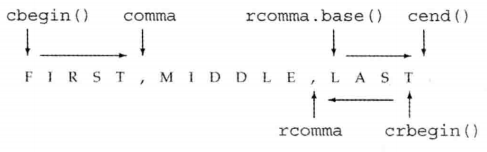

- [第十章 泛型算法](#第十章-泛型算法)
  - [1. 泛型算法的“泛型”指的是什么？](#1-泛型算法的泛型指的是什么)
  - [泛型算法 为什么可以做到 和容器剥离的？](#泛型算法-为什么可以做到-和容器剥离的)
  - [c++模板元编程和泛型编程是一个概念吗 ？有何异同？](#c模板元编程和泛型编程是一个概念吗-有何异同)
  - [泛型算法的操作基于什么？](#泛型算法的操作基于什么)
  - [C++对 算法库 在容器上的操作 有何限制？](#c对-算法库-在容器上的操作-有何限制)
      - [如何绕过这个限制？](#如何绕过这个限制)
  - [为什么算法不能（直接）添加或删除元素？](#为什么算法不能直接添加或删除元素)
  - [谓词](#谓词)
      - [(1)谓词是什么？](#1谓词是什么)
      - [(2) 谓词有哪几类？](#2-谓词有哪几类)
      - [(3) 谓词的作用？](#3-谓词的作用)
  - [lambda表达式](#lambda表达式)
      - [(1)什么是lambda表达式？](#1什么是lambda表达式)
      - [(2)lambda表达式的作用？（为什么需要 lambda表达式？）](#2lambda表达式的作用为什么需要-lambda表达式)
      - [(3)语法规则](#3语法规则)
      - [(4)语法分析](#4语法分析)
        - [① [捕获列表]](#-捕获列表)
          - [捕获列表的 隐式捕获 和 显示捕获](#捕获列表的-隐式捕获-和-显示捕获)
        - [② ( ) 参数列表](#---参数列表)
        - [③ mutable 或 exception 声明](#-mutable-或-exception-声明)
        - [④ -> 返回值类型](#---返回值类型)
        - [⑤ {} 函数体](#--函数体)
      - [(5) 哪些变量可以通过`捕获列表`来捕获？](#5-哪些变量可以通过捕获列表来捕获)
      - [(6) 捕获列表 和 参数列表 有何不一样？](#6-捕获列表-和-参数列表-有何不一样)
      - [(7) lambda表达式如何调用？](#7-lambda表达式如何调用)
      - [(8)为stable_sort()编写一个lambda表达式，完成按字符串的大小排正序](#8为stable_sort编写一个lambda表达式完成按字符串的大小排正序)
      - [(9)sz是一个表示大小的局部变量，用lambd表达式捕获它，并返回 字符串长度 比sz大 的第一个元素的位置](#9sz是一个表示大小的局部变量用lambd表达式捕获它并返回-字符串长度-比sz大-的第一个元素的位置)
      - [下面的代码的输出是什么？](#下面的代码的输出是什么)
        - [输出：](#输出)
        - [原因：](#原因)
      - [如果希望一部分变量采用值捕获，一部分采用引用捕获，应该怎么做？](#如果希望一部分变量采用值捕获一部分采用引用捕获应该怎么做)
      - [编写lambda表达式的时候应该遵守什么原则？](#编写lambda表达式的时候应该遵守什么原则)
      - [lambda表达式 和 mutable关键字](#lambda表达式-和-mutable关键字)
        - [在上面的代码中，为什么j的值为43，前面不是已经 将v1置为0了吗？](#在上面的代码中为什么j的值为43前面不是已经-将v1置为0了吗)
      - [既然编译器可以推断lambda表达式的返回值类型，那为什么还要自己指定返回值类型呢？](#既然编译器可以推断lambda表达式的返回值类型那为什么还要自己指定返回值类型呢)
      - [如何指定lambda表达式的返回值类型？](#如何指定lambda表达式的返回值类型)
      - [lambda表达式和普通函数的区别？](#lambda表达式和普通函数的区别)
  - [bind()函数](#bind函数)
      - [bind()函数的作用是什么？](#bind函数的作用是什么)
      - [适配器指的是啥？](#适配器指的是啥)
      - [bind()函数的一般形式是怎样的？](#bind函数的一般形式是怎样的)
      - [bind()函数中的_1、_2表示什么？](#bind函数中的_1_2表示什么)
      - [_1、_2定义在哪？](#_1_2定义在哪)
      - [bind() 的返回类型是什么？](#bind-的返回类型是什么)
      - [对于下面的代码，应该怎么调用呢？](#对于下面的代码应该怎么调用呢)
      - [在什么情况下需要使用bind()函数？](#在什么情况下需要使用bind函数)
      - [如何做到用下面的isShorter()函数对一个vector分别排 正序 和 倒序？](#如何做到用下面的isshorter函数对一个vector分别排-正序-和-倒序)
      - [对于那些不是占位符的参数，bind()函数是传值还是传引用？](#对于那些不是占位符的参数bind函数是传值还是传引用)
      - [下面的diamante有何问题？有的话怎么改？](#下面的diamante有何问题有的话怎么改)
  - [lambda表达式的原理](#lambda表达式的原理)
  - [C++有哪些迭代器？](#c有哪些迭代器)
  - [插入迭代器(insert iterator)](#插入迭代器insert-iterator)
      - [什么是插入迭代器？](#什么是插入迭代器)
      - [有哪些插入迭代器？](#有哪些插入迭代器)
      - [这几个插入迭代器是怎么工作的？](#这几个插入迭代器是怎么工作的)
      - [插入迭代器的使用有何限制？](#插入迭代器的使用有何限制)
      - [下面的代码的输出结果是？](#下面的代码的输出结果是)
  - [只有容器才有迭代器吗？](#只有容器才有迭代器吗)
  - [流迭代器(stream iterator)](#流迭代器stream-iterator)
      - [如何使用流迭代器？](#如何使用流迭代器)
    - [istream_iterator](#istream_iterator)
      - [istream_iterator操作](#istream_iterator操作)
      - [istream_iterator< int > int_it(cin)有何限制？](#istream_iterator-int--int_itcin有何限制)
      - [如何用流迭代器从标准输入读取数据，并存入一个vector?](#如何用流迭代器从标准输入读取数据并存入一个vector)
      - [如何使用算法操作 流迭代器？](#如何使用算法操作-流迭代器)
      - [如何判断哪些算法可以用于 流迭代器？](#如何判断哪些算法可以用于-流迭代器)
      - [istream_iterator 何时从它绑定的流读取数据？](#istream_iterator-何时从它绑定的流读取数据)
      - [ostream_iterator](#ostream_iterator)
        - [ostream_iterator支持的操作](#ostream_iterator支持的操作)
      - [创建ostream_iterator时，提供第二个参数需要注意什么？](#创建ostream_iterator时提供第二个参数需要注意什么)
      - [ostream_iterator必须绑定到一个流，不允许有空的或为空位置的ostream_iterator](#ostream_iterator必须绑定到一个流不允许有空的或为空位置的ostream_iterator)
      - [如何用ostream_iterator输出含int的vector，输出每个元素后换行？](#如何用ostream_iterator输出含int的vector输出每个元素后换行)
    - [用流迭代器处理类类型](#用流迭代器处理类类型)
  - [反向迭代器](#反向迭代器)
      - [反向迭代器和普通的迭代器有何不一样？](#反向迭代器和普通的迭代器有何不一样)
      - [哪些容器没有反向迭代器？](#哪些容器没有反向迭代器)
      - [什么样的容器才有反向迭代器？](#什么样的容器才有反向迭代器)
      - [如何获得反向迭代器？](#如何获得反向迭代器)
      - [为什么向sort传递一对反向迭代器可以实现vector按降序排序？](#为什么向sort传递一对反向迭代器可以实现vector按降序排序)
      - [反向迭代器和其它迭代器之间的关系是怎样的？](#反向迭代器和其它迭代器之间的关系是怎样的)
      - [如何将 反向迭代器 转为 普通迭代器？](#如何将-反向迭代器-转为-普通迭代器)
      - [将反向迭代器转换成普通迭代器后，两个迭代器指向的是相同的元素吗？为什么？](#将反向迭代器转换成普通迭代器后两个迭代器指向的是相同的元素吗为什么)
      - [如何使用反向迭代器输出"first,middle,last"输出最后一个单词(即"last")?](#如何使用反向迭代器输出firstmiddlelast输出最后一个单词即last)
  - [inserter、back_inserter 和 istream_iterator 有何区别？](#inserterback_inserter-和-istream_iterator-有何区别)
  - [5类迭代器](#5类迭代器)
      - [这5类迭代器是根据什么来分类的？](#这5类迭代器是根据什么来分类的)
      - [输入迭代器](#输入迭代器)
      - [输出迭代器](#输出迭代器)
      - [前向迭代器](#前向迭代器)
      - [双向迭代器](#双向迭代器)
      - [随机迭代器](#随机迭代器)
  - [算法形参模式](#算法形参模式)
      - [接受单个目标迭代器的算法](#接受单个目标迭代器的算法)
      - [接受第二个输入序列的算法](#接受第二个输入序列的算法)
  - [算法命名规范](#算法命名规范)
      - [一些算法使用重载形式传递一个谓词](#一些算法使用重载形式传递一个谓词)
      - [_if版本的算法](#_if版本的算法)
      - [区分拷贝元素的版本和不拷贝的版本](#区分拷贝元素的版本和不拷贝的版本)
  - [list 和 forward_list 的特定容器算法](#list-和-forward_list-的特定容器算法)
      - [哪些通用版本的 sort算法不能用于 list 和 forward_list ？为什么?](#哪些通用版本的-sort算法不能用于-list-和-forward_list-为什么)
      - [对于那些可以用于 list 和 forward_list 的通用算法，应优先 使用成员函数版本的 还是 通用版本的呢？为什么？](#对于那些可以用于-list-和-forward_list-的通用算法应优先-使用成员函数版本的-还是-通用版本的呢为什么)
      - [splice操作有通用版本吗？](#splice操作有通用版本吗)
      - [链表特有的操作 和 通用的版本 有何不一样的吗？](#链表特有的操作-和-通用的版本-有何不一样的吗)
  - [有一些算法会操作两个序列，但是它们只接受一个迭代器来表示第二个序列，这应该注意什么？](#有一些算法会操作两个序列但是它们只接受一个迭代器来表示第二个序列这应该注意什么)
  - [使用那些会写容器元素的算法时需要注意什么？](#使用那些会写容器元素的算法时需要注意什么)
  - [如何确认一个容器中是否包含一个特定的值？](#如何确认一个容器中是否包含一个特定的值)
  - [find_if()](#find_if)
  - [如何在指定区间查找？](#如何在指定区间查找)
  - [STL中的string容器的查找有几种？](#stl中的string容器的查找有几种)
  - [STL算法中的求和函数是哪个？怎么用？](#stl算法中的求和函数是哪个怎么用)
  - [accumulate()对第三个参数有何要求？](#accumulate对第三个参数有何要求)
  - [accumulate()怎么连接字符串？原理是？](#accumulate怎么连接字符串原理是)
      - [accumulate()连接字符串代码：](#accumulate连接字符串代码)
      - [accumulate()连接字符串原理](#accumulate连接字符串原理)
  - [accumulate()源码](#accumulate源码)
  - [equal()函数](#equal函数)
      - [(1) equal()的函数原型是怎样的？](#1-equal的函数原型是怎样的)
      - [(2) equal()函数 的原理是？](#2-equal函数-的原理是)
      - [(3) 使用equal()时需要注意什么？](#3-使用equal时需要注意什么)
  - [fill()算法怎么用？](#fill算法怎么用)
  - [string对象 与 char*对象 可以比较吗？](#string对象-与-char对象-可以比较吗)
  - [fill_n()](#fill_n)
      - [怎么用？](#怎么用)
      - [需要注意什么？](#需要注意什么)
      - [怎么避免误用？](#怎么避免误用)
  - [STL算法中查找序列最大值是哪个函数？怎么用？](#stl算法中查找序列最大值是哪个函数怎么用)
  - [sort()](#sort)
    - [sort()的原理是？](#sort的原理是)
      - [怎么给序列排正序？](#怎么给序列排正序)
    - [怎么给序列排倒序：](#怎么给序列排倒序)
  - [stable_sort()](#stable_sort)
      - [(1) stable_sort() 和 sort() 有何区别？](#1-stable_sort-和-sort-有何区别)
      - [(2) 为什么会有这样的区别？](#2-为什么会有这样的区别)
  - [copy()](#copy)
      - [(1)函数原型](#1函数原型)
      - [(2) 注意事项](#2-注意事项)
      - [(3) 内置数组的拷贝](#3-内置数组的拷贝)
      - [(4) 如何利用copy()将 一个vector的元素 复制(插入)到 另一个vector的 末尾？](#4-如何利用copy将-一个vector的元素-复制插入到-另一个vector的-末尾)
  - [replace() TODO:](#replace-todo)
  - [如何对一个vector进行去重？](#如何对一个vector进行去重)
  - [for_each算法 TODO:](#for_each算法-todo)
  - [](#)
      - [(1)](#1)
      - [(2)](#2)
      - [(3)](#3)
      - [(4)](#4)
      - [(5)](#5)
      - [(6)](#6)

# 第十章 泛型算法

## 1. 泛型算法的“泛型”指的是什么？
&emsp;&emsp; 标准库容器都有一组自己的操作，但标准库并没有给每个容器都定义成员函数来实现这些操作，而是提供了一组泛型（通用）的算法，这指的是它们可以用于不同类型的元素和多种容器类型。
&emsp;&emsp; 就拿find()来说，因为find()操作的是迭代器，也就是说find()函数不依赖于容器的类型


&emsp;
## 泛型算法 为什么可以做到 和容器剥离的？
&emsp;&emsp; 因为泛型算法操作的是迭代器，并调用容器内元素的操作符来实现相应的功能，就拿`accumulate()`算法来说，如果容器是`vector<int> `，那`accumulate()`算法将调用`int`的`+`运算符来实现累加，这样就实现了 算法 和 容器类型 的剥离。


&emsp;
## c++模板元编程和泛型编程是一个概念吗 ？有何异同？
&emsp;&emsp;**模板元编程** 侧重点在于用代码生成代码；
&emsp;&emsp;**泛型编程**  侧重点在于 减小代码对特定数据类型的依赖。


&emsp;
## 泛型算法的操作基于什么？
&emsp;&emsp;这里的泛型(generic)指的就是”通用“的意思，为了实现”通用“这一特性，每个泛型算法的实现都独立于单独的容器，并且不依赖于容器存储的元素类型，迭代器将算法和容器绑定起来。算法基于迭代器及其操作实现，而并非基于容器操作。


&emsp;
## C++对 算法库 在容器上的操作 有何限制？
&emsp;&emsp;算法可能改变，但算法决不修改容器的大小（不插入、不删除）
#### 如何绕过这个限制？
&emsp;&emsp;用插入迭代器


&emsp;
## 为什么算法不能（直接）添加或删除元素？
&emsp;&emsp;因为算法是对迭代器进行操作的，而增加（删除）元素会造成迭代器失效，所以不能。


&emsp;
## 谓词
#### (1)谓词是什么？
&emsp;&emsp; **谓词(predicate)** 是一个可调用的表达式，其 **返回结果** 是一个能作为条件的值。
#### (2) 谓词有哪几类？
&emsp;&emsp; 两类，分别是 **一元谓词(unary predicate)** 和 **二元谓词(binary predicate)**。所谓一元、二元指的是它们接受几个参数：一元谓词接受一个参数，二元谓词接受两个参数。
#### (3) 谓词的作用？
&emsp;&emsp;谓词是**用来传给特定的算法 以实现 定制操作**，比如很多算法都会比较输入序列中的元素，默认情况下，这些算法都会调用 元素类型的`<`或`==`来完成比较，但有的时候我们希望可以定义自己的比较规则，而这可以通过谓词来完成。
&emsp;&emsp;拿sort()函数来说，他有一个重载的函数，这个函数接受第三个参数，这个参数就是一个二元谓词，这个谓词会代替“<”进行比较，然后返回一个比较结果，sort()会根据这个比较结果进行排序，具体可以看后面关于sort()函数的笔记。


&emsp;
## lambda表达式
#### (1)什么是lambda表达式？
&emsp;&emsp;

#### (2)lambda表达式的作用？（为什么需要 lambda表达式？）
&emsp;&emsp; 我们都知道有一些算法可以通过传一个谓词来实现 定制操作，但谓词只能严格接收一个（一元谓词）或 两个参数（二元谓词），但有的时候我们需要传两个以上参数来实现需要的操作，此时就能通过 lambda表达式 来实现。
&emsp;&emsp; **也就是说lambda表达式可以打破谓词对参数数量的限制.**

#### (3)语法规则
```cpp
[捕获列表] (参数列表) mutable 或 exception 声明 -> 返回值类型 {函数体}
```
可以忽略括号和参数列表，此时相当于指定一个空参数列表；
**各个区域的作用：**
&emsp;&emsp; **捕获列表**是 lambda所在函数中 定义的局部变量的列表，也就是说是用来获取 lambda所在作用域的局部变量的。
&emsp;&emsp; 其它的如：参数列表、返回类型、函数体 的作用就和普通函数一样
**注意区分 捕获列表 和 参数列表 的作用：**
&emsp;&emsp; 简单的来说，**捕获列表**是用来捕获lambda所在作用用中的局部变量的 ，而**参数列表**是调用时传进去的参数，就和普通函数的参数列表一样。
#### (4)语法分析
##### ① [捕获列表] 
&emsp;&emsp;这部分标识一个 Lambda 表达式的开始，这部分必须存在，不能省略！
###### 捕获列表的 隐式捕获 和 显示捕获
&emsp;&emsp;显示捕获：`[&str]`(按**引用捕获** str)、`[str]`(按**值*捕获* str
&emsp;&emsp;隐式捕获：`[&]`(按**引用捕获**所有可见的局部变量)、`[=]`(按**值捕获**所有可见的局部变量)
&emsp;&emsp;捕获列表是传递给编译器自动生成的函数对象类的构造函数的。捕获列表只能使用那些到定义 Lambda 为止时 Lambda 所在作用范围内可见的非static局部变量(包括 Lambda 所在类的 this),**非static局部变量，如：静态变量(包括局部静态变量)、全局变量等可以不经捕获，直接使用**。
**也就是说，捕获列表是用来捕获 局部变量 的**，捕获列表有以下形式：

| 形式    | 解释                                                                                                                                                                  |
| ------- | --------------------------------------------------------------------------------------------------------------------------------------------------------------------- |
| 空      | 没有任何捕获列表。                                                                                                                                                    |
| =       | 隐式捕获，函数体内可以使用 Lambda 所在范围内所有可见的局部变量（包括 Lambda 所在类的 this），并且是值传递方式（相当于编译器自动为我们按值传递了所有局部变量）。       |
| &       | 隐式捕获，函数体内可以使用 Lambda 所在范围内所有可见的局部变量（包括 Lambda 所在类的 this），并且是引用传递方式（相当于是编译器自动为我们按引用传递了所有局部变量）。 |
| this    | 函数体内可以使用 Lambda 所在类中的成员变量。                                                                                                                          |
| a       | 。将 a 按值进行传递。按值进行传递时，函数体内不能修改传递进来的 a 的拷贝，因为默认情况下函数是 const 的，要修改传递进来的拷贝，可以添加 mutable 修饰符。              |
| &a      | 将 a 按引用进行传递。                                                                                                                                                 |
| a,&b    | 将 a 按值传递，b 按引用进行传递。                                                                                                                                     |
| =,&a,&b | 。除 a 和 b 按引用进行传递外，其他参数都按值进行传递。                                                                                                                |
| &,a,b   | 除 a 和 b 按值进行传递外，其他参数都按引用进行传递。                                                                                                                  |
##### ② ( ) 参数列表
&emsp;&emsp; 与一个普通函数的调用类似，调用一个lambda时给定的实参将被用来初始化lambda形参，但lambda不能有默认实参！
&emsp;&emsp; 如果没有参数，那这部分可以省略。
&emsp;&emsp; 参数可以通过按值（如: (a, b)）和按引用 (如: (&a, &b)) 两种方式进行传递。
##### ③ mutable 或 exception 声明
&emsp;&emsp;这部分可以省略。按值传递捕获列表时，加上 mutable 修饰符后，可以修改传递进来的拷贝（注意是能修改拷贝，而不是值本身）。exception 声明用于指定函数抛出的异常，如抛出整数类型的异常，可以使用 throw(int)。
##### ④ -> 返回值类型
&emsp;&emsp;可以忽略返回类型，lambda会根据函数体中的代码推断出返回类型，如果只有一个return语句的话，则从返回的值推断返回类型，否则返回void类型；
##### ⑤ {} 函数体
&emsp;&emsp;标识函数的实现，这部分不能省略，但函数体可以为空。
#### (5) 哪些变量可以通过`捕获列表`来捕获？
所有定义 Lambda 为止时 Lambda 所在作用范围内可见的非static局部变量；
非static局部变量(如：静态变量(包括局部静态变量))、全局变量等可以不经捕获，直接使用。

#### (6) 捕获列表 和 参数列表 有何不一样？
**捕获列表** 是用来捕获lambda所在作用域的局部变量的（非static局部变量）；
**参数列表** 类似于普通函数的参数列表，它是用来传递参数的，而参数可能是 全局变量，因此不能用捕获列表来捕获。

#### (7) lambda表达式如何调用？
&emsp;&emsp;和普通函数一样，也是使用 调用运算符：
```cpp
auto f = [] { return 42; }; //不接受参数，返回42
auto j = f();
cout << j << endl;        // prints 42
```

#### (8)为stable_sort()编写一个lambda表达式，完成按字符串的大小排正序
```cpp
// 将lambda表达式作为第三个参数传进去就行了
stable_sort(words.begin(), words.end(), [](const string &a, const string &b){return a.size() < b.size();});
```
#### (9)sz是一个表示大小的局部变量，用lambd表达式捕获它，并返回 字符串长度 比sz大 的第一个元素的位置
```cpp
vector<string>::size_type sz;
// get an iterator to the first element whose size() is >= sz
auto wc = find_if(words.begin(), words.end(),
                    [sz](const string &a)
                        { return a.size() >= sz; });
```

#### 下面的代码的输出是什么？
```cpp
int main()
{
    int j = 1;
    auto by_val_lambda = [=]{ return j + 1; }; // 捕获列表里的“=”表示捕获当前作用域的所有局部变量，并按 值传递
    auto by_ref_lambda = [&]{ return j + 1; }; // 捕获列表里的“&”表示捕获当前作用域的所有局部变量，并按 引用传递
    auto print = [=]{
        cout << "print by val lambda: " << by_val_lambda() << ", ";
        cout << "print by ref lambda: " << by_ref_lambda() << endl;
    };

    print();

    j += 10; 
    print();

    return 0;
}
```
##### 输出：
```cpp
print by val lambda: 2
print by ref lambda: 2
print by val lambda: 2
print by ref lambda: 12
```
##### 原因：
&emsp;&emsp;by_val_lambda 是通过值传递捕捉的变量 j，所以这个变量在其内部的值永远是 1，所以不论何时调用这个函数都会返回 2。
&emsp;&emsp;而 by_ref_lambda 是通过引用传递捕捉的变量 j，所以内部的值会随着外部的使用而发生变化，所以在 j += 10 之后，显然会返回 12。

#### 如果希望一部分变量采用值捕获，一部分采用引用捕获，应该怎么做？
混用隐式捕获 和 显示捕获的时候，必须注意下面几点：
&emsp;&emsp;① 捕获列表第一个必须是 & 或 =
&emsp;&emsp;② 显示捕获的变量必须使用与隐式捕获不同的方式，即 [&， &str]是不合法的。
```cpp
void func(vector<string> &words, vector<string>::size_type sz, ostream &os=cout, string str="")
{
    // os按隐式捕获（即引用捕获），str按值捕获。
    for_each(words.begin(), words.end(), [&, str](const string &s){os << s << endl;});

}
```

#### 编写lambda表达式的时候应该遵守什么原则？
&emsp;&emsp;在捕获一个指针、迭代器 或者 按引用捕获 时，确保在lambda表达式执行的时候绑定到迭代器、指针或者引用的对象还存在。
&emsp;&emsp;一般来说，应该尽量减少捕获的数据量，来避免潜在的捕获导致的问题，而且如果可能的话，尽量避免捕获指针或引用。
&emsp;&emsp;对于那种只在一两个地方使用的简单操作，lambda表达式是最好用的。如果我们需要在很多地方使用相同的操作，通常应该定义一个函数，而不是多次编写相同的lambda表达式

#### lambda表达式 和 mutable关键字
对于一个**被值捕获**的变量，lambda表达式如果尝试改变它的值，则会报错：
```cpp
void fcn3()
{
    size_t v1 = 42; 
    auto f = [v1] () { return ++v1; };
    v1 = 0;
    auto j = f(); 
}

上面的代码报错如下：
    test.cpp: In lambda function:
    test.cpp:10:33: error: increment of read-only variable ‘v1’
        auto f = [v1] () { return ++v1; };
                                    ^
```
在lambda表达式中添加mutable关键字后顺利通过编译：
```cpp
void fcn3()
{
    size_t v1 = 42; // local variable
    auto f = [v1] () mutable { return ++v1; }; // 添加了 mutable，下载可以改变值传递的变量了
    v1 = 0;
    auto j = f(); 
    cout << j << endl; // j is 43
}
```
##### 在上面的代码中，为什么j的值为43，前面不是已经 将v1置为0了吗？
&emsp;&emsp;因为v1是值传递的，f在捕获v1的时候是42，到了后面即使执行了 v1 = 0，也对它没影响，如果想通过改变v1的值来影响lambda表达式的话，需要用 引用捕获：
```cpp
void fcn4()
{
    size_t v1 = 42; // local variable
    auto f2 = [&v1] { return ++v1; }; // 这里v1是 引用捕获
    v1 = 0;         // 会影响lambda表达式
    auto j = f2();  
    cout << j << endl; // j is 1
}
```
#### 既然编译器可以推断lambda表达式的返回值类型，那为什么还要自己指定返回值类型呢？
&emsp;&emsp;默认情况下，如果一个 lambda体内包含 return之外的任何语句，则编译器会假定此lambda返回void，和函数一样，被编译器推断为void的lambda表达式不允许返回值。
下面的代码的本意是 将序列vi的所有负数替换为其绝对值：
```cpp
// 错误: 编译器推断出下面的lambda表达式返回void，但它返回了一个int值
transform(vi.begin(), vi.end(), vi.begin(),
			[](int i) 
			{ if (i < 0) return -i; else return i;
});
```
#### 如何指定lambda表达式的返回值类型？
对于上面transform()函数的调用，应该像下面这样指定返回值类型：
```cpp
transform(vi.begin(), vi.end(), vi.begin(), 
			[](int i) -> int 
			{ if (i < 0) return -i; else return i; });
```
#### lambda表达式和普通函数的区别？


&emsp;
## bind()函数
#### bind()函数的作用是什么？
&emsp;&emsp;bind()函数相当于一个函数适配器，主要是进行参数绑定。
&emsp;&emsp;bind()函数接受一个可调用对象以及参数列表来生成一个新的可调用对象，从而达到 更改 参数顺序 以及 参数数量 的目的
#### 适配器指的是啥？
&emsp;&emsp;现在MacBook已经不带usb接口了，如果你想用usb接口的u盘插到MacBook上，那你就要用一个合适的转接头才行，这个转接头就是一个适配器。
#### bind()函数的一般形式是怎样的？
```cpp
auto newCallable = bind(callable, arg_list)
```
&emsp;&emsp;**newCallable**本身是一个可调用的对象；
&emsp;&emsp;**arg_list**是一个逗号分隔的参数列表，对应给定的callable的参数。即，当我们调用newCallable时，newCallable会调用callable，并传给它 arg_list中的参数。
#### bind()函数中的_1、_2表示什么？
&emsp;&emsp;**arg_list中可能包含形如`_n`的名字**，其中n是一个整数，这些参数是 `占位符`，表示newCallable的参数，它们占据了传递给newCallable的参数的“位置”。数值n表示生成的可调用对象中参数的位置：_1表为newCallable的第一个参数， _2为第二个参数？
&emsp;&emsp;_1、_2表示调用时要传进去的参数，举个例子：
```cpp
double my_divide (double x, double y) {return x/y;}
auto fn_half = std::bind(my_divide,_1, 2);
```
对于上面的bind()函数，它接收三个参数：
| 参数       | 解释                                                                          |
| ---------- | ----------------------------------------------------------------------------- |
| 第一个参数 | my_divide，表示fn_half绑定的是my_divide()函数；                               |
| 第二个参数 | 占位符_1，表示fn_half接收的第一个参数，它用来初始化my_divide()的第一个参数x； |
| 第二个参数 | 数值2，它用来初始化my_divide()的第二个参数y；                                 |
#### _1、_2定义在哪？
定义在命名空间placeholders中，可使用声明语句：
```cpp
using namespace std::placeholders;
```
#### bind() 的返回类型是什么？
&emsp;&emsp;返回一个可调用对象，一般用auto来简化操作。
TODO: 
#### 对于下面的代码，应该怎么调用呢？
```cpp
bool istarget(const string& s, int sz){
    return s.size() < sz;
}
auto istarget_bind = bind(istarget, _1, 2);
```
应该这样调用：
```cpp
string str = "test";
// istarget_bind()会自动调用istarget，str会用来初始化参数s，而参数sz则为 2
istarget_bind(str)
```
#### 在什么情况下需要使用bind()函数？
&emsp;&emsp;对于那种只在一两个地方使用的简单操作，lambda表达式是最好用的。如果我们需要在很多地方使用相同的操作，通常应该定义一个函数，而不是多次编写相同的lambda表达式，例如我们用find_f()调用lambda比较一个string和一个给定大小：
```cpp
find_if(words.begin(),words.end(),[sz](const string &a){return a.size()>= sz;}); 
```
我们可以很容易的编写一个完成同样工作的函数check_size()：
```cpp
bool check_size(const string &s, string::size_type sz)
{
    return s.size() >= sz;
}
```
但是，我们不能用这个函数作为find_if()的一个参数，**因为find_if()接受的是是一个一元谓词**，此时可以考虑bind函数，使用bind，我们可以将原来基于lambda的find_if()调用：
```cpp
auto wc = find_if(words.begin(),words.end(),bind(check_size,_1,sz));
```
#### 如何做到用下面的isShorter()函数对一个vector分别排 正序 和 倒序？
```cpp
bool isShorter(const string &s1, const string &s2){
    return s1.size() < s2.size();
}
```
用bind()函数改变参数顺序即可：
```cpp
vector<string>words{"Hello", "everybody", "I", "am", "jack", "!"}；
sort(words.begin(), words.end(), isShorter); // 正序
sort(words.begin(), words.end(), bind(isShorter, _2, _1)); // 倒序
```
#### 对于那些不是占位符的参数，bind()函数是传值还是传引用？
&emsp;&emsp;默认情况下，那些不是占位符的参数，bind()函数是传值（即将其拷贝到bind返回的可调用对象中的）
#### 下面的diamante有何问题？有的话怎么改？
```cpp
ostream &print(ostream &os, const string &s, char c)
{
    return os << s << c;
}

for_each(words.begin(), words.end(), bind(print, os, _1, ' '));
```
**问题**
&emsp;&emsp; 错误，默认情况下，对于那些不是占位符的参数，bind()函数是传值，而流类型是不能拷贝的
**修改**
&emsp;&emsp; 如果我们希望**以引用的方式**传递给bind()一个对象，我们应该使用标准库的ref()函数：
```cpp
for_each(words.begin(), words.end(), bind(print, ref(os), _1, ' '));
```


&emsp;
## lambda表达式的原理
&emsp;&emsp; lambda表达式是C++11中引入的一项新技术，利用lambda表达式可以编写内嵌的匿名函数，用以替换独立函数或者函数对象，并且使代码更可读。但是从本质上来将，lambda表达式只是一种语法糖，因为所有其能完成的工作都可以用其它稍微复杂的代码来实现。但是它简便的语法却给C++带来了深远的影响。
其它笔记见 第十四章


&emsp;
## C++有哪些迭代器？
(1) 正常的迭代器
(2) 插入迭代器
(3) 流迭代器
(4) 反向迭代器
(5) 移动迭代器


&emsp;
## 插入迭代器(insert iterator)
#### 什么是插入迭代器？
&emsp;&emsp;插入迭代器是一种迭代器适配器，它接收一个容器，生成一个迭代器，能实现向给定容器添加元素，比如：
```cpp

```
#### 有哪些插入迭代器？
| 迭代器         | 作用                                                                                                                                                           |
| -------------- | -------------------------------------------------------------------------------------------------------------------------------------------------------------- |
| back_inserter  | 创建使用 push_back 实现插入的迭代器。                                                                                                                          |
| front_inserter | 使用 push_front 实现插入。                                                                                                                                     |
| inserter       | 使用 insert 实现插入操作。除了所关联的容器外，inserter还带有第二实参：指向插入起始位置的迭代器。值得注意的是，inserter不管插入多少元素，总会指向最开始的位置。 |
#### 这几个插入迭代器是怎么工作的？
&emsp;&emsp;back_inserter和front_inserter分别调用push_back()和push_front()进行工作的，它们的工作原理显而易见。
&emsp;&emsp;对于inserter，它插入到给定迭代器所表示的元素前面：
```cpp
*it = val;

// 如果上面的迭代器it是一个inserter，则上面那一行代码和下面两行代码等价：

it = c.insert(it, val);// 将val插到迭代器it前面；
++it;// 递增迭代器it，此时it指向了插入val之前的位置；
```
#### 插入迭代器的使用有何限制？
| 迭代器         | 限制                                                                                    |
| -------------- | --------------------------------------------------------------------------------------- |
| front_inserter | 只有在容器支持push_front()的情况下，我们才能使用；也就是说vector不支持）                |
| back_inserter  | 对应的，只有在容器支持push_back()的情况下，我们才能使用；（也就是说forward_list不支持） |
#### 下面的代码的输出结果是？
```cpp
list<int> 1st = {1,2,3,4};
list<int> lst2, lst3; // empty lists
copy(1st.cbegin(), lst.cend(), front_inserter(lst2));
copy(1st.cbegin(), lst.cend(), inserter(lst3, lst3.begin()));
```
结果：
&emsp;&emsp;1st2 ： 4 3 2 1
&emsp;&emsp;1st3 ： 1 2 3 4，因为inserter它是插入到给定迭代器所表示的元素前面，而且每次插入之后都会重新指向它原先指向的位置


&emsp;
## 只有容器才有迭代器吗？
&emsp;&emsp;不是，标准库为流也定义了迭代器。


&emsp;
## 流迭代器(stream iterator)
&emsp;&emsp;
#### 如何使用流迭代器？
&emsp;&emsp;使用流迭代器时必须指定 迭代器将要读写的对象 的类型：
```cpp
istream_iterator<int> int_it(cin);          // 只能读int
ostream_iterator<int> out_iter(cout, " ");  // 只能写int
```
### istream_iterator
#### istream_iterator操作
| 操作                          | 说明                                                                                               |
| ----------------------------- | -------------------------------------------------------------------------------------------------- |
| istream_iterator< T > in(is); | in 从输入流 is 读取类型 T 的值。                                                                   |
| istream_iterator< T > end;    | 读取类型 T 的值的 istream_iterator 的尾后迭代器。                                                  |
| in1 == in2                    | in1 和 in2 必须读取相同类型。如果它们都是尾后迭代器或绑定相同的输入流，则相等。                    |
| in1 != in2                    | 同上                                                                                               |
| *in                           | 返回从流中读取的值。                                                                               |
| in->mem                       | 同 (*in).mem                                                                                       |
| ++in, in++                    | 使用元素类型的 >> 操作符从输入流中读取下一个值。前置版本返回递增后迭代器的引用，后置版本返回旧值。 |

#### istream_iterator< int > int_it(cin)有何限制？
&emsp;&emsp;它只能读取int类型，如果读到不是int类型的数据，将会返回eof。
#### 如何用流迭代器从标准输入读取数据，并存入一个vector?
**方法一：**
```cpp
istream_iterator<int> int_it(cin);
istream_iterator<int> int_eof;
while(int_it != int_eof){
    // 1.后置++运算符将int_it递增，但是返回的是旧值；
    // 2. 因为后置++运算符返回的是旧值，解引用int_it后得到的是旧值。
    vec.push_back(*int_it++);  
}
```
**方法二：**
```cpp
istream_iterator<int> int_it(cin), int_eof;
vector<int>vec(int_it, int_eof); // 直接构造vector
```
#### 如何使用算法操作 流迭代器？
和其它的一样,比如：
```cpp
istream_iterator<int> int_it(cin), int_eof;
int sum = accumulate(int_it, int_eof, 0);
```
#### 如何判断哪些算法可以用于 流迭代器？
TODO:
#### istream_iterator 何时从它绑定的流读取数据？
&emsp;&emsp;istream_iterator允许使用懒惰求值：并不保证在创建迭代器时立刻从流中读取值，保证在第一次解引用迭代器之前，从流中读取数据的操作已经完成。
#### ostream_iterator
##### ostream_iterator支持的操作
| 操作                           | 说明                                                                                |
| ------------------------------ | ----------------------------------------------------------------------------------- |
| ostream_iterator<T> out(os);   | out 将类型 T 的值写入输出流 os。                                                    |
| ostream_iterator<T> out(os,d); | out 将类型 T 的值后加上 d，写入输出流 os。d 指向一个空字符结尾的字符串数组。        |
| out = val                      | 使用 << 操作符将 val 写入 out 绑定的 ostream。val 的类型必须与 out 可写的类型兼容。 |
| *out, ++out, out++             | 这些操作存在，但不对 out 作任何事。每个操作都返回 out。                             |
#### 创建ostream_iterator时，提供第二个参数需要注意什么？
&emsp;&emsp;ostream_iterator的第二个参数必须为一个C风格字符串。
```cpp
ostream_iterator<int> out(cout, endl); // 错误，ostream_iterator的第二个参数必须为一个C风格字符串。
```
#### ostream_iterator必须绑定到一个流，不允许有空的或为空位置的ostream_iterator
TODO:
#### 如何用ostream_iterator输出含int的vector，输出每个元素后换行？
错误：
```cpp
#include<iostream>
#include<vector>
#include<iterator>

using namespace std;

int main ()
{
    vector<int>vec{1,2,3,4,5,6,7};
    ostream_iterator<int> out(cout, endl); // 错误，ostream_iterator的第二个参数必须为一个C风格字符串。

    for(auto e : vec)
        *out++ = e;

    return 0;

}
```
正确：
```cpp
#include<iostream>
#include<vector>
#include<iterator>

using namespace std;

int main ()
{
    vector<int>vec{1,2,3,4,5,6,7};
    ostream_iterator<int> out(cout, "\n");

    for(auto e : vec)
        *out++ = e;

    return 0;

}
```
### 用流迭代器处理类类型
&emsp;&emsp;我们可以为任何定义了输入运算符(>>)的类型创建istream_iterator对象；类似的，只要类型有输出运算符(<<)，我们就可以为其定义ostream_iterator。


&emsp;
## 反向迭代器
#### 反向迭代器和普通的迭代器有何不一样？
&emsp;&emsp;递增一个反向迭代器(++it)会移动到前一个元素。
#### 哪些容器没有反向迭代器？
&emsp;&emsp;forward_list没有；
#### 什么样的容器才有反向迭代器？
&emsp;&emsp;只有迭代器既支持++操作，也支持--操作的容器才有反向迭代器，forward_list的迭代器没有--操作，因此它没有反向迭代器。流也没有，因为流不支持--操作。
#### 如何获得反向迭代器？
调用rbegin、rend、crbegin、crend成员函数获得：
```cpp
vector<int>vec = {0,1,2,3,4,5,6,7,8,9};
vector<int>::reverse_iterator rit = vec.rbegin();
```
#### 为什么向sort传递一对反向迭代器可以实现vector按降序排序？
&emsp;&emsp;sort不知道传入的什么迭代器。它认为传入的第一个就是数组起始，第二个是数组结尾。它只负责把数据从开始到结尾从小到大排序而已，而反向迭代器是从结尾开始的，因此sort会从结尾开始向前排正序，因此从开头看是倒序。
#### 反向迭代器和其它迭代器之间的关系是怎样的？

`vec.rbegin()` 指向的是容器的最后一个元素，而 `vec.end()` 指向的是尾后(最后一个元素的后面)；
`vec.rend()` 指向的是容器的第一个元素前面的位置(该位置没有元素)，而 `vec.begin()` 指向的是容器的第一个元素
#### 如何将 反向迭代器 转为 普通迭代器？
使用reverse_iterator的base成员来完成。
#### 将反向迭代器转换成普通迭代器后，两个迭代器指向的是相同的元素吗？为什么？
不是指向相同的元素，如果反向迭代器 r_itr 指向的是第6个元素，则 r_itr.base()将指向第7个元素(正序)：

```cpp
vector<int>vec = {0,1,2,3,4,5,6,7,8,9};
vector<int>::reverse_iterator r_itr = vec.rbegin() + 5; // 指向元素 5
auto itr = r_itr.base() // 指向元素 6
```
#### 如何使用反向迭代器输出"first,middle,last"输出最后一个单词(即"last")?
先使用反向迭代器
```cpp
string line = "first,middle,last";
auto comma = find(line.crbegin(), line.crend(), ','); // 找到最后一个逗号
cout << string(line.crbegin(), rcomma) << endl; // 输出 tsal
cout << string(rcomma.base(), line.cend()) << endl; // 输出 
```


    
&emsp;
## inserter、back_inserter 和 istream_iterator 有何区别？
&emsp;&emsp;back_inserter等是插入器，它们的返回值是迭代器；而istream_iterator和ostream_iterator本身就是迭代器，它们是模板类。

 

&emsp;
## 5类迭代器
&emsp;&emsp;任何算法的最基本的特性是它要求其迭代器提供哪些操作。某些算法，如find，只要求通过迭代器访问元素、递增迭代器以及比较两个迭代器是否相等这些能力。其他一些算法，如sort，还要求读、写和随机访问元素的能力。算法所要求的迭代器操作可以分为5个迭代器类别，如表所示：
| 迭代器类别     | 要求                                 |
| -------------- | ------------------------------------ |
| 输入迭代器     | 只读，不写；单遍扫描，只能递增       |
| 输出迭代器     | 只写，不读；单遍扫描，只能递增       |
| 前向迭代器     | 可读写；多遍扫描，只能递增           |
| 双向迭代器     | 可读写；多遍扫描，可递增递减         |
| 随机访问迭代器 | 可读写；多遍扫描，支持全部迭代器运算 |

类似于容器，迭代器也定义了一组公共操作，一些操作所有迭代器都支持，另外一些只有特定类别的迭代器才支持。例如，ostream_iterator只支持递增、解引用和赋值。vector、string和deque的迭代器除了这些操作外，还支持递减、关系和算术运算。

#### 这5类迭代器是根据什么来分类的？
迭代器是按它们所提供的操作来分类的，而这种分类形成了一种层次。**除了输出迭代器之外**，一个高层类别的迭代器支持底层类别迭代器的所有操作。

#### 输入迭代器
&emsp; 输入迭代器可以读取序列中的元素。一个输入迭代器必须支持下面的操作：
>&emsp; 用于比较两个迭代器的相等和不相等运算符（==、！=）
&emsp; 用于推进迭代器的前置和后置递增运算（++）
&emsp; 用于读取元素的解引用运算符（*）；解引用只会出现在赋值运算符的右侧
&emsp; 箭头运算符（->），等价于（*it）.member，即，解引用迭代器，并提取对象的成员

&emsp;&emsp; 输入迭代器只用于顺序访问。对于一个输入迭代器，*it++保证是有效的，但递增它可能导致所有其他指向流的迭代器失效。其结果就是，不能保证输入迭代器的状态可以保存下来并用来访问元素。因此，输入迭代器只能用于单遍扫描算法。算法find和accumulate要求输入迭代器；而istream_iterator是一种输入迭代器。

#### 输出迭代器
&emsp; 输出迭代器可以看做是输入迭代器功能上的补集——只写而不读元素。输出迭代器必须支持
>用于推进迭代器的前置和后置递增运算（++）
解引用运算符（*），只能出现在赋值运算符的左侧（向一个已经解引用的输出迭代器赋值，就是将值写入它所指向的元素）

&emsp; &emsp; 我们只能向一个输出迭代器赋值一次。类似输入迭代器，输出迭代器只能用于单遍扫描算法。用作目的位置的迭代器通常都是输出迭代器。例如，copy函数的第三个参数就是输出迭代器。ostream_iterator类型也是输出迭代器。

#### 前向迭代器
&emsp;&emsp;前向迭代器可以读元素。这类迭代器只能在序列中沿一个方向移动。前向迭代器支持所有输入和输出迭代器的操作，而且可以多次读写同一个元素。因此，我们可以保存前向迭代器的状态（因为只能向前移动，所以要保存，以便后面继续扫描），使用前向迭代器的算法可以对序列进行多遍扫描。算法replace要求前向迭代器，**forward_list上的迭代器就是前向迭代器**。

#### 双向迭代器
&emsp;&emsp; 双向迭代器可以正向/反向读写序列中的元素。除了支持所有前向迭代器的操作之外，双向迭代器还支持前置和后置递减运算符（--）。算法reverse要求双向迭代器，除了forward_list之外，其他标准库都提供符合双向迭代器要求的迭代器。

#### 随机迭代器
&emsp;&emsp; 随机访问迭代器：提供在常量时间内访问序列中的任意元素的能力。此类迭代器支持双向迭代器的所有功能，此外还支持如下的操作：
>用于比较两个迭代器相对位置的关系运算符（<、<=、>和>=）
迭代器和一个整数值的加减运算（+、+=、-和-=），计算结果是迭代器在序列中前进（或后退）给定整数个元素后的位置
用于两个迭代器上的减法运算符（-）得到两个迭代器的距离
下标运算符（iter[n]，与*（iter[n]）等价

&emsp;&emsp;算法sort要求随机访问迭代器，array、deque、string和vector的迭代器都是随机访问迭代器，用于访问内置数组元素的指针也是。


&emsp;
&emsp;
## 算法形参模式
在任何其他算法分类之上，还有一组参数规范。大多数算法具有如下4种形式之一：
```cpp
alg(beg,end,other args);
alg(beg,end,dest,other args);
alg(beg,end,beg2,other args);
alg(beg,end,beg2,end2,other args);
```
其中**alg**是算法的名字，**beg和end**表示算法所操作的输入范围。几乎所有算法都接受一个输入范围，是否有其他参数依赖于要执行的操作。这里列出了常见的一种——**dest、beg2和end2**，都是迭代器参数。顾名思义，如果用到了这些迭代器参数，它们分别承担指定目的位置和第二个范围的角色。除了这些迭代器参数，一些算法还接受额外的、非迭代器的特定参数。
#### 接受单个目标迭代器的算法
&emsp;&emsp;dest参数是一个表示算法可以写入的目的位置的迭代器。
> &emsp;&emsp;向输出迭代器写数据的算法都假定目标空间足以容纳写入的数据，因此使用者必须自己保证迭代器dest指向的空间足够，要不然容易溢出。

&emsp;&emsp;如果dest是一个直接指向容器的迭代器，那么算法将输出数据写到容器中已存在的元素内。
&emsp;&emsp;**更常见的情况是**，dest被绑定到一个 插入迭代器 或是一个 ostream_iterator。插入迭代器会将新元素添加到容器中，因而保证空间是足够的。ostream_iterator会将数据写入一个输出流，同样不管要写多少个元素都没有问题。
#### 接受第二个输入序列的算法
&emsp;&emsp;接受单独的beg2或是接受beg2和end2的算法用这些迭代器表示第二个输入范围。这些算法通常使用第二个范围中的元素与第一个输入范围结合来进行一些运算。

 

&emsp;
&emsp;
## 算法命名规范
&emsp;&emsp;除了参数规范，算法还遵循一套命名和重载规范。这些规范处理诸如：如何提供一个操作代替默认的`<`或 `=` 运算符以及算法是将输出数据写入输入序列还是一个分离的目的位置等为题。
#### 一些算法使用重载形式传递一个谓词
&emsp;&emsp;接受谓词参数来代替`<`或`==`运算符的算法，以及那些不接受额外参数的算法，通常都是重载的函数。函数的一个版本用元素类型的运算符来比较元素；另一个版本接受一个额外谓词参数，来代替<或==：
```cpp
unique(beg,end);  //使用元素类型的运算符(即==运算符)比较元素
unique(beg,end,comp); 　　//使用comp比较元素
```
&emsp;&emsp;两个调用都重新整理给定序列，将相邻的重复元素删除。第一个调用使用元素类型的==运算符来检查重复元素；第二个则调用comp来确定两个元素是否相等。由于两个版本的函数在参数个数上不相等，因此具体应该调用那个不会产生歧义。
#### _if版本的算法
&emsp;&emsp;**接受一个元素值的算法通常有另一个不同名的版本，该版本接受一个谓词代替元素值。接受谓词参数的算法都有附加_if前缀**：
```cpp
find(beg,end,val); //查找输入范围中val第一次出现的位置
find_if(beg,end,pred);  //查找第一个令pred为真的元素
```
&emsp;&emsp;这两个算法都在输入范围中查找特定的元素第一次出现的位置。算法find查找一个指定值；算法find_if查找使得pred返回非零值的元素。
&emsp;&emsp;这两个算法提供了命名上的差异的版本，而非重载版本，因为两个版本的算法都接受相同数目的参数。因此可能产生重载歧义，虽然很罕见，但为了避免任何可能的歧义，标准库提供不同名字的版本而不是重载。
#### 区分拷贝元素的版本和不拷贝的版本
&emsp;&emsp;**默认情况下，重排元素的算法将重排后的元素写回固定的输入序列中。这些算法还提供另一个版本，将元素写到一个指定的输出目的位置。如我们所见，写到额外目的空间的算法都在名字后面附加一个_copy**：
```cpp
reverse(beg,end); //反转输入范围中元素的顺序
reverse_copy(beg,end,dest); //将元素按逆序拷贝到dest
```
**一些算法同时提供_copy和_if版本。这些版本接受一个目的位置迭代器和一个谓词：**
```cpp
//从v1中删除奇数元素
remove_if(v1.begin(),v1.end(), [](int i) {return i%2;});

//将偶数元素从v1拷贝到v2；v1不变
remove_copy_if(v1.begin(),v1.end(),back_inserter(v2), [](int i) {return i%2;});
```
两个算法都调用了lambda来确定元素是否为奇数。在第一个调用中，我们从输入序列中将奇数元素删除。在第二个调用中，我们将非奇数（即偶数）元素从输入范围拷贝到v2中。


## list 和 forward_list 的特定容器算法
#### 哪些通用版本的 sort算法不能用于 list 和 forward_list ？为什么?
&emsp;&emsp;通用版本的 sort、merge、remove、reverse和unique 算法不能用于 list 和 forward_list 
&emsp;&emsp;因为这些算法要求随机访问迭代器，而它俩没有随机访问迭代器，list提供的是双向对得起，而 forward_list是提供前向迭代器，因此需要为它们**分别提供**特殊的sort算法。
#### 对于那些可以用于 list 和 forward_list 的通用算法，应优先 使用成员函数版本的 还是 通用版本的呢？为什么？
&emsp;&emsp; 链表类型定义的其他算法的通用版本可以用于链表，但代价太高。这些算法需要交换输入序列中的元素。一个链表可以通过改变元素间的链接而不是真正的交换它们的值来传递“交换”元素。因此，这些链表版本的算法的性能比对应的通用版本好很多，因此，对于list和forward_list 应该优先使用成员函数版本的算法而不是通用算法。

**注意**： 这些操作都返回void
| 成员函数             | 功能                                                                                                                            |
| -------------------- | ------------------------------------------------------------------------------------------------------------------------------- |
| lst.merge(lst2)      | 将来自lst2的元素合并入lst。lst和lst2都必须是有序的。元素将从lst2中删除。在合并之后，lst2变为空，此版本使用使用`<`运算符进行比较 |
| lst.merge(lst2,comp) | 此版本使用给定的 comp 比较操作                                                                                                  |
| lst.remove(val)      | 调用erase删除掉与给定值相等(`==`)的每个元素                                                                                     |
| lst.remove_if(pred)  | 调用erase删除掉令一元谓词pred为真的每个元素                                                                                     |
| lst.reverse()        | 反转lst中元素的序                                                                                                               |
| lst.sort()           | 使用`<`排序元素                                                                                                                 |
| lst.sort(comp)       | 使用给定比较操作comp排序元素                                                                                                    |
| lst.unique()         | 调用erase删除同一值的连续拷贝。使用==                                                                                           |
| lst.unique(pred)     | 调用erase删除同一值的连续拷贝。第使用给定的二元谓词                                                                             |
#### splice操作有通用版本吗？
没有，因为此算法是链表数据结构所特有的，所以不需要通用版本。
函数： `lst.splice(args)或flst.splice_after(args)`
| args参数     | 功能                                                                                                                                                                                                                       |
| ------------ | -------------------------------------------------------------------------------------------------------------------------------------------------------------------------------------------------------------------------- |
| (p,lst2)     | p是一个指向lst中元素的迭代器，或一个指向flst首前位置的迭代器。函数将lst2的所有元素移动到lst中p之前的位置或是flst中p之后的位置。将元素　　　　　　　　　　　从lst2中删除。lst2的类型必须与lst或flst相同，且不能是同一个链表 |
| (p,lst2,p2)  | p2是一个指向lst2中位置的有效的迭代器。将p2指向的元素移动到lst中，或将p2之后的元素移动到flst中。lst2可以是与lst或flst相同的链表                                                                                             |
| (p,lst2,b,e) | b和e必须表示lst2中的合法范围。将给定范围中的元素从lst2移动到lst或flst。lst2与lst（或flst）可以是相同的链表，但p不能指向给定范围中元素                                                                                      |
#### 链表特有的操作 和 通用的版本 有何不一样的吗？
&emsp;&emsp;链表特有的操作会改变容器。
&emsp;&emsp;多数链表特有的算法都与其通用版本很相似，但不完全相同。链表特有版本与通用版本间的 **一个至关重要的区别是** 链表版本会改变底层的容器。例如，remove的链表版本会删除指定的元素。unique的链表版本会删除第二个和后继的重复元素。
&emsp;&emsp;类似的，merge和splice会销毁其参数。例如，通用版本的remove将合并的序列写给一个给定的目的迭代器：两个输入序列是不变的。而链表版本的merge函数会销毁给定的链表——元素从参数指定的链表中删除，被合并到调用merge的链表对象中。在merge之后，来自两个链表中的元素仍然存在，但它们都已在同一个链表中。


&emsp;
## 有一些算法会操作两个序列，但是它们只接受一个迭代器来表示第二个序列，这应该注意什么？
&emsp;&emsp;那些只接受一个单一迭代器来表示第二个序列的算法，都假定第二个序列至少与第一个序列一样长。


&emsp;
## 使用那些会写容器元素的算法时需要注意什么？
需要确保原序列大小 不小于 我们要求算法写入 的元素数目，也就是说要保证传递一个有效的区间给算法。


&emsp;
## 如何确认一个容器中是否包含一个特定的值？
用find()函数：
&emsp;&emsp;形参  ：前两个为迭代器，用来表示查找区间；第三个为 目标值；
&emsp;&emsp;返回值：找到时发挥指向该值的迭代器，没找到则返回尾后迭代器。
```cpp
string val = "a value for searching.";
list<string>lst = {'a', 'c','d'};
string::iterator result1 = find(val.cbegin(), val.cend()), 'a');
list<string>::iterator result2 = find(lst.cbegin(), lst.cend()), 'b');
```
我们甚至还可以在内置数组中使用find()，因为在内置数组中，指针类似于迭代器：
```cpp
int ia[] = {27, 210, 12, 47, 109, 83};
int val = 83;
// begin()和end()是标准库函数，在C++11中被引进，与顺序容器里面的同名函数功能一样；
int* result3 = find(begin(ia), end(val));
```


&emsp;
## find_if() 


&emsp;
## 如何在指定区间查找？
&emsp;&emsp;
```cpp
list<int>lst = {1,2,3,4,5,6,7,8,9};
list<int>::iterator result4 = find(lst.cbegin(), lst.cend()) + 4, 9);
```


&emsp;
## STL中的string容器的查找有几种？
&emsp;&emsp;有两种，一种是成员函数find()，还有一种是泛型算法中的find：
```cpp
// 第一种：algorithm中的find()函数：
//    参数  ：前两个参数为两个迭代器，表示搜索范围； 第三个参数为想搜索的字符串；
//    返回值：若找到了则返回指向该元素的迭代器，找不到时返回为迭代器结尾；
string = "hello";
string::iterator result = find(s.begin(), s.end(), 'o') == s.end()

// 第二种：string容器中的find()函数，有一组重载的版本：
//    若存在则返回指定字符串出现的下标，若不存在则返回npose
string str1, str2;
char c;
string::size_type pos1 str1.find(str2);        //从串str1中查找时str2，返回str2中首个字符在str1中的地址
string::size_type pos2 str1.find(str2,5);      //从str1的第5个字符开始查找str2
string::size_type pos3 str1.find(c);           //在str1中查找字符o并返回第一个查找到的地址
string::size_type pos4 str1.find("str2",2 , 2);//从str1中的第二个字符开始查找of big的前两个字符
```


&emsp;
## STL算法中的求和函数是哪个？怎么用？
&emsp;&emsp;可以用accumulate()函数，它带有三个形参：头两个形参指定要累加的元素范围，第三个形参则是累加的初值：
```cpp
vector<int>vec{[3,1,2,10,1]};
int sum = accumulate(vec.begin() , vec.end() , 10); // 结果为 27
int sum = accumulate(vec.begin() , vec.end() , 0);  // 结果为 17
```
**注意：**accumulate()的第三个形参除了指定和的初值之外，还决定了①使用哪个加法运算符 ②返回值的类型


&emsp;
## accumulate()对第三个参数有何要求？
&emsp;&emsp;容器内元素的类型 必须和 第三个参数的类型 相匹配，或者可以转换为第三个参数的类型，若第三个参数为double，那元素的类型可以是 int、long long


&emsp;
## accumulate()怎么连接字符串？原理是？
#### accumulate()连接字符串代码：
```cpp
vector<string>v{"Hello", " ", "world", "!"};
// 输出：Hello world!
string sum1 = accumulate(v.cbegin(), v.cend(), string(""));
// 错误，""是const char*类型，这个类型没有定义+运算符
string sum2 = accumulate(v.cbegin(), v.cend(), "");// 应该像前面一样先把""转为string类型
```
#### accumulate()连接字符串原理
&emsp;&emsp;accumulate()调用的是 第三个参数的+运算符，而string定义了+运算符，所以可以这么操作。
&emsp;&emsp;也就是说，只要 该类型定义了+运算符，就能用accumulate()进行累加操作。


&emsp;
## accumulate()源码
```cpp
//版本1
template <typename InputIterator, typename T>
T accumulate(InputIterator first, InputIterator last, T init) {
	for ( ; first != last; ++first)
		init = init + *first;
	return init;
}

//版本2
template <typename InpurIterator, typename T, typename BinaryOperation>
T accumulate(InputIterator first, InputIterator last, T init, BinaryOperation binary_op) {
	for ( ; first != last; ++first)
		init = binary_op(init, *first);
	return init;
}
```


&emsp;
## equal()函数
#### (1) equal()的函数原型是怎样的？
```cpp
// 版本一：
template<class InputIterator1, class InputIterator2>
bool equal(InputIterator1 _First1, InputIterator1 _Last1, InputIterator2 _First2);
// 版本二：TODO: 讲解一下最后一个参数的意义
template<class InputIterator1, class InputIterator2, class BinaryPredicate>
bool equal(InputIterator1 _First1, InputIterator1 _Last1, InputIterator2 _First2, BinaryPredicate _Comp);
```
#### (2) equal()函数 的原理是？
&emsp;&emsp;和其它泛型算法一样，equal()函数使用的是迭代器来完成操作，所以我们可以使用equal()来比较两个不同类型的容器中的元素，甚至元素的类型也可以不一样（比如一个为string，一个为const char*），只要可以使用 == 来比较两个元素即可：
```cpp
bool fun(int n,int m)
{
    return n * 2 == m;
}
 
int main()
{
    vector<int>v{ 1,2,3,4 };
    list<int>lst{ 1,2,3,4,5};
    cout << equal(v.begin(), v.end(), lst.begin()) << endl;                     // 结果：1
    cout << equal(v.begin(), v.end(), lst.begin(), fun) << endl;                // 结果：0

    vector<const char *>v_char{"Hello", "World"};
    vector<string>v_string{"Hello", "World"};
    cout << equal(v_char.begin(), v_char.end(), v_string.begin()) << endl;      // 结果：1

}
```
#### (3) 使用equal()时需要注意什么？
&emsp;&emsp;和其它只接受一个单一迭代器来表示第二个序列的算法一样，equal()也假定第二个序列至少与第一个序列一样长，因此在调用equal()时可以先对两个序列的大小进行比较，要不然容易发生越界操作。而且如果大小都不一样就没必要调用equal()了。


&emsp;
## fill()算法怎么用？
先接受两个迭代器表示输入区间，然后接受一个值作为第三个参数，fill()将该区间的元素都设为 第三个参数 的值。
```cpp
fill(vec.begin(), vec.end(), 0); // reset each element to 0
fill(vec.begin(), vec.begin() + vec.size()/2, 10);// set a subsequence of the container to 10
```


&emsp;
## string对象 与 char*对象 可以比较吗？
&emsp;&emsp;可以的，String标准库为string对象与char *对象定义了相等（＝＝）操作符


&emsp;
## fill_n()
#### 怎么用？
```cpp
vector<int> vec; 
fill_n(vec.begin(), vec.size(), 0); // 将所有元素都设为0
```
#### 需要注意什么？
&emsp;&emsp;和其它向目的位置写入数据的算法一样，fill_n假定目的位置足够大，能容纳要写入的元素，因此我们在使用fill_n()时需要确保目标容器有足够的空间
&emsp;&emsp;下面是一个错误的用法：
```cpp
vector<int> vec;             // empty vector
fill_n(vec.begin(), 10, 0);  // disaster: attempts to write to ten (nonexistent) elements in vec
```
#### 怎么避免误用？
&emsp;&emsp;配合插入迭代器(insert iterator)使用即可：
```cpp
vector<int> vec; // empty vector
// 正确: 虽然vec是空容器，但是插入迭代器会调用push_back()在vec后面插入元素
fill_n(back_inserter(vec), 10, 0); // appends ten elements to vec
```


&emsp;
## STL算法中查找序列最大值是哪个函数？怎么用？
```cpp
int max= max_element(c.begin(),c.end());// 值得注意的是，max_element()返回的是迭代器，所以需要解引用。
```


&emsp;
## sort()
### sort()的原理是？
&emsp;&emsp;`sort()`算法默认调用元素类型的`<`来进行比较，最后排的是正序。
#### 怎么给序列排正序？
因为`sort()`算法默认调用元素类型的`<`来进行比较的，所以
```cpp
vector<int>vec{2,4,1,23,5,76,0,43,24,65};
// sort()函数默认使用 元素类型的 <运算符 来实现排序:
sort(vec.begin(), vec.end();
```
### 怎么给序列排倒序：
```cpp
vector<int>vec{2,4,1,23,5,76,0,43,24,65};

// 方法1：传一个反向迭代器进去
sort(vec.rbegin(), vec.rend());

// 方法2：也可以自己定义比较规则，然后作为sort()的第3个参数传进去：
bool isLonger(const int &a, const int &b){
    return a > b;
}
sort(vec.begin(), vec.end(), isLonger);

// 方法3：用标准库的函数对象(关于函数对象，见第14章的笔记)
sort(vec.begin(), vec.end(), greater<int>());
```


&emsp;
## stable_sort()
#### (1) stable_sort() 和 sort() 有何区别？
&emsp;&emsp;带有stable的函数可保证相等元素的原本相对次序在排序后保持不变。或许你会问，既然相等，你还管他相对位置呢，也分不清 楚谁是谁了？这里需要弄清楚一个问题，这里的相等，是指你提供的函数表示两个元素相等，并不一定是一摸一样的元素,比如对于如下的比较函数，
```cpp
bool isShorter(const string &str1, const string &str2)
{
    return str1.length() < str2.length();
}

stable_sort(vec1.begin(), vec1.end(), isShorter);//
sort(vec2.begin(), vec2.end(), isShorter);
```
对于上面的比较函数isShorter()，"apples" 和 "winter" 就是相等的，如果在"apples" 出现在"winter"前面，用带stable的函数排序后，他们的次序**一定不变** ，如果你使用的是不带"stable"的函数排序，那么排序完 后，"winter"**有可能**在"apples"的前面。
#### (2) 为什么会有这样的区别？
TODO: 一个是归并一个是快排？


&emsp;
## copy()
#### (1)函数原型
```cpp
template<class InputIterator, class OutputIterator>  
       OutputIterator copy(  
          InputIterator _First,   
          InputIterator _Last,   
          OutputIterator _DestBeg  
       );
```
#### (2) 注意事项
&emsp;&emsp;和其它接受三个迭代器的算法一样，我们需要保证目的序列的大小不小于输入序列。
#### (3) 内置数组的拷贝
```cpp
int a1[] = {0,1,2,3,4,5,6,7,8,9};
int a2[sizeof(a1) / sizeof(*a1)]; // 保证a1和a2大小一致
auto ret = copy(begin(a1), end(a1), a2) // 成功的话，ret将是a1的尾后迭代器的位置
```
#### (4) 如何利用copy()将 一个vector的元素 复制(插入)到 另一个vector的 末尾？
利用 尾后插入迭代器 即可：
```cpp
vector<int> src = { 0, 1, 2, 3, 4 };
vector<int> dst = { -10, -9 };
auto ret = copy(src.begin(), src.end(), back_inserter(dst));
```


&emsp;
## replace() TODO:
&emsp;&emsp;


&emsp;
## 如何对一个vector进行去重？
```cpp
vector<string>vec{the, quick, red, fox, jumps, over, the, slow, red, turtle};
void elimDups(vector<string> &words)
{
    // 先排序，方便找到重复单词
    sort(words.begin(), words.end());
    // unique 重排输入范围，使得每个单词只出现一次
    // unique函数的返回值为 指向不重复区域之后一个位置的迭代器。
    auto end_unique = unique(words.begin(), words.end());
    // 因为泛型算法都不能改变容器大小，一次需要借助vector容器的erase()成员来完成删除操作
    words.erase(end_unique, words.end());
}
elimDups(vec);
```


emsp;
## for_each算法 TODO: 
&emsp;&emsp;


&emsp;
## 
&emsp;&emsp;
#### (1)
```cpp

```
#### (2) 
&emsp;&emsp;
#### (3) 
&emsp;&emsp;
```cpp

```
#### (4) 
&emsp;&emsp;
```cpp

```
#### (5)
&emsp;&emsp;
```cpp

```
#### (6)
&emsp;&emsp;
```cpp

```