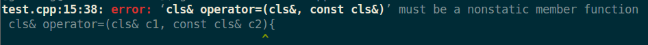

[toc]


&emsp;
&emsp; 
# 第十四章 重载运算符 与 类型转换

## 1. 基础知识
### 1.1 重载运算符的原理是？
&emsp;&emsp; 重载的运算符其实就是 具有特殊名字的函数：它们由 关键字`operator`和其后要定义的运算符号共同组成。
&emsp;&emsp; 和其它函数一样，重载的运算符也包含返回类型、参数列表以及函数体。

### 1.2 如何重载运算符？
&emsp;&emsp; 正如之前描述的，重载的运算符其实就是 具有特殊名字的函数，重载运算符函数由 关键字`operator`和其后要定义的运算符号共同组成，下面是一个重载`==`的例子：
```cpp
// 他有返回类型bool，也有参数列表、函数体
bool operator==(const Sales_data &lhs, const Sales_data &rhs)
{
    return lhs.isbn() == rhs.isbn() && lhs.units_sold == rhs.units_sold && lhs.revenue == rhs.revenue;
}
```

### 1.3 重载运算符函数 的参数数量
#### &emsp; 1.3.1 重载运算符函数 的参数数量 与什么有关？
&emsp;&emsp; 重载运算符函数 的参数数量 与该运算符作用的运算对象数量一样多：一元运算符有一个参数，二元运算符有两个。对于二元运算符来说，左侧运算对象传递给第一个参数，右侧运算对象传递给第二个参数。
#### &emsp; 1.3.2 对于那些既可以当一元也可以当二元的运算符，怎么确定他是一元还是二元？
&emsp;&emsp; 有的运算符既可以当一元也可以当二元，这个时候要根据 重载运算符函数的参数数量 来判断语义。

### 1.4 重载运算符函数能否有默认实参？
&emsp;&emsp; 除了重载的函数调用运算符`operator()`之外，其他重载运算符不能含有默认实参。

### 1.5 为某个类重载运算符时，应该 重载运算符函数 定义为 成员函数 还是 普通的非成员函数 ？
&emsp;&emsp; 大多数的重载运算符可被定义为普通的非成员函数或者被定义为类成员函数。如果我们定义上面的函数为类的非成员函数，那么我们需要为每次操作传递两个参数，如下所示：

### 1.6 当 重载运算符函数 是 成员函数 时，为什么比 该函数 是 普通的非成员函数时 参数少一个？
&emsp;&emsp; 因为 成员函数有`this指针`，所以当 重载运算符函数 是 成员运算符函数（显式）的参数数量比运算符的运算对象总是少一个。

### 1.7 当 重载运算符函数 是 成员函数 时，`this指针`绑定的是？
&emsp;&emsp; 如果一个运算符函数是成员函数，则它的第一个（左侧）运算对象绑定到隐式的`this指针`上，因此，成员运算符函数（显式）的参数数量比运算符的运算对象总是少一个。

### 1.8 重载运算符时，对参数类型有何要求？
&emsp;&emsp; 对于一个运算符函数来说，要么它是类的成员函数，要么它至少含有一个类类型参数，这就意味着无法对内置类型的运算对象进行运算符重载：
```cpp
// 错误: int是内置类型，我们不能重定义内置类型的运算符
int operator+(int, int);
```

### 1.9 我们可以重载哪些运算符？不能重载哪些运算符？
#### &emsp; 1.9.1 可重载运算符
|      |       |       |         |          |            |
| ---- | ----- | ----- | ------- | -------- | ---------- |
| `+ ` | `-	`  | `*	`  | `/	 `   | `%	 `    | `^`        |
| `& ` | `|	`  | `~	`  | `!	 `   | `,	 `    | `=`        |
| `< ` | `>	`  | `<= ` | `>= `   | `++	`    | `--`       |
| `<<` | `>> ` | `== ` | `!= `   | `&&	`    | `||	`      |
| `+=` | `-= ` | `/= ` | `%= `   | `^=	`    | `&=`       |
| `|=` | `*= ` | `<<=` | `>>= `  | `[]	`    | `()`       |
| `->` | `->*` | `new` | `new[]` | `delete` | `delete[]` |

#### &emsp; 1.9.2 不可重载运算符：
(1) 我们只能重载已存在的运算符，不能发明新的运算符号。
(2) 下面这几个也不能被重载：
|      |      |     |       |
| ---- | ---- | --- | ----- |
| `::` | `.*` | `.` | `? :` |

#### &emsp; 1.9.3 哪些运算符可以 但不应该 被重载的？为什么？
尽管有些运算符可以重载，但大多数情况下不建议重载：
&emsp;&emsp; 某些运算符指定了运算对象的求值顺序，因为使用重载的运算符本质上是一次函数的调用，所以这些关于运算对象求值顺序的规则无法应用到重载的运算符上。特别是`,` 、`&` 、`||`、 `&&`，它们的运算对象的求值顺序无法被保留下来。
&emsp;&emsp; 因为它们的重载版本无法保留求值顺序 和/或 短路求值属性，因此不建议重载它们，因为当代码中使用了这些运算符的重载版本时，用户可能会忽然发现他们一直习惯的求值规则不再适用了。
**什么是短路求值？**
&emsp;&emsp; 作为"&&"和"||"操作符的操作数表达式，这些表达式在进行求值时，只要最终的结果已经可以确定是真或假，求值过程便告终止，这称之为短路求值（short-circuit evaluation）：
&emsp;假如expr1和expr2都是表达式，并且expr1的值为0，在下面这个逻辑表达式的求值过程中：
&emsp;&emsp; `expr1 && expr2`
expr2将不会进行求值，因为整个逻辑表达式的值已经可以确定为0。
&emsp;类似地，如果expr1的值不是0，那么在下面的这个逻辑表达式的求值过程中：
&emsp;&emsp; `expr1 || expr2`
expr2将不会进行求值，因为整个逻辑表达式的值已经确定为1。

### 1.10 运算符被重载后，它的 结合律、优先级 和什么有关？
&emsp;&emsp; 对于重载的运算符来说，其优先级和结合律 与对应的内置运算符保持一致，不考虑运算对象类型的话，`x == y + z;`永远等价于`x == (y + z)`.

### 1.11 怎么调用一个 重载的运算符？
有两种调用方法： 间接调用 和 函数调用
**非成员运算符函数：**
```cpp
// 两个等价调用
data1 + data2;           // 普通表达式
operator+(data1, data2); // 等价的函数调用
```
上面两个调用时等价的，它们都调用了 非成员函数`operator+`。
**成员运算符函数**
```cpp
data1 += data2;             // 基于“调用”的表达式
data1.operator+=(data2);    // 对成员运算符函数的等价调用
```
上面两个调用时等价的，它们都调用了成员函数`operator+=`，`this指针`绑定到左侧运算对象(data1)然后传入函数。

### 1.12 在重载运算符时，应该准守哪些准则？
(1) 虽然我们可以利用运算符重载 将运算符定义成任意规则，但最好让他们的含义与内置类型一致，不要违直觉定义:
> 如果类执行IO操作，那么<<和>>就应该与内置类型的IO一致。
> 如果类的某个操作是检查相等性，则定义`operator==`，通常也应该有`operator!=`。
> 如果类包含一个内在的单序比较操作，则定义`operator<`，如果有了`operator<`，一般也有其他关系操作。
> 重载运算符的返回类型通常应与内置版本的返回类型兼容：逻辑运算符和关系运算符应该返回bool，算术运算符应该返回类类型的值，赋值运算符和复合赋值运算符应该返回左侧运算对象的一个引用。
> 

### 1.13 如何确定 一个被重载的运算符应该是 成员函数 还是 非成员函数？
### 1.13.1 &emsp;一般准则
&emsp; 定义重载运算符时，必须要先决定是声明为类成员函数还是普通的非成员函数。对此，有一些准则：
> &emsp;&emsp; ① 赋值(`=`、下标(`[]`、调用(`()`)和成员访问箭头运算符(`->`)**必须是**成员。
> &emsp;&emsp; ② 复合赋值运算符**一般来说**应该是成员，但并非必须，这一点和赋值运算符略有不同。
> &emsp;&emsp; ③ 改变对象状态的运算符或者与给定类型密切相关的运算符，如递增、递减和解引用运算符，通常**应该是**成员。
> &emsp;&emsp; ④ 具有对称性的运算符可能转换任意一端的运算对象，例如算术、相等性、关系和位运算符等，它们**应该是**普通的非成员函数。
> &emsp;&emsp; ⑤ 输入输出运算符**必须是**非成员函数。
> 
### 1.13.2 &emsp; 什么是 具有对称性的运算符？
&emsp;&emsp; 程序员希望能在含有 混合类型的表达式中 使用对称性运算符，例如，在求一个`int`和一个`double`的和时，它们任意一个都有可能是 左侧运算对象 或右侧运算对象，所以加法是对称的:
```cpp
1 + 2.2; // int为 左 侧运算符
2.2 + 1; // int为 右 侧运算符
```
### 1.13.3 &emsp; 为什么 具有对称性的运算符 应该声明为 非成员函数？
就拿 STL中的`string`类 的`+`运算符 来说吧，我们来看下面的代码：
```cpp
string s = "world";
string t = s + "!";     // 正确: we can add a const char* to a string
string u = "hi" + s;    // would be an error if + were a member of string
```
**如果把 `string`类 的`+`运算符 定义了 成员函数，`string u = "hi" + s;`就是错误的：**
&emsp;&emsp; `+`运算符 定义了 成员函数，而如果 一个运算符函数 是成员函数，则它的第一个（左侧）运算对象绑定到隐式的`this指针`上，即 `"hi"`将绑定到`this指针`，那 `string u = "hi" + s;`就相当于下面的代码：
```cpp
string u = ("hi".operator+(s)) // 错误，"hi"没有成员函数
```
但显然 `"hi"`是内置类型`const char*`，没有成员函数`operator+`，所以 `string u = "hi" + s;`会报错。
**如果把 `string`类 的`+`运算符 定义了 非成员函数**
如果 `+`运算符 定义了 非成员函数，那 `string u = "hi" + s;`就相当于下面的代码：
```cpp
string u = (operator+("hi", s)); // 正确，一个普通的函数调用，"hi"将被隐式转换为 string类型
```
显然上面是对的。
&emsp;&emsp; 因此 具有对称性的运算符 应该声明为 非成员函数


&emsp;
&emsp;
## 2. 为什么要 重载 输入 和 输出 运算符？
&emsp;&emsp; IO标准库 分别使用 `>>`、`<<`执行输入 和 输出 操作，对于这两个运算符来说，IO库只定义了其读写内置类型的版本，而在自定义的类中，需要类的设计者自定义适合该类的新版本以支持IO操作。


&emsp;
&emsp;
## 3. 重载 输出运算符 `<<`
### 3.1 输出运算符 `<<` 的形参、返回值 一般是什么样的？为什么？
#### &emsp; 3.1.1 形参
&emsp; 通常情况下：
&emsp;&emsp; **第一个形参** 是一个 非常量`ostream对象`的引用。非常量是因为向流写入内容会改变其状态，而引用则是因为ostream不能拷贝。
&emsp;&emsp; **第二个形参** 一般是一个 常量的引用，该常量是我们想要打印的类类型。这里的引用是因为我们希望避免复制实参，常量则是因为打印对象通常不会改变对象内容。
#### &emsp; 3.1.2 返回值 
&emsp;&emsp; `operator<<`一般返回它的ostream形参，为了与其他类新的的`<<`一致，`operator<<`一般返回它的ostream形参的引用。

### 3.2 为`Sales_data`类重载 输出运算符 `<<`
&emsp;&emsp; 
```cpp
ostream& operator<<(ostream &os, const Sales_data &item)
{
    os << item.isbn() << " " << item.units_sold << " "
        << item.revenue << " " << item.avg_price();
    return os;
}
```

### 3.3 重载 输出运算符 `<<`时 是否应该在 重载运算符函数里 提供换行符等格式化操作？
&emsp;&emsp; 不应该，输出运算符 应该主要负责打印对象的内容而非控制格式，因此输出运算符不应该打印换行符。

### 3.4 输出运算符应该是 成员函数 还是 非成员函数？
&emsp;&emsp; **必须是 非成员函数**。因为作为成员函数，左操作数必须是该类类型的对象，那就需要这样调用 输出运算符了：
```cpp
Sales_data data;
data << cout; // 因为 输出运算符 被定义为 Sales_data类的成员函数，因此只能这样调用
```
这样显然和标准库的写法不一致，因此我们若希望为类自定义IO操作，则必须将其定义为 非成员函数。

### 3.5 重载 输出运算符 `<<`时，应该怎么声明 该重载运算符函数？
&emsp;&emsp; 必须是 非成员函数，而且要声明为 该类的友元，因为IO运算符往往需要读写 类的非公有数据成员，所以IO运算符一般被声明为友元。


&emsp;
&emsp;
## 4. 重载 输入运算符 `>>`
### 4.1 重载 输入运算符 `>>`时，形参、返回值 一般是什么样的？为什么？
&emsp; 通常情况下：
&emsp;&emsp; **第一个形参** 是一个 非常量`istream对象`的引用。非常量是因为向流读取内容会改变其状态，而引用则是因为ostream不能拷贝。
&emsp;&emsp; **第二个形参** 一般是一个 该类类型的引用。这里的引用是因为我们需要改变实参。
#### &emsp; 3.1.2 返回值 
&emsp;&emsp; `operator>>`一般返回它的istream形参，为了与其他类新的的`>>`一致，`operator>>`一般返回它的istream形参的引用。

### 4.2 重载 输入运算符 `>>` 和 输出运算符 `<<` 时有啥区别？
(1) 形参的区别
(2) 重载 输入运算符 `>>`时需要多做一个步骤：要额外考虑失败的情况。

### 4.3 重载 输入运算符 `>>`时会遇到哪些错误？
(1) 流含有错误类型的数据读取操作时。例如`cin`期望读取的是`int`类型，但读取到的却是字符串，此时就会发生错误。
(2) 当读取操作到达文件末尾，或是遇到输入流的其他错误时也会失败。

### 4.4 输入运算符应该是 成员函数 还是 非成员函数？
&emsp;&emsp; 非成员函数，然后声明为该类的友元，原因和 输出运算符 一样。

### 4.5 为`Sales_data`类重载 输入运算符
```cpp
istream& operator>>(istream &is, Sales_data& item)
{
    double price;
    is >> item.booNo >> item.units_sold >> price;
    if(is)  //如果读取成功
        item.revenue = item.units_sold * price;
    else    // 如果读取失败
        item = Sales_data(); // 若读取失败，则将item置空
    return is;
}
```
在上面的输入`is >> item.booNo >> item.units_sold >> price;`中，我们没有区分具体是哪一个变量在读取的时候发生了错误，因为具体是哪个发生错误并不重要，只要有错误发生，我们都要将`item`置空。

### 4.6 假如在读取的时候发生错误了，重载的输入运算符应该怎么做？
&emsp;&emsp; **当读取操作发生错误时，输入运算符应该负责从错误中恢复。**
&emsp;&emsp; 就拿前面重载的 `Sales_data`类的 输入运算符来说吧，在语句`is >> item.booNo >> item.units_sold >> price;`中，错误可能发生在读取`item.booNo`时，或是读取 `item.units_sold` ，也可能是读取`price`的时候，如果错误发生在读取`item.units_sold`，这意味着`item.booNo`读取成功了，但是`item.units_sold` 、`price`、`item.revenue`都没有读取成功，这可能导致 它们和 完全不匹配的`booNo`组合在一起，这会给用户带来很大的困扰。
&emsp;&emsp; 因此 输入运算符应该负责从错误中恢复，在上面的 `Sales_data`类的 输入运算符中，是通过将一个默认初始化的Sales_data赋给`item`来完成的。


&emsp;
&emsp;
## 5. 重载 算术运算符 
### 5.1 对于 算术运算符 和 关系运算符，应该将其定义为 成员函数 还是 非成员函数？ 为什么？
&emsp;&emsp; 通常情况下，我们应该将 算术运算符 和 关系运算符 定义为 非成员函数，这样左侧、右侧的运算对象就能互相转换了，要不然左侧就必须是该对象，具体的分析见前面`string`类的`+`运算符的例子。

### 5.2 重载算符运算符的时候有没有什么可以“偷懒”的办法？
&emsp;&emsp; 偷懒是不能偷懒的，但一般一个类定义了算术运算符，那么他一般也会定义一个对应的复核赋值运算符（比如`-`对应`-=`、`+`对应`+=`），此时利用 对应的复合赋值运算符 来实现 该算术运算符是最方便的。

### 5.3 为`Sales_data`类定义 `+`运算符
#### &emsp;(1) 形参和返回值
**形参**
&emsp;&emsp; `+`运算符 肯定是接收两个 `Sales_data`对象，而且相加是不会改变实参的值的，因此用 const比较合适。
**返回值**
#### &emsp;(2) 定义
&emsp;&emsp; 算术运算符 一般是计算得到一个新值，这个值一般是一个局部变量，运算完成后一般返回这个局部变量的副本。
&emsp;&emsp; 一般来说，如果一个类定义了算术运算符，那么他一般也会定义一个对应的复合赋值运算符，在这种情况下，最有效的方法是使用复核赋值来定义算术运算符。
```cpp
Sales_data operator+(const Sales_data &lhs, const Sales_data &rhs)
{
    Sales_data sum = lhs;   // 将lhs拷贝给临时变量sum
    sum += rhs;         // 利用 += 运算符来完成工作，节省代码量（这个在后面会定义）
    return sum;
}
```


&emsp;
&emsp;
## 6. 重载相等运算符
### 6.1 定义 相等运算符 的时候有什么设计准则？
> (1) 如果一个类含有判断两个对象是否相等的操作，则它显然应该把函数定义成`operator==` 而非一个 普通的命名函数（如equal()）：因为用户比较习惯于通过使用`==`来比较对象，所以提供了`==`就意味着用户无需再费时费力地学习并记忆一个全新的函数名字。此外，**类定义了`==`运算符之后也更容易使用标准库容器和算法**。
> (2) 如果类定义了`operator==`，则该运算符应该能判断一组给定的对象中是否含有重复的数据。
> (3) 通常情况下，相等运算符应该具有传递性，换句话说，如果`a==b`和`b==c`都为真，则`a==c`也应该为真。
> (4) 如果类定义了`operator==`，则这个类也应该定义`operator!=`。因为对于用户来说，当他们能使用`==`
> (5) **相等运算符和不相等运算符中的一个 应该把工作委托给另外一个，这意味着其中一个运算符应该负责实际的比较工作，而另一个运算符则只是调用哪个真正工作的运算符**。
> 
### 6.2 为`Sales_data`类定义 `==` 和 `!=`
&emsp;&emsp; 其实只需要定义 `==`就行了，因为 `!=`可以通过调用`!=`来实现功能。
```cpp
bool operator==(const Sales_data &lhs, const Sales_data &rhs)
{
    return lhs.isbn() == rhs.isbn() && 
            lhs.units_sold == rhs.units_sold && 
            lhs.revenue == rhs.revenue ;
}

bool operator!=(const Sales_data &lhs, const Sales_data &rhs)
{
    return !(lhs == rhs);
}
```


&emsp;
&emsp;
## 7. 重载 关系运算符
### 7.1 对于 关系运算符，应该将其定义为 成员函数 还是 非成员函数？ 为什么？
&emsp;&emsp; 和算术运算符一样，我们通常应该将 关系运算符 定义为 非成员函数，这样左侧、右侧的运算对象就能互相转换了，要不然左侧就必须是该对象，具体的分析见前面`string`类的`+`运算符的例子。

### 7.2 `>` 和 `<` 应该优先定义哪个？
&emsp;&emsp; 应该优先定义 小于号，因为很多容器和算法会用到它。

通常情况下，关系运算符应该：
> (1) 定义顺序关系，令其与关联容器中对关键字的要求一致，并且
> (2) 如果类同时含有`==`运算符的话，则定义一种关系令其与`==`保持一致。特别是，如果两个对象是`!=`的，那么一个对象应该`<`另一个。

### 7.3 为`Sales_data`类定义 `>` 和 `<`
&emsp;&emsp; 对Sales_data类来说，关系运算符没有什么必要，因为语义上违直觉。


&emsp;
&emsp;
## 8. 赋值运算符
### 8.1 我们应该定义哪些赋值运算符？
&emsp;&emsp; 看需求，基本的有：拷贝赋值运算符、移动赋值运算符，如果需要，可以定义其它的赋值运算符，以使用别的类型作为右侧运算对象。
&emsp;&emsp; 举个例子，除 拷贝赋值运算符、移动赋值运算符 之外，标准库`vector`类 还定义了第三种赋值运算符，该运算符接收花括号内的元素作为参数，这使得我们能以这种形式使用该运算符：
```cpp
vector<string> vec;
vec = {"Hello", "World", ","};
```

### 8.2 定义赋值运算符的时候应该注意什么？
(1) 和 内置的赋值运算符 一样，自定义的赋值运算符应该返回其左侧对象的引用；
(2) 在重载赋值运算符时，不管形参的类型是什么，赋值运算符都应该定义为成员函数，因为`this指针`会绑定到`=`左侧对象中，而要调用 一个类的赋值运算符 给一个对象赋值，那这个对象的类型肯定是这个类。

### 8.3 为 `StrVec`类 提供一个 赋值运算符，它接收 花括号内的元素作为参数
&emsp;&emsp; 和拷贝赋值运算符一样，要和 内置的赋值运算符 保持一致，这个新的赋值运算符应该返回其左侧对象的引用：
```cpp
class StrVec {
public:
    StrVec &operator=(std::initializer_list<std::string>);
    // 其它成员

StrVec &StrVec::operator=(initializer_list<string> il)
{
    auto data = alloc_n_copy(il.begin(), il.end());
    free(); 
    elements = data.first; 
    first_free = cap = data.second;
    return *this;
}
```

### 8.4 为 `Sales_data`类定义 复核运算符`+=`
#### 8.4.1 `+=`运算符 应该定义为 成员函数还是非成员函数？
&emsp;&emsp; 和`+`运算符 必须是非成员函数 不一样，`+=`运算符可以是 非成员函数，也可以是 成员函数，但一般倾向于将其定义为 成员函数，这样就可以把所有 赋值操作相关的运算符 都统一定义为 成员函数。
#### 8.4.2 定义
&emsp;&emsp; 和 内置的 复核赋值运算符 保持一致，此复核赋值运算符 也应该返回其左侧对象的引用：
```cpp
Sales_data& operator+=(const Sales_data&rhs)
{
    units_sold += rhs.units_sold;
    revenue += rhs.revenue ;
    return *this;
}
Sales_data& Sales_data::operator+=(const Sales_data &rhs)
{
    units_sold += rhs.units_sold;
    revenue += rhs.revenue;
    return *this;
}
```


&emsp;
&emsp;
## 9. 下标运算符
### 9.1 重载 下标运算符时需要注意的是？
(1) 下标运算符 **必须是** 成员函数
(2) 返回值应该是访问元素的引用（这是为了和下标的原始定义兼容）
(3) 应该定义两个版本：常量版本 和 非常量版本
&emsp;&emsp; 常量版本的下标运算符 保证了： 当作用于一个常量对象时，下标运算符返回常量引用以确保我们不会给返回的对象赋值。

### 9.2 给 `StrVec`类 提供 下标运算符
```cpp
class StrVec {
public:
    std::string& operator[](std::size_t n)
            { return elements[n]; }
    const std::string& operator[](std::size_t n) const
            { return elements[n]; }
    // other members as in § 13.5 (p. 526)
private:
    std::string *elements; // pointer to the first element in the array
};
```


&emsp;
&emsp;
## 9. 递增、递减 运算符
### 9.1 它们应该是成员函数 还是 非成员函数？
&emsp;&emsp; C++并未规定 递增、递减 运算符 必须是类的成员，但是因为它们改变的正好是所操作对象的状态，所以建议将其设定为 成员函数。

### 9.2 重载 递增、递减 运算符 是要注意什么？
(1) 建议将其设定为 成员函数；
(2) 应该同时提供前置版本 和 后置版本
(3) 只定义前置版本，后置版本调用对应的前置版本即可。
(4) 为了与内置版本保持一致，前置版本应该返回 递增(递减)后对象的引用，后置版本应该返回原值

### 9.3 前置、后置 递增(递减)运算符的返回值应该是？
应该和他们对应的内置版本保持一致：
> 前置版本：返回 递增(递减)后对象的引用
> 后置版本：返回原值

### 9.4 编译器 如何区分 前置和后置 递增(递减)运算符？
&emsp;&emsp; 在同时定义 前置和后置 递增(递减)运算符 时，普通的重载形式是无法区分该 递增(递减)运算符 到底是 前置版本 还是 后置版本的，因为它们使用的是同一个运算符号，而且形参列表也一样。
&emsp;&emsp; ，**为了解决这个问题**，后置版本可以接受一个 额外的(不被使用的) `int`类型的形参。当我们使用后置运算符时，编译器为这个形参提供一个值为0的实参。尽管从语法上说后置函数可以使用这个额外的形参，但在实际过程中通常不会这么做，这个形参唯一的作用就是区分 前置版本和后置版本的函数。
```cpp
class StrBlobPtr {
public:
    // increment and decrement

    StrBlobPtr& operator++(); // prefix operators
    StrBlobPtr& operator--();

    StrBlobPtr operator++(int); // postfix operators
    StrBlobPtr operator--(int);
    // other members as before
};
```

### 9.5 为下面的`Time`类定义 递增、递减 运算符
#### 9.5.1 `Time`类
```cpp
class Time
{
private:
    int hours;             // 0 到 23
    int minutes;           // 0 到 59
public:
    // 默认构造函数
    Time(int h = 0, int m = 0):hours(h),minutes(m) { }
    // Time(int h , int m):hours(h),minutes(m) { }

    Time& operator++();
    Time& operator--();

    // 后置版本的 递增(递减)运算符
    Time operator++(int);
    Time operator--(int);

    // 显示时间的方法
    void displayTime() { cout << "H: " << hours << " M:" << minutes <<endl;}
};
```
#### 9.5.2 定义 递增、递减 运算符
```cpp
Time& Time::operator++() 
{
    ++minutes;
    if(minutes >= 60){
        ++hours;
        minutes -= 60;
    }
    return *this;
}

Time& Time::operator--()
{
    --minutes;
    if(minutes < 0){
        if (hours <= 0){
            cout << "Erro" <<endl;
            hours = minutes = 0;
        }
        --hours;
        minutes += 60;
    }    
    return *this;
}

// 后置版本调用对应的前置版本即可
Time Time::operator++(int) // 此时形参不需要命名，因为我们不会使用该参数
{
    Time ret = *this;
    ++*this; 
    return ret;
}

Time Time::operator--(int)
{
    Time ret = *this;
    --*this;
    return ret;
}
```
#### 9.5.3 测试
```cpp
int main()
{
    Time t1(1, 59);
    ++t1;
    t1.displayTime();
    (--t1).displayTime();
    
    (t1--).displayTime();
    t1.displayTime();

    (t1++).displayTime();
    t1.displayTime();
    return 0;
}

```
运行结果：
> H: 2 M:0
> H: 1 M:59
> H: 1 M:59
> H: 1 M:58
> H: 1 M:58
> H: 1 M:59


&emsp;
&emsp;
## 10. 成员访问运算符
### 10.1 箭头运算符(->) 和 解引用运算符(*) 应该定义为 成员函数 还是 非成员函数？
&emsp;&emsp; 箭头运算符(->)**必须是**类的成员；
&emsp;&emsp; 虽然并没有强制规定，但解引用运算符(*) 通常也是类的成员。

### 10.2 箭头运算符(->) 和 解引用运算符(*) 的返回值有何限定？
&emsp;&emsp; 解引用运算符(*) ，我们可以令 `operator*` 完成我们任何指定的操作。换句话说，我们可以让 `operator*` 返回一个固定值如`Hello World`，或则打印对象的内容等等，但还是建议和内置的类型保持一致（即返回指针所指向对象）。
&emsp;&emsp; 箭头运算符(->)则不是这样的，它永远不能丢掉成员访问这个最基本的含义，也就是说 在重载箭头运算符时，可以改变的是箭头从哪个对象中获取成员，而 箭头运算符是用来获取成员的 这一事实永远不会变。**换句话说，箭头运算符(->)的返回值必须是：**
> 类的指针
> 自定了箭头运算符的某个类的对象

### 10.3 表达式 `point->mem` 有哪几种解释？
**(1) 若`point`是 内置指针**
&emsp;&emsp; 因为`point`是 内置指针，则我们使用的是 内置的箭头运算符，则该表达式等价于`(*point).mem`：先解引用指针`point`，然后从它指向的对象中获取成员`mem`，若`point`指向的类型没有名为`mem`的成员，则程序会发生错误。
**(2) 若`point`是 定义了`operator->`的类的对象**
&emsp;&emsp; 若`point`是 定义了`operator->`的类的对象，则我们使用`point.operator->()`的 返回结果 来获取`mem`，此时有两种情况：
> 如果 该返回结果是一个指针，则执行 前面的 第(1)步；
> 如果 该返回结果 本身含有重载的的 `operator->()`，则重复调用当前步骤。
>   
在这一系列过程结束时，程序可能返回了所需的内容，也可能返回一些表示程序错误的消息。

### 10.4 在下面的代码中，为什么同样是`->foo`，得到的结果却不一样呢？
```cpp
include <string>
#include <iostream>

using namespace std;

struct A { 
    string foo = "I am in struct A"; 
};

struct B { 
    A a;
    A *operator->() { return &a; } // 这里返回的是 a成员 的地址
};

struct C { 
    B b;  
    B operator->() { return b; } 
};

struct D { 
    C c;
    string foo = "Hello,it's struct D";
    C operator->() { return c; }
};

int main()
{
    D d1;
    cout << d1->foo << endl;
    D *d2 = &d1;
    cout << d2->foo << endl;
    return 0;
}

```
运行结果：
> [zhangsan@localhost code]$ ./test.o 
> I am in struct A
> Hello,it's struct D
#### &emsp; 10.4.1 `cout << d1->foo << endl;` 的运行原理是？
&emsp;&emsp; 箭头运算符的实现，是用循环来做的，会反复调用operator->()直到返回值是一个指针。
&emsp;&emsp; 对于`d1->foo`来说，因为 对象`d1`的类型是 `D`类，因此在对`d1`调用 箭头运算符`->`时，调用的是其实是`C operator->() { return c; }`，然后它返回 `D`类的的成员`c`，然后循环调用直到获取到 类A的成员`foo`，详细的调用过程是这样的：
> 第一步：`d1->foo`调用`D::operator->()`得到 `D`类的成员`c`；
> 第二步：对上一步得到的 `D`类的成员`c`调用 `C::operator->()` 得到 `C`类的成员`b`；
> 第三步：对上一步得到的 `C`类的成员`b`调用 `B::operator->()` 得到 一个指向`B`类的成员`a`的指针；
> 第三步：因为 上一步得到的是 一个指向`B`类的成员`a`的指针，因此对它调用`->foo`，最终在屏幕中输出 `I am in struct A`
> 
也就是说，当`d`不是指针的时候，编译器会不停的调用`d`的`operator->()`直到他变成一个指针，然后才调用`->foo`获得其成员。换句话说，`d1->fo`在经过编译后的代码应该差不多是这样的:
```cpp  
*d.operator->().operator->().operator->()).foo; 
```
或者:
```cpp 
d.operator->().operator->().operator->()->foo; // 这里foo前面是 箭头运算符(->)，上面那个是 点运算符(.)
```
#### &emsp; 10.4.2 `cout << d2->foo << endl;`的运行原理是？
&emsp;&emsp; 首先，`d2`是一个内置指针，它指向的是 对象`d1`，因此`d2->foo`其实调用的是内置指针的`->`，而不是`D::operator->()`，因此`d2->foo`访问的是 `D::foo`，而不是`A::foo`，因此输出结果为`Hello,it's struct D`。


&emsp;
&emsp;
## 11. 函数调用运算符
### 11.1 函数调用运算符 应该是成员函数还是非成员函数？
&emsp;&emsp; 函数调用运算符`()` **必须是成员函数**

### 11.2 一个类可以定义几个函数调用运算符？
&emsp;&emsp; 一个类可以定义多个函数调用运算符，形参不一样即可（和函数重载一样）。

### 11.3 定义一个 重载了函数调用运算符的类`absInt`，它返回`int`实参的绝对值，并编写测试案例
```cpp
struct absInt {
    int operator()(int val) const {
        return val < 0 ? -val : val;
}
};

int i = -42;
absInt absObj;      // absObj 是一个含有函数调用运算符的对象
int ui = absObj(i); // 将 i 传给 absObj.operator()
```

### 11.4 重载了函数调用运算符的类 相比于 普通的函数 有什么优势呢？
&emsp;&emsp; 相比于  普通的函数，重载了函数调用运算符的类 同时能存储状态，所以比普通函数更加灵活。

### 11.5 含有状态的 函数对象类 `PrintString`
&emsp;&emsp; 和其它类一样，函数对象类 除了`operator()`之外也可以包含其他成员，这些成员通常被用于定制调用运算符中的操作。
```cpp
class PrintString {
public:
    PrintString(ostream &o = cout, char c = ' '): os(o), sep(c) { }
    void operator()(const string &s) const { os << s << sep; }
private:
    ostream &os; // stream on which to write
    char sep;    // character to print after each output
};

PrintString printer;    // 默认初始化，即用 cout打印
printer(s);

PrintString errors(cerr, '\n'); // 用 cerr 答应， \n 为分隔符
errors(s);
```

### 11.6 重载 函数调用运算符 函数 的返回值
&emsp;&emsp; 对于重载 函数调用运算符 函数 的返回值，C++没有要求，可以返回`void`，也可以是`int`等，看自己的需要。


&emsp;
&emsp;
## 12. 函数对象
### 12.1 什么是 函数对象(function object)？
&emsp;&emsp; 如果类定义了 函数调用运算符`()`，则 该类的对象 称为 函数对象。因为我们可以调用这种对象，所以我们说这些对象的 “行为像函数一样”，又称**仿函数**。

### 12.2 lambda表达式 与 函数对象 
#### 12.2.1 lambda表达式 与 函数对象 有什么关系？
&emsp;&emsp; 从本质上来说，lambda表达式只是一种语法糖，因为所有其能完成的工作都可以用其它稍微复杂的代码来实现。
&emsp;&emsp; **lambda表达式的大致原理**：每当你定义一个lambda表达式后，编译器会自动生成一个匿名类（这个类当然重载了()运算符），我们称为闭包类型（closure type）。那么在运行时，这个lambda表达式就会返回一个匿名的闭包实例，其实一个右值。所以，我们上面的lambda表达式的结果就是一个个闭包。闭包的一个强大之处是其可以通过传值或者引用的方式捕捉其封装作用域内的变量，前面的方括号就是用来定义捕捉模式以及变量，我们又将其称为lambda捕捉块。
&emsp;&emsp; 换句话说，在我们编写了一个lambda表达式后，编译器将该表达式翻译成 一个未命名类的未命名对象，而且在编译器为lambda表达式生成的未命名类中，含有一个重载的函数调用运算符。
我们来看下面的代码，对于下面这个lambda表达式：
```cpp
statble_sort(words.begin(), words.end(), 
                [](const string &a, const string &b) { return a.size() < b.size(); });
```
编译器产生的类 类似于：
```cpp
class NoName{
public:
    // 编译器为 lambd表达式 产生的 未命名类 只有一个 函数调用运算符成员。
    bool operator()(const string &a, const string &b) const { return a.size() < b.size(); }
};
```
我们可以看到 lambda表达式 和对应的 编译器产生的类 的形参列表、函数体 是一样的。，我们可以将前面的lambda表达式改写成：
```cpp
stable(words.begin(), words.end(), NoName())
```

#### 12.2.2 编译器为 lambda表达式 生成的类中的`operator()`成员函数 一定是const的吗？
&emsp;&emsp; 不一定，要分情况。
&emsp;&emsp; 默认情况下，lambda表达式是不能改变它捕获的变量的，因此在默认情况下，由lambda产生的类中的`operator()`是一个 const成员函数。
```cpp
auto lam_default = [](const string &a, const string &b) { return a.size() < b.size(); }
```
对于上面的lambda表达式，编译器为其生成的类如下：
```cpp
class NoName{
public:
    // operator()是const成员
    bool operator()(const string &a, const string &b) const { return a.size() < b.size(); }
};
```
&emsp;&emsp; 但如果lambda表达式被声明为`mutable`，则`operator()`就不是 const成员函数了：

```cpp
auto lam_mutable = [](const string &a, const string &b) mutable { return a.size() < b.size(); }
```
对于上面的lambda表达式，因为他是`mutable`的，编译器为其生成的类如下：
```cpp
class NoName{
public:
    // operator()是 非const成员
    bool operator()(const string &a, const string &b) { return a.size() < b.size(); }
};
```

#### 12.2.3 什么时候 编译器为lambda表达式 生成的类 中会有 除`operator()`以外的成员？
&emsp; 这要看 lambda表达式在捕获变量时 使用的是 值捕获 还是 引用捕获了：
&emsp;&emsp; 如我们所知，当一个lambda表达式通过引用捕获变量时，将由程序负责确保lambda执行时所引用的对象确实存在，因此编译器可以直接使用该引用而无需再lambda产生的类中将该变量存储为数据成员。
&emsp;&emsp; 而通过值捕获的变量将被拷贝到lambda中，此时 编译器为lambda表达式生成的类 必须为每个值捕获的变量建立对应的数据成员，同时建立构造函数，然后使用值捕获的变量的值来初始化对应的成员。来看下面的例子:
对于下面的 lambda表达式
```cpp
auto wc = find_if((words.begin(), words.end(),
                    [sz](const string &a) { return s.size() >= sz; } )
```
因为参数`sz`是通过值捕获的，因此编译器为其生成的类如下：
```cpp
class NoName{
public:
    // 参数n是通过值捕获传进来的，用来初始化对应的成员
    NoName(const size_t n): sz(n) { }
    // operator()是 const成员
    bool operator()(const string &a)const { return a.size() >= b.size(); }
private:
    // sz是值捕获的，编译器会为其生成一个成员
    size_t sz;
};
```
我们可以看到，上面的类中不包含 默认构造函数，因此想使用它就必须提供一个实参：
```cpp
auto c = find_if((words.begin(), words.end(), noName(sz));
```

#### 12.2.4 lambda表达式 捕获参数 的原理

#### 12.2.5 lambda表达式 可以互相赋值吗？
&emsp;&emsp; 看是哪种赋值了，`赋值构造`可以，但`直接赋值`不行，因为在编译器为 lambda表达式 生成的类中，赋值操作符 是被删除的，但是没有禁用 复制构造函数，即：
```cpp
NoName& operator=(const NoName&) = delete;
```
来看下面的例子：
```cpp
int main()
{
    auto a = [] { cout << "A" << endl; };
    auto b = [] { cout << "B" << endl; };
    
    a = b;   // 非法，因为lambda无法赋值
    return 0;
}
```
在上面的代码中，在编译时就报错了，你可能会想a与b对应的函数类型是一致的（编译器也显示是相同类型：`lambda [] void () -> void`），为什么不能相互赋值呢？这是因为在编译器为 lambda表达式 生成的类中，赋值操作符 是被删除的，具体报错信息如下：
```
test.cpp: In function ‘int main()’:
test.cpp:11:6: error: no match for ‘operator=’ (operand types are ‘main()::<lambda()>’ and ‘main()::<lambda()>’)
  a = b;          // 非法，lambda无法赋值
      ^
```
但是通过拷贝构造给一个变量赋值就能编译通过：
```cpp
int main()
{
    auto a = [] { cout << "A" << endl; };
    auto b = [] { cout << "B" << endl; };

    auto c = a;     // 合法，利用拷贝构造函数生成一个副本 
    return 0;
}
```
这是因为拷贝构造函数没有被禁用。

### 12.3 标准库定义的函数对象
#### 12.3.1 标准库定义了哪些函数对象？
&emsp;&emsp; 标准库定义了一组表示算数运算符、关系运算符和逻辑运算符的类，每个类分别定义了一个执行命名操作的调用运算符，例如 `plus`类定义了一个函数调用运算符 用于对一对运算对象执行`+`的操作。
&emsp;&emsp; 这些类都被定义成了模板的形式，我们可以为其指定具体的应用类型，这里的类型即调用运算符的形参类型，例如：`plus<string>`令`string`加法运算符作用与`string`对象，代码实例：
```cpp
plus<int> intAdd; // function object that can add two int values
negate<int> intNegate; // function object that can negate an int value
// uses intAdd::operator(int, int) to add 10 and 20
int sum = intAdd(10, 20); // equivalent to sum = 30

// uses intNegate::operator(int) to generate -10 as the second parameter
// to intAdd::operator(int, int)
sum = intAdd(10, intNegate(10)); // sum = 0
```
| 算术                | 关系                  | 逻辑                |
| ------------------- | --------------------- | ------------------- |
| `plus<Type>       ` | `equal_to<Type>     ` | `logical_and<Type>` |
| `minus<Type>      ` | `not_equal_to<Type> ` | `logical_or<Type> ` |
| `multiplies<Type> ` | `greater<Type>      ` | `logical_not<Type>` |
| `divides<Type>    ` | `greater_equal<Type>` |
| `modules<Type>    ` | `less<Type>         ` |
| `negate<Type>     ` | `less_equal<Type>   ` |

#### 12.3.2 标准库定义的这些函数对象 通常用来做什么？
&emsp;&emsp; 表示运算符的函数对象 常用来 替换算法中的默认运算符。
比如，我们都知道标准库算法都是使用元素的`<`运算符对结果拍正序的，如果想对结果排倒序号，那么可以传入一个 `greater`函数对象，该类将产生一个调用运算符并负责执行待排序类型的大于运算：
```cpp
vector<string> svec{"Hello", "world","!","This", "is", "Jack"};
sort(svec.begin(), svec.end(), greater<string>());
```


&emsp;
&emsp;
## 13. 可调用对象 和 function
### 13.1 什么是可调用对象？C++中有哪些可调用对象？
**什么是可调用对象？**
&emsp;&emsp; 对于一个对象或表达式，如果可以对其使用调用运算符，则称它为可调用的。
&emsp;&emsp; 也就是说，如果`e`是一个可调用的表达式，则我们可以编写代码`e(args)`，其中`args`是一个逗号分隔的一个或多个参数的列表。
**有哪些可调用对象？**
&emsp;&emsp; 函数、lambda表达式、函数指针、bind创建的对象、重载了函数调用运算符的类

### 13.2 如何理解 “不同类型的 可调用对象可能共享同一种调用形式” 这句话？
&emsp;&emsp; 首先了解一下 **可调用对象的类型**：
> 和其它对象一样，可调用对象也有类型，例如：
> &emsp;&emsp;每个lambda表达式都有它自己唯一的(未命名的)类类型；
> &emsp;&emsp;函数、函数指针 的类型则由其返回值类型和实参类型决定；
> 
接着来了解一下调用形式的定义：
> **调用形式** 指明了 调用返回的类型 以及传给给调用的实参类型。
>
再来下面的例子：
```cpp
// 普通函数：加法
int add(int i, int i) { return i + j; }

// lambda表达式：取余数
auto mod = [](int i, int i) { return i % j; };

// 函数对象类：除法
class divide{
    int operator()(int i, int i){
        return i / j;
    }
}
```
对于上面的三个可调用对象，它们分别是普通函数、lambda表达式、函数对象类，而且各自完成的功能也不一样，但是它们却享有相同的调用形式，即：
```cpp
int(int, int) // 接收两个int实参，然后返回一个int
```

### 13.3 标准库`function`类型
#### 13.3.1 什么是`function`类型
&emsp;&emsp; 标准库`function`类型是在C++11中添加的特性，用来存储可调用的对象，如函数指针、可调用类、类成员函数、lambda等。
&emsp;&emsp; 它是一个模板，当创建一个具体的`function`类型的时候需要提供额外信息，即该`function`类型能表示的对象的调用形式，如：
```cpp
int add(int i, int i) { return i + j; }
function<int(int, int)> f1 = add; // 接收两个int实参，然后返回一个int
``` 
`function`定义的操作如下：
<div align="center">  </div>
<center> <font color=black> <b> 图1 function 的操作 </b> </font> </center>

#### 13.3.2 如何使用`function`？
**定义：**
```cpp
funciton<int(int, int)> f1 = add;
```
**调用：**
```cpp
cout << f1(4, 2) << endl; // 打印 6
```

#### 13.3.3 为什么需要`function`类型？
对于下面的几个可调用对象：
```cpp
// 普通函数：加法
int add(int i, int i) { return i + j; }

// lambda表达式：取余数
auto mod = [](int i, int i) { return i % j; };

// 函数对象类：除法
class divide{
    int operator()(int i, int i){
        return i / j;
    }
}
```
它们有着相同的调用形式，即：
```cpp
int(int, int) // 接收两个int实参，然后返回一个int
```
如果我们需要用上面的几个可调用对象来实现一个计算器，那么就需要 定义一个函数表 来存储指向这些可调用对象的“指针”，当计算器程序需要执行某个运算时从里查询就行了。
因为我们的所有函数都独立，且只处理`int`的二元运算，那我们可以使用一个`map`来存储运算符到对应函数的映射：
```cpp
map<string, int(*)(int, int)> binops;

// 将"+"映射到 add函数
binops.insert({"+", add}); 

// 错误，mod是lambda表达式，它有自己的类类型，而不是函数指针类型 int(*)(int, int)
binops.insert({"%", mod}); 
```
那么问题就来了，上面的几个可调用对象虽有有着相同的调用形式，但它们都有着自己的类型：
| 可调用对象         | 对应的类型                  |
| ------------------ | --------------------------- |  
| add()函数          | 函数指针`int(*)(int, int)`  |
| lambda表达式`mod`  | 编译器为lambd表达式产生的类 |
| 函数对象类`divide` | 自定义类`divide`            |
显然它们的类型是不一样的，这就意味着它们不能保存在同一`map`中。
**而标准库`function`类型可以解决这个问题：**
**定义**
```cpp
map<string, funciton<int(int, int)>> binops;
binops.insert({"+", add}); 
binops.insert({"%", mod});
binops.insert({"/", divide()}); // divide() 创建了一个divide类对象
```
**使用**
```cpp
binops["+"](10, 5); // calls add(10, 5)

binops["/"](10, 5); // uses the call operator of the div object

binops["%"](10, 5); // calls the lambda function object
```

#### 13.3.4 如果有一对重载的函数，如何将其存入 `function`类型？
来看下面的代码，里面有两个 `add()`：
```cpp
int add(int i, int j) { return i + j; }
Sales_data add(const Sales_data&, const Sales_data&);

map<string, function<int(int, int)>> binops; 
binops.insert( {"+", add} ); // 错误: 到底是哪个add？
```
很显然在上面的代码中存在二义性：编译器无法区分到底是哪个`add()`。这个时候应该怎么办呢？我们知道编译器是根据形参列表来区分重载函数的，因此我们传一个函数指针进去即可，上面的代码应该改成：
```cpp
int (*fp)(int int)  = add;
binops.insert( {"+", fp} );
```


&emsp;
&emsp;
## 14. 重载 类型转换运算符
### 14.1 类类型转换(class-type conversions) 由谁控制？
&emsp;&emsp; 转换构造函数(详见7.5.4) 、 类型转换运算符 共同定义了 类类型转换。
转换构造函数 控制的是 其它类型 到 类 的转换；
类型转换运算符 控制的是 类 到 其它类型 的转换

### 14.2 重载 类型转换运算符 时要注意什么？
(1) 必须定义成成员函数；
(2) 不能声明返回类型，形参列表也必须为空；
(3) 因为 类型转换运算符通常不应该改变 待转换对象的内容，因此 类型转换运算符 一般被定义为 `const`成员；

### 14.3 类型转换运算符 和 转换构造函数 有何区别？
&emsp;&emsp; 它们都是 自定义的类 用来完成类型转换的，其中类型转换运算符 控制的是 类 到 其它类型 的转换；而转换构造函数 控制的是 其它类型 到 类 的转换：
> &emsp; 假设有一个类Foo，它分别定义了 类型转换运算符 和 转换构造函数 来实现 Foo对象和`int`之间的 互相转换，那么：
> &emsp;&emsp; 类型转换运算符 控制的是 Foo对象 -> int对象
> &emsp;&emsp; 转换构造函数 控制的是 int对象 -> Foo对象
> 

### 14.4 看下面的代码，回答问题
```cpp
class SmallInt {
public:
    // 转换构造函数
    SmallInt(int i = 0): val(i){
        if (i < 0 || i > 255)
            throw std::out_of_range("Bad SmallInt value");
    }

    // 类型转换运算符
    operator int() const { return val; }  
private:
    std::size_t val;
};

SmallInt si;

si = 4; 
si + 3; 

SmallInt si = 3.14; 
si + 3.14;
```
#### 14.4.1 `si = 4;`  和 `si + 3;` 的原理是？
```cpp
SmallInt si;
si = 4; // 先通过 转换构造函数将 4 隐式转换 为 SmallInt对象，然后赋给 si
si + 3; // 先通过 类型转换运算符 将 si 转换为 int，然后再和 3 相加
```
#### 14.4.2 `SmallInt si = 3.14;`  和  `si + 3.14;`正确吗？为什么？
&emsp;&emsp; 正确，因为虽然编译器只能执行一个用户自定义的类型转换，但 标准类型转换 可以 和 用户自定义的类型转换可以在同一表达式中发生，且对顺序没有要求：
```cpp
// (1) 3.14 隐式转换为 3(内置类型转换，double -> int)
// (2) 3 转换为 SmallInt对象(通过 转换构造函数将)
SmallInt si = 3.14; 

// (1) 先通过 类型转换运算符 将 si 转换为 int
// (2) 将上一步得到的int转换为double
si + 3.14;
```

### 14.5 看下面的代码，回答问题
```cpp
class SmallInt;
operator int(SmallInt&); 

class SmallInt {
public:
    int operator int() const; 
    operator int(int = 0) const; 
    operator int*() const { return 42; } 
};
```
####  14.5.1 上面的代码有问题吗？
(1) **`operator int(SmallInt&); `**
&emsp;&emsp; 错误，类转换运算符 必须是成员函数。
(2) **`int operator int() const; `**
&emsp;&emsp; 错误，类转换运算符 不能有返回值。
(3) **`operator int(int = 0) const; `**
&emsp;&emsp; 错误，类转换运算符 形参列表必须为空
(4) **`operator int*() const { return 42; }`** 
&emsp;&emsp; 错误，类转换运算符 的返回值为42，与`int*`不匹配。

### 14.6 通过 类转换运算符 可以将类转换为任何类型吗？
&emsp;&emsp; 不是的，类型转换函数的一般形式：
```cpp
operator type() const;
```
`type` 表示某种类型，类型转换运算符可以面向任意类型(除void之外)进行定义，只要该类型能够作为函数的返回类型，因此，不允许将转换成数组或者函数类型，但是允许转换成指针(包括：数组指针、函数指针）或者引用类型。

### 14.7 类型转换可能产生的意外结果
```cpp
int i = 42; 
cin << i; 
```
#### 14.7.1 在C++早期的的版本中，上面的代码有什么问题，将导致什么结果？
&emsp;&emsp; 上面的代码试图将输出运算符作用于输入流，因为 `istream` 本身没有定义 `<<` ，所以本来代码应该产生错误，然而，该代码能够使用 `istream` 的 `bool`类型转换运算符将 `cin` 转换成 `bool`。而这个 `bool` 值接着会被提升为 `int` 并用作内置的左移运算符的左侧运算对象。如此一来，提升后的 `bool` 值将被左移42个位置。
#### 14.7.2 如何避免？
&emsp;&emsp; 使用C++11标准引入的特性，将 类型转换运算符 定义为 显式的类型转换运算符，从而避免隐式转换。

### 14.8 如何避免 隐式的使用类型转换运算符 进行类型转换？
&emsp;&emsp; 在C++11标准中，可以通过将 类型转换运算符 定义为 显式的类型转换运算符 来做到。
&emsp;&emsp; 要将 类型转换运算符 定义为 显式的类型转换运算符，在该类型转换运算符 前面加上`explicit`即可。如：
```cpp
class SmallInt {
public:
    explicit operator int() const { return val; }
    // 其它成员
};
```
和显式构造函数一样，编译器不会将一个显式的类型转换运算符用于隐式类型转换。

### 14.9 看下面的代码，回答问题
```cpp
class SmallInt {
public:
    SmallInt(int i = 0): val(i){
        if (i < 0 || i > 255)
            throw std::out_of_range("Bad SmallInt value");
    }
    explicit operator int() const { return val; }
private:
    std::size_t val;
};

SmallInt si = 3;
si + 3; 
static_cast<int>(si) + 3; 
```
#### 14.9.1 `SmallInt si = 3;` 正确吗？
&emsp;&emsp; 正确，`SmallInt si = 3;`调用的是构造函数，而`SmallInt`的构造函数不是`explict`的。
#### 14.9.2 `si + 3;` 正确吗？
&emsp;&emsp; 错误，此处需要隐式的使用类型转换运算符将 `si`转换为 `int`，但`SmallInt`的类型转换运算符是`explict`的，不能用于隐式类型转换。
#### 14.9.3 `static_cast<int>(si) + 3;` 正确吗？
&emsp;&emsp; 正确，显示的请求类型转换。

### 14.10 将 类型转换运算符 定义为 `explict`后，编译器就一定不会使用该类型转换运算符来执行隐式类型转换？
&emsp;&emsp; 不一定，**这个规定有一个例外**，即如果表达式被用作条件，则编译器会将显式的类型转换自动应用于它，即当表达式出现在下列位置时，显式的类型转换被隐式执行：
> if、while、do 语句的条件部分。
> for 语句头的条件表达式。
> 逻辑非(!)运算符，逻辑与(&&)运算符，逻辑或(||)运算符。
> 条件运算符(? : )的条件表达式。
> 

### 14.11 在C++11标准中，如何解读 `while (std::cin >> value)` ？
&emsp;&emsp; C++ 11 新标准下，IO标准库通过定义一个向`bool`的显示类型转换来避免 前面14.7中类型转换可能产生的意外结果。
&emsp;&emsp; 无论何时在条件表达式中使用流对象，都会使用为 IO 类型定义的 `operator bool`，如：
```cpp
while(cin >> value)
```
输入运算符负责把数据读到 `value` 中，并返回 `cin``，为了对条件求值，cin` 被 `istream operator bool`类型转换函数隐式地执行了转换，如果 cin 的条件状态是 good，则函数返回真，否则返回假。

### 14.11 类类型向`bool`的类型转换 为什么一般被定义成 `explicit` 的？
&emsp;&emsp; 因为向 `bool`的类型转换通常作用在条件部分，因此 `operator bool` 一般被定义成 `explicit` 的。

### 14.12 类型转换 在什么时候会产生二义性？
&emsp;&emsp; 如果类中包含一个或多个类型转换，则必须保证 在 类类型 和 目标类型 之间 只存在唯一的一种转换方式，否则的话，有可能出现二义性。
两种情况下可能发生多重转换路径：
> &emsp;&emsp; 情况一是 两个类提供相同的类型转换：当A类定义了接受B类对象的转换构造函数，同时B类定义了一个转换目标是A类的类型转换运算符时，我们就说它们提供了相同的类型转换。
> &emsp;&emsp; 情况二是 类定义了多个转换规则，而这些转换涉及的类型本身可以通过其它类型转换联系在一起，最典型的例子就是算术运算符，对某个给定的类来说，最好只定义最多一个与算术类型有关的转换规则。
> 
注意：通常不用为类定义相同的类型转换，也不要在类中定义两个及两个以上转换源或者转换目标是算术类型的转换。

## 14.13 情况一：两个类提供相同的类型转换
### 14.13.1 例子
&emsp; 在下面的代码中，我们定义了两种 从B到A的转换方法：
> &emsp;&emsp; (1) 通过 类A的 转换构造函数
> &emsp;&emsp; (2) 通过 类B的 类型转换运算符
```cpp
struct B;
struct A {
    A() = default;
    A(const B&); // A的构造函数 把一个B转换为A
    // other members
};

struct B {
    operator A() const; // B的类型转换运算符 把一个B转换为A
    // other members
};
```
在下面的代码中，将发生二义性错误：
```cpp
A f(const A&); // 函数f 接受一个 类型的const引用，然后返回一个 类A

B b;
// 二义性错误: 
// 函数f 接受一个 类型的const引用，而变量b的类型是B，因此需要执行隐式类型转换
// 但是使用 f(B::operator A())来执行隐式转换呢， 还是 f(A::A(const B&)呢？
A a = f(b); 
```
因为同时存在两种从B到A的转换方法，所以导致编译器无法判断应该采用哪一个进行类型转换，也就是说对`f()`的调用存在二义性。
### 14.13.2 如果非要调用存在上诉二义性的类，该怎么做？
为了使用上述的调用，我们必须 显示调用 类型转换运算符 或 转换构造函数
```cpp
A a1 = f(b.operator A());   // 正确: 使用 B的 类型转换运算符
A a2 = f(A(b));             // 正确: 使用 A的 转换构造函数
```
### 14.13.3 强制类型转换 可以这种情况的二义性吗？
不能，因为 强制类型转换本身也存在二义性：
```cpp
A a2 = f(static_cast<A>(b));
```
在上面强制类型转换的代码中，编译器还是无法判断到底该使用 `B::operator A()`来执行隐式转换呢， 还是 `A::A(const B&)`。

### 14.14 情况二：类定义了多个有联系的转换规则
### 14.14.1 例子
&emsp;&emsp; 如果类定义了一组类型转换，它们的转换源(或转换目标)类型本身可以通过其他类型转换联系在一起，则同样会产生二义性问题，我们来看下面的例子：
在下面的类中，它包含两个转换构造函数，它们的参数是两种不同的算数类型；同时还包含两个类型转换运算符，它们的转换目标也恰好是两种不同的算术类型：
```cpp
struct A {
    // 下面两个转换构造函数 都是接受 算术类型的；
    // 也就是说下面两个构造函数的转换源类型本身可以通过其他类型转换连续在一起(int 和double是可以直接转换的)
    A(int = 0);
    A(double); 
    
    // 下面两个类型转换运算符 都是返回 算术类型的；
    // 也就是说下面两个类型转换运算符的转换目标类型本身可以通过其他类型转换连续在一起(int 和double是可以直接转换的)
    operator int() const; // usually a bad idea to have two
    operator double() const; // conversions to arithmetic types
    // other members
};
```
我们来使用一下上面的类：
```cpp
void f2(long double);
A a;
f2(a);      // error ambiguous: f(A::operator int())  or f(A::operator double())
long lg;
A a2(lg);   // error ambiguous: A::A(int) or A::A(double)
```
### 14.14.2 为什么`f2(a);`存在二义性？
&emsp;&emsp; 在对`f2`的调用中，`operator int() const; ` 和 `operator double() const;`都可以使用，只要后面再执行一次 到`long double`的标准类型转换即可，因此上面两个类型转换哪个都不比另一个号，导致调用将产生二义性。
### 14.14.3 为什么`A a2(lg);`存在二义性？
`lg`是`long`类型的，那类A的两个构造函数都可以做到：
**`A(int = 0);`**：先执行`long`到`int`的标准类型转换，在执行`A(int)`即可；
**`A(double); `**：先执行`long`到`double`的标准类型转换，在执行`A(double)`即可；
而编译器无法判断这两个调用的好坏，因此将产生二义性。
### 14.14.4 在这种情况下产生的二义性，本质原因是什么？
这是因为上面的转换 不存在最佳匹配，导致编译器不知道怎么选：
> `long`- `double` 和 `long` -> `int` 的转换级别一样
> `long double`->`double` 和 `long doubl`e->`int` 的转换级别一样
> 
&emsp;&emsp; 当我们使用两个用户定义的类型转换时，如果转换函数之前或之后 存在标准类型转换，则标准类型转换决定最佳匹配到底是哪一个。
我们来看下面的代码：
```cpp
short s = 42;
A a3(s); // 使用 A::A(int)
```
上面的代码就不存在二义性，因为 `short`->`int`的优先级高于`short`->`double`，因此使用的是`A::A(int)`。
### 14.14.5 总结
对于定义了一组类型转换的类，且它们的转换源(或转换目标)类型本身可以通过其他类型转换联系在一起，之所以会产生二义性问题，是因为编译器在处理 优先级一样的转换规则使，它不知道怎么选，所以报错。

### 14.15 下面的代码存在什么问题？如何修改？
```cpp
struct C {
    C(int);
    // other members
};

struct D {
    D(int);
    // other members
};

void manip(const C&);
void manip(const D&);

manip(10); 
```
#### 14.15.1 问题
&emsp;&emsp; 当我们调用重载函数时，从多个类型转换中进行选择将变得更加复杂，在上面的代码中，`类C`和`类D`都包含接收`int`的构造函数，且这两个构造函数分别对应一个`manip()`，因此`manip(10); `调用将产生二义性：因为将`10`转换为`类C`或`类D`都是可行的。
#### 14.15.2 解决
进行显示构造：
```cpp
manip(C(10)); // 显示的转换为类C
```

### 14.16 下面的代码存在什么问题？如何修改？
```cpp
struct C {
    C(int);
    // other members
};

struct E {
    E(double);
    // other members
};

void manip2(const C&);
void manip2(const E&);

manip2(10); 
```
#### 14.16.1 问题
&emsp;&emsp; 上面的`manip2(10); `调用存在二义性问题：
> (1) `10`可以匹配`C::C()`,它们精确匹配、
> (2) `10`可以转换为`double`后匹配`E::E()`
> 
因为调用重载函数所请求的用户定义的类型转换不知一个且彼此不同，所以该调用具有二义性。即使其中一个调用需要额外的标准类型转换而另一个调用能精确匹配，编译器也会将该调用标示为错误。

### 14.17 下面的代码存在什么问题？为什么？
```cpp
class SmallInt {
    friend
    SmallInt operator+(const SmallInt&, const SmallInt&);
public:
    SmallInt(int = 0); // conversion from int
    operator int() const { return val; } // conversion to int
private:
    std::size_t val;
};

SmallInt s1, s2;
SmallInt s3 = s1 + s2; 
int i = s3 + 0; 
```
#### 14.17.1 存在的问题
**`SmallInt s3 = s1 + s2; `**
&emsp; 这个没问题，因为`s1` 和 `s2`都是`SmallInt`，因此调用的是`SmallInt::operator+`进行的加法。
**`int i = s3 + 0; `**
&emsp; 这个有问题，编译器有两个选择：
> &emsp;&emsp;(1) 先将`s3`转换为`int`(通过`SmallInt::operator int()`)，然后使用`int`的加法运算符完成加法；
> &emsp;&emsp;(2) 先将`0`转换为`SmallInt`(通过`SmallInt::SmallInt()`)，然后使用`SmallInt::operator+`进行的加法
>
这就导致存在二义性。
#### 14.17.2 总结
&emsp;&emsp; 如果对同一个类 既提供了转换目标为算术类型的类型转换，也提供了重载的运算符，则将会遇到重载运算符与内置运算符的二义性问题。


&emsp;
&emsp;
## 15. 有哪些运算符 只能是 成员函数？为什么？
### 15.1 有哪些？
&emsp;&emsp; 赋值运算符（=）、下标运算符（[]）、调用运算符（()）和成员访问运算符（->）都必须是成员（函数） 

### 15.2 为什么？
但是为什么这些必须是成员函数呢？
**赋值运算符 原因一：**：
&emsp;&emsp; 我们知道对于一个C++类，若程序员没有为该类定义了赋值操作符重载函数，编译器也会为其隐式的定义，这样倘若再定义全局赋值运算符重载函数，将会发生二义性。即使编译器允许这样的定义手法，在调用的时候也编译不过：
```cpp
// 类cls没有在类内显示定义赋值运算符，编译器将为其合成一个
class cls{
public:
    int m_a;
    char m_c;
    cls(int a, char c) : m_a(a), m_c(c) {}
};

// 为cls类定义了 非成员函数版本的 赋值运算符
cls& operator=(cls& c1, const cls& c2){
    //...
    return c1;
}
```
在上面的类`cls`中，它有两个赋值运算符：
> ① 编译器将为`cls`合成的 赋值运算符；
> ② 显示为`cls`定义的 非成员函数版本的 赋值运算符；
> 
我们来测试一下上面的类：

编译报错，报错信息如下：
<div align="center">  </div>
<center> <font color=black> <b> 图2 报错信息 </b> </font> </center>

`must be a nonstatic member function`就是说赋值运算符必须是 非静态成员函数。显然编译器不支持将赋值运算符定义为非成员函数。
退一步来说，就算编译器允许将赋值运算符定义为非成员函数，那调用也将产生二义性问题：
```cpp
cls c1(1, 2), c2(3, 4);
c1 = c2; //调用的是编译器隐式定义的operator=()，还是程序员显示定义的全局operator=()？
return 0;
```
**赋值运算符 原因二：**：
&emsp;&emsp; 同 下标运算符`[]`、调用运算符`()`、成员访问运算符`->`：

**下标运算符`[]`、调用运算符`()`、成员访问运算符`->`**
&emsp;&emsp; 操作符重载函数规定是类的成员函数，**有一个至关重要的特点**：类的`this指针`会被绑定到运算符的左侧运算对象，成员运算符函数的显示参数比运算符对象总数少一个。也就是说 上文提到这些必须是成员函数的运算符 的左操作数 必须是该类类型的参数，换句话说，假设c++编译器允许[]操作符重载函数是全局的，那么程序员完全可以写出：
```cpp
class cls{
public:
    friend cls& operator[](int dat, cls& c)
    int m_a;
    char m_c;
    cls(int a, char c) : m_a(a), m_c(c) {}
};

// 将 下标运算符 定义成了 非成员函数
cls& operator[](int dat, cls& c){
//...
return c;
}

int main(void)
{
    cls c(1, 'h');
    6[c]; // 因为下标运算符是非成员函数，这就意味着 下标运算符 的左侧不必是 cls对象
    return 0;
}
```
因为`[]操作符`重载函数是全局(友元)的，也就是没有了该函数的左操作数是`this指针`的限制，程序员可以任意定义左操作数的类型，类似的，就会出现`6=c, 6(c), 6->c`的代码，显然这样的代码是错误的。
不仅如此，假设cls类定义了转换构造函数：
```cpp
cls::cls(int i); // 一个转换构造函数，可以将 int 隐式转换为 cls对象
```
那么 operator的函数原型大可以是：
```cpp
cls& operator[](cls& c1， cls& c2)
{
    //...
    return c1;
}
```
看似正确，但是若用户利用转换构造函数的隐式类型转换调用该函数：
```cpp
int main(void)
{
    cls c(1, 'h');

    // 6 可以通过 cls::cls(int i); 隐式转换为 cls对象
    // 然后调用 cls& operator[](cls& c1， cls& c2)
    6[c]; 

    return 0;
}
```
同样编译通过，显然这还是错误的。因此，c++编译器对这些操作直接视为语法问题。

### 15.3 总结
&emsp;&emsp; 对于那些要求必须定义为成员函数的运算符，一般都是要求该运算符的左侧对象必须有`this指针`，即必须是该类的对象。


&emsp;
&emsp;
## 16. 有哪些运算符 只能是 非成员函数？为什么？
&emsp;&emsp; 输入、输出运算符 必须是 非成员函数，原因见前面的笔记。


&emsp;
&emsp;
## 17. 有哪些运算符 建议定义为 成员函数？为什么？
&emsp;&emsp; 复核赋值运算符 建议定义为成员函数，原因见前面的笔记。


&emsp;
&emsp;
## 18. 有哪些运算符 建议定义为 非成员函数？为什么？
&emsp;&emsp;  有对称性的运算符建议定义为 非成员函数，原因见前面的笔记。


&emsp;
&emsp;
## 参考文献
1. [lambda表达式与函数对象](https://zhuanlan.zhihu.com/p/56242778)
2. [cpp为什么有的操作符重载函数只能是类的成员函数？]( https://my.oschina.net/u/4281901/blog/3873337 )

