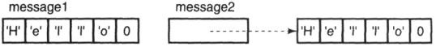

[toc]


&emsp;
# 第3章 字符串、向量和数组

&emsp;
## 1.为什么需要命名空间？
命名空间的存在是 **为了解决命名冲突**，想象这样的情况：
> &emsp;&emsp; 程序员可能会写一个名为 `xyz()` 的函数，在另一个可用的库中也存在一个相同的函数 `xyz()`。这样，编译器就无法判断您所使用的是哪一个 `xyz()` 函数。
> &emsp;&emsp; 因此，引入了 命名空间 这个概念，专门用于解决上面的问题，它可作为附加信息来区分不同库中相同名称的函数、类、变量等。使用了命名空间即定义了上下文。
> 


&emsp;
## 2.为什么需要 命名空间的using声明？
&emsp;&emsp; 我们想使用标准输出的时候需要写成`std::cout`，但每次都要带上`std::`太麻烦了，此时可以通过 命名空间的`using`声明来解决这个问题。


&emsp;
## 3.如何使用 命名空间的using声明？
以 `cin、cout、endl`举例：
```cpp
using std::cin;  
using std::cout; 
using std::endl;  
```


&emsp;
## 4.头文件和using声明
&emsp;&emsp; 头文件不应该包含`using`声明， 因为 头文件中的内容会被拷贝到引用它的文件里面去，如果头文件包含了 `using`声明， 则所有引用该头文件的文件都会有这个`using`声明，这可能会引发 名字冲突。


&emsp;
## 5.string 是内置类型么？
&emsp;&emsp; 不是，它是 标准库类型。


&emsp;
## 6.string 属于哪个命名空间？
&emsp;&emsp; string 定义在 命名空间`std`中。
```cpp
using std::string;
```


&emsp;
## 7.初始化string的几种方法
```cpp
string s1;			// 默认初始化，s1 是一个空串
string s2(s1);		// 直接初始化，s2是s1的副本  
string s2 = s1;		// 拷贝初始化，等价于s2(s1),s2是s1的副本  
string s3("value");	// 直接初始化，s3是字面值"value"的副本，除了结尾的’\0’ 
string s3 = "value";  // 拷贝初始化，等价于s3("value"), 是字面值"value"的副本
string s4(n,'c');    // 直接初始化，把s4初始化为由连续n个字符'c'组成的串  
```


&emsp;
## 8.string 的直接初始化 和 拷贝初始化
拷贝初始化：用了  等于号（=）；
直接初始化：没有用等于号（=）；
```cpp
string s5 = "hiya";  // 拷贝初始化  
string s6("hiya");   // 直接初始化 
string s7(10, 'c');  // 直接初始化; s7 为 cccccccccc 
```


&emsp;
## 9.string s8 = string(10, 'c'); 发生了什么？
相当于创建了了一个临时变量，然后拷贝给了 s8，这条语句相当于：
```cpp
string temp(10, 'c'); // temp is cccccccccc  
string s8 = temp; // copy temp into s8  
```


&emsp;
## 10.C++ 有几种 `getline()`操作？
两种：
一种在头文件`<istream>`中，是`istream`类的成员函数。
一种在头文件`<string>`中，是普通函数。


&emsp;
## 11. cin >> string 和 string的getline() 有什么区别？
cin 
会忽略开头的空白，然后从第一个非空白字符开始读起，直到遇到下一个空格停止。
```cpp
int main()  
{  
    string s; // empty string  
    cin >> s; // read a whitespace-separated string into s  
    cout << s << endl; // write s to the output  
    return 0;  
}  
```
如果输入“  Hello World!  ”（注意开头、中间的空格），则输出则为“Hello”，没有开头的空格、后面的World，因为cin忽略了开头的空格，遇到中间的空格就停止读取了。
getline() 
直接读取一行，保留所有空白


&emsp;
## 12. sting::size_type类型是什么？
它是`sring.size()`的返回类型，是一个`unsigned`


&emsp;
## 13. 使用string的size()操作需要注意什么？
&emsp;&emsp; 因为`size()`返回的是 `sting::size_type`类型，而`sting::size_type`类型是一个 无符号类型，因此用了`size()`之后就不要用`int`类型了，这样可以避免混用`int`和`unsigned`可能带来的问题。


&emsp;
## 14. string的比较规则
1) 两个字符串长度不同，但短的那个和长的那个对应位置上的字符相同，则长的更大；
2) 两个字符串在某些对应位置上不一致，则是第一个不一样的地方的那个字符的比较结果。


&emsp;
## 15.两个string相加的规则
按从左往右的顺序连起来，比如：
```cpp
string s1 = "hello, ", s2 = "world\n";  
string s3 = s1 + s2; 	// s3 is hello, world\n  
s1 += s2; 			    // equivalent to s1 = s1 + s2  
```


&emsp;
## 16.字面值和string对象相加
### (1) 规则：
> 当混用 string对象、字符字面值、字符字面值的时候，需要保证**每个“+”的两边**至少有一个string对象。看下面的例子：
> 
```cpp
string s1 = "hello", s2 = "world"; // no punctuation in s1 or s2  
string s3 = s1 + ", " + s2 + '\n';  // 正确：“+”的两边至少有一个string对象
string s4 = s1 + ", "; 			// ok: adding a string and a literal  
string s5 = "hello" + ", "; 		// 错误: 没有string对象  
string s6 = s1 + ", " + "world"; 	// 正确: 原因见下  
string s7 = "hello" + ", " + s2; 	// error: can't add string literals  
```
### (2) 为什么 string s6 = s1 + ", " + "world"; 正确呢？第二个“+”的两边不都是字面值吗？
`string s6 = s1 + ", " + "world";`这条语句其实相当于 ：
```cpp
string s6 = (s1 + ", ") + "world"; 
```
`(s1 + ", ") `的结果是一个`string`对象，这个对象和 后面的字面值 "world" 相加，因此它是对的。
但下面这个是错的：
```cpp
string s7 = "hello" + ", " + s2; // 错误: "hello"  和  ", " 都是字面值  
```


&emsp;
## 17. 注意区分C++中 string对象 和 字符串字面值
&emsp;&emsp; 因为某些历史原因，也为了与 C 兼容，所以 C++ 语言中的字符串字面值 并不是标准库类型 string 的对象，切记，字符串字面值与 string 是不同的类型。


&emsp;
## 18. 处理string对象中字符需要包含哪个头文件？
cctype头文件


&emsp;
## 19.cctype 和 ctype.h有什么不同？
&emsp;&emsp; C语言的头文件形如`name.h`，C++将这些文件命名为`cname`。也就是掉了`.h`后缀，而在文件名`name`前加了字母`c`，此处`c`表示这是一个属于C语言标准库的头文件。因此， `cctype`头文件和`ctype.h`头文件内容其实是一样的。


&emsp;
## 20.如何使用范围for语句
```cpp
for (declaration : expression)  
    statement  
```
> declaration ：用来定义变量，该变量被用于访问序列的基础元素；
> expression  ：用于表示一个序列
> statement   ：你要做的操作
> 


&emsp;
## 21.如何用范围for语句遍历 string str("some string"); ？
注意可以用 auto来定义变量！
```cpp
string str("some string");  
for (auto c : str) // for every char in str  
    cout << c << endl; //
```


&emsp;
## 22.如何通过范围for语句将 string str("some string"); 改成大写？
把循环变量的定义改成引用类型即可，如：
```cpp
string s("Hello World!!!");  
for (auto &c : s) // 注意！c是引用！ 
    c = toupper(c); // 
cout << s << endl;  
// 结果是：
//	HELLO WORLD!!!
```


&emsp;
## 23. 范围for语句里为什么可以重新绑定引用？
因为 range-based for 是在每个迭代里绑定一个元素，看下面的代码：
```cpp
for (auto& c : s)  
    c = toupper(c);  

// 等价于  
for (auto itr = s.begin(); itr != s.end(); ++itr) {  
    auto& c = *itr; // <- 每个迭代中用一个新引用绑定一个元素  
    c = toupper(c);  
}  
```


&emsp;
## 24.如何正确使用下标迭代string对象？
想通过下表遍历string对象，需要先用 `string.size()` 获取该`string`的大小，然后从`0`开始遍历，如：
```cpp
for (int index = 0; index < s.size(); ++index)  
    cout<< s[index] << endl;  
```
这里存在一个问题，因为 `string.size()` 返回的是`unsigned`类型的，而 `index是` `int`类型的，因此`for`循环里将 它们 进行比较是有风险的。
**怎么解决这个问题呢？**这个时候我们可以用 `decltype`类型指示符，代码如下：
```cpp
for (decltype(s.size()) index = 0; index != s.size() ; ++index)  
    cout<< s[index] << endl;   
```
**其实最安全的是用 迭代器访问**


&emsp;
## 25. 使用vector需要包含什么？
包含头文件 和 `using`声明：
```cpp
#include <vector>  
using std::vector;  
```


&emsp;
## 26.vector本质上是什么？
它是 一个 类模板


&emsp;
## 27. vector的默认初始化
如下：
```cpp
vector<string> svec; // default initialization; svec has no elements  
```


&emsp;
## 28.vector的拷贝初始化和直接初始化
```cpp
vector<int> ivec; // initially empty  
// 在此时给 ivec 赋一些值 
vector<int> ivec2(ivec);  // 直接初始化(有括号)： ivec的内容拷贝到了ivec2  
vector<int> ivec3 = ivec; // 拷贝初始化(有等于号：ivec的内容拷贝到了ivec3  
vector<string> svec(ivec2); // 错误: svec 的元素对象是 string,而ivec是int
```


&emsp;
## 29.vector的列表初始化
当用列表初始化的时候，列表内的初始值的个数之和 等于 vector对象的大小
```cpp
vector<string> v1{"a", "an", "the"}; // 列表初始化，v1含有三个string对象  
vector<string> v2("a", "an", "the"); // 错误，应该用 花括号
```


&emsp;
## 30.vector的值初始化
&emsp;&emsp; 当只提供vector对象容纳元素数量而不提供初始值的时候此时库会创建一个值初始化元素初值，并把它赋给容器内的所有元素，初值由元素的类型决定：
> 内置类型，如int，元素自动初始化为0；
> 其他类型进行默认初始化。
> 
```cpp
vector<int> ivec(10);     // 10个元素，每个都被初始化为0
vector<string> svec(10);  // 10个元素，每个都是空串 
```


&emsp;
## 31.C++ vector内存增长
&emsp;&emsp; 当我们插入一个元素时它的预分配空间不够时，它会重新申请一段新空间，将原空间上的元素 复制到新的空间上去，然后再把新加入的元素放到新空间的尾部，以满足vector元素要求连续存储的目的。


&emsp;
## vector的内存增长会引发什么后果？
&emsp;&emsp; vector的内存增长后(进行了插入操作)，原空间会被系统撤销或征做他用，于是指向原 空间的迭代器就成了类似于“悬垂指针”一样的东西，指向了一片非法区域。


&emsp;
## 32.vector预分配的内存不够时，下一次的分批比例是多少？
&emsp;&emsp; 增长比例`k`一般介于`1 < k <= 2`，最佳比例大约是`1.5`


&emsp;
## 33. 范围for语句和 vector的push_back()操作
&emsp;&emsp; 如果需要在循环体内部向`vector`增加元素的话，则不能使用范围for语句


&emsp;
## 34.如何使用范围for语句 将vector<int> v{1,2,3,4,5,6,7,8,9}; 的值变为平方？
如下：
```cpp
vector<int> v{1,2,3,4,5,6,7,8,9};  
for (auto &i : v) // for each element in v (note: i is a reference)  
    i *= i; // square the element value  
for (auto i : v) // for each element in v  
    cout << i << " "; // print the element  
cout << endl;  
```


&emsp;
## 35.能否用下标给vector添加元素？
&emsp;&emsp; 显然不可以，下标访问只能用来访问已存在的元素。


&emsp;
## 36.string有迭代器吗？
&emsp;&emsp; 虽然`string`不是容器，但是它也有迭代器。


&emsp;
## 37.尾后迭代器指向的是哪里？
&emsp;&emsp; 指向的是 最后一个节点的下一个节点。


&emsp;
## 38.如果容器为空，begin和end返回什么？
&emsp;&emsp; 它们返回的是同一个迭代器，都是尾后迭代器。


&emsp;
## 39. 如何利用迭代器将string对象改为大写？
```cpp
string str("Some string");  
for(auto itr= str.begin(); itr!= str.end() && !isspace(*itr); ++itr)  
    *itr = toupper(*itr); 
```


&emsp;
## 40. 迭代器是什么类型？
和 `size_type`一样，我们也不知道（也不用知道）迭代器的精确类型，我们平常使用`iterator `和 `const_iterator`
```cpp
vector<int>::iterator it; 	// it can read and write vector<int> elements  
string::iterator it2;	 	// it2 can read and write characters in a string  
vector<int>::const_iterator it3; // it3 can read but not write elements  
string::const_iterator it4; 	 // it4 can read but not write  
```


&emsp;
## 41. cbegin() 和 cend() 是什么？
&emsp;&emsp; 它返回 `const_iterator`，有点类似于常量指针，只能访问指向的内容，但是不能修改。


&emsp;
## 42. 解引用运算符 和 点运算符谁的优先级高？
&emsp;&emsp; 点运算符的优先级比较高


&emsp;
## 43.解引用一个迭代器得到的是什么？
&emsp;&emsp; 注意，解引用迭代器，得到的是该迭代器 所指向元素的引用(所以我们可以通过迭代器修改容器)。


&emsp;
## 44.如果一个迭代器指向的是一个类，如何通过迭代器进行成员访问？
举个例子，对于一个包含`string`的`vector`来说，想看迭代器`it`指向的字符串是否为空，可以这么做：
> ① 先解引用迭代器，再用点运算符；
> ② 用 箭头运算符（->）（C语言也有这个特性）
> 
```cpp
(*it).empty() //   
it->empty()   // 
```
如果想先解引用迭代器，再用点运算符，千万不能这么写：
```cpp
*it.empty() // 错误：因为 点运算符 的优先级比 解引用 高
```


&emsp;
## 45. 哪些 对vector的操作 会使迭代器失效？
&emsp;&emsp; 任何一种改变`vector`容量的操作都会使迭代器失效，比如 `push_back()`


&emsp;
## 46.为什么迭代器会失效呢？
任何一种改变vector容量的操作都会使迭代器失效，比如 push_back()，原因如下：
> &emsp;&emsp; 当我们插入一个元素时它的预分配空间不够时，它会重新申请一段新空间，将原空间上的元素 复制到新的空间上去，然后再把新加入的元素放到新空间的尾部，以满足vector元素要求连续存储的目的。而后原空间会被系统撤销或征做他用，于是指向原 空间的迭代器就成了类似于“悬垂指针”一样的东西，指向了一片非法区域。
> 


&emsp;
## 47. 迭代器相减得到的是什么类型？
&emsp;&emsp; 得到的是一个 `difference_type`类型，它实际上是一个 **带符号**的整型（因为有可能是负值）。


&emsp;
## 48. 该使用vector还是数组？
&emsp;&emsp; 因为数组不能随意增加元素，因此如果不确定元素的确切个数，应该使用`vector`。


&emsp;
## 49. 定义数组的时候需要注意什么？
定义数组的时候，数组的个数 **必须是** 常量表达式，看下面的代码：
```cpp
unsigned cnt = 42; 		  	// 非 常量表达式  
constexpr unsigned sz = 42; // 常量表达式  

int arr[10]; 				 	// 正确：数组个数是字面值  
int *parr[sz];			 		// 正确：常量表达式  
string bad[cnt]; 			 	// 错误: cnt 不是 常量表达式  
string strs[get_size()];    	// 只有在 get_size() 是常量表达式时才正确。
```


&emsp;
## 50. 如果实在不确定 数组的个数怎么办？
用`malloc()` 函数动态分配。


&emsp;
## 51. 如何用malloc()分配n个int类型
```cpp
int * ptr = (int *) malloc(n *  sizeof(int));
```


&emsp;
## 52. 为什么数组不允许拷贝和赋值？
```cpp
int a[] = {0, 1, 2};  
int a2[] = a;       // 错误: 不能对数组进行拷贝初始化  
a2 = a;             // 错误: 数组不能赋值  
```
原因：
> 数组名是一个地址常量，其值和第一个元素的地址值相同，不可修改。所以他们不能直接赋值。
> 


&emsp;
## 53. C++的 数组元素不能是什么类型？为什么呢？
```cpp
int &refs[10] = /* ? */; // 错误: 不存在引用的数组  
```
不能是引用。
因为 引用并不是变量，只是一个别名：
> &emsp;&emsp; 在C++中，引用可以说只是某个变量的别名，所谓别名，是和指针类型区分开的，指针类型可以指向某个变量，而且指针类型本身也是一个变量，而引用本身实际上不是一个变量。更本质来说，可以理解为引用没有自身的地址，不占用内存空间，因此，声明引用数组没有办法分配内存空间，因为根本就没有空间可以分配给引用，所以不能声明和定义引用数组。（其实引用的内部实现是一个常量指针，它的大小也和指针一样。）
> 


&emsp;
## 54. 如何理解 `int (*Parray)[10] = &arr`;？
```cpp
int arr[10]   
int (*Parray)[10] = &arr; // Parray 是一个指向含有10个整数的数字
```
要想理解 数组声明 的含义，最好的办法就是从数组的名字开始 按由内向外的顺序 阅读：
> (1) 由 `(*Parray) `可以看出 `Parray` 是一个指针；
> (2) 再看等号的右边，可以知道指向的是大小为`10`的数组；
> (3) 最后观察左边，知道数组元素为 `int`类型。
> 
同理，下面这个声明： `(&arrRef)` 是`arrRef`一个引用，它引用的是一个大小为`10`的`int`数组。
```cpp
int (&arrRef)[10] = arr; // arrRef refers to an array of ten ints
```


&emsp;
## 55.如何引用数组？
在引用一个数组时，我们需要带上数组的长度才行：
```cpp
int n3[3] = {2, 4, 6};

int (&rn3)[3] = n3;     //数组的引用
```
`rn3` 就是数组的引用，它引用了`n3`


&emsp;
## 56. 编译器会把数组转换成什么？
编译器会把 数组 转换为 指针。


&emsp;
## 57. 使用数组作为auto变量的初始值时，得到的是什么类型？
得到的是指针：
```cpp
int ia[] = {0,1,2,3,4,5,6,7,8,9};   
auto ia2(ia); 			// ia2 是 int* 类型  
ia2 = 42; 				// 错误: ia2 是指针  
```


&emsp;
## 58. 数组有begin() 和 end() 吗？
有的，但是调用方式和容器不一样，因为数组毕竟不是容器，数组的begin() 和 end()的调用方式和函数一样：
```cpp
int ia[] = {0,1,2,3,4,5,6,7,8,9}; // ia is an array of ten ints  

int *beg = begin(ia); // 指向 ia 的首元素

int *last = end(ia); // 指向ia的尾后，即ia最后一个元素的下一个位置。  
```
`begin()` ：指向数组的首元素。
`end()`	：和尾后迭代器一样，指向数组的最后一个元素 的下一个位置。


&emsp;
## 59. 两个指针相减得到的是什么类型？
&emsp;&emsp; `ptrdiff_t`， 类似于 `size_t`，因为可能是负值，所以是个**带符号**类型。


&emsp;
## 60. 指向数组的指针 的比较 有什么限制呢？
相互比较的 两个 指向数组的指针 必须指向同一个数组的元素：
```cpp
int *b = arr, *e = arr + sz;  
while (b < e) {  // 正确，b 和 e 指向 同一个数组
    ++b;  
}  
```
下面这样是错误的：
```cpp
int i = 0, sz = 42;  
int *p = &i, *e = &sz;  
while (p < e){  // 错误，p 和 e 指向 两个不同的数组
    ++b;   
}
```


&emsp;
## 61. char a[] = {'a', 'b', 'c', 'd'，'e'} 和 char a[] = "abcde" 有何区别？
它们含有的元素不一样：
> 列表初始化那个是5个；
> 用"abcde"初始化那个是6个，这是因为编译器会主动在后面加一个”\0”上去。
> 
```cpp
char a[] = {'a','b','c','d','e'}; // 数组长度和初始化列表里的个数一样，5个 
char b[] = "abcde";               // 编译器会主动在后面加一个”\0”上去，6个
```


&emsp;
## 62.char message1[] = "Hello"; 和 char *message2 = "Hello";有何区别？
这两个初始化看上去很像， 但它们具有不同的含义：
```cpp
char message1[] = "Hello"; // 初始化一个字符数组的元素，存放在 栈区 或 堆区 ；
char *message2 = "Hello";  // 这是一个真正的字符串常量，这个指针变量被初始化为指向这个字符串常量的存储位置， 存放在 全局静态区，修改它会产生段错误；
```
如下图所示：
<div align="center">  </div>


&emsp;
## 63.char *str1 = "Hello" 和 char *str2 = "Hello" 指向的地址一样吗？
&emsp;&emsp; 是的，它们指向同一地址。


&emsp;
## 64. vector 和 string分别对应 c语言的什么？
(1) vector	：数组；
```cpp
int int_arr[] = {0, 1, 2, 3, 4, 5};   
vector<int> ivec{0, 1, 2, 3, 4, 5};  
```
(2) string	：c风格字符串。
```cpp
string str1("Hello World"); //   
char str2[] = "Hello World"; //  
```


&emsp;
## 65. 混用string对象和c风格字符串需要注意什么？
&emsp;&emsp; 可以用 c风格字符串 初始化 string对象，反过来却不行。


&emsp;
## 66. 二维数组在内存中的存储方式是怎样的？
&emsp;&emsp; 在C中，多维数组的元素存储顺序按照 最右边的下标率先变化 的原则，称为**行主序(row major order)**。

