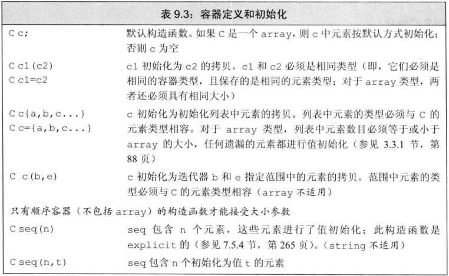
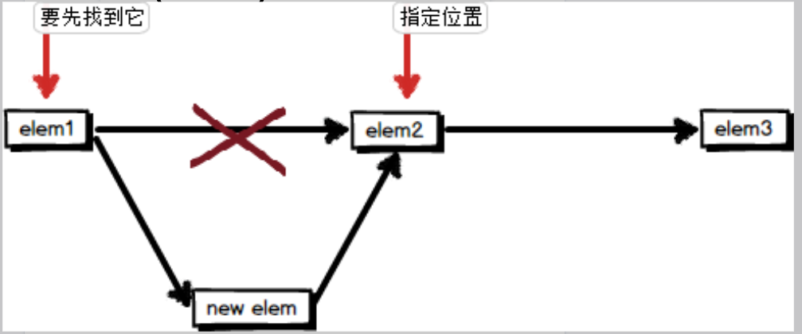
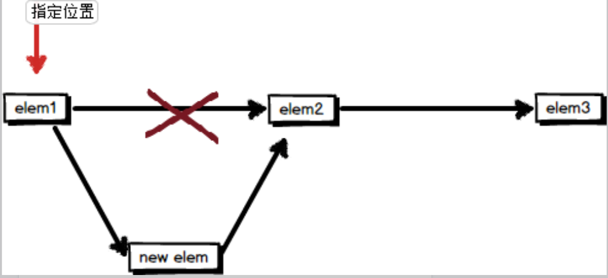
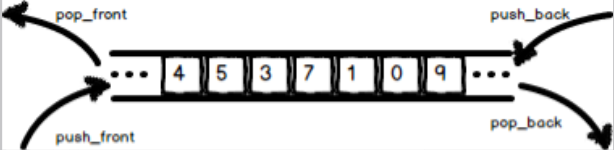

[toc]


# 第九章 顺序容器
&emsp;
## 1.什么是顺序容器（sequential container）？
&emsp;&emsp; 一个容器就是一些特定类型对象的集合。顺序容器为程序员提供了控制元素存储顺序的能力。这种顺序不依赖于元素的值，而是与元素加入容器的位置相对应。


&emsp;
## 2.C++标准库提供了哪些顺序容器？
|                |                                                                          |
| -------------- | ------------------------------------------------------------------------ |
| `vector`       | 可变大小的数组。支持快速随机访问，在尾部之外插入或者删除元素可能会很慢   |
| `deque`        | 双端队列，支持快速随机访问，在头尾位置插入/删除元素速度很快              |
| `list`         | 双向连标，只支持双向顺序访问，在list中任何位置进行插入删除操作速度都很快 |
| `forward_list` | 单向链表，只支持单向顺序访问，在链表任何位置插入删除元素速度很快         |
| `array`        | 固定大小的数组，支持快速随机访问，不能添加或者删除元素                   |
| `string`       | 与vector容器类似，但专门用于保存字符，随机访问快。在尾部插入与删除速度快 |


&emsp;
## 3.`vector<noDefault> v2()` 其中`noDefault`是一个自定义的类类型，这个语句有什么问题吗？
上面的语句将执行默认初始化，因此：
> 若类`noDefault`没有默认构造函数，错误
> 若类`noDefault`有默认构造函数，正确
>

&emsp;
## 4.顺序容器本质上是什么？
&emsp;&emsp; 模板类


&emsp;
## 5.iter是一个迭代器，`*iter`得到的是什么？
&emsp;&emsp; 得到的是`iter`所指向元素的引用，注意是引用！


&emsp;
## 6.iter是一个迭代器，`iter->men`是什么意思？
&emsp;&emsp; `iter->men`相当于：`(*iter).men`


&emsp;
## 7.哪些操作是迭代器都支持的？
|                  |                                                              |
| ---------------- | ------------------------------------------------------------ |
| `*iter`          | 返回迭代器`iter`所指元素的引用                               |
| `iter->mem`      | 解引用`iter`并获取该元素名为`mem`的成员，等价于`(*iter).mem` |
| `++iter`         | 令`iter`指向容器中的下一个元素                               |
| `--iter`         | 令`iter`指向容器中的上一个元素                               |
| `iter1 == iter2` | 判断两个迭代器是否相等                                       |
| `iter1 != iter2` | 判断两个迭代器是否不等                                       |


&emsp;
## 8.有哪些容器支持额外的迭代器操作？为什么？
`string`、`vector`、`deque`和`array`的迭代器可进行的额外操作：
> 迭代器运算：				`iter+n、 iter-n 、iter1- iter2`
> 除!=和==之外的关系运算：	`> 、 >= 、 < 、 <=`
> 
原因：
> &emsp; vector、string和deque本质上是数组，它们是有序的，拿iter+n来说：
> > &emsp;&emsp; 如果iter是vector容器的迭代器，iter+n指的是iter所指向的元素的后面的第n个元素（因为vector和deque本质上是数组，即它们是有序的）；
> > &emsp;&emsp; 但如果iter是list容器的迭代器，对它加n是没有意义的，因为list是链表，它的元素在内存中不是连续的，在内存中，第二个元素也可能在第一个元素的前面，因此iter+n并不能指向iter后面的第n个元素，因此为list的迭代器提供这个操作是没有意义的。
> 


&emsp;
## 9.使用不同的容器的迭代器时需要注意什么？
&emsp;&emsp; 不能混用，因为它们压根不是一个类型，就像`int *` 和 `char*` 一样都是指针，但它们不是一个类型。


&emsp;
## 10.`difference_type`是什么？
&emsp;&emsp; 两个迭代器相减得出两个迭代器对象的距离，该距离名为`difference_type`的`signed`类型的值，该类型类似于`size_type`类型。


&emsp;
## 11.forward_list容器的迭代器有何不一样？
&emsp;&emsp; 它不支持递减运算符（`--`）


&emsp;
## 12.容器有哪些初始化方式？
<div align="center">  </div>


&emsp;
## 13.将容器初始化为另一个容器的拷贝 时需要注意什么？
&emsp;&emsp; 创建一个容器c1为容器c2的拷贝时，要求c1和c2的 容器类型 以及 元素类型必须匹配；
&emsp;&emsp; 当传递迭代器来拷贝一个范围时，不要求容器类型、元素类型匹配，只要元素类型可以转换即可。


&emsp;
## 14.下列代码正确的是？
```c++
// 每个容器有三个元素，用给定的初始化器进行初始化
list<string> authors = {"Milton", "Shakespeare", "Austen"};  
vector<const char*> articles = {"a", "an", "the"};  

list<string> list2(authors);   
deque<string> authList(authors);   
vector<string> words(articles);    
forward_list<string> words(articles.begin(), articles.end()); 
```
解答：
```c++
list<string> list2(authors); // 正确: 容器类型匹配 
deque<string> authList(authors); // 错误: 容器类型不匹配
vector<string> words(articles); // 错误: 容器类型不匹配 

// 正确: converts const char* elements to string  
forward_list<string> words(articles.begin(), articles.end()); 
```


&emsp;
## 15.下列构造函数分别表示什么意思？
```c++
vector<int> ivec(10, -1);   
list<string> svec(10, "hi!"); 
forward_list<int> ivec(10); 
deque<string> svec(10);   
```
解答：
```c++
vector<int> ivec(10, -1); // ten int elements, each initialized to -1  
list<string> svec(10, "hi!"); // ten strings; each element is "hi!"  
forward_list<int> ivec(10); // ten elements, each initialized to 0  
deque<string> svec(10); // ten elements, each an empty string  
```


&emsp;
## 16.只为构造函数提供一个 容器大小 的参数时，需要注意什么？
&emsp;&emsp; 该容器的元素类型必须有默认构造函数或是内置类型。


&emsp;
## 17.定义一个array时需要注意什么？
和其它容器不一样的是，当定义一个`array`的时候，除了需要制定元素类型，还要指定容器的大小：
```c++
array<int, 42> // type is: array that holds 42 ints  
array<string, 10> // type is: array that holds 10 strings  
array<int, 10>::size_type i; // array type includes element type and size  
array<int>::size_type j; // error: array<int> is not a type 
```


&emsp;
## 18.如何定义一个array容器的迭代器？
```c++
array<int, 10>:: iterator iter1; // 正确  
array<int>:: iterator iter2; 	  // 错误: array<int> 不是一个类型！
```


&emsp;
## 19.相比于普通数组，array多了了什么操作？
`array`可以进行拷贝和赋值操作
```c++
int digs[10] = {0,1,2,3,4,5,6,7,8,9};  
int cpy[10] = digs;     // error: no copy or assignment for built-in arrays  

array<int, 10> digits = {0,1,2,3,4,5,6,7,8,9};  
array<int, 10> copy = digits; // ok: so long as array types match 
```


&emsp;
## 20.相比于普通数组，array的优势在哪？
(1) `array`比数组更安全。它提供了`opeartor[]`与`at()`成员函数，后者将进行数组越界检查。
 
(2) 与其他容器相似，`array`也有自己的迭代器，因此`array`能够更好地与标准算法库结合起来。
 
(3) 通过`array::swap`函数，可以实现线性时间内的两个数组内容的交换。
 
(4) 不像`C-style`数组，`array`容器类型的名称不会自动转换为指针（这个不一定是优势）


&emsp;
## 21.array的底层数据结构是？
&emsp;&emsp; `array`的底层数据结构是固定数组。与`C-style`的数组类似，它的大小在定义后就不能被改变，这就是`array`不能改变大小的原因。


&emsp;
## 22.forward_listd 的底层数据结构是什么？
&emsp;&emsp; `forward_list`的底层数据结构为单向链表。


&emsp;
## 23.相比于`list`，`forward_list`有何优势？
&emsp;&emsp; 更节省内存，因为`forward_list`没有反方向的迭代器，所以`forward_list`的每个节点都节省了迭代器大小的开销，在元素众多的时候，将比`list`消耗少得多的内存。


&emsp;
## 24.相比于其它STL容器，forward_list有何特殊的地方？
(1) `forward_list`不提供返回其大小的操作
> &emsp;&emsp; 每个容器类型都有三个与大小相关的操作，`forward_list`只提供了`max_size()`,`empty()`
> &emsp;&emsp; 在所有已知的STL容器中，`forward_list`是唯一一个不提供`size()`的容器。不提供的原因在于计算一个`forward_list`的长度需要线性的时间，库用户有时无法忍受这样的时间开销。
> 
(2) `forward_list`是唯一一个在给定位置之后插入新元素的容器

(3) 同样的，处于性能的考虑，`forward_list`没有提供在尾部进行操作的接口，包括`push_back()`,`pop_back()`和`emplace_back()`,这些操作对单列表来说都至少要花费O(n)来完成

(4) 没有`back`成员函数

(5) `forward_list`的迭代器没有 递减操作（`--`）


&emsp;
## 25.如何计算`forward_list`的元素个数？
使用`distance(begin, end)`计算，其中`begin`和`end`是分别为首、尾前期
```c++
int main()  
{  
    forward_list<int> flist;  
    for (int i = 0; i < 10; i++)
    {  
        flist.push_front(i);  
    }  
    std::cout << std::distance(flist.begin(), flist.end()); //输出10  
}    
```


&emsp;
## 26.为什么`forward_list`这么特别，是在给定位置之后插入新元素呢？
&emsp;&emsp; 我们知道，`forward_list`的底层数据结构是单向链表，为了在单向链表的某个指定节点之前插入插入节点，我们必须改变插入位置的前一个节点的指向。换句话说，为了在指定节点之前插入新元素，我们必须要先获得插入位置前一个位置的节点，因此对于`forward_list`来说，我们必须从头遍历链表，直到找到该元素的前一个元素:
<div align="center">  </div>

&emsp;&emsp; 而如果我们是在指定位置之后插入新元素，则无需线性时间的查找操作，这样可实现常数时间的插入:
<div align="center">  </div>

&emsp;&emsp; 同样的，处于性能的考虑，`forward_list`没有提供在尾部进行操作的接口，包括`push_back()`,`pop_back()`和`emplace_back()`，因为这些操作对单列表来说都至少要花费`O(n)`来完成。


&emsp;
## 27. `list`的底层数据结构是？
&emsp;&emsp; `list`同样是一个模板类，它底层数据结构为双向循环链表。因此，它支持任意位置常数时间的插入/删除操作，不支持快速随机访问。


&emsp;
## 28. `list`的内存分配策略？
&emsp;&emsp; `list`的空间配置策略，就像普通双向链表那样，有多少元素申请多少内存。它不像`vector`那样需要预留空间供新元素的分配，也不会因找不到连续的空间而引起整个容器的内存迁移。


&emsp;
## 29.list和forward_list怎么选？
&emsp;&emsp; 通常来说，`forward_list`在使用灵活度上比不上`list`，因为它只能单向迭代元素，且提供的接口没有`list`多。然而，在内存的使用上，它是比`list`占优势的。当对内存的要求占首要位置时，应该选择`forward_list`。


&emsp;
## 30.deque是是什么的缩写？
&emsp;&emsp; double—ended queue


&emsp;
## 31.deque的底层数据结构是？
&emsp;&emsp; vector是单向开口的线性连续空间，deque则是一种双向开口的连续数据空间。所谓的双向开口，意思是可以在头尾两端分别做元素的插入和删除操作。当然vector也可以在头尾两端进行操作，但是其头部操作效果奇差，所以标准库没有为`vector`提供`push_front`或`pop_front`操作。
&emsp;&emsp; 与`vector`类似，`deque`支持元素的快速随机访问。`deque`的示意图如下：
<div align="center">  </div>


&emsp;
## 32.deque的空间真的是连续的？
&emsp;&emsp; 准确的说是分段连续的，用户看起来deque使用的是连续空间


&emsp;
## 33.deque底层是怎么实现的？
deque有一个中控器，即所谓的map（不是STL的那个map）作为主控，map是一小块连续的空间，它里面的每一个元素都是一个指针，指向的是另一段连续的空间，称为缓冲区，这个缓冲区用来存储deque的元素
在下图中，buffer称为缓冲区，显示map size的一段连续空间就是中控器：


&emsp;
## 34.既然vector和deque都可以随机访问，而且deque在头部插入还那么快，为什么不用deque呢？
因为deque的实现特点决定了它的随机访问性能远不如vector。


&emsp;
## 35.当内存不够时，deque和vector的内存重分配策略是一样的吗？
不一样，deque的要效率高很多
vector的内存重分配一般是：另觅更大的空间；将原数据复制过去；释放原空间，
deque若需要在头部或尾部增加新空间，只要配置一段连续的空间然后将其串连在deque的头部或尾部即可，这就避开了“重新配置空间、复制、释放原空间”的循环，所以deque在内存不够用时插入数据效率比较高。


&emsp;
## 36.deque的迭代器和vector在实现上是一样的吗？
不一样，为了使得这些分段的连续空间看起来像是一个整体，deque的迭代器必须有这样的能力：它必须能够指出分段连续空间在哪里，判断自己所指的位置是否位于某一个缓冲区的边缘，如果位于边缘，则执行operator-- 或operator++时要能够自动跳到下一个缓冲区。因此，尽管deque的迭代器也是Ramdon Access Iterator 迭代器，但它的实现要比vector的复杂太多。（具体实现要看《STL源码剖析》）


&emsp;
## 37.STL中有哪些容器是连续的内存空间？
vector、deque（看起来是）、array


&emsp;
## 38.为什么说除array外，其它stl容器执行swap都很快？
因为除array外，swap不对任何元素进行拷贝、删除或插入，只是交换了两个容器的内部数据结构，因此可以保证在常数时间内完成


&emsp;
## 39.使用swap( )交换stl容器的时候发生了什么？
 除array外，swap不对任何元素进行拷贝、删除或插入，只是交换了两个容器的内部数据结构，因此可以保证在常数时间内完成；
 对于array，会在两个array变量中进行交换，耗费时间与array中的元素成正比。


&emsp;
## 40.swap操作会使迭代器失效吗？
因为swap操作后，元素并不会被移动，这意味着，string除外，指向容器的迭代器、引用和指针在swap操作后不会失效。它们仍指向swap操作之前的那些元素。但在swap之后，这些元素已经属于不同的容器了。例如有两个容器vec1和vec2，假定iter1在swap前指向vec1[3]， 在swap之后它指向vec2[3]。  
但是，对一个string调用swap会导致迭代器、引用和指针失效。
对array调用swap会导致迭代器、引用和指针失效，因为对array调用swap会交换元素，迭代器肯定会失效了。
下面通过代码来看对vector执行swap后迭代器的情况：
```c++
1.int main ()  
2.{  
3.    vector<int> vec1 = {0, 1, 2, 3, 4};  
4.    vector<int> vec2 = {5, 6, 7 ,8, 9};  
5.  
6.    vector<int>::iterator itr1 = vec1.begin();  
7.    vector<int>::iterator itr2 = vec2.begin();  
8.  
9.    cout <<"itr1:   "<< *itr1 << ";  itr2:   "<< *itr2 << endl;  
10.       
11.    swap(vec1, vec2);  
12.       
13.    cout <<"vec1[0]:"<< vec1[0] << ";  vec2[0]:" << vec2[0] << endl;  
14.    cout <<"itr1:   "<< *itr1   << ";  itr2:   "<< *itr2 << endl;  
15.           
16.    return 0;  
17.}  
```
运行结果如下图，这说明经过了swap操作，迭代器也交换了，它们仍指向swap操作之前的那些元素（跟着老东家一起跑了）

将上面的代码中的vector改为array后：
```c++
1.int main ()  
2.{  
3.    array<int, 5> arr1 = {0, 1, 2, 3, 4};  
4.    array<int, 5> arr2 = {5, 6, 7 ,8, 9};  
5.  
6.    array<int, 5>::iterator itr1 = arr1.begin();  
7.    array<int, 5>::iterator itr2 = arr2.begin();  
8.  
9.    cout <<"itr1:   "<< *itr1   << ";  itr2:   "<< *itr2 << endl;  
10.       
11.    swap(arr1, arr2);  
12.       
13.    cout <<"arr1[0]:"<< arr1[0] << ";  arr2[0]:" << arr2[0] << endl;  
14.    cout <<"itr1:   "<< *itr1   << ";  itr2:   "<< *itr2 << endl;  
15.           
16.    return 0;  
17.}  
```
运行结果如下，迭代器已经还是指向原来的的位置（老东家跑了，迭代器不愿意跟着，还指向原来的地址），所以它失效了


&emsp;
## 41.string调用swap会导致迭代器、引用和指针失效吗？为什么？
会的，默认情况下，C++的std::string都是存储在heap中，导致访问std::string需要经过一次寻址过程，速度较慢，并且这种实现的空间局部性不好，对cache的利用较低。
　　很多string的字符串长度很小，这个时候，我们可以把字符串存储到栈上，从而不需要进行内存分配，优化创建速度，并且访问栈上数据的局部性很好，速度比较快。
即C++会自动把较短的字符串放到对象内部，较长的字符串放到动态内存。
假如 std::string 用 SSO 实现，而待交换的两个对象中的字符串恰好一长一短，则原先指向短字符串中的迭代器会全部失效。


&emsp;
## 42.assign操作有什么作用？
assign提供了三个版本：

 传两个迭代器的版本允许我们从一个不同但相容的类型赋值，或者从容器的一个子序列赋值：
```c++
1.list<string> names;  
2.vector<const char*> oldstyle;  
3.names = oldstyle; // 错误: 容器类型不匹配  
4.// 正确: 可将 const char*转为string  
5.names.assign(oldstyle.cbegin(), oldstyle.cend());  
```
版本seq.assign(n, t)将指定的数目且具有相同的给定值的元素替换容器原有的元素：
```c++
1.// 等价于： slist1.clear();  
2.list<string> slist1(1); // slist1含一个元素, 是一个空 string  
3.// 等价于：slist1.insert(slist1.begin(), 10, "Hiya!"); 
4.slist1.assign(10, "Hiya!"); // 10个元素; 每一个都是 Hiya !
```


&emsp;
## 43.assign有什么特殊的地方？
顺序容器才有assign，关联容器没有！


&emsp;
## 44.为什么forward_list不提供size()操作？
为了提供常量时间的size成员函数，内部需要记录一个forward_list大小的成员变量，这样会增加额外的存储空间，也会影响插入和删除的操作效率，所以实现中没有为forward_list提供size操作。可以用distance计算begin和end之间的距离，这个操作是线性时间复杂度。


&emsp;
## 45.容器支持关系运算符吗？
所有容器都支持相等运算符（== 和 !=）;
但只有顺序容器支持关系运算符（>、>=、<、<=）


&emsp;
## 46.容器的比较规则是怎样的？
如果两个容器具有相同的大小，且所有元素都两两对应相对，则这两个容器相等，否则不等。
如果两个容器大小不同，但较小容器的每个元素都等于较大容器中的对应元素，则较小容器小于较大容器。
如果两个容器都不是另一个容器的前缀子序列，则它们的比较结果取决于第一个不相等的元素的比较结果。


&emsp;
## 47.下列容器的比较结果是怎样的？
```c++
1.vector<int> v1 = { 1, 3, 5, 7, 9, 12 };  
2.vector<int> v2 = { 1, 3, 9 };  
3.vector<int> v3 = { 1, 3, 5, 7 };  
4.vector<int> v4 = { 1, 3, 5, 7, 9, 12 };  
5.v1 < v2   
6.v1 < v3   
7.v1 == v4   
8.v1 == v2  
```
结果：
```c++
1.v1 < v2 // true; v1 and v2 differ at element [2]: v1[2] is less than v2[2]  
2.v1 < v3 // false; all elements are equal, but v3 has fewer of them;  
3.v1 == v4 // true; each element is equal and v1 and v4 have the same size()  
4.v1 == v2 // false; v2 has fewer elements than v1 
```


&emsp;
## 48.容器的关系运算符的使用有何限制？
因为容器的关系运算符是通过元素的关系运算符完成比较的，因此只有元素类型定义了比较运算符时，我们才能使用关系运算符来比较两个容器。
这就意味着，如果容器内的元素类型是自定义的类型，要对容器使用关系运算符，那必须的定义该类型的关系运算符：
```c++
1.vector<Sales_data> storeA, storeB;  
2.    if (storeA < storeB) // error: Sales_data has no less-than operator  
```


&emsp;
## 49.哪些容器不支持push_back和emplace_back？为什么？
array和forward_list都不支持：
array是定长的，不能动态插入元素；
forward_list是单向链表，所以我们如果想要访问尾元素，都要从首元素开始跌代，算法复杂度为O(n)，所以不支持push_back( )。


&emsp;
## 50.哪些容器不支持push_front和emplace_front？为什么？
array、vector和string都不支持：
array是定长的，不能动态插入元素；
vector和string在内存中是连续的，对它们进行push_front和emplace_front操作的话，时间复杂度会很高（要重新申请空间然后复制过去），所以不提供看似高效实则低效的操作，以免误用。


&emsp;
## 51.vector如何实现在头部插入元素？
vector没有push_front操作，因此只能通过vec.insert(0)实现在头部插入元素。


&emsp;
## 52.vector有push_front吗？为什么？
没有，vector的设计就是为了O(1)的push_back( )，而push_front对vector来说性能等同于O(n)的insert，所以就不提供push_back，避免误用（如果提供了，会给用户一种push_front和push_back复杂度一样的错觉），而这正是 STL 接口（concept）的优点，也是泛型编程优于面向对象的方面：明确的时间复杂度，不提供看似高效实则低效的操作，以免误用（例如 list 就没有 operator[]）。


&emsp;
## 53.STL容器的插入操作（insert）中，是在给定元素前面还是后面插入新元素？
除forward_list外，其他所有STL容器都是在指定位置之前插入元素（除了std::array，它不允许插入）。


&emsp;
## 54.顺序容器有哪几个insert( )操作？


&emsp;
## 55.下面这个代码正确吗？为什么？
```c++
1.vector<string> svec;  
2.list<string> slist;  
3.vector<string> v = {"quasi", "simba", "frollo", "scar"};  
4.slist.insert(slist.begin(), v.end() - 2, v.end());  
5.slist.insert(slist.end(), {"these", "words", "will",  "go", "at", "the", "end"});  
6.slist.insert(slist.begin(), slist.begin(), slist.end());  
```
解答：
```c++
1.// 运行时错误：迭代器表示要拷贝的范围，不能指向与目的位置相同的迭代器
2.slist.insert(slist.begin(), slist.begin(), slist.end());  
```


&emsp;
## 56.insert操作的返回值是什么？
insert( )将返回一个迭代器，这个迭代器指向的是刚刚插入的新元素。


&emsp;
## 57.有哪些emplace操作？
有三个emplace操作emplace_front、emplace,和emplace_back，分别对应push_front, insert和push_back，emplace操作采用构造而不是拷贝元素到容器中。


&emsp;
## 58.emplace和insert有何区别？
当调用insert时，我们将元素类型的对象传递给insert，元素的对象被拷贝到容器中；
而当我们使用emplace时，我们将参数传递元素类型的构造函数，emplace使用这些参数在容器管理的内存空间中直接构造元素。
```c++
1.// 在c的末尾构造一个 Sales_data 对象
2.// 使用三个参数的 Sales_data 构造函数
3.c.emplace_back("978-0590353403", 25, 15.99);  
4.// 错误: 没有接受三个参数的 push_back 版本  
5.c.push_back("978-0590353403", 25, 15.99);  
6.// 正确: 先创建一个Sales_data 的临时对象，然后通过 push_back插入末尾  
7.c.push_back(Sales_data("978-0590353403", 25, 15.99));  
8.
9.// iter refers to an element in c, which holds Sales_data elements  
10.c.emplace_back(); // 使用Sales_data的默认构造函数  
11.// 使用 Sales_data(string)，插入到迭代器iter前
12.c.emplace(iter, "999-999999999");  
13.// 使用 Sales_data 的接受一个 ISBN, 一个 count, 和一个 price的构造函数函数
14.c.emplace_front("978-0590353403", 25, 15.99);  
```


&emsp;
## 59.使用emplace操作需要注意什么？
emplace函数在容器中直接构造元素，传递给emplace函数的参数必须与元素类型的构造函数相匹配。


&emsp;
## 60.既然可以使用构造函数构造一个对象传给insert函数，那为什么还需要emplace呢？
使用emplace向容器中添加新元素时，是在容器管理的内存空间中构造新元素； 而insert是创建一个临时对象，然后插入容器中；相比之下，emplace操作省去了构造临时对象，减少了内存开销。


&emsp;
## 61. emplace_back能完全代替push_back吗？
不能，
```c++
1.std::vector<std::vector<int>> v;  
2.v.push_back({1,2,3}); // OK  
3.v.emplace_back({1,2,3}); // error，emplace_back是模板函数，对于{0}它无法确定是什么东西。而push_back不是模板函数，它会直接构造一个对应的对象拷过去。
4.v.emplace_back(std::vector<int>{1,2,3}); // OK  
5.v.emplace_back<std::vector<int>>({1,2,3}); // OK  
```
emplace_back的直接构造也不一定就是好事
```c++
1.std::vector<std::regex> v;  
2.v.push_back(nullptr); // 编译出错  
3.v.emplace_back(nullptr); // 通过编译，但运行时抛出异常并且难以定位
```
PS：emplace操作也不一定比insert高效。


&emsp;
## 62.emplace_back内部原理是怎样的？push_back呢？
emplcae_back 接收一个右值引用，调用其移动构造函数，将对象移动到容器中，而之前的push_back 是调用一次对象的拷贝构造函数， 容器中存储的是拷贝后的副本。


&emsp;
## 63.front和back成员函数的作用是？
front和back成员函数分别返回首元素和尾元素的引用。


&emsp;
## 64.哪个顺序容器没有back成员函数？
forward_list没有back成员函数


&emsp;
## 65.使用front和back成员函数的时候要注意什么？
要先检查容器是否非空，因为对一个空容器调用front和back就像使用一个越界的下表一样，是一种严重的程序设计错误。


&emsp;
## 66.vec.[6]和vec.at(6)有何区别？
1) vec.at(6)如果发生了下标越界，则会抛出一个out_of_range异常；而vec.[6]将会发生运行时错误。
2) vec.at(6)用的是小括号，而不是中括号！


&emsp;
## 67.顺序容器有哪些删除操作？


&emsp;
## 68.哪些顺序容器不支持pop_back( ) ?
array，因为它是定长数组
forward_list不支持pop_back( )，因为效率太低了，如果需要从forward_list中删除尾元素，则需要自己遍历到最后，然后erase( )。


&emsp;
## 69.哪些顺序容器不支持pop_front( )
array，因为它是定长数组；
vector、string也不支持，因为对于这两个容器来说，弹出首元素效率太低了，为了避免用户不知道这个操作效率低，所以stl不提供。


&emsp;
## 70.为什么STL对有些容器不实现相关操作？比如vector就没有push_front
这正是 STL 接口（concept）的优点，也是泛型编程优于面向对象的方面：明确的时间复杂度，不提供看似高效实则低效的操作，以免误用。
例如vector、string都不支持往头部插入（删除）元素，因为这首先需要重新申请内存，然后往头部插入（删除）元素，最后将旧元素复制过去，这样效率就很低了，如果提供了这种操作，用户会觉得这样用也没问题，造成程序效率低。


&emsp;
## 71.顺序容器的erase( )操作返回什么？
上面的图有答案。


&emsp;
## 72.forward_list有insert、empalce、erase吗？
没有，STL为forward_list提供了insert_after、empalce_after和erase_after


&emsp;
## 73.为什么forward_list需要提供特殊的插入和删除操作？
和list不一样，forward_list是单向链表，里面的元素只有一个指针指向它的下一个元素，而没有指向它前面元素的指针，所以他需要提供特殊版本的插入和删除操作。


&emsp;
## 74.forward_list有哪些特殊的操作？


&emsp;
## 75.resize( )的作用是？
增大或缩小容器：
	如果当前大小 大于 所要求的大小，容器后面的元素都会被删除；
	如果当前大小 小于 所要求的大小，会将新元素加到容器后部。


&emsp;
## 76.如果当前大小 小于 所要求的大小，vec.resize(n)将对vec将新增的元素进行什么初始化？
值初始化


&emsp;
## 77.有哪几个resize函数？


&emsp;
## 78.下面的代码的意思是？
```c++
1.list<int> ilist(10, 42);   
2.ilist.resize(15);   
3.ilist.resize(25, -1); 
4.ilist.resize(5); 
```
解答：
```c++
1.list<int> ilist(10, 42); // ten ints: each has value 42  
2.ilist.resize(15); // adds five elements of value 0 to the back of ilist  
3.ilist.resize(25, -1); // adds ten elements of value -1 to the back of ilist
4.ilist.resize(5); // erases 20 elements from the back of ilist 
```


&emsp;
## 79.什么情况下迭代器会失效？
1) 在容器中添加元素后
如果容器是vector或string，且存储空间被重新分配，则指向容器的迭代器、指针和引用都会失效；如果存储空间未重新分配，指向插入位置之前的元素迭代器、指针和引用仍有效，但指向插入位置之后元素的迭代器、指针和引用均会失效；
对于deque，插入到首尾位置之外的任何位置都会导致迭代器、指针和引用失效。如果在首尾位置添加元素，迭代器会失效，但指向存在的元素的引用和指针不会失效
对于list和forward_list，指向容器的迭代器（包括首前和尾后迭代器）、指针和引用仍有效；
2) 在容器中删除元素后
对于list和forward_list，指向容器其他位置的迭代器（包括首前和尾后迭代器）、指针和引用仍然有效（它使用了不连续分配的内存，并且它的erase方法也会返回下一个有效的iterator，所以其使用迭代器前移或者使用erase返回的迭代器均可）；
对于deque，如果在首尾之外的任何位置删除位置，那么指向被删除元素外其他元素的迭代器、引用或指针也会失效。如果是删除deque的首元素或尾元素，则尾后迭代器也会失效，但其他迭代器、引用和指针不受影响；
对于vector和string，指向被删除元素之前元素的迭代器、引用和指针仍有效，之后的全部失效。注意：当我们删除元素时，尾后迭代器总是会失效。（删除当前的iterator会使后面所有元素的iterator都失效。这是因为vetor,deque使用了连续分配的内存，删除一个元素导致后面所有的元素会向前移动一个位置。还好erase方法可以返回下一个有效的iterator，即后面的迭代器全部前移后的位置）
对于关联容器(如map, set, multimap,multiset)，删除当前的iterator，仅仅会使当前的iterator失效，只要在erase时，递增当前iterator即可。这是因为map之类的容器，使用了红黑树来实现，插入、删除一个结点不会对其他结点造成影响。


&emsp;
## 80.在向迭代器中添加或删除元素后，如何确保代码的准确性？
最小化要求迭代器，在进行了添加或删除元素后进行正确的重定位迭代器。


&emsp;
## 81.使用失效的迭代器有什么后果？
和使用试下的指针、引用一样，会造成严重的运行时错误。


&emsp;
## 82.下面的代码存在什么问题？
```c++
1.auto begin = v.begin(),  
2.end = v.end();  
3.while (begin != end) {  
4.    // do some processing  
5.    ++begin; // advance begin because we want to insert after this element  
6.    begin = v.insert(begin, 42); // insert the new value  
7.    ++begin; // advance begin past the element we just added  
8.}  
```
上面的代码保存了end()返回的迭代器，但在while循环里又进行了容器v进行了insert操作，这会导致end迭代器失效，此代码是未定义的，正确的做法是不保存end()返回的迭代器：
```c++
1.//safer: recalculate end on each trip whenever the loop adds/erases elements
2.while (begin != v.end()) {  
3.    // do some processing  
4.    ++begin; // advance begin because we want to insert after this element  
5.    begin = v.insert(begin, 42); // insert the new value  
6.    ++begin; // advance begin past the element we just added  
7.}  
```


&emsp;
## 83.vector的备用空间耗尽了怎么办？
当继续向容器中加入元素导致备用空间被用光（超过了容量 capacity），此时再加入元素时vector的内存管理机制便会扩充容量至两倍，如果两倍容量仍不足，就扩张至足够大的容量。容量扩张必须经历“重新配置、元素移动、释放原空间”这个浩大的工程。按照《STL源码剖析》中提供的vector源码，vector的内存配置原则为：
如果vector原大小为0，则配置1，也即一个元素的大小。
如果原大小不为0，则配置原大小的两倍。
整个的流程是：
1.先申请两倍内存，判断够不够，够进入2；否则，分配需要的大小；
2.拷贝要插入点之前的内容
3.构造插入元素顺次添加到后面
4.接着把之前插入点后面的内容拷贝到新的空间中
5.释放原来空间
当然，vector的每种实现都可以自由地选择自己的内存分配策略，分配多少内存取决于其实现方式，不同的库采用不同的分配策略。


&emsp;
## 84.vector是怎么知道的备用空间耗尽了的？
当迭代器finish等于迭代器end_of_storage时，备用空间就耗尽了：


&emsp;
## 85.vector的capacity()和size()
size()     ：	(大小)指容器当前拥有元素的个数；
capacity() ： (容量)指容器当前的容量，即在必须分配存储空间之前可以存储元素的总数；


&emsp;
## 86.reserve( )的作用是？
reserve()改变的是当前容器的最大容量（capacity），它不会生成元素，只是确定这个容器允许放入多少对象，对于reserve(len)：
如果len的值大于当前的capacity()：那么会重新分配一块能存len个对象的空间，然后把之前v.size()个对象通过copy construtor复制过来，销毁之前的内存；只有当容器内元素数（size）大于capcity时，容器才会改变地址；
如果len小于等于当前的capacity()的：那reserve什么也不做。


&emsp;
## 87.resize( )和reserve( )的区别
vector<int> v;
v.resize(len);
当v.resize(len) 中 len>v.capacity()，则v中的size和capacity均设置为len，并将增加的空间进行值初始化；
当v.resize(len) 中 len<=v.capacity()，则v中的size设置为len（len到size之间的元素被置空），而capacity不变; 如果此时len<v.size(),那么多出的那些对象(v[len], v[len+1]…)会被销毁，v[0]-v[len-1]仍保留在原地。
v.reserve(len);
当v.reserve(len)中len>v.capacity()，则v中的capacity变为len，size不变，size只跟容器中元素数和resize有关（v.resize(len)将原来不存在的元素设为初值0）。
当v.reserve(len)中len<=v.capacity()，则v中的capacity不变，size不变，即不对容器做任何改变。
总结：
	resize( )会改变capacity和size；
但reserve( )只会改变capacity。
resize( )和reserve( )都只会增大capacity，而不会减小capacity，因为没有必要这么做（空间大一点也无所谓，留着不用就是了）。


&emsp;
## 88.reserve( )在什么情况下使用？
如果有大量的数据需要进行push_back操作，应当使用reserve( )函数提前设定其容量大小，否则会出现许多次容量扩充操作，导致效率低下。


&emsp;
## 89.通过resize( )和reserve( )增加的内存可以直接访问吗？
resize( )可以，reserve( )不可以：
resize( )可以，因为通过resize得到的内存会进行值初始化；
reserve( )不可以，它得到的是野指针，不能直接访问。
看下列代码：
```c++
1.#include<iostream>  
2.#include<vector>  
3.  
4.using namespace std;  
5.  
6.  
7.int main ()  
8.{  
9.    vector<int>vec_resize;  
10.    vector<int>vec_reserve;  
11.  
12.    cout<<"Size of vec_resize  : "<<vec_resize.size()<<endl;  
13.    cout<<"Size of vec_reserve :"<<vec_reserve.size()<<endl;  
14.      
15.    vec_resize.resize(2);   
16.    vec_reserve.reserve(2);  
17.        
18.    cout<<"vec_resize.at(0):  "<<vec_resize.at(0)<<endl;  
19.    cout<<"vec_reserveat(0):  "<<vec_reserve.at(0)<<endl;  
20.  
21.    return 0;  
22.}   
```
运行结果如下：


&emsp;
## 90.vector的内存分配策略需要遵循什么原则？
每个vector的实现都可以选择自己的内存分配策略，但是必须遵守的是：只有在迫不得已的时候才能分配新的内存空间，迫不得已指的是下面的几种情况：
 执行insert操作时size和capacity相等；
 调用resize或reserve时 给定大小 大于 当前capacity；


&emsp;
## 91.什么是 容器适配器？
适配器是一种设计模式(设计模式是一套被反复使用的、多数人知晓的、经过分类编目的、代码设计经验的总结)，适配器是将一个类的接口转换成客户希望的另外一个接口。
举个栗子, 咱们香港的插头和我们内地是不一的, 如下图, 这种插头在咱们内地是不方便使用的, 要是香港同胞到对岸深圳转一转, 被繁华的深圳所吸引, 不禁多留了两天, 那这时候手机要充电怎么充电啊, 不过没关系, 我们有适配器, 其实真正给手机充电的还是手机充电器, 适配器只是方便了人们的使用而已. 

港版充电器                                          适配器                               适配器的使用
常见的容器适配器有stack , queue,  priority_queue,  它们就相当于上图的适配器, 真正给手机充电的是还是充电头, 同样的道理, 它们底层是靠别的容器实现的
适配器（adaptor）是标准库的一个通用概念，容器、迭代器、函数都有适配器，本质上，一个适配器是一种机制，能使某种事物的行为看起来像另外一种事物一样。
容器适配器接受一种已存在的容器类型，使其行为看起来像一种不同的类型。


&emsp;
## 92.容器适配器本质上是什么类型？
容器适配器是一个封装了序列容器的类模板，它在一般序列容器的基础上提供了一些不同的功能。之所以称作适配器类，是因为它可以通过适配容器现有的接口来提供不同的功能。


&emsp;
## 93.STL容器适配器有哪几种？基础容器必须支持哪些成员？默认使用的基础容器是什么？还可以使用哪些基础容器？
容器适配器	基础容器筛选条件	默认使用的基础容器
stack 	基础容器需包含以下成员函数：  
  empty()
  size()
  back()
  push_back()
  pop_back()
满足条件的基础容器有: 
vector、deque、list。	deque
queue	基础容器需包含以下成员函数：
  empty()
  size()
  front()
  back()
  push_back()
  pop_front()
满足条件的基础容器有: deque、list。	deque
priority_queue	基础容器需包含以下成员函数：
  empty()
  size()
  front()
  push_back()
  pop_back()
满足条件的基础容器:
vector、deque。	vector


&emsp;
## 94. C++中既然有vector了，为什么还要有stack呢？
从功能上来说，stack能完成的，用vector一样可以，但作为一个类的设计者，不仅要考虑类的用户所需要的的功能，也要考虑如何限制类用户的不当操作：stack可以避免用户从中间访问，在中间插入删除，但vector不能提供这样的保护措施。
Milo Yip在知乎的回答：
std::vector 是容器，而 std::stack 是容器适配器。
std::stack只提供和堆栈相关的接口，其中主要是 push()、emplace()、pop()、top()和empty()。使用 std::stack时只需关心这些接口，而非内在用了哪个具体容器。改变容器类型也不需要修改调用方的代码。这个设计应该可说是乎合 SOLID 中的 I ──接口隔离原则(interface segregation principle)。
std::stack 可适配的标准容器有 std::vector、std::list、std::deque，而 std::deque 是缺省的，因为它提供  的push_back()，而 std::vector::push_back()是均摊（amortized）。


&emsp;
## 95.stack适配器不能接收什么顺序容器？为什么？
array和forward_list:
array长度不能改变，因此array不具备添加额删除元素的能力，所以不能是array；
	forward_list不支持push_back和pop_back，不能满足要求


&emsp;
## 96.如何使用默认的基础容器定义一个元素类型为int 的stack？
1.std::stack<int> values;  


&emsp;
## 97.如何用vector为基础容器定义一个元素类型为string的stack？
1.std::stack<std::string, std::list<int>> values;  


&emsp;
## 98.用一个 顺序容器变量 来初始化 stack 适配器时要注意什么？
需要保证该容器的类型和 stack 底层使用的基础容器类型相同


&emsp;
## 99.如何用一个list类型的变量初始化一个stack？
1.std::list<int> values {1, 2, 3};  
2.std::stack<int,std::list<int>> my_stack (values);  
上面的代码中，改变my_stack 适配器是否会改变values ？
不会，因为my_stack 适配器的数据是经过拷贝得来的，操作 my_stack 适配器，并不会对 values 容器有任何影响；反过来也是如此。


&emsp;
## 100.如何用一个元素类型为int的stack来初始化另一个stack？
```c++
1.std::list<int> values{ 1, 2, 3 };  
2.std::stack<int, std::list<int>> my_stack1(values);  
3.std::stack<int, std::list<int>> my_stack=my_stack1;  
```
上面的代码中，改变my_stack1 适配器是否会改变values ？
不会，因为my_stack1 适配器的数据是经过拷贝得来的，操作 my_stack1 适配器，并不会对 values 容器有任何影响；反过来也是如此。


&emsp;
## 101.stack容器适配器支持的成员函数
成员函数	功能		
empty()	当 stack 栈中没有元素时，该成员函数返回 true；反之，返回 false。		
size()	返回 stack 栈中存储元素的个数。		
top()	返回一个栈顶元素的引用，类型T&。如果栈为空，程序会报错。		
push(const T& val)	先复制 val，再将 val 副本压入栈顶。这是通过调用底层容器的 push_back() 函数完成的。		
push(T&& obj)	以移动元素的方式将其压入栈顶。这是通过调用底层容器的有右值引用参数的 push_back() 函数完成的。		
pop()	弹出栈顶元素。		
emplace(arg...)	arg... 可以是一个参数，也可以是多个参数，但它们都只用于构造一个对象，并在栈顶直接生成该对象，作为新的栈顶元素。		
swap(stack<T> & other_stack)	将两个 stack 适配器中的元素进行互换，需要注意的是，进行互换的 2 个 stack 适配器中存储的元素类型以及底层采用的基础容器类型，都必须相同。		


&emsp;
## 102.适配器可以使用 它的基础容器 提供的操作吗？
不能，每个容器适配器都基于底层容器类型的操作定义了自己的 特殊操作，我们只能使用适配器操作，而不能使用底层容器类型的操作。


&emsp;
## 103.queue适配器不能接收什么顺序容器？为什么？
queue适配器其实就是队列，而队列需要从头弹出（pop_front）和从尾部插入（push_back），而vector没有pop_front操作，因此不能用vector作queue的基础容器。


&emsp;
## 104.按下列要求定义适配器
创建一个空的 queue 容器适配器，其基础容器选择默认的 deque 容器
```c++
1.std::queue<int> values;  
```
创建一个使用 list 容器作为基础容器的空 queue 容器适配器
```c++
1.std::queue<int, std::list<int>> values;  
```


&emsp;
## 105.用一个 顺序容器变量 来初始化 queue 适配器时要注意什么？
需要保证该容器的类型和 queue 底层使用的基础容器类型相同


&emsp;
## 106.STL queue本质上是什么？
STL queue 容器适配器模拟的就是队列这种存储结构，因此对于任何需要用队列进行处理的序列来说，使用 queue 容器适配器都是好的选择。


&emsp;
## 107.queue容器适配器支持的成员函数
成员函数	功能
empty()	如果 queue 中没有元素的话，返回 true。
size()	返回 queue 中元素的个数。
front()	返回 queue 中第一个元素的引用。如果 queue 是常量，就返回一个常引用；如果 queue 为空，返回值是未定义的。
back()	返回 queue 中最后一个元素的引用。如果 queue 是常量，就返回一个常引用；如果 queue 为空，返回值是未定义的。
push(const T& obj)	在 queue 的尾部添加一个元素的副本。这是通过调用底层容器的成员函数 push_back() 来完成的。
emplace()	在 queue 的尾部直接添加一个元素。
push(T&& obj)	以移动的方式在 queue 的尾部添加元素。这是通过调用底层容器的具有右值引用参数的成员函数 push_back() 来完成的。
pop()	删除 queue 中的第一个元素。
swap(queue<T> &other_queue)	将两个 queue 容器适配器中的元素进行互换，需要注意的是，进行互换的 2 个 queue 容器适配器中存储的元素类型以及底层采用的基础容器类型，都必须相同。


&emsp;
## 108.priority_queue适配器不能接收什么顺序容器？为什么？
priority_queue需要随机访问能力，因此不能用list构造。


&emsp;
## 109.priority_queue适配器 是什么？
priority_queue 优先级队列是一个拥有权值概念的单向队列queue，队列中，所有元素是按优先级排列的（也可以认为queue是个按进入队列的先后做为优先级的优先队列——先进入队列的元素优先权要高于后进入队列的元素）。
在计算机操作系统中，优先级队列的使用是相当频繁的，进线程调度都会用到。


&emsp;
## 110.使用默认基础容器时，priority_queue是什么是 数据结构？
最大堆（max-heap），因为最大堆可以做到“依权值高低自动递减排序”。


&emsp;
## 111.priority_queue一般在什么情况下使用？
 进线程调度时需要根据进程的优先级进行调度，可以用priority_queue实现；
 所有需要用到堆的时候，都可以考虑使用priority_queue。注意: (默认情况下priority_queue是大堆。)


&emsp;
## 112.如何遍历STL容器适配器？
因为stack、queue 、priority_queue 都没有迭代器，因此访问元素的唯一方式是遍历容器，通过不断移除访问过的元素，去访问下一个元素。


&emsp;
## 113.priority_queue如何做到pop出来的肯定是优先级最高的呢？
priority_queue 优先级队列之所以总能保证优先级最高的元素位于队头，最重要的原因是其底层采用堆数据结构存储结构。


&emsp;
## 114.priority_queue 底层明明采用的是vector 或 deque 容器存储数据吗，这里又说使用堆结构存储数据，它们之间不冲突吗？
首先，vector 和 deque 是用来存储元素的容器，而堆是一种数据结构，其本身无法存储数据，只能依附于某个存储介质，辅助其组织数据存储的先后次序。其次，priority_queue 底层采用 vector 或者 deque 作为基础容器，这毋庸置疑。但由于 vector 或 deque 容器并没有提供实现 priority_queue 容器适配器 优先级高的先出列 特性的功能，因此 STL 选择使用堆来重新组织 vector 或 deque 容器中存储的数据，从而实现该特性。
也就是说数据还是用vector存放，但是使用堆来组织数据以达到“优先级高的先出列”的特性。
注意，虽然不使用堆结构，通过编写算法调整 vector 或者 deque 容器中存储元素的次序，也能使其具备 “优先级高的先出列” 的特性，但执行效率通常没有使用堆结构高。


&emsp;
## 115.实现priority_queue用到了哪些STL算法？
能做到“优先级高的先出列”的特性，就是因为使用了heap，而heap并不是STL容器组件，它是个幕后英雄，扮演者priority_queue的助手


&emsp;
## 116.STL中的heap是什么？
heap并不是STL容器组件，它是个幕后英雄，扮演者priority_queue的助手
下表列出了常用的几个和堆存储结构相关的方法。
函数	功能
make_heap(first,last,comp)	选择位于 [first,last) 区域内的数据，并根据 comp 排序规则建立堆，其中 fist 和 last 可以是指针或者迭代器，默认是建立大顶堆。
push_heap(first,last,comp)	当向数组或容器中添加数据之后，此数据可能会破坏堆结构，该函数的功能是重建堆。
pop_heap(first,last,comp)	将位于序列头部的元素（优先级最高）移动序列尾部，并使[first,last-1] 区域内的元素满足堆存储结构。
sort_heap(first,last,comp)	对 [first,last) 区域内的元素进行堆排序，将其变成一个有序序列。
is_heap_until(first,last,comp)	发现[first,last)区域内的最大堆。
is_heap(first,last,comp)	检查 [first,last) 区域内的元素，是否为堆结构。


&emsp;
## 117.什么是满二叉树、完全二叉树、平衡二叉树？
一、满二叉树
　　一棵二叉树的结点要么是叶子结点，要么它有两个子结点（如果一个二叉树的层数为K，且结点总数是(2^k) -1，则它就是满二叉树。）

二、完全二叉树
　　若设二叉树的深度为k，除第 k 层外，其它各层 (1～k-1) 的结点数都达到最大个数，第k 层所有的结点都连续集中在最左边，这就是完全二叉树。

三、平衡二叉树
　　它或者是一颗空树，或它的左子树和右子树的深度之差(平衡因子)的绝对值不超过1，且它的左子树和右子树都是一颗平衡二叉树。


&emsp;
## 118.什么是最大堆和最小堆？
简单的理解堆，它在是完全二叉树的基础上，要求树中所有的父节点和子节点之间，都要满足既定的排序规则：
如果排序规则为从大到小排序，则表示堆的完全二叉树中，每个父节点的值都要不小于子节点的值，这种堆通常称为大顶堆；
如果排序规则为从小到大排序，则表示堆的完全二叉树中，每个父节点的值都要不大于子节点的值，这种堆通常称为小顶堆；
下图展示了一个由 {10,20,15,30,40,25,35,50,45} 这些元素构成的大顶堆和小顶堆。其中经大顶堆组织后的数据先后次序变为 {50,45,40,20,25,35,30,10,15}，而经小顶堆组织后的数据次序为{10,20,15,25,50,30,40,35,45}。

图 使用堆结构重新组织数据


&emsp;
## 119. find_first_of()和find()的区别？


&emsp;
## 120.如何在string字符串的指定的区间查找？


&emsp;
## 121. C++的字符串和数字之间的转换的函数是？


&emsp;
## 122.如何获取string的子串


## 为什么说`push_back()"可能会导致vector`的迭代器失效？
&emsp;&emsp; 因为`push_back()`可能导致内存重新分配,跟着迭代器也就失效了。如果没有发生内存重新分配，那就不会失效。所以是可能导致迭代器失效。
&emsp;&emsp; 调 `push_back()` 而迭代器不失效的条件是：没有发生重分配。而触发重分配的条件是「新大小大于旧的容量」。