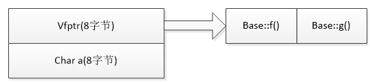
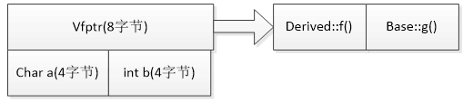
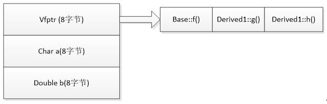
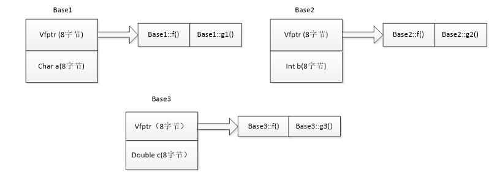
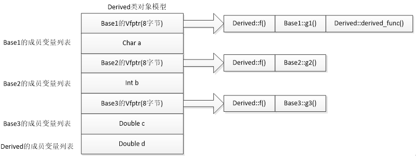

[toc]


## 1 类的大小与什么有关系？
与类大小**有关**的因素：
> &emsp;&emsp; 普通成员变量，虚函数，继承（单一继承，多重继承，重复继承，虚拟继承）
> 
与类大小**无关**的因素：
> 静态成员变量，静态成员函数及普通成员函数
> 


&emsp;
&emsp;
## 2 为什么空类的大小为1字节？为什么不能是0？或者为4、8？
&emsp;&emsp; 因为要确保两个不一样的对象拥有不同的地址：“To ensure that the addresses of two different objects will be different.”  所以就用那1byte来在内存中占用不同地址了。又因为这些空class没有赋值的意义，所以就没必要占用更多内存。


&emsp;
&emsp;
## 3 如何计算一个类占的空间(字节)？ 
一个Class对象需要占用多大的内存空间。最权威的结论是： 
> 非静态成员变量总合。(`staitc成员变量`和`static成员函数`都不占用类对象的空间) 
> 加上编译器为了CPU计算，作出的数据对齐处理。 
> 加上为了支持虚函数，产生的额外负担（虚函数占一个指针的大小，非虚函数不占空间）。
> 对于子类，它的sizeof是它父类成员（无论成员是public或private)，再加上它自己的成员，再考虑对齐后的sizeof，若是子类和父类都有虚函数，也只需要加入一个指针的大小（虚函数指针是指向子类虚函数的）
> 


&emsp;
&emsp;
## 4 哪些成员不占类空间？
&emsp;&emsp; `staitc成员`不占类对象的空间， **非虚函数** 不占类空间，**虚函数** 占8字节（一个指针的大小），包含虚函数的类，对象生成时，会在类对象当中插入一个指针，这个指针称做虚函数表指针，简称虚表指针(vPtr)。该指针指向一个虚函数表(简称虚表)，虚函数表中存储了虚函数的入口地址。基类当中有虚函数时，会产生该虚函数表；创建基类对象，对象中的vPtr会指向该表；调用虚函数时，是通过vPtr在此表当中寻找函数入口地址的。
```cpp
class Demo{
public:
    Demo() {}
    ~Demo(){}
    int func(int a) {return a;}
};

int main()  
{  
    Demo d;
    cout << "sizeof(d) : " << sizeof(d) << endl;
}
```
编译后运行：
```
sizeof(d) : 1
```
&emsp;&emsp; ② 
```cpp
class Demo{
public:
    Demo() {}
    ~Demo(){}
    virtual int func(int a) {return a;}
};

int main()  
{  
    Demo d;
    cout << "sizeof(d) : " << sizeof(d) << endl;
}

```
编译后运行：
```
sizeof(d) : 8
```


&emsp;
&emsp;
## 5 在X86-64系统中，如果一个类有2个虚函数，一个`char`成员，它占几个字节？
在含有虚函数的类中，只需要有一个指针 来指向 虚函数表：
```cpp
class Base
{
private:
    char a;
public:
    virtual void f() { }
    virtual void g(){ }
};

int main()
{
    Base b;
    cout << "sizeof(b) : " << sizeof(b) << endl;
}
```
编译后运行，
```
sizeof(b) : 16
```
**分析：**
&emsp;&emsp; 虽然它含有两个虚函数，但是我们只需要只需要有一个指针 来指向 虚函数表，因此为了支持虚函数，`Base`只需要有一个指针即可，而因为字节对齐，`char`得补7个字节，因此为16字节，`Base`的内存布局类似于下图：
<div align="center">  </div>
<center> <font color=black> <b> 图1 Base的内存布局 </b> </font> </center>


&emsp;
&emsp;
## 6 有虚函数，且涉及到继承时，如何计算类的大小？
### 6.1 含虚函数的单一继承
```cpp
class Base
{
private:
    char a;
public:
    virtual void f() { }
    virtual void g(){ }
};

class Derived:public Base
{
private:
    int b;
public:
    void f() { }
};

class Derived1:public Base
{
private:
    double b;
public:
    void g(){ }
    virtual void h() { }
};

int main()
{
    Base b;
    cout << "sizeof(b) : " << sizeof(b) << endl;
	Derived d;
	cout << "sizeof(d) : " << sizeof(d) << endl;
	Derived1 d1;
	cout << "sizeof(d1) : " << sizeof(d1) << endl;
}
```
编译后，运行结果为：
```
sizeof(b) : 16
sizeof(d) : 16
sizeof(d1) : 24
```
**解析：**
&emsp;&emsp; (1) 基类`Base`中含有一个char型成员变量，以及两个虚函数，此时`Base`类的内存布局如下：
<div align="center">  </div>
<center> <font color=black> <b> 图2 Base的内存布局 </b> </font> </center>
内存布局的最一开始是vfptr（virtual function ptr）即虚函数表指针（只要含虚函数，一定有虚函数表指针，而且该指针一定位于类内存模型最前端），接下来是Base类的成员变量，按照在类里的声明顺序排列，当然啦，还是要像上面一样注意内存对齐原则！

&emsp;&emsp; (2) 继承类D`erived`继承了基类，重写了`Base`中的虚函数`f()`，还添加了自己的成员变量，即`int`型的`b`，这时，`Derived`的类内存模型如下：
<div align="center">  </div>
<center> <font color=black> <b> 图3 Derived的内存布局 </b> </font> </center>
此种情况下，最一开始的还是虚函数表指针，只不过，在Derived类中被重写的虚函数f()在对应的虚函数表项的Base::f()已经被替换为Derived::f()，接下来是基类的成员变量char a，紧接着是继承类的成员变量int b，按照其基类变量声明顺序与继承类变量声明顺序进行排列，并注意内存对齐问题。

&emsp;&emsp; (3) 继承类`Derived1`继承了基类，重写了`Base`中的虚函数`g()`，还添加了自己的成员变量（即`double`型的`b`）与自己的虚函数（`virtual h()` ），这时，`Derived1`的类内存模型如下：
<div align="center">  </div>
<center> <font color=black> <b> 图4 Derived1的内存布局 </b> </font> </center>
此种情况下，Derived1类一开始仍然是虚函数表指针，只是在Derived1类中被重写的虚函数g()在对应的虚函数表项的Base::g()已经被替换为Derived1::g()，新添加的虚函数virtual h()位于虚函数表项的后面，紧跟着基类中最后声明的虚函数表项后，接下来仍然是基类的成员变量，紧接着是继承类的成员变量。

### 6.2 含虚函数的多重继承
```cpp
class Base1
{
private:
    char a;
public:
    virtual void f() { }
    virtual void g1() { }
};

class Base2
{
private:
    int b;
public:
    virtual void f() { }
    virtual void g2() { }
};

class Base3
{
private:
    double c;
public:
    virtual void f() { }
    virtual void g3() { }
};

class Derived:public Base1, public Base2, public Base3
{
private:
    double d;
public:
    void f() { }
    virtual void derived_func() { }
};


int main()
{
    Base1 b1;
    cout << "sizeof(b1) : " << sizeof(b1) << endl;
    Base2 b2;
    cout << "sizeof(b2) : " << sizeof(b2) << endl;
    Base3 b3;
    cout << "sizeof(b3) : " << sizeof(b3) << endl;
    Derived d;
    cout << "sizeof(d)  : " << sizeof(d) << endl;
}
```
编译后，运行结果为：
```
sizeof(b1) : 16
sizeof(b2) : 16
sizeof(b3) : 16
sizeof(d)  : 56
```
&emsp;&emsp; 首先继承类多重继承了三个基类，此外继承类重写了三个基类中都有的虚函数virtual f()，还添加了自己特有的虚函数derived_func()，那么，新的继承类内存布局究竟是什么样子的呢？请看下图！先来看3个基类的内存布局：
<div align="center">  </div>
<center> <font color=black> <b> 图5 3个Base类的内存布局 </b> </font> </center>
紧接着是继承类Derived的内存布局：
<div align="center">  </div>
<center> <font color=black> <b> 图6 Derived的内存布局 </b> </font> </center>

首先，Derived类自己的虚函数表指针与其声明继承顺序的第一个基类Base1的虚函数表指针合并，此外，若Derived类重写了基类中同名的虚函数，则在三个虚函数表的对应项都应该予以修改，Derived中新添加的虚函数位于第一个虚函数表项后面，Derived中新添加的成员变量位于类的最后面，按其声明顺序与内存对齐原则进行排列。

### 


&emsp;
&emsp;
## 6 在X86-64系统中，下面代码输出是？为什么？
```cpp
class Demo_1{
};

class Demo_2{
public:
    static int a;
private:
    //...
};
int Demo_2::a = 0;

int main()
{
    Demo_1 d_1;
    cout << sizeof(d_1) << endl;

    Demo_2 d_2;
    cout << sizeof(d_2) << endl;
}
```
输出结果为：
```
1
1
```
**解析：**
(1) Demo_1
&emsp;&emsp; 一个空类的大小为1字节。
(2) Demo_2
&emsp;&emsp; 因为 类`Demo_2`只含有一个静态成员，而静态成员不占类变量的空间，因此`Demo_2`对象的大小和空类一样，为1字节。

### 105.2 在X86-64系统中，下面代码输出是？
```cpp
class Demo_3{
    int a;
    int b;
    int c;
};

class Demo_4{
    int a;
    double b;
    int c;
};

class Demo_5{
    int a;
    char b;
    int c;
};


int main()
{
    Demo_3 d_3;
    cout << sizeof(d_3) << endl;

    Demo_4 d_4;
    cout << sizeof(d_4) << endl;

    Demo_5 d_5;
    cout << sizeof(d_5) << endl; 
}
```
输出结果为：
```
12
24
12
```
**解析：**
(1) Demo_3
&emsp;&emsp; `Demo_3`中，最长的元素是`int`，长度为4字节；X86-64系统的默认对齐为8字节，根据 系统对齐的规则(见数据对齐的笔记)，这里应该按4字节对齐，应该为4字节。因此总大小为 `4*3=12`字节。
(2) Demo_4
&emsp;&emsp; `Demo_4`中，最长的元素是`double`，长度为8字节；X86-64系统的默认对齐为8字节，根据 系统对齐的规则(见数据对齐的笔记)，这里应该按8字节对齐，应该为4字节。因此总大小为 `8*3=24`字节。
(3) Demo_5
&emsp;&emsp; `Demo_3`中，最长的元素是`int`，长度为4字节；X86-64系统的默认对齐为8字节，根据 系统对齐的规则(见数据对齐的笔记)，这里应该按4字节对齐，应该为4字节。因此总大小为 `4*3=12`字节。


&emsp;
&emsp;
## 6 在X86-64系统中，下面代码输出是？
```cpp
class Demo_6{
public:
    Demo() {}
    ~Demo(){}
    int func(int a) {return a;}
};

int main()  
{  
    Demo_6 d;
    cout << "sizeof(d) : " << sizeof(d) << endl;
}
```
编译后运行：
```
sizeof(d) : 1
```
**解析：**
非虚函数不占类的空间，因此`Demo_6`相当于一个空类。

### 105.4 在X86-64系统中，下面代码输出是？
```cpp
class Demo{
public:
    Demo() {}
    ~Demo(){}
    virtual int func(int a) {return a;} // 虚函数
};

int main()  
{  
    Demo d;
    cout << "sizeof(d) : " << sizeof(d) << endl;
}
```
编译后运行：
```
sizeof(d) : 8
```
**解析：**
虚函数需要占一个指针的空间。


&emsp;
&emsp;
## 7 在X86-64系统中，下面代码输出是？
```cpp
class Base{
public:
    int a;
private:
    char b;
};

class Derived_1 : public Base{
public:
    short c;
    int d;
};

class Derived_2 : public Base{
public:
    int d;
    short c;
};


int main()
{
    Base b;
    cout << "sizeof(b) : " << sizeof(b) << endl;
	Derived_1 d1;
	cout << "sizeof(d1) : " << sizeof(d1) << endl;
    Derived_2 d2;
    cout << "sizeof(d2) : " << sizeof(d2) << endl;
}
```
输出结果为：
```
sizeof(b) : 8
sizeof(d1) : 12
sizeof(d2) : 16
```
**解析：**
(1) `sizeof(b)` 
&emsp;&emsp;  `Base`类以4字节对齐，因此编译器会给它在后面补3个字节，最终大小为8字节
(2) `sizeof(d1)` 
&emsp;&emsp;  `Derived_1`是`Base`的派生类，它含有的元素和顺序如下：
```cpp
// 来自父类的
int a;
char b; // Derived_1不可直接访问，因为在父类中它的private的
// 自己的：
short c;
int d;
```
其中`char b` 和 `short c`连在一起，它们加起来为3字节，按一个对齐处理(4字节)，因此为12字节
(3) `sizeof(d2)` 
&emsp;&emsp; `Derived_2`和`Derived_1`包含的成员是一样，但是顺序不一样：
```cpp
// 来自父类的
int a;
char b; // Derived_1不可直接访问，因为在父类中它的private的
// 自己的：
int d;
short c;
```
`char b` 和 `short c`之间隔了一个`int a`，所以`char b` 和 `short c`各占4字节，因此就是 4*4=16 字节。这也说明即使在写继承类的时候也要合理安排成员顺序，这样可以节省空间。


&emsp;
&emsp;
## 8 在X86-64系统中，下面代码输出是？


## 参考文献
1. [C++类大小详尽讲解](https://blog.csdn.net/longjialin93528/article/details/80160467)