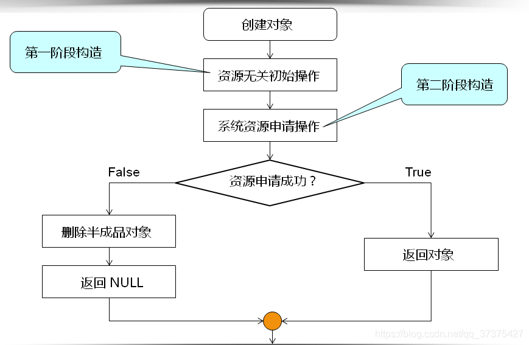

## 1 什么是二段式构造？
&emsp; 所谓二段式构造，就是构造一个对象时，分两次构造
> &emsp;&emsp; 第一阶段为 与资源无关的初始化操作（例如赋值等不需要访问到系统资源的相关操作。）
> &emsp;&emsp; 第二阶段为 与系统资源有关的操作（如申请内存，访问文件）。
> 
总的来说，二段氏构造就是 人为的将初始化过程分为两部分，一部分处理不容易出错的操作，一部分处理容易出错的操作。


&emsp;
&emsp;
## 2 为什么需要 二段式构造？一次性在构造函数中完成不是很好吗？
&emsp;二段式构造主要有下面两个作用：
> &emsp;&emsp; (1) 为了防止 半成品对象的产生。
> &emsp;&emsp; (2) 在多线程程序中，构造函数中不能向外部暴露this指针（最后一行也不行），否则有可能会让外部调用到没有构造完成的对象。所以，如果一定要在对象初始化的时候暴露this指针（如注册回调函数等），就要使用二段构造。(**这个在muduo库中就有应用**)
> 


&emsp;
&emsp;
## 3 什么是 半成品对象 ？
&emsp;&emsp; 构造函数能决定的只是对象的初始状态，而不是对象的诞生，所以如果构造函数没有按照预期执行完毕，但是对象依然会被构造。 比如在对象的构造过程中由于某些原因（比如对写文件，申请内存等）导致构造函数没有按照预期执行完毕，但是对象依然被构造了，这样的对象叫作 <span style="color:red; font-size:18px; font-weight:bold;">半成品对象</span>。
&emsp;&emsp; 半成品对象是合法的 C++ 对象，也是 Bug 的重要来源，因为难以 debug。来看下面的代码：
```cpp
class demo{
public:
    demo(int _i = 0,int  _j = 1) {
        i = _i;
        return;
        j = _j; // j 没有初始化
    }
    int i;
    int j;
};
```
在上面的代码中，`demo`类 的构造函数在`j`被初始化之前就`return`了，通过`demo::demo()`构造的对象就是 半成品对象。


&emsp;
&emsp;
## 4 如何使用二段式构造？
&emsp;&emsp; 前面已经总结过，二段式主要用在两种情况下：
> (1) 防止半成品对象产生；
> (2) 在多线程场景下，防止泄露`this`指针；
### 4.1 防止半成品对象的产生
为防止半成品对象的产生，二段式构造的大致流程为：
<div align="center">  </div>
<center> <font color=black> <b> 图1 二阶构造大体流程 </b> </font> </center>

### 4.2 防止泄露`this`指针
我们再来看一段代码：
```cpp
#include <stdio.h>

class TwoPhaseCons 
{
private:
    TwoPhaseCons() // 第一阶段构造函数
    {
        // 进行第一阶段操作，如赋值   
    }
    bool construct() // 第二阶段构造函数
    { 
        // 进行第二阶段操作，比如获取系统资源，
        //   如果获取资源成功则返回返回true，失败则返回false
        if(/*获取资源成功*/)
            return true; 
        else
            return false;
    }
public:
    static TwoPhaseCons* NewInstance(); // 对象创建函数
};

TwoPhaseCons* TwoPhaseCons::NewInstance() 
{
    TwoPhaseCons* ret = new TwoPhaseCons();

    // 若第二阶段构造失败，返回 NULL    
    if( !(ret && ret->construct()) ) 
    {
        delete ret;
        ret = NULL;
    }
        
    return ret;
}


int main()
{
    TwoPhaseCons* obj = TwoPhaseCons::NewInstance();
    
    printf("obj = %p\n", obj);

    delete obj;
    
    return 0;
}
```
我们来分析一下以上代码：
二阶构造示例：
```cpp
class TwoPhaseCons 
{
private:
    TwoPhaseCons() // 第一阶段构造函数，注意，它是私有的！
    {   
    }
    bool construct() // 第二阶段构造函数，它是私有的！
    { 
        // 进行第二阶段操作，比如获取系统资源，
        //   如果获取资源成功则返回返回true，失败则返回false
        if(/*获取资源成功*/)
            return true; 
        else
            return false;
    }
public:
    static TwoPhaseCons* NewInstance(); // 对象创建函数
};
```
第一阶段构造函数与第二阶段构造函数放到`private`里面了，外部无法调用。但是在public中，定义的是`static` 型的`NewInstance()`函数，它返回一个`TwoPhaseCons`类型的对象，那么通过它就可以调用`private`里面的构造函数：
```cpp
TwoPhaseCons* TwoPhaseCons::NewInstance() 
{
    // 进行第一阶段的构造
    TwoPhaseCons* ret = new TwoPhaseCons();

    // 通过返回值ret调用第二阶段的构造函数construct()来进行第二阶段的构造   
    if( !(ret && ret->construct()) ) 
    {
        // 若构造失败则销毁，然后返回一个空指针
        delete ret;
        ret = NULL;
    }
        
    return ret;
}
```

### 4.3 多线程场景下，防止泄露`this`指针
对象构造要做到线程安全，唯一的要求是在构造期间不要泄露this指针，即：
> 不要再构造函数中注册任何回调
> 也不要在构造函数中把this传给跨线程的对象
> 即便在构造函数的最后一行也不行
> 
之所以这样规定，是因为在构造函数执行期间还没有完成初始化，如果this被泄露给了其他对象(其自身创建的子对象除外)，那么别的线程有可能访问这个半成品对象，这会造成难以预料的后果：
```cpp
// don't do this
class Foo : public Observer{
public:
	Foo(Observable * s){
		s->register_(this); // 错误，泄露了this指针，非线程安全
	}
	virtual void update();
};
```
对象构造的正确方法：
```cpp
// do this
class Foo : public Observer{
public:
	Foo(); // 一阶段构造
	virtual void update();

    // 二阶段构造
	// 另外定义一个函数，在构造之后执行回调函数的注册工作
	void observer(Observable * s){
		s->register_(this);
	}	
};

int main(){
    Foo *pFoo = new Foo;
    Observable *s = getSubject();
    pFoo->observer(s);  // 二段式构造，或者直接写s->register_(pFoo );
}
```
在上面的`Foo`类中，将构造函数拆成了两个阶段：
* (1) `Foo::Foo()` ：正常的构造
* (2) `Foo::observer()` : 负责注册


&emsp;
&emsp;
## 参考文献
1. [C++ 二阶构造模式](https://www.cnblogs.com/hjxzjp/p/11674960.html)
2. [C++ 中的二阶构造模式详解](https://blog.csdn.net/kuweicai/article/details/109107356)
3. [【C++深度剖析教程4】C++的二阶构造模式](https://blog.csdn.net/qq_37375427/article/details/78797953)
