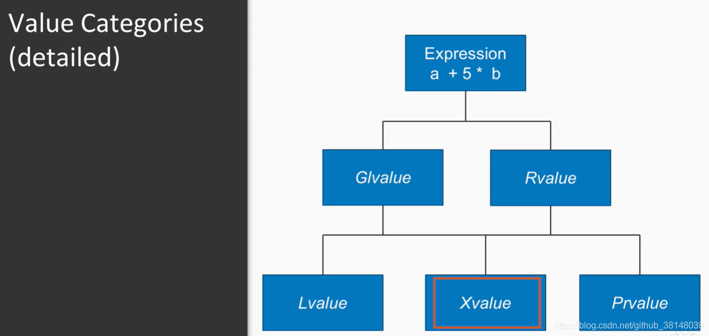
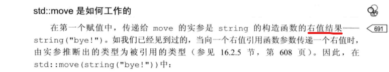

## 1. 左值 和 右值
### 1.1 什么是 左值？什么是 右值 ？
&emsp;&emsp; **左值**是对应(refer to)内存中有确定存储地址的对象的表达式的值；而**右值**是所有不是左值的表达式的值。因而，右值可以是字面量、临时对象等表达式。

### 1.2 左值 和 右值 如何细分？
&emsp;&emsp; 一个 lvalue 是通常可以放在等号左边的表达式；
&emsp;&emsp; 一个 rvalue 是通常只能放在等号右边的表达式。
&emsp;&emsp; 根据C++11标准，每个表达式可分为：lvalue、xvalue（expiring value）或 prvalue（pure rvalue），另外lvalue和xvalue合称glvalue(“generalized” lvalue)，xvalue和prvalue合称rvalue。也就是说，关于左值和右值，一共有五个新名词：
 | 概念    | Column B             |
 | ------- | -------------------- |
 | lvalue  | 左值                 |
 | xvalue  | 将亡值               |
 | glvalue | “generalized” lvalue |
 | rvalue  | 右值                 |
 | prvalue | 纯右值               |
其中，rvalue和glvalue是一个大类别：lvalue和xvalue合称glvalue(“generalized” lvalue)，xvalue和prvalue合称rvalue:
> glvalue（泛左值） = lvalue （传统意义上的左值）+ xvalue（消亡值，通过右值引用产生）
> rvalue （传统意义上的右值） = prvalue（纯右值） + xvalue
>
<div align="center">  </div>
<center> <font color=black> <b> 图1 下标访问const类型的map报错 </b> </font> </center>

下面对于几个细分的类别，我们来介绍一下：
#### 1.2.1 左值(lvalue)
左值 lvalue 是 **① 有标识符**、**② 可以取地址**的表达式，下面的的都是左值表达式：
  * the name of a variable, a function, a template parameter object (since C++20), or a data member, regardless of type, such as std::cin or std::endl. Even if the variable's type is rvalue reference, the expression consisting of its name is an lvalue expression;
    (在作用域(scope)内的、无论什么类型的变量名(注意，即使是一个右值引用的变量，这个变量本身也是一个左值！)、函数名、模板的参数对象、数据成员。比如，`std::cin`或者`std::endl`。即使这个变量的类型是右值引用，由它的名字组成的表达式也是个左值表达式)
  * a function call or an overloaded operator expression, whose return type is lvalue reference, such as std::getline(std::cin, str), std::cout << 1, str1 = str2, or ++it;
    (返回一个左值引用的函数或重载操作符，如：`std::getline(std::cin, str), std::cout << 1, str1 = str2, or ++it`)
  * `a = b, a += b, a %= b`, and all other built-in assignment and compound assignment expressions;
    (`a = b, a += b, a %= b`，以及其他所有内置的**赋值**或者**复合赋值**[compound assignment]表达式)
  * `++a` and `--a`, the built-in pre-increment and pre-decrement expressions;
    (前置自增运算符表达式)
  * `*p`, the built-in indirection expression;
    (`*p`, 内置的指针取值表达式)
  * `a[n]` and `p[n]`, the built-in subscript expressions, where one operand in `a[n]` is an array lvalue (since C++11);
    (内置下标索引表达式：如：`a[n]` 和 `p[n]`，除非`a`是一个右值数组)
  * `a.m,` the member of object expression, except where m is a member enumerator or a non-static member function, or where a is an rvalue and m is a non-static data member of object type;
    (`a.m`, 对象的取成员变量表达式，除非 ‘m’ 是枚举成员或者非静态成员函数，或者 ‘a’ 是右值，以及 ‘m’ 是非引用类型的非静态数据成员。)
  * `p->m`, the built-in member of pointer expression, except where m is a member enumerator or a  non-static member function;
    (`p->m`, “对象指针调取内置类型的成员变量” 的表达式，除非 ‘m’ 是枚举成员或者非静态成员函数。)
  * `a.*mp`, the pointer to member of object expression, where a is an lvalue and mp is a pointer to data   * member;
    (`p.*mp`, 对象的成员指针表达式，其中,‘p’必须是左值，‘mp’ 是指向数据成员的指针)
  * `p->*mp`, the built-in pointer to member of pointer expression, where mp is a pointer to data member;
    (`p->*mp`，对象指针的成员指针表达式,要求：‘mp’指向的是‘p’的数据成员。)
  * a, b, the built-in comma expression, where b is an lvalue;
    (`a,b`, 内置的逗号表达式，要求`b`必须为左值。)
  * `a ? b : c,` the ternary conditional expression for certain b and c (e.g., when both are lvalues of   * the same type, but see definition for detail);
    (`a ? b : c`, 对于某些a,b,c的三元条件表达式)
  * a string literal, such as "Hello, world!";
    (字符串的字面值类型。如： “Hello World”)
  * a cast expression to lvalue reference type, such as `static_cast<int&>(x)`;
    (强转为左值引用类型的表达式，如：`static_cast<int&>(x)`)
  * a function call or an overloaded operator expression, whose return type is rvalue reference to function;
    (把右值引用作为返回的函数或者重载操作符)
  * a cast expression to rvalue reference to function type, such as `static_cast<void (&&)(int)>(x)`.
    (强转为函数的右值引用类型的表达式，如：`static_cast<void (&&) (int)>(x)`)
**左值表达式的属性[properties]**:
  * 1) 拥有glvalue[generalized left value, 广义左值]表达式的所有属性。
  * 2) 可以得到一个左值表达式的地址，例如：`&++i`和`&std::endl`是合法的表达式。(假设i是内置类型或者重载的前置自 增操作符的返回值是左值引用)
  * 3) 可修改的的左值可以被用作内置的赋值或者复合赋值操作符的左操作数.
  * 4) 左值可以被用来初始化左值引用。这个操作可以将一个确定的对象关联到一个新的名字。
    如:
下面我们写一段代码来验证一下：
```cpp
int main()
{
    int x = 0;
    cout << "(x).addr           = " << &x << endl;
    cout << "(x = 1).addr       = " << &(x = 1) << endl;
    cout << "(++x).addr         = " << &++x << endl;
    cout << "(cout << ' ').addr = " << &(cout << ' ') << endl;
 
    return 0;
}
```
编译后运行，得到结果：
```
(x).addr           = 0x7ffe0397dbbc
(x = 1).addr       = 0x7ffe0397dbbc
(++x).addr         = 0x7ffe0397dbbc
(cout << ' ').addr = 0x601080
```
  * 字符串字面量是左值，而且是不可被更改的左值。字符串字面量并不具名，但是可以用&取地址所以也是左值。
    如:
    ```cpp
     "hello",在c++中是 char const [6] 类型，而在c中是 char [6] 类型
      cout << "(\"hello\").addr=" << &("hello") << endl;
      如果一个表达式的类型是一个lvalue reference (例如, T& 或 const T&, 等.)，那这个表达式就是一个lvalue。
      ```
#### 1.2.2 纯右值(prvalue)
纯右值 prvalue 是没有标识符、不可以取地址的表达式，一般也称之为“临时对 象”。最常见的情况有：
  * a literal (except for string literal), such as 42, true or nullptr;
    (除字符串类型外的字面值，如：`42， true, nullptr`)
  * a function call or an overloaded operator expression, whose return type is non-reference, such as `str.substr(1, 2), str1 + str2, or it++`;
    (返回非引用类型的 函数 或 重载运算符，如返回值为：`str.substr(1, 2), str1 + str2, or it++`)
  * a++ and a--, the built-in post-increment and post-decrement expressions;
    (`a++` 和 `a--`，内置的后置自增[post-increment]和后置递减[post-decrement]操作符表达式)
  * a + b, a % b, a & b, a << b, and all other built-in arithmetic expressions;
    (`a+b, a%b, a&b, a<<b`,以及所有其他内置的算术[arithmetic]表达式)
  * a && b, a || b, !a, the built-in logical expressions;
    (`a && b, a || b, !a`，内置的逻辑表达式。)
  * a < b, a == b, a >= b, and all other built-in comparison expressions;
    (`a<b, a==b, a>=b`,以及所有其他内置的比较表达式)
  * &a, the built-in address-of expression;
    (`&a`, 内置的取址表达式)
  * a.m, the member of object expression, where m is a member enumerator or a non-static member function[2], or where a is an rvalue and m is a non-static data member of non-reference type (until C++11);
    (`a.m`,  对象的取成员变量表达式。其中,‘m’是枚举成员或非静态成员函数，【或者‘a’ 是右值，以及 ‘m’ 是非引用类型的非静态数据成员。(until C++11)】)
  * p->m, the built-in member of pointer expression, where m is a member enumerator or a non-static member function[2];
    (`p->m`, 内置的指针取值表达式，其中,`m`是枚举成员或者非静态成员函数)
  * a.*mp, the pointer to member of object expression, where mp is a pointer to member function[2], or where a is an rvalue and mp is a pointer to data member (until C++11);
    (`a.*mp`, 对象的成员指针表达式。 其中,‘mp’是指向‘a’的成员函数的指针,【或者，‘a’是一个右值，‘mp’是指向数据成员的指针。(until C++11)】)
  * p->*mp, the built-in pointer to member of pointer expression, where mp is a pointer to member function;
    (a->*mp, 对象指针的成员指针表达式,其中, ‘mp’指向的是‘a’的成员函数。)
  * a, b, the built-in comma expression, where b is an rvalue;
    (a,b, 内置的逗号表达式，其中,b必须为右值)
  * a ? b : c, the ternary conditional expression for certain b and c (see definition for detail);
    (`a ? b : c`, 对于某些a,b,c的三元条件表达式)
  * a cast expression to non-reference type, such as static_cast<double>(x), std::string{}, or (int)42;
    (强转为非引用类型的表达式，比如，`static_cast<double>(x)`, `std::string{}`, `(int)42` )
  * the this pointer;
    (this指针)
  * an enumerator;
    (枚举)
  * non-type template parameter unless its type is a class or (since C++20) an lvalue reference type;
    ()
  * a lambda expression, such as [](int x){ return x * x; };(since C++11)
    (lambda表达式，如：`[](int x){ return x * x; }`)
  * a requires-expression, such as `requires (T i) { typename T::type; }`;(since C++20)
    ()
  * a specialization of a concept, such as `std::equality_comparable<int>`.(since C++20)
    ()
**纯右值表达式的属性[properties]:**
 * 1) Same as rvalue (below).
    (拥有右值[rvalue]表达式的所有属性。)
 * 2) A prvalue cannot be polymorphic: the dynamic type of the object it denotes is always the type of the expression. 
    (纯右值表达式不能是多态的[polymorphic]:纯右值表达式标识对象的动态型别总是表达式的型别。
 * 3) A non-class non-array prvalue cannot be cv-qualified. (Note: a function call or cast expression may result in a prvalue of non-class cv-qualified type, but the cv-qualifier is immediately stripped out.)
    (非类[non-class]的纯右值 不能被 const或volatile关键字标识[cv-qualified]。)
 * 4) A prvalue cannot have incomplete type (except for type void, see below, or when used in decltype specifier)
    (纯右值不能有不完整的型别[type]。除非[except]它是void类型或者用于decltype说明符[specifier]时。)
 * 5) A prvalue cannot have abstract class type or an array thereof.
    ()

#### 1.2.3 将亡值(xvalue)
> an xvalue (an “eXpiring” value) is a glvalue that denotes an object or bit-field whose resources can be reused;
>  
翻译过来就是：
> xvalue 通常是一个快消亡的对象的引用（因此该对象的资源可能会被移动）。一个右值是某些b
> 
The following expressions are xvalue expressions:
  * a function call or an overloaded operator expression, whose return type is rvalue reference to object, such as `std::move(x)`;
    (把**右值引用**类型作为返回的 函数 或 重载操作符。例如, `std::move(x);`)
  * `a[n]`, the built-in subscript expression, where one operand is an array rvalue;
    (`a[n]`, 内置的下标[subscript]表达式，其中,‘a’是一个右值数组)
  * a.m, the member of object expression, where a is an rvalue and m is a non-static data member of non-reference type;
    (`a.m`,  对象的取成员变量表达式。其中,‘a’是一个右值，‘m’ 是非引用类型的非静态数据成员。)
  * `a.*mp`, the pointer to member of object expression, where a is an rvalue and mp is a pointer to data member;
    (`a.*mp`, 对象的成员指针表达式。其中,‘a’是右值，‘mp’是指向数据成员的指针)
  * a ? b : c, the ternary conditional expression for certain b and c (see definition for detail);
    (`a ? b : c`, 对于某些a,b,c的三元条件表达式)
  * a cast expression to rvalue reference to object type, such as `static_cast<char&&>(x)`;
    (强转为“对象的右值引用”表达式，比如，`static_cast<char&&>(x)`)
**x值表达式的属性[properties]:**
  * Same as rvalue (below).
    (拥有右值[rvalue]表达式的所有属性)
  * Same as glvalue (below).
    (拥有左值[glvalue]表达式的所有属性。)
&emsp; In particular, like all rvalues, xvalues bind to rvalue references, and like all glvalues, xvalues may be polymorphic, and non-class xvalues may be cv-qualified.
&emsp; [注] 类似于纯右值，x值绑定右值引用，但不同的是，x值可能是多态的[polymorphic]，并且非类[non-class]的x值可能被const或volatile关键字标识[cv-qualified]。

**下面是几个关于xvalue的例子：**
  * 隐式或显式调用函数的结果，该函数的返回类型是对所返回对象类型的右值引用
      ```cpp
        int&& f(){
            return 3;
        }

        int main()
        {
			// The expression f() belongs to the xvalue category, 
			// because f() return type is an rvalue reference to object type.
            f(); 
            return 0;
        }
      ```
  * 对对象类型右值引用的转换
      ```cpp
        int main()
        {
            // The expression static_cast<int&&>(7) belongs to xvalue category,
            //  because it is a cast to an rvalue reference to object type.
            static_cast<int&&>(7); 
            std::move(7); // std::move(7) is equivalent to static_cast<int&&>(7).
            return 0;
        }
      ```
  * 类成员访问表达式，指定非引用类型的非静态数据成员，其中对象表达式是xvalue
      ```cpp
        struct As{
            int i;
        };

        As&& f(){
            return As();
        }

        int main()
        {
			// The expression f().i belongs to the xvalue category, because As::i 
            // is a non-static data member of non-reference type, 
            // and the subexpression f() belongs to the xvlaue category.
            f().i; 
            return 0;
        }
      ```


### 1.2 是不是说 能被赋值的就是 左值？
&emsp;&emsp; 不是，**能否被赋值不是区分C++左值与右值的依据**，比如说，`const左值`是不可赋值的；而作为临时对象的右值可能允许被赋值。

### 1.3 左值 和 右值 的根本区别在于？
**左值与右值的根本区别在于** 是否允许取地址`&`运算符获得对应的内存地址。

### 1.4 左值和右值在使用上有何区别？
&emsp;&emsp; 左值可以放到等号左边，右值只能放到右边。但如有需要，左值可以转换为右值，反之则不可。

### 1.5 如何区分一个 函数返回的是 左值(lvalue)、纯右值(prvalue) 还是 将亡值(xvalue)呢？
对于一个函数，我们可以 它们的返回值 来确定：
| 值的类型        | 函数返回值类型       |
| --------------- | -------------------- |
| 左值(lvalue)    | 返回一个左值引用类型，如  `int& fun1();`  |
| 纯右值(prvalue) | 返回一个非引用类型 ， 如  `int  fun2();`  |
| 将亡值(xvalue)  | 返回一个右值引用类型，如  `int&& fun3();`  |
我们来看看下面几个函数：
```cpp
// 返回左值的函数
x = 0;
int& ret_lvalue(){
	ret x;
}

// 返回纯右值的函数
int ret_prvalue(){
	int a = 1 + 1;
	return a;
}

// 返回将亡值的函数
int&& ret_xvalue(){
	int y =1;
	return std::move(y);
}
```

### 1.6 如何区分左值和右值？
&emsp;&emsp; 想要对左值和右值进行精确定义是一件很难的事(c++11标准基本上是通过举例来说明一个表达式是否是一个lvalue还是rvalue的)，但实践当中，下面的定义就足够了：
  * (1) 如果你可以对一个表达式取地址，那这个表达式就是个lvalue。
  * (2) 如果一个表达式的类型是一个lvalue reference (例如, T& 或 const T&, 等.)，那这个表达式就是一个lvalue。
  * (3) 其它情况，这个表达式就是一个rvalue。从概念上来讲(通常实际上也是这样)，rvalue对应于临时对象，例如函数返回值或者通过隐式类型转换得到的对象，大部分字面值(e.g., 10 and 5.3)也是rvalues。

### 1.7 为什么要分左值 和 右值？


&emsp;
&emsp;
## 2 左值引用(lvalue References) 和 右值引用(Rvalue References)
### 2.1 左值引用是什么？
&emsp;&emsp; 左值引用 其实就是我们之前用的引用：
```cpp
int x = 20;
int& rx = x;   // 定义引用时必须初始化
```
&emsp;&emsp; **左值引用在汇编层面其实和普通的指针是一样的；定义引用变量必须初始化，因为引用其实就是一个别名，需要告诉编译器定义的是谁的引用**。
```cpp
int &var = 10;
```
上述代码是无法编译通过的，因为10无法进行取地址操作，无法对一个立即数取地址，因为立即数并没有在内存中存储，而是存储在寄存器中，可以通过下述方法解决：
```cpp
const int &var = 10;
```
使用常引用来引用常量数字10，因为此刻内存上产生了临时变量保存了10，这个临时变量是可以进行取地址操作的，因此var引用的其实是这个临时变量，相当于下面的操作：
```cpp
const int temp = 10; 
const int &var = temp;
```
根据上述分析，得出如下结论：
   * 左值引用要求右边的值必须能够取地址，如果无法取地址，可以用常引用；
   * 但使用常引用后，我们只能通过引用来读取数据，无法去修改数据，因为其被const修饰成常量引用了。

### 2.2 什么是右值引用？
&emsp;&emsp; 所谓 右值引用 就是 必须绑定到右值的引用。 我们通过`&&` 而不是`&`来获取 右值引。
&emsp;&emsp; 右值引用 有一个很重要的性质：只能绑定到 一个将要销毁的对象，因此我们可以自由地将一个右值引用的资源“移动”到另一个对象。

### 2.3  右值引用 的作用是？（为什么需要右值引用？）
&emsp;&emsp; 之所以则C++11中引入了**右值引用**，是为了支持 移动操作（TODO: 增加一个跳转）。

### 2.4 怎么使用（定义） 右值引用？
右值引用 有着和左右引用完全相反的特性：我们可以将一个右值引用绑定到 要求转换的表达式、字面常量 或 返回右值的表达式 上，但不能将右值引用直接绑定到一个左值上：
```cpp
int i = 42;
int &r = i;		//正确，r是i的左值引用
int &&rr = i;	//错误，不能将一个右值引用绑定到一个左值上
int &r2 = i * 42;	//错误，i*42是一个右值
const int &r3 = i * 42;	//正确，可以将一个const的引用绑定到一个右值上
int &&rr2 = i * 42;	 //正确，将rr2绑定到右值上 
```

### 2.5 右值引用 的好处在哪？
&emsp;&emsp; 右值引用就是为了实现移动语义与完美转发所需要而设计出来的新的数据类型。
&emsp;&emsp; 右值引用应该是C++11引入的一个非常重要的技术，因为它是移动语义（Move semantics）与完美转发（Perfect forwarding）的基石：
下面我们用一个例子来说明右值引用的优势吧：
```cpp
// 栈的定义
class Stack{
public:
    // 构造函数
    Stack(int size = 1000) :msize(size), mtop(0){
        cout << "Stack(int)" << endl;
        mpstack = new int[size];
    }
	
    // 析构
    ~Stack(){
        cout << "~Stack()" << endl;
        delete[]mpstack;
        mpstack = nullptr;
    }
	
    // 拷贝构造
    Stack(const Stack &src):msize(src.msize), mtop(src.mtop)
    {
        cout << "Stack(const Stack&)" << endl;
        mpstack = new int[src.msize];
        for (int i = 0; i < mtop; ++i) {
            mpstack[i] = src.mpstack[i];
        }
    }
	
    // 重载赋值运算符
    Stack& operator=(const Stack &src){
        cout << "operator=" << endl;
        if (this == &src)
                return *this;

        delete[]mpstack;

        msize = src.msize;
        mtop = src.mtop;
        mpstack = new int[src.msize];
        for (int i = 0; i < mtop; ++i) {
            mpstack[i] = src.mpstack[i];
        }
        return *this;
    }

    int getSize() {
        return msize;
    }
private:
    int *mpstack; 	// 用来存储数组的
    int mtop;		// 指向栈顶
    int msize;
};

Stack GetStack(Stack &stack)
{
    Stack tmp(stack.getSize());
    return tmp;
}

int main()
{
    Stack s;
    s = GetStack(s);
    return 0;
}
```
编译运行，输出结果如下：
```
Stack(int)
operator=
~Stack()
~Stack()
```
**上面版本的代码有什么问题呢？**
&emsp;&emsp; 为了解决浅拷贝问题，为类提供了自定义的拷贝构造函数和赋值运算符重载函数，并且这两个函数内部实现都是非常的耗费时间和资源(首先开辟较大的空间，然后将数据逐个复制)，我们通过上述运行结果发现了两处使用了拷贝构造和赋值重载，分别是tmp拷贝构造main函数栈帧上的临时对象、临时对象赋值给s，其中tmp和临时对象都在各自的操作结束后便销毁了，使得程序效率非常低下。
**如何提高效率呢？**
&emsp;&emsp; 那么我们为了提高效率，是否可以把tmp持有的内存资源直接给临时对象？是否可以把临时对象的资源直接给s？
&emsp;&emsp; 在C++11中，我们可以解决上述问题，方式是提供带右值引用参数的拷贝构造函数和赋值运算符重载函数.
```cpp
// 带右值引用参数的拷贝构造函数
Stack(Stack &&src):msize(src.msize), mtop(src.mtop){
    cout << "Stack(Stack&&)" << endl;

    /*此处没有重新开辟内存拷贝数据，把src的资源直接给当前对象，再把src置空*/
    mpstack = src.mpstack;  
    src.mpstack = nullptr;
}

// 带右值引用参数的赋值运算符重载函数
Stack& operator=(Stack &&src){
    cout << "operator=(Stack&&)" << endl;

    if(this == &src) // 防止自赋值
        return *this;
	    
    delete[]mpstack; //释放 等号左侧对象 的动态内存

    msize = src.msize;
    mtop = src.mtop;

    /*此处没有重新开辟内存拷贝数据，把src的资源直接给当前对象，再把src置空*/
    mpstack = src.mpstack;
    src.mpstack = nullptr;

    return *this;
}
```
运行结果如下：
```
Stack(int)             // 构造s
Stack(int)             // 构造tmp
Stack(Stack&&)         // 调用带右值引用的拷贝构造函数，直接将tmp的资源给临时对象
~Stack()               // tmp析构
operator=(Stack&&)     // 调用带右值引用的赋值运算符重载函数，直接将临时对象资源给s
~Stack()               // 临时对象析构
~Stack()               // s析构
```
程序自动调用了带右值引用的拷贝构造函数和赋值运算符重载函数，使得程序的效率得到了很大的提升，因为并没有重新开辟内存拷贝数据。
```cpp
mpstack = src.mpstack;  
```
&emsp;&emsp; 可以直接赋值的原因是临时对象即将销毁，不会出现浅拷贝的问题，我们直接把临时对象持有的资源赋给新对象就可以了。
&emsp;&emsp; 所以，临时量都会自动匹配右值引用版本的成员方法，旨在提高内存资源使用效率。
&emsp;&emsp; 带右值引用参数的拷贝构造和赋值重载函数，又叫移动构造函数和移动赋值函数，这里的移动指的是把临时量的资源移动给了当前对象，临时对象就不持有资源，为nullptr了，实际上没有进行任何的数据移动，没发生任何的内存开辟和数据拷贝。

### 2.6 左值 和 右值在持久性上有何差异？
左值有持久的状态，而右值要么是字面值常量，要么是在表达式求值过程中创建的临时对象。
由于右值引用只能绑定到临时对象，可以得知：
>所引用的对象将要被销毁
> 该对象没有其它用户
> 
这两个意味着 使用右值引用的代码 可以自由地接管所引用的对象资源。

### 2.7 能不能将 右值引用 绑定到一个变量上？
&emsp;&emsp; 不能，我们不能将一个 右值引用 绑定到一个变量上，即使这个变量是右值引用类型也不行：
```cpp
int main()
{
    int &&rr1 = 42;  //正确，字面常量是右值
    int &&rr2 = rr1;    //错误，表达式rr1是左值 
    return 0;
}
```
编译后运行：
```
test.cpp: In function ‘int main()’:
test.cpp:12:17: error: cannot bind ‘int’ lvalue to ‘int&&’
     int &&rr2 = rr1;    
                 ^
```

### 2.8 有没有什么办法可以将 右值引用 绑定到一个变量上？
&emsp;&emsp; 虽然不能将一个右值引用 直接绑定到一个左值上，但我们可以显式的将一个左值转换为 对应的右值引用类型：使用 标准库函数`move()`可以获得绑定到左值上的右值引用，此函数定义在 头文件`utility`中：
```cpp
int &&rr1 = 42; 
int &&rr3 = std::move(rr1); // 正确
```

### 2.9 传 右值引用 给一个函数时，为什么不把它声明为`const`？
&emsp;&emsp; 因为在定义一个 接收右值引用参数的函数时，我们希望可以从实参“窃取”数据，这意味着我们需要改变实参，因此不能声明为`const`

### 2.10 `std::move()`的返回值是一个什么类型？
&emsp;&emsp; 是一个xvalue，即一个将亡值。

### 2.11 如何判断一个变量的类型是左值引用还是右值引用？
使用`decltype`、`std::is_lvalue_reference<T>::value` 和 ``std::is_rvalue_reference<T>::value`:
```cpp
int main()
{
    int var = 10;
    int& var1 = var;
    int&& var2 = std::move(var1);
    cout << "var1 is_lvalue_reference: " << std::is_lvalue_reference<decltype(var1)>::value << endl;
    cout << "var2 is_rvalue_reference: " << std::is_rvalue_reference<decltype(var2)>::value << endl;
}
```
运行结果：
```
ar1 is_lvalue_reference: 1
var2 is_rvalue_reference: 1
```


&emsp;
&emsp;
## 3. 延长变量的生命周期
### 3.1 一个变量的生命周期应该是怎样的？
&emsp;&emsp; 一个变量的生命周期在超出作用域时结束。如果一个变量代表一个对象，当然这个对象的生命周期也在那时结束。临时对象生命周期C++ 的规则是：一个临时对象 会在包含这个临时对象的完整表达式估值完成后、按生成顺序的逆序被销毁，除非有生命周期延长发生

### 3.2 什么情况下会发生变量的生命周期延长的情况？
&emsp;&emsp; **为了方便对临时对象的使用，C++ 对临时对象有特殊的生命周期延长规则。这条规则是：** 如果一个 prvalue 被绑定到一个引用上，它的生命周期则会延长到跟这个引用变量一样长

### 3.3 一个小例子
下面是几个类的定义：
```cpp
class shape {
public:
    shape() { cout << "shape" << endl; }
    virtual ~shape() {
        cout << "~shape" << endl;
    }
};

class circle : public shape {
public:
    circle() { cout << "circle" << endl; }
    ~circle() {
        cout << "~circle" << endl;
    }
};

class triangle : public shape {
public:
    triangle() { cout << "triangle" << endl; }
    ~triangle() {
        cout << "~triangle" << endl;
    }
};

class result {
public:
    result() { puts("result()"); }
    ~result() { puts("~result()"); }
};


// 如果返回值是 result&  ，则返回值是左值引用；
// 如果返回值是 result&& ，则返回值是左值引用；
// 而process_shape() 返回的是 result，因此它的返回值是 一个prvalue，
result process_shape(const shape &shape1, const shape &shape2) {
    puts("process_shape()");
    return result();
}
```
### 3.3.1 正常调用
```cpp 
int main() {
    process_shape(circle(), triangle()); // 不管 process_shape()的返回值
}
```
编译后运行，得到结果：
```
shape
triangle
shape
circle
process_shape()
result()
~result()
~circle
~shape
~triangle
~shape
```
### 3.3.2 
下面我们用一个 右值引用对象 来接收`process_shape()`的返回值：
```cpp 
int main() {
    // process_shape()返回的是纯右值(prvalue)
    // 用一个右值引用类型来接收一个prvalue
    result &&r = process_shape(circle(), triangle());
}
```
编译后运行，得到结果：
```
shape
triangle
shape
circle
process_shape()
result()
~circle
~shape
~triangle
~shape
~result()
```
因为`process_shape()`的返回值类型为`result`，因此它的返回值是一个prvalue，因此`result`的生命周期得到了延长，从运行结果也可以看到的，result的析构被延到最后了。


### 3.4 关于生命周期延长，需要特别注意的是什么？
&emsp;&emsp; 需要万分注意的是，这条生命期延长规则只对 prvalue 有效，而对 xvalue 无效。如果由于某种原因，prvalue 在绑定到引用以前已经变成了 xvalue，那生命期就不会延长。不注意这点的话，代码就可能会产生隐秘的 bug。
对于，上面的代码，我们修改一下：
```cpp 
int main() 
{
    // 将process_shape()的返回值 转换成了 一个xvalue
    result &&r = std::move(process_shape(circle(), triangle()));
}

```
编译后运行，得到结果：
```
shape
triangle
shape
circle
process_shape()
result()
~result()
~circle
~shape
~triangle
~shape
```

### 3.5 生命周期延长有何作用？
```cpp
class Base {
public:
    Base() {
        cout << "Base()" << endl;
    }

    // 基类的析构函数并非虚函数
    ~Base() {
        cout << "~Base()" << endl;
    }
};

class Derived : public Base {
public:
    Derived() {
        cout << "Derived()" << endl;
    }

    ~Derived() {
        cout << "~Derived()" << endl;
    }
};

int main()
{
	Base *b1 = new Derived;
	delete b1;

    cout<<endl;
    Derived d;
	Base &b3 =d;
}
```
编译后运行，得到结果：
```
Base()
Derived()
~Base()

Base()
Derived()
~Derived()
~Base()
```
从上面的代码可以看到，当把子类绑定到基类的时候，子类析构正常了，这便是生命周期延长的应用


&emsp;
&emsp;
## 4. `++`和`--` 的 前缀版本、后缀版本 
### 4.1 有何区别？
有如下区别：
(1) 一个返回当前值，一个返回 增/减 后值
(2) 它们返回的值得属性不一致：前缀版本返回左值，后缀版本返回右值。
```cpp
int main()
{
    int x = 0;
    cout << "(x++).addr = " << &x++ << endl; // error
 
    return 0;
}
```
编译时报错：
```
st.cpp:17:34: error: lvalue required as unary ‘&’ operand
     cout << "(x++).addr = " << &x++ << endl; // error
```

```cpp
int main()
{
    int x = 0;
    cout << "(++x).addr         = " << &++x << endl;
 
    return 0;
}

```
编译后运行，得到结果：
```
(++x).addr         = 0x7ffdbfad874c
```

### 4.2 为什么 它们一个可以作为左值，另一个不可以？
因为它们一个返回值为左值，一个为右值：
前缀形式：先 增/减，然后返回对自己的引用；
后缀形式: 先用一个临时变量取当前值，然后再 增/减，最后返回临时变量的值
```cpp
// 前缀形式：
int& int::operator++() //这里返回的是一个引用形式，就是说函数返回值也可以作为一个左值使用
{//函数本身无参，意味着是在自身空间内增加1的
  *this += 1;  // 增加
  return *this;  // 取回值
}

//后缀形式:
const int int::operator++(int) //函数返回值是一个非左值型的，与前缀形式的差别所在。
{//函数带参，说明有另外的空间开辟
  int oldValue = *this;  // 取回值
  ++(*this);  // 增加
  return oldValue;  // 返回被取回的值
}
```


&emsp;
&emsp;
## 5 一个右值引用变量本身是左值还是右值？
注意看前面的准则：
  * the name of a variable, a function, a template parameter object (since C++20), or a data member, regardless of type, such as std::cin or std::endl. Even if the variable's type is rvalue reference, the expression consisting of its name is an lvalue expression;
    (在作用域(scope)内的、无论什么类型的变量名(注意，即使是一个右值引用的变量，这个变量本身也是一个左值！)、函数名、模板的参数对象、数据成员。比如，`std::cin`或者`std::endl`。即使这个变量的类型是右值引用，由它的名字组成的表达式也是个左值表达式)
因此，对于一个 右值引用变量本身，它是一个左值。
根据另一个准则：能取地址就是左值，不能取地址是右值。我们编写代码如下：
```cpp
int main()
{
    int&& rref = 10;
    cout << "Address of rref: " << &rref << endl;
}
```
运行结果：
```
Address of rref: 0x7ffe3ee6a1d4
```
显然`rref`的类型是一个右值引用，但是我们可以对其取地址，因此它是一个 左值。


&emsp;
&emsp;
## 6 显示调用构造函数，返回的是左值还是右值呢？
&emsp;&emsp; 是右值
<div align="center">  </div>
<center> <font color=black> <b> 图2 C++ Primer中的片段 </b> </font> </center>


&emsp;
&emsp;
## 参考文献
1. [现代C++之万能引用、完美转发、引用折叠](https://zhuanlan.zhihu.com/p/99524127)
2. [C++标准库功能:Xvalue,prvalue和Lvalue](https://blog.csdn.net/github_38148039/article/details/104138763)
3. [关于值类型的详细解读：lvalue,rvalue,xvalue,prvalue,glvalue](https://blog.csdn.net/yanglingwell/article/details/51173063)
4. [Value categories](https://en.cppreference.com/w/cpp/language/value_category#cite_ref-1)
5. [c++ 左值引用与右值引用](https://zhuanlan.zhihu.com/p/97128024)
6. [为什么(i++)不能做左值，而(++i)可以](https://blog.csdn.net/zlhy_/article/details/8349300)