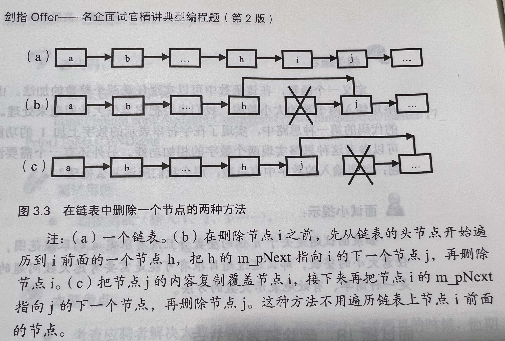
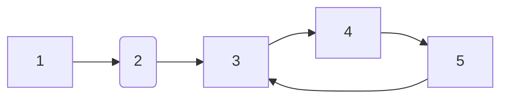
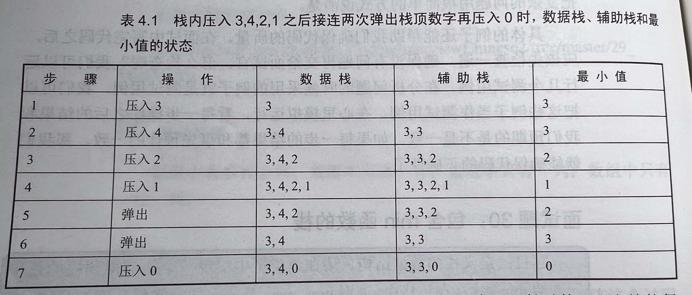
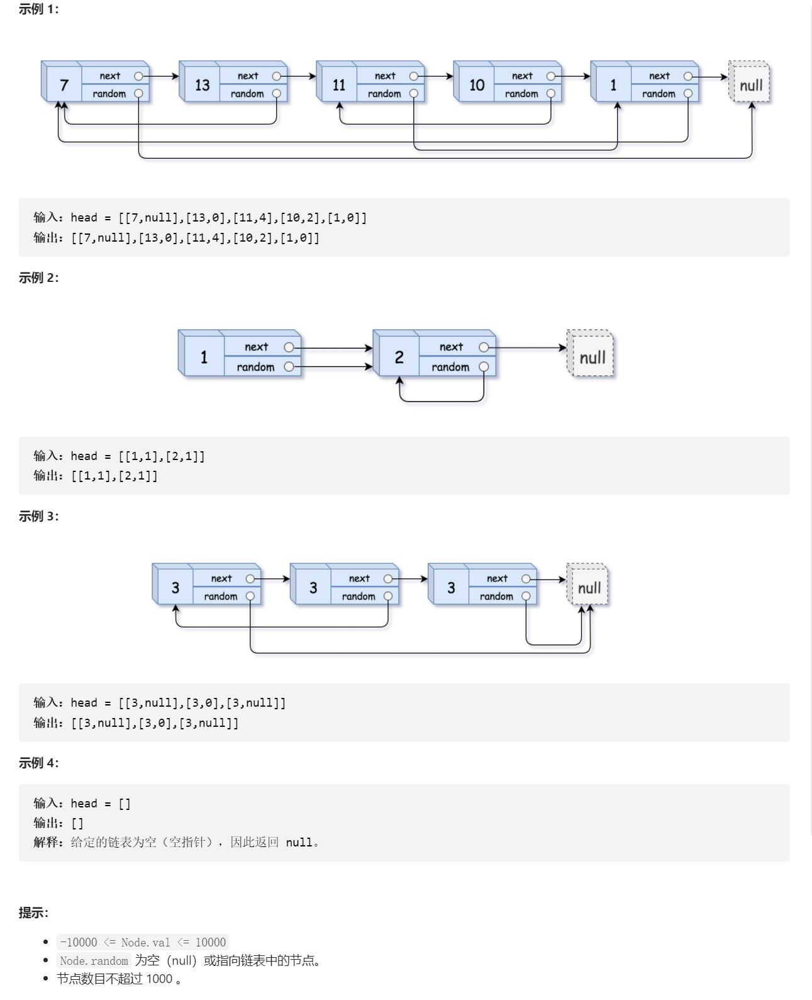

[toc]


&emsp;
&emsp; 
# 面试题3：数组中重复的数字
## 1. 题目详情
&emsp;&emsp;  找出数组中重复的数字。
&emsp;&emsp;  在一个长度为 n 的数组 nums 里的所有数字都在 0～n-1 的范围内。数组中某些数字是重复的，但不知道有几个数字重复了，也不知道每个数字重复了几次。请找出数组中任意一个重复的数字。
示例 ：
```
输入：
[2, 3, 1, 0, 2, 5, 3]
输出：2 或 3 
```
限制：
```
2 <= n <= 100000
```
## 2. 解答
## 2.1 不能修改目标数组
**方法1：用数组索引法** 
```cpp
class Solution {
public:
    int findRepeatNumber(vector<int>& nums) {
        if(nums.size() == 0)
            return -1;
        // 首先新建一个长度为`nums.size()`大小的数组，并将所有元素初始化为-1；
        vector<int> arr(nums.size(), -1);
        // 因为nums中的元素都在 0 ~ nums.size()-1 之间，所以我们可以遍历原数组nums
        for(size_t i = 0; i < nums.size(); ++i){
            // 若 arr[nums[i]]不为-1，则 nums[i] 肯定是第一个重复的数字
            if(arr[nums[i]] == -1){
                arr[nums[i]] = i;
                continue;
            }
            return nums[i];
        }
        return -1; // 若走到这里，则说明数组中没有重复的数字
    }
};
```
**方法2： 哈希表法**
```cpp
class Solution {
public:
    int findRepeatNumber(vector<int>& nums) {
        if(nums.size() == 0)
            return -1;
        unordered_set<int> st; // 无序容器比有序容器效率高
        for(size_t i = 0; i < nums.size(); ++i){
            // 若在set中找不到，则插入，反之则返回该元素
            if(st.find(nums[i]) == st.end())
                st.insert(nums[i]);
            else
                return nums[i];
        }
        return -1;
    }
};
```

## 2.1 可以修改目标数组
**方法3：数组索引法的就地修改版**
这个方法和 方法1：用数组索引法 类似，但是这个方法空间复杂度为`O(1)`，因为是直接修改目标数组：
```cpp
class Solution {
public:
    int findRepeatNumber(vector<int>& nums) {
        if(nums.size() == 0)
            return -1;
        size_t i = 0;
        while(i < nums.size()){ // 注意，这里不能用 for循环
            if (i == nums[i]){
                // 直有在当前index内的值和index相等时才能往下推进（即i == nums[i]时）
                ++i; 
                continue;
            }                
            else if(nums[i] != nums[nums[i]])
                swap(nums[i], nums[nums[i]]);
            else
                return nums[i];
        }
        return -1;
    }
};
```


&emsp;
&emsp; 
# 面试题4：二维数组中的查找
## 1. 题目描述
&emsp;&emsp;  在一个 `n * m` 的二维数组中，每一行都按照从左到右递增的顺序排序，每一列都按照从上到下递增的顺序排序。请完成一个高效的函数，输入这样的一个二维数组和一个整数，判断数组中是否含有该整数。现有矩阵 `matrix` 如下：
```
[
  [1,   4,  7, 11, 15],
  [2,   5,  8, 12, 19],
  [3,   6,  9, 16, 22],
  [10, 13, 14, 17, 24],
  [18, 21, 23, 26, 30]
]
```
给定 `target = 5`，返回 `true`。
给定 `target = 20`，返回 `false`。

## 2. 解答
### 2.1 解题思路
从右上角开始走，利用这个顺序关系可以在`O(m+n)`的复杂度下解决这个题：
> 如果当前位置元素比target小，则row++
> 如果当前位置元素比target大，则col--
> 如果相等，返回true
> 如果越界了还没找到，说明不存在，返回false
> 

### 2.2 代码实现
```cpp
class Solution {
public:
    bool findNumberIn2DArray(vector<vector<int>>& matrix, int target) {
        if(matrix.empty() || matrix[0].empty()){
            cout << "Input error: empty array." << endl;
            return false;
        }

        int row = 0;
        int col = matrix[0].size() - 1;

        for(; row < matrix.size(); ++row){
            for(; col >= 0 ; --col){
                if(target == matrix[row][col])
                    return true;
                else if(target > matrix[row][col])
                    break;
                else if(target < matrix[row][col])
                    continue;
            }
        }

        return false;
    }
};
```
看了书上的实现后，发现遍历可以通过一个`while`来实现：
```cpp
class Solution {
public:
    bool findNumberIn2DArray(vector<vector<int>>& matrix, int target) {
        if(matrix.empty() || matrix[0].empty()){
            cout << "Input error: empty array." << endl;
            return false;
        }

        int row = 0;
        int col = matrix[0].size() - 1;

        while(row < matrix.size() && col >= 0){
            if(target == matrix[row][col])
                return true;
            else if(target > matrix[row][col])
                ++row;
            else if(target < matrix[row][col])
                --col;           
        }

        return false;
    }
};
```

## 3. 优化
&emsp;&emsp;  结合二分法可以再次降低复杂度。


&emsp;
&emsp; 
# 面试题5：替换空格
## 1. 题目描述
请实现一个函数，把字符串 s 中的每个空格替换成"%20"。示例 1：
```
输入：s = "We are happy."
输出："We%20are%20happy."
```
## 2. 解答
### 2.1 C++解法
这个就没啥难度了，直接用`std::string`很容易就能解决
```cpp
class Solution {
public:
    string replaceSpace(string s) {
        if(s.empty()){
            cout << "Erro: Empty string." << endl;
            return "";
        }

        size_t sp_cnt = count(s.begin(), s.end(), ' ');
        cout << "sp_cnt" << sp_cnt << endl;

        // string ret_str[s.size() + 2*sp_cnt];
        string ret_str;
        for(int i = 0; i < s.size(); ++i){
            if(s[i] == ' '){
                ret_str.push_back('%');
                ret_str.push_back('2');
                ret_str.push_back('0');
            }
            else
                ret_str.push_back(s[i]);
        }
        return ret_str;
    }
};
```
**收获：**
> ① `std::string`似乎不能指定长度。
> ② `std::string`在`push_back()`的时候只能一次插入一个`char`
> 

### 2.2 c语言解法
#### 2.2.3 思路
思路如下：
> ① 先遍历一次目标字符串，计算出空格的个数`n`，然后在原字符串的基础上加上`2n`就是要返回的字符串长度；
> ② 填充新字符串的时候从后往前遍历，这样比较容易实现一点；
> 
```cpp
char* replaceSpace(char* s){
    if(s == NULL){
        printf("Bad input, null pointer.");
        return NULL;
    }

    int len = strlen(s) + 1; // 把 \0 给加上
    int sp_cnt = 0;

    for(int i = 0; i < len; ++i){
        if(s[i] == ' ')
            ++sp_cnt;
    }

    int len_new= len + 2*sp_cnt;
    char *ret_str = malloc(sizeof(char) * len_new);

    for(int i = len-1; i >= 0; --i){
        if(s[i] == ' '){
            ret_str[--len_new] = '0';
            ret_str[--len_new] = '2';
            ret_str[--len_new] = '%';
        }else{
            ret_str[--len_new] = s[i];
        }
    }    
    return ret_str;
}
```
LeetCode和书上不太一样，书上要求的是通过实参传进去的指针返回，而LeetCode是要求通过返回值来返回，因此需要通过`malloc()`来动态分配内存，要不然返回的就是局部变量

**收获：**
> ① `strlen()`返回的长度不包含`\0`；
> ② `malloc()`是按字节分配的，返回的是一个指针，语法如下：`char *ptr = malloc(sizeof(char) * len);`
> 


&emsp;
&emsp; 
# 面试题 06. 从尾到头打印链表
## 1 题目详情
输入一个链表的头节点，从尾到头反过来返回每个节点的值（用数组返回）。示例 1：
```
输入：head = [1,3,2]
输出：[2,3,1]
```

## 2 C++实现
### 2.1 解题思路
&emsp;&emsp; 先顺序遍历链表，在遍历过程中将节点的值`push_back`到一个`voctor`中，直到最后一个节点；
&emsp;&emsp; 返回的时候把前面构建的`vector`逆序返回(通过`rbeing()`和`rend()`构建一个新的`vector`)
### 2.2 代码实现
```cpp
/**
 * Definition for singly-linked list.
 * struct ListNode {
 *     int val;
 *     ListNode *next;
 *     ListNode(int x) : val(x), next(NULL) {}
 * };
 */
class Solution {
public:
    vector<int> reversePrint(ListNode* head) {
        vector<int> ret;
        if(head == NULL){
            cout << "Bad Input: null pointer" << endl;
            return ret;
        }
        
        ListNode* ptr = head;
        while(ptr != NULL){
            ret.push_back(ptr->val);
            ptr = ptr->next;
        }
        return vector<int>(ret.rbegin(), ret.rend());
    }
};
```

## 3 c语言实现
### 3.1 解题思路
&emsp;&emsp; 书中用的是`std::stack`实现的，但问题时，既然都用C++标准库了，为什么不直接用`std::vector`。
&emsp;&emsp; 书中还提供了另一种解法：利用函数递归，但存在函数调用栈溢出的问题。


&emsp;
&emsp; 
# 面试题 07：重建二叉树
## 1. 题目详情
复习了几种遍历再来 TODO:


&emsp;
&emsp; 
# 面试题 08：
复习了几种遍历再来 TODO:


&emsp;
&emsp; 
# 面试题 09：用两个栈实现队列
## 1. 题目详情
&emsp;&emsp; 用两个栈实现一个队列。队列的声明如下，请实现它的两个函数 `appendTail` 和 `deleteHead` ，分别完成在队列尾部插入整数和在队列头部删除整数的功能。(若队列中没有元素，`deleteHead` 操作返回 `-1` )
示例 1：
```
输入：
["CQueue","appendTail","deleteHead","deleteHead"]
[[],[3],[],[]]
输出：[null,null,3,-1]
```
示例 2：
```
输入：
["CQueue","deleteHead","appendTail","appendTail","deleteHead","deleteHead"]
[[],[],[5],[2],[],[]]
输出：[null,-1,null,null,5,2]
```

## 2 C++实现
### 2.1 解题思路
&emsp;&emsp; 


```cpp
class CQueue {
public:
    stack<int> in;
    stack<int> out;
    CQueue() {

    }
    
    void appendTail(int value) {
        in.push(value);
    }
    
    int deleteHead() {
        int ret = -1;
        if(out.empty()){
            while(!in.empty()){
                out.push(in.top());
                in.pop();
            }
        }
        if(out.empty())
            return ret;
        else{
            ret = out.top();
            out.pop();
        }
        return ret;
    }
};

/**
 * Your CQueue object will be instantiated and called as such:
 * CQueue* obj = new CQueue();
 * obj->appendTail(value);
 * int param_2 = obj->deleteHead();
 */
```


&emsp;
&emsp; 
# 面试题 10- I. 斐波那契数列
## 1. 题目详情
写一个函数，输入 n ，求斐波那契（Fibonacci）数列的第 n 项（即 F(N)）。斐波那契数列的定义如下：
```
F(0) = 0,   F(1) = 1
F(N) = F(N - 1) + F(N - 2), 其中 N > 1.
```
斐波那契数列由 0 和 1 开始，之后的斐波那契数就是由之前的两数相加而得出。
答案需要取模 `1e9+7（1000000007）`，如计算初始结果为：`1000000008`，请返回 `1`。
示例 1：
```
输入：n = 2
输出：1
```
示例 2：
```
输入：n = 5
输出：5
```
提示：
```
0 <= n <= 100
```

## 2. 解答
```cpp
class Solution {
public:
    int fib(int n) {
        if(n < 0){
            cout << "ERROR: Bad input." << endl;
            return -1;
        }

        long long n_2 = 0, n_1 = 1, ret = 0;
        while(n-- > 0){
            n_2 = n_1;
            n_1 = ret;
            ret = (n_1 + n_2) %1000000007;
        }
        return ret;
    }
};
```


&emsp;
&emsp; 
# 面试题 10- II. 青蛙跳台阶问题
## 1. 题目详情
一只青蛙一次可以跳上`1`级台阶，也可以跳上`2`级台阶。求该青蛙跳上一个 `n` 级的台阶总共有多少种跳法。
答案需要取模 `1e9+7（1000000007）`，如计算初始结果为：`1000000008`，请返回 `1`。
示例 1：
```
输入：n = 2
输出：2
```
示例 2：
```
输入：n = 7
输出：21
```
示例 3：
```
输入：n = 0
输出：1
```
提示：
```
0 <= n <= 100
```
TODO: 书上还有另一个扩展，也看看


&emsp;
&emsp; 
# 面试题 11. 旋转数组的最小数字
## 1. 题目详情
&emsp;&emsp; 把一个数组最开始的若干个元素搬到数组的末尾，我们称之为数组的旋转。
&emsp;&emsp; 给你一个可能存在 重复 元素值的数组 `numbers` ，它原来是一个升序排列的数组，并按上述情形进行了一次旋转。请返回旋转数组的最小元素。例如，数组 `[3,4,5,1,2]` 为 `[1,2,3,4,5]` 的一次旋转，该数组的最小值为`1`。  
示例 1：
```
输入：[3,4,5,1,2]
输出：1
```
示例 2：
```
输入：[2,2,2,0,1]
输出：0
```

## 2. 解答
```cpp
class Solution {
public:
    int minArray(vector<int>& numbers) {
        size_t n = numbers.size();
        if(n == 0){
            cout << "Error: Bad input." << endl;
            return -1;
        }

        if(n <= 1)
            return numbers[n-1];
        int ret = numbers[0];
        int i = 1;
        for(; i < n; ++i){
            if(numbers[i-1]>numbers[i])
                ret = numbers[i];
        }

        return ret;
    }
};
```
## 3. 更优解
&emsp;&emsp; 可以用二分法
TODO:


&emsp;
&emsp; 
# 面试题 12. 矩阵中的路径
## 1. 题目详情

## 2. 解答
&emsp;&emsp; 用回溯法，写一个深度优先遍历的功能函数，然后递归调用它即可。
```cpp
class Solution {
public:
    bool exist(vector<vector<char>>& board, string word) {
        // 此处边界判断

        for(size_t row = 0; row < board.size(); ++row){
            for(size_t col = 0; col < board[0].size(); ++col){
                if (dfs(board, row, col, word, 0) == true)
                    return true;
            }
        }
        return false;
    }

private:  
    // index是字符串单词word的下标
    bool dfs(vector<vector<char>>& board, size_t row, size_t col, string word, size_t index){
        // 判断是否越界、字符比较
        if(row >= board.size() || row < 0 || col >= board[0].size() || col < 0 || board[row][col] != word[index])
            return false;
        // 如果word的每个字符都查找完了，意味着目标字符串存在，直接返回true
        if(word.size()-1 == index)
            return true;
        board[row][col] = '\0'; // 防止字符被重复利用
        bool res = dfs(board, row+1, col, word, index+1) || 
                    dfs(board, row-1, col, word, index+1) ||
                    dfs(board, row, col+1, word, index+1) ||
                    dfs(board, row, col-1, word, index+1);
        board[row][col] = word[index]; // 恢复网格字符串
        return res;
    }
};
```


&emsp;
&emsp; 
# 面试题 13. 机器人的运动范围
TODO:


&emsp;
&emsp; 
# 面试题 14- I. 剪绳子
## 1. 题目详情
&emsp;&emsp; 给你一根长度为 `n` 的绳子，请把绳子剪成整数长度的 `m` 段（`m、n`都是整数，`n>1`并且`m>1`），每段绳子的长度记为 `k[0],k[1]...k[m-1]` 。请问 `k[0]*k[1]*...*k[m-1]` 可能的最大乘积是多少？例如，当绳子的长度是`8`时，我们把它剪成长度分别为`2、3、3`的三段，此时得到的最大乘积是`18`。

示例 1：
```
输入: 2
输出: 1
解释: 2 = 1 + 1, 1 × 1 = 1
```
示例 2:
```
输入: 10
输出: 36
解释: 10 = 3 + 3 + 4, 3 × 3 × 4 = 36
```
提示：
```
2 <= n <= 58
```

## 2. 解答
### 2.1 动态规划
首先定义函数`F(n)`为把长度为`n`的绳子剪成若干段后各段长度乘积的最大值：
> &emsp;&emsp; 在剪第一刀的时候，我们有 `n-1` 种可能的选择，也就是剪出来的第一段绳子的可能长度分别为 `1,2, ... ,n-1`。因此`F(n) = max(F(n) / F(n-1))`，其中`0< n < n`
> &emsp;&emsp; 这是一个从上至下的递归公式。由于递归会有很多重复的子问题，从而有大量不必要的重复计算。一个更好的办法是按照从下而上的顺序计算，也就是说我们先得到 `f(2)、f(2)`，再得到 `f(4)、f(5)`，直到得到 `f(n)`。
> &emsp;&emsp; 当绳子的长度为`2`时，只可能剪成长度都为 `1`的两段，因此`f(2)`等于 `1`。
> &emsp;&emsp; 当绳子的长度为`3`时，可能把绳子剪成长度分别为 `1`和`2`的两段或者长度都为`1` 的三段，由于 `1×2>1×1×1`，因此`f(3)=2`。
> 
```cpp
class Solution {
public:
    int cuttingRope(int n) {
        // 当n<=3时直接返回
        if(n < 2)
            return 0;
        if(n == 2)
            return 1;
        if(n == 3)
            return 2;

        vector<int> results(n+1);
        results[0] = 0;
        results[1] = 1;
        results[2] = 2;
        results[3] = 3;

        int max = 0;
        for(int i = 4; i <= n; ++i){
            max = 0;
            for(int j = 1; j <= i/2; ++j){
                int tmp = results[j]*results[i-j];
                if(tmp > max)
                    max = tmp;
            }
            results[i] = max;
        }
        return results[n];
    }
};
```

### 2.2 贪心算法
此解法的核心思路是：
> 尽可能把绳子分成长度为3的小段，这样乘积最大
> 
至于为什么是这样，可以看看网上的证明。步骤如下：
> ① 如果 n == 2，返回1，如果 n == 3，返回2，两个可以合并成n小于4的时候返回n - 1
> ② 如果 n == 4，返回4
> ③ 如果 n > 4，分成尽可能多的长度为3的小段，每次循环长度n减去3，乘积res乘以3；最后返回时乘以小于等于4的最后一小段
> ④ 以上②和③可以合并
> 
```cpp
class Solution {
public:
    int cuttingRope(int n) {
        if(n < 2)
            return 0;
        if(n == 2)
            return 1;
        if(n == 3)
            return 2;

        int times_of_3 = n / 3; // 倍数
        int remainder = n % 3;  // 余数
        if(remainder == 0) // 被整除
            return pow(3, times_of_3);
        else if(remainder == 1) // 余数为1
            return pow(3, times_of_3-1) * 4;
        else // 余数为 2
            return pow(3, times_of_3) * 2;
    }
};
```

# 面试题 14- II. 剪绳子 II
&emsp;&emsp; 这题和之前有些不一样，前面那题`2 <= n <= 58`，而这题`n`可以到`120`，这可能会导致算数溢出的问题。
&emsp;&emsp; 为了解决潜在的算数溢出问题，标准库`math.pow()`就不能用了，需要自己编写一个`pow()`方法，每次迭代的时候对`1000000007`取余。
```cpp
class Solution {
public:
    int cuttingRope(int n) {
        if(n < 2)
            return 0;
        if(n == 2)
            return 1;
        if(n == 3)
            return 2;

        int times_of_3 = n / 3; // 倍数
        int remainder = n % 3;  // 余数
        long res = 0;
        if(remainder == 0)
            res =  pow(3, times_of_3);
        else if(remainder == 1)
            res =  pow(3, times_of_3-1) * 4;
        else // 即 remainder == 2
            res =  pow(3, times_of_3) * 2;
        return  res % 1000000007;
    }

private:
    long pow(int n, int times){ // 返回值也是long
        long res = 1; // 注意此处必须是long，不能是int，因为int会溢出
        while(times-- > 0)
            res = (res * 3) % 1000000007;
        return res;
    }
};
```


&emsp;
&emsp; 
# 面试题 15. 二进制中1的个数
## 1. 题目详情 
&emsp;&emsp; 编写一个函数，输入是一个无符号整数（以二进制串的形式），返回其二进制表达式中数字位数为 '1' 的个数（也被称为 汉明重量).）。

提示：
* 请注意，在某些语言（如 Java）中，没有无符号整数类型。在这种情况下，输入和输出都将被指定为有符号整数类型，并且不应影响您的实现，因为无论整数是有符号的还是无符号的，其内部的二进制表示形式都是相同的。
* 在 Java 中，编译器使用 二进制补码 记法来表示有符号整数。因此，在上面的 示例 3 中，输入表示有符号整数 -3。

示例 1：
```
输入：n = 11 (控制台输入 00000000000000000000000000001011)
输出：3
解释：输入的二进制串 00000000000000000000000000001011 中，共有三位为 '1'。
```
示例 2：
```
输入：n = 128 (控制台输入 00000000000000000000000010000000)
输出：1
解释：输入的二进制串 00000000000000000000000010000000 中，共有一位为 '1'。
```
示例 3：
```
输入：n = 4294967293 (控制台输入 11111111111111111111111111111101，部分语言中 n = -3）
输出：31
解释：输入的二进制串 11111111111111111111111111111101 中，共有 31 位为 '1'。
```
提示：
* 输入必须是长度为 32 的 二进制串 。

## 2. 知识回顾
这题应该通过位移来做，在这里先复习一下移位的相关概念
> (1) 位移有两种：逻辑移位和算数移位
> (2) 对于**无**符号整数，这两种之间没有差异；
> (3) 对于**有**符号整数：
> &emsp;① 对于左移，逻辑左移=算数左移，右边都是统一添`0`;
> &emsp;② 对于右移，逻辑右移，左边统一添0；算数右移，左边添加的数和符号有关，左侧添加符号位(即正数添0，负数添1)。
> 
左移运算符（<<）
> 左移运算符是用来将一个数的各二进制位左移若干位，移动的位数由右操作数指定（右操作数必须是非负值），其右边空出的位用0填补，高位左移溢出则舍弃该高位。
> 
右移运算符（>>）
> 对无符号数,右移时左边高位移入0；对于有符号的值,如果原来符号位为0(该数为正),则左边也是移入0。如果符号位原来为1(即负数),则左边移入0还是1,要**取决于所用的OS采用的是算数右移还是逻辑右移**。有的系统移入0,有的系统移入1。移入0的称为“逻辑移位”,即简单移位；移入1的称为“算术移位”。
> 
## 3. 解答
```cpp
class Solution {
public:
    int hammingWeight(uint32_t n) {
        size_t count = 0;
        while(n != 0){
            if(n&1 == 1)
                ++count;
            n = n>>1; // 右移一位
        }
        return count;
    }
};
```


&emsp;
&emsp; 
# 面试题 16. 数值的整数次方
## 1. 题目详情
实现 `pow(x, n)` ，即计算 `x` 的 `n` 次幂函数。不得使用库函数，同时不需要考虑大数问题。
示例 1：
```
输入：x = 2.00000, n = 10
输出：1024.00000
```
示例 2：
```
输入：x = 2.10000, n = 3
输出：9.26100
```
示例 3：
```
输入：x = 2.00000, n = -2
输出：0.25000
解释：2-2 = 1/22 = 1/4 = 0.25
```
提示：
```
-100.0 < x < 100.0
-231 <= n <= 231-1
-104 <= xn <= 104
```

## 2. 解答
```cpp
class Solution {
public:
    double myPow(double x, int n) {
        double res = 0.0;
        if(n == 0)
            res = 1.0;
        else if(n == 1)
            res = x;
        else if(n > 1)
            res = func(x, n);
        else{ // n < 0
            long n2 = 0 - static_cast<long>(n); // 用long是为了防止溢出
            res = 1.0 / func(x, n2);
        }
        return res;
    }
private:
    double func(double x, long long n){
        if(n == 0)
            return 1;
        else if(n == 1)
            return x;
        double res = func(x, n>>1);
        res *= res;
        if(n & 0x1 == 1) //奇数
            res *= x;
        return res;
    }
};
```


&emsp;
&emsp; 
# 面试题 17. 打印从1到最大的n位数
## 1. 题目详情
输入数字 n，按顺序打印出从 1 到最大的 n 位十进制数。比如输入 3，则打印出 1、2、3 一直到最大的 3 位数 999。
示例 1:
```
输入: n = 1
输出: [1,2,3,4,5,6,7,8,9]
```
说明：
> ① 用返回一个整数列表来代替打印
> ② n 为正整数
> 

## 2. 解答
### 2.1 解题思路
&emsp;&emsp; 
TODO: 要考虑大数问题


&emsp;
&emsp; 
# 面试题 18. 删除链表的节点
## 1. 题目详情
给定单向链表的头指针和一个要删除的节点的值，定义一个函数删除该节点。
返回删除后的链表的头节点。
注意：此题对比原题有改动
示例 1:
```
输入: head = [4,5,1,9], val = 5
输出: [4,1,9]
解释: 给定你链表中值为 5 的第二个节点，那么在调用了你的函数之后，该链表应变为 4 -> 1 -> 9.
```
示例 2:
```
输入: head = [4,5,1,9], val = 1
输出: [4,5,9]
解释: 给定你链表中值为 1 的第三个节点，那么在调用了你的函数之后，该链表应变为 4 -> 5 -> 9.
```
说明：
> 题目保证链表中节点的值互不相同
> 若使用 C 或 C++ 语言，你不需要 free 或 delete 被删除的节点
> 

## 2. 解答
### 2.1 常规解法：时间复杂度O(n)
```cpp
/**
 * Definition for singly-linked list.
 * struct ListNode {
 *     int val;
 *     ListNode *next;
 *     ListNode(int x) : val(x), next(NULL) {}
 * };
 */
class Solution {
public:
    ListNode* deleteNode(ListNode* head, int val) {
        if(head == NULL){
            cout << "Bad input." << endl;
            return head;
        }

        // 如果要删除的是头结点
        if(head->val == val)
            return head->next;

        ListNode *pre=head, *cur=head;
        while(cur!=NULL && cur->val != val){
            pre = cur;
            cur = pre->next;
        }

        pre->next = cur->next;

        return head;
    }
};
```

### 2.2 一个巧妙的解法：时间复杂度O(1)
&emsp;&emsp; **注意，这个是书上的题目，leecode有些不一样，书中的`DeleteNode()`给的形参是一个节点，而LeetCode给的是一个`int`。**
&emsp;&emsp; 在上面的解法中，之所以需要从头开始查找，是因为我们需要得到将被删除的结点的前面一个结点。在单向链表中，结点中没有指向前一个结点的指针，所以只好从链表的头结点开始顺序查找。
&emsp;&emsp; 那是不是一定需要得到被删除的结点的前一个结点呢？答案是否定的。我们可以很方便地得到要删除的结点的一下结点。如果我们把下一个结点的内容复制到需要删除的结点上覆盖原有的内容，再把下一个结点删除，那是不是就相当于把当前需要删除的结点删除了？
&emsp;&emsp; 我们还是以前面的例子来分析这种思路。我们要删除结点i，先把i的下一个结点j的内容复制到i，然后把i的指针指向结点j的下一个结点。此时再删除结点j，其效果刚好是把结点i给删除了（如图3.3（c）所示）。
<div align="center"></div>

&emsp;&emsp; **上述思路还有一个问题**：如果要删除的结点位于链表的尾部，那么它就没有下一个结点，怎么办？我们仍然从链表的头结点开始，顺序遍历得到该结点的前序结点，并完成删除操作。
&emsp;&emsp; **最后需要注意的是**，如果链表中只有一个结点，而我们又要删除链表的头结点（也是尾结点），此时我们在删除结点之后，还需要把链表的头结点设置为NULL。
&emsp;&emsp; 有了这些思路，我们就可以动手写代码了。下面是这种思路的参考代码：
```cpp
// 注意，和leetcode上面不一样的是，这里给出的是待删除的节点 pToBeDeleted，而不是一个int值 val
void DeleteNode(ListNode** pListHead, ListNode* pToBeDeleted) 
{
    if(!pListHead || !pToBeDeleted)
        return;

    // 要删除的结点不是尾结点
    if(pToBeDeleted->m_pNext != nullptr)
    {
        ListNode* pNext = pToBeDeleted->m_pNext;
        pToBeDeleted->m_nValue = pNext->m_nValue;
        pToBeDeleted->m_pNext = pNext->m_pNext;
 
        delete pNext;
        pNext = nullptr;
    }
    // 链表只有一个结点，删除头结点（也是尾结点）
    else if(*pListHead == pToBeDeleted)
    {
        delete pToBeDeleted;
        pToBeDeleted = nullptr;
        *pListHead = nullptr;
    }
    // 链表中有多个结点，删除尾结点
    else
    {
        ListNode* pNode = *pListHead;
        while(pNode->m_pNext != pToBeDeleted)
        {
            pNode = pNode->m_pNext;            
        }
 
        pNode->m_pNext = nullptr;
        delete pToBeDeleted;
        pToBeDeleted = nullptr;
    }
}
```
&emsp;&emsp; 接下来我们分析这种思路的时间复杂度。对于`n－1`个非尾结点而言，我们可以在`O（1）`时把下一个结点的内存复制覆盖要删除的结点，并删除下一个结点；对于尾结点而言，由于仍然需要顺序查找，时间复杂度是`O（n）`。因此总的平均时间复杂度是`[（n－1）*O（1）＋O（n）]/n`，结果还是`O（1）`，符合面试官的要求。
&emsp;&emsp; 值得注意的是，上述代码仍然不是完美的代码，因为它基于一个假设：要删除的结点的确在链表中。我们需要`O（n）`的时间才能判断链表中是否包含某一结点。受到`O（1）`时间的限制，我们不得不把确保结点在链表中的责任推给了函数`DeleteNode`的调用者。在面试的时候，我们可以和面试官讨论这个假设，这样面试官就会觉得我们考虑问题非常全面。


&emsp;
&emsp; 
# 面试题 19. 正则表达式匹配
TODO: 这个超时了，后面再回来看
```cpp
class Solution {
public:
    bool isMatch(string s, string p) {
        return match_core(s, p, 0, 0);        
    }
private:
    bool match_core(string s, string p, size_t m_s, size_t m_p){
        cout << m_s << m_p << endl;
        if(m_s >= s.size() && m_p >= p.size())
            return true;
        if(m_s < s.size() && m_p >= p.size())
            return false;

        if(m_p+1 < p.size() && p[m_p+1] == '*'){
            if(s[m_s] == p[m_p] || (p[m_p] == '.' && m_s < s.size())){
                return match_core(s, p, m_s+1, m_p+2)  // ① 字符* 匹配1次
                    || match_core(s, p, m_s+1, m_p)    // ② 字符* 匹配多次
                    || match_core(s, p, m_s, m_p+2);

            }else
                return match_core(s, p, m_s, m_p+2);   // ③ 字符* 匹配0次
        }

        if(s[m_s] == p[m_p] || (p[m_p] == '.' && m_s < s.size()))
            return match_core(s, p, m_s+1, m_p+1);

        return false;
    }
};
```


&emsp;
&emsp; 
# 面试题 20. 表示数值的字符串
TODO:


&emsp;
&emsp; 
# 面试题 21. 调整数组顺序使奇数位于偶数前面
## 1. 题目详情
输入一个整数数组，实现一个函数来调整该数组中数字的顺序，使得所有奇数在数组的前半部分，所有偶数在数组的后半部分。
示例：
```
输入：nums = [1,2,3,4]
输出：[1,3,2,4] 
注：[3,1,2,4] 也是正确的答案之一。
```
提示：
```
0 <= nums.length <= 50000
0 <= nums[i] <= 10000
```

## 2. 解答
这个用双指针法，一个指向头，一个指向尾：
```cpp
class Solution {
public:
    vector<int> exchange(vector<int>& nums) {
        if(nums.size() == 0){
            return nums;
        }
        auto start = nums.begin(), end = nums.end() - 1;
        while(start < end){
            if(!is_even(*start) && is_even(*end)){ // 奇偶，两个指针都往前(后)移动
                ++start;
                --end;
            }else if(!is_even(*start) && !is_even(*end)){ // 奇奇，只有开头的指针需要往前移
                ++start;
            }else if(is_even(*start) && is_even(*end)){ // 偶偶，只有后面那个指针才要移动
                --end;
            }else if(is_even(*start) && !is_even(*end)){ // 偶奇，先交换，然后两个指针都移动
                swap(*start, *end);
                ++start;
                --end;                
            }
        }
        return nums;
    }
private:
    bool is_even(int n){
        return (n & 1) == 0;
    }
};
```
&emsp;&emsp; 书上的考点还有另一个：扩展性。如果需求变了，要求按大小排序了。要怎么做才能做到以后的扩展性更强呢？
&emsp;&emsp; 书中的做法是写一个函数来判断数字是奇是偶，然后通过函数指针来调用它：
```cpp
class Solution {
public:
    // 这里修改了函数的形参，leecode不能运行。
    vector<int> exchange(vector<int>& nums, bool(*compare)(int)) {
        if(nums.size() == 0){
            return nums;
        }
        auto start = nums.begin(), end = nums.end() - 1;
        while(start < end){
            if(!is_even(*start) && is_even(*end)){ // 奇偶，两个指针都往前(后)移动
                ++start;
                --end;
            }else if(!is_even(*start) && !is_even(*end)){ // 奇奇，只有开头的指针需要往前移
                ++start;
            }else if(is_even(*start) && is_even(*end)){ // 偶偶，只有后面那个指针才要移动
                --end;
            }else if(is_even(*start) && !is_even(*end)){ // 偶奇，先交换，然后两个指针都移动
                swap(*start, *end);
                ++start;
                --end;                
            }
        }
        return nums;
    }
private:
    bool compare(int n){
        return (n & 1) == 0;
    }
};
```


&emsp;
&emsp; 
# 面试题 22. 链表中倒数第k个节点
## 1. 题目详情
输入一个链表，输出该链表中倒数第k个节点。为了符合大多数人的习惯，本题从1开始计数，即链表的尾节点是倒数第`1`个节点。
例如，一个链表有 `6` 个节点，从头节点开始，它们的值依次是 `1、2、3、4、5、6`。这个链表的倒数第 `3` 个节点是值为 `4` 的节点。
示例：
```
给定一个链表: 1->2->3->4->5, 和 k = 2.

返回链表 4->5.
```

## 2. 解答
使用快慢指针，先让快指针走k步，然后两个指针同步走，当快指针走到头时，慢指针就是链表倒数第k个节点。
```cpp
/**
 * Definition for singly-linked list.
 * struct ListNode {
 *     int val;
 *     ListNode *next;
 *     ListNode(int x) : val(x), next(NULL) {}
 * };
 */
class Solution {
public:
    ListNode* getKthFromEnd(ListNode* head, int k) {
        size_t n = 0;
        ListNode *pre = head, *post =head;
        while(n++ < k-1)
            post = post->next;
        while(post->next != NULL){
            post = post -> next;
            pre = pre -> next;
        }
        return pre;
    }
};
```
看了书上的讲解，发现还有如下几点需要考虑：
> (1) `head`指针没判空；
> (2) 目标链表的长度可能小于`k`；
> 
代码改进如下：
```cpp
class Solution {
public:
    ListNode* getKthFromEnd(ListNode* head, int k) {
        if(head == NULL) // 判空
            return NULL;

        size_t n = 0;
        ListNode *pre = head, *post =head;
        while(n++ < k-1 && post != NULL)
            post = post->next;

        // 若链表的长度小于k
        if(post == NULL)
            return NULL;

        while(post->next != NULL){
            post = post -> next;
            pre = pre -> next;
        }
        return pre;
    }
};
```


&emsp;
&emsp; 
# 面试题23：链表中环的入口结点
这题Leecode没有，是在牛客网刷的
## 1. 题目详情
描述
给一个长度为n链表，若其中包含环，请找出该链表的环的入口结点，否则，返回null。

数据范围： `n≤10000，1<=结点值<=10000`
要求：空间复杂度 `O(1)`，时间复杂度 `O(n)`

例如，输入`{1,2},{3,4,5}`时，对应的环形链表如下图所示：

可以看到环的入口结点的结点值为3，所以返回结点值为3的结点。
输入描述：
> 输入分为2段，第一段是入环前的链表部分，第二段是链表环的部分，后台会根据第二段是否为空将这两段组装成一个无环或者有环单链表
> 
返回值描述：
> 返回链表的环的入口结点即可，我们后台程序会打印这个结点对应的结点值；若没有，则返回对应编程语言的空结点即可。
> 
示例1

```
输入：{1,2},{3,4,5}
返回值：3
说明：返回环形链表入口结点，我们后台程序会打印该环形链表入口结点对应的结点值，即3    
```
示例2
```
输入：{1},{}
返回值："null"
说明：没有环，返回对应编程语言的空结点，后台程序会打印"null"   
```
示例3
```
输入：{},{2}
返回值：2
说明： 环的部分只有一个结点，所以返回该环形链表入口结点，后台程序打印该结点对应的结点值，即2 
```

## 2. 解答
### 2.1 书中的解法
(1) 先通过快慢指针判断是否有环，并算出环内有几个节点`num`。
> &emsp; 慢指针走一步，快指针走两步：
> &emsp;&emsp; 当快慢指针第一次相遇的节点一定是在环内；
> &emsp;&emsp; 若快指针到了`NULL`，说明目标链表没有环；
> 
(2) 再次使用快慢指针，快指针先走`num`步(环内节点的数量)，当快慢节点第一次相遇的时候就是环的入口节点。
```cpp
/*
struct ListNode {
    int val;
    struct ListNode *next;
    ListNode(int x) :
        val(x), next(NULL) {
    }
};
*/
class Solution {
public:
    ListNode* EntryNodeOfLoop(ListNode* pHead) {
        if(pHead == NULL)
            return NULL;
        size_t loop_num  = HasLoop(pHead);
        // 是否有环
        if(loop_num == 0) 
            return NULL;
        
        ListNode *ahead = pHead, *behind = pHead;
        while(loop_num-- > 0)
            ahead = ahead->next;
        while(ahead != behind){
            ahead = ahead->next;
            behind = behind -> next;
        }
        return behind;
    }
private:
    size_t HasLoop(ListNode* pHead){
        ListNode *ahead = pHead, *behind = pHead;
        size_t loop_num = 0;
        while(ahead != NULL){
            if(ahead == NULL || ahead->next == NULL || ahead->next->next == NULL)
                return loop_num;            
            ahead = (ahead -> next) -> next;
            behind = behind -> next;
            if(ahead == behind)
                break;
        }
        // 计算环内的节点数量
        do{
            ahead = ahead->next;
            ++loop_num;
        }while(ahead != behind);
            
        cout << loop_num << endl;
        return loop_num;
    }
};
```
### 2.2 牛客官方的解法
TODO: 牛客有更好的解法，时间复杂度和上面一样都是`O(n)`，但是遍历的次数少一点。


&emsp;
&emsp; 
# 面试题24. 反转链表
## 1. 题目
定义一个函数，输入一个链表的头节点，反转该链表并输出反转后链表的头节点。
示例:
```
输入: 1->2->3->4->5->NULL
输出: 5->4->3->2->1->NULL
```
限制：
```
0 <= 节点个数 <= 5000
```

## 2. 解答
用三个指针即可做到只遍历一次：
```cpp
/**
 * Definition for singly-linked list.
 * struct ListNode {
 *     int val;
 *     ListNode *next;
 *     ListNode(int x) : val(x), next(NULL) {}
 * };
 */
class Solution {
public:
    typedef ListNode* Node;
    ListNode* reverseList(ListNode* head) {
        if(head == NULL || head->next == NULL)
            return head;

        Node pre = head, mid = head->next, post = (head->next)->next;
        while(post != NULL){
            mid->next = pre;
            pre = mid;
            mid = post;
            post = post ->next;
        }

        mid->next = pre;
        head->next = NULL;

        return mid;
    }
};
```


&emsp;
&emsp; 
# 面试题25. 合并两个排序的链表
## 1. 题目
输入两个递增排序的链表，合并这两个链表并使新链表中的节点仍然是递增排序的。
示例1：
```
输入：1->2->4, 1->3->4
输出：1->1->2->3->4->4
```
限制：
```
0 <= 链表长度 <= 1000
```

## 2. 解答
需要注意的地方：
> 需要及时断开连接，而且要在断开要在最后做。
> 
```cpp
/**
 * Definition for singly-linked list.
 * struct ListNode {
 *     int val;
 *     ListNode *next;
 *     ListNode(int x) : val(x), next(NULL) {}
 * };
 */
class Solution {
public:
    ListNode* mergeTwoLists(ListNode* l1, ListNode* l2) {
        if(l1 == NULL)
            return l2;
        else if(l2 == NULL)
            return l1;
        
        // 确保待返回的list的头结点是较小的那个
        ListNode *cur1=l1, *cur2=l2, *list_ret=NULL;
        if(cur1->val <= cur2->val){
            list_ret = cur1;
            cur1 = cur1 -> next;
            list_ret -> next == NULL; // 刚开始的时候忘了断开了                        
        }else{
            list_ret = cur2;
            cur2 = cur2 -> next;
            list_ret -> next == NULL; 
        }

        ListNode * merged_list = list_ret;
        while(cur1 != NULL && cur2 != NULL){
            if(cur1->val <= cur2->val){
                list_ret->next = cur1;
                list_ret = list_ret->next;
                cur1 = cur1 -> next;        
                list_ret -> next == NULL;         
            }else{
                list_ret->next = cur2;
                list_ret = list_ret->next;
                cur2 = cur2 -> next;
                list_ret -> next == NULL;                  
            }
        }

        if(cur1 != NULL){
            list_ret->next = cur1;
            list_ret = list_ret->next;            
        }else if(cur2 != NULL){
            list_ret->next = cur2;
            list_ret = list_ret->next;            
        }else if(cur1 == NULL && cur2 == NULL){
            list_ret->next = NULL;
        }

        return merged_list;
    }
};
```


&emsp;
&emsp; 
# 面试题29. 顺时针打印矩阵
## 1. 题目
输入一个矩阵，按照从外向里以顺时针的顺序依次打印出每一个数字。
示例 1：
```
输入：matrix = [[1,2,3],[4,5,6],[7,8,9]]
输出：[1,2,3,6,9,8,7,4,5]
```
示例 2：
```
输入：matrix = [[1,2,3,4],[5,6,7,8],[9,10,11,12]]
输出：[1,2,3,4,8,12,11,10,9,5,6,7]
```
限制：
```
0 <= matrix.length <= 100
0 <= matrix[i].length <= 100
```

## 2. 解答
TODO:思路对了，但是老是调不通


&emsp;
&emsp; 
# 面试题30. 包含min函数的栈
## 题目详情
定义栈的数据结构，请在该类型中实现一个能够得到栈的最小元素的 `min` 函数在该栈中，调用 `min`、`push` 及 `pop` 的时间复杂度都是 `O(1)`。
示例:
```
MinStack minStack = new MinStack();
minStack.push(-2);
minStack.push(0);
minStack.push(-3);
minStack.min();   --> 返回 -3.
minStack.pop();
minStack.top();      --> 返回 0.
minStack.min();   --> 返回 -2.
```
提示：
```
各函数的调用总次数不超过 20000 次
```

## 2. 解答
&emsp;&emsp; 看到这个问题，我们的第一反应可能是每次压入一个新元素进栈时，将栈里的所有元素排序，让最小的元素位于栈顶，这样就能在O（1）时间得到最小元素了。但这种思路不能保证最后压入栈的元素能够最先出栈，因此这个数据结构已经不是栈了。
&emsp;&emsp; 我们接着想到在栈里添加一个成员变量存放最小的元素。每次压入一个新元素进栈的时候，如果该元素比当前最小的元素还要小，则更新最小元素。面试官听到这种思路之后就会问：如果当前最小的元素被弹出栈了，如何得到下一个最小的元素呢？
&emsp;&emsp; 分析到这里我们发现仅仅添加一个成员变量存放最小元素是不够的，也就是说当最小元素被弹出栈的时候，我们希望能够得到次小元素。因此在压入这个最小元素之前，我们要把次小元素保存起来。
&emsp;&emsp; 是不是可以把每次的最小元素（之前的最小元素和新压入栈的元素两者的较小值）都保存起来放到另外一个辅助栈里呢？我们不妨举几个例子来分析一下把元素压入或者弹出栈的过程（如下图所示）：
&emsp;&emsp; 首先往空的数据栈里压入数字3，显然现在3是最小值，我们也把这个最小值压入辅助栈。接下来往数据栈里压入数字4。由于4大于之前的最小值，因此我们仍然往辅助栈里压入数字3。第三步继续往数据栈里压入数字2。由于2小于之前的最小值3，因此我们把最小值更新为2，并把2压入辅助栈。同样当压入数字1时，也要更新最小值，并把新的最小值1压入辅助栈。
&emsp;&emsp; 从下图中我们可以看出，如果每次都把最小元素压入辅助栈，那么就能保证辅助栈的栈顶一直都是最小元素。当最小元素从数据栈内被弹出之后，同时弹出辅助栈的栈顶元素，此时辅助栈的新栈顶元素就是下一个最小值。比如第四步之后，栈内的最小元素是1。当第五步在数据栈内弹出1后，我们把辅助栈的栈顶弹出，辅助栈的栈顶元素2就是新的最小元素。接下来继续弹出数据栈和辅助栈的栈顶之后，数据栈还剩下3、4两个数字，3是最小值。此时位于辅助栈的栈顶数字正好也是3，的确是最小值。这说明我们的思路是正确的。
<div align="center"></div>

当我们想清楚上述过程之后，就可以写代码了：
```cpp
class MinStack {
public:
    /** initialize your data structure here. */
    MinStack() {
        /** 构造函数清空栈容器  */
        while(!stk_main.empty()) {
            stk_main.pop();
        }
        while(!stk_help.empty()) {
            stk_help.pop();
        }
        /* 初始化最小栈的栈顶元素为最大值为了防止top访问空指针报错 */
        stk_help.push(INT_MAX);
    }
    
    void push(int x) {
        stk_main.push(x);
        if(stk_help.top() > x)
            stk_help.push(x);
        else
            stk_help.push(stk_help.top());
    }
    
    void pop() {
        if(!stk_main.empty())
            stk_main.pop();
        if(!stk_help.empty())
            stk_help.pop();
    }
    
    int top() {
        return stk_main.top();
    }
    
    int min() {
        return stk_help.top();
    }
private:
    stack<int> stk_main;
    stack<int> stk_help;
};

/**
 * Your MinStack object will be instantiated and called as such:
 * MinStack* obj = new MinStack();
 * obj->push(x);
 * obj->pop();
 * int param_3 = obj->top();
 * int param_4 = obj->min();
 */
```


&emsp;
&emsp; 
# 面试题31. 栈的压入、弹出序列
## 1. 题目
&emsp;&emsp; 输入两个整数序列，第一个序列表示栈的压入顺序，请判断第二个序列是否为该栈的弹出顺序。假设压入栈的所有数字均不相等。例如，序列 {1,2,3,4,5} 是某栈的压栈序列，序列 {4,5,3,2,1} 是该压栈序列对应的一个弹出序列，但 {4,3,5,1,2} 就不可能是该压栈序列的弹出序列。
示例 1：
```
输入：pushed = [1,2,3,4,5], popped = [4,5,3,2,1]
输出：true
解释：我们可以按以下顺序执行：
push(1), push(2), push(3), push(4), pop() -> 4,
push(5), pop() -> 5, pop() -> 3, pop() -> 2, pop() -> 1
```
示例 2：
```
输入：pushed = [1,2,3,4,5], popped = [4,3,5,1,2]
输出：false
解释：1 不能在 2 之前弹出。
```
提示：
```
0 <= pushed.length == popped.length <= 1000
0 <= pushed[i], popped[i] < 1000
pushed 是 popped 的排列。
```
## 2. 解答
借用一个辅助栈，可以做到时间复杂度为`O(n)`：
```cpp
class Solution {
public:
    bool validateStackSequences(vector<int>& pushed, vector<int>& popped) {
        if(pushed.size() != popped.size())
            return false;

        // 建立辅助栈并初始化
        stack<int> st;
        while(!st.empty())
            st.pop();

        size_t j = 0;
        for(size_t i = 0; i < pushed.size(); ++i){
            st.push(pushed[i]);
            while(!st.empty()){
                int tmp = st.top();
                if(tmp == popped[j]){
                    st.pop();
                    ++j;
                }else
                    break;
            }
        }
        while(!st.empty()){
            if(st.top() == popped[j]){
                ++j;
                st.pop();
            }else
                return false;
        }
        return true;                    
    }
};
```
为防止忘记代码逻辑，可以在纸上推演一下以下几种情况：
```
[1,2,3,4,5]
[4,5,3,2,1]

[1,2,3,4,5]
[4,3,5,1,2]

[2,1,0]
[1,2,0]
```


&emsp;
&emsp; 
# 面试题35. 复杂链表的复制
## 1.题目详情
&emsp;&emsp; 请实现 copyRandomList 函数，复制一个复杂链表。在复杂链表中，每个节点除了有一个 next 指针指向下一个节点，还有一个 random 指针指向链表中的任意节点或者 null。
<div align="center"></div>

## 2. 解答
&emsp;&emsp; 这题有两种解法,解题思路见：[复杂链表的复制（哈希表 / 拼接与拆分，清晰图解）](https://leetcode-cn.com/problems/fu-za-lian-biao-de-fu-zhi-lcof/solution/jian-zhi-offer-35-fu-za-lian-biao-de-fu-zhi-ha-xi-/)
### 2.1 解法一：时间复杂度和空间复杂度均为`O(n)`
&emsp; 借助哈希表，并对目标链表进行两次遍历，大致思路如下：
> &emsp;&emsp; ① 使用一个哈希表`mp`来记录 新旧链表节点的对应关系；
> &emsp;&emsp; ② 遍历旧链表，对`randan`以外的成员进行复制，并在遍历的过程中在`mp`中记录新旧链表节点的对应关系；
> &emsp;&emsp; ③ 再次遍历链表，利用`mp`中新旧链表节点的对应关系，对`random`成员进行复制。
> 
```cpp
/*
// Definition for a Node.
class Node {
public:
    int val;
    Node* next;
    Node* random;
    
    Node(int _val) {
        val = _val;
        next = NULL;
        random = NULL;
    }
};
*/
class Solution {
public:
    Node* copyRandomList(Node* head) {
        if(head == NULL)
            return head;

        map<Node*, Node*> mp;
        Node *curOld = head, *newHead = new Node(0); // 注意new的使用
        Node *curNew = newHead, *preNew = NULL;
        while(curOld != NULL){
            curNew->val = curOld->val;
            curNew->random = curOld->random;
            mp[curOld] = curNew;
            preNew = curNew;
            if(curOld->next != NULL){
                curNew = new Node(0);
                preNew->next = curNew;            
            }
            curOld=curOld->next;
        }
        curNew = newHead;
        while(curNew != NULL){
            curNew->random = mp[curNew->random];
            curNew = curNew->next;
        }
        return newHead;
    }
};
```
### 2.2 解法二：时间复杂度为`O(n)`，空间复杂度均为`O(1)`的解法
.TODO:


&emsp;
&emsp; 
# 面试题38 字符串的排列
## 1.题目详情
&emsp;&emsp; 输入一个字符串，打印出该字符串中字符的所有排列。你可以以任意顺序返回这个字符串数组，但里面不能有重复元素。
示例:
```
输入：s = "abc"
输出：["abc","acb","bac","bca","cab","cba"]
```
限制：
```
1 <= s 的长度 <= 8
```
## 2. 解答
### 2.1 思路
这也是树相关的，到时候统一做TODO: 


&emsp;
&emsp; 
# 面试题 39. 数组中出现次数超过一半的数字
## 1.题目详情
&emsp;&emsp; 数组中有一个数字出现的次数超过数组长度的一半，请找出这个数字。你可以假设数组是非空的，并且给定的数组总是存在多数元素。
示例 1:
```
输入: [1, 2, 3, 2, 2, 2, 5, 4, 2]
输出: 2
```
限制：
```
1 <= 数组长度 <= 50000
```
## 2. 解答
### 2.1 几种解法的比较
| 解法                 | 时间复杂度 | 空间复杂度 |
| -------------------- | ---------- | ---------- |
| 将目标数组排序       | `O(nlogn)` | `O(1)`     |
| 哈希表法             | `O(n)`     | `O(n)`     |
| `Boyer-Moore` 投票算法 | `O(n)`     | `O(1)`     |
### 2.2 时间复杂度`O(n)`，空间复杂度`O(1)`的解法
这个方法就是`Boyer-Moore`算法
#### 2.2.1 思路
&emsp;&emsp; 如果我们把众数记为 +1+1，把其他数记为 -1−1，将它们全部加起来，显然和大于 0，从结果本身我们可以看出众数比其他数多。
#### 2.2.2 算法
&emsp; `Boyer-Moore` 算法的本质和方法四中的分治十分类似。我们首先给出 `Boyer-Moore` 算法的详细步骤：
> &emsp; (1) 我们维护一个候选众数 `candidate` 和它出现的次数 `count`。初始时 `candidate` 可以为任意值，`count` 为 `0`；
> &emsp; (2) 遍历数组 `nums` 中的所有元素，对于每个元素 `x`，在判断 `x` 之前，如果 `count` 的值为 `0`，我们先将 `x` 的值赋予 `candidate`，随后我们判断 `x`：
> &emsp;&emsp;&emsp; ① 如果 `x` 与 `candidate` 相等，那么计数器 `count` 的值增加 `1`；
> &emsp;&emsp;&emsp; ② 如果 `x` 与 `candidate` 不等，那么计数器 `count` 的值减少 `1`。
> &emsp; (3) 在遍历完成后，`candidate` 即为整个数组的众数。
> 
我们举一个具体的例子，例如下面的这个数组：
```python
[7, 7, 5, 7, 5, 1 | 5, 7 | 5, 5, 7, 7 | 7, 7, 7, 7]
```
在遍历到数组中的第一个元素以及每个在 `|` 之后的元素时，`candidate` 都会因为 `count` 的值变为 `0` 而发生改变。最后一次 `candidate` 的值从 `5` 变为 `7`，也就是这个数组中的众数。
#### 2.2.3 代码实现
```cpp
class Solution {
public:
    int majorityElement(vector<int>& nums) {
        if(nums.size() == 0)
            return 0;
        int candidate = nums[0];
        size_t count = 1;
        for(size_t i = 1; i < nums.size(); ++i){
            if(nums[i] == candidate)
                ++count;
            else{
                --count;
                if(count < 1){
                    candidate = nums[i];
                    count = 1;
                }
            }
        }
        return candidate;
    }
};
```
#### 2.2.4 复杂度分析
**时间复杂度**：`O(n)`。Boyer-Moore 算法只对数组进行了一次遍历。
**空间复杂度**：`O(1)`。Boyer-Moore 算法只需要常数级别的额外空间。


&emsp;
&emsp; 
# 面试题 40. 最小的k个数
## 1.题目详情
输入整数数组 `arr` ，找出其中最小的 `k` 个数。例如，输入`4、5、1、6、2、7、3、8`这`8`个数字，则最小的`4`个数字是`1、2、3、4`。
示例 1：
```
输入：arr = [3,2,1], k = 2
输出：[1,2] 或者 [2,1]
```
示例 2：
```
输入：arr = [0,1,2,1], k = 1
输出：[0]
```
限制：
```
0 <= k <= arr.length <= 10000
0 <= arr[i] <= 10000
```
### 编写代码时遇到的问题
如何用一个vector的前k个元素来构造一个新的vector？

如何给一个vector排序？

## 2. 解答


&emsp;
&emsp; 
# 面试题 41 数据流中的中位数
最大堆和最小堆相关，到时候统一做TODO: 


&emsp;
&emsp; 
# 面试题 42. 连续子数组的最大和
## 1.题目详情
输入一个整型数组，数组中的一个或连续多个整数组成一个子数组。求所有子数组的和的最大值。要求时间复杂度为`O(n)`。
示例1:
```
输入: nums = [-2,1,-3,4,-1,2,1,-5,4]
输出: 6
解释: 连续子数组 [4,-1,2,1] 的和最大，为 6。
```
提示：
```
1 <= arr.length <= 10^5
-100 <= arr[i] <= 100
```
## 2. 解答
### 2.1 第一次提交
#### 2.1.1 遇到的问题
获取最大值：
int : max()
vector : max_element(begin, end)，注意，它的返回值为一个 迭代器

求和：accumulate()
#### 2.1.2 代码
```c++
class Solution {
private:
    int maxSubN(vector<int>& nums, size_t n) {
        auto itr = nums.begin() + n;
        int maxSum = accumulate(nums.begin(), itr, 0);
        while(itr !=  nums.end()){
            maxSum = max(maxSum, accumulate(itr-n+1, itr+1, 0));
            ++itr;
            cout << maxSum << endl;
        }
        return maxSum;
    }
public:
    int maxSubArray(vector<int>& nums) {
        int maxSum = *max_element(nums.begin(), nums.end());
        for(size_t i = 2; i <= nums.size(); ++i){
            maxSum = max(maxSum, maxSubN(nums, i));
        }
        return maxSum;
    }
};
```
显示 `超出时间限制`

### 2.2 官方解法1：动态规划
#### 2.2.1 原理
详细见： 
> [面试题42. 连续子数组的最大和（动态规划，清晰图解）](https://leetcode.cn/problems/lian-xu-zi-shu-zu-de-zui-da-he-lcof/solution/mian-shi-ti-42-lian-xu-zi-shu-zu-de-zui-da-he-do-2/)
> 
这个原理有点像 滑动窗口，可以模拟一下一个数组的计算过程，这样就很清晰了。

#### 2.2.2 代码实现
```c++
class Solution {
public:
    int maxSubArray(vector<int>& nums) {
        int pre = 0, maxAns = nums[0];
        for (const auto &x: nums) {
            pre = max(pre + x, x);
            maxAns = max(maxAns, pre);
        }
        return maxAns;
    }
};
```
复杂度:
> 时间复杂度：O(n)O(n)，其中 nn 为 \textit{nums}nums 数组的长度。我们只需要遍历一遍数组即可求得答案。
> 空间复杂度：O(1)O(1)。我们只需要常数空间存放若干变量。
> 


&emsp;
&emsp; 
# 面试题 43. 1～n 整数中 1 出现的次数
## 1. 题目详情
输入一个整数 n ，求1～n这n个整数的十进制表示中1出现的次数。
例如，输入12，1～12这些整数中包含1 的数字有1、10、11和12，1一共出现了5次。
示例 1：
```
输入：n = 12
输出：5
示例 2：

输入：n = 13
输出：6
```
限制：
```
1 <= n < 2^31
```

## 2. 解答


&emsp;
&emsp; 
# 面试题 44. 数字序列中某一位的数字
## 1. 题目详情
&emsp;&emsp; 数字以`0123456789101112131415…`的格式序列化到一个字符序列中。在这个序列中，第`5`位（从下标`0`开始计数）是`5`，第`13`位是1，第`19`位是4，等等。

请写一个函数，求任意第n位对应的数字。 

示例 1：
```
输入：n = 3
输出：3
```
示例 2：
```
输入：n = 11
输出：0
```
限制：
```
0 <= n < 2^31
```

# 2. 解答


&emsp;
&emsp; 
# 面试题 50. 第一个只出现一次的字符
## 1.题目详情
在字符串 `s` 中找出第一个只出现一次的字符。如果没有，返回一个单空格。 `s` 只包含小写字母。
示例 1:
```
输入：s = "abaccdeff"
输出：'b'
```
示例 2:
```
输入：s = "" 
输出：' '
```
限制：
```
0 <= s 的长度 <= 50000
```
## 2. 解答
### 2.1 第一次提交
解题思路如下：
> (1) 新建一个字典，然后遍历目标字符串`s`，将里面所有字符出现的次数统计一下；
> (2) 再次遍历`s`，然后关联前面的字典，将第一个只出现一次的字符找出并返回，若没有则返回空串' '
> 
```c++
class Solution {
public:
    char firstUniqChar(string s) {
        map<char, size_t> mp;
        // 先统计所有字符出现的次数
        for(size_t i = 0; i < s.size(); ++i){
            if(mp.find(s[i]) == mp.end())
                mp[s[i]] = 1;
            else
                ++mp[s[i]];
        }
        // 然后找到第一个只出现一次的字符并将其返回，若没有则返回空串' '
        for(size_t i = 0; i < s.size(); ++i){
            if(mp[s[i]] == 1)
                return s[i];
        }
        return ' ';
    }
};
```
### 2.2 改进版
思路没变，就是改进了代码：
```c++
class Solution {
public:
    char firstUniqChar(string s) {
        // (1) 换成了无序字典unordered_map，这比 map 效率高
        unordered_map<char, size_t> mp; 
        // (2) 简化了第一个for循环；
        for(size_t i = 0; i < s.size(); ++i) {
            ++mp[s[i]];
        }
        for(size_t i = 0; i < s.size(); ++i){
            if(mp[s[i]] == 1){
                return s[i];
            }
        }
        return ' ';
    }
};
```