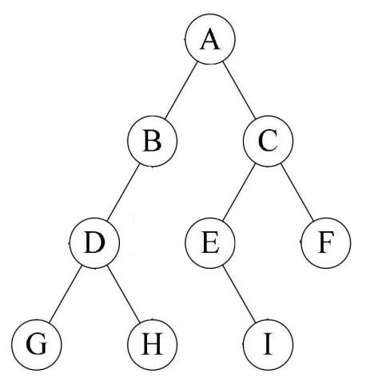
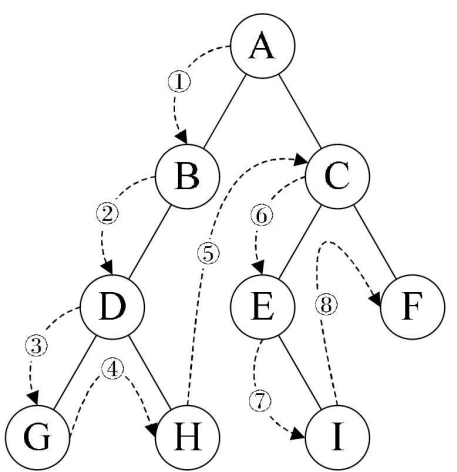
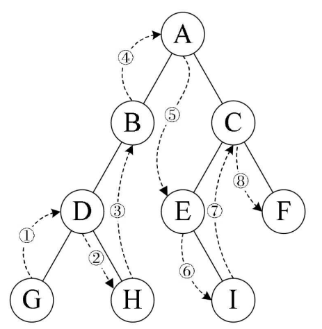
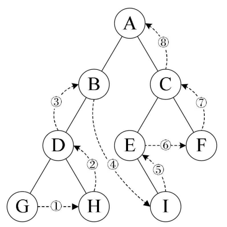
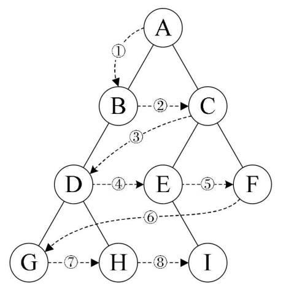
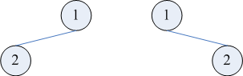
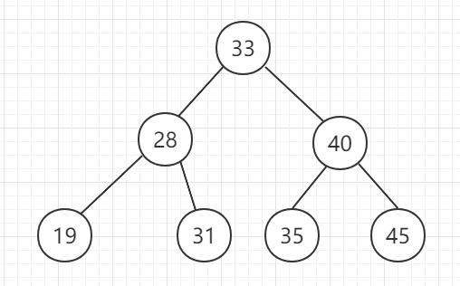

[toc]


&emsp;
&emsp;
# 1. 


&emsp;
&emsp; 
# 2. 二叉树
## 2.1 二叉树的遍历
### 2.1.1 有哪几种遍历算法？
① 前序遍历(先序遍历)
② 中序遍历
③ 后序遍历
④ 层序遍历

### 2.1.2 这些遍历算法中的 ”序” 指的是什么？
&emsp;&emsp; **序** 指的是 **根节点在何时被访问**，比如 中序遍历 就是 根节点在 中间 被访问。

### 2.1.3 这几种遍历算法的原理
#### (1) 原理
**① 前序遍历(先序遍历)**
> (1) 访问根节点
> (2) 先序遍历 左子树
> (3) 先序遍历 右子树
>
**② 中序遍历**
> (1) 中序遍历 左子树
> (2) 访问根节点
> (3) 中序遍历 右子树
> 
**③ 后序遍历**
> (1) 后序遍历 左子树
> (2) 后序遍历 右子树
> (3) 访问根节点
>
**④ 层序遍历**
> 
>
**需要注意的是，无论是先、中、后 序遍历，都是 先访问 左节点， 然后再访问 右节点。**
#### (2) 几个帮助理解实例(来自《大话数据结构》)
对于下面的二叉树，我们分别对其使用上述的四种遍历算法进行遍历：
<div align="center">  </div>

**① 前序遍历(先序遍历)**
遍历的顺序为： 
> ABDGH-CEIF
> 
<div align="center">  </div>
<center> <font color=black> <b> 图 前序遍历(先序遍历)</b> </font> </center>

**② 中序遍历**
遍历的顺序为：
> GDHBAE-ICF
> 
<div align="center">  </div>
<center> <font color=black> <b> 图 中序遍历</b> </font> </center>

**③ 后序遍历**
遍历的顺序为： 
> GHDBIEFCA
> 
<div align="center">  </div>
<center> <font color=black> <b> 图 后序遍历</b> </font> </center>

**④ 层序遍历**
遍历的顺序为： 
> ABCDEFGHI
> 
<div align="center">  </div>
<center> <font color=black> <b> 图 层序遍历</b> </font> </center>

### 2.1.4 遍历算法代码实现
#### (1) 递归实现
```cpp
// ① 前序遍历(先序遍历)

void preOrderTraversal(binTree* T){
	if(T != NULL){
		cout << t -> data << endl;      // 访问根节点
		preOrderTraversal(T -> lChild); // 递归遍历左子树
		preOrderTraversal(T -> rChild); // 递归遍历右子树
	}
}


// ② 中序遍历
void inOrderTraversal(binTree* T){
	if(T != NULL){
		inOrderTraversal(T -> lChild);
		cout << t -> data << endl;
		inOrderTraversal(T -> rChild);
	}
}


// ③ 后序遍历
void postOrderTraversal(binTree* T){
	if(T != NULL){
		postOrderTraversal(T -> lChild);
		postOrderTraversal(T -> rChild);
		cout << t -> data << endl;		
	}
}
```
#### (2) 非递归实现
**层次遍历** 
&emsp;&emsp; 要进行层次通历雷要借助1个队列，步骤如下：
思路:二叉树的层次遍历思路，借助队列来实现。相当于广度优先搜索，使用队列（深度优先搜索的话，使用栈）。
> ① 先将二叉树根结点入队，然后出队，访问该结点；
> ② 如果它有左子树，则将左子树根结点入队，如果它有右子树，则将右子树根结点入队。然后出队，对出队结点访问，如此反复，直到队列为空。 
> 
在LeetCode里面有层序遍历的习题： [二叉树的层序遍历](https://leetcode.cn/problems/binary-tree-level-order-traversal/)
```cpp
/**
 * Definition for a binary tree node.
 * struct TreeNode {
 *     int val;
 *     TreeNode *left;
 *     TreeNode *right;
 *     TreeNode() : val(0), left(nullptr), right(nullptr) {}
 *     TreeNode(int x) : val(x), left(nullptr), right(nullptr) {}
 *     TreeNode(int x, TreeNode *left, TreeNode *right) : val(x), left(left), right(right) {}
 * };
 */

// 层序遍历代码(不需要记录层次)
class Solution {
public:
    vector<int> levelOrder(TreeNode* root) {
        vector<int> vec_ret;
        if(root == NULL)
            return vec_ret;
        queue<TreeNode*> que; // 辅助队列
        que.push(root); // 进入循环前，先把根节点插入队列
        while(!que.empty()){
            TreeNode* node = que.front();
            que.pop();
            vec_ret.push_back(node->val);
            if(node->left != NULL)
                que.push(node->left);
            if(node->right != NULL)
                que.push(node->right);
        }
        return vec_ret;
    }
};


// 层序遍历代码(记录层次)
// 其实就是比上面的代码多了一个计数器来记录该层中有几个元素
class Solution {
public:
    vector<vector<int>> levelOrder(TreeNode* root) {
        vector<vector<int>> vec_ret;
        if(root == NULL)
            return vec_ret;
        queue<TreeNode*> que;
        que.push(root);
        while(!que.empty()){
			// curLevelSize用来记录当前层中有几个元素
            size_t curLevelSize = que.size(); 
            vec_ret.push_back(vector<int>());
			// 每次都遍历一层
            for(int i = 1; i <= curLevelSize; ++i){
                TreeNode* node = que.front();
                que.pop();
                vec_ret.back().push_back(node->val);
                if(node->left != NULL)
                    que.push(node->left);
                if(node->right != NULL)
                    que.push(node->right);
            }
        }
        return vec_ret;
    }
};
```

### 2.1.5 推导遍历结果
TODO:

## 2.2 重建二叉树
### 2.2.1 只知道一种遍历结果可以重建二叉树吗？
&emsp;&emsp; 如果遍历结果包含空指针，除了中序遍历外，根据其他三种遍历方式的遍历结果都可以重建二叉树。

### 2.2.2 使用两种遍历的结果 重建二叉树
#### (1) 是不是只要知道两种遍历结果（不含空指针），就一定可以 重建二叉树？
&emsp;&emsp; 不是，若只知道 先序遍历结果 + 后续遍历结果，不能重建二叉树，例如下面两棵树的先序遍历和后序遍历都是`12`：
<div align="center">  </div>

同时也可以发现，上图中两棵树的 层序遍历 也是 `12`。因此，依靠「层序 + 先序」或「层序 + 后序」两种遍历结果，也都不能重建二叉树。依靠「层序 + 中序」是可以重建的，


### 2.2.3 


## 二叉搜索树(BST, Binary Search Tree)
&emsp;&emsp; 二叉搜索树 也称为二叉查找树（Binary Search Tree）、有序二叉树（ordered binary tree）或排序二叉树（sorted binary tree），是指一棵空树或者具有下列性质的二叉树：
> ① 若任意节点的左子树不空，则左子树上所有节点的值均小于它的根节点的值；
> ② 若任意节点的右子树不空，则右子树上所有节点的值均大于它的根节点的值；
> ③ 任意节点的左、右子树也分别为二叉查找树；
> 
示例如下图：
<div align="center">  </div>


[数据结构和算法——二叉排序树](https://blog.csdn.net/google19890102/article/details/54378628)
