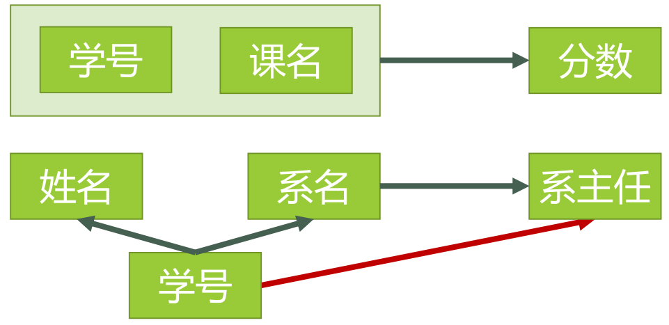
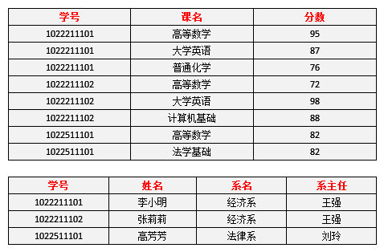
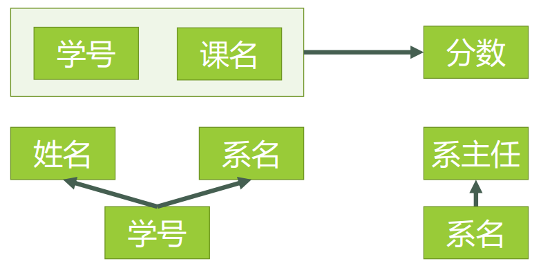
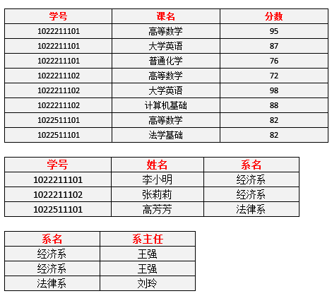

[toc]

&emsp;
&emsp; 
# 一、数据库基础概念
## 1. 什么是数据库？

## 2. 数据库可以分为哪几类？
&emsp;&emsp; 目前数据库主要分为传统的**关系型数据库（SQL）**和**非关系型数据库（NoSQL）**，当然还有近几年新出现的 NewSQL新型数据库 和 分布式数据库 等等。

## 3. 关系型数据库 VS 非关系型数据库
### 3.1 概念
&emsp;&emsp; **关系型数据库** 是指采用了关系模型来组织数据的数据库。简单来说，关系模式就是二维表格模型。主要代表：`Oracle`, `Mysql`, `SQL Server`, `PostgreSQL`
&emsp;&emsp; **非关系型数据库** 通常存储在 数据集 中，就像文档、键值对、列存储、图结构等，

### 3.2 各自的优缺点
#### 3.2.1 关系型数据库
##### 优点
（1）容易理解，二维表的结构非常贴近现实世界，二维表格，容易理解。

（2）使用方便，通用的sql语句使得操作关系型数据库非常方便。

（3）易于维护，数据库的ACID属性，大大降低了数据冗余和数据不一致的概率。
##### 缺点
(1) 海量数据的读写效率。
> &emsp;&emsp; 对于网站的并发量高，往往达到每秒上万次的请求，对于传统关系型数据库来说，硬盘I/o是一个很大的挑战。
> 
(2) 高扩展性和可用性。
> &emsp;&emsp; 在基于web的结构中，数据库是最难以横向拓展的，当一个应用系统的用户量和访问量与日俱增的时候，数据库没有办法像web Server那样简单的通过添加更多的硬件和服务节点来拓展性能和负载能力。
> 

#### 3.2.2 非关系型数据库

### 3.3 两者在各个方面的对比

&emsp;
&emsp; 
# 二、数据类型
## 1. 常见数据类型在MySQL与Oracle数据库中的表现形式
#### (1) 变长字符串
MySQL 
> `VARCHAR(len)`(`len`的大小为`0-65535`，单位为字节)
> 
Oracle 
> `VARCHAR2(len)`(`len`的大小为`1-4000`，单位为字节)
> 
#### (2) 定长字符串
MySQL 
> CHAR(0-255)，定义长度默认按字符长度计算，最大保存255字符
> 
Oracle 
> CHAR(1-2000),定义默认按字节长度计算
> 
#### () 
MySQL 
> 
> 
Oracle 
> 
> 
#### () 
MySQL 
> 
> 
Oracle 
> 
> 
#### () 
MySQL 
> 
> 
Oracle 
> 
> 
#### () 
MySQL 
> 
> 
Oracle 
> 
> 
#### () 
MySQL 
> 
> 
Oracle 
> 
> 

&emsp;
&emsp; 
# 三、索引(Index)
## 1. 索引的作用

## 2. Mysql主要的几种索引类型
### 2.1 汇总
&emsp;&emsp; 索引从不同维度划分可以有很多种名称，但是需要明确一个问题 —— 索引的本质是一种数据结构，除此之外的其他索引的划分则是针对实际应用而言。
| 分类方式 | 分类结果                                  |
| -------- | ----------------------------------------- |
| 字段个数 | 单列索引、联合索引（复合索引、组合索引）  |
| 字段特性 | 主键索引、唯一索引、普通索引 和 前缀索引  |
| 物理存储 | 聚簇索引、二级索引（辅助索引）            |
| 数据结构 | `B+tree`索引、`Hash`索引、`Full-text`索引 |

### 2.2 按字段个数分类
&emsp; 为了能应对不同的数据检索需求，索引既可以仅包含一个字段，也可以同时包含多个字段：
> &emsp;&emsp; 单个字段组成的索引可以称为**单值索引**
> &emsp;&emsp; 建立在多个列上的索引被称为 **复合索引**(组合索引或多值索引)。
> 

### 2.3 按字段特性分类
&emsp;&emsp; MySQL索引按字段特性分类可分为：主键索引、唯一索引、普通索引 和 前缀索引：
> &emsp;&emsp; 主键索引 : 建立在主键上的索引被称为主键索引，一张数据表只能有一个主键索引，索引列值不允许有空值，通常在创建表时一起创建。
> &emsp;&emsp; 唯一索引 : 建立在`UNIQUE`字段上的索引被称为唯一索引，一张表可以有多个唯一索引，索引列值允许为空，列值中出现多个空值不会发生重复冲突。
> &emsp;&emsp; 普通索引 : 建立在普通字段上的索引被称为普通索引。
> &emsp;&emsp; 前缀索引 : 前缀索引是指对字符类型字段的前几个字符或对二进制类型字段的前几个bytes建立的索引，而不是在整个字段上建索引。前缀索引可以建立在类型为`char`、`varchar`、`binary`、`varbinary`的列上，可以大大减少索引占用的存储空间，也能提升索引的查询效率。
> 

### 2.4 按物理存储分类
&emsp; 根据数据与索引的存储关联性，可以分为 聚簇索引和非聚簇索引（也叫聚集索引和非聚集索引）：
> &emsp;&emsp; 聚簇索引也叫簇类索引，是一种对磁盘上实际数据重新组织以按指定的一个或多个列的值排序。整个简洁的说法，这俩的区别就是索引的存储顺序和数据的存储顺序是否是关系的，有关就是聚簇索引，无关就是非聚簇索引。具体实现方式根据索引的数据结构不同会有所不同。
> 
&emsp;&emsp; 很简单记住一句话：找到了索引就找到了需要的数据，那么这个索引就是聚簇索引，所以主键就是聚簇索引，修改聚簇索引其实就是修改主键。
&emsp;&emsp; 索引的存储和数据的存储是分离的，也就是说找到了索引但没找到数据，需要根据索引上的值(主键)再次回表查询,非聚簇索引也叫做辅助索引。

## 3. 聚簇索引和非聚簇索引
### 3.1 什么是聚簇索引？
&emsp; 记住一句话：
> &emsp;&emsp; 如果找到了索引就找到了需要的数据，那么这个索引就是 **聚簇索引(clustered index)**
> 
所以主键就是聚簇索引，修改聚簇索引其实就是修改主键。
clustered index（MySQL官方对聚簇索引的解释）
> **The InnoDB term for a primary key index**. InnoDB table storage is organized based on the values of the primary key columns, to speed up queries and sorts involving the primary key columns. For best performance, choose the primary key columns carefully based on the most performance-critical queries. Because modifying the columns of the clustered index is an expensive operation, choose primary columns that are rarely or never updated.
> 
注意标黑的那段话，聚簇索引就是主键的一种术语

### 3.2 主键和聚簇索引
&emsp;&emsp; 一个表中只能拥有一个聚集索引。
&emsp;&emsp; `SQL Sever`默认主键为聚集索引，也可以指定为非聚集索引，而`MySQL`里主键就是聚集索引
&emsp;&emsp; **Oracle没有聚簇索引的概念，有一个索引组织表,类似但不一样**

### 3.3 什么是非聚簇索引？
&emsp;&emsp; 索引的存储和数据的存储是分离的，也就是说 找到了索引但没找到数据，需要根据索引上的值(主键)再次回表查询，非聚簇索引也叫做辅助索引。

&emsp;&emsp;  [彻底明白MySQL聚簇索引和非聚簇索引](https://zhuanlan.zhihu.com/p/142139541)

## 4. B+tree索引、Hash索引 和 Full-text索引
### 4.1 B+tree索引
#### 4.1.1 在MySQL中为什么会选用B+tree做索引结构呢？
B+tree 是在B树基础上的一种优化，其更适合做存储索引结构。在 B+tree 中，非叶子节点上仅存储键值，不存储数据；而所有数据记录均存储在叶子节点上，并且数据是按照顺序排列的。此外在 B+tree 中各个数据页之间是通过双向链表连接的，叶子节点中的数据是通过单向链表连接的。B+tree 的结构图如下：

### 4.2 Hash索引

### 4.3 Full-text索引

### 4.4 默认是的数据结构是？

## 3. Oracle 和 Mysql 的索引有何区别？

https://zhuanlan.zhihu.com/p/366972218

&emsp;
&emsp; 

---

&emsp;
&emsp; 

# 四、数据库设计
## 1. 范式(Normal Form)
### 1.1 如何理解范式？
下面是 知乎用户[刘慰](https://www.zhihu.com/people/ningboliuwei)的[回答](https://www.zhihu.com/question/24696366):
> &emsp;&emsp; 首先要明白”范式（NF）”是什么意思。按照教材中的定义，范式是“符合某一种级别的关系模式的集合，表示一个关系内部各属性之间的联系的合理化程度”。很晦涩吧？实际上你可以把它粗略地理解为一张数据表的表结构所符合的某种设计标准的级别。就像家里装修买建材，最环保的是`E0`级，其次是`E1`级，还有`E2`级等等。数据库范式也分为`1NF，2NF，3NF，BCNF，4NF，5NF`。一般在我们设计关系型数据库的时候，最多考虑到`BCNF`就够。符合高一级范式的设计，必定符合低一级范式，例如符合`2NF`的关系模式，必定符合`1NF`。
> 

### 1.2 关系型数据库现在有哪几个范式？
目前关系数据库有六种范式：
> &emsp;&emsp; ① 第一范式（1NF）
> &emsp;&emsp; ② 第二范式（2NF）
> &emsp;&emsp; ③ 第三范式（3NF）
> &emsp;&emsp; ④ 巴斯-科德范式（BCNF）
> &emsp;&emsp; ⑤ 第四范式(4NF）
> &emsp;&emsp; ⑥ 第五范式（5NF，又称完美范式）
> 
一般说来，数据库只需满足第三范式就行了

### 1.3 为什么需要范式
那么范式的提出是为了解决下面的问题：
> &emsp;&emsp; ① 第一范式，要求将列尽可能最小的分割，希望消除某个列存储多个值的冗余的行为，比如用户表中的地址信息，拆分为省、市这种明确的字段，可以按独立的字段检索、查询
> &emsp;&emsp; ② 第二范式，要求唯一的主键，且不存在对主键的部分依赖，希望消除表中存在冗余(多余)的列，比如订单表中的商品分类、详情信息，只需要由商品信息表存储一份即可。
> &emsp;&emsp; ③ 第三范式，要求没有间接依赖于主键的列，即仍然是希望消除表中冗余的列，比如用户表中不需要存储额外的 其所在城市的人口、城市特点等信息。
> 
很明显，这些范式大都是为了消除冗余而提出的，即尽可能的减少存储成本。

&emsp;
## 2. 三范式的基本定义
**第一范式**
> &emsp; 强调的是列的原子性，列不能分成其他几列，第一范式就是无重复的域。
> 
**第二范式**
> &emsp; 首先是在第一范式的基础上，另外包含两部分的内容：
> &emsp;&emsp; ① 表必须有主键；
> &emsp;&emsp; ② 没有包含在主键中的列必须完全依赖于主键，而不能只依赖于主键的一部分。
> 
**第三范式**
> &emsp; 在第二范式的基础之上，非主键列必须直接依赖于主键不能存在传递依赖。
> 
第二范式（2NF）和第三范式（3NF）的概念很容易混淆，区分它们的关键点在于：
> 2NF：非主键列是否完全依赖于主键，还是依赖于主键的一部分；
> 3NF：非主键列是直接依赖于 ----------主键，还是直接依赖于 非主键列。
> 

&emsp;
## 3. 第一范式（1NF）
### 3.1 定义
第一范式（1NF）:**列不可再分**
> &emsp;&emsp; ① 每一列属性都是不可再分的属性值，确保每一列的原子性；
> &emsp;&emsp; ② 两列的属性相近或相似或一样，尽量合并属性一样的列，确保不产生冗余数据
> 

### 3.2 1NF 的意义
&emsp;&emsp; 在任何一个关系数据库中，第一范式（1NF）是对关系模式的基本要求，不满足第一范式（1NF）的数据库就不是关系数据库。

### 3.3 实例解析1NF
下表所示的情况，就不符合1NF的要求：

  

  <b> 表1 </b>  

我们需要将其改为下面这种格式：

  

  <b> 表2 </b>  

### 3.4 MySQL（或Oracle）中有不符合 1NF的表吗？
&emsp;&emsp; 只要在RDBMS(关系数据)中已经存在的数据表，一定是符合1NF的，因此只要能在MySQL（或Oracle）中建表成功，那就肯定符合 `1NF`。

## 4. 第二范式（2NF）
### 4.1 定义
第二范式（2NF）： 属性完全依赖于主键
> &emsp; ① 第二范式（2NF）是在第一范式（1NF）的基础上建立起来的，即满足第二范式（2NF）必须先满足第一范式（1NF）。
> &emsp; ② 第二范式（2NF）要求数据库表中的每个实例或行必须可以被惟一地区分。为实现区分通常需要为表加上一个列，以存储各个实例的惟一标识。这个惟一属性列被称为主键
> &emsp; ② 每一行的数据只能与其中一列相关，即一行数据只做一件事，只要数据列中出现重复的数据，那么就要把表拆分开来。
> 

### 4.2 为何需要2NF
&emsp;&emsp; 但是仅仅符合`1NF`的设计，仍然会存在数据冗余过大，插入异常，删除异常，修改异常的问题，例如对于下表中的设计：

  

  <b> 表3 </b>  

上表存在下面几个问题：
> &emsp; ① 每一名学生的学号、姓名、系名、系主任这些数据重复多次。每个系与对应的系主任的数据也重复多次——数据冗余过大 
> &emsp; ② 假如学校新建了一个系，但是暂时还没有招收任何学生（比如3月份就新建了，但要等到8月份才招生），那么是无法将系名与系主任的数据单独地添加到数据表中去的 （注１）——插入异常
> > &emsp;&emsp; 注１：根据三种关系完整性约束中实体完整性的要求，关系中的码（注２）所包含的任意一个属性都不能为空，所有属性的组合也不能重复。为了满足此要求，图中的表，只能将学号与课名的组合作为码，否则就无法唯一地区分每一条记录。
> > &emsp;&emsp; 注２：码：关系中的某个属性或者某几个属性的组合，用于区分每个元组（可以把“元组”理解为一张表中的每条记录，也就是每一行）。
> >
> &emsp; ③ 假如将某个系中所有学生相关的记录都删除，那么所有系与系主任的数据也就随之消失了（一个系所有学生都没有了，并不表示这个系就没有了）。——删除异常
> &emsp; ④ 假如李小明转系到法律系，那么为了保证数据库中数据的一致性，需要修改三条记录中系与系主任的数据。——修改异常。
> 
对表3进行模式分解以后的新的函数依赖关系：

  

  

  <b> 表4 </b>  

现在我们来看一下，进行同样的操作，是否还存在着之前的那些问题？
① 李小明转系到法律系
> 只需要修改一次李小明对应的系的值即可。——有改进
> 
② 数据冗余是否减少了？
> 学生的姓名、系名与系主任，不再像之前一样重复那么多次了。——有改进
> 
③ 删除某个系中所有的学生记录
> 该系的信息仍然全部丢失。——无改进
> 
④ 插入一个尚无学生的新系的信息。
> 因为学生表的码是学号，不能为空，所以此操作不被允许。——无改进
> 
所以说，仅仅符合2NF的要求，很多情况下还是不够的，而出现问题的原因，在于仍然存在非主属性系主任对于码学号的传递函数依赖。为了能进一步解决这些问题，我们还需要将符合2NF要求的数据表改进为符合3NF的要求。

&emsp;
## 5. 第三范式（3NF）
### 5.1 

### 5.2 为何需要2NF
可以将新的函数依赖关系如图所示：

  

新的数据表如表5所示：

  

  <b> 表5 </b>  

现在我们再来看一下，进行同样的操作，是否还存在着之前的那些问题？

① 删除某个系中所有的学生记录
> 该系的信息不会丢失。——有改进
> 
② 插入一个尚无学生的新系的信息。
> 因为系表与学生表目前是独立的两张表，所以不影响。——有改进
> 
③ 数据冗余更加少了。——有改进

&emsp;
&emsp; 
# 数据库事务

&emsp;
&emsp; 
# 引擎

# 约束(Constraint) 
## 数据库中的常见约束类型
一般分为五大约束：
**① 主键约束(Primary Key constraint)**：要求主键列数据唯一，不允许为空。
**② 唯一约束(Unique constraint)**：要求该列唯一，允许为空，但只能出现一个空值。
**③ 检查约束(Check constraint)**：某列取值范围限制，格式限制等，如有关年龄的约束。
**④ 默认约束(Default constraint)**：某列的默认值，如在数据库里有一项数据很多重复，可以设为默认值。
**⑤ 外键约束(Foreign Key constraint)**：用于在两个表之间建立关系，需要指定引用主表的哪一列。

## 外键约束(Foreign Key constraint)
### 主表和从表
以另一个关系的外键作主关键字的表被称为主表，具有此外键的表被称为主表的从表。
### 外键的要求
表的外键必须是另一个的主键
### 外键的作用
保持数据一致性，完整性，主要目的是控制存储在外键表中的数据。 
### 外键的弊端
&emsp;&emsp; 外键有着 维护困难 和 降低数据库性能的 弊端。
&emsp;&emsp; 对于外键的使用，阿里甚至在他们的MySQL规范中严禁使用外键。但具体是否应该使用外键，还是根据需求来决定。
