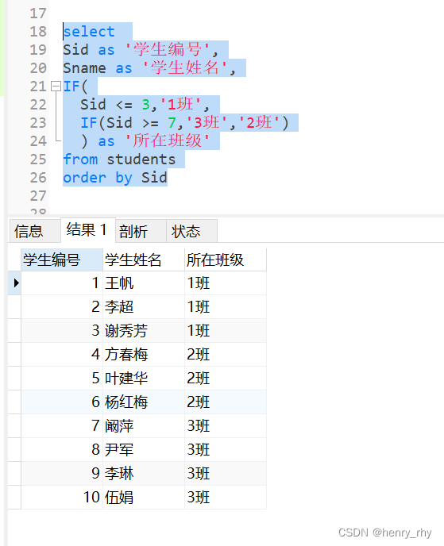
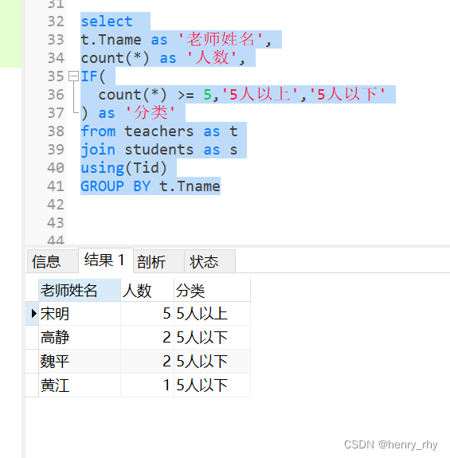
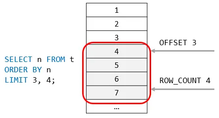

[toc]


&emsp;
&emsp;
&emsp;
# 1. 函数
## 1.1 聚合(Aggregate)函数和标量(Scalar) 函数
### 1.1.1 有哪些聚合函数？
| 函数名    | 作用                 |
| --------- | -------------------- |
| `AVG()`   | 返回平均值           |
| `COUNT()` | 返回行数             |
| `FIRST()` | 返回第一个记录的值   |
| `LAST()`  | 返回最后一个记录的值 |
| `MAX()`   | 返回最大值           |
| `MIN()`   | 返回最小值           |
| `SUM()`   | 返回总和             |

### 1.1.2 有哪些标量函数？
Scalar函数基于输入值，返回一个单一的值：
| 函数名        | 作用                                              |
| ------------- | ------------------------------------------------- |
| `UCASE()`     | 将某个字段转换为大写                              |
| `LCASE()`     | 将某个字段转换为小写                              |
| `MID()`       | 从某个文本字段提取字符，MySql 中使用              |
| `SubString()` | `SubString(字段，1，end)`，从某个文本字段提取字符 |
| `LEN()`       | 返回某个文本字段的长度                            |
| `ROUND()`     | 对某个数值字段进行指定小数位数的四舍五入          |
| `NOW()`       | 返回当前的系统日期和时间                          |
| `FORMAT()`    | 格式化某个字段的显示方式                          |

&emsp;
## 1.2 `MAX()` 函数
### 1.2.1 作用
&emsp;&emsp; `MAX()`函数返回指定列的最大值。

### 1.2.2 `MAX()` 语法
```sql
SELECT MAX(column_name) FROM table_name;
```

### 1.2.3 实例
#### (1) 数据和要求
某`user_profile`表如下:
| id  | device_id | gender | age  | university | gpa |
| --- | --------- | ------ | ---- | ---------- | --- |
| 1   | 2234      | male   | 21   | 北京大学   | 3.2 |
| 2   | 2235      | male   | NULL | 复旦大学   | 3.8 |
| 3   | 2236      | female | 20   | 复旦大学   | 3.5 |
| 4   | 2237      | female | 23   | 浙江大学   | 3.3 |
| 5   | 2238      | male   | 25   | 复旦大学   | 3.1 |
| 6   | 2239      | male   | 25   | 北京大学   | 3.6 |
| 7   | 2240      | male   | NULL | 清华大学   | 3.3 |
| 8   | 2241      | female | NULL | 北京大学   | 3.7 |
运营想要知道复旦大学学生gpa最高值是多少，请你取出相应数据，根据输入，你的查询应返回以下结果，结果保留到小数点后面1位(1位之后的四舍五入):
| gpa |
| --- |
| 3.8 |

#### (2) 解答
```sql
select max(gpa)  from user_profile where university = '复旦大学';
```
另外，这个用`limit`子句也能做到。

&emsp;
## 1.3 `avg()` 函数
### 1.3.1 作用
&emsp;&emsp; `AVG()` 函数返回数值列的平均值。

### 1.3.2 AVG() 语法
```sql
SELECT AVG(column_name) FROM table_name;
```

### 1.3.3 AVG()使用实例
#### 数据和要求
&emsp;&emsp; `user_profile`表同`MAX()`函数给出的数据。
&emsp;&emsp; 现在运营想要看一下男性用户有多少人以及他们的平均gpa是多少，用以辅助设计相关活动，请你取出相应数据。
```sql
select 
    count(*) as male_num, 
    avg(gpa) as avg_gpa 
from 
    user_profile 
where 
    gender='male';
```

&emsp;
## 1.4 空值替换函数
在`MySQL`中是`IFNULL`：
```sql
IFNULL(expression, alt_value)
```
如果第一个参数的表达式 `expression` 为 `NULL`，则返回第二个参数的备用值。
在`Oracle`中则为：`NVL`
```sql
NVL(expression, alt_value)
```

&emsp;
## 1.5 条件函数
### 1.5.1 基本语法
```sql
IF(exp, val1, val12)
```
> 如果`exp`为`True`，返回值`val1`；若为`False`，返回值`val2`。
> 

### 1.5.2 如果要用`if`进行多个分类，应该怎么做？
&emsp; 当分类大于两种或者以上时，就可以使用`IF`函数嵌套。例如：
> &emsp;&emsp; 在学生表中，将学生编号小于等于`3`的学生，分为`1`班，学生编号在`4-6`的学生，分为`2`班，学生编号大于等于`7`的学生，分为`3`班，最后显示`Sid`,`Sname`,所在班级这三列。
> 
使用嵌套的`IF`，我们可以这么写：
```sql
select 
    Sid as '学生编号',
    Sname as '学生姓名',
    IF(
        Sid <= 3,'1班',
        IF(Sid >= 7,'3班','2班')
        ) as '所在班级'
from 
    students
order by Sid;
```
执行结果如下：
<div align="center">  </div>
<center> <font color=black> <b> 示例结果 </b> </font> </center>

### 1.5.3 `IF` + 聚合函数
IF 还经常与聚合函数一起结合使用
实例3：将学生表和教师结合使用，计算班主任所带的学生数量，大于等于5人以上的显示：5人以上，人数小于5人的显示：5人以下。
```sql
select 
    t.Tname as '老师姓名',
    count(*) as '人数',
    IF(
        count(*) >= 5,'5人以上','5人以下'
    ) as '分类'
from 
    teachers as t
join 
    students as s
on 
    Tid
GROUP BY 
    t.Tname;
```
<div align="center">  </div>

### 1.5.4 牛客实例： SQL26 计算25岁以上和以下的用户数量
#### 题目
[SQL26 计算25岁以上和以下的用户数量](https://www.nowcoder.com/practice/30f9f470390a4a8a8dd3b8e1f8c7a9fa?tpId=199&tags=&title=&difficulty=0&judgeStatus=0&rp=0&sourceUrl=%2Fexam%2Foj%3Fpage%3D1%26tab%3DSQL%25E7%25AF%2587%26topicId%3D199)

#### 解答
```sql
select 
    if(age >= 25, "25岁及以上", "25岁以下") as age_cut,
    count(*)
from 
    user_profile
group by
    age_cut;
```

### 1.5.5 牛客实例：SQL27 查看不同年龄段的用户明细
#### 题目
[SQL27 查看不同年龄段的用户明细](https://www.nowcoder.com/practice/ae44b2b78525417b8b2fc2075b557592?tpId=199&tags=&title=&difficulty=0&judgeStatus=0&rp=0&sourceUrl=%2Fexam%2Foj%3Fpage%3D1%26tab%3DSQL%25E7%25AF%2587%26topicId%3D199)

#### 解答
```sql
select
    device_id,
    gender,
    if(
        age > 19 and age < 25, "20-24岁", 
            if(age > 24, "25岁及以上", "其他")
    ) as age_cut
from user_profile;
```

&emsp;
## 1.6 `case`函数
### 1.6.1 

&emsp;
## 1.7 文本(字符串)函数
### 1.7.1 mysql主要有哪些字符串函数？语法是怎样的？
MySQL字符串截取函数主要有四种：
> ① `left()`, 
> ② `right()`, 
> ③ `substring()`, 
> ④ `substring_index()`, 
> 

### 1.7.2 这些字符串函数的语法是怎样的？
(1) **`left()`**
&emsp; `LEFT(s,n)`返回字符串 `s` 的前 `n` 个字符	
```sql
-- 返回字符串 runoob 中的前两个字符：
SELECT LEFT('runoob', 2) -- ru
```
(2) **`right()`** 
&emsp; `RIGHT(s,n)`返回字符串`s`的后 `n`个字符，例如：
```sql
-- 返回字符串 runoob 的后两个字符：
SELECT RIGHT('runoob', 2) -- ob
```
(3) **substring**
&emsp; `SUBSTRING(s, start, length)`从字符串 `s` 的 `start` 位置截取长度为 `length` 的子字符串，等同于 `SUBSTR(s, start, length)`。
&emsp; 另外，**目标字符串`s`是从`1`开始计数的**，例如：
```sql
-- 从字符串 RUNOOB 中的第 2 个位置截取 3个 字符：
SELECT SUBSTRING("RUNOOB", 2, 3) AS ExtractString; -- UNO
```
**(4) `SUBSTRING_INDEX()`**
&emsp; `SUBSTRING_INDEX(s, delimiter, number)`	返回从字符串 `s` 的第 `number` 个出现的分隔符 `delimiter` 之后的子串。
> 如果 `number` 是正数，返回第 `number` 个字符左边的字符串。
> 如果 `number` 是负数，返回第(`number` 的绝对值(从右边数))个字符右边的字符串。
> 
```sql
SELECT SUBSTRING_INDEX('a*b','*',1) -- a
SELECT SUBSTRING_INDEX('a*b','*',-1)    -- b
SELECT SUBSTRING_INDEX(SUBSTRING_INDEX('a*b*c*d*e','*',3),'*',-1)    -- c
```
注意，`string`是从`1`开始算的
**(5) 拼接字符串**
`CONCAT(string1,string2, ... );`
> concatenate
> &emsp; v. 连接;使连续（衔接）起来;连锁;串级
> &emsp; adj. 连在一起的;连锁的
> 
[SQL81 顾客登录名](https://www.nowcoder.com/practice/7cbf5e3082954c21a80fc750ce97350f?tpId=298&tags=&title=&difficulty=0&judgeStatus=0&rp=0&sourceUrl=%2Fexam%2Foj%3Fpage%3D1%26tab%3DSQL%25E7%25AF%2587%26topicId%3D199)
### 1.7.3 SQL28 计算用户8月每天的练题数量
#### (1) 题目
[SQL28 计算用户8月每天的练题数量](https://www.nowcoder.com/practice/847373e2fe8d47b4a2c294bdb5bda8b6?tpId=199&tags=&title=&difficulty=0&judgeStatus=0&rp=0&sourceUrl=%2Fexam%2Foj%3Fpage%3D1%26tab%3DSQL%25E7%25AF%2587%26topicId%3D199)

#### (2) 解答
**第一次解答：**
```sql
select
  SUBSTRING(date, 9, 2) as day,
  count(*) as question_cnt 
from
  question_practice_detail 
group by
  date #
having
  SUBSTRING(date, 6, 2) = 08
```
**其他人的题解：**
> 他用的是`day()`和`month`函数，这比处理字符串要容易一些：
> 
```sql
Select
  day(date) as day,
  count(question_id) as question_cnt
From
  question_practice_detail
Where
  year(date) = 2021
  and month(date) = 08
Group by
  day;
```

### 1.7.4
#### (1) 题目

#### (2) 解答
```sql

```

### 1.7.5 SQL32 截取出年龄
#### (1) 题目
[SQL32 截取出年龄](https://www.nowcoder.com/practice/b8d8a87fe1fc415c96f355dc62bdd12f?tpId=199&tqId=1975684&ru=/exam/oj&qru=/ta/sql-quick-study/question-ranking&sourceUrl=%2Fexam%2Foj%3Fpage%3D1%26tab%3DSQL%25E7%25AF%2587%26topicId%3D199)
#### (2) 解答
这题需要用 嵌套的`substring_index()`函数：
```sql
select 
    substring_index(substring_index(profile,',', '3'), ',', -1) as age,
    count(device_id) as number
from 
    user_submit
group by
    age;
```

&emsp;
## 1.8 窗口函数 
### 1.8.1 什么是 窗口函数？
&emsp;&emsp; 窗口函数也称为`OLAP（Online Analytical Processing）`函数，意思是对数据库数据进行实时分析处理，窗口函数在`Oracle`和`SQL Server` 中也被称为 分析函数，

### 1.8.2 有哪些窗口函数？


&emsp;
&emsp;
&emsp;
# 2. `GROUP BY` 语句
## 2.1 `GROUP BY` 的作用
&emsp;&emsp; `GROUP BY`一般用于分组统计，它表达的逻辑就是根据一定的规则，进行分组，它可结合一些聚合函数来使用。

## 2.2 `GROUP BY` 语法
### 2.2.1 基本语法
```sql
SELECT column_name, aggregate_function(column_name)
FROM table_name
WHERE column_name operator value
GROUP BY column_name;
```
### 2.2.2 `GROUP BY` 多个字段
```sql
select
    t1.university,
    t3.difficult_level,
    count(university)/count(distinct t2.device_id) as avg_answer_cnt
from 
    user_profile t1
join 
    question_practice_detail t2 
on 
    t1.device_id = t2.device_id
join
    question_detail t3
on 
    t2.question_id = t3.question_id
group by
    t1.university, t3.difficult_level; -- group by 多个字段
```

## 2.3 原理
下面这个文章讲的不错：
> &emsp;&emsp; [group by 详解](https://zhuanlan.zhihu.com/p/460005395)
> 

## 2.4 GROUP BY 引发的报错
### 2.4.1
报错信息：
```
SQL_ERROR_INFO: "Expression #1 of SELECT list is not in GROUP BY clause and contains 
nonaggregated column 't1.university' which is not functionally dependent on columns in GROUP 
BY clause; this is incompatible with sql_mode=only_full_group_by"
```
报错原因：
> ONLY_FULL_GROUP_BY ： 对于`GROUP BY`聚合操作，如果在`SELECT`中的列，没有在`GROUP BY`中出现，那么这个SQL是不合法的，因为列不在`GROUP BY`从句中。
> 

## 2.5 实例
### 2.5.1 数据
下面是选自 `Websites` 表的数据：
```sql
mysql> SELECT * FROM Websites;

+----+---------------+---------------------------+-------+---------+
| id | name          | url                       | alexa | country |
+----+---------------+---------------------------+-------+---------+
| 1  | Google        | https://www.google.cm/    | 1     | USA     |
| 2  | 淘宝          | https://www.taobao.com/   | 13    | CN      |
| 3  | 菜鸟教程      | http://www.runoob.com/    | 4689  | CN      |
| 4  | 微博          | http://weibo.com/         | 20    | CN      |
| 5  | Facebook      | https://www.facebook.com/ | 3     | USA     |
| 7  | stackoverflow | http://stackoverflow.com/ |   0   | IND     |
+----+---------------+---------------------------+-------+---------+
```
下面是`access_log` 网站访问记录表的数据：
```sql
mysql> SELECT * FROM access_log;

+-----+---------+-------+------------+
| aid | site_id | count | date       |
+-----+---------+-------+------------+
|   1 |       1 |    45 | 2016-05-10 |
|   2 |       3 |   100 | 2016-05-13 |
|   3 |       1 |   230 | 2016-05-14 |
|   4 |       2 |    10 | 2016-05-14 |
|   5 |       5 |   205 | 2016-05-14 |
|   6 |       4 |    13 | 2016-05-15 |
|   7 |       3 |   220 | 2016-05-15 |
|   8 |       5 |   545 | 2016-05-16 |
|   9 |       3 |   201 | 2016-05-17 |
+-----+---------+-------+------------+
```

### 2.5.2 `GROUP BY`简单应用: 统计 `access_log` 各个 `site_id` 的访问量：
```sql
mysql> SELECT site_id, SUM(access_log.count) AS nums
        FROM access_log GROUP BY site_id;

+---------+------+
| site_id | nums |
+---------+------+
|       1 |  275 |
|       2 |   10 |
|       3 |  521 |
|       4 |   13 |
|       5 |  750 |
+---------+------+
```

### 2.5.3 `GROUP BY`多表连接: 统计有记录的网站的记录数量
```sql
mysql> SELECT Websites.name,COUNT(access_log.aid) AS nums FROM access_log
        LEFT JOIN Websites
        ON access_log.site_id=Websites.id
        GROUP BY Websites.name;

+----------+------+
| name     | nums |
+----------+------+
| Facebook |   2  |
| Google   |   2  |
| 微博     |   1  |
| 淘宝     |   1  |
| 菜鸟教程 |   3  |
```

## 2.6 牛客网的`GROUP BY`练习题
### 2.6.1 SQL18
#### (1) 题目
[SQL18 分组计算练习题](https://www.nowcoder.com/practice/009d8067d2df47fea429afe2e7b9de45?tpId=199&tags=&title=&difficulty=0&judgeStatus=0&rp=0&sourceUrl=%2Fexam%2Foj%3Fpage%3D1%26tab%3DSQL%25E7%25AF%2587%26topicId%3D199)
#### (2) 解答
```sql
-- SQL18 分组计算练习题

select 
    gender, 
    university, 
    count(id) as user_num, -- 注意用的是 count()函数
    avg(active_days_within_30), 
    avg(question_cnt)
from user_profile
group by gender, university;
```

### 2.6.2 SQL19 
#### (1) 题目
[SQL19 分组过滤练习题](https://www.nowcoder.com/practice/ddbcedcd9600403296038ee44a172f2d?tpId=199&tags=&title=&difficulty=0&judgeStatus=0&rp=0&sourceUrl=%2Fexam%2Foj%3Fpage%3D1%26tab%3DSQL%25E7%25AF%2587%26topicId%3D199)

#### (2) 解答
```sql
-- SQL19 分组过滤练习题

select
    university,
    avg(question_cnt) as avg_question_cnt,
    avg(answer_cnt) as avg_answer_cnt
from
    user_profile
group by
    university
having -- 注意，此处不能用where，因为 where不能和聚合函数一起使用。
    avg_question_cnt < 5 or avg_answer_cnt < 20;
```

### 2.6.3 SQL20 
#### (1) 题目
[]()
#### (2) 解答
```sql
-- SQL19 分组过滤练习题

select
    university,
    avg(question_cnt) as avg_question_cnt
from
    user_profile
group by
    university
order by
    avg_question_cnt;
```


&emsp;
&emsp;
&emsp;
# 3. `HAVING` 子句
## `HAVING` 子句 的作用
在 SQL 中增加 `HAVING` 子句原因是: 
> &emsp;&emsp; `WHERE` 关键字无法与聚合函数一起使用。
> 
通过`HAVING`子句，我们可以 筛选 分组后的 各组数据。

## `HAVING`子句 和 `WHERE`关键字 的区别
`WHERE` 和`HAVING`之后都是筛选条件，但是有区别的：
> &emsp;&emsp; ① 语法上有个执行先后的差别: 先执行`where`，然后是`group by`， 最后是`having`；
> &emsp;&emsp; ② 功能上有个筛选的区别，`where`只能筛选记录行，不能筛选聚合后的记录行，`having`主要用来筛选分组聚合后的结果集。
> &emsp;&emsp; ③ `having`可以和`count、sum、avg、max、min`等聚合函数一起使用，而`where`则不能，否则会报错。
> 

## 
见本文的 SQL19


&emsp;
&emsp;
&emsp;
# 4. `LIMIT`子句
## `LIMIT`子句的作用

## `LIMIT`子句的语法
```sql
SELECT select_list
    FROM table_name 
        LIMIT [offset,] row_count; 
```
参数解析：
> `offset` ： 可选参数，指定的第一行的偏移量。在`offse`t第一行的是`0`，而不是`1` 
> `row_count` : 指定的返回最大行数 
> 
举个例子：
```sql
-- 返回计算结果中的前x行数据。
LIMIT x

-- 返回计算结果中从y行开始的x行数据。
LIMIT y, x
```
<div align="center">  </div>
<center> <font color=black> <b> LIMIT子句 </b> </font> </center>

## 实例
### 题目
描述
> &emsp;&emsp; 题目：现在运营只需要查看前2个用户明细设备ID数据，请你从用户信息表 user_profile 中取出相应结果。
> 
示例：
| id  | device_id | gender | age | university | province |
| --- | --------- | ------ | --- | ---------- | -------- |
| 1   | 2138      | male   | 21  | 北京大学   | Beijing  |
| 2   | 3214      | male   |     | 复旦大学   | Shanghai |
| 3   | 6543      | female | 20  | 北京大学   | Beijing  |
| 4   | 2315      | female | 23  | 浙江大学   | ZheJiang |
| 5   | 5432      | male   | 25  | 山东大学   | Shandong |
根据输入，你的查询应返回以下结果：

| device_id |
| --------- |
| 2138      |
| 3214      |

### 解答
```sql
select device_id
    from user_profile 
        order by id 
            limit 2 offset 0;
```


&emsp;
&emsp;
&emsp;
# 5. 过滤空值
### 题目
描述
> &emsp;&emsp; 题目：现在运营想要对用户的年龄分布开展分析，在分析时想要剔除没有获取到年龄的用户，请你取出所有年龄值不为空的用户的设备ID，性别，年龄，学校的信息。
> 
示例：
| id  | device_id | gender | age | university | province |
| --- | --------- | ------ | --- | ---------- | -------- |
| 1   | 2138      | male   | 21  | 北京大学   | Beijing  |
| 2   | 3214      | male   |     | 复旦大学   | Shanghai |
| 3   | 6543      | female | 20  | 北京大学   | Beijing  |
| 4   | 2315      | female | 23  | 浙江大学   | ZheJiang |
| 5   | 5432      | male   | 25  | 山东大学   | Shandong |
根据输入，你的查询应返回以下结果：
| device_id | gender | age | university |
| --------- | ------ | --- | ---------- |
| 2138      | male   | 21  | 北京大学   |
| 6543      | female | 20  | 北京大学   |
| 2315      | female | 23  | 浙江大学   |
| 5432      | male   | 25  | 山东大学   |
### 解答
&emsp;&emsp; 注意，在查询`NULL`时，不能使用比较运算符(`=`或者`< >`)，需要使用`IS NULL`运算符或者`IS NOT NULL`运算符：
```sql
select device_id, gender,age,university 
    from user_profile 
        where age is not null; -- 划重点！
```


&emsp;
&emsp;
&emsp;
# 7. 组合查询：`UNION` 操作符
## `union`的作用
&emsp;&emsp; `union` 操作符合并两个或多个 `SELECT` 语句的结果。
&emsp;&emsp; 请需要注意的是，`UNION` 内部的每个 `SELECT` 语句必须拥有相同数量的列。列也必须拥有相似的数据类型。同时，每个 `SELECT` 语句中的列的顺序必须相同。

## `union`的语法
```sql
SELECT column_name(s) FROM table1
UNION
SELECT column_name(s) FROM table2;
```

## `UNION ALL`的作用和语法
&emsp;&emsp; 默认地，`UNION` 操作符选取不同的值；`UNION ALL`允许重复的值
```sql
SELECT column_name(s) FROM table1
UNION ALL
SELECT column_name(s) FROM table2;
```

## 使用 `union`的注意事项
&emsp;&emsp; 使用`UNION`命令时需要注意，只能在最后使用一个`ORDER BY`命令，是将两个查询结果合在一起之后，再进行排序！绝对不能写两个`ORDER BY`命令。

## 使用实例
### 表数据
下面是选自 `Websites` 表的数据：
```sql
mysql> SELECT * FROM Websites;

+----+---------------+---------------------------+-------+---------+
| id | name          | url                       | alexa | country |
+----+---------------+---------------------------+-------+---------+
| 1  | Google        | https://www.google.cm/    | 1     | USA     |
| 2  | 淘宝          | https://www.taobao.com/   | 13    | CN      |
| 3  | 菜鸟教程      | http://www.runoob.com/    | 4689  | CN      |
| 4  | 微博          | http://weibo.com/         | 20    | CN      |
| 5  | Facebook      | https://www.facebook.com/ | 3     | USA     |
| 7  | stackoverflow | http://stackoverflow.com/ |   0 | IND     |
+----+---------------+---------------------------+-------+---------+
```
下面是 `apps` APP 的数据：
```sql
mysql> SELECT * FROM apps;

+----+------------+-------------------------+---------+
| id | app_name   | url                     | country |
+----+------------+-------------------------+---------+
|  1 | QQ APP     | http://im.qq.com/       | CN      |
|  2 | 微博 APP   | http://weibo.com/       | CN      |
|  3 | 淘宝 APP   | https://www.taobao.com/ | CN      |
+----+------------+-------------------------+---------+
3 rows in set (0.00 sec)
```

### `UNION` 实例
```sql
SELECT country FROM Websites
UNION
SELECT country FROM apps
ORDER BY country;
```
运行结果：
```
+---------+
| country |
+---------+
| CN      |
| IND     |
| USA     |
+---------+
```

### `UNION ALL` 实例
```sql
SELECT country FROM Websites
UNION ALL
SELECT country FROM apps
ORDER BY country;
```
运行结果：
```
+---------+
| country |
+---------+
| CN      |
| CN      |
| CN      |
| CN      |
| CN      |
| IND     |
| USA     |
| USA     |
| USA     |
+---------+
```
### 对比
&emsp;&emsp; 显然，`UNION`得到的结果没有重复，而 `UNION ALL` 得到的结果是包含重复的内容的。


# 8. 多表查询
## 8.1 SQL21 浙江大学用户题目回答情况
### 题目详情
[SQL21 浙江大学用户题目回答情况](https://www.nowcoder.com/practice/55f3d94c3f4d47b69833b335867c06c1?tpId=199&tags=&title=&difficulty=0&judgeStatus=0&rp=0&sourceUrl=%2Fexam%2Foj%3Fpage%3D1%26tab%3DSQL%25E7%25AF%2587%26topicId%3D199)

### 解法1
最开始的解法：
```sql
select
  t1.device_id,
  t1.question_id,
  t1.result 
from
  question_practice_detail t1,
  user_profile t2 
where
  t1.device_id = t2.device_id 
  and t2.university = '浙江大学';
```

### 解法2
这题还能使用连接(`join`)：
```sql
select
  t1.device_id,
  t1.question_id,
  t1.result
from
  question_practice_detail t1
  join user_profile t2 on t1.device_id = t2.device_id
where
  t2.university = '浙江大学';
```

&emsp;
## 8.2 SQL22 统计每个学校的答过题的用户的平均答题数
### 题目详情
[SQL22 统计每个学校的答过题的用户的平均答题数](https://www.nowcoder.com/practice/88aa923a9a674253b861a8fa56bac8e5?tpId=199&tqId=1975674&ru=/exam/oj&qru=/ta/sql-quick-study/question-ranking&sourceUrl=%2Fexam%2Foj%3Fpage%3D1%26tab%3DSQL%25E7%25AF%2587%26topicId%3D199)
### 解法
#### 思路
&emsp;&emsp; ① 学校和答题信息在不同的表，需要做连接；
&emsp;&emsp; ② 统计的是每个学校的答题情况，因此要 按学校分组；
&emsp;&emsp; ③ 要获取平均答题数量，可以在每个学校的分组内，用 该校总答题数量 除以 该校总人数。

#### 代码
```sql
select 
    university,
    -- 因为已经分组了
    count(university)/count(distinct t2.device_id) as avg_answer_cnt
from
    user_profile t1
join
    question_practice_detail t2
on
    t1.device_id = t2.device_id
group by university;
```

&emsp;
## 8.3 SQL23 统计每个学校各难度的用户平均刷题数
### 题目详情
[SQL23 统计每个学校各难度的用户平均刷题数](https://www.nowcoder.com/practice/5400df085a034f88b2e17941ab338ee8?tpId=199&tqId=1975674&ru=%2Fexam%2Foj&qru=%2Fta%2Fsql-quick-study%2Fquestion-ranking&sourceUrl=%2Fexam%2Foj%3Fpage%3D1%26tab%3DSQL%25E7%25AF%2587%26topicId%3D199)

### 解法
#### 思路

#### 代码
```sql
select
    t1.university,
    t3.difficult_level,
    count(university)/count(distinct t2.device_id) as avg_answer_cnt
from 
    user_profile t1
join 
    question_practice_detail t2 
on 
    t1.device_id = t2.device_id
join
    question_detail t3
on 
    t2.question_id = t3.question_id
group by
    t1.university, t3.difficult_level;
```

&emsp;
## 8.4 SQL24 统计每个用户的平均刷题数
### 题目详情
[SQL24 统计每个用户的平均刷题数](https://www.nowcoder.com/practice/f4714f7529404679b7f8909c96299ac4?tpId=199&tags=&title=&difficulty=0&judgeStatus=0&rp=0&sourceUrl=%2Fexam%2Foj%3Fpage%3D1%26tab%3DSQL%25E7%25AF%2587%26topicId%3D199)

### 解法
#### 思路
这题和 [SQL23 统计每个学校各难度的用户平均刷题数]()就多了个分组后的筛选
#### 代码
```sql
select
    university,
    difficult_level,
    count(*) / count(distinct t2.device_id) as avg_answer_cnt
from
    user_profile t1
join
    question_practice_detail t2
on 
    t1.device_id = t2.device_id
join
    question_detail t3 
on 
    t2.question_id = t3.question_id
group by
    t1.university, t3.difficult_level
having
    t1.university = '山东大学';
```

&emsp;
## 8.5 SQL25 查找山东大学或者性别为男生的信息
### 题目详情
[SQL25 查找山东大学或者性别为男生的信息](https://www.nowcoder.com/practice/979b1a5a16d44afaba5191b22152f64a?tpId=199&tags=&title=&difficulty=0&judgeStatus=0&rp=0&sourceUrl=%2Fexam%2Foj%3Fpage%3D1%26tab%3DSQL%25E7%25AF%2587%26topicId%3D199)

### 解法
#### 思路

#### 代码
第一次解答：
```sql
select
    device_id,
    gender, 
    age,
    gpa
from 
    user_profile t1
where
    university = '山东大学' or gender='male';
```
结果不满足要求，因为题目要求：
> 先输出学校为山东大学 再输出 性别为男生 的信息
> 
为满足上述要求，需要用到联合查询，而且题目要求 **不去重**，因此要用 `union all`：
```sql
select
  device_id,
  gender,
  age,
  gpa
from
  user_profile t1
where
  university = '山东大学'

union all

select
  device_id,
  gender,
  age,
  gpa
from
  user_profile t1
where
  gender = 'male';
```

&emsp;
## 
### 题目详情


### 解法
#### 思路

#### 代码
```sql

```

&emsp;
&emsp;
# 9 子查询(Subquery)
## 9.1 何为子查询？
&emsp;&emsp; **子查询（Subquery）** 是指嵌套在其他 SQL 语句（ SELECT、INSERT、UPDATE、DELETE 等）中的查询语句。
&emsp;&emsp; 子查询也称为内查询（inner query），必须位于括号之中；包含子查询的查询也称为外查询（outer query）。子查询支持多层嵌套，也就是子查询中包含其他子查询。

## 9.2 子查询到语法
```sql
select emp_name, salary
from employee
where salary > (
          select avg(salary)
          from employee
      );
```
其中，括号内部的子查询用于获得员工的平均月薪（9832.00）；外查询用于返回月薪大于平均月薪的员工信息。该查询的结果如下：
```
emp_name  |salary  |
----------|--------|
刘备      |30000.00|
关羽      |26000.00|
张飞      |24000.00|
诸葛亮    |24000.00|
孙尚香    |12000.00|
赵云      |15000.00|
法正      |10000.00|
```

## 9.3 子查询分类
### 9.3.0 总结
MySQL 中的子查询可以分为以下三种类型：
**（1） 标量子查询（Scalar Subquery）**：返回单个值（一行一列）的子查询。上面的示例就是一个标量子查询。
**（2） 行子查询（Row Subquery）**：返回单行结果（一行多列）的子查询，标量子查询是行子查询的一个特例。
**（3） 表子查询（Table Subquery）**：返回一个虚拟表（多行多列）的子查询，行子查询是表子查询的一个特例。

### 9.3.1 标量子查询（Scalar Subquery）
&emsp;&emsp; 标量子查询的结果就像一个常量一样，可以用于 SELECT、WHERE、GROUP BY、HAVING 以及 ORDER BY 等子句中。对于子查询示例：
```sql
select emp_name, salary
from employee
where salary > (
          select avg(salary)
          from employee
      );
```
实际相当于先执行以下语句得到平均月薪：
```
select avg(salary)
from employee;
```
**结果：**
avg(salary)|
-----------|
9832.000000|

然后将该值替换到外查询中：
```
select emp_name, salary
from employee
where salary > ( 9832 );
```

### 9.3.2 行子查询（Row Subquery）
&emsp;&emsp; 行子查询可以当作一个一行多列的临时表使用。以下语句 查找所有与“黄忠”在同一个部门并且职位相同的员工：
```sql
select emp_name, dept_id, job_id
from employee
where (dept_id, job_id) = (select dept_id, job_id
                           from employee
                           where emp_name = '黄忠')
and emp_name != '黄忠';
```
emp_name|dept_id|job_id|
--------|-------|------|
魏延    |      2|     4|
&emsp;&emsp; 子查询返回了“黄忠”所在的部门编号和职位编号，这两个数值构成了一行数据；外部查询的 WHERE 条件使用该数据行进行过滤，AND 操作符用于排除“黄忠”自己。
&emsp;&emsp; 行子查询可以使用以下比较运算符：`=、>、<、>=、<=、<>、!=、<=>`。如果行子查询产生多行记录将会返回错误，因为这些运算符只能和单个记录进行比较。

### 9.3.3 表子查询（Table Subquery）
&emsp;&emsp; 当子查询返回的结果**包含多行数据时**，称为表子查询。表子查询通常用于 FROM 子句或者查询条件中。
#### (1) 派生表
&emsp;&emsp; 当子查询出现在 `FROM` 子句中时，相当于创建了一个语句级别的临时表或者视图，也被称为派生表（derived table）。例如：
```sql
select 
    d.dept_name as "部门名称",
    coalesce(de.emp_number,0) as "员工数量"
from 
    department d
left join(
    select 
        dept_id,
        count(*) as emp_number
    from 
        employee
    group by 
        dept_id
     ) de -- deleft join 后面是一个派生表（必须指定别名，这里是 de）
on 
    (d.dept_id = de.dept_id);
```
**查询结果：**
部门名称  |员工数量|
----------|-------|
行政管理部|      3|
人力资源部|      3|
财务部    |      2|
研发部    |      9|
销售部    |      8|
保卫部    |      0|
&emsp;&emsp; 其中，`left join` 后面是一个派生表（必须指定别名，这里是 de），它包含了各个部门的编号和员工数量；然后将 `department` 与 `de` 进行左外连接查询，返回了部门信息和对应的员工数量。

#### (2) IN 操作符
&emsp;&emsp; 当 `WHERE` 条件中的子查询返回多行数据时，不能再使用普通的比较运算符，因为它们不支持单个值和多个值的比较；如果想要判断某个字段是否在子查询返回的数据列表中，可以使用 `IN` 操作符。例如：
```sql
select 
    emp_name
from 
    employee
where 
    job_id in (select job_id from job);
```
&emsp;&emsp; 子查询返回了所有的职位编号，`in` 操作符用于返回 `job_id` 等于其中任何一个编号的员工，因此结果会返回所有的员工。该语句等价于以下语句：
```sql
select 
    emp_name
from 
    employee
where 
    job_id = 1
    or job_id = 2
...
    or job_id = 10;
```
&emsp;&emsp; `NOT IN` 操作符执行和 `IN` 相反的操作，也就是当表达式不等于任何子查询返回结果时为 True。

#### (3) ALL、ANY/SOME 操作符
&emsp;&emsp; 除了 IN 运算符之外，ALL、ANY/SOME 运算符与比较运算符的结合也可以用于判断子查询的返回结果：
```
operand comparison_operator ALL (subquery)
operand comparison_operator ANY (subquery)
operand comparison_operator SOME (subquery)
```
其中，`comparison_operator` 是比较运算符，包括 `=、>、<、>=、<=、<>、!=`。
&emsp;&emsp; `ALL` 和比较运算符一起使用表示将表达式和子查询的结果进行比较，如果比较的结果都为 `True` 时最终结果就为 `True`。例如：
```sql
select
    emp_name,
    salary
from
    employee
where
    salary > all (
        select
            e.salary
        from
            employee e
            join department d on (d.dept_id = e.dept_id)
        where
            d.dept_name = '研发部'
    );
```
**查询结果：**
emp_name|salary  |
--------|--------|
刘备    |30000.00|
关羽    |26000.00|
张飞    |24000.00|
诸葛亮  |25000.00|
&emsp;&emsp; 其中，子查询返回了研发部所有员工的月薪；`> all`表示大于子查询结果中的所有值，也就是大于子查询结果中的最大值（15000）。
&emsp;&emsp; **对于 `ALL` 操作符，有两个需要注意的情况，就是子查询结果为空或者存在 `NULL` 值**。例如：
```sql
select emp_name, salary
from employee
where salary > all (select 999999 from dual where 1=0);
```
以上查询会返回所有的员工，因为子查询返回结果为空集，外查询相当于没有 where 条件。
以下查询不会返回任何结果：
```sql
select
    emp_name,
    salary
from
    employee
where
    salary > all (
        select
            max(999999)
        from
            dual
        where
            1 = 0
    );
```
因为子查询返回一行数据 `NULL`，任何数值和 `NULL` 比较的结果都是未知（unknown ），所以外查询返回空集。

&emsp;&emsp; `ANY/SOME` 和比较运算符一起使用表示将表达式和子查询的结果进行比较，如果任何比较的结果为 `True`，最终结果就为 `True`。例如：
```sql
select
    emp_name
from
    employee
where
    job_id = any (
        select
            job_id
        from
            job
    );

```
该语句等价于上面的 `IN` 操作符示例，也就是说 `= ANY` 和 `IN` 操作符等价。

&emsp;&emsp; 另外，需要注意的是 `NOT IN` 等价于 `<> ALL`，而不是 `<> ANY`。因为`a not in (1,2,3)`和`a <> all (1,2,3)`等价于：
```
a <> 1 and a <> 2 and a <>3
```
`a <> any (1,2,3)`等价于：
```
a <> 1 or a <> 2 or a <>3
```

## 9.4 关联子查询
&emsp;&emsp; 在上面的示例中，子查询和外查询之间没有联系，可以单独运行。这种子查询也称为**非关联子查询（Non-correlated Subquery）**。另一类子查询会引用外查询中的字段，从而与外部查询产生关联，也称为**关联子查询（Correlated Subquery）**。
&emsp;&emsp; 以下示例通过使用关联子查询获得各个部门的员工数量：
```sql
select
    d.dept_name as "部门名称",
    (
        select
            count(*)
        from
            employee
        where
            dept_id = d.dept_id -- 此处使用了外查询的部门编号（d.dept_id），因此是关联子查询
    ) as "员工数量"
from
    department d;
```
**查询结果：**
部门名称  |员工数量|
----------|-------|
行政管理部|      3|
人力资源部|      3|
财务部    |      2|
研发部    |      9|
销售部    |      8|
保卫部    |      0|
其中，子查询的 `where` 条件中使用了外查询的部门编号（d.dept_id），从而与外查询产生关联。该语句执行时，外查询先检索出所有的部门数据，针对每条记录再将 d.dept_id 传递给子查询；子查询返回每个部门的员工数量。

## 9.5 EXISTS 操作符
&emsp;&emsp; `EXISTS` 操作符用于判断子查询结果的存在性。如果子查询存在任何结果，`EXISTS` 返回 `True`；否则，返回 `False`。
&emsp;&emsp; 例如，以下语句返回了存在女性员工的部门：
```sql
select
    d.dept_name
from
    department d
where
    exists (
        select
            1
        from
            employee e
        where
            e.sex = '女'
            and e.dept_id = d.dept_id
    );
```
dept_name|
---------|
财务部   |
研发部   |
其中，`exists` 之后是一个关联子查询，先执行外查询找到 d.dept_id；然后依次将 d.dept_id 传递给子查询，判断该部门是否存在女性员工，如果存在则返回部门信息。

&emsp;&emsp; `EXISTS` 只判断结果的存在性，因此子查询的 SELECT 列表中的内容无所谓，通常使用一个常量值。EXISTS 只要找到任何数据，立即终止子查询的执行，因此可以提高查询的性能。
&emsp;&emsp; NOT EXISTS 执行相反的操作。如果想要查找不存在女性员工的部门，可以将上例中的 EXISTS 替换成 NOT EXISTS。

&emsp;&emsp; [NOT] EXISTS 和 [NOT] IN 都可以用于判断子查询返回的结果，但是它们之间存在一个重要的区别：[NOT] EXISTS 只检查存在性，[NOT] IN 需要比较实际的值是否相等。因此，当子查询的结果包含 NULL 值时，EXISTS 仍然返回结果，NOT EXISTS 不返回结果；但是此时 IN 和 NOT IN 都不会返回结果，因为 (X = NULL) 和 NOT (X = NULL) 的结果都是未知。

&emsp;&emsp; 以下示例演示了这两者之间的区别：
```sql
select
    d.dept_name
from
    department d
where
    not exists (
        select
            null
        from
            employee e
        where
            e.dept_id = d.dept_id
    );
```
dept_name|
---------|
保卫部    |
```sql
select
    d.dept_name
from
    department d
where
    d.dept_id not in (
        select
            null
        from
            employee e
    );
```
dept_name|
---------|

第一个查询使用了 NOT EXISTS，子查询中除了“保卫部”之外的部门都有返回结果（NULL 也是结果），所以外查询只返回“保卫部”。第二个查询使用了 NOT IN，子查询中返回的都是 NULL 值；d.dept_id = NULL 的结果是未知，加上 NOT 之后仍然未知，所以查询没有返回任何结果。

&emsp;&emsp; EXISTS 和 IN 操作符返回左表（外查询）中与右表（子查询）至少匹配一次的数据行，实际上是一种半连接（Semi-join）；NOT EXISTS 或者 NOT IN 操作符返回左表（外查询）中与右表（子查询）不匹配的数据行，实际上是一种反连接（Anti-join）。

## 9.6 横向派生表
TODO:


&emsp;
&emsp;
# 10 SQL中关键字的执行顺序(SQL关键字优先级)
## 10.1 先给结论
sql执行就是：
先有表（from、on、join），才能过滤（where），再才能分组（group、having），再才能选择去重（select distinct），再才能排序（order by），最后才能分页（limit）
`from` > `join on`> `where` > `group by` > `聚合函数` > `having` > `select` > `order by` >l `imit`

## 10.2 执行顺序
**(1)、最先执行from table**；
需要先确定从哪个表中取数据，所以最先执行from table。

**2、join连接**
用于把来自两个或多个表的行结合起来，简单补充一下连接的类型

自然连接（natural join）
内连接（inner join）：内连接查询能将左表和右表中能关联起来的数据连接后返回，返回的结果就是两个表中所有相匹配的数据。
外连接（outer join）：外连接分为左外连接（LEFT JOIN：即使右表中没有匹配，也从左表返回所有的行）、右外连接（RIGHT JOIN：即使左表中没有匹配，也从右表返回所有的行）、还有一个FULL JOIN(全连接)，不过MYSQL不支持全连接
交叉连接（cross join）即笛卡尔连接
**3、where语句；**
where语句是对条件加以限定

**4、分组语句【group by…… having】**；
group by是分组语句

having是和group by配合使用的，用来作条件限定

**5、聚合函数；**
常用的聚合函数有max，min， count，sum，聚合函数的执行在group by之后，having之前

举例：count函数查询分组后，每一组分别有多少条数据

select count(*) from user group by gender
值得注意的是：聚合函数的执行在group by之后，having之前

**6、select语句**
对分组聚合完的表挑选出需要查询的数据

**7、Distinct**
distinct对数据进行去重

如果sql语句存在聚合函数，例如count、max等，会先执行聚合函数再去重

**8、order by排序语句。**
order by排序语句

select * from user order by id  升序排序
select * from user order by id desc 降序排序
**9、limit**
limit用于指定返回的数据条数

select * from user limit 2
从user表中查询前两条数据
该sql等同于
select * from user limit 0,2
表示从第0条开始取两条数据
limit常配合order by使用

select * from user order by id limit 3
根据id排序，选出id排序前三的数据
**总结**
`from` > `join on`> `where` > `group by` > `聚合函数` > `having` > `select` > `order by` >l `imit`

## 例子
```sql
select 
    distinct user.name 
from user 
join vip on user.id=vip.id 
where user.id>10 
group by user.mobile 
having count(*) > 2 
order by user.id
limit 3;
```
执行顺序
> from user
> join vip on user.id=vip.id ，join是表示要关联的表，on是连接的条件
> where user.id>10
> group by user.mobile 根据user.mobile分组
> 然后先执行count(*)在执行having，查询分组之后数量大于2的分组数据
> select 对分组聚合完的表挑选出需要查询的数据
> distinct查询出来的数据去重
> order by user.id 对去重后的数据排序
> limit 3对排序后的数据选出前面3条
> 
[笔试被问烂了：SQL的执行顺序](https://www.nowcoder.com/discuss/395909230954393600?sourceSSR=search)
[sql执行顺序是什么](https://www.php.cn/faq/421993.html)


&emsp;
&emsp;
# 11. 嵌套子查询
## `some` `any` `all`
### 使用场景
&emsp;&emsp; `some` `any` `all`多用于对子查询中返回的多行结果进行处理。

### 作用
&emsp;&emsp; `all`：是所有，表示全部都满足才返回`true`；
&emsp;&emsp; `some`和`any`等价，表示任意一个 ，有任何一个满足就返回`true`
&emsp;&emsp; 换句话说，使用`some`或`any`运算符将值与列表进行比较时，Oracle将初始条件扩展到列表的所有元素，并使用`OR`运算符将它们组合；
&emsp;&emsp; `all`则表示满足其其中所有的查询结果的含义，使用`and`串起来的比较从句。
&emsp;&emsp; 早期的SQL仅仅允许使用`any`，后来的版本为了和英语的`any`相区分，引入了`some`，同时还保留了`any`关键词。

### 实例
对于`some`和`any`：
```sql
SELECT
    *
FROM
    table_name
WHERE
    c > ANY (
        v1,
        v2,
        v3
    );
```
Oracle将上述查询转换为以下内容：
```sql
SELECT
    *
FROM
    table_name
WHERE
    c > v1
    OR c > v2
    OR c > v3;
```
也就是说，只要`c`大于 `(v1,v2,v3)`中的任何一个则返回`true`。对于`all`：
```sql
SELECT
    *
FROM
    table_name
WHERE
    c > ALL (
        v1,
        v2,
        v3
    );
```
Oracle将上述查询转换为以下内容：
```sql
SELECT
    *
FROM
    table_name
WHERE
    c > v1
    AND c > v2 -- 注意是AND
    AND c > v3;
```
也就是说，`c`要大于 `(v1,v2,v3)`中的所有值才返回`true`。

## 通用表达式 和 with子句
### 通用表达式
&emsp;&emsp; 通用表达式（CTE, Common Table Expressions），是一个可以在单个语句范围内被创建的临时结果集，可在该语句中被多次引用。
&emsp;&emsp; CTE通常以 `WITH` 关键字开头，后跟一个或多个子句，以逗号分隔。每个子句都提供一个结果集。
具体请看以下示例：
```sql
WITH
  cte1 AS (SELECT a, b FROM table1), 
  cte2 AS (SELECT c, d FROM table2)
SELECT b, d FROM cte1 JOIN cte2
WHERE cte1.a = cte2.c;
```
在这个语句中，两个结果集分别被命名为`cte1`,`cte2`，并在后续的`SELECT`查询中使用了它们。
&emsp;&emsp; 结果集不仅能在`SELECT`查询中被引用，也可以被其他`CTE`语句引用，从而可以使`CTE`能够基于其他`CTE`进行定义。
&emsp;&emsp; `CTE`也可以引用自身来定义递归 `CTE`。递归 `CTE` 的常见应用包括分层或树结构数据的系列生成和遍历。

### CTE的优势

### CTE的引用
A CTE can refer to itself or to other CTEs:
* A self-referencing CTE is recursive.
*  A CTE can refer to CTEs defined earlier in the same WITH clause, but not those defined later.
> &emsp;&emsp; This constraint rules out mutually-recursive CTEs, where cte1 references cte2 and cte2 references cte1. One of those references must be to a CTE defined later, which is not permitted.
> 
* A CTE in a given query block can refer to CTEs defined in query blocks at a more outer level, but not CTEs defined in query blocks at a more inner level.


### `WITH`子句的作用
&emsp;&emsp; `WITH`子句允许用户给一个子查询命名。
&emsp;&emsp;  `WITH AS` 也叫做子查询部分（subquery factoring），可以定义一个SQL片断，该SQL片断会被整个SQL语句用到。可以使SQL语句的可读性更高，也可以在UNION ALL的不同部分，作为提供数据的部分。
比如：
```sql
with A as (select * from class)
select *from A  
```
这个语句的意思就是，先执行`select * from class`得到一个结果，并将这个结果记录为A（A 表只是一个别名） ，最后再执行`select *from A` 语句。
对于大批量的SQL数据，`WITH`子句能起到优化的作用。

### `WITH`子句的语法
单个子查询命名：
```sql
WITH <alias_name> AS (sql_subquery_statement)
SELECT column_list FROM <alias_name>[,table_name]
[WHERE <join_condition>]
```
多个子查询命名：
```sql
WITH <alias_name_A> AS (sql_subquery_statement),
<alias_name_B> AS(sql_subquery_statement_from_alias_name_A
or sql_subquery_statement )
SELECT <column_list>
FROM <alias_name_A>, <alias_name_B> [,table_names]
[WHERE <join_condition>]
```
&emsp;&emsp; `WITH`子句还可以定义CTE结果集临时表的列名，指定列名时遵从以下原则： - 如果CTE别名后面是带括号的名称列表，即明确指定了列名，如：
```sql
WITH cte (col1, col2) AS -- col1, col2就是指定的列名
(
  SELECT 1, 2
  UNION ALL
  SELECT 3, 4
)
SELECT col1, col2 FROM cte;
```
需要注意的是，子查询的结果集返回列数必须和括号中的列个数相同。
&emsp;&emsp; 若不指定CTE结果集的列名，则cte临时表的列默认来自于子查询的结果集。
```sql
WITH cte AS
(
  SELECT 1 AS col1, 2 AS col2
  UNION ALL
  SELECT 3, 4
)
SELECT col1, col2 FROM cte;
```

### with子句的使用场景
At the beginning of SELECT, UPDATE, and DELETE statements.
```sql
WITH ... SELECT ...
WITH ... UPDATE ...
WITH ... DELETE ...
```
At the beginning of subqueries (including derived table subqueries):
```sql
SELECT ... WHERE id IN (WITH ... SELECT ...) ...
SELECT * FROM (WITH ... SELECT ...) AS dt ...
```
Immediately preceding SELECT for statements that include a SELECT statement:
```sql
INSERT ... WITH ... SELECT ...
REPLACE ... WITH ... SELECT ...
CREATE TABLE ... WITH ... SELECT ...
CREATE VIEW ... WITH ... SELECT ...
DECLARE CURSOR ... WITH ... SELECT ...
EXPLAIN ... WITH ... SELECT ...
```

### with子句的返回结果保存在哪里？

### 递归通用表达式(Recursive Common Table Expressions)
[Recursive Common Table Expressions](https://dev.mysql.com/doc/refman/8.0/en/with.html#common-table-expressions-recursive)

### 参考文献
[SQL WITH clause example](https://stackoverflow.com/questions/12552288/sql-with-clause-example)
[SQL语句 with as 用法](https://blog.csdn.net/baidu_30527569/article/details/48680745)


# 派生表、临时表、物化视图
## 派生表
### 什么是派生表？
&emsp;&emsp; 派生表(Derived Table)是从SELECT语句返回的虚拟表。派生表类似于临时表，但在SELECT语句中使用派生表比临时表简单得多，因为它不需要创建临时表的步骤。 术语派生表和子查询通常可互换使用。当在SELECT语句的FROM子句中使用独立子查询时，我们将其称为派生表。 来看下面的例子
```sql
SELECT 
    column_list
FROM
    (SELECT 
        column_list
    FROM
        table_1) derived_table_name
WHERE derived_table_name.c1 > 0; 
```
其中
```sql
SELECT 
        column_list
    FROM
        table_1
```
就是一个派生表，`derived_table_name`是其别名，方便后面引用。

### 派生表一定要被命名吗？
&emsp;&emsp; 并不是所有的数据库都要求派生表必须被命名，但一些特定的数据库（比如MySQL和PostgreSQL）要求必须对临时表（子查询）命名，即使后续不会使用该派生表。
## 临时表

## 物化视图(Materialized View)


