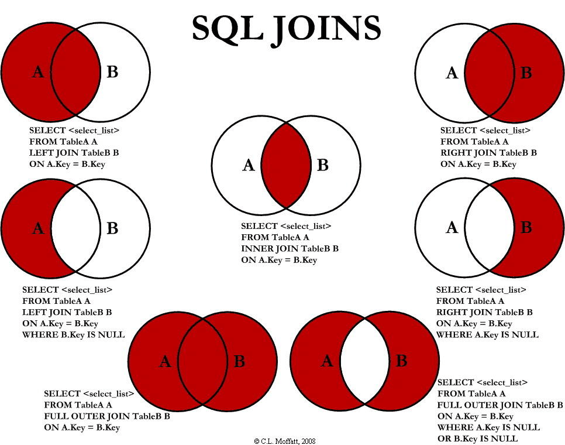

[toc]


&emsp;
&emsp;
&emsp;
# 1. 函数
## 1.1 聚合(Aggregate)函数和标量(Scalar) 函数
### 1.1.1 有哪些聚合函数？
| 函数名    | 作用                 |
| --------- | -------------------- |
| `AVG()`   | 返回平均值           |
| `COUNT()` | 返回行数             |
| `FIRST()` | 返回第一个记录的值   |
| `LAST()`  | 返回最后一个记录的值 |
| `MAX()`   | 返回最大值           |
| `MIN()`   | 返回最小值           |
| `SUM()`   | 返回总和             |

### 1.1.2 有哪些标量函数？
Scalar函数基于输入值，返回一个单一的值：
| 函数名        | 作用                                              |
| ------------- | ------------------------------------------------- |
| `UCASE()`     | 将某个字段转换为大写                              |
| `LCASE()`     | 将某个字段转换为小写                              |
| `MID()`       | 从某个文本字段提取字符，MySql 中使用              |
| `SubString()` | `SubString(字段，1，end)`，从某个文本字段提取字符 |
| `LEN()`       | 返回某个文本字段的长度                            |
| `ROUND()`     | 对某个数值字段进行指定小数位数的四舍五入          |
| `NOW()`       | 返回当前的系统日期和时间                          |
| `FORMAT()`    | 格式化某个字段的显示方式                          |

&emsp;
## 1.2 `MAX()` 函数
### 1.2.1 作用
&emsp;&emsp; `MAX()`函数返回指定列的最大值。

### 1.2.2 `MAX()` 语法
```sql
SELECT MAX(column_name) FROM table_name;
```

### 1.2.3 实例
#### (1) 数据和要求
某`user_profile`表如下:
| id  | device_id | gender | age  | university | gpa |
| --- | --------- | ------ | ---- | ---------- | --- |
| 1   | 2234      | male   | 21   | 北京大学   | 3.2 |
| 2   | 2235      | male   | NULL | 复旦大学   | 3.8 |
| 3   | 2236      | female | 20   | 复旦大学   | 3.5 |
| 4   | 2237      | female | 23   | 浙江大学   | 3.3 |
| 5   | 2238      | male   | 25   | 复旦大学   | 3.1 |
| 6   | 2239      | male   | 25   | 北京大学   | 3.6 |
| 7   | 2240      | male   | NULL | 清华大学   | 3.3 |
| 8   | 2241      | female | NULL | 北京大学   | 3.7 |
运营想要知道复旦大学学生gpa最高值是多少，请你取出相应数据，根据输入，你的查询应返回以下结果，结果保留到小数点后面1位(1位之后的四舍五入):
| gpa |
| --- |
| 3.8 |

#### (2) 解答
```sql
select max(gpa)  from user_profile where university = '复旦大学';
```
另外，这个用`limit`子句也能做到。

&emsp;
## 1.3 `avg()` 函数
### 1.3.1 作用
&emsp;&emsp; `AVG()` 函数返回数值列的平均值。

### 1.3.2 AVG() 语法
```sql
SELECT AVG(column_name) FROM table_name;
```

### 1.3.3 AVG()使用实例
#### 数据和要求
&emsp;&emsp; `user_profile`表同`MAX()`函数给出的数据。
&emsp;&emsp; 现在运营想要看一下男性用户有多少人以及他们的平均gpa是多少，用以辅助设计相关活动，请你取出相应数据。
```sql
select 
    count(*) as male_num, 
    avg(gpa) as avg_gpa 
from 
    user_profile 
where 
    gender='male';
```

&emsp;
## 1.4 空值替换函数
在`MySQL`中是`IFNULL`：
```sql
IFNULL(expression, alt_value)
```
如果第一个参数的表达式 `expression` 为 `NULL`，则返回第二个参数的备用值。
在`Oracle`中则为：`NVL`
```sql
NVL(expression, alt_value)
```

&emsp;
## 1.5 条件函数
### 1.5.1 基本语法
```sql
IF(exp, val1, val12)
```
> 如果`exp`为`True`，返回值`val1`；若为`False`，返回值`val2`。
> 

### 1.5.2 如果要用`if`进行多个分类，应该怎么做？
&emsp; 当分类大于两种或者以上时，就可以使用`IF`函数嵌套。例如：
> &emsp;&emsp; 在学生表中，将学生编号小于等于`3`的学生，分为`1`班，学生编号在`4-6`的学生，分为`2`班，学生编号大于等于`7`的学生，分为`3`班，最后显示`Sid`,`Sname`,所在班级这三列。
> 
使用嵌套的`IF`，我们可以这么写：
```sql
select 
    Sid as '学生编号',
    Sname as '学生姓名',
    IF(
        Sid <= 3,'1班',
        IF(Sid >= 7,'3班','2班')
        ) as '所在班级'
from 
    students
order by Sid;
```
执行结果如下：
<div align="center">  </div>
<center> <font color=black> <b> 示例结果 </b> </font> </center>

### 1.5.3 `IF` + 聚合函数
IF 还经常与聚合函数一起结合使用
实例3：将学生表和教师结合使用，计算班主任所带的学生数量，大于等于5人以上的显示：5人以上，人数小于5人的显示：5人以下。
```sql
select 
    t.Tname as '老师姓名',
    count(*) as '人数',
    IF(
        count(*) >= 5,'5人以上','5人以下'
    ) as '分类'
from 
    teachers as t
join 
    students as s
on 
    Tid
GROUP BY 
    t.Tname;
```
<div align="center">  </div>

### 1.5.4 牛客实例： SQL26 计算25岁以上和以下的用户数量
#### 题目
[SQL26 计算25岁以上和以下的用户数量](https://www.nowcoder.com/practice/30f9f470390a4a8a8dd3b8e1f8c7a9fa?tpId=199&tags=&title=&difficulty=0&judgeStatus=0&rp=0&sourceUrl=%2Fexam%2Foj%3Fpage%3D1%26tab%3DSQL%25E7%25AF%2587%26topicId%3D199)

#### 解答
```sql
select 
    if(age >= 25, "25岁及以上", "25岁以下") as age_cut,
    count(*)
from 
    user_profile
group by
    age_cut;
```

### 1.5.5 牛客实例：SQL27 查看不同年龄段的用户明细
#### 题目
[SQL27 查看不同年龄段的用户明细](https://www.nowcoder.com/practice/ae44b2b78525417b8b2fc2075b557592?tpId=199&tags=&title=&difficulty=0&judgeStatus=0&rp=0&sourceUrl=%2Fexam%2Foj%3Fpage%3D1%26tab%3DSQL%25E7%25AF%2587%26topicId%3D199)

#### 解答
```sql
select
    device_id,
    gender,
    if(
        age > 19 and age < 25, "20-24岁", 
            if(age > 24, "25岁及以上", "其他")
    ) as age_cut
from user_profile;
```

&emsp;
## 1.6 `case`函数
### 1.6.1 


&emsp;
&emsp;
&emsp;
# 2. `GROUP BY` 语句
## 2.1 `GROUP BY` 的作用
&emsp;&emsp; `GROUP BY`一般用于分组统计，它表达的逻辑就是根据一定的规则，进行分组，它可结合一些聚合函数来使用。

## 2.2 `GROUP BY` 语法
### 2.2.1 基本语法
```sql
SELECT column_name, aggregate_function(column_name)
FROM table_name
WHERE column_name operator value
GROUP BY column_name;
```
### 2.2.2 `GROUP BY` 多个字段
```sql
select
    t1.university,
    t3.difficult_level,
    count(university)/count(distinct t2.device_id) as avg_answer_cnt
from 
    user_profile t1
join 
    question_practice_detail t2 
on 
    t1.device_id = t2.device_id
join
    question_detail t3
on 
    t2.question_id = t3.question_id
group by
    t1.university, t3.difficult_level; -- group by 多个字段
```

## 2.3 原理
下面这个文章讲的不错：
> &emsp;&emsp; [group by 详解](https://zhuanlan.zhihu.com/p/460005395)
> 

## 2.4 GROUP BY 引发的报错
### 2.4.1
报错信息：
```
SQL_ERROR_INFO: "Expression #1 of SELECT list is not in GROUP BY clause and contains 
nonaggregated column 't1.university' which is not functionally dependent on columns in GROUP 
BY clause; this is incompatible with sql_mode=only_full_group_by"
```
报错原因：
> ONLY_FULL_GROUP_BY ： 对于`GROUP BY`聚合操作，如果在`SELECT`中的列，没有在`GROUP BY`中出现，那么这个SQL是不合法的，因为列不在`GROUP BY`从句中。
> 

## 2.5 实例
### 2.5.1 数据
下面是选自 `Websites` 表的数据：
```sql
mysql> SELECT * FROM Websites;

+----+---------------+---------------------------+-------+---------+
| id | name          | url                       | alexa | country |
+----+---------------+---------------------------+-------+---------+
| 1  | Google        | https://www.google.cm/    | 1     | USA     |
| 2  | 淘宝          | https://www.taobao.com/   | 13    | CN      |
| 3  | 菜鸟教程      | http://www.runoob.com/    | 4689  | CN      |
| 4  | 微博          | http://weibo.com/         | 20    | CN      |
| 5  | Facebook      | https://www.facebook.com/ | 3     | USA     |
| 7  | stackoverflow | http://stackoverflow.com/ |   0   | IND     |
+----+---------------+---------------------------+-------+---------+
```
下面是`access_log` 网站访问记录表的数据：
```sql
mysql> SELECT * FROM access_log;

+-----+---------+-------+------------+
| aid | site_id | count | date       |
+-----+---------+-------+------------+
|   1 |       1 |    45 | 2016-05-10 |
|   2 |       3 |   100 | 2016-05-13 |
|   3 |       1 |   230 | 2016-05-14 |
|   4 |       2 |    10 | 2016-05-14 |
|   5 |       5 |   205 | 2016-05-14 |
|   6 |       4 |    13 | 2016-05-15 |
|   7 |       3 |   220 | 2016-05-15 |
|   8 |       5 |   545 | 2016-05-16 |
|   9 |       3 |   201 | 2016-05-17 |
+-----+---------+-------+------------+
```

### 2.5.2 `GROUP BY`简单应用: 统计 `access_log` 各个 `site_id` 的访问量：
```sql
mysql> SELECT site_id, SUM(access_log.count) AS nums
        FROM access_log GROUP BY site_id;

+---------+------+
| site_id | nums |
+---------+------+
|       1 |  275 |
|       2 |   10 |
|       3 |  521 |
|       4 |   13 |
|       5 |  750 |
+---------+------+
```

### 2.5.3 `GROUP BY`多表连接: 统计有记录的网站的记录数量
```sql
mysql> SELECT Websites.name,COUNT(access_log.aid) AS nums FROM access_log
        LEFT JOIN Websites
        ON access_log.site_id=Websites.id
        GROUP BY Websites.name;

+----------+------+
| name     | nums |
+----------+------+
| Facebook |   2  |
| Google   |   2  |
| 微博     |   1  |
| 淘宝     |   1  |
| 菜鸟教程 |   3  |
```

## 2.6 牛客网的`GROUP BY`练习题
### 2.6.1 SQL18
#### (1) 题目
[SQL18 分组计算练习题](https://www.nowcoder.com/practice/009d8067d2df47fea429afe2e7b9de45?tpId=199&tags=&title=&difficulty=0&judgeStatus=0&rp=0&sourceUrl=%2Fexam%2Foj%3Fpage%3D1%26tab%3DSQL%25E7%25AF%2587%26topicId%3D199)
#### (2) 解答
```sql
-- SQL18 分组计算练习题

select 
    gender, 
    university, 
    count(id) as user_num, -- 注意用的是 count()函数
    avg(active_days_within_30), 
    avg(question_cnt)
from user_profile
group by gender, university;
```

### 2.6.2 SQL19 
#### (1) 题目
[SQL19 分组过滤练习题](https://www.nowcoder.com/practice/ddbcedcd9600403296038ee44a172f2d?tpId=199&tags=&title=&difficulty=0&judgeStatus=0&rp=0&sourceUrl=%2Fexam%2Foj%3Fpage%3D1%26tab%3DSQL%25E7%25AF%2587%26topicId%3D199)

#### (2) 解答
```sql
-- SQL19 分组过滤练习题

select
    university,
    avg(question_cnt) as avg_question_cnt,
    avg(answer_cnt) as avg_answer_cnt
from
    user_profile
group by
    university
having -- 注意，此处不能用where，因为 where不能和聚合函数一起使用。
    avg_question_cnt < 5 or avg_answer_cnt < 20;
```

### 2.6.3 SQL20 
#### (1) 题目
[]()
#### (2) 解答
```sql
-- SQL19 分组过滤练习题

select
    university,
    avg(question_cnt) as avg_question_cnt
from
    user_profile
group by
    university
order by
    avg_question_cnt;
```


&emsp;
&emsp;
&emsp;
# `HAVING` 子句
## `HAVING` 子句 的作用
在 SQL 中增加 `HAVING` 子句原因是: 
> &emsp;&emsp; `WHERE` 关键字无法与聚合函数一起使用。
> 
通过`HAVING`子句，我们可以 筛选 分组后的 各组数据。

## `HAVING`子句 和 `WHERE`关键字 的区别
`WHERE` 和`HAVING`之后都是筛选条件，但是有区别的：
> &emsp;&emsp; ① 语法上有个执行先后的差别: 先执行`where`，然后是`group by`， 最后是`having`；
> &emsp;&emsp; ② 功能上有个筛选的区别，`where`只能筛选记录行，不能筛选聚合后的记录行，`having`主要用来筛选分组聚合后的结果集。
> &emsp;&emsp; ③ `having`可以和`count、sum、avg、max、min`等聚合函数一起使用，而`where`则不能，否则会报错。
> 

## 
见本文的 SQL19


&emsp;
&emsp;
&emsp;
# `LIMIT`子句
## `LIMIT`子句的作用

## `LIMIT`子句的语法
```sql
SELECT select_list
    FROM table_name 
        LIMIT [offset,] row_count; 
```
参数解析：
> `offset` ： 可选参数，指定的第一行的偏移量。在`offse`t第一行的是`0`，而不是`1` 
> `row_count` : 指定的返回最大行数 
> 
举个例子：
```sql
-- 返回计算结果中的前x行数据。
LIMIT x

-- 返回计算结果中从y行开始的x行数据。
LIMIT y, x
```
<div align="center">  </div>
<center> <font color=black> <b> LIMIT子句 </b> </font> </center>

## 实例
### 题目
描述
> &emsp;&emsp; 题目：现在运营只需要查看前2个用户明细设备ID数据，请你从用户信息表 user_profile 中取出相应结果。
> 
示例：
| id  | device_id | gender | age | university | province |
| --- | --------- | ------ | --- | ---------- | -------- |
| 1   | 2138      | male   | 21  | 北京大学   | Beijing  |
| 2   | 3214      | male   |     | 复旦大学   | Shanghai |
| 3   | 6543      | female | 20  | 北京大学   | Beijing  |
| 4   | 2315      | female | 23  | 浙江大学   | ZheJiang |
| 5   | 5432      | male   | 25  | 山东大学   | Shandong |
根据输入，你的查询应返回以下结果：

| device_id |
| --------- |
| 2138      |
| 3214      |

### 解答
```sql
select device_id
    from user_profile 
        order by id 
            limit 2 offset 0;
```


&emsp;
&emsp;
&emsp;
# 过滤空值
### 题目
描述
> &emsp;&emsp; 题目：现在运营想要对用户的年龄分布开展分析，在分析时想要剔除没有获取到年龄的用户，请你取出所有年龄值不为空的用户的设备ID，性别，年龄，学校的信息。
> 
示例：
| id  | device_id | gender | age | university | province |
| --- | --------- | ------ | --- | ---------- | -------- |
| 1   | 2138      | male   | 21  | 北京大学   | Beijing  |
| 2   | 3214      | male   |     | 复旦大学   | Shanghai |
| 3   | 6543      | female | 20  | 北京大学   | Beijing  |
| 4   | 2315      | female | 23  | 浙江大学   | ZheJiang |
| 5   | 5432      | male   | 25  | 山东大学   | Shandong |
根据输入，你的查询应返回以下结果：
| device_id | gender | age | university |
| --------- | ------ | --- | ---------- |
| 2138      | male   | 21  | 北京大学   |
| 6543      | female | 20  | 北京大学   |
| 2315      | female | 23  | 浙江大学   |
| 5432      | male   | 25  | 山东大学   |
### 解答
&emsp;&emsp; 注意，在查询`NULL`时，不能使用比较运算符(`=`或者`< >`)，需要使用`IS NULL`运算符或者`IS NOT NULL`运算符：
```sql
select device_id, gender,age,university 
    from user_profile 
        where age is not null; -- 划重点！
```


&emsp;
&emsp;
&emsp;
# SQL 连接(JOIN)
## 有哪几种连接？这几种连接有哪些用法？
&emsp;&emsp; 
> ① `inner join`（内连接）：只返回两个表中连接字段相等的行。
> ② `left join` （左连接）：返回包括左表中的所有记录和右表中连接字段相等的记录。
> ③ `right join`（右连接）：返回包括右表中的所有记录和左表中连接字段相等的记录。
> ④ `full join` （全外连接）：返回左右表中所有的记录和左右表中连接字段相等的记录。(需要注意的是，关键字`outer`是可选择的，取决于具体语言，在实现上它们都是遵循标准的，因此`FULL JOIN`和`FULL OUTER JOIN`是一样的。)
> 
它们有如下图7种用法：
<div align="center">  </div>
<center> <font color=black> <b> 4种连接的7种用法 </b> </font> </center>

## `left outer join`和`left join`有何区别？
`left join`是`left outer join`的缩写，`join`一共有三种`OUTER JOIN`:
> ① `LEFT OUTER JOIN`
> ② `RIGHT OUTER JOIN`
> ③ `FULL OUTER JOIN`
> &emsp;&emsp; 其中关键字`OUTER`是可选择的，取决于具体语言，在实现上它们都是遵循标准的。
> 

## 在对多表进行连接时，后台发生了什么？
&emsp;&emsp; 在连接两张(或多张)来时，数据库会生成一张中间的临时表，然后再将这张临时表返回给用户。
&emsp;&emsp; 连接的结果可以在逻辑上看作是由`SELECT`语句指定的列组成的新表。

## 如何理解连接中的 左 和 右？
&emsp;&emsp; 左连接与右连接的 **左右** 指的是以两张表中的哪一张为基准，它们都是外连接。

## 有哪些外连接？如何理解外连接？
`join`一共有三种`OUTER JOIN`:
> ① `LEFT OUTER JOIN`
> ② `RIGHT OUTER JOIN`
> ③ `FULL OUTER JOIN`
> &emsp;&emsp; 其中关键字`OUTER`是可选择的，取决于具体语言，在实现上它们都是遵循标准的。
> 
&emsp;&emsp; 外连接就好像是为非基准表添加了一行全为空值的万能行，用来与基准表中找不到匹配的行进行匹配。假设两个没有空值的表进行左连接，左表是基准表，左表的所有行都出现在结果中，右表则可能因为无法与基准表匹配而出现是空值的字段。

## 在`left join`(`right join`)时，`on`和`where`各自起什么作用？
在使用 `join` 时，`on` 和 `where` 条件的区别如下：
> &emsp;&emsp; `on` 条件是在生成临时表时使用的条件，它不管 `on` 中的条件是否为真，都会返回左边表(若是`right join`则返回的是右边)中的记录。
> &emsp;&emsp; `where` 条件是在临时表生成好后，再对临时表进行过滤的条件。这时已经没有 left join 的含义（必须返回左边表的记录）了，条件不为真的就全部过滤掉。
> 

## `join`默认是左连接还是右连接？
&emsp;&emsp; 默认是`INNER JOIN`


&emsp;
&emsp;
&emsp;
# 联合查询：`UNION` 操作符
## `union`的作用
&emsp;&emsp; `union` 操作符合并两个或多个 `SELECT` 语句的结果。
&emsp;&emsp; 请需要注意的是，`UNION` 内部的每个 `SELECT` 语句必须拥有相同数量的列。列也必须拥有相似的数据类型。同时，每个 `SELECT` 语句中的列的顺序必须相同。

## `union`的语法
```sql
SELECT column_name(s) FROM table1
UNION
SELECT column_name(s) FROM table2;
```

## `UNION ALL`的作用和语法
&emsp;&emsp; 默认地，`UNION` 操作符选取不同的值；`UNION ALL`允许重复的值
```sql
SELECT column_name(s) FROM table1
UNION ALL
SELECT column_name(s) FROM table2;
```

## 使用 `union`的注意事项
&emsp;&emsp; 使用`UNION`命令时需要注意，只能在最后使用一个`ORDER BY`命令，是将两个查询结果合在一起之后，再进行排序！绝对不能写两个`ORDER BY`命令。

## 使用实例
### 表数据
下面是选自 `Websites` 表的数据：
```sql
mysql> SELECT * FROM Websites;

+----+---------------+---------------------------+-------+---------+
| id | name          | url                       | alexa | country |
+----+---------------+---------------------------+-------+---------+
| 1  | Google        | https://www.google.cm/    | 1     | USA     |
| 2  | 淘宝          | https://www.taobao.com/   | 13    | CN      |
| 3  | 菜鸟教程      | http://www.runoob.com/    | 4689  | CN      |
| 4  | 微博          | http://weibo.com/         | 20    | CN      |
| 5  | Facebook      | https://www.facebook.com/ | 3     | USA     |
| 7  | stackoverflow | http://stackoverflow.com/ |   0 | IND     |
+----+---------------+---------------------------+-------+---------+
```
下面是 `apps` APP 的数据：
```sql
mysql> SELECT * FROM apps;

+----+------------+-------------------------+---------+
| id | app_name   | url                     | country |
+----+------------+-------------------------+---------+
|  1 | QQ APP     | http://im.qq.com/       | CN      |
|  2 | 微博 APP   | http://weibo.com/       | CN      |
|  3 | 淘宝 APP   | https://www.taobao.com/ | CN      |
+----+------------+-------------------------+---------+
3 rows in set (0.00 sec)
```

### `UNION` 实例
```sql
SELECT country FROM Websites
UNION
SELECT country FROM apps
ORDER BY country;
```
运行结果：
```
+---------+
| country |
+---------+
| CN      |
| IND     |
| USA     |
+---------+
```

### `UNION ALL` 实例
```sql
SELECT country FROM Websites
UNION ALL
SELECT country FROM apps
ORDER BY country;
```
运行结果：
```
+---------+
| country |
+---------+
| CN      |
| CN      |
| CN      |
| CN      |
| CN      |
| IND     |
| USA     |
| USA     |
| USA     |
+---------+
```
### 对比
&emsp;&emsp; 显然，`UNION`得到的结果没有重复，而 `UNION ALL` 得到的结果是包含重复的内容的。


# 多表查询
## 1. SQL21 浙江大学用户题目回答情况
### 题目详情
[SQL21 浙江大学用户题目回答情况](https://www.nowcoder.com/practice/55f3d94c3f4d47b69833b335867c06c1?tpId=199&tags=&title=&difficulty=0&judgeStatus=0&rp=0&sourceUrl=%2Fexam%2Foj%3Fpage%3D1%26tab%3DSQL%25E7%25AF%2587%26topicId%3D199)

### 解法1
最开始的解法：
```sql
select
  t1.device_id,
  t1.question_id,
  t1.result 
from
  question_practice_detail t1,
  user_profile t2 
where
  t1.device_id = t2.device_id 
  and t2.university = '浙江大学';
```

### 解法2
这题还能使用连接(`join`)：
```sql
select
  t1.device_id,
  t1.question_id,
  t1.result
from
  question_practice_detail t1
  join user_profile t2 on t1.device_id = t2.device_id
where
  t2.university = '浙江大学';
```

&emsp;
## 2. SQL22 统计每个学校的答过题的用户的平均答题数
### 题目详情
[SQL22 统计每个学校的答过题的用户的平均答题数](https://www.nowcoder.com/practice/88aa923a9a674253b861a8fa56bac8e5?tpId=199&tqId=1975674&ru=/exam/oj&qru=/ta/sql-quick-study/question-ranking&sourceUrl=%2Fexam%2Foj%3Fpage%3D1%26tab%3DSQL%25E7%25AF%2587%26topicId%3D199)
### 解法
#### 思路
&emsp;&emsp; ① 学校和答题信息在不同的表，需要做连接；
&emsp;&emsp; ② 统计的是每个学校的答题情况，因此要 按学校分组；
&emsp;&emsp; ③ 要获取平均答题数量，可以在每个学校的分组内，用 该校总答题数量 除以 该校总人数。

#### 代码
```sql
select 
    university,
    -- 因为已经分组了
    count(university)/count(distinct t2.device_id) as avg_answer_cnt
from
    user_profile t1
join
    question_practice_detail t2
on
    t1.device_id = t2.device_id
group by university;
```

&emsp;
## 3 SQL23 统计每个学校各难度的用户平均刷题数
### 题目详情
[SQL23 统计每个学校各难度的用户平均刷题数](https://www.nowcoder.com/practice/5400df085a034f88b2e17941ab338ee8?tpId=199&tqId=1975674&ru=%2Fexam%2Foj&qru=%2Fta%2Fsql-quick-study%2Fquestion-ranking&sourceUrl=%2Fexam%2Foj%3Fpage%3D1%26tab%3DSQL%25E7%25AF%2587%26topicId%3D199)

### 解法
#### 思路

#### 代码
```sql
select
    t1.university,
    t3.difficult_level,
    count(university)/count(distinct t2.device_id) as avg_answer_cnt
from 
    user_profile t1
join 
    question_practice_detail t2 
on 
    t1.device_id = t2.device_id
join
    question_detail t3
on 
    t2.question_id = t3.question_id
group by
    t1.university, t3.difficult_level;
```

&emsp;
## 4. SQL24 统计每个用户的平均刷题数
### 题目详情
[SQL24 统计每个用户的平均刷题数](https://www.nowcoder.com/practice/f4714f7529404679b7f8909c96299ac4?tpId=199&tags=&title=&difficulty=0&judgeStatus=0&rp=0&sourceUrl=%2Fexam%2Foj%3Fpage%3D1%26tab%3DSQL%25E7%25AF%2587%26topicId%3D199)

### 解法
#### 思路
这题和 [SQL23 统计每个学校各难度的用户平均刷题数]()就多了个分组后的筛选
#### 代码
```sql
select
    university,
    difficult_level,
    count(*) / count(distinct t2.device_id) as avg_answer_cnt
from
    user_profile t1
join
    question_practice_detail t2
on 
    t1.device_id = t2.device_id
join
    question_detail t3 
on 
    t2.question_id = t3.question_id
group by
    t1.university, t3.difficult_level
having
    t1.university = '山东大学';
```

&emsp;
## 5. SQL25 查找山东大学或者性别为男生的信息
### 题目详情
[SQL25 查找山东大学或者性别为男生的信息](https://www.nowcoder.com/practice/979b1a5a16d44afaba5191b22152f64a?tpId=199&tags=&title=&difficulty=0&judgeStatus=0&rp=0&sourceUrl=%2Fexam%2Foj%3Fpage%3D1%26tab%3DSQL%25E7%25AF%2587%26topicId%3D199)

### 解法
#### 思路

#### 代码
第一次解答：
```sql
select
    device_id,
    gender, 
    age,
    gpa
from 
    user_profile t1
where
    university = '山东大学' or gender='male';
```
结果不满足要求，因为题目要求：
> 先输出学校为山东大学 再输出 性别为男生 的信息
> 
为满足上述要求，需要用到联合查询，而且题目要求 **不去重**，因此要用 `union all`：
```sql
select
  device_id,
  gender,
  age,
  gpa
from
  user_profile t1
where
  university = '山东大学'

union all

select
  device_id,
  gender,
  age,
  gpa
from
  user_profile t1
where
  gender = 'male';
```

&emsp;
## 
### 题目详情


### 解法
#### 思路

#### 代码
```sql

```