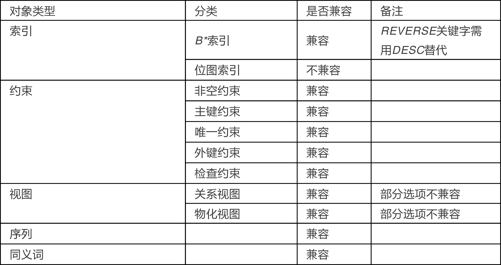

[todc]

&emsp;
&emsp;
&emsp;
# 1 GaussDB与Oracle对比
## 1.1 是否开源
Oracle 闭源
PostgreSQL 开源
GaussDB 既有开源版本也有闭源版本

## 1.2 数据类型
| 分类      | 字段类型                       | 是否兼容 | 替代方案                 |
| --------- | ------------------------------ | -------- | ------------------------ |
| 字符      | CHAR                           | √        |                          |
|           | NCHAR                          | √        |                          |
|           | VARCHAR                        | √        |                          |
|           | VARCHAR2                       | √        |                          |
|           | NVARCHAR2                      | √        |                          |
|           | LONG                           | ×        | CLOB                     |
| 数字      | INT                            | √        |                          |
|           | FLOAT                          | √        |                          |
|           | NUMBER                         | √        |                          |
|           | BINARY_FLOAT                   | ×        | BINARY_DOUBLE            |
|           | BINARY_DOUBLE                  | √        |                          |
| 时间&日期 | DATE                           | √        |                          |
|           | TIMESTAMP                      | √        |                          |
|           | TIMESTAMP WITH TIME ZONE       | √        |                          |
|           | TIMESTAMP WITH LOCAL TIME ZONE | ×        | TIMESTAMP WITH TIME ZONE |
|           | INTERVAL YEAR TO MONTH         | √        |                          |
|           | INTERVAL DAY TO SECOND         | √        |                          |
| 大对象    | BLOB                           | √        |                          |
|           | CLOB                           | √        |                          |
|           | NCLOB                          | ×        | CLOB                     |
|           | BFILE                          | ×        | BLOB                     |
| ROWID     | ROWID                          | ×        | CHAR(20)                 |
|           | UROWID                         | ×        | CHAR(40)                 |
| RAW       | RAW                            | √        |                          |
|           | LONG RAW                       | ×        | BLOB                     |

[openGauss 可替代 Oracle 吗？从字段类型说起……](https://www.infoq.cn/article/qzvNCd1kts5quhcQTU0l)

&emsp;
## 1.3 高斯和Oracle 的数据库表的兼容性
| 表类型     | 是否兼容                   | 备注                                                                    |
| ---------- | -------------------------- | ----------------------------------------------------------------------- |
| 堆表       | 全部兼容                   |                                                                         |
| 临时表     | 全部兼容                   |                                                                         |
| 表压缩     | 部分兼容                   | 支持普通压缩模式，有DELTA、PREFIX、DICTIONARY、NUMSTR四种压缩算法供选择 |
| 索引组织表 | 不兼容                     | 不支持                                                                  |
| 簇表       | 不兼容                     | 不支持，部分情况可以考虑用partial cluster key替代                       |
| 分区表     | 部分兼容                   | 只支持范围分区                                                          |
| 嵌套表     | 功能兼容，但语法有部分改变 |                                                                         |

详情见[openGauss 魔改 PG？它能兼容 Oracle 的数据库表吗？](https://www.infoq.cn/article/hLvbP5TJ2zUZqxN2jAp1)

## 1.4 索引

  

[Oracle 的逻辑对象，openGauss 都能 hold 住吗？](https://www.infoq.cn/article/tfHzzxlNBEYi8rZDmtXO)

## 1.5

