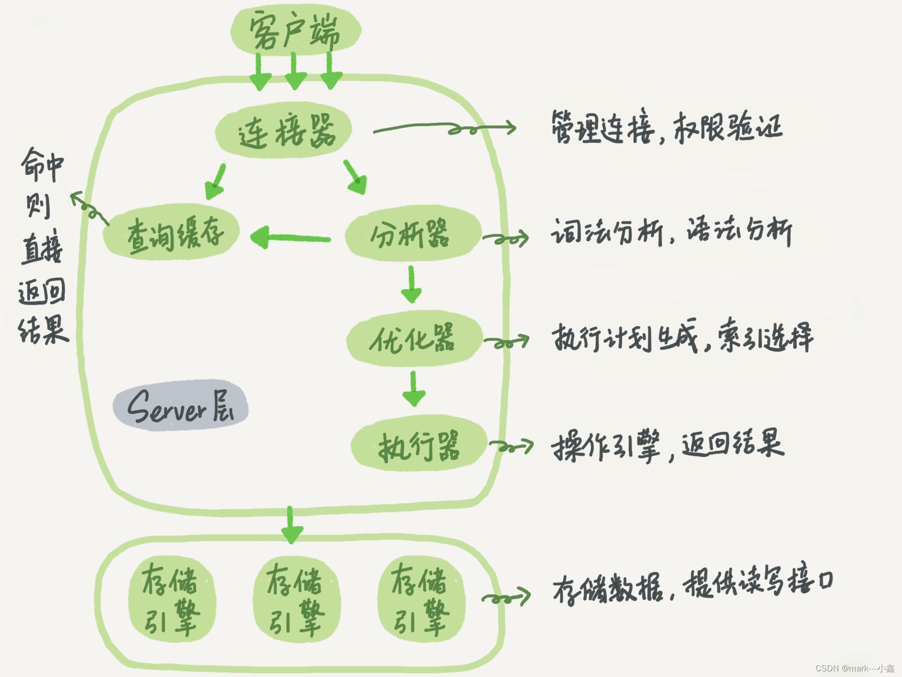
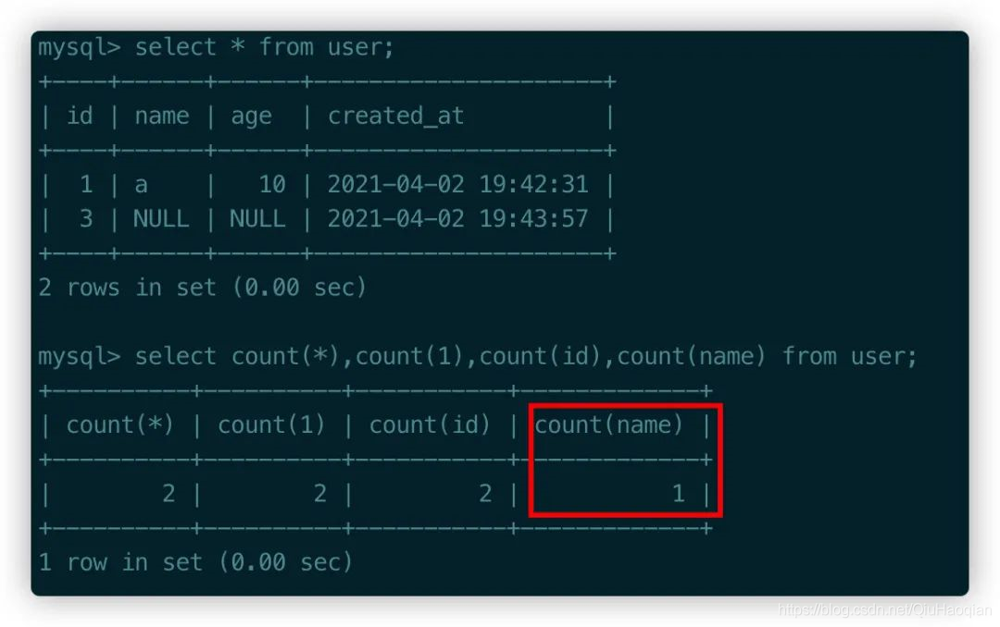
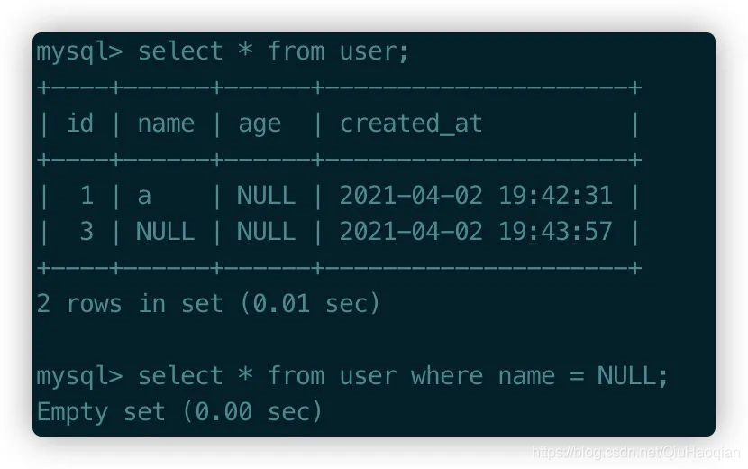
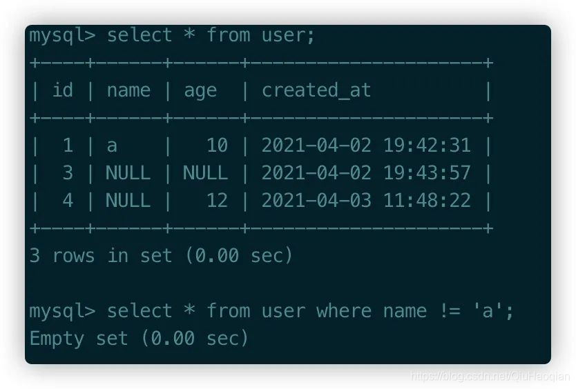
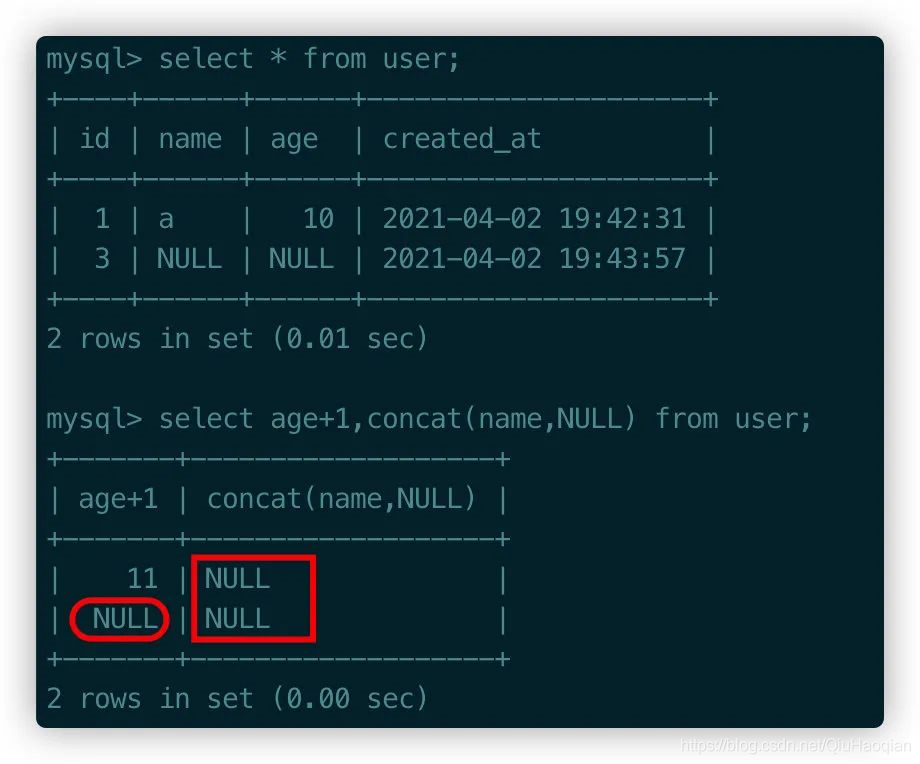
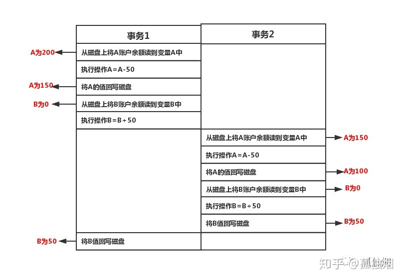

[toc]


&emsp;
&emsp;
## 1、 数据库的三大范式
> ① 第一范式:  每个列都不可以再拆分。
> ② 第二范式:  非主键列完全依赖于主键，而不能是依赖于主键的一部分.。
> ③ 第三范式:  非主键列只依赖于主键，不依赖于其他非主键。
> 
在设计数据库结构的时候,要尽量遵守三范式,如果不遵守,必须有足够的理由，比如性能。事实上我们经常会 为了性能而妥协数据库的设计。


&emsp;
## 2、Mysql有哪些部分组成以及作用
### 2.1 MySQL 的基本架构示意图
下图是 MySQL 的基本架构示意图：
<div align="center">  </div>

### 2.2 Mysql有哪些部分组成以及作用
MySQL 可以分为 **Server层** 和 **存储引擎层** 两部分
(1) 其中server包括了如下**4个**部分：
> ① **连接器**: 管理连接, 权限验证.
> ② **分析器**: 词法分析, 语法分析.
> ③ **优化器**: 执行计划生成, 索引的选择.
> ④ **执行器**: 操作存储引擎, 返回执行结果.
> 
(2) 储存引擎：存储数据, 提供读写接口.
&emsp;&emsp; 存储引擎层负责数据的存储和提取。其架构模式是插件式的，MySQL支持 `InnoDB`、`MyISAM``、Memory` 等多个存储引擎。 目前最常见的存储引擎是 `InnoDB`


&emsp;
## 3、NULL
### 3.1 NULL 和 空值 是一样的吗？
&emsp;&emsp; null 和空值不一样，空值不占用空间，而null 占用空间，所以字段设置成 not null 之后仍然可以插入空值。
### 3.2 数据库字段为什么要求定义成NOT NULL ？
MySQL官网这样介绍:
> &emsp;&emsp; NULL columns require additional space in the row to record whether their values are NULL. For MyISAM tables, each NULL columntakes one bit extra, rounded up to the nearest byte.
> &emsp;&emsp; null值会占用更多的字节，且会在程序中造成很多与预期不符的情况.
> 
字段设置成 not null 的原因有以下几点：
(1) NULL 值会影响一些函数的计算，比如如 `count()`函数遇到 NULL 值，这条记录不会统计在内：
<div align="center">  </div>

(2) `=` 与 `!=` 失效
对于NULL值的列，是不能使用 " = " 表达式进行判断的，下面对name的查询是不成立的，必须使用is NULL:
<div align="center">  </div>
表中只有一条有名字的记录，此时查询名字 !=a 预期的结果应该是想查出来剩余的两条记录，会发现与预期结果不匹配:
<div align="center">  </div>

(3)  NULL与其他值运算结果为NULL
NULL和其他任何值进行运算结果都是NULL，包括表达式的值也是NULL。
user表第二条记录：
> age是NULL，所以+1之后还是NULL；
> name是NULL，进行concat运算之后结果还是NULL。
> 
<div align="center">  </div>

(4) 对`distinct`、`group by`、`order by`等排序结果的影响
对于d`istinct` 和 `group by`来说，所有的`NULL`值都会被视为相等；
对于`order by`来说升序`NULL`会排在最前；

### 3.3 若平时在插入数据时不能保证字段一定有值，应该怎么做？
(1) 通过设置默认值的形式，定义时使用DEFAULT ''或DEFAULT 0，来避免空字段的产生。
(2) 若一张表中，允许为空的列比较多，接近表全部列数的三分之一。而且，  这些列在大部分情况下，都是可有可无的。若数据库管理员遇到这种情况，可以考虑另外建立一张副表，以保存这些列。


&emsp;
## 4 


&emsp;
## 5、同时有多个事务正在进行提交，会发生什么？
事务（transaction）是作为一个单元的一组有序的数据库操作。如果组中的所有操作都成功， 则认为 事务成功， 即使只有一个操作失败， 事务也不成功。如果所有操作完成， 事务则提交， 其修改将作用 于所有其他数据库进程。如果一个操作失败， 则事务将回滚， 该事务所有操作的影响都将取消。

事务特性
原子性即不可分割性， 事务要么全部被执行， 要么就全部不被执行。

一致性或可串性事务的执行使得数据库从一种正确状态转换成另一种正确状 态

隔离性在事务正确提交之前，不允许把该事务对数据的任何改变提供给任何 其他事务，

持久性事务正确提交后， 其结果将永久保存在数据库中， 即使在事务提交后有了其他故障， 事务 的处理结果也会得到保存。或者这样理解：事务就是被绑定在一起作为一个逻辑工作单元的 SQL 语句分 组， 如果任何一个语句操作失败那么整个操作就被失败， 以后操作就会回滚到操作前状态， 或者是上 有个节点。为了确保要么执行， 要么不执行， 就可以使用事务。要将有组语句作为事务考虑， 就需要 通过 ACID 测试， 即原子性， 一致性， 隔离性和持久性。


&emsp;
## 6 Mysql索引分哪些？
从数据结构角度
> B+树索引(O(log(n)))：关于B+树索引，
> hash索引： 
> FULLTEXT索引（现在MyISAM和InnoDB引擎都支持了）
> R-Tree索引（用于对GIS数据类型创建SPATIAL索引）
> 
从物理存储角度
> 聚集索引（clustered index）
> 非聚集索引（non-clustered index）
> 
从逻辑角度
> 主键索引：主键索引是一种特殊的唯一索引，不允许有空值
> 普通索引或者单列索引
> 多列索引（复合索引）
> 唯一索引或者非唯一索引
> 空间索引
> 


&emsp;
## 7 主键索引和唯一索引
### 7.1 主键与索引的区别是什么？
* ① 主键是一种约束，唯一索引是一种索引，两者在本质上是不同的。
* ② 主键创建后一定包含一个唯一性索引，唯一性索引并不一定就是主键。
* ③ 唯一性索引列允许空值，而主键列不允许为空值。
* ④ 主键列在创建时，已经默认不为空值，且是一个唯一索引。
* ⑤ 主键可以被其他表引用为外键，而唯一索引不能。
* ⑥ 一个表最多只能创建一个主键，但可以创建多个唯一索引。
* ⑦ 主键更适合那些不容易更改的唯一标识，如自动递增列、身份证号等。

## 7.2 建立了主键索引还可以建立唯一索引吗？
&emsp; 可以，即使基于主键也可以再创建索引


&emsp;
## 8 建立索引常用的知识和规则如下：
* ① 表的主键、外键必须有索引； 
* ② 数据量超过300的表应该有索引； 
* ③ 经常与其他表进行连接的表，在连接字段上应该建立索引； 
* ④ 经常出现在Where子句中的字段，特别是大表的字段，应该建立索引； 
* ⑤ 索引应该建在选择性高的字段上； 
* ⑥ 索引应该建在小字段上，对于大的文本字段甚至超长字段，不要建索引； 
* ⑦ 复合索引的建立需要进行仔细分析；尽量考虑用单字段索引代替： 
* ⑧ 频繁进行数据操作的表，不要建立太多的索引； 
* ⑨ 删除无用的索引，避免对执行计划造成负面影响；


&emsp;
## 9 聚合索引和非聚合索引的区别
首先，Oracle没有这个概念


&emsp;
## 10 索引的作用是？
&emsp;&emsp; 索引（Index）是帮助MySQL高效获取数据的数据结构。索引最形象的比喻就是图书的目录。注意只有在大量数据中查询时索引才显得有意义。
(1) 作用：
> 快速查询数据
> 保证数据的唯一性
> 实现表与表之间的参照完整性
> 在使用order by、group by子句进行数据检索时，利用索引可以减少排序和分组的时间。
> 
(2) 优点：
> 加快查询速度，提高系统的性能，这也是创建索引的最主要的原因。
> 通过创建唯一性索引，可以保证数据库表中每一行数据的唯一性。
> 加速表之间的连接
> 减少查询中分组和排序的时间
> 
(3) 缺点：
> 创建索引和维护索引要耗费时间，这种时间随着数据 量的增加而增加。 索引需要占物理空间，除了数据表占数据空间之外，每一个索引还要占一定的物理空间，如果要建立聚簇索引，那么需要的空间就会更大。
> 


&emsp;
## 11 视图
### 11.1 什么是视图
&emsp;&emsp; 视图是基于表或另一个视图的逻辑表，一个视图**不包含**自己的数据，它像一个窗口，通过该窗口可以查看或改变基表中的数据。(视图基于其上的表称为基表)

### 11.2 视图的应用场景
视图的使用一般出于两种原因：
**① 安全性**
> &emsp;&emsp; 视图可以隐藏一些数据，如：社会保险基金表，可以用视图只显示姓名，地址，而不显示社会保险号和工资数等；
> 
**② 降低复杂性**
> &emsp;&emsp; 视图不仅可以简化用户对数据的理解，也可以简化他们的操作。那些被经常使用的查询可以被定义为视图，从而使得用户不必为以后的操作每次指定全部的条件。
> 
```sql
/*
    创建一个视图，包含每个部门的部门名称，部门最低薪水、部门最高薪水以及部门的平均薪水。 
*/
CREATE VIEW v_dept(name, min_sal, max_sal, avg_sal)
AS SELECT dep.department_name, MIN(emp.salary), MAX(emp.salary), AVG(emp.salary)
   FROM employees emp, departments dep
   WHERE emp.department_id = dep.department_id
   GROUP BY department_name;
```

### 11.3 对视图的修改会影响基本表吗
&emsp;&emsp; 会影响基本表。

### 11.4 视图的分类


&emsp;
## 12 MySQL的时间函数
### NOW() 和 CURRENT_DATE() 有什么区别？
`NOW()`命令用于显示当前年份，月份，日期，小时，分钟和秒。

`CURRENT_DATE()` 仅显示当前年份，月份和日期。

### 时间戳
`CURRENT_TIMESTAMP()` : 获取当前时间戳


&emsp;
## 13 事务(transaction)
### 13.1 什么是数据库事务？
事务是逻辑上的一组数据库操作，要么都执行，要么都不执行。比如我们去银行转账，操作可以分为下面两个环节：  
> (1)从第一个账户划出款项。 
> (2)将款项存入第二个账户。 
> 
在这个过程中，两个环节是关联的。第一个账户划出款项必须保证正确的存入第二个账户，如果第二个环节没有完成，整个的过程都应该取消，否则就会发生丢失款项的问题。整个交易过程，可以看作是一个事务，成功则全部成功，失败则需要全部撤消，这样可以避免当操作的中间环节出现问题时，产生数据不一致的问题。

### 13.2 如何保证事务的安全可靠？
ACID

### 13.3 多个事务并发时，它们之间可能会出现什么问题？
① 脏读（dirty read）
② 不可重复读（nonrepeatable read）
③ 幻像读（phantom read）


## 14 ACID
### 14.1 ACID是什么？
&emsp;&emsp; ACID，是指数据库在写入或更新资料的过程中，为保证事务（transaction）是正确可靠的，所必须具备的四个特性：
> ① 原子性（atomicity，或称不可分割性）
> ② 一致性（consistency）
> ③ 隔离性（isolation，又称独立性）
> ④ 持久性（durability）。
> 
**① Atomicity（原子性）**：一个事务（transaction）中的所有操作，要么全部完成，要么全部不完成，不会结束在中间某个环节。事务在执行过程中发生错误，会被恢复（Rollback）到事务开始前的状态，就像这个事务从来没有执行过一样。
**② Consistency（一致性）**：在事务开始之前和事务结束以后，数据库的完整性没有被破坏。这表示写入的资料必须完全符合所有的预设规则，这包含资料的精确度、串联性以及后续数据库可以自发性地完成预定的工作。
**③ Isolation（隔离性）**：数据库允许多个并发事务同时对其数据进行读写和修改的能力，隔离性可以防止多个事务并发执行时由于交叉执行而导致数据的不一致。事务隔离分为不同级别，包括读未提交（Read uncommitted）、读提交（read committed）、可重复读（repeatable read）和串行化（Serializable）。
**④ Durability（持久性）**：事务处理结束后，对数据的修改就是永久的，即便系统故障也不会丢失。

### 14.2 若无法保证ACID会造成什么后果？
我们以从A账户转账50元到B账户为例进行说明一下
**(1) 如果无法保证原子性会怎么样？**
> 这样就会出现账目不一致的情形，A账户减去50元成功，而B账户增加50元操作失败。系统将无故丢失50元
> 
**(2) 如果无法保证一致性会怎么样？**
&emsp;&emsp; 首先，根据定义，一致性是指事务执行前后，数据处于一种合法的状态，这种状态是语义上的而不是语法上的。 那什么是合法的数据状态呢？ oK，这个状态是满足预定的约束就叫做合法的状态，再通俗一点，这状态是由你自己来定义的。满足这个状态，数据就是一致的，不满足这个状态，数据就是不一致的！
> &emsp;&emsp; 例一:A账户有200元，转账300元出去，此时A账户余额变成了-100元。你自然就发现了此时数据是不一致的，为什么呢？因为你定义了一个状态：账户余额这列必须大于0。
> &emsp;&emsp; 例二:A账户200元，转账50元给B账户，A账户的钱扣了，但是B账户因为各种意外，余额并没有增加。你也知道此时数据是不一致的，为什么呢？因为你定义了一个状态，要求A+B的余额必须不变。
> 
**(3) 如果无法保证隔离性会怎么样？**
&emsp;&emsp; 根据定义，隔离性是指多个事务并发执行的时候，事务内部的操作与其他事务是隔离的，并发执行的各个事务之间不能互相干扰。
> &emsp;&emsp; 假设A账户有200元，B账户0元。A账户往B账户转账两次，金额为50元，分别在两个事务中执行。如果无法保证隔离性，会出现下面的情形：
>
<div align="center">  </div>
如图所示，如果不保证隔离性，A扣款两次，而B只加款一次，凭空消失了50元，依然出现了数据不一致的情形！

**(4) 如果无法保证持久性会怎么样？**
&emsp;&emsp; 在Mysql中，为了解决CPU和磁盘速度不一致问题，Mysql是将磁盘上的数据加载到内存，对内存进行操作，然后再回写磁盘。好，假设此时宕机了，在内存中修改的数据全部丢失了，持久性就无法保证。
&emsp;&emsp; 设想一下，系统提示你转账成功。但是你发现金额没有发生任何改变，此时数据出现了不合法的数据状态，我们将这种状态认为是数据不一致的情形。

### 14.3 MySQL是如何保证ACID的？
**（1）Mysql怎么保证原子性的？**
&emsp;&emsp; MySQL是利用`undo log`来保证原子性。 `undo log`名为回滚日志，是实现原子性的关键，当事务回滚时能够撤销所有已经成功执行的sql语句，他需要记录你要回滚的相应日志信息。 例如
> ① 当你`delete`一条数据的时候，就需要记录这条数据的信息，回滚的时候，`insert`这条旧数据
> ② 当你`update`一条数据的时候，就需要记录之前的旧值，回滚的时候，根据旧值执行`update`操作
> ③ 当年`insert`一条数据的时候，就需要这条记录的主键，回滚的时候，根据主键执行`delete`操作
> 
`undo log`记录了这些回滚需要的信息，当事务执行失败或调用了`rollback`，导致事务需要回滚，便可以利用`undo log`中的信息将数据回滚到修改之前的样子。

**（2）Mysql怎么保证一致性的？**
这个问题得分为两个层面来说。 
① 从数据库层面来说：
> &emsp;&emsp; 数据库通过原子性、隔离性、持久性来保证一致性。也就是说ACID四大特性之中，C(一致性)是目的，A(原子性)、I(隔离性)、D(持久性)是手段，是为了保证一致性，数据库提供的手段。数据库必须要实现AID三大特性，才有可能实现一致性。例如，原子性无法保证，显然一致性也无法保证。
> &emsp;&emsp; 但是，如果你在事务里故意写出违反约束的代码，一致性还是无法保证的。例如，你在转账的例子中，你的代码里故意不给B账户加钱，那一致性还是无法保证。因此，还必须从应用层角度考虑。
> 
② 从应用层面来说：
> &emsp;&emsp; 通过代码判断数据库数据是否有效，然后决定回滚还是提交数据！
> 

**（3）Mysql怎么保证隔离性的？**
利用的是锁和MVCC机制。

**（4）Mysql怎么保证持久性的？**
&emsp;&emsp; MySQL是利用`redo log`日志来保证持久性的。 正如之前说的，Mysql是先把磁盘上的数据加载到内存中，在内存中对数据进行修改，再刷回磁盘上。如果此时突然宕机，内存中的数据就会丢失。 怎么解决这个问题呢？ 简单啊，事务提交前直接把数据写入磁盘就行啊。 这么做有什么问题？
> &emsp;&emsp; 只修改一个页面里的一个字节，就要将整个页面刷入磁盘，太浪费资源了。毕竟一个页面16kb大小，你只改其中一点点东西，就要将16kb的内容刷入磁盘，听着也不合理。
> &emsp;&emsp; 毕竟一个事务里的SQL可能牵涉到多个数据页的修改，而这些数据页可能不是相邻的，也就是属于随机IO。显然操作随机IO，速度会比较慢。
> 
于是，决定采用`redo log`解决上面的问题。当做数据修改的时候，不仅在内存中操作，还会在`redo log`中记录这次操作。当事务提交的时候，会将`redo log`日志进行刷盘(`redo log`一部分在内存中，一部分在磁盘上)。当数据库宕机重启的时候，会将`redo log`中的内容恢复到数据库中，再根据`undo log`和`binlog`（归档日志）内容决定回滚数据还是提交数据。
**采用`redo log`有何好处？**
其实好处就是将`redo log`进行刷盘比对数据页刷盘效率高，具体表现如下
> `redo log`体积小，毕竟只记录了哪一页修改了啥，因此体积小，刷盘快。
> `redo log`是一直往末尾进行追加，属于顺序`IO`。效率显然比随机`IO`来的快。
> 


&emsp;
## 15 标准隔离级别
### 15.1 什么是sql的隔离级别？
假设有用户A和用户B，他们对同一张`innodb`表进行如下操作：
> &emsp; ① 同时开启一个事务：
> &emsp; ② 其中用户A向表中插入一条数据。
> &emsp; ③ 而用户B查询表中的数据。
> &emsp; ④ 最后，A和B同时提交事务。
> 
那么，当用户A插入数据之后，用户B再去表中查询数据时，用户A刚才插入的那条数据对用户B这次的查询是否可见，便成为隔离级别。

### 15.2 事务并发执行会导致的读问题有哪些？
&emsp;&emsp; 对于不同的事务，采用不同的隔离级别分别有不同的结果。不同的隔离级别有不同的现象。主要有下面3种现在：
**① 脏读（dirty read）**
> &emsp;&emsp; 一个事务可以读取另一个尚未提交事务的修改数据。
> 
**② 不可重复读（nonrepeatable read）**
> &emsp;&emsp; 在同一个事务中，同一个查询在`T1`时间读取某一行，然后在`T2`时间重新读取这一行时候，这一行的数据可能被更新了，或者被删除了。
> 
**③ 幻像读（phantom read）**
> &emsp;&emsp; 在同一事务中，同一查询多次进行时候，由于其他插入操作的事务提交，导致每次返回不同的结果集。
> &emsp;&emsp; 当同一个查询在不同的时间产生不同的结果集时，事务中就会出现所谓的幻象问题。例如，如果 SELECT 执行了两次，但第二次返回了第一次没有返回的行，则该行是“幻像”行。
> 
不同的隔离级别有不同的现象，并有不同的锁定/并发机制，隔离级别越高，数据库的并发性就越差，4种事务隔离级别分别表现的现象如下表：
| 隔离级别 | 脏读 | 不可重复读 | 幻像读 |
| -------- | ---- | ---------- | ------ |
| 未提交读 | √    | √          | √      |
| 提交读   |      | √          | √      |
| 可重复读 |      |            | √      |
| 可串行化 |      |            |        |
**不可重复读 和 幻像读的区别**
> 不可重复读 : 一个事务再次进行同一个查询时，发现 第一次查询的结果 被修改或删除(update或delete)了
> 幻像读 : 一个事务在进行同一个查询时，发现 多(insert) 出来几行(相对于第一次的查询结果)
> 

### 15.3 SQL中定义的四种标准隔离级别
&emsp;&emsp; 在SQL标准中定义了四种隔离级别，每一种级别都规定了一个事务中所做的修改，哪些是在 事务内和事务之间室可见的，哪些是不可见的。较低级别的隔离通常可以执行更高的并发，系统的开销也更低。
**(1) 未提交读（Read uncommitted）**
> &emsp;&emsp; 在未提交读级别，事务中的修改，即使没有提交，对其他事务也都是可见的。事务可以读取未提交的数据，这也被称为脏读（Dirty Read）。这个级别会导致很多问题，从性能上来说，未提交读不会比其他的级别好太多，但是缺乏其他级别的很多好处，在实际应用中一般很少使用。
> 
**(2) 提交读（Read committed）**
> &emsp;&emsp; 大多数数据库系统的默认隔离级别都是提交读（但Mysql不是）。提交读满足前面提到的隔离性的简单定义：一个事务开始时，只能“看见”已经提交的事务所做的修改。换句话说，一个事务从开始直到提交之前，所做的任何修改对其他事务都是不可见的。这个级别有时候也叫做不可重复读（nonrepeatable read），因为两次执行同样的查询，可能会得到不一样的结果。
> 
**(3) 可重复读（Repeatable read）**
> &emsp;&emsp; 可重复读解决了脏读的问题。该级别保证了在同一个事务中多次读取同样记录的结果是一致的。但是理论上，可重复读隔离级别还是无法解决另外一个幻读（Phantom read）问题。所谓幻读，指的是当某个事务在读取某个范围内的记录时，另外一个事务中又在该范围插入了新的记录，当之前的事务再次读取该范围的记录时，会产生幻行（Phantom row）。可重复读是MySQL的默认事务隔离级别。
> 
**(4) 可串行化（Serializable）**
> &emsp;&emsp; 可串行化是**最高的隔离级别**。它通过强制事务串行执行，避免了前面所说的幻读问题。简单来说，可串行化会在读取的每一行数据上都加上锁，所以可能导致大量的超时和锁争用问题。实际应用中也很少用到这个隔离级别，只有在非常需要确保数据的一致性而且可以接受没有并发的情况下，才考虑用该级别。
> 

### 15.4 MySQL和Oracle的默认隔离级别是？
Oracle 默认隔离级别是 Read committed（提交读）？
MySQL默认隔离级别是 Repeatable read (可重复读)？

### MySQL 幻读被彻底解决了吗？
https://www.jianshu.com/p/b7c53ee0ed0e


&emsp;
## 16 锁
### 16.1 为什么需要锁？
&emsp;&emsp; 数据库锁设计的初衷是处理并发问题，保证数据安全。

### 16.2 MySQL 中有哪几种锁？
数据库锁可以从下面 3个维度进行划分：
① 按照 锁的使用方式，可以分成共享锁、排它锁两种；
② 根据 加锁的范围，可以分成全局锁、表级锁和行锁三类；
③ 从 思想层面上看，可以分为悲观锁、乐观锁两种；

### 16.3 共享锁、排它锁


### 16.


### 16.


### for update 是行锁还是表锁？


&emsp;
## 17 存储过程(Stored Procedure)
### 17.1 什么是存储过程？
&emsp;&emsp; 存储过程（Stored Procedure）是在大型数据库系统中，一组为了完成特定功能的SQL 语句集，它存储在数据库中，**一次编译后永久有效**，用户通过指定存储过程的名字并给出参数（如果该存储过程带有参数）来执行它。

### 17.2 为什么要使用存储过程？
① 重复使用
> 存储过程可以重复使用，从而可以减少数据库开发人员的工作量。
> 
② 减少网络流量
> 存储过程位于服务器上，调用的时候只需要传递存储过程的名称以及参数就可以了，因此降低了网络传输的数据量。
> 
③ 安全性
> 参数化的存储过程可以防止SQL注入式攻击，而且可以将Grant、Deny以及Revoke权限应用于存储过程。
> 
④ 可维护性高
> 当功能要求发生小的变化时，修改之前的存储过程比较容易，花费精力少。
> 

### 17.3 很多企业都不建议使用存储过错，为什么？
① 难以调试

② 存储过程没有版本控制，版本迭代的时候要更新很麻烦
> &emsp;&emsp; 存储过程是没有规范的，每个厂商私自实现的。如果厂商把数据库升级，会带来不兼容问题
> 

③ 可移植性差
> &emsp;&emsp; 比如说，Oracle的存储过程就无法用于MySQL
> 

### 17.4 创建存储过程
下面的代码创建了一个名为“procedure_name”的存储过程。首行的 replace 表示替换，对于Oracle的存储过程而言，我们只能创建 (create)、删除 (drop) 或替换 (replace) 它，没有类似于SQL Server的修改 (Alter) 操作。
```sql
create [or replace] procedure 存储过程名　　
    [(参数1 类型，参数2 out 类型……)]　　　      
                                　　
as　　　
    变量名　　类型；　　

begin　　　
    程序代码体　　

end;
```


&emsp;
## 18 游标(Cursor)
### 18.1 什么是游标？
&emsp;&emsp; 游标(Cursor)是处理数据的一种方法，为了查看或者处理结果集中的数据，游标提供了在结果集中一次一行或者多行前进或向后浏览数据的能力。
&emsp;&emsp; 把游标有点像一个**指针**，它可以指定结果中的任何位置，然后允许用户对指定位置的数据进行处理。
&emsp;&emsp; 游标能处理客户端发送到服务器端的sql语句，或者是批处理、存储过程、触发器中的数据处理请求

### 18.2 为什么需要游标？
&emsp;&emsp; 虽然我们也可以通过筛选条件 `WHERE` 和 `HAVING`，或者是限定返回记录的关键字 `LIMIT` 返回一条记录，但是，却无法在结果集中像指针一样，向前定位一条记录、向后定位一条记录，或者是随意定位到某一条记录，并对记录的数据进行处理。
&emsp;&emsp; 这个时候，就可以用到游标。游标提供了一种灵活的操作方式，让我们能够对结果集中的每一条记录进行定位，并对指向的记录中的数据进行操作的数据结构。游标让 SQL 这种面向集合的语言有了面向过程开发的能力。

### 18.3 游标的原理
&emsp;&emsp; PL/SQL块在执行`SELECT、INSERT、UPDATE、DELETE`语句时，Oracle会在内存中为其分配上下文区（缓冲区），游标可以理解为一个指向该缓冲区的指针。

### 18.4 游标的种类有哪些？
PL/SQL中的游标**分为两类**：
**(1) 显式游标**
> &emsp;&emsp; 显式游标 由用户定义、操作，用于处理返回多行（一行或多行）数据的SELECT查询。（SELECT显式游标，其他均为隐式游标）
> 
**(2) 隐式游标**
> &emsp;&emsp; 隐式游标 由系统自动进行操纵，用于处理DML语句和返回单行数据的SELECT查询。（SELECT INTO 或 DML语句）
> 

### 18.5 如何使用游标？
显示游标是用户声明和操作的一种游标，通常用于操作查询结果集（SELECT语句返回的查询结果）
使用显示游标处理数据的步骤：
> ① 声明游标
> ② 打开游标
> ③ 读取游标
> ④ 关闭游标
> 
读取游标操作每次只能读取一行数据，对于多条记录需要反复读取直到读取不到为之，可使用`for`循环遍历
声明游标需要在声明部分进行，其他在执行或异常处理部分进行
**① 声明游标**
```sql
cursor 游标名(游标输入参数)
is select语句
-- 游标参数可以有多个
```
示例：声明游标读取emp表中job='SALEMAN’的职员
```sql
declare
 cursor cur_emp(var_job in varchar2:='SALEMAN') -- varchar不可以指定长度，其他类型也一样
 is select empno,ename,sal
    from emp where job = var_job;
```

**② 打开游标**
```sql
OPEN 游标名（参数） -- 参数如果为空，则为默认参数
```
示例：用上面声明的游标查找job='MANAGER’的人
```sql
open cur_emp('MANAGER'); -- 如果没有输入参数，则默认查找SALEMAN
```

**③ 读取游标**
```sql
FETCH CUR_NAME INTO {VARIABLE}; -- VARIABLE 一个变量列表或“记录”变量
```
* 游标中包含一个数据行指针用来指向当前数据行
* 打开游标时指针指向第一行，使用 FETCH … INTO 语句后指向下一行
* 指针指到最后一条记录为止（实际上指针最后一条记录之后是不存在的，为空，这里只是表示遍历完所有数据），此时游标的%FOUND属性值为FALSE

示例：
> 声明一个检索emp表的游标，搜索职务为 MANAGER 的员工信息，使用 FETCH…INTO 语句和 WHILE 语句来读取游标中所有员工信息，最后输出读取到的信息
> 
```sql
-- 到cmd - sqlplus执行
set serveroutput on
declare
    cursor cur_emp(var_job in varchar2:='SALMANE')  -- 声明游标，检索员工信息
    is select empno,ename,sal from emp  where job = var_job;
    type record_emp is record(  -- 声明一个记录类型（RECORD 类型）
    -- 定义当前成员变量
    var_empno emp.empno%type,
    var_ename emp.ename%type,
    var_sal emp.sal%type
       );
    emp_row record_emp; -- 声明一个 record_enp 类型的变量
begin
    open cur_emp('MANAGER');   -- 打开游标
    fetch cur_emp into emp_row;  -- 让游标指向第一行，并将值保存到emp_row中
    while cur_emp%found loop
      dbms_output.put_line(emp_row.var_ename||'的编号是'||emp_row.var_empno||'，工资是'||emp_row.var_sal);
      fetch cur_emp into emp_row;  -- 让指针指向下一行，并将值保存到emp_row中
    end loop;
    close cur_emp; -- 关闭游标
end;      
```
使用while之前，先试用 FETCH … INTO 将游标指针指向第一行，保证 %FOUND 值为true，从而保证循环条件成立。

**④ 关闭游标**
```sql
-- close 游标名
close cur_emp;
```
当我们使用完游标后需要关闭掉该游标。因为游标会占用系统资源，如果不及时关闭，游标会一直保持到存储过程结束，影响系统运行的效率。而关闭游标的操作，会释放游标占用的系统资源。
关闭游标之后，我们就不能再检索查询结果中的数据行，如果需要检索只能再次打开游标。

### 18.6 使用游标时应该注意什么？
&emsp;&emsp; 游标在用完之后记得关闭。


&emsp;
## 19 MySQL的慢查询
### 19.1 什么是慢查询？
&emsp;&emsp; 慢查询，顾名思义，就是比较慢的查询，那什么是算是慢查询呢？不同的公司对于慢查询的定义不尽相同。
&emsp;&emsp; 一般情况下，我们把查询时间超过1s的查询称为慢查询。

### 19.2 定位慢查询
&emsp;&emsp; MySQL提供了**慢查询日志**，他可以用来定位慢查询，慢查询日志**默认是不开启**的。如果需要优化SQL语句，就可以开启这个功能，它可以让你很容易地知道哪些语句是需要优化的：
开启慢查询日志：
MySQL的配置文件`my.cnf`中写上
```shell
# my.cnf
long_query_time = 10
log-slow-queries = /var/lib/mysql/mysql-slow.log
```
上面两个变量的含义：
> ① `long_query_time`是指执行超过多久的SQL会被日志记录下来，这里是10 秒。
> ② `log-slow-queries`设置把日志写在哪里。为空的时候，系统会给慢查询日志赋予主机名，并加上`slow.log`。如果设置了参数`log-long-format`，那么所有没有使用索引的查询也将被记录。
> 
这是一个非常有用的日志。它对于性能的影响不大（假设所有查询都很快），并且强调了那些最需要注意的查询（丢失了索引或索引没有得到最佳应用）。


### 19.3 慢查询优化

