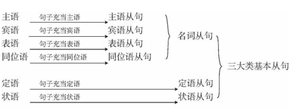

[toc]

&emsp;
&emsp; 
# 0. 英语句子成分划分
## 0.0 英语句子可分为哪些成分？作用是？
&emsp;&emsp; 主谓宾定状补
| 成分              | 作用                                                                                       |
| ----------------- | ------------------------------------------------------------------------------------------ |
| 主语(Subject)     | 主语是句子所要说明的人或事物，是句子的主体                                                 |
| 谓语(Predicate)   | 用来“陈述主语的状态”或者“表明主语发出的动作”                                               |
| 宾语(Object)      | 宾语与主语相对，表示动作的承受者                                                           |
| 定语(Attributive) | “定语”顾名思义就是为了限定句中某个的成分                                                   |
| 状语(Adverbial)   | 状语传递的信息包括：时间、地点、原因、目的、结果、方式、程度等，目的是使表达更为丰满、具体 |
| 补语(Complement)  | 补语，意在补充说明 主语 or 宾语，分别称为 主语补足语 及 宾语补足语                         |

## 0.1 主语(Subject)    
### 0.1.1 主语的含义
&emsp;&emsp; 主语即 **动作的发出者（主谓宾结构中）** 或者 **表述的对象（主系表结构中）**，一般放在句首，有时也放在中间或者句尾。充当主语的可以是名词、代词；也可以是短语、不定式；甚至可以是整个句子。所以，在找主语的时候，脑子里一定要有这些认知。

### 0.1.2 能充当主语的有哪些？
#### （1）名词/代词/数词做主语
**① 名词做主语**
> **Celebrities' marriage** is but a tool for marketing hype.
> 明星的婚姻只是营销炒作的工具。
> 
**② 代词做主语**
> **We** are not lovers any more, but we still care about each other.
> 我们不再是我们，我们依然是我们。
> 
**③ 数词做主语**
> **A billion** is not a big deal for Jack Ma
> 十亿对马云来说是不算什么。
> 

#### （2）不定式/名词化短语做主语
**① 不定式作主语**：
> **To break up** is their final decision.
> 分手是他们最终的决定。
> 
> **To post her attitude on line** is all she can do.
> 她能做的只是在网上表明自己的态度
>
**② 动名词作主语**：
> **Keeping composed** is the basis to overcome difficulties.
> 保持镇定是克服困难的基础。
> 

#### （3）从句做主语（即主语从句）
&emsp;&emsp; 从句做主语的句子，就是我们学过的“主语从句”。主语从句可以由 连词`that/whether`引导；也可以由 关系代词`what/who/which`引导；还可以由 连接副词`how/when/why/where`引导。
> **Whether she will keep it a secret** is unknown us all.
> 我们都不知道她会不会保守秘密。
> 
> **What she has** is nothing but money.她穷得只剩下钱了
> 
> **How they got separated** is a serious problem they need to rethink.
> 他们分手的原因是他们双方都要反思的重要问题
> 

#### （4）有时为了避免头重脚轻，经常会借助“it”充当形式主语，而真正的主语则放在句尾
**(1) 用“that”引导的主语从句**
原句 : 
> That he will pass the exam is certain.
> 
改句:
> **It** is certain that **he will pass the exam**.( 通常用这种句式 )
> `It`是形式主语； `he will pass the exam`是 真正主语
> 
**(2) “疑问句”必须用it做形式主语**
> Is **it** funny that **the tall man and the short girl are a couple**?
> 这个高个子男孩和矮个子女孩居然是夫妻。这是不是很有趣呢?
> `It`是形式主语； `the tall man and the short girl are a couple`是 真正主语
> 

#### （5）`There be …`句型
`there be…`比较特殊。在这种句型中，主语的位置在中间。比如：
> There are six beautiful French ladies walking on the street.
> 大街上有六位漂亮的法国女郎在散步。
> 

&emsp;
## 0.2 谓语(Predicate) 
### 0.2.1 什么是谓语？
&emsp;&emsp; 谓语是句子的灵魂，主要用来“陈述主语的状态”或者“表明主语发出的动作”。谓语用来说明主语“干什么”或“怎么样”的。谓语或谓语部分里的主要词必须用动词。在运用中，谓语和主语在人称和数方面应该保持一致，且谓语应在主语后面

### 0.2.2 能充当谓语的有哪些？
谓语可分为：
> (1) 简单谓语 
> (2) 复合谓语
> 
**但要注意的是，谓语或谓语部分里的主要词必须用动词**

#### (1) 简单谓语 
简单谓语 由一个动词或者一个动词短语构成谓语；
> I **love** my girlfriend.
> 我爱我的女朋友。
> 
> My boss **stayed up** late last night.
> 我的老板昨晚熬夜了。
> 

#### (2) 复合谓语
**① 情态动词/助动词 + 动词**
助动词 + 动词 构成谓语
> I **don' t like** your pants.
> 我不喜欢你的裤子
> 
情态动词 + 动词 构成谓语
> You **should drink** some water.
> 你应该喝一些水
> 
> I **have never seen** such a barefaced guy like you !
> 我从未见过如此厚颜无耻之徒。
> 

**② 系动词 + 表语**
系表结构做谓语：
> I **feel anxious** in front of you.
> 我在你面前紧张
> 
> He **turned out to be fine**.
> 结果他没事儿。
> 
> They **appear to be angry**.
> 他们好像要生气。
> 

**③ 情态动词 + 系动词**
情态动词 + 系动词 做谓语
> You **should be** serious.
> 你应该严肃点。
> 
> We **will be** successful in the future.
> 我们将来会成功的。
> 

&emsp;
## 0.3 宾语(Object)   
### 0.3.1 什么是宾语？  
&emsp;&emsp; 宾语与主语相对，表示**动作的承受者**。名词、代词、数词以及句子都可以做宾语（宾语从句）。
### 0.3.2 能充当宾语的有哪些？
#### （1）直接宾语&间接宾语、代词做宾语、名词做宾语
**① 直接宾语&间接宾语**
> My boyfriend told me a ghost story last night
> 昨晚，我男朋友给我讲了个鬼故事。
> 间接宾语 : `me`
> 直接宾语 ：`a ghost story`
> 
**② 代词做宾语**
> I fancy **you**.
> 我喜欢你。
> 
**③ 名词做宾语**
> I like playing **basketball**.
> 我喜欢打篮球
> 
#### （2）数词、从句 做宾语
**① 数词做宾语**
> I want to fight with **ten of them**.
> 我要打十个!
> 
**② 从句做宾语**
> Nobody knows **who can pass the exam**.
> 没有人知道谁能考过
> 

&emsp;
## 0.4 定语(Attributive)
### 0.4.1 什么是定语？
&emsp;&emsp; “定语”顾名思义就是为了限定句中某个的成分。形容词、数词、代词、从句（定语从句）等成分基本都可以做定语（**动词除外**）。定语在所修饰的词前，就被称为**前置定语**；反之，则为**后置定语**。

### 0.4.2 能充当定语的有哪些？
**① 形容词做定语**
> She is a **lovely** girl.
> 她是一个可爱的女孩儿。
> 
**② 数词做定语**
> I have **two** girlfriends.
> 我有两个女朋友。
> 
**③ 介词短语做定语**
> The girl **in pink** is my daughter.
> 穿粉色衣服的是我女儿。
> 
**④ 名词做定语**
> I have a **pencil** box
> 我有一个铅笔盒。
>
**⑤ 副词做定语**
> The iPad **there** is mine.
> 那个iPad是我的
> 
**⑥ 不定式做定语**
> The boy **to take the ball** is my son.
> 去拿球的男孩是我的儿子。
> 
**⑦ 分词做定语**
> The boy **left** in my friend
> 留下来的男孩是我的朋友。
> 
**⑧ 从句做定语**
> He is the teacher **who teaches us math**.
> 他就是那个教我们数学的老师。
> 

&emsp;
## 0.5 状语(Adverbial)  
### 0.5.1 什么是状语？
&emsp;&emsp; 英语中，状语传递的信息包括：时间、地点、原因、目的、结果、方式、程度等，其使用的目的就是使表达更为丰满、具体。

### 0.5.2 能充当状语的有哪些？
&emsp;&emsp; 副词、不定式、介词、名词、从句等都可以做状语。
**① 副词做状语**
> He is **very** fat.
> 他非常胖。
> 
**② 不定式做状语**
> I come all the way **to see you**.
> 我大老远来看你
> 
**③ 介词短语做状语**
> Which couple of superstars will get divorced **in the future** ?
> 哪一对明星夫妻将来会离婚?
> 
**④ 从句做状语**
> **If I am available tomorrow**, I will come to see you.
> 如果明天有空的话，我会去看你。(条件状语)
> 
**⑤ 分词做状语**
> **Given time**, he will be a good dancer.
> 只要给时间，他会成为一个优秀的舞者
> 
**⑥ 名词做状语**
> I will love you **heart and soul**.
> 我会全心全意地爱你。
> 

### 0.5.3 如何判定哪些成分是“状语”呢？
关键就看这个 词/词组/从句 是否在修饰 动词 or 形容词 or 副词 or 整个句子。

&emsp;
## 0.6 补语(Complement) 
### 0.6.1 什么是补语？
&emsp;&emsp; 补语，意在补充说明 主语 or 宾语，分别称为 **主语补足语** 及 **宾语补足语**，而后者使用更为频繁。

### 0.6.2 主语补足语
> He died **young**.
> 他英年早逝。
> 
> We are born **equal**.
> 我们生来平等
> 
> Beef can be eaten **raw**.
> 牛肉能生吃。
> 

### 0.6.3 宾语补足语
**① 不定式做宾补**
> Your wife won' t allow us to play cards.
> 你媳妇儿不会允许我们打牌的。
> 
**② 名词做宾补**
> They elected me the president.
> 他们选我当总统。
> 
**③ 形容词做宾补**
>I find learning to drive easy.
>我发现学车简单
>
**④ 副词做宾补**
> My wife locked me out.
> 我妻子把我关出来了
> 
**⑤ 现在分词做宾补**
> I smell something burning in the kitchen.
> 我闻见厨房的烧焦味了
> 
**⑥ 过去分词做宾补**
> I find my son seated in the corner.
> 我发现我儿子坐在角落里。
> 

## 0.7 表语
&emsp;&emsp; 表语存在于英语中的“主系表结构”中，主要用来解释说明主语的性质、状态、特性等。

### 0.7.2 能充当表语的有哪些？
&emsp;&emsp; 做表语的可以是名词、形容词、副词介词短语、不定式等或者由整个从句充当表语（即表语从句）。
**① 名词做表语**
> The tall man is a basketball player.
> 这个高个子男人是个篮球运动员。
> 
**② 形容词做表语**
> He is handsome.
> 他很帅。
> 
**③ 数词做表语**
> She is number one.
> 她是第一名
> 
**④ 动词ing做表语**
> His work is sleeping
> 他的工作就是睡觉
> 
**⑤ 不定式做表语**
> My plan is to find a job this month.
> 我的计划就是这个月找个工作
> 
**⑥ 介词短语做表语**
> Everything is under control.
> 切尽在掌握
> 
**⑦ 副词做表语**
> I am behind you.
> 我在你身后(支持你)
> 
**⑧ 从句做表语**
> This is what I told you.
> 这就是我之前告诉过你的
> 

&emsp;
&emsp; 
# 1. 五大基本句型概述
## 1.0 五大基本句型的作用
5大基本句型就是5种能够完整表达一个观点的简单句子。
## 1.1 主语 ＋ 谓语
&emsp;&emsp; 英语句子有长有短， 有简有繁， 从表面上看， 似乎千变万化， 难以捉摸。 但从本质上来说， 英文句子有其内在的规律。 我们先看下面这些句子：
>  I am a Webaholic. 我是一个网虫。
>  I like chatting online. 我喜欢网上聊天。
>  Chatting on the Internet is interesting. 网上聊天很有趣。
>  Chatting on the Internet brings me a lot of fun. 网上聊天给我带来很多乐趣。
>  We can call Internet addicts (上瘾的人) a Webaholic. 我们可以管网上瘾君子叫网虫。
>  Internet dating hurts. 网恋有害。
> 
我们现在来简要分析一下上面这些句子。 我们可以把这些句子以动词为分界线， 分割成两部分。 如下表所示：
| 陈述的对象(主语部分)       | 陈述的内容(谓语部分)                     |
| -------------------------- | ---------------------------------------- |
| `I`                        | `am a Webaholic.`                        |
| `Chatting on the Internet` | `is interesting.`                        |
| `I`                        | `like chatting online.`                  |
| `Chatting on the Internet` | `brings me a lot of fun.`                |
| `We`                       | `can call Internet addicts a Webaholic.` |
| `Internet dating`          | `hurts.`                                 |
从以上表格我们发现， 一个句子可以分为下面两个部分：
> ①是， 以代词（I, We）、名词（Internet dating）或 名词短语（chatting on the Internet） 开头， 来表明我们要陈述的对象，这就是句子的**主语**。
> ②是， 在主语的后面紧接动词， 如am， is， like， bring， can call和hurt， 来说明主语做什么， 或描述主语的状况。 动词及其后面的成分， 我们称之为**谓语**部分。
> 
从这几个简单的例句我们可以总结出， 一个完整的句子都由两部分组成：
> 陈述对象 ＋ 陈述内容
> 
这里的陈述对象一般是由名词或相当于名词的成分来充当，用语法术语来说叫做主语。而陈述内容则是说明主语怎么样了，都是用动词来表达，我们称之为谓语。因此，一个完整的英文句子就是：
> `主语 ＋ 谓语` 或 `名词 ＋ 动词`
> 
所以， 英文句子的结构有自己的规律，总是要写出“主语＋谓语”。我们还可以进一步思考：“英文句子为什么非得要有主语和谓语动词呢？ ”
其实， 我们可以从哲学高度来找到答案。 辩证唯物主义认识世界的基本出发点是：
> 世界统一于物质， 即世界是由物质组成的；
> 物质的存在形式是运动。
>
&emsp;&emsp; 因此， 人们对世界的认识可归结为“物质的运动”或“运动的物质”。
&emsp;&emsp; 而语言作为人类思维认识的载体， 自然也得体现这一客观规律“物质＋运动”→“名词＋动词”→“主语＋谓语动词”。
&emsp;&emsp; 因此， 今后我们写英文句子时， 通常就要写出主语， 还要写出谓语动词； 既要有“陈述对象”， 又要有“陈述内容”， 这样才能表达一个完整的意思。

&emsp; 
## 1.2  五种基本句型概述
&emsp;&emsp; 进一步研究之后我们还会发现，上述句子的动词后面所接的成分长短不一，于是我们又可以把这些句子进行进一步细分。 如下表所示：
| 主语                       | 谓语动词   | 其它部分(1)              | 其它部分(2)                 | 五种句型                            |
| -------------------------- | ---------- | ------------------------ | --------------------------- | ----------------------------------- |
| `I`                        | `am `      | `a Webaholic.`(表语)     |                             | ① 主语 + 系动词 + 表语              |
| `Chatting on the Internet` | `is `      | `interesting.`(表语)     |                             |                                     |
| `Internet dating`          | `hurts.`   |                          |                             | ② 主语 + 谓语                       |
| `I`                        | `like`     | `chatting online.`(宾语) |                             | ③ 主语 + 谓语 + 宾语                |
| `Chatting on the Internet` | `brings`   | `me`(间接宾语)           | `a lot of fun.`(直接宾语)   | ④ 主语 + 谓语 + 间接宾语 + 直接宾语 |
| `We`                       | `can call` | `Internet addicts`(宾语) | `a Webaholic.` (宾语补足语) | ⑤ 主语 + 谓语 + 宾语 + 宾语补足语   |
**之所以有这五种基本句型， 关键在于谓语动词。** 根据动词后面是否有宾语和补语， 我们可以把句子分为五种， 即构成英语简单句的五种基本句型。 

&emsp;
&emsp; 
# 2. 句型一： 主语 ＋ 系动词 ＋ 表语
## 2.1 简述
&emsp;&emsp; 该句型的谓语动词是系动词（ 如be或其他系动词）。所谓**系动词**，又叫联系动词（linking verb） ，顾名思义，这种动词并不表示具体的动作，而只是起连接主语和后面成分的作用。这种动词后面所接的成分是用来说明主语的特点，表明主语的性质特征的，因此我们称之为主语补足语，或**表语**（ 能表示主语特征的成分）。 我们以下句为例来进行思维分析：
> He looks happy.
> 他看起来很高兴。
> 
比如， 我们要描写“他（ he）”， 说“他怎么样了”，如果没有happy跟在looks后面，只是说： He looks（ 他看起来） 这样的句子显然不能表达完整的意思。 而我们现在把happy这个形容词放在looks的后面， 通过looks来连接he和happy， 来说明“他”的状况， 即补充说明了主语的特征。 因此， 我们把系动词后面的成分叫做主语补足语， 因为它是补充主语的。 语法术语又把它称为表语——能表示主语特征的成分。再看其他例句：
> I am a Webaholic. 我是一个网虫。
> Chatting on the Internet is interesting. 网上聊天很有趣。
> Learning English is important. 学习英文很重要。
> The music sounds nice. 这音乐很好听。
> He became a teacher. 他成了一名老师。
> The leaf will turn yellow in autumn. 树叶在秋天会变黄。
> 
英文中最常见的系动词是`be`动词， 其具体的形式有： `am (I am), is (he is, she is, it is), are (you are, we are,they are)`。 其他的系动词见《动词》那一章的笔记。
由以上例句我们可以看出， 用作表语的词通常是名词（如Webaholic和teacher等） 和形容词（ 如interesting, important, nice和yellow等）。副词一般不作表语， 比如我们不能说：
> ~~He looks happily.~~
>

&emsp;
## 2.2 简单句叠加成复杂难句
&emsp;&emsp; 了解“主系表”句型结构之后，下面将举例说明该句型如何演变为一个结构较为复杂的难句， 以使读者了解简单句与复杂句之间的联系。 请看例句：
> ① Vitamins are organic compounds.
> 维生素是一种有机化合物。
> 
这个句子的主语是`vitamins`， 谓语是系动词`are`， 名词短语`organic compounds`是表语。

&emsp;&emsp; 这个句子很简单， 但现在要逐步将其复杂化。 比如在名词`compounds`后面添加一个后置定语， 如下句：
> ② Vitamins are organic compounds necessary for the normal growth of life.
> 维生素是一种有机化合物， 是生命正常生长所必不可少的。
> 
这里我们添加了一个形容词短语`necessary for the normal growth of life`， 来后置修饰名词`compounds`。

&emsp;&emsp; 我们进一步把后置定语复杂化，比如下句：
> &emsp;&emsp; ③ Vitamins are organic compounds necessary for the normal growth and maintenance of life of animals, including man.
> &emsp;&emsp; 维生素是一种有机化合物， 是所有动物（包括人类） 的正常生长和生命延续所必不可少的。
> 
这里的形容词短语是`necessary for the normal growth and maintenance of life of animals, including man`， 依然后置修饰名词`compounds`。

&emsp;&emsp; 我们还可以把上句进一步复杂化， 比如下句：
> &emsp;&emsp; ④ Vitamins are organic compounds necessary in small amounts in the diet for the normal growth and maintenance of life of animals, including man.
> &emsp;&emsp; 维生素是一种有机化合物， 尽管在饮食中的含量很少， 但却是所有动物（包括人类） 正常生长和生命延续所必不可少的。
> 
本句子是1996年考研完形填空真题的第一句话。 这里是在`necessary`和`for`之间添加了介词短语`in small mounts in the diet`，整个形容词短语是`necessary in small amounts in the diet for the normal growth and maintenance of life of animals, including man`， 依然后置修饰名词`compounds`。

&emsp;&emsp; 比较上面各句可以发现， 最后一句话显然要比第一句复杂得多， 但是基本句型并没有改变， 其核心结构依然是`vitamins are organic compounds`这一主系表句型。 所以读者应该看到， 对于难句的分析和解读， 关键在于对句型结构的分析。

&emsp;
&emsp; 
# 3. 句型二： 主语 ＋ 谓语
## 3.1 简述
&emsp;&emsp; 该句型的 谓语动词 是 **不及物动词（intransitive verb）**，所表示的动作没有作用对象，其本身的意思完整，其后不需带宾语。在词典中表示为`vi.`。我们以下句为例来进行思维分析：
> He died.
> 他死了。
> 
比如我们说“他死了（ died） ”，“死（ died） ”这个动作就只是主语自主完成的， 并没有作用对象， 不是说“他”死了还找一个人来“垫背”。 所以在die这个不及物动词的后面不能再接宾语了。 比如我们不能说： ~~He died his wife.~~ 这并不是说“他让他的妻子死了”。如果真要说“他把他的妻子弄死了”， 则要用及物动词， 比如`kill`， 说成：`He killed his wife.`
再比如， 我们说：
> These children are playing.
> 这些孩子正在玩耍。
> 
该句中的`play`本身已经表达了完整的意思， 也没有作用的对象， 即这句话并没有告诉我们孩子们在玩什么。再看其他例句：
> Internet dating hurts. 网恋有害。
> The fire is burning. 火在燃烧。
> Children giggle. 孩子们咯咯地笑。
> The sun rises and the sun sets. Stars glitter and stars vanish. 日出日落， 星闪星陨。
> The sun sets in the west. 太阳从西边落山。
> He works hard. 他工作很勤奋。
>
我们再看最后两个句子：
> The sun sets in the west.
> He works hard.
>
这种句型中的谓语动词的后面虽然不接宾语，但通常会接 副词（ 如`hard`） 或 介词短语（ 如`in the west`）来说明动作的方式、地点或时间等等。 英文中把这种修饰动作的成分称作**状语**。 例如：
> They shouted loudly.
> 他们大声地嚷嚷起来。
> 
这里的副词`loudly`表示动作的方式， 叫做**方式状语**。

> He died in 2007.
> 死于2007年。
> 
这里的介词短语`in 2007`表示动作的时间， 叫做**时间状语**。

> An eagle's egg was placed in the nest of a prairie chicken.
> 一只苍鹰的蛋被放置在一只草原土鸡的窝里。
> 
|                                    |          |
| ---------------------------------- | -------- |
| `An eagle's egg`                   | 主语     |
| `was placed`                       | 谓语     |
| `in the nest of a prairie chicken` | 地点状语 |

> It scratched in the dirt for seeds
> 它在土里找种子吃。
> 
|               |          |
| ------------- | -------- |
| `It`          | 主语     |
| `scratched`   | 谓语     |
| `in the dirt` | 地点状语 |
| `for seeds`   | 目的状语 |

最后， 读者需要能够区分 “主系表” 和 “主谓状” 两种句型。 请注意比较：
> ① He shouted loudly.
> ② He looks happy.
> 
妙语点睛
在例句① 中，`shouted`是不及物动词，副词`loudly`修饰动作`shouted`，作状语。 
在例句② 中，`looks`是系动词， 没有具体的动作。 形容词`happy`不是修饰`looks`的，而是补充说明主语he的特征，作表语。

&emsp;
## 3.2 简单句叠加成复杂难句
&emsp;&emsp; 下面举例说明该句型如何演变为一个结构较为复杂的难句，以使读者了解简单句与复杂句之间的联系。 请看例句：
> This trend began during the Second World War.
> 这种趋势始于第二次世界大战期间。
> 
该句的主语是`this trend`， 谓语`began`是一个不及物动词， 后边没有带宾语。 介词短语`during the Second World War`作时间状语。
&emsp;&emsp; 下面开始一步步把这个句子复杂化。 比如：
> This trend began during the Second World War, when several governments came to this conclusion.
> 这种趋势始于第二次世界大战期间， 当时一些国家的政府得出这样的结论。
> 
这里加了一个定语从句`when several governments came to the conclusion`， 来修饰时间`Second World War`。 这个定语从句是一个“主语＋谓语＋宾语”的句型， 主语是`several governments`， 谓语是短语动词`came to`， 宾语是`the conclusion`。
&emsp;&emsp; 我们再进一步把这个句子复杂化， 比如：
> &emsp;&emsp; This trend began during the Second World War, when several governments came to the conclusion that the specific demands cannot generally be foreseen in detail.
> &emsp;&emsp; 这种趋势始于第二次世界大战期间， 当时一些国家的政府得出结论： 具体要求通常是无法详尽预见的。
> 
这里添加了一个同位语从句`that the specific demands cannot generally be foreseen in detail`， 补充说明`conclusion`。 这个同位语从句也是一个“主语＋谓语”的句型， 这里的主语是`the specific demands`， 谓语是一个被动结构`cannot generally be foreseen`， 介词短语`in detail`作状语。
&emsp;&emsp; 我们再进一步把这个句子复杂化， 比如：
> &emsp;&emsp; This trend began during the Second World War, when several governments came to the conclusion that the specific demands that a government wants to make of its scientific establishment cannot generally be foreseen in detail.
> &emsp;&emsp; 这种趋势始于第二次世界大战期间， 当时一些国家的政府得出结论： 政府想向科研机构提出的具体要求通常是无法详尽预见的。
> 
这就是1996年的考研翻译真题， 这里添加了一个定语从句`that a government wants to make of its scientific establishment`， 来修饰`demands`。 这个定语从句是一个“主语＋谓语＋宾语”的句型， 主语是`a government`， 谓语是`wants`， 宾语是`to make of its scientific establishment`。 很多读者也许看不出这里`that`作定语从句的何种成分。 其实， 这里的`that`指代先行词`demands`， 在定语从句中作谓语`make`的宾语， 从而构成一个`make demands of`的搭配， 表示“对……提出要求”。 很多读者由于不熟悉这个搭配而不理解定语从句的结构， 结果造成不理解句子的意思。 由此可见， 掌握一定的短语搭配对于理解句子的结构是非常重要的。

&emsp;&emsp; 综上所述，上面这个复杂的句子其实是由四个简单句复合而成的，即有两个“主语＋谓语”结构的句
子： `this trend began during the Second World War`和`the specific demands cannot generally be foreseen in detail`，还有两个“主语＋谓语＋宾语”结构的句子： `several governments came to the conclusion`和`a government wants to make of its scientific establishment`。

&emsp;
&emsp; 
# 4. 句型三： 主语 ＋ 谓语 ＋ 宾语
## 4.1 简述
&emsp;&emsp; 该句型的谓语动词是 及物动词（transitive verb），这种动词告诉我们由主语发出的动作所作用的对象是什么，这里所作用的对象就是我们通常称之为宾语的，即宾语是主语动作的承受对象，因此这类动词是带有宾语的。 英文中的绝大多数动词都是及物动词， 在词典中标为vt.。 我们以下句为例来进行思维分析：
> These children are playing football.
> 这些孩子正在踢足球。
> 
此句告诉我们孩子们在玩什么，这里的`football`是动作`play`的作用对象，是宾语。此时的`play`是及物动词。
请比较：
> ① These children are playing football.
> ② These children are playing.
> 
> 这些孩子正在踢足球。
> 这些孩子正在玩耍。   
> 
&emsp;&emsp; 在例句①中，`play`用作及物动词，其后面带有名词`football`作为`play`的作用对象，即宾语。 
&emsp;&emsp; 在例句②中，`play`用作不及物动词，其后面没有宾语。
&emsp;&emsp; 由此可见， play既可以用作及物动词， 又可以用作不及物动词， 但意思和用法都不一样。 事实上， 英语中大多数动词都像play一样， 既可以用作及物动词， 又可以用作不及物动词， 但意思和用法都不一样。
请看其他例句：
> I love English. 
> 我喜欢英语。
> 
此外，这种句型的宾语后面也可以接副词或介词短语作状语。例如：
> I like chatting on the Internet.
>
该句中的介词短语`on the Internet`修饰动作`chatting`，作状语。
> He speaks English well.
>
该句中的副词`well`修饰动作`speaks`， 作状语。

&emsp; 
## 4.2 简单句叠加成复杂难句
&emsp;&emsp; 讨论完“主谓宾”句型结构之后，下面将举例说明该句型如何演变为一个结构较为复杂的难句，使读者了解简单句与复杂句之间的联系。 请看例句：
> ① The emphasis helped to obscure the great importance.
> 这种强调模糊了这一重要性。
> 
该句的主语是`the emphasis`，谓语是`helped`，宾语是`to obscure the great importance`不定式短语。
&emsp;&emsp; 下面开始一步步把这个句子复杂化， 比如：
> ② The emphasis given by both scholars and statesmen helped to obscure the great importance.
> 学者和政治家们的这种强调模糊了这一重要性。
> 
这里是在主语`emphasis`后面添加了一个分词短语`given by both scholars and statesmen`，作后置定语， 表明是谁在强调。
&emsp;&emsp; 再进一步把这个句子复杂化， 比如：
> &emsp;&emsp; ③ The emphasis given by both scholars and statesmen to the presumed disappearance of the American frontier helped to obscure the great importance.
> 学者和政治家们强调美国边疆消失的假设， 这种强调模糊了这一重要性。
> 
这里添加了一个介词短语`to the presumed disappearance of the American frontier`。 这个介词短语修饰哪个部分？ 其实这个介词短语是补充说明主语`emphasis`的， 表明强调的内容是什么。
&emsp;&emsp; 再进一步把这个句子复杂化， 比如：
> &emsp;&emsp; ④ The emphasis given by both scholars and statesmen to the presumed disappearance of the American frontier helped to obscure the great importance of changes in the conditions and consequences of international trade.
> 学者和政治家们强调美国边疆消失的假设， 这种强调模糊了国际贸易的条件和后果方面发生变化的巨大作用。
> 
这里在`importance`后面添加了介词短语`of changes in the conditions and consequences of nternational trade，` 作后置定语。 这里还要搞清楚并列关系， 不是`changes in the conditions`和`consequences of international trade`并列， 而是`conditions`和`consequences`并列， 然后介词短语o`f international trade`修饰`conditions and consequences`， 表示“国际贸易的条件和后果”。 最后整个介词短语`in the conditions and consequences of international trade`修饰`changes`， 表示在哪方面发生的变化， 即“在国际贸易的条件和后果两方面发生的变化”。
&emsp;&emsp; 再进一步把这个句子复杂化， 比如：
> &emsp;&emsp; ⑤ The emphasis given by both scholars and statesmen to the presumed disappearance of the American frontier helped to obscure the great importance of changes in the conditions and consequences of international trade that occurred during the second half of the nineteenth century.
> &emsp;&emsp; 学者和政治家们强调美国边疆消失的假设， 这种强调模糊了在19世纪后半期发生在国际贸易的条件和后果两方面的变化的巨大作用。
> 
这里在`international trade`后面添加了定语从句`that occurred during the second half of the nineteenth century`， 作后置定语。 这个定语从句则是一个“主语＋谓语”的句型， 其主语是关系词`that`， 谓语是`occurred`。
&emsp;&emsp; 综上所述， 这个复杂的句子其实就是一个“主语＋谓语＋宾语”的句型， 即`the emphasis...helped to obscure the great importance...`。 其内部又带有一个“主语＋谓语”的句型， 即`that occurred...`。

&emsp;
&emsp; 
# 5. 句型四： 主语 ＋ 谓语 ＋ 间接宾语 ＋ 直接宾语
注意间接宾语在前，直接宾语在后
## 5.1 简述
&emsp;&emsp; 该句型的谓语动词是 **双宾动词（dative verb）**，这种动词的后面所接成分有“人”又有“物”。一般来讲，这里的“人”表示动作的接受者，称作间接宾语（indirect object）。“物”表示动作作用的对象，是动作的承受者，称作直接宾语（direct object）。间接宾语和直接宾语合起来叫做双宾语。请看例句：
> Chatting online will bring you a lot of fun. 网上聊天会给你带来很多乐趣。
> He lent me ten yuan. 他借给我10块钱。
> I will buy you a meal. 我会请你吃顿饭。
> l gave him my book. 我把我的书给他了。
> He showed the guard his passport. 他把通行证给门卫看了。
>
上述例句中的`you, me, him`和`the guard`都是间接宾语， 表示“人”；`a lot fun, ten yuan, a meal, my book`和`his passport`都是直接宾语，表示“物”。

&emsp;
## 5.2 简单句叠加成复杂难句
&emsp;&emsp; 讨论完“主谓双宾”的句型结构之后，下面将举例说明，该句型如何演变为一个结构较为复杂的难句，使读者了解简单句与复杂句之间的联系。 请看例句：
> Her work won her the Nobel Prize in 1983.
> 她的工作使她赢得了1983年的诺贝尔奖。
> 
该句的动词`won`是一个双宾动词， 其后要接双宾语， 即`win sb. sth.`， 表示“为某人赢得某物”。 这里的`her`是间接宾语， `the Nobel Prize`是直接宾语。
&emsp;&emsp; 可以把这句话稍微变得复杂一点， 如下句所示：
> Her work in genetics won United States scientist Barbara McClintock the Nobel Prize in 1983.
> 芭芭拉·麦克克林托克在遗传学领域的研究成果，使她赢得了1983年的诺贝尔奖。
> 
|                                            |                     |
| ------------------------------------------ | ------------------- |
| Her work in genetics                       | 主语                |
| won                                        | 谓语                |
| United States scientist Barbara McClintock | 间接宾语            |
| the Nobel Prize                            | 直接宾语            |
| in 1983.                                   | 时间状语，修饰`won` |

这句话的间接宾语较长，即`United States scientist Barbara McClintock`， 直接宾语是`the Nobel Prize`， 原句型仍为`win sb. sth.`， 即表示“为某人赢得某物”。
&emsp;&emsp; 上面两句虽然复杂程度不同， 但句型结构完全一样， 都是动词win后面带有一个双宾语的结构。

&emsp;
&emsp; 
# 6. 句型五： 主语＋谓语＋宾语＋宾语补足语
## 6.1 简述
&emsp;&emsp; 该句型中的谓语动词是**宾补动词（factitive verb）** ， 这种动词的后面接宾语，而此宾语的后面又接 补充说明宾语的补足语（object complement）。 宾语和宾语补足语合起来叫做**复合宾语**。 请看例句：
> We can call Internet addicts a Webaholic. 我们可以管网上瘾君子叫网虫。
> We elected John chairman. 我们选约翰作主席。
> I found this answer wrong. 我发现这个答案是错误的。
> You can leave the door open. 你可以把门开着。
> A hedge (树篱) between keeps friendship green. 保持距离， 友谊长青。 （这句话可引申为“君子之交淡如水”。）
>
上述例句中的画线部分都是补足语， 补充说明前面的宾语。 比如我们若只说`You can leave the door.`就表示“你可以把门”， 这句话的意思显然不完整， 于是我们要对宾语the door进一步补充说明一下， 说成`You can leave the door open.`这样句子的意思才完整。

&emsp;
## 6.2 区分双宾语和复合宾语
&emsp;&emsp; 现在请读者比较一下上一节讲的“主语＋谓语＋双宾语”句型和本节讨论的“主语＋谓语＋复合宾语”句型， 学会区分双宾语和复合宾语。 其实，区分这两种宾语的方法很简单：
> &emsp;&emsp; 在宾语的后面加上`be`动词，若能构成一个语义通顺的句子，则是补足语。因为宾语与宾语补足语的语义关系就相当于主语与主语补足语的关系，即类似一个“主系表”结构，所以，在宾语的后面添上一个系动词be，自然就应该能构成一个逻辑语义通顺的句子。而间接宾语与直接宾语之间就没有这样的语义关系，所以，添上be之后，自然就不能构成一个语义通顺的句子。 
> 
请比较：
> ① I made John our chairman.
> ② I made John a cake.
>
> ① 我选了约翰当我们的主席。
> ② 我给约翰做了一块蛋糕。
> 
&emsp;&emsp; 在例句① 中， 在宾语`John`的后面添上一个is， 即`John is our chairman`.这说得通， 所以例句① 中的`our chairman`是宾语补足语。 
&emsp;&emsp; 相反， 在例句② 中， 在宾语`John`的后面添上一个`is`， 即~~John is a cake.（约翰是一块蛋糕。）~~这显然讲不通， 所以例句②是一个双宾语结构， `a cake`是一个直接宾语。

&emsp;&emsp; 再来看下面较难的句子：
> ① She will make him a good husband.
> ② She will make him a good wife.
>
> ①她会把他变成一个好丈夫的。
> ②她会成为他的好妻子的。
> 
乍看起来，这两个句子仅`husband`和`wife`一词之差，但两者在句型结构上不同，意思的差别自然也很大。在例句①中，在宾语`him`后面添上一个`is`，即`He is a good husband．`这说得通，所以例句`①`是一个复合宾语结构， 句中的`a good husband`是宾语补足语。 然而在例句②中， 在宾语him后面添上一个`is`， 即~~`He is a good wife`．（他是一个好妻子。）~~这显然有悖常理，所以例句② 是一个双宾语结构， `a good wife`是直接宾语。 另外， 例句② 可以改写为`She will make a good wife for him`． 即表示“她可以成为他的一个好妻子”。
&emsp;&emsp; 实际上， 这里的`make`在两个例句中的意思是不一样的，在例句① 中，`make`是大家熟悉的使役动词， 英文解释是`to cause to be or become`，表示“使……成为”； 而在例句② 中， make并非使役动词， 英文解释是`to develop into`， 表示“变成为”。
&emsp;&emsp; 从这对特殊的例句可以看出，利用上面介绍的方法来区分这两类宾语，对于正确理解句子是非常重要的。 对于make作为“变成为”的意思，请读者再看下面这个例句：

> &emsp;&emsp; I said to him, "Monsieur le President, I have no reason to refuse." Carla is living an authentic love story. I think that they make a good couple.
>
> &emsp;&emsp; 我对他说： “总统先生， 我没有理由拒绝你。 ”卡拉正在经历一个真实的爱情故事。 我想他们是很般配的一对。
> 
这是意大利名模卡拉·布鲁尼的母亲玛丽萨·布鲁尼说的一句话。法国总统尼古拉·萨科齐于2008年2月与其女友卡拉·布鲁尼结婚，这是他的第三次婚姻，婚期距他与第二任妻子塞西莉亚离婚还不到四个月。
&emsp;&emsp; 该句中的`make`就是表示“成为”的意思， 相当于上一个例句中的`make(a good wife)`。

&emsp;&emsp; 请再看下面这个例句：
> &emsp;&emsp; Recent technology gives computers both audio and video capability, making them multimedia machines with interactive potential.
>
> &emsp;&emsp; 近几年的技术发展， 计算机具备了视听功能， 这就使得它成为能与我们人类进行互动的一个多媒体机器。
> 
这里的`computers`与`both audio and video capability`的关系，不同于`them`与`multimedia machines with interactive potential`的关系， 因为~~Computers are both audio and video capability.*（计算机是视听功能。）~~ 讲不通， 而`They (computers) are multimedia machines with interactive potential.`（计算机是一个能与人类进行互动的多媒体机器。 ）讲得通。所以，这里的`computers`应是间接宾语， `both audio and video capability`是直接宾语， 而`multimedia machines with interactive potential`应是宾语`them`的补足语。

&emsp;
## 6.3 简单句叠加成复杂难句
&emsp;&emsp; 讨论完“主谓＋复合宾语”的句型结构之后，下面举例说明该句型如何演变为一个结构较为复杂的难
句， 使读者了解简单句与复杂句之间的联系。 请看例句：
> Willa Cather considered this novel her best work.
> 维拉·凯瑟认为这部小说是她最好的一部作品。
> 
该句的动词`considered`是一个宾补动词，其后不但要带宾语`this novel`，还要接宾语补足语`her best work`，补充说明前面的宾语。若只说`Willa Cather considered this novel`，这句话的意思显然不完整， 于是要对`this novel`补充一下，加上补足语`her best work`，说成`Willa Cather considered this novel her best work.` 这样句子的意思才完整。
&emsp;&emsp; 现在可以把这句话稍微变得复杂一点，比如把宾语复杂化，如下句所示：
> Willa Cather considered her novel of life in nineteenth-century Nebraska, My Antonia her best work.
> 维拉·凯瑟认为她的那部描写19世纪内布拉斯加州生活的小说《我的安东尼奥》 是她最好的一部作品。
>   
这句话的宾语较长， 是`her novel of life in nineteenth-century Nebraska, My Antonia`， 其中`My Antonia`是小说的名字，与名词短语`her novel of life in nineteenth-century Nebraska`构成同位语。宾语补足语是`her best work`。
&emsp;&emsp; 上面两句话的复杂程度不同， 但句型结构完全一样， 都是动词`consider`后面带有一个复合宾语的结构。

&emsp;
&emsp;
# 7 从简单句到复合句
&emsp;&emsp; 以上简单地介绍了英语的五种句型结构， 它们是构成英语复杂难句的基础。 换句话说， 英文中各种复杂的难句都是由这五种基本句型通过扩展、 组合、 省略、 倒装等各种形式的变化得来的， 这一点已经通过
以上各节中的例句不同程度的复杂变化有了初步的了解。 下面再来简单考察一下从简单句如何过渡到复合
句。
&emsp;&emsp; 一般来讲， 一个句子除了有主语和谓语之外， 其他可能包含的成分还有宾语、 表语、 定语、 状语、 补语和同位语等。 在这些成分中， 谓语较为特殊， 只能由动词来充当， 而其他成分则可以由词、 短语或者句子来充当。 如果用一个完整的句子来充当另一个句子的某个成分时， 即构成相应的从句。 请看如下图表：

  

谓语： 各种谓语动词的变化形式
&emsp;&emsp; 从以上的图表看出， 谓语是不能用句子来充当的， 否则就会有“谓语从句”了。 而其他成分可以用句子来充当， 于是便有了各类从句。 **三大从句**具体分类如下：
&emsp;&emsp; **(1) 名词从句**： 包括主语从句、 宾语从句、 表语从句和同位语从句。 我们知道， 名词在英语中可作主语、 宾语、 表语和同位语这四种成分， 因而这四种从句在句子中的作用相当于名词， 故将此四类从句又统称为名词从句。
&emsp;&emsp; **(2) 形容词从句**： 或叫关系从句（relative clause） 或定语从句。 因为形容词最大的特点就是在句中起限定或修饰作用， 用作定语， 故常称为定语从句。
&emsp;&emsp; **(3) 副词从句**： 副词在英语中常用来修饰动词、 形容词和副词， 用作状语， 故又称为状语从句。
&emsp;&emsp; 其实， 以上图表列出了英语中的重要语法项目， 包括两大类： 从句和谓语

