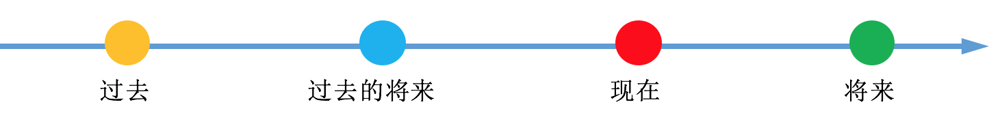
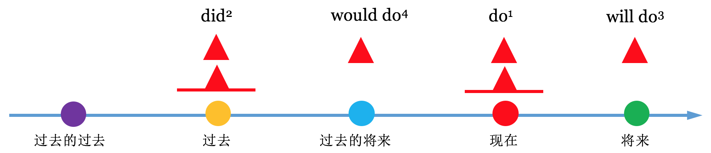
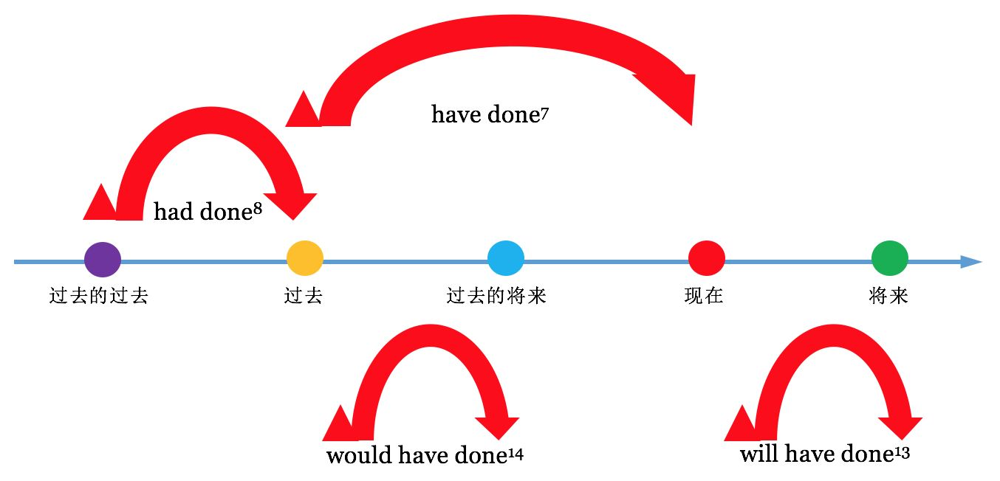
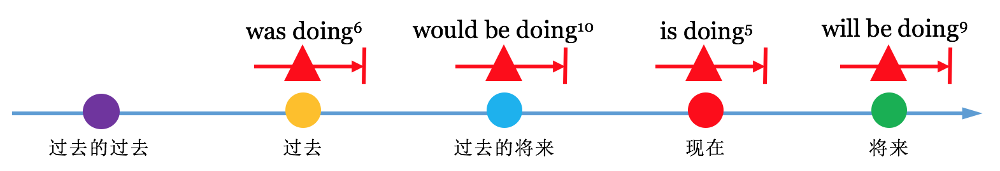
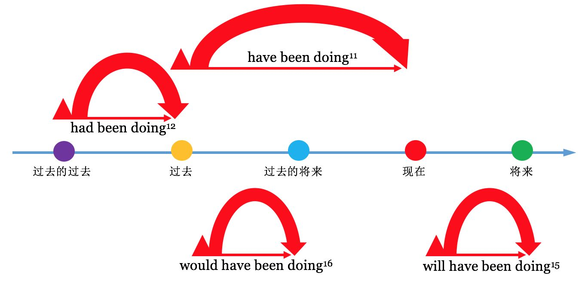

[toc]

&emsp;
&emsp; 
# 1. 综述
## 1.1 什么是 时态？
&emsp;&emsp; 所谓 时态，就是 **时间 + 状态**，“时“ 指动作发生的时间，”态“ 指动作的样子和状态。
## 1.2 时间
时间分为
> ① 过去
> ② 过去将来
> ③ 现在
> ④ 将来
>
按时间轴表示如下：

  

## 1.3 状态
### 1.3.1 状态的定义
&emsp;&emsp; 状态指的是在某个时刻这个动作所处于的状态。

### 1.3.2 状态的种类
状态分为四种： 
**① 一般**
>
>
**② 进行**
>
>
**③ 完成**
>
>
**④ 完成进行**
>
>

## 1.4 16种时态汇总
| 状态 \ 时间  | 现在                                   | 将来                                | 过去                                     | 过去将来                            |
| ------------ | -------------------------------------- | ----------------------------------- | ---------------------------------------- | ----------------------------------- |
| **一般**     | do  一般现在时                     | will do  一般将来时             | did  一般过去时                      | would do  过去将来时            |
| **完成**     | have done  现在完成时              | will have done  将来完成时      | had done  过去完成时                 | would have done  过去将来完成时 |
| **进行**     | be (am/ is/ are) doing  现在进行时 | will be doing  将来进行时       | be (was/ were) doing  过去进行时     | would be doing  过去将来进行时  |
| **完成进行** |                                        | have been doing  现在完成进行时 | will have been doing  将来完成进行时 | had been doing  过去完成进行时  | would have been doing  过去将来完成进行时 |

&emsp;
&emsp; 
# 2. 一般时

  

## 2.1 一般现在时
### (1) 表示**现时的** 知觉、状态、所有
> ① I smell something burning.
> ② You look worried.
> ③ He is a student.
> 

### (2) 表示 经常发生（或反复发生）的动作
> ① He gets up at six. 他六点起床。 
> ② She works eight hours a day. 她每天工作八小时。 
> ③ Do you often wash your hair? 你经常洗头吗？
> 

### (3) 表示 真理、事实、格言
> ① The sun rises in the east.
> ② Metal expands when heated. 金属加热后会膨胀。
> 

### (4) 表 将来
1） 在口语中，一般现在时可以表示按规定、计划或时间表要发生的事，通常都有一个表示未来时间的 状语，且一般和`begin、start、arrive、leave、come、go、return` 混用： 
> ① The plane takes off at 9:20 a.m. 飞机早上九点二十分起飞。 
> ② Their delegation arrives here tomorrow afternoon. 他们的代表团明天下午到达。 
> ③ I'm in my office from two to five this afternoon. 今天下午两点到五点我在办公室。 
> ④ When does the play begin? 戏几点开始？
> 
2）在时间或条件从句中，须用一般现在时表示将来动作： 
> ① If I see Nancy I'll ask her. 如果我见到南希我会问她。 
> ② I'll discuss this with you when we meet. 我们见面时我将和你商讨此事。 
> ③ I'll tell her after you leave. 你走之后我再告诉她。
> 
3）还有一些其他从句中，可以用一般现在时表示将来动作： 
> ① I hope that you feel better soon. 我希望不久你能感觉好一点。 
> ② Suppose he doesn't come, shall we go without him? 假如他不来，我们就自己去吗？ 
> ③ Assuming it rains tomorrow, what shall we do? 假定明天下雨，我们该怎么办？
> 

### (5) 表现刻的动作
1）在一定的情况下，一般现在时可以表示现刻的动作，例如： 
① 球赛解说： 
> Hunt takes the ball forward quickly. Palmer comes across, tries to intercept him, but Hunt slips past and quickly pushes the ball to Smart. Now Smart gathers the ball. 
> 亨特快速向前带球，帕尔默跑过来企图 截住他，亨特闪过身，迅速把球传给斯马特，斯马特接住球。
> 
② 演示说明： 
> The teacher said, "Watch me. I'm doing a dangerous experiment. Now watch me. I switch on the current, and stand back..." 
> 教师说，“现在看着我，我做一个危险的实验。注意，我现在接通电流，往后 站…” 
> 
③ 动作描述或舞台动作描述： 
> When the curtain rises, Juliet is writing at her desk. Suddenly the window opens and a masked man enters. 
> 幕启时，朱丽叶在办公桌旁写东西。突然窗户开了，进来一个蒙面男子。 
> He sits down, shivers a little. Clock outside strikes twelve. 
> 他坐了下来，微微有些颤抖，外面钟敲了十 二点。
> 
2）还可用来表示一些没有时间性的动作： 
① 剧情介绍： 
> In Death on the Nile, Linet Ridgeway is the young and beautiful heiress to an immense fortune, but she has a lot of enemies. 
> 在《泥罗河上的惨案》中，年轻貌美的林奈·里奇韦是一大笔财产的继承人，但 她有很多敌人。 
> How does the story end ? 
> 故事怎样结局？ 
> The scene of this opera is set in Switzerland. 这部歌剧的故事发生在瑞士。 
> 
② 讲书面材料的内容： 
> I've just got a letter from Helen. She says she's coming to India next week.
> 我刚收到海伦的一封信，她说 下星期要来印度。 
> 
> What does the notice say？——It says, "No parking." 
> “告示说什么？”——说“禁止泊车。” 
> 
> Shakespeare says, "Neither a borrower nor a lender be." 
> 莎士比亚（在书中）说，“既不要向人借钱，也 不要借钱给人。” 
> 
> A notice at the end of the road warns people not to go any further. 
> 路尽头有个告示，警告路人不要再往 前走。 
> 
> Chaucer writes that love is blind. 
> 乔叟写道，爱情是盲目的。 
> 
③ 用来指引道路： 
> "How do I get to the station?" "You go straight on to the traffic lights, then you turn right."“火车站怎么 走？”“你径直往前走，到红绿灯处往右拐。” 
> 
④ 图片的说明： 
> The Queen arrives for the opening of Parliament. 
> 女王出席议会开幕式。 
> 
⑤ 用在`here`和`there` 后面： 
> Here Comes The Bride. 娘来了; 结婚进行曲;
> Here comes the bus! 公共汽车来了！ 
> Here Comes the Sun 太阳出来了。
> There goes the bell. 铃响了。
> 

### (6) 表示过去的动作
#### 1）有少数动词（如say， tell， hear等）可以用一般现在时表示过去发生的情况： 
> He says he can't wait any longer. 他说他不能再等了。 
> My friends tell me that you've been unwell. 我的朋友告诉我你身体欠佳。 
> I hear you want a secretary. 我听说你需要一位秘书。 
> I learn that this boy is in business in Capetown. 我听说这小伙子在开普敦做生意。 
> I forget the man's name. 这人的名字我忘了。 
> 
这是因为这类动词发生的时间在说话人的脑中已很模糊，他想表达的是后面谈的情况。 
#### 2）在下面情况下也常用一般现在时表示过去动作： 
**① 故事性读物中戏剧性的描绘（用一般现在时可给人以历历在目的印象）**： 
> They threatened to shoot, but the marchers could not be stopped. The unarmed workers press on and on. 
> 他 们威胁着要开枪，却没法挡住游行者，手无寸铁的工人们不断向前逼进。
> 
> The crowd swarms around the gateway, excitement grows as the pop star appears. 
> 人群聚集在大门口， 当那位通俗歌星出现时，众人情绪高涨。 
> 
这种用法可以称为戏剧性的现在时（Dramatic Present）。 

**② 用在报纸标题中**： 
> MASS MURDERER ESCAPES 大屠杀凶犯在逃 
> PEACE TALKS FAIL 和谈失败 
> 
情节业已发生而用一般现在时，可使标题生动。 

**③ 用在小说章节的标题中**： 
> VII Go to Bristol 第七章 去布里斯托尔途中
> 

&emsp;
## 2.2 一般过去时
### (1) 表示 过去发生的动作、存在的状态
> ① My grandfather died last year. 我祖父是去年去世的。
> ② They loved each other for twenty years. 他们相爱了二十年。
> 
> 
### (2) 表示过去习惯性的动作
> I got up at six every day in high school.
> We often played badminton together. 我们经常在一起打羽毛球。
> 
### (3) 前一会儿发生的事也要用过去时表示：
> She was here a minute ago. 她前一分钟还在这里。 
> George came in just now. 乔治刚才来过的。
>  Who told you this? 这事谁告诉你的？ 
> Did the telephone ring? 电话铃响了吗？
> 

### (4) 表示过去的经验(也可以用现在完成时)
> ① Did you ever see her before? = Have you seen her before?
> 

### (5) 句中若有`after、until、before`等连词引导的从句，由于时间先后很清楚，可用一般过去时替代过去完成时：
> ① After I had finished the work, I went home. 
> &emsp; = After I finished the work, I went home. 
> ② I had not studied English until I was 10. 
> &emsp; = I didn't study English until I was 10.
> ③ Before I have moved here, I had lived in Japan for a long time.
> &emsp; = Before I have moved here, I lived in Japan for a long time.
> 

### (6) 在叙述性文字（如小说、故事等）中用这个时态时特别多
新概念英语中就有很多文章是用 一般过去时写的

### (7) 在日常谈话中也常会用到它：
> Who said it? 这话谁说的？ 
> I didn't know you were here. 我不知道你在这儿。 
> I was glad to get your letter. 我很高兴收到你的来信。 
> I thought they were with you. 我以为他们和你在一起哩。 
> How did you find your way home? 你怎么找到回家的路的？
> 
### (9) 在口语中，一般过去时有时可用来代替一般现在时，使口气显更缓和，因而更客气
> ① I wondered (wonder) if you could do me a favour.
> 不知你可否帮我一个忙。
> ② Iwanted (want) to ask if I could borrow your car. 
> 我想问问可否借用你的车。
> ③ I hoped (hope) you could (can) give me some advice.
> 帮我出点主意。
> ④ Did (Do) you want to see me？ 
> 你是想见我吗？
> 
值得注意的是，在家人和熟人间不需用过去时代替现在时。

### (9) 已去世者的情况一般用一般过去时表示
> ① Edison was a great inventor. 爱迪生是伟大的发明家。 
> ② My grandfather lived a very simple life. 我祖父过着简朴的生活。（表示他已不在人间）
> 

&emsp;
## 2.3 一般将来时(The Simple Future Tense)
### (1) 表示 将来发生的 动作、状态
> ① Who will be on duty at six？——I will. 六点谁值班？——我值班。 
> ② I will be eighteen next week. 下星期我就十八岁了。 
> ③ We will know the result tomorrow. 明天我们就知道结果了
> 

### (2)  用在`I think... will`这类句型中，表示看法
> ① I think they'll succeed. 我想他们会成功。 
> ② I suppose they'll buy the house. 我想他们会把这房买下来。 
> ③ I'm sure he'll come back. 我肯定他会回来。 
> ④ They'll probably wait for us. 他们或许会等我们。 
> 

### (3)  表示未来习惯性的动作
> ① Spring will come again. 春天还会再来。 
> ② Birds will build nests. 鸟总要筑巢。 
> ③ These things will happen. 这样的事总是要发生的。 
> ④ The daffodils will flower in spring. 黄水仙春天开花。 
> 

### (4) 提出请求
> ① Will you type this? 你把这打一下好吗？ 
> ② If you want help—let me know, will you? 如果你需要帮助就告诉我，好吗？ 
> ③ Will you please be quiet? 你们静一点好吗？ 
> ④ Won't you take off your coat? 你把外套脱下来好吗？ 
> 

### (5) 作出允诺
> ① I'll be there, I promise you. 我答应你我会去的。 
> ② This won't happen again, I assure you. 我向你保证，这事不会再发生。 
> ③ I'll be home in time for supper. 我吃晚饭时回家。 
> ④ I won't tell anybody what you said. 你说的话我不会告诉任何人。 
> 

### (6) 表示同意
> ① Send off the invitation right today. ——Yes , I will. 今天就把请柬发出去。 ——行，没问题。 
> ② Don't be late. ——No, I won't. 别来晚了。 ——放心吧。 
> ③ Will you answer him？——Yes, I will. 你来回复他好吗？——行。
> 

### (7) 由连词`when、unless、if、once`等所引导的状语从句表示某条件时，一定要用一般现在时，而主句一般用用 一般将来时
> ① When <u>I have </u> money()，I <u> will buy</u> a car().
> &emsp;&emsp; 一般现在时 &emsp;&emsp;&emsp;一般将来时
> ② I <u> won't buy </u> a car unless <u> I have </u>money.
> &emsp; 一般将来时 &emsp;&emsp;&emsp; 一般现在时
> ③ If I <u> see </u> him, I <u> will tell </u>  him the truth.
> &emsp; 一般现在时  一将来在时
> 
**(3) am/is/are goning to do = will do**

### (8) shall 和 will
&emsp;&emsp; 首先，`shall`和`will`作为助动词，可以与动词原形一起构成一般将来时.
1） `shall`主要用于第一人称，构成疑问句以征求对方意见，这是它最主要的用法：
> ① shall I pick you up from the station?
要我去车站接你吗？
> ② let's buy some peaches, shall we?
> 我来开车，好吗？
> 
2） shall也可用在陈述句中（但现在口语中这样说的人比较少了，一般多用will）： 
> Don't worry. I shan't (won't) be late. 别担心，我不会迟到的。 
> We shall (will) be in touch. 我们会保持联系的。 
> I shall (will) ensure that you get a room. 我会保证让你得到一个房间。
> 
3） 一旦`shall`用于第二、第三人称，则含有命令、警告、允诺或威胁的语气：
> ① Candidates shall remain in their seats until all the papers have been collected.收卷前考生须留在各自的座 位上。（规定）
> ② In the rules, it says that a player shall be sent off for using bad language. 有明确规定球员出言不逊应罚 出场。（规定）
> ③ If you really want a pony, you shall have one. 如果你确实想要小马，我就给你一匹。（许诺
> ④ I shall write to you at the end of the month. 月底我会给你写信。（许诺）
> ⑤ She shall not stay under my roof. 她不得留在我家中。（命令）
> 
4） 当`Let's`（包括对方）通常用`shall you?`，而`Let us`（一般不包括对方）通常用`will we?`，比如：
> Let's go,  shall we？ 咱们去吧，怎么样？
> Let us go, will you？让我们去吧，行吗？ （征求对方的意见）
> 

&emsp;
## 2.4 一般过去将来时(The past future tens)
&emsp;&emsp; 一般过去将来时 表示从过去观点看将要发生的事

### 2.4.1 用法
#### (1) `would + 动词原形` 表示过去将来时
&emsp;&emsp; `would+动词原形` 构成过去将来时，常表示根据计划或安排即将发生的事。
> He said he would come to see me.他说他要来看我。
> He told me he would go to Beijing.他告诉我他将去北京。
> 

#### (2) `was/were + going to + 动词原形` 表示过去将来时
&emsp;&emsp; `was/were + going to + 动词原形` 也可表示根据计划或安排即将发生的事。
> 例1：She said she was going to start at once.她说她将立即出发。
> 例2：I was told that he was going to return home.他告诉我他准备要回家。
> 
`was/were + going to + 动词原形` "还可表示根据当时情况判断有可能但不一定会发生某事。例：
> It seemed as if it was going to rain.看来好像要下雨。
> 

#### (3) 某些动词的过去进行时可表示过去将来时
`come,go,leave,arrive,start`等 严格按照时间表发生(起止)的动词，可用 过去进行时 代替过去将来时：
> He said the train was leaving at six the next morning.他说火车第二天早晨出发。
> She told me she was coming to see me.她告诉我她要来看我。
> 

#### (4) 特定场合的 一般过去时 可表示过去将来时
&emsp;&emsp; 条件状语从句和时间状语从句中须用一般过去时代替过去将来时。
> I didn't know when she would come, but when she came I would let you know.我不知道她什么时候来，但她来了我会告诉你。
> 
析：第一个`when`引导宾语从句，可使用过去将来时，第二个`when`引导时间状语从句，只能用一般过去时代替过去将来时

&emsp;
&emsp; 
# 3. 完成时

  

## 3.1 现在完成时
### 3.1.1 现在完成的用法
**(1) 表示一件已发生的事，而且这件已发生事和现在的情况有联系**
> ① I have just finished my homework.
> ② She has already come.(come是ABA型)
> ③ He has gone to New York.
> ④ He hasn't gone to work yet.
> 

**(2) 用于表示到现在为止的经验**
> ① I have met him several times.(截止到到现在)我见过他几次
> ② I have never met such a man.(截止到到现在)我之前从未遇到他这样的人。
> 

**(3) 用以表示到现在为止 仍在继续 的动作或状态**
> ① She has lived here for 10 years(And still lives here.)
>  &emsp; 她已经在这住了10年了(而且现在还住这)
> ② She has studies English since 2000(And she still studies English)
> &emsp; 她从2000年就开始学英语了(现在还在学)
> ③ The strike has continued for several weeks. 
> &emsp; 罢工已持续了几个星期。 (罢工还在继续)
> ④ I have never believed those theories. 
> &emsp; 我从不相信这些理论。(现在还是不信)
> 

**(4) 常可和just， already， yet， recently， over这类副词连用：**
注意，这些副词都是和现在有联系，这个和上面的第一点是一样的：
> ① Has he phoned you yet？——No, not yet. 他给你打电话了吗？——还没有。 
> ② Jane has rung me up three times this morning already. 简今天早上已给我打过三次电话。 
> ③ Have you ever talked to him about it? 你曾和他谈过这事吗？ 
> ④ Have you seen Lewes recently? 你最近见到过路易斯吗？ 
> ⑤ I have never broken my word. 我从未违背过自己的诺言。 
> ⑥ He still hasn't finished his work. 他的工作还没干完。
> ⑦ There have been some changes lately. 近来有些变化。
>  

**(5) 和表示从过去某时到现在这段时间的状语连用**
> ① I haven't seen him **today**. 今天我没见过他。 
> ② How many letters have you received **this week**? 这星期你收到多少封信？ 
> ③ They have turned out over 1,000 cars **this month**. 这个月他们生产了一千多辆汽车
> ④ I've seen little of her **in the past few years**. 过去几年中我很少见到她。 
> ⑤ **So far** he has done very well at school. 到现在为止他在学校表现很好。 
> ⑥ **Up to now**, the work has been easy. 到现在为止，这工作还算容易。
> 

### 3.1.2 现在完成时 和 一般过去时 的比较
#### (1) 主要差别
这两个时态都谈已发生的事，主要差别在于 过去的动作与现在 **是否关系**：
| 时态       | 作用                                                                         |
| ---------- | ---------------------------------------------------------------------------- |
| 现在完成时 | 表示的动作与现在有关系，或是对现在有影响，或谈论现在以前这一段时间里发生的事 |
| 一般过去时 | 单纯谈过去的事，与现在没有联系。                                             |
**现在完成时**对表示从过去发生一直持续到现在(包括现在)的某个动作或状态，与现在有关的时间状语连用，**一般过去时**表示过去某一特定(与现在无关)的时间，与具体的表示过去的时间状语连用。例如：  
> He has lived here since he was born.自他出生从来一直居住在这儿。(since自从……以来与现在有关，说明还居住在这儿)
> Liumei went to see her grandmother last night.刘梅昨晚去看了他外婆。(只说明昨晚) 
> 

#### (2) 该用一般过去时的情况
**1）凡是有 过去时间状语时，只能用过去时**： 
> ① She was here **a minute ago**. 一分钟之前她还在这里。 
> ② They gave it to me **just now**. 这是他们刚才给我的。 
> ③ **When** did you come in? 你什么时候进来的？ 
> ④ I woke up **at six**. 我六点醒的。 
> 

**2）以when开头的特殊疑问句，要用一般过去时。** 例如：  
> ① When did you lose yourpen?你什么时候丢了钢笔? 
> ② When did you come in? 你什么时候进来的？ 
> 

**3）凡是单纯谈过去的事，与现在毫无联系时也多用过去时，试比较下面几组句子**：
> ① I've bought some fruit for you. 我给你买了点水果。(送来这里）
> &emsp; I bought the fruit in the supermarket.这些水果我是在超市买的。
> ② She has written some short stories.她写了一些短篇小说。（说明成就）
>  &emsp; She wrote the short stories in Shanghai.这些短篇小说是她在上海写的。
> ③ I have just had my lunch. 我刚吃过午饭。（因此不饿） 
>  &emsp; I had my lunch in a cafereria. 我是在自助餐厅吃的午饭。
> ④ I've learnt a lot from you.我向你学到了很多东西。(因此很感谢你) 
>  &emsp; I learnt a lot there．我在那里学到了很多东西。
> 

**4）有些动作（显然是过去的动作），尽管没有时间状语，仍需用过去时**： 
> ① Did you know that he was going to be married? 你知道他要结婚了吗？ 
> ② I didn't know you were in London too. 我不知道你也在伦敦。 
> ③ When did you get back? 你什么时候回来的？ 
> ④ I heard you were coming to China this autumn. 我听说你今年秋天要到中国来。 
> ⑤ Why did you buy this? 你为什么买这个？ 
> ⑥ Did you see anything interesting at the exhibition? 在展览会上你看到什么有趣的东西吗？ 
> ⑦ Why did you get up so early? 你为什么起得这么早？ How did you like the show? 你觉得演出如何？
>  
以上情形不宜用现在完成时

#### (3) 该用现在完成时的情况
**1）动作发生在过去。一直持续到说话的时候，并且还在延续时，要用现在完成时。** 例如：  
> We have studied English for two years(我们学英语两年了) 
> 

**2）指过去的经历，但没有表示过去的时间状语，要用现在完成时。** 例如：  
> I have been to Shanghai twice.我曾去过上海两次  
> 

**3）当`since`作介词，后面跟时间名词一起作状语时，句子要用现在完成时；当`since`作连词，引导状语从句时，主句用现在完成时，从句  用一般过去时**。  
> ① He has worked in this factory since 1996. 他自1996以来一直在这家工厂工作。
> ② I have known him since he was a child.    我从他小时候就认识他
> ③ Where have you been since I last saw you?   自从我上次见你之后你去哪啦？
> 

**4）`so far、in the last、past……`与现在完成时连用。** 例如：
> ① In the last 30 years，our lives have changed a lot. 
> ② So far，many countries have sentup satellites into space. 
> 

**5）总结**
&emsp;&emsp; 仔细分析可以知道，前面提到的几种应该使用现在完成时的情况都是 过去的事情 和现在有联系

#### (4) 容易混淆的情况
**1）just(刚刚) 与现在完成时连用，just now(刚才) 与一般过去时连用** 例如：  
> ① The train has just gone.火车刚刚离开。  
> ② The train left here just now.火车刚才离开。  
> 

**2）有时同一个动作，根据具体情况，可能需用不同的时态**，例如：
> ① He'sbeen in the army for two ycars. 他在部队两年了。（还在部队）
>   &emsp; He was in the army for twro years. 他在部队待过两年。（现已离开)
> ② She's done this all these years. 这些年她都是这样做的。(直到如今）
>   &emsp; She did this for many years. 她这样做有许多年了。（现在不这样做了）
> ③ Tom haas rung up tbree times this morning． 今天早上汤姆打来过三个电话。(现在还是早晨）
>   &emsp; Tom rang up three times this morning． 今天早上汤姆打来过三个电话。（现在是下午）
> ④ I havent seen her this afternoon. 今天下午我没见过她。（现仍是下午）
>   &emsp; I didnisee her chis afternoon. 今天下午我没见到她。（现已是晚上）
> ⑤ We'vehad little rain this summer. 今年夏天雨水很少。（现仍是夏天）
>   &emsp; We had ittle rain in the sumamer．夏天雨水很少。（现已不是夏天）
> 

### 3.1.3 有关现在完成时的几个问题
#### (1) `have gone to`和`have been to`的差别
##### 区别
|                |                                           |
| -------------- | ----------------------------------------- |
| `have gone to` | 表示“到某地去了”，因此人还在那            |
| `have been to` | 表示 “到（来）过某地”，人此时已经不在该地 |
##### 实例对比
1）`have gone to`表示“到某地去了”，因此人还在那里： 
> ① She has gone to live abroad. 她到国外居住了。（她现在国外） 
> ② The kids have gone to the zoo. 孩子们到动物园去了。（他们在动物园） 
> ③ Where has Mary gone? 玛丽到哪里去了？（她在哪里？） 
> 
2）`have been（to）` 表示 “到（来）过某地”，人此时已经不在该地：
> ① Where have you been？——I've been to the cinema. 你到哪儿去了？——我去看电影了。 
> ② Have you ever been to Hong Kong? 你到过香港吗？ 
> ③ I've been to Europe several times. 我到欧洲去过几次。 
> ④ Who's been here? 谁来过这里?（人已不在） 
> ⑤ Has she ever been in China? 她到过中国吗？ 
> 
后面还可跟不定式： 
> ① I've been to see my grandmother. 我去看我奶奶了。（现已回来） 
> ② She's been to do some shopping. 她出去买东西了。
> 

#### (2) 由since引导的从句中的时态
由since引导的从句一般用过去时（主句谓语用现在完成时）： 
> ① We've been friends ever since we met at school. 自在学校相遇以来，我们一直是朋友。 
> ② Much has changed since I was there last time. 自我上次到那里之后发生了许多变化。 
> 
当表示“有多少时间”时，主句谓语可用一般现在时： 
> ① It's two years since I left home. 我离家已经两年了。 
> ② How long is it since you came here last time? 自你上次来这里之后已经多久了？ 
> 
在从句中有时可用现在完成时，特别是动词为be时： 
> ① I have been terribly busy since I've been back. 我回来之后一直忙得要命。 
> ② She has seldom been out since she has been ill. 她生病以来很少出去。 
> ③ It's some time since I've wirtten to her. 有相当时间我没给她写信了。
> 

#### (3) 在时间及条件从句中需用现在完成时代替将来完成时
> ① I'll wirte a preface when I've finished the book. 书写完后我将写一篇序。 
> ② Don't go away until I have finished speaking to your father. 在我和你父亲谈完话之前不要走开。 
> ③ I'll tell them after you have left. 你走后我将告诉他们。 
> ④ If he hasn't got up, don't wake him. 如果他还没起床，不要叫醒他。 
> ⑤ Don't rush him unless he's already got everything ready. 除非他把一切都准备好了，否则不要催促他。
> 

#### (4) 和time一道用的情况
> ① This (It) is the first time I have seen a pagoda. 这是我首次看到宝塔。 
> ② It is only the second time he's been in a palace. 这只是他第二次进皇宫。 
> ③ That's the third time he's quarrelled with her in a week. 这是一星期中他第三次和她吵架。 
> ④ This is the fourth time she's been out with him. 这是她第四次和他一起外出。 
> 
在下面句型中也可用现在完成时： 
> ① This is the best tea I have ever drunk. 这是我喝过的最好的茶了。 
> ② This is the most interesting book I have ever read. 这是我看过的最有意思的书。 
> ③ This is the easiest job I have ever had. 这是我干过的最容易的工作。 
> ④ It's the first good meal I've had for ages. 这是好久以来我吃过的第一顿好饭。
>  

#### (5) `have got`的特殊用法
`have got`在形式上是现在完成时，在意思上却和`have`相同： 
> ① Have you got (=Do you have) a timetable? 你有时刻表吗？ 
> ② She hasn't got any relations. 她没有什么亲属。 
> ③ I've got only another three minutes. 我只有三分钟了。 
> ④ What have you got against me? 你对我有什么意见？ 
> ⑤ I've got a bad headache. 我头疼得很厉害。 
> ⑥ You've got a new dress on. 你穿新衣服了。 
> ⑦ I've got a few things to see to. 我有几件事要办。 
>  

#### (6) `have got to `和 `have to`
`have got to`和`have to`意思一样，表示“不得不”： 
> ① You've got to be careful. 你得当心。 
> ② That's what we've got to do. 这是我们不得不做的事。 
> ③ You've got to keep this in mind. 你必须把这牢记在心上。 
> ④ Have you got to leave so soon? 你一定要这么早走吗？ 
>  
在口语中，`have`有时可以省略： 
> ① We got to make ends meet. 我们得收支相抵。
> 

&emsp;
## 3.2 过去完成时(pluperfect tense, past perfect)
### 3.2.1 过去完成时的作用
**用于表示截止到 过去某时为止 所完成 的动作或经历：**
> ① When I arrived Jane had just left. 
> 我到时简刚刚离开。
> 
> ② The play had already started when we got to the theatre. 
> 我们到剧场时戏已经开始了。
> 
> ③ Up till then we had only covered half the distance. 
> 到那时我们才走了一半路程。
> 
> ④ She had rushed out of the door before I could stop her. 
> 我还没来得及拦阻她已冲出门去了。
> 
> ⑤ By the end of June they had treated over 10,000 patients. 
> 到六月底他们已治疗了一万多病人。
> 

### 3.2.2 过去完成时的使用
&emsp;&emsp; 一般情况下，过去完成时不能单独存在，而是要和另一个 一般过去时从句(或表示之前的副词短语)连用，即在过去不同时间发生的两种动作：
> 先发生的动作：用过去完成时表示；
> 后发生的动作：用一般过去时表示
> I <u>lost</u> the book which my father <u>had given</u> me.
> 一般过去时 &emsp;&emsp;&emsp;&emsp;&emsp;&emsp;&emsp;&emsp; 过去完成时
> 
但有时当根据上下文可判定当前讲述的是过去的事的时候，不和过去式一起使用也是可以的。比如新概念英语中有些叙述性的文章的基础时态就是过去式(而不是现在时)，因此这个时候可以不和过去式一起使用，比如《Lesson 5 The facts 确切数字》中：
> &emsp;&emsp; A week later, the editor at last received a telegram from the journalist. Not only had the poor man been arrested, but he had been sent to prison as well.
> 

&emsp;
## 3.3 将来完成时(The Future Perfect Tense)
### 3.3.1 基本结构
第一人称：`will/shall` + `have` + `done`
二三人称：`will` + `have` + `done`

### 3.3.2 使用场景
**(1) 表示到将来某个时间点，某动作（状态）将已完成，并且对将来这个时间点有影响（关系）**。例：
> ① Pick me up at 8 o'clock,I will have had breakfast by then.
> 早上8点钟你来接我，到时我已经吃完早饭了。
> ② We shall（will） have learned 12 units by the end of this term.
> 到这个学期末，我们将学完12个单元。
> ③ By the time you get home， I will have cleaned the house from top to bottom.
> 你到家之前我将把房子彻底打扫一遍。
> ④ He will have lived here for 10 years by the end of this month.
> 到月底，他就在此地住满10年了。
>

**表示某种状态一直持续到说话人所提及的时间**
> We will have been married a year on June 25th. 
> 到6月25日我们俩结婚就满1年了
> 

### 3.3.3 和一般完成时的对比
对比如下：
> **一般完成时**：到现在为止，一件已发生的事（动作或状态），而且这件已发生事和现在的情况有联系 
> **将来完成时**：到将来某个时间点，某动作（状态）将已完成，并且对将来这个时间点有影响（关系）
> 

### 3.3.3 will have don的其它作用
`will have done` 除了可以用作将来完成时外，也可以用作表示完成动作的推测。两者的区别是：
> 如果句子意思强调客观事实，则为将来完成时；
> 如果句子意思强调主观判断，则为表推测用法。
> 
下面的句子是将来完成时：
> I will have retired by the year 2020. 到2020年我将已退休。
> The old currency will have been phased out by 2019. 旧币分阶段至2019年将全部禁止流通。
> By the time the case comes to trial, he will have spent a year in prison. 到这个案件开庭审理时，他将已经在监狱里呆了一年了。
> 
下面的句子是表推测的用法：
> Frost will have blown a compression joint. 准是霜冻使压缩式接头爆裂了。
> That will have been Roland. He said he’d be back at 7. 准是罗兰。他说他7点钟回来。
> As you will have noticed, there is a new secretary in the front office. 也许你们已经注意到了，前面的办公室来了一位新秘书。
> If someone has been in captivity for a long time, he will have changed as a result of his experience. 如果某人遭到长时间囚禁，他会因为他的经历而有所改变。
> 
比较：
> That will be Roland. I can hear him at the door. 
> 那一定是罗兰。我听到他在门口的声音。（will be对现在情况的推测）
> That will have been Roland. He said he’d be back at 7. 
> （当时）那人一定是罗兰。他说7点钟回来。（will have been对过去情况的推测）
> 
`will have done`也表示对将来情况的推测，但这类用法通常也可以视为将来完成时。如：
> Maybe by then you will have changed your mind. 
> 也许到时候你已经改变主意了。（可以视为将来完成时，也可以视为对将来情况的推测）
> Planning so far ahead makes no sense—so many things will have changed by next year. 
> 提前这么久就计划并不明智——到明年，许多事情都会发生变化。（可以视为将来完成时，也可以视为对将来情况的推测）
> 

&emsp;
## 3.4 过去将来完成时(The Past Future Perfect Tense)
### 3.4.1 基本结构
若表示与过去事实相反的虚拟语气，此时条件从句的谓语用过去完成时(had+过去分词)，而主句谓语则通常用过去将来完成时（`would have done`），当然，主句谓语也可根据情况使用 `should(could, might) + have + done`。

### 3.4.2 使用场景
站在过去的某个时间点 看 将来某时 某动作 将已完成：
> ① I thought you'd have left by this time. 
> 我想到这时你会已经走了。
> 
> ② She hoped that they would have got everything ready before she got back. 
> 她希望在她回来以前他们已把一切都准备好。
> 
> ③ He told them he would have finished by 8 o'clock. 
> 他告诉他们他八点前就会干完。
> 

### 3.4.3 would + have + done 的情态用法
> ① Only somebody with a small mind would have refused to help;
> 只有心胸狭窄的人才不肯帮助别人。（表推测）
> 
> ② Few men would have bared their soul to a woman as he had;
> 很少有男人能像他一样对一个女人敞开心扉。（表怀疑）
> 
> ③ I’m surprised you didn’t like the film. I would have thought it was just your kind of thing;
> 你不喜欢这部电影，这让我感到奇怪。我本来还觉得正对你的路呢。（表过去的想法）
> 
> ④ My father would have driven me to Cornwall, but we decided it would be quicker by train;
> 父亲原本要开车送我去康沃尔，但我们还是觉得坐火车更快。（表过去的想法）
> 
> ⑤ The scar added interest to a face that otherwise would have appeared too bland.
> 这处伤疤为本显得平淡无奇的脸增添了些吸引力。（表示未曾发生的情况）
> 

&emsp;
&emsp; 
# 4. 进行时

  

## 4.1 现在进行时(The Present Continuous Tense)
### 4.5.1 基本结构
`be doing`

### 4.5.2 使用场景
&emsp;&emsp; 表示动作正在进行、持续进行（上图中的红色直箭头表示持续）。发生时间在现在，参照时间也是现在，表示持续进行状态。拆开来讲的话，时和态分别是：
> 动作发生的时间: **（持续到）现在**
> 动作的状态是: **正在进行中**
> 
#### (1) 表示现在 正在进行的 动作 和 发生的事
> ① What are you doing？ ——I'm reading a play by Shaw. 你在干什么？ ——我在看萧伯纳的一个剧本。
> ② How are things going? 现在情况怎么样？
> ③ Mary is knitting and listening to the radio. 玛丽在打毛线， 听收音机。
> ④ It's snowing hard. 天正下着大雪。
> ⑤ What are they quarrelling about? 他们在为什么事争吵？
> ⑥ Why aren't you wearing a coat? It's so cold. 天这么冷， 你怎么没穿大衣？
> ⑦ They're travelling in India. 他们在印度旅行。
>   

#### (2) 现阶段正发生的事，此刻动作不一定正在进行
> ① Hello, Tom, are you still working in that bank? 嗨， 汤姆， 你还在那家银行工作吗？
> ② She's teaching at a night school. 她在夜校教书。
> ③ I'm writing a book about ecology. 我在写一本关于生态学的书。
> ④ Sorry, you can't take the typewriter away, I'm using it. 对不起， 你不能把打字机拿走， 我在用。
>  

#### (3) 当句中出现的表示时间的词是`now`，`at the moment`等时，表示句子要说明的是现在正在发生的事，动词应用现在进行时
> ① Linda's brother is watching TV in his bedroom now.
> 现在，琳达的哥哥正在他的卧室里看电视。
> 
> ② We're far from home. What are our parents doing at the moment?
> 现在，我们远离家了，我们的父母此刻在干什么呢？
> 

#### (4) 当句中出现的时间状语是`these days`，`this week`，`this month`,`this term` 等时，若句子所要表达的意义是在这一阶段正在发生的事，则动词应用现在进行时
> ① These days we are helping the farmers work on the farm. 
> 这些天我们在农场帮农民们干活。
> 
> ② They're having a test this week. 
> 这一周，他们在进行一次考试。
> 
> ③ Mr Cheng is visiting our village this month. 
> 这个月，程先生在我们村访问。
> 

#### (5) 在句中出现了`Look`，`Listen`，`Can't you see?` 等暗示词时，说明后面谓语动词的动作正在发生，该动词应用现在进行时
> ① Look! Maria and Tom are dancing under the tree.
看！玛丽亚和汤姆正在树下跳舞。

> ② Listen! Our English teacher is singing the popular English song.
> 听！我们英语老师正在唱那首流行的英文歌曲。
> 
> ③ Many children are swimming in the river. Can't you see?
> 许多小孩在河里游泳，你难道看不见吗？
> 

#### (6) 有些动词一般不能用于现在进行时
&emsp;&emsp; 对于那些表示状态和感觉的词，不能表示正在进行的动作，特别是`know`， `love`， `like`， `belong`， `detest`， `hate`这类词，例如：
> ① I hear someone singing. 
> 我正听见有人唱歌。
>
> ② Do you see anyone over there? 
> 你看到那里有什么人吗？
>
> ③ What does he think of it? 
> 他觉得这怎么样？
>
如果这些词使用正在进行时态，句子带有某种感情色彩。例如：
> ① Are you seeing someone off?
> 你在给谁送行吗？
> ② They are hearing an English talk.
> 他们在听一个英语报告。
> 
| 表示状态或感觉                            | 表示动作（可用于进行时）                              |
| ----------------------------------------- | ----------------------------------------------------- |
| She looks tired. 她显得很疲倦。           | She is looking at a bird. 她在看鸟。                  |
| The food smells nice. 这菜闻着很香。      | He's smelling the flowers. 他在闻花。                 |
| The juice tastes good. 果汁味很好。       | I'm tasting the wine. 我在品尝酒。                    |
| It sounds a good idea. 这似乎是个好主意。 | Why are you sounding the horn? 你为什么按喇叭？       |
| I think you are right. 我想你是对的。     | What are you thinking of? 你在想什么？                |
| Do you see that tree? 你看到那棵树吗？    | I'm seeing Ted off. 我在给特德送行。                  |
| It holds two gallons. 它能装两加仑。      | What are you holding in your hand? 你手上拿的是什么？ |
| She has two sisters. 她有两个姐妹。       | She is having lunch. 她在吃午饭。                     |

#### (7) 现在进行时表示将来动作
##### 1）在口语中用现在进行时表示将来的时候，常有一个表示未来时间的状语，多指已计划安排好的事：
> ① I'm meeting Peter tonight. He's taking me to the theatre. 
> 今晚我要和彼得见面，他将带我去看戏。 
> 
> ② I'm flying to Hong Kong tomorrow. 
> 我明天飞香港。 
> 
> ③ Are you doing anything tomorrow afternoon？——Yes , I'm playing tennis with Betty. 
> 你明天下午有活 动吗？——有，我要和贝蒂打网球。 
> 
> ④ I'm not going out tonight. I'm staying at home. 
> 今晚我不出去，我要待在家里。 
> 
> ⑤ When is Helen coming home? 
> 海伦什么时候回家？ 
> 
> ⑥ They're getting married next month. 
> 他们下月结婚。 
> 
> ⑦ They're spending the summer at Switzerland. 
> 他们准备在瑞士过夏天。
> 
**〔注〕 在以事物作主语时多用一般现在时表示按时间安排的活动：**
> ① The train leaves at 9:30． 火车九点半开。
> ② The fashion show starts at 7. 时装表演七点开始。
> ③ The programme begins at 10.  这个节目十点开始。
> 
**以人为主语时，多用现在进行时表示计划要做的事：**
> Nancy isn't coming to the party．南希不来参加晚会了。
> 
#### 2）现在进行时也可用在时间和条件从句中表示未来情况
> ① You can do some reading while you are waiting for the train. 
> 你等火车时可以看看书。 
> 
> ② You must visit Switzerland when you are travelling in Europe. 
> 你在欧洲旅行时一定要访问瑞士。 
> 
> ③ If she's still waiting, tell her to go home. 
> 如果她还在等，可以让她回家。 
> 
> ④ Suppose it's still raining tomorrow, shall we go? 
> 假定明天还在下雨，我们要去吗？
> 
#### 3）be going to结构
a） 准备或打算做某事： 
> He's going to buy a new car. 他准备买一辆新车。  
> Is he going to lecture in English or in Chinese? 他打算用英语还是用汉语讲课？ 
> He's going to be a dentist when he grows up. 他长大了打算当牙医。 
> What are you going to do when you get your degree? 你拿了学位后打算干什么？ 
> I'm going to think about it. 我要考虑考虑。 
> 
b） 即将发生的事或要发生的事
> There's going to be a thunderstorm. 雷雨即将来临。 
> It's going to be warm tomorrow. 明天天气会很暖和。 
> My cousin is going to have a baby. 我表姐要生孩子了。 
> Amy is going to leave soon, isn't she? 艾米不久就要走了，是吗？ 
> I'm going to be sick. 我要病倒了。 
> We're all going to die some day. 总有一天我们都会死的。 
> 
在这种结构后也可跟go， come这类词
> Where are you going to go during the holiday? 假期你准备去哪里？ 
> They're going to come with me. 他们准备和我一道去。
> 

2、现在进行时还有另外一种含义，即它们能表达即将发生的事情，相当于一般将来时。能够用来表示将来状况的动词有：arrive，come，do，get，go，leave，meet，play，return，see，spend，start，stay，wear，work 等。
◇We are leaving on Friday。
我们星期五离开。
◇Are you going anywhere tomorrow？
你明 天准备去哪儿？
◇A foreign guest is giving a lecture this afternoon。
今 天下午一个外国客人将给我们作报告。
◇Are you staying here till next week?
你打算在这里呆到下个星期吗？

#### (8) 现在进行时表示经常性动作
&emsp;&emsp; 现在进行时还可以用来表示经常性的动作， 常和`always，constantly，forever`这类副词连用， 表示厌烦、 赞美等情绪：
> ① He is always losing his keys. 
> 他老是丢钥匙。 （不以为然）
> 
> ② I'm always making that mistake. 
> 我老犯那个错。 （不耐烦）
> 
> ③ She's always working. 
> 她总是在工作。 （赞赏）
> 
> ④ You're always thinking of others. 
> 你总是想到别人。 （赞美）
> 
> ⑤ She's constantly changing her mind. 
> 她老是改变主意。 （不满）
> 
> ⑥ The baby is constantly screaming. 
> 宝宝老是尖叫。 （不耐烦）
> 
> ⑦ He's forever finding fault with what I do. 
> 他老是找我的茬。 （厌烦）
> 
> ⑧ She's perpetually nagging. 
> 她老爱唠叨。 （厌烦）
> 
上面这类句子也可用一般现在时，这时只说明事实，但用现在进行时则表示某种情绪，试比较下面句子：
| 用一般现在时（说明事实）       | 用现在进行时（表示某种情绪）                  |
| ------------------------------ | --------------------------------------------- |
| How do you feel today?         | How are you feeling today? （关切）           |
| We haul in lots of fish today. | We're hauling in lots of fish today. （欣慰） |
| She does fine work at school.  | She's doing fine work at school. （赞美）     |
| He often complains of his job. | He's always complaining of his job. （厌烦）  |

#### (9) 现在进行时的一些特殊用法 
##### 1) 用在戏剧式的描绘中，表示过去的动作
> I'm driving along a country road and I'm completely lost. Then I see this old fellow. He's leaning against a gate. 
> 我开车顺着一条乡村的道路前行，我已经完全迷路了。这时我看到了这位老人，他倚靠在 篱笆门上。 
> 
##### 2) 表示暂时的情况
> Her car has broken down. She's going to work by bike. 
> 她的小汽车坏了，现在骑自行车上班。 
> 
> I'm not hearing very well these days. 
> 近来我听力不太好。 
> 
> His house is being renovated. So he's staying with us. 
> 他的房子在翻修，因此他暂时在我们家住。 
> 
> My secretary is ill. Mary's filling in for her. 
> 我的秘书病了，玛丽暂时接替她的工作。 
> 
##### 3) 用在戏剧性的描述中
> Here's this Scotsman, you see, and he's walking through the jungle when he meets a gorilla. And the gorilla's eating something. So the Scotsman goes up to the gorilla. 
> 这里，你瞧，是一个苏格兰人。当 他在丛林中穿行时碰到一只大猩猩。大猩猩在吃东西，于是这苏格兰人向大猩猩走去。
> 

&emsp;
## 4.2 过去进行时(The Past Continuous Tens)
### 4.2.1 基本结构
`was/were + doing`

### 4.2.2 使用场景
#### (1) 表示过去在某一时间段或某一段时间内正在发生或进行的动作
过去进行时表示过去正在进行、持续进行。发生时间在过去，参照时间也是过去，表示持续进行状态。
> ① The plane <u>was flying</u> over my head <u>last midnight</u>.
>  &emsp;&emsp;&emsp;&emsp; 过去进行时 &emsp;&emsp;&emsp;&emsp; 参照时间是昨晚(过去)
> 
> ② You were then working in the post office, weren't you? 
> 那时你在邮局工作，对吧？ 
> 
> I was writing a letter when she called. 她来时我正在写信。 
> 
> I was busy yesterday. I was preparing for the exams. 昨天我很忙，我在准备考试。 
> 
> At that moment, I wasn't doing anything. 那会儿我什么也没干。 
> 
> I was thinking of you all those years. 那些年我一直惦记着你。
> 
过去进行时**不会**单独出现，除非上下文清楚地表明了是“过去的过去”，才可以单独使用，比如：
> ① Jane was in town. She was doing some shopping. 简在城里，在买东西
> ② Someone was following her. She was scared. 有人跟着她，她很害怕
> 
#### (2) 用在记叙的文字中
过去进行时可以用来描绘一幅景象，作为描绘的开始： 
> A fire was burning and a cat was sleeping in front of it. A girl was playing the piano and singing softly to herself. Then there was a knock at the door. 
> 炉火烧着，一只猫睡在炉火前。一个女孩在弹钢琴，轻 声对自己唱着，这时有人敲门。 
> 
> She was sitting at the window, watching the evening invade the avenue. Suddenly she heard someone calling her from downstairs, and she recognized the voice. She stood up quickly. 
> 她坐在窗前，看着暮色渐渐笼罩大街。突然她听到楼下有人叫她。她听出了这声音，迅速站了起来。 
> 
在故事中间也可用这时态来描绘一幅景象： 
> At last we got to the top of the mountain. White snow covered everything. People were sitting in groups of three and four. Some were lying on their backs. When they saw us, they were very happy and shouted: "We thought you had lost your way!" 
> 最后我们爬上了山顶。白雪覆盖着一切，人们三五成群地坐 着，有的人仰面躺着。他们看到我们时非常高兴，高声叫到：“我们还以为你们迷路了哩！” 在小说中我们常可看到这样的段落
> 
个人理解：
> &emsp;&emsp; 上面提到过去进行时可以用来描绘一幅景象，这是因为文章的总体上下文用的是过去式，因此在描述正在进行的动作时要用 过去进行时，而不是现在进行时
> 
#### (3) 有时用过去进行时表示现在的想法，可以显得客气一点
> I was wondering whether you could give me some advice. 不知你能否帮我出点主意。 
> I was thinking maybe he could go by taxi. 我在想或许他可以坐的士去。 
> I was hoping you could reconsider our proposal. 我希望你能再考虑一下我们的建议。
>
#### (4) 表示过去某时预计要发生情况
过去进行时表示过去某时预计要发生情况（仅限于come， go， leave这类动词）： 
> He was busy packing， for he was leaving that night. 他忙着收拾行李，因为那晚他就要走了。 
> Mr. Brown was coming to dinner. 布朗先生要来吃晚饭。 
> She told me she was going to Boston. 她告诉我她准备去波士顿。 
> We were very excited as we were flying to Europe the next morning. 我们很激动，因为第二天早晨我们 就要飞往欧洲了
> 
#### (5) 和现在进行时类似，过去进行时也可表示满意、称赞、惊讶、厌恶等感情色彩，也通常与 `always,forever,continually`等副词连用，例如： 
> ① He was always ringing me up. 他老是给我打电话。（厌烦） 
> ② She was always working. 她总是不停地干活。（赞扬） 
> ③ The old lady was forever grumbling. 这老太太老是嘀嘀咕咕。（厌烦）
> ④ He was constantly changing his mind. 他老是改变主意。（不以为然）
> 

#### (6)动词be的过去进行时也可表示过去一时的表现或暂时的状态。
比较：
> He was friendly. 他很友好。（过去长期如此）
> He was being friendly. 他当时显得很友好。（指当时一时的表现）
> 

### 4.2.3 过去进行时和一般过去时的比较
#### (1) 过去进行时和一般过去时的基本差别是：
> 过去进行时表示 一个正在进行的动作，
> 一般过去时表示 一个业已完成的动作。
> 
试比较下面的句子：
> ① I was writing an essay．我在写一篇论文。 （可能还没写完）
> &emsp; I wrote an essay yesterday． 我昨天写了一篇论文。（已写完）
>
> ② They were building a skyscraper， 他们在建一座摩天大楼。（在修建）
> &emsp; They built a skyscraper.他们盖了一座摩天大楼。（已盖好）
> 
> ③ She was kniting a sweater for Tom.她在给汤姆织一件毛衣。
> &emsp; She knitted a sweater for Tom. 她给汤姆织了一件毛衣。
> 
> ④ He was doing his homework in the afternoon. 下午他在做作业。
> &emsp; He did his homework in the afternoon.下午他把作业做完了。
> 
有些动词本身并不表示动作完成，如`rain， snow， cough， wear， feel， wait， stay， work`等，这 时用两种时态意思上差别不大：
> ① 下了一整夜的雪。
> It showed all night.
> It was snowing all night.
> 
> ② 她穿着一件蓝外套。
> She wore a blue coat
> She was wearing a blue coat
> 
> ③ 他感到有点不自在。
> He felt a bit uneasy
> He was feeling a bit uneasy
> 
> ④ 我们住在旅馆里。
> We stayed in a hotel
> We were staying in a hotel
> 

#### (2) 句中有`a moment ago`之类的短语一般用一般过去时

#### (3) 句中有`at this time last Sunday`, `from 8 to 9 yesterday` 之类的状语一般用过去进行时

&emsp;
## 4.3 将来进行时(The Future Continuous Tens)
### 4.3.1 基本结构
`shall/will` + `be` + `doing`

### 4.3.2 基本用法
#### (1) 表示将来某时将正在进行的动作
显然，将来进行时 要 配合一个表示将来的时间一起使用：
> ① Next Wednesday We'll be flying to Sydney. 下星期三我们将飞往悉尼。 
> 
> ② What will you be doing on Saturday? 星期六你会在干什么？ 
> 
> T③ his time tomorrow we'll be sitting in the cinema and watching a film. 明天这时我们会坐在电影院看电 影。 
> 
> ④ On Saturday morning, Bill will be working in the garden and Ann will be shopping. 星期六早上，比尔会 在花园里干活,安会去买东西。
> 

#### (2) 表示未来安排要做的事或预计会发生的事
> ① He'll be taking his exam next week. 他下星期考试。 
> ② He won't be coming to the party. 他不会来参加聚会。 
> ③ I'll be seeing you tomorrow. 我明天会见到你的。 
> ④ We'll be getting in touch with you. 我们将和你联系。
> 

#### (3) 将来进行时在口语中用得比较多，有时可以和现在进行时换用
> ① 明晚我会和她见面。
> I am meeting her lomorrow ovening，
> I'll be meeting her lomorrow ovening，
> 
> ② 他们什么时候动身？
> When are they leaving？
> When will they be leaving？
> 

#### (4) 表示预定的将来动作或对将来的预测。　　
> After you take the medicine， you will be feeling much better.服药之后，你会感觉好得多。　　
> You will be making a mistake. 你会出错的。
> 
#### (5) 表示委婉的请求。　　
> When shall we be meeting again?我们什么时候再见面？
> 
#### (6) 表示原因。　　
> Please come tomorrow afternoon，I'll be having a meeting tomorrow morning.请你明天下午来吧，明天上午我有一个会议。
> 
#### (7) 表示结果。　　
> Stop the child or he will be falling over.制止那孩子，要不他会掉下去。
> 
#### (8) 表示对将来的打算（区别于对将来的预测）。　　
> My duties will be ending in July ， and I'll be returning to Shanghai.我的工作将在七月结束，我会回上海。
> 

&emsp;
## 4.4 过去将来进行时
### 4.4.1 基本结构
`should(would)` + `be` + `doing`

### 4.4.2 基本用法
#### (1) 过去将来进行时表示 从过去观点看 将来某时 会正在进行 的动作
> ① I thought Richard would be looking after her. 我想里查德会照顾她的。 
> ② She didn't know when she would be seeing them again. 她不知道她什么时候会再见到他们。 
> ③ I asked him what he would be doing that night. 我问他那天晚上他将会干什么。 
> ④ He said he would be watching TV that night. 他说那天晚上他将看电视
> 

#### (2) 过去将来完成时表示从过去观点看将来某时前会已发生的事
> ① I thought you'd have left by this time. 我想到这时你会已经走了。 
> ② She hoped that they would have got everything ready before she got back. 她希望在她回来以前他们已把 一切都准备好。 
> ③ He told them he would have finished by 8 o'clock. 他告诉他们他八点前就会干完。 
> ④ I guessed that Helen would have told her something. 我猜海伦会已告诉她一些情况。 
> 

#### (3) 这个时态和将来进行时是相似的，只不过是把观点移到过去而已
过去将来完成进行时用得很少，但用法和将来完成进行时是一致的，只是把观点移向过去而已： 
> She said she would have been teaching for twenty years by this summer. 
> （比较：She will have been teaching for twenty years by this summer.）她说到今年暑期她教书就已满二十年了。 
> 
> They told me that by the end of the year they would have been working together for thirty years. 他们告诉 我到今年年底他们在一起工作就满三十年了。
> 
| 将来进行时                                                | 过去将来进行时                                              |
| --------------------------------------------------------- | ----------------------------------------------------------- |
| I'll be waiting for you outside.                          | He said he'd be waiting for me outside.                     |
| Tomorrow we'll be flying to Paris.                        | We'd be flying to Paris the next day.                       |
| Soon we'll be crossing the border.                        | Soon we'd be crossing the Border.                           |
| Who will be looking after the children while we are away? | Who would be looking after the children while we were away? |

&emsp;
&emsp; 
# 5 完成进行时
  

## 5.1 现在完成进行时(Present Perfect progressive)
### 5.1.1 基本结构
`have been doing`

### 5.1.2 基本用法
#### (1)  表示从过去某时开始一直持续到现在的动作，并且还将持续下去。
&emsp;&emsp; 现在完成进行时 表示过去开始的某动作已经完成相当一部分，持续到现在正在进行，并且对现在有影响。发生时间在过去，动作（状态）一直持续到现在，参照时间是现在，表示部分完成并持续的状态：
> ① I've been waiting (for) an hour and he still hasn't turned up. 
> 我等了一个钟头， 他还没来。(人还没到，如同在电话里说的，还会继续等)
> 
> ② What have you been doing all these years? 
> 这些年来你一直在干什么？（干的事情从过去持续到现在，而且将做下去）
> 
> ③ I'm very tired. I've been working all morning. 
> 我很累， 我干了一上午了。（后面还得接着干）
> 
> ④ I've been looking for my dog and still haven't found it. 
> 我一直在找我的狗， 还没有找到。
> 
> ⑤ Your fingers are brown. You've been smoking too much. 
> 你手指都黄了， 你抽烟太多。
> 
> ⑥ Tom has been digging in the garden. I've been helping him. 
> 汤姆一直在花园里挖土， 我在帮他。
> 

#### (2) 表示现在以前一直在进行的动作强调动作的未完成性
> ① It has been raining for 3 days。已经下了3天的雨了（现在还没停止）
> 

#### (3) 这个时态常和`how long`，`long`这类状语一起用：
> ① How long have you been wearing glasses? 你戴眼镜有多少年头了？
> ② How long has he been doing this work? 这工作他干多久了？
> ③ Have you been waiting long? 你等了很久吗？
> ④ This has been going on all day long. 这已进行了一整天了。
> ⑤ She's been expecting a long distance call all night long. 她等长途电话等了一夜了。
> 
还可以和`since`及`for`引导的状语一起用：
> ①  We've been living in this city since 1980. 从1980年起我们一直住在这座城市。
> ②  They have been quarrelling ever since they got married. 自结婚以来他们一直争吵不休。
> ③  It has been raining for two hours now. 雨已经下了两个小时了。
> ④  Her phone has been ringing for ten minutes. Why doesn't she answer it? 她的电话铃响了十分钟了， 她为什么不接呢？
> 

#### (4) 在不少情况下这动作和现在状态有联系
> ① I've been shopping all day and I haven't a penny left. 我买了一天的东西， 身上一文钱都不剩了。
> ② Her eyes are red. Has she been crying? 她眼睛红红的， 是不是哭来着？
> ③ He is out of breath. He's been running. 他气喘吁吁， 他一直在跑。
> ④ Aren't you tired? You've been standing for two hours. 你不累吗？ 你站了两个钟头了。
>   

#### (4) 有时表示动作的重复
> ① He hasn't been eating regularly recently. 近来他吃饭不规律。
> ② He has been coughing a lot lately. He ought to give up smoking. 最近他一直咳嗽， 他应当戒烟。
> ③ I've been using this typewriter for 6 years. 这台打字机我已用了六年。
> ④ You've often been making mistakes like this. 你老犯这样的错误。
> 

##### (5) 表示状态的动词不能用于现在完成进行时，而应该用现在完成时
`love，like，hate，think`等静态动词都只能用于完成时而不能用于完成进行时。
~~I have been knowing~~ 是错的，而应该是：
> I have known him for years.我认识他已经好几年了。
> 
其它例子：
> I've known that for a long time. 这事我已知道很久了。
> The strike has lasted six months. 这次罢工已持续了六个月。
> Nobody has seen him since last week. 从上周起就没人见到过他。
> We've had terrible weather for nearly two weeks. 几乎有两星期天气都很恶劣。
> They've owned the house for many years. 这房子他们已拥有许多年了。
> I've always thought you're right. 我一向认为你是对的。
> 
但也有特例，当动词的意思发生转变时也可能用于完成进行时：
> I've been thinking of doing so for a long time. 我好久以来一直想这样做。
> Tom has been seeing about a work permit for you. 汤姆一直在设法帮你取得工作许可证。
> Which judge has been hearing the case? 哪位法官在审这个案子？
> She has been having a tooth out. 她在拔牙。
> The children have been looking forward to this holiday for months. 孩子们好几个月来一直盼望着这个节日。
> 
另外，`want`这个动词有时可用于完成进行时，表示“一直想”
> You're the very man I've been wanting to meet. 你正是我一直想见的人。
> 
这类不能用于现在完成进行时的动词还有：love爱，like喜欢，hate讨厌，think想等等

### 5.1.3 现在完成时和现在完成进行时的比较
#### (1) 这两个时态的主要差别
|              |                                                        |
| ------------ | ------------------------------------------------------ |
| 现在完成时   | 动作业已完成                                           |
| 现在完成进行 | 动作业不一定已完成，可能刚刚完成，也可能仍然要继续下去 |

> ① I've made a cake.我做了一个蛋糕。(已做好)
> &emsp; I've been making a cake. 我一直在做蛋糕。(不一定做好了)
> 
> ② She has painted a picture. 她画了一张画。(已画好)
> &emsp; She’s been painting a picture. 她在画一张画。(可能还没画好)
> 
> ③ They’ve built a bridge. 他们建了一座桥。(已建好)
> &emsp; They’ve been building a bridge. 他们一直在建一座桥。(可能还在建)
> 
> ④ He’s writtenanovel.他写了一部小说。(已完成)
> &emsp; He’s been writing anovel. 他在写一部小说。(可能尚未完成)
> 

&emsp;
## 5.2 过去完成进行时(The Past Perfect Progressiv)
### 5.2.1 基本结构
`had been doing`

### 5.2.2 基本用法
&emsp;&emsp; 表示过去的过去开始的某动作已经完成相当一部分，持续到过去某个时间点仍然正在进行，并且对过去这个时间点有影响。发生时间在过去的过去持续到过去，参照时间是过去，表示部分完成并持续的状态。
> ① He was tired. He had been working since dawn. 他很累， 天亮起就一直在工作。
> ② It had been snowing all night. The ground was covered with thick snow. 下了一夜的雪， 地上覆盖着厚厚一层白雪。
> ③ They were just back. They had been skiing in the mountains. 他们刚回来， 他们一直在山里滑雪。
> ④ The war had been going on for two years until they agreed on a cease-fire.战争进行了两年直到他们达成了一项停火协议。
> ⑤ She had been trying to find a job. She still hadn't found one. 她一直在设法找工作， 但仍没找到。
> ⑥ He asked how long I had been waiting. 他问我等多久了。
> 
过去完成进行时 和 现在完成进行时 的用法是一致的， 只不过是把时间从现在移到了过去：
| 现在完成进行时                        | 过去完成进行时                        |
| ------------------------------------- | ------------------------------------- |
| I've often been thinking of you.      | I had often been thinking of you.     |
| He's been worrying about her safety.  | He'd been worrying about her safety.  |
| Obviously she's been crying.          | Obviously she'd been crying.          |
| All these years he's been travelling. | All these years he'd been travelling. |
过去完成进行时常可用在某些从句中：
> I didn't know you had been waiting for me. 我不知道你一直在等我。
> He couldn't guess where she had been hiding. 他猜不出她躲在哪里。
> Nancy told me she'd been looking for me. 南希告诉我她一直在找我。
> That was what I had been trying to do. 那正是我一直想要做的事。
> That was the letter she had been expecting. 这正是她一直盼着的信。
> 

### 5.2.3 过去完成时和过去完成进行时的差别
`过去完成时与过去完成进行时的差别` 和 `现在完成时与现在完成进行时` 的差别类似：
> 过去完成时表示动作业已完成， 过去完成进行时表示动作一直在继续（可能还在进行） 
> 
| 过去完成时（动作业已完成）      | 过去完成进行时（动作可能还在进行）    |
| ------------------------------- | ------------------------------------- |
| He had painted the street door. | He had been painting the street door. |
| She had cleaned the kitchen.    | She had been cleaning the kitchen.    |
| They had repaired the engine.   | They had been repairing the engine.   |
| We had redecorated the room.    | We had been redecorating the room.    |

&emsp;
## 5.3 将来完成进行时(The Future Perfect Continuous tense)
### 5.3.1 基本结构
`will/shall have been doing`

### 5.3.2 基本用法
&emsp;&emsp; 表示到将来某个时间点，某动作已经完成了相当一部分，持续到将来这个时间点仍然正在进行，并且对将来这个时间点有影响。发生时间在将来，首先参照现在表示将来某时间1发生的动作，其次参照将来某时间2表示部分完成并持续（2晚于1）。
> By the end of the year she'll have been acting for twenty years. 到今年年底她演戏将满二十年。 
> By this summer he'll have been training horses for ten years. 到今年夏天他干训马工作就满十年了。 
> In another month's time I'll have been studying here for three years. 再过一个月我在这里学习就满三年 了。 
> On November 1 we'll have been living in this flat for thirty years. 到十一月一号我们在这套房子里就住 满三十年了。
> 

### 5.3.3 将来完成时 和 将来完成进行时
(1) 将来完成时 表示将来某时某动作业已完成或某事情业已发生： 
> ① By the end of the year I'll have saved £1,000. 到年底时我就存了1,000英镑了。 
> ② Tom will have had his exam by 18 December. 汤姆12月18号就已经考完试了。 
> ③ By this summer we'll have been here for five years. 到今年夏天我们在这里就满五年了。 
> ④ The train will have left when we get to the station. 我们到车站时火车会已经开了。 
> 
(2) 将来完成进行时 表示在将来某时某个动作已进行多久了： 
> ① By the end of the year she'll have been acting for twenty years. 到今年年底她演戏将满二十年。 
> ② By this summer he'll have been training horses for ten years. 到今年夏天他干训马工作就满十年了。 
> ③ In another month's time I'll have been studying here for three years. 再过一个月我在这里学习就满三年 了。 
> ④ On November 1 we'll have been living in this flat for thirty years. 到十一月一号我们在这套房子里就住 满三十年了。
> 

&emsp;
## 5.4 过去将来完成进行时(past future perfect continuous tense)
### 5.4.1 基本结构
`should/would  have been doing`

### 5.4.2 
&emsp;&emsp; 表示到过去将来某个时间点，某动作已经完成了相当一部分，持续到过去将来这个时间点仍然正在进行，并且对过去将来这个时间点有影响。发生时间在过去的将来，首先参照过去表示过去的将来某时间1发生的动作，其次参照过去的将来某时间2表示部分完成并持续（2晚于1）。
> Up to that time he would have been translating those books．
> 

## should be done TODO

(1) 
(2) 
(3) 
(4) 
(5) 
(6) 

&emsp;
&emsp; 
# 参考文献
1. [如何准确使用英语时态？](https://www.zhihu.com/question/31924369)
2. 