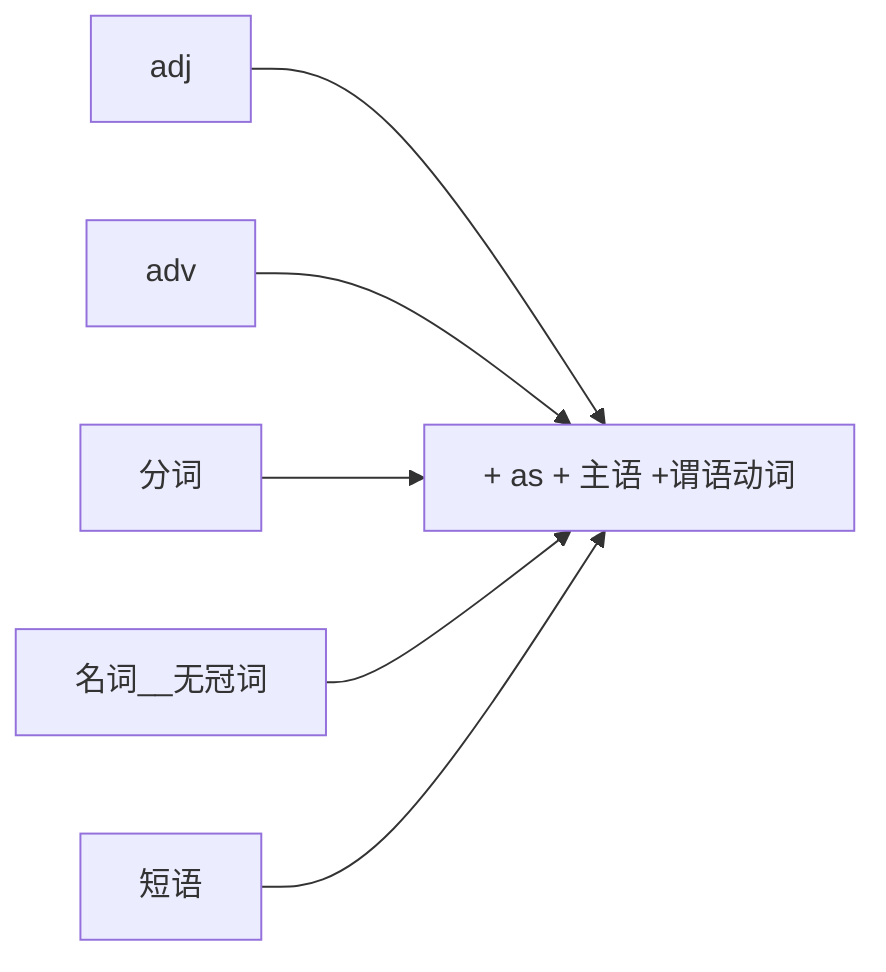

[toc]

&emsp;
&emsp; 
# 1. 状语从句的本质
&emsp;&emsp; 尽管状语从句数目较多，但理解起来并不难。因为从本质上来讲，状语从句就是用不同的连词将几个分句连接起来，以表达分句之间特定的逻辑关系。我们先来看下面这个故事：
> &emsp;&emsp; There is a story about a wealthy farmer who was once offered all the land he could walk on in a day, **provided** he came back by the sundown to the point where he started. To get a head start, early the next morning the farmer started covering ground quickly **because** he wanted to get as much land as he could. **Even though** he was tired, he kept going all afternoon **because** he didn't want to miss this once-in-a-lifetime opportunity to gain more wealth.
> &emsp;&emsp; 这里讲的是一个富农的故事。 他得到了一个机会， 能够获得一天内走到的所有土地， 前提条件是他得在日落前回到他的出发地。 为了占尽先机， 第二天一早农夫就快速地上路了， 因为他想得到尽可能多的土地。 尽管他十分疲惫， 整个下午他仍然在不停地行走， 因为他不希望错过这个获取更多财富的千载难逢的机会。
> 
&emsp;&emsp; 我们看到， 这段文字里有四个逻辑连词： 一个表示条件关系的`provided`， 两个表示因果关系的`because`，还有一个表示让步关系的`even though`，它们分别连接各个分句，以明确表示分句之间的逻辑语义关系。 顺便要提及的是， 这里也有我们在第二章里详细讨论过的定语从句， 比如`who was once offered all the land`修饰`wealthy farmer`， `(which/that) he could walk on in a day`修饰`the land`（关系词`which`或`that`被省去），`where he started`修饰`the point`。
&emsp;&emsp; 这个故事的结尾是：这个农夫因为过于贪婪，总是不停地往前跑，想得到更多的土地，最后他精疲力竭， 死了。他被埋葬了，此时他所需要的土地也只是那么一小块而已（`He was buried and all the land he needed was a small plot.`）。

状语从句的连接词主要有：
| 状语从句的种类 | 常用连接词                                                     | 特殊连接词                                                                                                                                                                                                     |
| -------------- | -------------------------------------------------------------- | -------------------------------------------------------------------------------------------------------------------------------------------------------------------------------------------------------------- |
| 时间状语从句   | when, while, as, before, after, since, till, until, as soon as | ① 一些表示时间的名词： the moment, the instant, the minute, the day, next time, every time; ② 一些副词： instantly, immediately, directly; ③ 固定搭配的连词： no sooner...than, hardly...when, scarcely...when |
| 地点状语从句   | where                                                          | wherever, anywhere, everywhere                                                                                                                                                                                 |
| 原因状语从句   | because, as, for, since                                        | seeing that, considering that, now that, given that, in that, inasmuch as, insomuch as                                                                                                                         |
| 目的状语从句   | so that, in order that, that                                   | lest, for fear that, in case, in the hope that, on purpose that, for the purpose that, to the end that                                                                                                         |
| 结果状语从句   | so...that, so that, such...that                                | such that, to the degree that, to the extent that, to such a degree that, to such an extent that                                                                                                               |
| 条件状语从句   | if, unless                                                     | suppose, supposing, providing, provided, on condition that, so long as, as long as                                                                                                                             |
| 让步状语从句   | although, though, even though, even if                         | ① while（一般用在句首） , as （用于倒装结构）; ② wh-ever: whatever, whoever, whichever, however, whenever, wherever, whether...or; ③ as adj. as+主谓结构用在句首                                               |
| 比较状语从句   | as, than                                                       | 其他比较句型： the more..., the more...; just as..., so...; A is to B what/as C is to D; no more...than; not A so much as B/not so much A as B                                                                 |
| 方式状语从句   | as, the way                                                    |                                                                                                                                                                                                                |
&emsp;&emsp; 从本质上来讲， 状语从句就是用不同的连词将几个分句连接起来， 以表达分句之间特定的逻辑语义关系。 因此， 掌握引导九类状语从句的有关连接词的用法特点和意义是学习状语从句的关键。 只要记住连接词就能够识别是何种状语从句， 从而正确地分析句子结构并理解句子的意思。

&emsp;
&emsp; 
# 2. 状语从句的省略结构
## 2.1 概述
&emsp;&emsp; 在具体阐述各状语从句的连接词及其用法特点之前，我们先来讨论状语从句的省略结构。这在各类考试中都会出现，因而非常重要。
一般来说， 应同时满足以下两点：
> &emsp;&emsp; ① 主句的主语和从句的主语一致， 或从句主语是`it`；
> &emsp;&emsp; ② 从句谓语中含有`be`动词的情况下，我们可将从句的主语和`be`动词省去。这种省略主要常见于时间、地点、 条件及让步状语从句中。
> 

&emsp;
## 2.2  时间状语从句的省略
请看例句：
> A zero can have its meaning only **when used with real numbers**; thoughts can give off brilliant light only **when put into actions**.
> 零， 只有和实数在一起使用才有意义； 思想， 只有付诸行动才能发出光芒。
> 
这是`when`引导的时间状语从句的省略， 还原后完整的句子结构应该是
> A zero can have its meaning only **when it is used with real numbers**; thoughts can give off brilliant light only **when they are put into actions**.
> 
所以这里的两个`when`引导的从句分别省去了`it is`和`they are`。这里的it指主句的主语`zero`，`they`指主句的主语`thoughts`。

> Metals expand when heated and contract when cooled.
> 金属具有热胀冷缩的特性。
> 
这是`when`引导的时间状语从句的省略， 还原后的完整的句子结构应该是
> Metals expand when they are heated and contract when they are cooled.
> 
所以两个`when`引导的从句都是省略了`they are`。 这里的`they`指主句的主语`metals`。
 
&emsp;&emsp; 若不能同时满足主句与从句主语一致（或从句主语是`it`）、从句谓语中含有be动词这两个条件，则从句不能省略主语和be动词。 请看例句：
> ① When I was ten years old, my family moved to the city.
> ② ~~When ten years old, my family moved to the city.~~
> 
妙语点睛 在句① 中， 我们看到， 主句的主语`my family`和从句的主语I是不同的，所以该从句不能省略， 因此句②  错误， 尽管句② 很符合我们汉语的表达习惯： “在10岁的时候， 我们家搬到城市里来了。”精品译文 在我10岁的时候，我们家搬到城市里来了。

&emsp;
## 2.2 地点状语从句的省略
请看例句：
> The kind of tree grows favorably **where wet**.
> 这种树在潮湿的地方生长得好。
> 
妙语点睛 这是`where`引导的地点状语从句的省略，还原后的完整的句子结构应该是`The kind of tree grows favorably where it is wet.`所以`where`引导的从句省略了`it is`。 请注意： 这里的`it`并不是指代主句的主语`tree`， 而是泛指任何地方。所以我们看到，从句的主语若是`it`， 则是可以省去的。

> **Where appropriate**, introduce personal experiences that will have a common link with your audience.
> （在演说中， ） 在合适的地方， 你可以把与听众有关系的个人经历讲给他们听。
> 
这是`where`引导的地点状语从句的省略， 还原后的完整的句子结构应该是
> **Where it is appropriate**, introduce personal experiences that will have a common link with your audience.
> 
所以`where`引导的从句省略了`it is`。 请注意：这里的`it`是泛指任何地方。 所以我们看到，从句的主语若是it， 则是可以省去的。

&emsp;
## 2.3 条件状语从句的省略
请看例句：
> A tiger can't be tamed **unless caught very young**.
> 老虎只有在年幼时捉来才能被驯服。
> 
这是一道托福考试真题， 是unless引导的条件状语从句的省略， 还原后的完整的句子结构应该是
> A tiger can't be tamed **unless it is caught very young**.
> 
所以这里`unless`引导的从句是省略了`it is`。 这里的`it`指主句的主语`tiger`。
 

&emsp;
## 2.4 让步状语从句的省略
请看例句：
> **Although not an economist himself**, Dr.Smith has long been a severe critic of the government's economic policies.
> 尽管史密斯博士本人不是经济学家， 但他一直以来对政府的经济政策提出尖锐的批评。
> 
这是`although`引导的让步状语从句的省略， 还原后的完整的句子结构应该是
> **Although he is not an economist himself**, Dr. Smith has long been a severe critic of the government's economic policies.
> 
所以这里`although`引导的从句是省略了`he is`。 这里的he指主句的主语Dr. Smith。
 

&emsp;
## 2.5 总结
本节主要讨论了关于状语从句的省略条件。 应同时满足以下两点： 
> 一是当主句的主语和从句的主语一致， 或从句主语是it； 
> 二是从句谓语中含有be动词。 此时， 我们可将从句的主语和be动词省去。 
> 
思维训练
选择最佳答案填空。
> (1). This is an illness that can result in total blindness if ( &emsp; ) untreated.
> A. left
> B. being left
> C. is left
> D. it left
> 
> (2)( &emsp; ) , Dr. Smith has long been a severe critic of the government's economic policies.
> A. Although not being an economist himself
> B. Although being no an economist himself
> C. Although not an economist himself
> D. Although not having been an economist himself
> 
> (3). A reagent is any chemical that reacts in a predictable way ( &emsp; ) with other chemicals.
> A. when mixed
> B. when is mixed
> C. it mixed
> D. when mixing
> 
> (4). A beam of light will not bend round corners unless ( &emsp; ) to do so with the help of a > reflecting device.
> A. made
> B. to be made
> C. being made
> D. having made
> 
> (5). As a general rule, snakes don't bite unless ( &emsp; ).
> A. are offended
> B. they offended
> C. offending
> D. offended
> 
答案：
> (1). A。 这是条件状语从句的省略结构， 完整句子是This is an illness that can result in total lindness if it is left untreated， 所以这里if从句是省略了it is。
> (2). C。 这是让步状语从句的省略结构， 完整句子是Although he is not an economist himself， 所以这里省去了he is。
> (3). A。 这是时间状语从句的省略结构， 完整句子是...when it is mixed with other chemicals， 所以这里when从句是省略了it is。
> (4). A。 这是条件状语从句的省略结构， 完整句子是...unless it is made to do so with the help of a reflecting device， 所以这里unless从句是省略了it is。
> (5). D。 这是条件状语从句的省略结构， 完整句子是...unless they are offended， 所以这里unless从句是省略了they are。
> 

&emsp;
&emsp; 
# 3. 时间状语从句
&emsp;&emsp; **从本质上来讲，时间状语从句就是用来说明主句动作与从句动作发生时间上的先后关系。** 既然说到动作发生的时间，就必然与主句和从句的谓语的时态关系密切，而英文中的时态又与动作持续时间的长短，即延续动词（`continuous verb`）或短暂动词有关。因此，在学习时间状语从句时，建议读者牢牢把握下列贯穿所有时间从句的两个核心要点：
> ① 注意主句、从句的时态搭配关系。对于不同时间状语从句的连接词，这种搭配关系是不同的。
> ② 注意主句、从句的谓语动词的延续性和短暂性。对于延续动词所表示的动作，在下文简称为“长动作（`long action`）”，对于短暂动词所表示的动作，简称为“短动作（`short action`）”。
> 
学习时间状语从句的难点在于，要掌握主从句的时态搭配关系，时态搭配关系不同，句子的意思就有可能不同。比如下面这两个例句：
> ① I was telephoning Harry when she arrived.
> ② I telephoned Harry when she arrived.
> 
> ① 她到的时候， 我正在给哈利打电话。
> ② 她到了以后， 我给哈利打了一个电话。
> 
我们看到上面的两个句子仅主句的时态不同，句①用了过去进行时态（`was telephoning`），句②用了一般过去时态（`telephoned`）。时态不同则表达的意思不同，并且说明主从句动作发生的先后也不同。 在句①中，`telephoning`（打电话）先发生，`arrived`（到达） 后发生。句2则相反， `telephoned`（打电话）后发生，`arrived`（到达） 先发生。 另外，在句1中，`telephoning`（打电话）是一个延续性动作，`arrived`（到达）是短暂性动作。 但在句②中， `telephoned`（打电话） 变成了短暂性动作，这句话中只强调动作的开始，而没有强调动作的持续性。

&emsp;
## 3.1 时间连词when的用法特点
&emsp;&emsp; 连词`when`应该是读者最熟悉的，但它的用法比较繁琐，主要是因为主从句时态搭配关系较多。 
&emsp;&emsp; 一般来讲，`when`的意思相当于`at that time`（在……时刻） ， 因此从句的谓语动词通常是短暂动词， 表示某一时刻的动作。 
&emsp;&emsp; 不过，`when`引导的从句也可以接延续动词，这时从句往往用过去进行时态，表示某一时间段内发生的动作。 
### 3.1.1 when引导从句表示过去动作的五组时态搭配
#### (1) 主句一般过去时+从句一般过去时
若 **主从句都用** 一般过去时，则表示从句动作先发生：
> I started my dinner when he left.
> 他走了之后， 我才开始吃晚饭。
> 
> He left when I got there.
> 我到了以后， 他才离开。
> 
从以上例句我们可以看出，若主从句都用一般过去时，则表示从句动作先发生。所以从句还可以用过去完成时， 于是就有了下面的第二种时态搭配关系：

#### (2) 主句一般过去时+从句过去完成时
&emsp;&emsp; 由`3.1.1`的例句可看出，若主从句都用一般过去时，则表示从句动作先发生。所以从句还可以用过去完成时：
> I started my dinner when he had left.
> He left when I had got there.
>
这两句的从句都用了过去完成时，更是强调从句动作先发生，意思与上面两句区别不大。不过对于某些句子来说，`when`引导的从句用一般过去时或过去完成时是有区别的。具体来说，在表示两个相继发生的动作时，用过去完成时可以表示在一个动作完成以后，另一个动作才开始发生，从而使得两个动作相互独立，彼此脱离开来。而用一般过去时，则可能表示一个动作“导致”另一个动作的发生，或两个动作之间有一种因果关系。例如：
> ① When I had opened all the windows I sat down and had a cup of tea.
> ② When I opened the window the cat jumped out.
>
> ① 我把所有的窗子都打开后， 就坐下来喝了杯茶。
> ② 我刚把窗子打开， 猫就跳了出去。
>
&emsp;&emsp; 句① 不宜说成`When I opened all the windows...`， 因为这里的`had opened`是持续了一段时间的， 这从宾语`all the windows`可以看出来， 也就是说等一系列“开窗”的动作完成之后， 才有主句动作发生。
&emsp;&emsp; 在句② 中， 用`opened`比`had opened`更自然， 因为“开完窗”和“猫跳出去”是两个紧接着发生的动作。

> ① When I had written my letters I did some gardening.
> ② When I wrote him a letter, he came at once。
> 
> ① 我把信写完后， 就到花园里干了些活。
> ② 我给他去了封信后， 他立即就来了。
> 
&emsp;&emsp; 句① 不宜说成`When I wrote...`，因为这里的`had written`是持续了一段时间的，这从宾语`my letters`可以看出来，也就是说等一系列“写”的动作完成之后，才有主句动作发生。
&emsp;&emsp; 在句② 中，用`wrote`比`had written`更自然，因为“我写信”和“他过来”有一种因果关系。

#### (3) 主句过去完成时 + 从句一般过去时
若要表达 **主句动作先发生**，则主句须用过去完成时：
> I had started my dinner when he left.
> 他走的时候，我已经开始吃晚饭了。
> 
> He had already left when I got there.
> 我到的时候，他已经离开了。
> 

#### (4) 主句一般过去时 + 从句过去进行时
在一个延续背景动作进行的过程中 突然发生了一个短暂动作：
> The doorbell rang when I was telephoning.
> 门铃响的时候， 我正在打电话。
> 
这里的短暂性动作`ring`用一般过去时，延续性动作`telephone`用过去进行时。这个句子也可以改成 `主句过去进行时 + 从句一般过去时` 这样的时态搭配，即：

#### (5) 主句过去进行时 + 从句一般过去时
> I was telephoning when the doorbell rang.
> 我当时正在打电话， 突然门铃响了。
> 
由 `主句一般过去时 + when + 从句过去进行时` 变成 `主句过去进行时 + when + 从句一般过去时`，此时`when`的意思发生了改变，即由`during the time`（当……时候）变成了`at the time`（正在那时），这时`when`强调某个短暂性动作突然发生，所以我们可以在`when`引导的从句中添加`suddenly`一词。请比较：
> ① ~~The doorbell rang when suddenly I was telephoning. ~~
> ② I was telephoning when suddenly the doorbell rang.
> 
在句① 中，由于when的意思是`during the time`，强调的是一个动作持续的过程，所以不能添加`suddenly`这样的词。 而在句② 中， 由于`when`的意思是`at the time`， 强调的是一个短暂性动作的发生， 所以可以添加`suddenly`一词。
我们再来看下面这个句子：
> On a rainy day I was driving north through Vermont when suddenly I noticed a young man holding up a sign reading "Boston".
> 在一个雨天，我正驾着车往北行驶穿越佛蒙特州，这时我突然看见一个年轻男子，手里举着牌子，上面写着“波士顿”。
> 
妙语点睛 这是“主句过去进行时+从句一般过去时”的时态搭配， 此时`when`强调短暂性动作， 所以可以添加`suddenly`一词， 在这句话中的意思是“我突然注意到”。

### 3.1.2 when引导的从句表示将来动作的四组时态搭配
#### (1)  主句一般将来时 + 从句一般现在时
&emsp;&emsp; 在表示将来的动作时， 主句显然要用一般将来时，而时间状语从句要用一般现在时表示将来，不能使用将来时态。主从句的这种时态搭配应该是大家最熟悉不过的了， 在初中就应该学过。 请看例句：
> I'll speak to him when he arrives.
> 他来了以后我会和他谈谈。
> 
> I'll tell him about it when he comes back.
> 他回来后我要告诉他这个事情。
> 

#### (2) 主句一般将来时 + 从句现在完成时
&emsp;&emsp; 在when引导的从句中， 除了用一般现在时表示将来之外， 还可用现在完成时表示一个将要发生的动作， 主句依然用一般将来时。 这种时态搭配一般读者是不太注意的。 从句中用完成时态是为了强调： 
> **在从句动作结束了之后， 主句动作才开始发生。 此时从句的动作一般都是需要持续一段时间的。** 
> 
请比较：
> I'll go when I have had my dinner.
> 我吃完饭就去。
> 
如果是说`I'll go when I have my dinner.`则表示“我吃着饭的同时就出去了。 ”

> I'll give you a call when I have finished the work.
> 工作做完后， 我就给你打电话。
> 
> The winner will be declared when every competitor has finished the course.
> 当所有的选手都跑完之后， 就将宣布获胜者。
> 
> **Hilary**: You ought to seriously consider that never again in your life will you be surrounded by so many eligible bachelors. It's a once-in-a-lifetime opportunity!
> **Catherine**: Love can wait. I'm too young to have my heart broken. When I've taken the first few steps on my career ladder then I'll start looking for a soul mate.
> **Hilary**: You old dinosaur you! By then all the best guys will have been taken. You'll end up an old maid!
> 希拉里： 你得好好考虑一下了， 在你的一生中， 再也不会像现在这样， 身边有这么多的单身好男人了。 这是一生才有一次的机会啊！
> 凯瑟琳： 谈恋爱还可以再等等。 我还太小， 难以承受心灵的创伤。 等我的事业已经开始稳步发展的时候， 我就会开始找寻我的另一半。
> 希拉里： 你简直就是个老古董！ 到那时所有的优秀男孩都“名草有主”了， 你就只有当老处女的份了！
> 
我们看到， 在上面第六、 七两组时态搭配中， 都是从句动作先于主句动作， 类似于上面第一、 二两组时态搭配中的从句动作先于主句动作的情况。 其实， 第六、 七两组时态的差别类似于第一、 二两组时态的差别， 请读者自己体会一下。

#### (3) 主句将来完成时+从句一般将来时
在将来的动作中， 若要表示**主句动作先发生**， 则主句要用将来完:
> The performer will already have played the music when we get there.
> 一会我们到的时候， 那位演奏家一定已经弹完那首曲子了。
> 
同理，与我们上面讨论过的第四、 五两组“进行时与一般时”的搭配类似， 将来动作也有“进行时与一般时”的搭配。 请看例句：

#### (4) 主句将来进行时 + 从句一般现在时
> The performer will be playing the music when we get there.
> 一会我们到的时候， 那位演奏家一定正在弹那首曲子。
> 

### 3.1.3 when引导从句表示一般现在动作的时态搭配
#### (1) 主从句都用一般现在时
表示现在一般动作的时态搭配是， 主从句都用一般现在时态。 表示一般动作的when引导的从句往往是
说明一般情况， 阐明一个道理， 因而常出现在名言警句、 谚语或格言中。 请看例句：
> When you were born, you cried and the world rejoiced. Live your life so that when you die, the world cries and you rejoice.
>  出生的时候，你是哭着来到这个世界，而周围的人都在欢笑。要好好度过此生，以便在你去世的时候，全世界都为你哭泣，而你却微笑着离开。
> 
我们看到， 这里的主从句都是用了一般现在时态。这是一个印度的谚语， 相信大家也非常熟悉。再比如， 在谈到宠物狗时， `Will Rogers`说过这样一句话：
> If there are no dogs in Heaven, then when I die I want to go where they went.
> 如果天堂里没有狗， 那么我愿意死后不去天堂， 而去有狗的地方。
> 
说到幸福， 有这样一个句子：
> Happiness is like a visitor. You can't command her appearance. You can only **appreciate** her when she **does show** up. And you can't force happiness to happen--but you can make sure you **are** aware of it when it **does**. Happiness is an attitude, not a condition.
> 幸福如同一位访客， 你无法要求她到来， 而是在她到来时， 好好享受与她在一起的时光。你无法强迫幸福出现， 不过当幸福来临时， 你能确信你会感受到。 幸福是一种心态， 不是一个条件。这句话说明“幸福是一种心态”这个道理。
>
我们看到， 这里的主从句都是用了一般现在时态。
说到我们的心态， 有这样一个句子：
> When my attitudes are right, there is no barrier too high, no valley too deep, no dream too extreme, no challenge too great for me.
> 当我拥有正确的心态时， 没有什么障碍不可逾越， 没有什么困难不可克服， 没有什么梦想过于狂妄， 没有什么挑战不可战胜。
> 
表示一般时态的`when`引导的从句还可以用于固定结构中，比如`when it comes to`， 表示“当说到……”。
请看例句：
> Doing your homework is a sure way to improve your test scores, and this is especially true when it comes to classroom tests.
> 做作业肯定会有助于你提高考试成绩， 尤其是对课堂测试来说。
> 

> In general, the tests work most effectively when the qualities to be measured can be most precisely defined and least effectively when what is to be measured or predicted cannot be well defined.
> 一般来说， 如果所需要测定的特征能很精确地界定时， 测试最为有效； 而如果所要测定或预测的东西不能明确地界定时， 测试的效果则最差。
> 
这是1995年的考研翻译第74题。通过这个真题例句，笔者想说明的是，`when`虽然是一个时间连词，但在特定的上下文中，可能会含有条件的意味，我们可以译成“如果”。

#### (2) whenever引导时间状语从句
我们可以用`whenever`引导时间状语从句，表示 **“无论何时”**，它相当于`when`的强调形式。请看例句：
> Whenever you say "I love you", mean it. Whenever you say "I'm sorry", look the person right in the eyes.
> 无论何时说“我爱你”， 请真心诚意。 无论何时说“对不起”， 请看着对方的眼睛。
> 
> Whenever someone asks you something you don't want to answer, smile and ask, "Why do you want to know?"
> 当别人问你什么问题而你不想回答时， 笑着说： “你为什么想知道这个？ ”
> 
> Smile whenever you pick up the phone, for the caller will be able to notice it.
> 面带微笑地接听电话， 因为对方会感觉得到。
> 
从以上所讨论的例句，我们可以看出，首先，`when`引导的时间从句通常表示过去时间的动作较多，其次是表示将来，很少表示一般现在的动作。在表示现在的情况时，往往是用于名言警句中。

### 3.1.4 when引导的时间状语的总结
&emsp;&emsp; 在上面十组时态搭配中，最重要、常用的是第四、五两组中的 `主句一般过去时+从句过去进行时` 和 `主句过去进行时 + 从句一般过去时` 的搭配，所以请读者格外注意。对于其他的时态搭配关系，读者可以了解一下。

&emsp;
## 3.2 时间连词while
### 3.2.1 时间连词while的用法特点
&emsp;&emsp; 当`while`用作时间连词时，意思相当于`during that time（在……期间）`，表示某一时间段内发生的动作， 因此， 从句谓语动词通常接 **延续动词**。 请看例句：
> (1) The phone rang while I was taking my bath.
> 电话铃响的时候我正在洗澡。
> 
妙语点睛 此句中`while`后面的谓语部分`taking my bath`是一个持续性动作。

> (2) The doorbell rang while we were watching TV.
> 当时我正在看电视， 突然门铃响了。
此句中while后面的谓语部分`watching TV`是一个持续性动作。

> (3) Happiness is an attitude, not a condition. It's cleaning the Venetian blinds while listening to an aria, or spending a pleasant hour organizing your closet. Happiness is your family assembled at dinner. It's in the present, not in the distant promise of a "someday when...".
> 幸福是一种心态， 不是一个条件。 幸福就是一边擦洗百叶窗， 一边听着咏叹调， 或花费一个小时快乐地收拾自己的储藏室。 幸福就是全家围聚在晚餐桌旁。 幸福就是活在当下， 而不是“将来某一天……”这样遥远的期许。
> 
此句中`while`后面的谓语部分`listening`和`spending`都表示一个持续性的活动。

### 3.2.2 时间连词while和when的含义差别
时间连词`while`和`when`的含义有差别: 
> &emsp;&emsp; ① `while`的意思相当于`during that time`（在……期间） ，表示某一时间段内发生的动作，因此，从句的谓语动词通常接延续动词。 
> &emsp;&emsp; ② `when`的意思相当于`at that time`（在……时刻），从句谓语动词通常是短暂动词， 表示某一时刻的动作（从句也可接延续动词， 这时从句往往用过去进行时态）。
> 
请比较：
> (4) A detective（侦探） arrested a criminal and was about to handcuff（给……戴上手拷） him **when** a huge gust（一阵狂风） of wind **blew** the detective's hat **off**.
> "Shall I go and fetch it?" the criminal asked. "Do you take me for a fool?" asked the detective. "You wait here **while I go and get it**!"
> 一个侦探逮着了一名罪犯。 他正准备给罪犯戴上手铐， 这时刮起了一阵狂风， 把侦探的帽子吹落了。 罪犯立即说： “需要我去帮你把帽子捡起来吗？ ”侦探答道： “你把我当傻瓜啊？ 你在这里等着，我自己去捡！ ”
> 
此句中的`go and get`尽管是短暂动词，但两动词连用表示的是在一段期间内的活动，所以用连词`while`。而when的从句的谓语是`blew off`， 表示“吹落”，显然是一个短暂性动作，所以不能用`while`引导。
我们再来看下面这道考题：
> (5) I was walking along the road suddenly someone patted me on the shoulder from behind.
> A. immediately
> B. when
> C. the moment
> D. while
> 
> 当时我正在路上走， 突然有人从后面拍了拍我的肩膀。
> 
> 正确答案 B。
> 
这是一道四级考题。 我们看到， 这里从句的动词patted是一个短暂性动作， 所以不能选D。
> (6) The phenomenon provides a way for companies to remain globally competitive avoiding market
cycles and the growing burdens imposed by employment rules, healthcare costs and pension plans.
> A. but
> B. while
> C. and
> D. whereas
>
> 这种现象为公司开辟了一条道路， 使它们既保持了自身的国际竞争力， 同时也避免了市场周期的冲击和就业法规的限制， 以及医疗费用和养老金造成的日益繁重的负担。
> 
> 正确答案 B。
> 
这是1997年的考研完形填空第48题， 这道题我们在前面讨论过。 我们看到这里的动词`avoid`相当于表示了一个状态， 是延续动词，所以用`while`。

&emsp;&emsp; 此外， 需要再次提醒的是，`while`除了表示时间外，还可以有另外三种意思： 
> **① 表示条件的“只要”。**
> &emsp;&emsp; 
> 
> **② 表示对比的“（对比两件事物）然而”，** 
> &emsp;&emsp; While Tom's very good at science, his brother is absolutely hopeless.
> &emsp;&emsp; 汤姆很擅长理科，而他的兄弟绝对是不可救药。
> 
> **③ 表示让步的“尽管”，** 
> &emsp;&emsp; While I am willing to help, I do not have much time available.尽管我愿意帮忙，但是没有多少时间。
> 

&emsp;
## 3.3 时间连词as的用法特点
&emsp;&emsp; 在英语中，`as`作为连词，可以引导各类状语从句，所以遇到as引导的从句时，我们需要小心，注意正确理解其意思。当`as`引导时间从句时，它相当于`while`，即后面要接延续动词，一般译成“正当……”，“随着……”或“一边……一边……”。与as引导的从句搭配的主句的谓语可以是延续动词， 也可以是短暂动词。请看例句：
> (1) The arrow fell into the river as the boat was drifting on the water. The soldier tried to retrieve it.
> 船在水面上行使时， 箭突然掉进了河里。 这名士兵想找回这支箭。
> 
从句的谓语`was drifting`是延续动词， 主句的谓语`fell`是短暂动词。

> (2) industrial giants like General Motors and IBM struggle to survive by reducing the number of employees, Manpower, based in Milwaukee, Wisconsin, is booming.
> A. For
> B. Because
> C. As
> D. Since
> 
> 正当一些工业巨头， 像通用汽车公司和IBM公司， 都在试图通过裁员来谋求生存之时， 总部设在威斯康星州密尔沃基市的劳务公司Manpower却日渐兴旺发展起来。
> 正确答案 C。
> 
这是1997年的考研完形填空第42题。这里`as`引导的从句表示时间。从句的谓语`struggle`与主句的谓语`is booming`都是延续动词。

> (3) Urban Japanese have long endured lengthy commutes (travels to and from work) and crowded living conditions, but as the old group and family values weaken, the discomfort is beginning to tell.
> 日本的城市居民长期以来忍受着漫长的上下班往返时间以及拥挤的住房条件，但是，随着老龄人群和家庭的价值削弱， 人们慢慢开始感受到不舒服了。
> 
从句的谓语`weaken`是延续动词，主句的谓语`is beginning`表示一个持续的过程。 `as`在这里可以译成“随着……”。

> (4) Shortlists for job interviews, election ballot papers, lists of conference speakers and attendees: all tend to be drawn up alphabetically, and their recipients lose interest as they plough through them.
> 求职面试人员的名单、 选举候选人、 会议发言人以及出席者的名单： 所有这些通常是按照字母表的顺序排列的， 在人们一边费劲地向下查看时， 他们的兴趣也随之变得索然。
> 
从句的谓语plough与主句的谓语`lose`都是延续动词。 as在这里可以译成“一边……”。

> (5) As the Internet becomes more and more commercialized, it is in the interest of business to universalize access--after all, the more people online, the more potential customers there are.
> 随着因特网变得日益商业化， 网络的广泛使用对商人们非常有利， 因为毕竟上网的人越多， 潜在的客户就会越多。
> 
从句的谓语`becomes`是延续动词，主句的谓语`is`表示延续状态。

&emsp;
## 3.4 时间连词before的用法特点
&emsp;&emsp; 连词`before`引导时间从句时，同`when`一样，主从句也会有各种时态搭配关系，其中比较常见的一种是“主句用过去完成时，从句用一般过去时”。请看例句：
> (1) During several years of gambling in that casino, Williams, a state auditor earning $35,000 a year, lost approximately $175, 000. He had never gambled before the casino sent him a coupon for $20 worth of gambling.
> 威廉先生是一位年薪收入为35, 000美元的审计员， 他这几年在这个赌场里输掉了175,000美元。 而在该赌场送给他一张价值20美元的赌票之前， 他从未赌博过。
> 
这里`before`的后面接了一个时间从句， 从句的谓语用一般过去时态`sent`， 主句的谓语用过去完成时态`had gambled`。

&emsp;&emsp; 在这里笔者不想详细讨论关于`before`的主句和从句的时态关系，而只是分析一下它的汉译特点。 我们都知道， `before一`般译成“在……之前”，比如上面例句中的“在该赌场送给他一张价值20美元的赌票之前”。再看下面的例句：
> (2) Even before Alan Greenspan's admission that America's red-hot economy is cooling, lots of working folks had already seen signs of the slowdown themselves.
> 甚至在格林斯潘宣布美国经济的繁荣正在降温之前， 许多上班族自己早已觉察到了经济疲软的迹象。
> 
这里`before`的后面接了一个名词短语`Alan Greenspan's admission`，其后的`that`引导的从句为同位语从句， 补充说明`admission`。`before`在这里正常地翻译成“在……之前”。

不过，有时我们为了译文更加地道，需要将`before`的汉译作适当的调整，这就使得我们不一定将`before`都生硬呆板地译成“在……之前”。请看下列的例句：
> (3) The Greeks assumed that the structure of language had some connection with the process of thought, which took root in Europe long before people realized how diverse languages could be.
> 希腊人认为， 语言结构与思维过程之间存在着某种联系。 这一观点早在人们尚未认识到语言的千差万别以前就已在欧洲扎下了根。
> 
这是2004年的考研英语翻译第61题。此句我们在第二章第2.1.3小节详细讨论过，这里我们再来讨论其中的第二个翻译难点，即`before`的翻译技巧。在英文中，before引导的从句一般接肯定形式，但翻译成汉语时，我们往往处理成否定的意思，所以这里before引导的从句`before people realized how diverse languages could be`可以译成“在人们尚未认识到语言的千差万别之前”。然而有的考生由于不知道`before`的这种汉译特点， 而把这句话翻译成“希腊人认为， 语言的结构与思想的过程有某种联系，这种想法源于欧洲，很久以前，人们就意识到语言是多么的丰富多彩。 ”

> (4) Our magazines feature beaming celebrities and happy families in perfect homes. And since these messages have an agenda--to lure us to open our wallets--they make the very idea of happiness seem unreliable. "Celebrate!" commanded the ads for the arthritis drug Celebrex, before we found out it could increase the risk of heart attacks.
> 我们杂志的报道往往都是专注于那些面带愉快微笑的名人以及其他完美之家中的快乐成员。 由于这些信息只有一个目的——诱惑我们掏钱包， 所以这些信息使“快乐”这个概念似乎不可靠。 比如， 治疗关节炎的药物`Celebrex`这个广告鼓动人们去“欢乐”， 结果我们发现这种药品会加大罹患心脏病的危险。
> 
这里`before`引导的从句虽然是表示时间， 但其实是引导了一个前后对比关系：`before`之前的部分说， 治疗关节炎的药物Celebrex的广告鼓动人们去“欢乐”，`before`后面的部分说， 我们发现这种药物会加大罹患心脏病的危险。 所以， 前后两个部分有一种转折的意味。
 
> (5) The mineral elements from the soil that are usable by the plant must be dissolved in the soil solution before they can be taken into the root.
> 土壤里的矿物质是无法被植物直接利用的， 它们只有在溶于土壤的溶液里之后， 才能为植物的根系所吸收。
> 
这里`before`引导的从句虽然是表示时间， 但就上下文的逻辑关系来看， 我们可以把它转译成一个条件从句， 译成“只有……才……”。

另外， 在`before`引导的从句之前若接有一段时间， 这时候`before`引导的从句一般可以翻译成“在多长时间之后才……”。 请看例句：
> (6) It took a few months of investigation before it became clear.
> 经过了几个月的调查之后， 情况才开始变得明朗。
> 
我们看到， 这里`before`的前面有一个时间段`a few months`，如果我们按照英语原文的语序译成“在情况变得明朗之前， 花了几个月时间的调查”， 就有股“英语腔”， 不符合我们汉语的表达习惯， 因此我们宜把它译成“在多长时间之后才……”的结构。

> (7) In this factory, suggestions often have to wait for months before they are fully considered.
> 在这家工厂里， 一项建议往往要等上数月之后才能被考虑。
> 
我们看到，这里`before`的前面有一个时间段`months`， 所以我们宜按照上述规律来变通翻译。
 

&emsp;
## 3.5 时间连词after的用法特点
&emsp;&emsp; 对于连词`after`引导时间从句，读者应该比较熟悉。它的主从句时态搭配关系也有各种情况，其中一种是与`before`相反， 即“主句用一般过去时， 从句用过去完成时”。 请看例句：
> I moved to America after I had learned English for ten years.
> 我学了十年英语之后搬到了美国。
> 
这里的after的后面接了一个时间从句， 从句的谓语用过去完成时态`had learne`d， 主句的谓语用一般过去时态moved。关于连词after的其他时态搭配关系， 在此不再赘述。
 

&emsp;
## 3.6 时间连词since的用法特点
&emsp;&emsp; `since`作为时间连词，往往与现在完成时态有密切关系，先来看一个例句：
> I have worked in this company since I left school. 
> 自从毕业离校以来， 我就一直在这家公司工作。
> 
这个例句中的`since`作为时间连词， 意思是“自从……以来”。与它有关的主句和从句时态搭配关系是：
> `since`后面所接从句的谓语要用一般过去时态，如上面例句中的`left`；与其搭配的主句谓语则用现在完成时态，如上面例句中的`have worked`。
> 
&emsp;&emsp; 相信很多读者对`since`的上述用法非常熟悉。 上述`since`的这一用法固然不错， 但是如果据此就认为`since`后面的从句只能用一般过去时态而不能用其他时态， 那就是只知其一， 不知其二了， 有时甚至会造成对句子意思完全错误的理解。 比如， 下面这个英文句子该如何理解？
> It has been three years since I worked in this company.
> 
很多读者看完这句话， 就会很自然地将其理解为：~~我在这家公司工作已经有三年了。~~ 也就是将这句话完全等同于：
> I have worked in this company for three years now.
> 
看到这里也许有读者会纳闷了： 不就是这个意思吗？ 难道还能有其他意思？其实， 这句英文真正要表达的意思是：
> It has been three years since I last worked here in this company. I have NOT worked in this company during the past three years.
> 
&emsp;&emsp; 也就说， 这句话是要强调“我最后一次在这家公司工作是在三年前， 换句话说， 我过去三年间都没有在这家公司工作， 也即我离开这家公司已经有三年了”。
&emsp;&emsp; 看到这里， 一定有读者觉得难以理解， 为什么这个句子真正的意思与我们对其字面的理解相差如此遥远， 甚至正好相反？ 要想弄清个中缘由， 还得从动词的特点来分析。
&emsp;&emsp; 通过比较上述两个since引导的从句的谓语动词left和worked， 会发现， left是典型的“短暂动词”， 而worked则是“延续动词”。 问题就出在这动词延续性的长短上， 因为since后面接延续性或短暂性动词， 用于不同时态， 所表达的意义是有区别的。 具体思维规律如下：
### 3.6.1 since ＋ 短暂动词
#### 例解
&emsp;&emsp;时间连词`since`接短暂动词的用法是最常用的，也就是大家常记住的这种时态搭配： **主句用现在完成时，`since`后面的从句用一般过去时。** 比如上面的这个例句：
> (3) I have worked in this company since I left school. 自从毕业离校以来， 我就一直在这家公司工作。
> 
再比如：
> (4) It has been three years since I came to China. 我来中国已经有三年了。
> 
&emsp;&emsp; 以上这两个例句里的since引导的从句的谓语动词left和came都是典型的短暂动词， 而且这些动作都是在过去发生的， 所以自然要用一般过去时态。
&emsp;&emsp; 实际上， 这里的谓语动词也可以采用现在完成时态， 句子的意思不变。 比如上面这两个句子也可以这样说：
> (5) I have worked in this company since I have left school.
> (6) It has been three years since I have come to China.
> 
#### 总结
&emsp;&emsp; 综上所述，`since`后面接短暂动词时，用一般过去时态或现在完成时态均可，而且意思一样，都表示从句动作“结束”以来， 主句活动在持续。翻译成中文时， 句子的意思就按英文字面去理解。 比如`leave`是短暂动词， 不论用于一般过去时态（`left`） 还是用于现在完成时态（`have left`），都表示`leave`的动作结束后， 主句活动`work`才开始并且一直在持续（即离开学校后就一直在这家公司工作） 。

### 3.6.2 since＋延续动词
&emsp;&emsp; 当since接延续动词时， 用一般过去时态或现在完成时态均可， 但意思不一样。 若用一般过去时态， 则表示从句动作“结束”以来， 主句活动在持续； 若用现在完成时态， 则表示从句动作“开始”以来， 主句活动在持续。 请比较：
> ① It's been three years since I **worked** in this company.
> ② It's been three years since I **have worked** in this company.
> 
> ① 我不在这家公司工作有三年了。
> ② 我在这家公司工作有三年了。
> 
&emsp;&emsp; 在例句①中，`worked`是延续动词用于一般过去时态，主句时间则是从`work`这个活动已经“结束”后开始算起到现在有三年了， 即例句①表示“我”不在这家公司工作已经有三年了。 
&emsp;&emsp; 在例句②中，`have worked`是延续动词用于现在完成时态，主句时间则是从`work`这个活动“开始”以来算起到现在有三年了， 即例句②表示“我”开始在这公司动作已经有三年了。

&emsp;&emsp; 所以，如果只是死记since引导的从句都一定要用一般过去时态，若是从句碰巧接短暂动作还不至于造成误解，因为此时按英文字面翻译即可；但若是since引导的从句接延续动词并且用了一般过去时态，则往往会造成误解，因为此时就不能按照英文字面去理解了。
&emsp;&emsp; 来看下面这封私人信件， 请读者注意其中现在完成时态的用法：
>  Hi Clint!
> &emsp;&emsp; It has been a while since we talked...wow. I'm doing well. In some ways it has been a very difficult semester for me. I have been very busy with work, much more so than at Cambridge. I feel drained a lot of the time. I think the main thing that has made it hard is that Jenny has had a harder semester. She is under a lot of stress all the time, but she does a good job being patient and working hard. She is really amazing. In any case, I feel like both of us have just not had much energy to do things.
> 
> 你好， 克林特！
> &emsp;&emsp; 我们好久没有交流了……哇！我一切都挺好的，不过这学期对我来说过得一直很辛苦，因为我一直在忙于学习，甚至比我在剑桥大学时更忙。我感觉时间不够用。 这么辛苦还有一个原因是珍妮这学期也很累，她的压力一直很大，不过因为她很用心和勤奋，所以她也还挺顺利。她真是了不起。总的来说，我感觉我们就是没有力气参加别的活动了，主要精力就是放在了学习上。
>
作者在“回顾”自己忙碌的一学期时用了很多的现在完成时态， 比如：
> In some ways it has been a very difficult semester for me. I have been very busy with work, much more so than at Cambridge.
> 
这两个完成时态都是表示延续状态， 是完成时“延续”性思维的体现。 接下来他讲到这么辛苦的原因时也用了两个现在完成时态：
> I think the main thing that has made it hard is that Jenny has had a harder semester.
> 
这里的`has made`相当于完成时“单一事件”的用法， 而`has had`又是一个表示延续状态的用法： 因为忙于学习了， 所以其他活动没法参加， 此时他也用了一个现在完成时：
> In any case, I feel like both of us have just not had much energy to do things.
> 
这里`have just not had`同样是表示延续状态意义的现在完成时。
&emsp;&emsp; 现在回到第一个完成时的句子：
> It has been a while since we talked...wow.
> 
这句话是不是很像上面分析的这个句子：
> It has been three years since I worked in this company.
> 
这里的`talked`是一个延续动词， 用了一般过去时态， 表示“我们最后一次交流到现在有好长时间了”， 换句话说就是“我们好久没有交流了”， 用英文解释就是：
> It has been a while since we talked last time when we were both at Cambridge. We have NOT talked ever since then. 
> 从我们最后一次交流到现在有很久了， 当时我们俩都还在剑桥大学。 从此以后我们就一直没有联系了。
> 
事实上，这封信是在我们离开剑桥大学很长一段时间之后他写给我的，也就是“我们很长时间没有交流了”——这正是英文It has been a while since we talked...要表达的意思。 所以， 这句话不能理解成：~~我们谈了很长时间了。~~ 这样理解既不符合英文的思维表达， 也不符合事实。
请看下面这个例句：
> Since China has been open she's traveled to Australia, where she always dreamed of going, many times.
> 精品译文
自从中国开放以来， 她已经多次到澳大利亚旅游， 澳洲一直是她梦想去的地方。

这里的`since`引导的从句提前了，但这对时态没有影响。这里的从句用了现在完成时态has been，表明中国“一直”在开放。如果用一般过去时态说成Since China was open...则是表示中国不再奉行改革开放政策了， 这显然不符合现实。 另外， 主句的完成时has traveled显然是表示重复活动， 与many times呼应。

再比如：
> It's two years since I was in this university.
> 
这里表示延续状态的动词`be`用了过去式`was`， 应该是表示从`was in this university`的状态结束后开始计算时间， 所以此句应翻译为： 
> 我大学毕业已经有两年了。
> 
而不能按照字面理解为： 
> ~~我上大学已经有两年了。~~
> 
“我上大学已经有两年了”应该说成： 
> It's two years since I have been in this university.
> 
注意：`since`引导的主句如果单纯表示时间， 可以说： `It is`或`has been＋时间段＋since...`所以这句话也可以说成
> It's been two years since I have been in this university。
>

### 3.6.3 场景对话来深入理解since引导的从句的动词与时态的复杂关系
#### 场景一： 谈转学
约翰和珍妮正在谈论自己想转学到剑桥大学（`Cambridge University`）去，但又担心不能成功……
> **John**: I am thinking about Cambridge University. It has an excellent reputation. But it's probably very selective.
> **Jenny**: But you have gotten good grades in the three semesters since you have been in here at the college, haven't you?
> **John**: Yeah, mostly As in my major and a few Bs in sciences. 
> **Jenny**: So what are you worried about? Just ask your professors to write letters of recommendation for you and give you portfolio together, and you'll be set.
> 
> 约翰： 我在考虑转到剑桥大学去， 那可是名校啊， 但她对学生一定是要精心筛选的。
> 珍妮： 但你现在在这个学院三个学期下来的成绩不是一直很好吗？
> 约翰： 是啊， 专业课基本上是优秀， 其他课程有几门是良好。
> 珍妮： 那你还担心什么呢？ 先让你的教授给你写几封推荐信， 再准备其他一些申请材料， 不就搞定了嘛。
> 
这里用表示延续状态的be动词的完成式`have been`，表示约翰一直在目前这个学院上学已有三个学期了。若是用表示延续状态的be动词的过去式`was`，则表示约翰已经离开他现在的学院有三个学期了，这显然不符合上下文的语境。

#### 场景二： 要与家里保持联系
> A: Are you keeping current on the news from home since you've been here?
> B: I've been getting weekly updates.
> 
> A： 你来这之后一直和家里有联系吗？ 最近有什么消息？
> B： 有的， 我每星期都收到家里的消息。
> 
这句话同样用了表示延续状态的be动词的完成式`have been`，以说明“你”一直在这，而不是离开了这个地方。另外，我们还发现，这里的主句改用了现在进行时态`are you keeping...`，因为进行时也可以表示持续，这类似于完成时的延续。

#### 场景三： 锻炼有效果
> A: I must admit that since I started the exercises I've been feeling less tired.
> B: What did I tell you?
> 
> A： 我得承认， 自从开始锻炼以来， 我就再也不像以前那么觉得累了。
> B： 你看， 我说什么来着！ 有效果吧！
> 
这里从句的谓语`start是`一个短暂动词， 所以就用一般过去时态， 这是`since`引导的从句的谓语最常见的时态用法。

#### 场景四： 锻炼有效果
`since`引导的从句 也可以根据具体语境用完成进行时态：
> A: You look great since you've been taking those exercise classes.
> B: Thanks. I've never felt better in my life.
> 
> A： 自从你经常参加那些锻炼以来， 你的气色看起来好极了。
> B： 谢谢。 我比以前感觉好多了。
> 
这里的从句用完成进行时态`have been taking`，表示的是一个“重复活动”，即说明从过去到目前为止的一段时间内“你”多次参加锻炼。

下面这段话选自英国著名作家毛姆（`W. Somerset Maugham, 1874-1965`） 的《午餐》 The Luncheon）：
> &emsp;&emsp; I caught sight of her at the play and in answer to her beckoning I went over during the interval and sat down beside her. It was long since I had last seen her and if someone had not mentioned her name I hardly think I would have recognized her. She addressed me brightly. "Well, it's many years since we first met. How time does fly! Do you remember the first time I saw you? You asked me to luncheon."
>
> &emsp;&emsp; 我在看演出的时候瞥见了她， 她也朝我示意了一下， 于是幕间休息的时候， 我走过去坐在她的身边。 我上次见她已经是很久以前的事了， 如果不是有人提起了她的名字， 我想我很难认出她来。 她愉快地同我打招呼。“哎呀， 我们第一次见面是在许多年以前了， 时间过得可真快！ 你记不记得我第一次见你时的情景？ 你邀请我去吃午餐。”
> 
这里`since`引导的从句用了过去完成时态，以便与主句中的一般过去时态`was`呼应。

### 总结
从以上的讨论可知， since引导的从句的谓语不仅可以使用一般过去时态， 还可以用其他时态， 比如完
成时态或完成进行时态。 Since引导的从句的动词与时态的关系如下：
1． 接短暂动词， 常用一般过去时态， 翻译时按英文字面的意思理解即可。 这是since最常见的用法。
2． 接延续动词， 此时分两种情况： 一是用一般过去时态（did） 表示从句动作已经结束， 翻译时不能
按照英文字面的意思理解， 这是本节内容讨论的重点， 也是容易混淆的用法； 二是用现在完成时态（have
done） 表示从句动作开始延续， 翻译时可按照英文字面的意思理解。
3． 从句动作也可用完成进行时态（have been doing） ， 此时动词的延续性或短暂性不限。

 

&emsp;
## 3.7 时间连词until的用法特点
### 3.7.1 until使用概述
&emsp;&emsp; 对于`until`一词，大家都不陌生，但要想真正掌握`until`的思维表达特点，进而灵活运用这个连词，则并不是很简单。记得当初笔者自己在学习到`until`这个词时，就搞不清楚什么时候该用`until`，什么时候该用`not...until`。也许有的读者死记住了二者的意思，知道`until`表示“一直到”，而`not...until`表示“直到……才……”。其实，如果只是这么死记硬背，而不去理解`until`背后的英语思维方式，就很难从思维表达的高度来掌握`until`的用法。如果没有真正理解`until`的思维表达特点，那么到运用的时候可能还是不会，或者说本来该用`until`的句子，就想不到要用`until`。比如， 笔者曾在学生的习作中看到下面这样一个英语句子：
> ~~I will leave my office and will only be back next Tuesday.~~
这句话， 用我们中国人的思维眼光来看，也许觉得很正常。或者说，看到这个句子，笔者就知道它一定是中国学生写出来的， 因为它就是下面这个中文句子的直译：`我将要离开办公室， 要到下周二才能回来。`
&emsp;&emsp; 其实， 这个句子所要表达的意思就是“我不在办公室这个状态要一直持续到下周二”，这正好就是`until`能够表达出来的。 另外要注意的是，`leave`是一个短暂性动作，显然它无法“一直持续到下周二”，所以要把这里的“离开（`leave`） ”改为状态， 即用`be away from`来表达这个意思。因此，这个句子用真正的英文思维方式表达是：
> I will be away from my office until next Tuesday.
> 
> 而不能说：
> ~~I will leave my office until next Tuesday.~~
我们再来看`native speaker`是如何运用`until`的。比如：
> I will be away from home until 2nd June.
> 到时我将不在家， 6月2号才能回来。
> 
下面这个句子是笔者在申请国外大学时， 外方给笔者的回复:
> &emsp;&emsp; I am away from the office until Friday 2 January, 2004. The University is closed from 23 December 2003 until Friday 2 January 2004. Because of the Christmas holiday period we will get back to you early in January.
> &emsp;&emsp; 我现在不上班， 2004年1月2号才开始上班。 大学从2003年12月23号到2004年1月2号（周五） 这段期间放假。 因为现在是圣诞节期间， 所以我们只能在1月初再联系你。
> 
分析至此， 我们再回头看第1句，很显然 烙上中文思维印记的第1句不是地道的英语思维表达方式。我们不能说这个句子的作者不知道`until`这个词， 但在该用`until`的时候就是“没有想起来”， 而依然按照汉语的思维方式来表达。 笔者认为， 主要原因可能还是作者只是记住until的意思，而`until`这个词背后的思维特点没有进入作者的思维里。 那么until背后真正的思维特点是什么呢？ 对此， 笔者总结出有关until用法的三个要点：
> (1) 既可以用作介词也可以作为连词， 所以`until`后面可以接名词短语也可以接时间从句。
> (2) `until`的本质是表示“一个动作（主句动作） 一直持续到某一个时间点（`point of time`） ”。 具体来说就是： `until`前面的主句或句子谓语必须是延续性的， 而`until`后面接的从句的谓语须是短暂动词或接时间点。
> (3) 由上面第2点， 我们可以推导出until的句型结构有：
> &emsp;&emsp; ① 作为连词引导从句时的句型： `主句的延续动词 + until + 从句的短暂动词`；
> &emsp;&emsp; ② 作为介词接名词短语的句型： `延续动词 + until + 时间点（不是时间段）`。
> 
下面我们将从三个方面来详细讨论until的上述用法特点：

### 3.7.2 until使用实例
#### (1)  延续动词 + until + 短暂动词或时间点
&emsp;&emsp; 当主句或句子的谓语动词是延续动词时， 通常用肯定形式。 until后面若接从句则从句谓语必定是短暂动词， 或者接表示时间点的名词短语。 请看例句：
> Wait until he comes back.
> 等他回来吧。
> 
这里主句的谓语`wait`是延续动词， 从句的谓语`comes`是短暂动词。 这句话表示`wait`这个动作一直持续到“他回来”这个时间点为止。

> Until I came back, he was waiting for me at my home.
> 在我回来之前， 他一直在我家里等我。
> 
这里主句的谓语`waiting`是延续动词， 从句的谓语`came`是短暂动词。 这句话表示`wait`这个动作一直持续到“我回来了”这个时间点为止。

> We'll stay here until it stops raining.
> 我们将一直待到雨停了再走。
> 
这里主句的谓语`stay`是延续动词， 从句的谓语`stops`是短暂动词。 这句话表示`stay`这个动作一直持续到“雨停了”这个时间点为止。

> When I showed my dad my report card, I said, "Remember, Dad, Thomas Edison got bad grades in school, too." He said, "Fine, stay in your room until you invent the light bulb（灯泡） ."
> 那天我把成绩单给我老爸看的时候，我对他说：“别忘了，老爸，爱迪生在上学期间学习成绩也是很差的。”他说：“那好啊，你就待在房间里，等你发明出灯泡再出来吧。”
> 
这里主句的谓语`stay`是延续动词，从句的谓语`invent`是短暂动词。这句话表示`stay`这个动作一直持续到“发明出来”这个时间点为止。

在以上例句中，`until`都是用作连词，引导时间状语从句。前文说过，`until`可以作介词，后面接时间点。比如我们上面讨论过的这个例句：
> I will be away from my office until next Tuesday.
> 我将要离开办公室， 要到下周二才能回来。
> 
这里的名词短语`next Tuesday`表示一个时间点，`until`是一个介词。

#### (2) 短暂动词 + until+ 短暂动词或时间点
&emsp;&emsp; 值得注意的是，若主句或句子谓语动词是短暂动词，则 **要用否定形式**，因为否定之后表示的是一个状态，而状态是延续的，这就是我们常说的"`not...until（直到……才……）` "的结构。 请看例句：
> He didn't leave the office until his boss came back.
> 直到老板回来后， 他才离开办公室
> 
这里的主句的谓语`leave`是短暂动词， 不能与表示持续时间的`until`连用， 所以必须用否定形式`didn't leave`表示一个持续的状态，才能与`until`连用。 这句话表示“没有离开”这个状态一直持续到“老板回来”这个时间点为止。从句的谓语`came`是短暂动词。

> I did not realize how special my mother was until I became an adult.
> 直到我长大成人以后， 我才真正懂得母亲是多么的不平凡。
> 
这里的主句的谓语`realize`是短暂动词，不能与表示持续时间的until连用，所以必须用否定形式`didn't realize`表示一个持续的状态，才能与`until`连用。 这句话表示“没有意识到”这个状态一直持续到“我长大成人”这个时间点为止。 从句的谓语became是短暂动词。

> One will never realize how much and how little he knows until he starts talking.
> 人们只有在与人进行交谈时才知道自己到底懂得多少。
> 
这里的主句的谓语`realize`是短暂动词， 不能与表示持续时间的`until`连用， 所以必须用否定形式`never realize`表示一个持续的状态， 才能与`until`连用。 这句话表示“没有意识到”这个状态一直持续到“开始”这个时间点为止。 从句的谓语starts是短暂动词。

在以上的例句中，`until`都是用作连词， 引导时间状语从句。 而我们在前文说过， `until`还可以作介词，后面接时间点。 请看例句：
> Ice cream did not reach America until about the middle of the eighteenth century.
> 直到18世纪中叶， 冰淇淋才传到美洲。
> 
这里的名词短语`about the middle of the eighteenth century表`示一个时间点，`until`是一个介词。主句的谓语`reach`是短暂动词，不能与表示持续时间的until连用， 所以必须用否定形式`did not reach`表示一个持续的状态，才能与`until`连用。 这句话表示“没有到”这个状态一直持续到“18世纪中叶”这个时间点为止。

> I didn't go to bed until 12 o'clock last night.
> 我昨晚12点才上床睡觉。
> 
这里的名词短语`12 o'clock last night`表示一个时间点， `until`是一个介词。 主句的谓语go是短暂动词， 不能与表示持续时间的`until`连用， 所以必须用否定形式`didn't go`表示一个持续的状态， 才能与`until`连用。 这句话表示“没有上床睡觉”这个状态一直持续到“昨晚12点钟”这个时间点为止。

### 3.7.3 `not...until` 的四种不同句式
&emsp;&emsp; 由以上讨论可知，若主句或句子的谓语动词是一个短暂动词，则要用否定形式，于是便有了`not...until`结构。这一结构在实际使用中常常会有以下四种变体结构， 我们下面分别进行详细讨论。
#### （1） 结构一： 正常结构
这一结构即是最常见的结构not...until。 请看例句：
> The little boy didn't smile until he saw his mother.
> 这个小男孩看到他妈妈之后才开始笑起来。
> 
> The exact time of dying was not of great importance until recently.
> 直到最近， 死亡的确切时间才变得尤其重要。
> 

#### （2） 结构二： until置于句首
&emsp;&emsp; 结构二是在结构一的基础上演变过来的， 即只需把until后面的所有成分提到句首， 便有了until..., not结构。 请看例句：
> Until he saw his mother, the little boy didn't smile.
> Until recently, the exact time of dying was not of great importance.
>
这个结构只是在结构上把until部分提到句首，变成`until..., not`， 所以句子的意思自然不会改变。不过，这种结构上的移位， 在翻译时很容易被我们误解。 比如， 例句17很容易被误译成：
~~直到最近， 死亡的确切时间都是不重要的。~~ 但实际上应该译成：`直到最近， 死亡的确切时间才变得尤其重要。`
我们再来看更多的例句：
>  Until recently, scientists have been unable to devise a drill which would be capable of cutting through hard rock at great depths.
> 
这个句子的结构并不复杂，但很容易误解，很容易就按照英文字面的顺序被错译成“直到最近， 科学家们一直不能设计出……”。很多读者刚才是不是就是这么翻译的？ 如果是这样翻译，那就错了，错的原因就是看不出这里until与否定词`unable`在语义上的相关性，实际上相当于大家熟悉的not...until结构的一个变体，即把until提到句首了。既然`not...until`要译成“直到……才……”， 那么`until..., not` 同样要译成“直到……才……”。 所以， 这里的`until recently, scientists have been unable...`要译成“直到最近， 科学家们才能……”。所以上面应该翻译为：
> 直到最近，科学家们才得以设计出一种可以钻透坚硬岩石的钻头。
> 

再比如：
> Until quite recently, most mothers in Britain did not take paid work outside the home.
> 
这个句子的结构并不复杂，但很容易误解，很容易就按照英文字面的顺序被错译成“直到最近，英国大多数的母亲都没有……”。其实，既然not...until要译成“直到……才……”， 那么`until..., not`同样要译成“直到……才……”。所以，这里的`Until quite recently, most mothers in Britain did not...`要译成“直到最近， 英国大多数的母亲才……”。所以上面应该翻译为：
> 直到最近， 英国大多数的母亲才开始走出家庭， 参加带薪工作。
> 

下面， 我们再来看一个稍微复杂一点的句子：
> Indeed, until adoption of the 1982 Convention, the argument could be made that there existed no adequate and comprehensive maritime treaty law as such for the larger part of the world community.
> 
这里有一个翻译难点就是， 要看出until与同位语从句中的否定词no是有语义联系的， 相当于大家熟悉的not...until结构的一个变体， 即把until提到句首了。 既然not...until要译成“直到……才……”， 那么until...no同样要译成“直到……才……”。 另外， 就句子结构来说， 主句的主语argument后面带有一个同位语从句， 二者被谓语could be made隔开。上面应该翻译为：
> 的确， 可以得出这样的结论： 直到《1982年公约》 通过之后， 才有了适用于国际社会大部分成员的、 健全的海洋条约法律。
>

#### （3） 结构三： 倒装结构
&emsp;&emsp; 结构三是在结构二`until..., not`的基础上变化过来的，即只需要把否定词not提到句首，置于`until`前面，于是便有了“not until...,谓语助动词+主语+谓语动词”的结构。 也就是说， 此时主句要采用部分倒装结构， 即将主句谓语的助动词提到主语前面， 谓语动词仍放在主语后面。 请看例句：
> Not until he saw his mother, did the little boy smile.
> 这个小男孩看到他妈妈之后才开始笑起来。
> 
这里的主句`did the little boy smile`采用了部分倒装结构， 即将主句谓语的助动词did提到主语`the little boy`前面， 谓语动词`smile`仍放在主语后面。需要提醒注意的是， 在not until倒装结构中， 需部分倒装的是主句中的谓语动词， 而非从句中的谓语动词。 比如我们不能说：
> ~~Not until did he see his mother the little boy smiled. ~~
> 

再比如：
> Not until she had arrived home did she remember her appointment with the doctor.
> 
这里的主句`did she remember her appointment with the doctor`采用了部分倒装结构，即将主句谓语的助动词did提到主语`the little boy`前面，谓语动词`remember`仍放在主语后面。从句`she had arrived home`并没有倒装成`had she arrived home`，而依然是正常语序。上面应该翻译为：
> 她到家之后才记起来和医生还有约会。
> 

#### （4） 结构四： 强调结构
&emsp;&emsp; 结构四是在结构三“not until...,谓语助动词+主语+谓语动词”的基础上变化过来的， 即是由结构三与强调结构It was...that复合而成， 于是便有了“It was not until+时间从句或短语+that+主句部分”的结构。 请看例句：
> It was not until he saw his mother that the little boy smiled.
> It was not until recently that the exact time of dying was of great importance.
>
我们看到， 倒装结构演化成强调结构时， 主句的谓语不再采用倒装形式。 请比较：
> Not until she had arrived home did she remember her appointment with the doctor.
> It was not until she had arrived home that she remembered her appointment with the doctor.
> 
我们看到， 在强调句型中， 主从句都不采用倒装结构。
> As was discussed before, it was not the 19th century that the newspaper became the dominant pre-electronic medium, following in the wake of the pamphlet and the book and in the company of the periodical.
> A. after
> B. by
> C. during
> D. until
> 
> 像先前讨论过的那样， 直到19世纪， 报纸在书本之后与期刊一起成为了电子媒体出现之前的主要媒体。
> 
> 正确答案 D。
> 
妙语点睛 这是2002年的考研完形填空第22题。 这道题考的就是“It was not until+时间点+that从句”这样一个强调时间的结构。

&emsp;
## 3.8 表示“一……就……”的结构
&emsp;&emsp; 结在英文中， 还有一些时间连词用来表达主句动作和从句动作相继发生， 两者发生的时间间隔不长， 相当于汉语里的“一……就……”的意思。 此时， 主句和从句的谓语都是短暂动词。 这样的连词有两组， 时态搭配用法不同。

### 3.8.1 从句动作先于主句动作
&emsp;&emsp; 确切地说， 就是在从句动作发生之后， 主句动作紧接着就发生了。 表示这一时间关系的连词有： 
> `as soon as, once, the minute, the moment, the instant, immediately, directly, instantly`等。 
> 
这些连词的用法和句式结构是一样的，主从句时态一般一致。比如，若表示将来的动作，则主句用一般将来时，从句用一般现在时来表示。 请看例句：
>  We will leave as soon as it stops raining.
> 雨一停， 我们就动身。
> 
首先， 这里主句的谓语动词leave和从句的谓语动词stops都是短暂动词。 其次， 主句谓语的时态是一般将来时will leave， 从句谓语的时态是一般现在时stops， 但表示将来的动作。 再次， 从句动作stops先发生， 紧接着主句动作leave发生， 即“先雨停， 再离开”。
 
**若表示过去的动作，则主句和从句都用一般过去时。**请看例句：
> It began to rain as soon as I arrived home.
> 我刚到家， 天就开始下起雨来。
> 
首先， 这里主句的谓语动词began和从句的谓语动词arrived都是短暂动词。 其次， 主句谓语的时态是一般过去时began， 从句谓语的时态也是一般过去时arrived。 再次， 从句动作arrived先发生， 紧接着主句动作began发生， 即“先到家， 再开始下雨”。

再比如：
> The doorbell rang as soon as we began having dinner.
> 我们刚开始吃晚饭， 门铃就响了。
> 
我们可以把上面例句中的连词`as soon as`换成其他连词， 比如`immediately, instantly`或d`irectly`。 请看例句：
> It began to rain immediately I arrived home.
> The doorbell rang immediately we began having dinner.
>
或者换成带有定冠词`the`的连词， 比如`the moment, the minute`或`the instant`。 比如下面两个谈论朋友的句子：
> A fair-weather friend is like a banker who lends you his umbrella when the sun is shining and takes it back the minute it rains.
> 酒肉朋友就像一个银行家， 正值阳光灿烂时他会把伞借给你， 而天一旦下雨他就立即将伞收回。
> 
> Don't trust those who leave their friends the moment they get into difficulty!
> 一旦朋友陷入困境就会转身脱逃的人， 我们不能信任。
> 
还记得我们在前面讨论过的两个谈论幸福的句子吗？ 其下文是：
> How much luckier we are and how much more happiness we experience, if we can fall in love with the life we're living. Happiness is a choice. Reach out for it the moment it appears.
> 如果我们能珍惜当下的生活， 我们就会觉得自己更加幸运， 就会感受到更多的幸福。 幸福是一种选择， 一旦出现， 你要用心拥抱它。
> 

### 3.8.2 主句动作先于从句动作发生
&emsp;&emsp; 确切地说， 就是在主句动作发生之后，从句动作紧接着就发生了。表示这一时间关系的连词有：
> hardly...when, scarcely...when, no sooner...than。 
> 
需要提醒注意的是， 这些连词的用法和句式结构是不一样的， 主从句时态一般也不一致。 它们一般多用来表示过去的动作， 此时，主句多用过去完成时， 且常倒装， 从句用一般过去时， 它可与`as soon as`等从句、 主句互换。 请比较：
> ① No sooner had I arrived home than it began to rain.
> ② It began to rain as soon as I arrived home.
> 
妙语点睛 首先， 在例句①中， 连词than后面的`it began to rain`是从句， 但在例句②中， `it began to rain`是主句； 在例句① 中， `had I arrived home`是主句， 但在例句② 中，`I arrived home`是从句。 其次， 在例句① 中， 主句`had I arrived home`用了过去完成时且是倒装结构， 从句`it began to rain`用一般过去时； 在例句② 中， 主句`it began to rain`和从句`I arrived home`都用一般过去时。
再来看更多的例句：
> A: The floor is awfully wet. What happened?
> B: No sooner had I got into the shower than the phone rang.
> 
> A： 这地面太湿了， 怎么回事啊？
> B： 刚才我刚要进去洗澡， 突然电话铃就响了。
> 

>No sooner had the storm started than all the lights went out.
>刚一下起暴雨， 所有的灯马上就灭了。
>
>No sooner had I started to type my paper than the telephone rang.
>我刚开始打我的论文， 电话铃就响了。
>

我们还可以用`hardly/scarcely...when`的结构来表达同样的意思， 比如：
> Hardly had I arrived home when it began to rain.
> 我刚到家就下起雨来。
> 
> Hardly had I got into the shower when the phone rang.
> 我刚要进去洗澡， 突然电话铃就响了。
> 
> Hardly had the storm started when all the lights went out.
> 暴雨刚开始下起来， 所有的灯就都灭了。
> 
> Scarcely had I started to type my paper when the telephone rang.
> 我刚开始打我的论文， 电话铃就响了。
>

&emsp;
## 3.9 时间连词by the time的用法特点
&emsp;&emsp; 确切来说， by the time是一个介词短语， 但起着连词的作用， 其后可以直接加一个从句， 它的意思
是“在……之前”， 强调的是“一个动作在另外一个动作发生之前已经完成（one event is completed before
another event） ”。 因此， 与by the time搭配的主句要用完成时态。 具体来说， 常见的句型结构有：
### (1) 表示过去的动作： 主句用had done+by the time+从句用一般过去时态
请看例句：
> We had already left by the time they arrived.
> 那天他们到的时候， 我们已经先走了。
> 
从句中的arrived用一般过去时， 对应的主句用过去完成时had left。

再比如， 下面这个句子出自《龟兔赛跑》 的故事：
> By the time he woke up, remembered the race and started running, he saw that the tortoise had already reached the finish line and won.
> （兔子） 醒来时， 他想起了比赛， 于是开始跑起来， 却发现乌龟早已到达终点， 赢得了比赛。
> 
从句中的woke用一般过去时， 对应的主句用过去完成时had reached。

### (2) 表示将来的动作： 主句用will have done+by the time+从句用一般现在时态
> We will have already left by the time they arrive.
> 一会等他们来的时候， 我们就将离开了。
> 
从句中的arrive表示将来的动作， 对应的主句用将来完成时will have left。

&emsp;
## 3.10 一些表示时间的名词短语引导的时间状语从句
&emsp;&emsp; 有一些表示时间的名词短语也可当作连词来用， 引导时间状语从句。 常见的有： 
> next time, every time, each time, the day, the week等等。 
> 
请看例句：
> Next time you come, remember to bring along your sister.
> 下次你来的时候， 记得把你的妹妹也带过来。
> 
> Every time I listen to your advice, I get into trouble.
> 每次听从你的建议， 我准会遇到麻烦。
> 
> In the classic children's tale, the puppet Pinocchio's nose grows longer every time he tells a lie.
> 在经典的童话故事中， 小木偶匹诺曹每次一说谎， 鼻子就要长长。
> 
我们再来看下面这篇短文， 讲的是“态度决定一切（`attitude is everything`） ”的道理。
> &emsp;&emsp; Each morning I wake up and say to myself, "Jerry, you have two choices today. You can choose to be in a good mood or you can choose to be in a bad mood." I choose to be in a good mood. Each time something bad happens, I can choose to be a victim or I can choose to learn from it. I choose to learn from it. Every time someone comes to me complaining, I can choose to accept their complaining or I can point out the positive side of life. I choose the positive side of life. Life is all about choices.
> &emsp;&emsp; 每天早晨起床时， 我就对自己说： “杰瑞， 你今天有两个选择， 你可以选择好心情， 也可以176选择坏心情。 ”我当然选择好心情。 每当坏事降临的时候， 我可以选择认为自己非常倒霉， 也可以选择从中吸取教训。 我会选择从中吸取教训。 每次有人过来向我抱怨的时候， 我可以选择接受他们的抱怨， 也可以向他们指出生活积极的一面。 我选择生活积极的一面。 生活就是充满了选择。
> 

> The day he returned, his father was already dead.
> 他回来的那天， 父亲已经去世了。
> 
曾经有一年的高考题， 考的是`the first time`和`for the first time`的区别。其实，两者的意思是一样的，都表示“第一次”，但在句中的用法不同:
> the first time起着连词的作用， 后面接从句， 然后再与一个主句连用； 
> 而for the first time是一个介词短语， 不能引导从句， 即不能连接两个句子。 
> 
请看例句：
> Cecilia: I don't think any boy dances very well here. You know the first time I danced with a boy, he danced worse than me. I asked him, “Since you can't dance, how dare you invite me to dance?”
> Louise: What did he say?
> Cecilia: He said, "Because I am sure you dance better than me, so that I want you to teach me."
> Louise: Oh, and what happened then?
> Cecilia: He's not only my dancing partner but my soul partner, too!
>
> 赛西丽亚： 我觉得这里的男孩子舞跳得都不怎么样！ 你知道， 我第一次跳舞的时候， 男舞伴就比我跳得差。 我问他： “既然你不会跳舞， 你怎么还敢邀请我？ ”
> 路易丝： 他说什么？
> 赛西丽亚： 他说： “因为我确定你跳得比我好啊， 所以我想让你教我。 ”
> 路易丝： 噢， 那后来呢？
> 赛西丽亚： 他不但成了我的舞伴， 还成了我的知己！
> 
妙语点睛 这里的`the first time`后面接从句`I danced with a boy`， 表示时间， 然后与主句`he danced worse than me`连用。 所以， `the first time`相当于一个连词， 连接主句和从句。

> A: Hey, Dan. I hear you're meeting Susan's parents for the first time.
> B: Yeah, next weekend. Fortunately her father loves to fish so we'll have something to talk about.
>
> A： 丹， 你好， 听说你要见苏姗的父母了， 而且还是第一次见。
> B： 是的， 下周末。 幸好她爸爸喜欢钓鱼， 所以我们到时候能有东西聊了。
> 
这里for the first time后面并没有连接句子。
 
> Queen Elizabeth II's traditional Christmas speech will be available as a podcast for the first time.
> 英国女王伊丽莎白二世的圣诞致词将首次在播客上公开。
> 
这里for the first time后面并没有连接句子。

讲完英国女王的例子， 我们下面再来讲一个有关查尔斯王子的例句。 通过这个例句， 笔者想说明的是， `the first time`除了引导时间从句外， 还可以接定语从句。 请看下面的句子：
>  &emsp;&emsp; As for the crocodile expression--I have no idea of its origin. The first time I can actually remember hearing it--in public anyway, was when Prince Charles was leaving Australia by boat. As the ship moved away from the wharf, someone yelled out to him, "See you later Alligator." To everyone's surprise, and the delight of the media, he called back, "In a while, crocodile."
> 
> &emsp;&emsp; 你问到的有关“鳄鱼”的那个表达， 其实我也不知道它的来历。 我只记得， 第一次在公共场合听到这个表达是在查尔斯王子乘船离开澳大利亚时。 当时， 正当船慢慢离开码头时， 突然有人朝他喊道： “See you later Alligator（再见了） ！ ”。 让大家很惊讶同时也让媒体高兴的是， 他回答道： “In a while, crocodile（再见） 。 ”
> 
这里`the first time`后面连接句子`I can actually remember hearing it--in public anyway`， 此时不能用`for the first time`。
 

&emsp;
&emsp; 
# 4 地点状语从句
&emsp;&emsp; 地点状语从句通常是由`where`引导，用来表达主句的动作发生的场所，其结构通常是`where + 陈述句`，从句可以在句首或句末。请看例句：
> (1) Stay where you are.
> 待在原地别动。
> 
> (2) Generally, air will be heavily polluted where there are factories.
> 一般在有工厂的地方空气污染都会很严重。
> 
> (3) A driver should slow down where there are schools.
> 在有学校的地方， 司机应缓行。
> 
**地点状语从句若放在句首，翻译时往往失去“地点”的含义，要灵活处理。** 请看例句：
> (4) Where there is a will, there is a way.
> 有志者， 事竟成。
> 
> (5) Where there is Love, there is also Wealth and Success!
> 只要有爱， 就会有成功和财富！
> 
> (6) Where there is pain, we wish you peace and mercy.
> Where there is self-doubting, we wish you a renewed confidence in your ability to work through them.
> Where there is tiredness, or exhaustion, we wish you understanding, patience and renewed strength.
> Where there is fear, we wish you love and courage.
> 
> 当你感到痛苦时， 祝福你能保持内心的平静安宁并学会宽恕。
> 当你对自己感到怀疑时， 祝福你能重新找回对自己能力的信心并奋力开创新局面。
> 当你感到身心疲惫， 祝福你能理解、 忍耐并重新获取力量。
> 当你感到恐惧， 祝福你得到爱和勇气。
> 
另外，也可由`wherever`, `anywhere`和`everywhere`引导地点状语从句。请看例句：
> (7) Wherever he happens to be, Clint can make himself at home.
>  无论在什么地方， 克林特总是无拘无束。
> 
> (8) Everywhere they appeared, there were ovations.
> 他们在哪里都受到热烈欢迎。
> 
> (9) Wherever your school is located, the most likely event is that you will be met by the Foreign Affairs Officer, or their representative, at the final point of your journey.
> 无论你的学校在哪里， 最有可能的就是， 你到达目的地的时候， 会有一位外事官员或他们的代表来迎接你。
> 

&emsp;
&emsp; 
# 5. 原因状语从句
## 5.1 原因状语常见的连词和用法
### 5.1.1 常见的连词
我们常用
> ① because
> ② for
> ③ as
> ④ since
> 
这四个连词来引导原因从句，它们意义和用法不完全相同。在这四个连词中，**because的语气最强**，只有它才能用来回答why的提问，所引出的原因往往是听话人所不知道的或最感兴趣的，也只有because才能被强调词如`only, just`或`perhaps`等来修饰。 

### 5.1.2 用法
**① 一般来说， “我”不被朋友喜欢的原因是听者感兴趣的， 所以用`because`引出这个原因**:
> (1) My friends dislike me **because** I'm handsome and successful.
> 我的哥们都不喜欢我， 因为我长相英俊又事业有成。
> 
 
> (2) **Perhaps because** most of today's cross-cultural marriages occur because of "true love", these couples work hard to overcome their difference.
> 可能因为现在大多数跨国婚姻都是基于“真爱”， 所以夫妇俩都很努力地克服双方之间的差异。
> 
一般不会说~~perhaps for~~ 或 ~~perhaps as~~ 或 ~~perhaps since~~
 
**② 连词`since`表示人们已知的事实或不需强调的原因， 所以常译成“既然”， 通常放在句首。** 请看例句：
> (3) **Since** we don't have class tomorrow, why not go out for a picnic?
>  既然明天没有课， 我们出去野营如何？
>  

> (4) **Since** you are an English major, I guess you can help me with this sentence.
>  既然你是学英语专业的， 我想你能帮我翻译这句话。
> 

**③ 连词`as`与`since`的用法差不多， 所引出的理由在说话人看来已经很明显， 或已为听话人所熟悉而不需用`because`加以强调。** 请看例句：
> (5) **As** Monday is a national holiday, all government offices will be closed.
>  由于星期一是国家的法定假日， 因此所有的政府办事机构都将关门休息。
> 

**④ 连词`for`表示推断的理由， 是对前面分句的内容加以解释或说明。** 请看例句：
> (6) It rained last night, **for** the ground is wet this morning.
> 昨晚下雨了， 因为今天早上地面都是湿的。
> 
试比较： 
> **Because** it rained last night, the ground is wet this morning.
>

&emsp;
## 5.2 用介词表示因果关系
常用的介词有： because of, due to, owing to。 因为是介词， 所以它们的后面只能接名词而不是从句。 请比较：
> (1) We had an accident **because he was careless**.
> (2) We had an accident **due to his carelessness**.
> (3) **Owing to his carelessness** we had an accident.
>
> 由于他粗心大意， 我们出了车祸。
> 
在例句(1)中， 因为`he was careless`是从句， 所以用连词`because`引导。 
在例句(2)中， 因为`his carelessness`是名词短语，所以用介词连接。此处不能说~~due to he was careless~~。 
在例句(3)中， 同样是名词短语`his carelessness`， 所以要用介词连接。 一般来说， `owing to`常置于句首， 而`due to`通常不这么用。

&emsp;
## 5.3 其他复合连词表示原因
在英语中， 除了上述常见的连词外， 还有其他表示原因的连词。
**(1) `in that`**
其基本的意思是 `原因就在于`， 其引导的从句要放在主句后面， 而且主句通常是在作比较。 请看例句：
> English has an advantage over most of the other languages in that it has become, so to speak, an international language.
> 英语相对于其他大多数语言来说有一大优势， 原因就在于它可以说已经成为一门国际通用语言。
> 
这里主句`English has an advantage over most of the other languages`显然是在比较英语相对于其他语言的优势， 然后用接连词`in that`引导的从句， 来说明为什么会有这种优势。
 
> E-mail is different from the traditional mail in that it sends and receives mails in a second.
> 电子邮件和传统的邮件是不同的， 因为前者收发邮件可以在顷刻之间完成。
> 
这里主句`e-mail is different from the traditional mail`显然是在比较两种不同的通讯方式的特点， 然后用接连词`in that`引导的从句， 来说明二者的差异在哪里。
 
> Mercury differs from other industrial metals in that it is a liquid.
> 水银不同于其他种类的工业用金属， 原因就在于它是液态的。
> 
妙语点睛 这里主句`mercury differs from other industrial metals`显然是在比较两种不同金属的特点， 然后接连词`in that`引导的从句，来说明二者的差异在哪里。

**(2) `seeing (that)`, `now (that)`,` considering (that)`, `given (that)`**
这些连词与`since`相似， 它们都有 `鉴于某个事实， 考虑到` 的意思。
> Seeing that it's raining hard, we'll have to stay here for the night.
> 鉴于此刻雨下得正大， 我们就待在这过夜。
> 
> They did the job very well, considering that they had no experience.
> 鉴于他们缺乏经验， 这项工作他们就算做得很好了。
> 
> Given that they are inexperienced, they've done a good job.
> 鉴于他们缺乏经验， 这项工作他们做得不错。
> 
> Now that the semester is finished, I'm going to rest a few days and then take a trip.
> 鉴于这个学期已经结束了， 我要休息几天， 然后出去旅行。
> 
> Now that you are sixteen, you can get a driver's license. 
> 你已经16岁了， 可以取得驾驶执照了。
> 

**(3) `not that...but that`**
这个连词的意思是 `不是因为……而是因为……`。 请看例句：
> I haven't finished writing the report yet, not that I'm lazy, but that I have no time.
> 我还没有写完这个报告， 不是因为我懒， 而是因为我没时间。
> 

**(4) `inasmuch as`, `insomuch as`, `in as much as`, `in so much as`**
还有`inasmuch as, insomuch as, in as much as`和`in so much as`也可表原因， 但显得比较文绉绉的， 不太常用， 通常只用于很正式的书面语或演讲中。 请看例句：
> Inasmuch as the two government leaders could not reach an agreement, the possibilities for peace are still remote.
> 由于双方政府的领导人无法达成一致， 实现和平的可能性依然渺茫。
> 

&emsp;
## 5.4 because的否定转移
在详细解释`because`的否定转移用法之前，请读者先来看这个例句：
> You don't love a woman because she is beautiful.
> 
这个句子看似简单， 因为既没有任何生词而且结构也不复杂， 因此， 也许有读者将其直接理解成：
> ~~你不爱一个女人， 因为她太漂亮了。~~
> 
这样理解虽然有违人之常情， 但从逻辑上也可以讲得通， 比如人们常说“漂亮的女人是祸水”， 所以也许是不敢爱， 而娶个丑女回家放心。 其实这句话还有另外的理解， 这就涉及否定转移的问题了。 具体来说， 这里的`don't`在形式上是否定谓语`love`， 但实际上是否定原因从句。 因此， 这句话可以翻译成：
> 你不是因为一个女人的美貌而爱她。
> 
如果再给出一个更完整的上下文， 比如：
> You don't love a woman because she is beautiful, but she is beautiful because you love her.
> 
这就更促使我们要从否定转移的方向来理解此句了。 所以不能译成~~“不要去爱一个女人， 因为她太美丽”~~， 而应该译成：
> 你不是因为一个女人的美貌才爱她， 而是因为你爱她才觉得她美。
> 
从以上的例句分析， 我们看到， 在主句是否定的情况下， `because`引导的从句可能是按正常情况翻译（此时是否定主句谓语） ， 也可能是按否定转移来翻译（此时是否定从句） 。 具体如何理解， 要看上下文。 再比如下面这个例句：
> Don't cry because it is over, but smile because it happened.
> 不要因为感情结束而伤心落泪， 要因为曾经经历而微笑面对。
> 
妙语点睛 这句话的前半部分`Don't cry because it is over`， 我们完全可以按正常情况翻译成“不要哭，因为都结束了”。 但如果结合下`文but smile because it happened`， 我们就不能这样翻译了。 此时， 我们要按照否定转移的情况来翻译， 也就是说， 这句话形式上是否定谓语cry， 但实际上是否定原因从句。

以上讨论的两个例句都是可以作两种解释， 具体如何理解要看上下文。 但是， 有些句子只能有一种理解， 即只能按正常情况翻译或按否定转移理解。 因此， 归纳来说， 在主句是否定的情况下， because引导的从句的翻译可分为三种情形：
> (1) 只能按正常情况翻译；
> (2) 两种翻译都可以， 具体如何理解要看上下文；
> (3) 只能按否定转移来翻译。
> 
比如上面的例句`you don't love a woman because she is beautiful`就可以有两种理解， 但是一旦有了下文`but she is beautiful because you love her`就只能有一种理解了， 即按照否定转移来翻译。 我们再来比较下列例句：
> ① I don't study English just because it is so difficult.
> ② I don't study English just because I like to.
>
> ①  我不学英文， 因为它太难了。
> ②  我学英文并不是因为我喜欢英文（而是因为其他原因， 比如工作需要） 。
> 
妙语点睛 我们看到， 两个句子的主句相同， 都是I don't study English， 但在深层含义上两者是不同的。 根据从句的不同意思， 我们发现例句① 只能按正常情况翻译， 此时否定词don't是否定主句谓语study， 我们无法把它按照否定转移来译成“我学英文并不是因为英文太难”， 这显然是不符合逻辑的。 而例句② 只能按照否定转移来翻译， 此时否定词don't是否定从句。 我们无法把它按照正常情况理解成“我不学英文， 就是因为我喜欢英文”， 这显然也是不符合逻辑的。

我们来看一道旧TOEFL的听力题：
> He doesn't exercise because he likes to.
> 
> A. He likes to exercise by himself.
> B. He exercises for reasons other than enjoyment.
> C. He's glad he doesn't have to exercise.
> D. He doesn't have enough time to exercise.
> 
> 他虽然锻炼身体， 但并不是因为他喜欢锻炼。
> 
> 正确答案 B。
> 
这道听力题考的就是否定转移。 该句只能按照否定转移来理解， 这里`doesn't`否定的不是`exercise`， 而是`because`从句， 此时`likes`应该重读。

> I wouldn't quit my job because maybe I could get a better one. A bird in the hand is worth two in the bush.
> 我不会因为可能会找到更好的工作就把现在的工作辞了， 因为一鸟在手胜过双鸟在林啊。
> 
这句话我们无法把它按照正常情况理解成“我不愿意辞去现在的工作， 就是因为我可能会找到一个更好的工作”， 这显然在逻辑上讲不通。 该句只能按照否定转移来理解， 这里`wouldn't`不是否定`quit`，而是否定`because`引导的从句。 尤其是结合下文`A bird in the hand is worth two in the bush`（一鸟在手胜过双鸟在林） ， 我们更要按否定转移来理解。 因此， 整句话要表达的意思是： 
> 不要因为你可能会找到更好的工作就先把现在的工作辞掉， 而应该要一边干着现在的工作， 一边再去找其他更好的。 
> 
这就相当于我们常说的“骑驴找马”， 而不是驴都没得骑， 就去找马。

我们来看下面这个句子如何理解：
> I didn't attend the meeting because he was present, too.
>
> 正常理解： 因为当时他也出席了， 所以我就没有参加那个会议。
> 否定转移： 我出席那次会议并不是因为他也参加。
> 
这句话可以有两种理解。 其一， 正常翻译时可以写成
> I didn't attend the meeting, because he was present, too.
> 
即添加一个逗号， 来分隔主句和从句。 此时表示“因为当时也有他出席， 所以我没有去参加这个会议”。 说明有“他”在场， “我”就不去。 其二， 作为否定转移来理解， 相当于说
> I attended the meeting, not because he was present, too.
> 
此时表示“我出席这次会议并不是因为有他参加”。 说明不是“他去我就去， 他不去我也不去”。

我们再来看下面这个句子可以作何理解：
> I did not marry her because I loved her.
>
> 正常理解： 因为我爱她， 所以我决定不跟她结婚。
> 否定转移： 我并不是因为爱她才和她结婚。
> 
这句话可以有两种理解:
* 其一， 按正常理解翻译时可以表示“因为我爱她， 所以我决定不跟她结婚”， 比如“我”已知自己患有癌症， 所以不结婚是为了她的幸福， 很多电影里都是这么演的。 
* 其二， 作为否定转移来理解， 相当于说`I married her, not because I loved her but for some other reasons`.即表示“我并不是因为爱她才和她结婚， 而是因为其他原因或动机”， 比如因为她有钱或者是她有一个有钱的老爸， 所以和她结婚不是因为爱她， 而是因为看上她的家世了。

再比如下面这个关于希拉里的例句：
> &emsp;&emsp; "I don't think they're piling on because I'm a woman. I think they're piling on because I'm winning."(Hillary Rodham Clinton, on intensifying criticism by rivals for the Democratic presidential nomination on November 2, 2007.)
> 
> “我认为他们蜂拥而上并非因为我是女的。 我认为他们蜂拥而上是因为我要赢了。 ”（2007年11月2日， 希拉里·罗德穆·克林顿这样解释为什么竞争民主党总统候选人提名的其他候选人对她的批评猛烈起来。 ）
> 
这里`don't`在形式上否定`think`， 但实际上否定`because`引导的从句。

再比如下面这个对话：
> **Mike**: I think music has changed a lot in recent years, all over the world. For example, when I was at university, we didn't like singers because of their looks or how popular their music was. We loved them for being real.
> **Lili**: What do you mean by "real"? Everyone is real, see touch my arm, you can feel me, so I'm real.
> **Mike**: That's not what I mean by real, I mean really talented, real musicians.
> 
> 麦克： 我觉得近几年全世界的音乐发生了很大的变化。 比如在我上大学的时候， 我们不会因为一个歌手的外形或者他的歌曲有多流行而喜欢他。 我们喜欢一个歌手， 是因为他们的真实。
> 莉莉： 什么叫“真实”？ 每个人都是真实的， 你能够触摸我的胳膊， 所以我也是真实的。
> 麦克： 我说的不是那个意思。 我是说真正的天赋， 真正的音乐家。
> 
以上我们讨论的否定转移都是涉及`because`引导的从句的， 其实， 否定转移并不局限于`because`引导的原
因从句， 还可以否定句中的其他成分。 **若是在口语中， 一般来说， 句中什么词重读就否定什么词。** 请看例句：
> I didn't come here to scold you.
> 我来这里不是为了要批评你。
> 
该句在读的时候要重读`scold`， 表明`didn't`是否定`scold`的， `not scold`就表示“不是为了批评你”。
 
我们再来分析下面两道听力考试题， 看看这种否定转移如何应用于考试中：
> He won't go to just any school.
> 
> A. He's the only one who won't go with us.
> B. He just won't go to school.
> C. He'll probably study in several locations.
> D. He's particular about where he goes to school.
> 
> 他可不愿意随随便便上一个学校就算了。
> 正确答案 D。
> 
妙语点睛 此句中的`any`要重读， 即表明won't是否定`any`的， `not any`就说明“他并不是随随便便上一个学校就算了”， 而是对上什么学校是很在乎的（`particular`） ， 所以D正确。

> I didn't write that memo to the department chair to amuse myself.
> 
> A. I wrote a funny letter to the department chair.
> B. I don't think the department chair will write me a letter.
> C. The department chair was amused by my letter.
> D. I wrote to the department chair about a serious matter.
>  
> 给部门领导写那个备忘录并不是为了好玩的。
> 正确答案 D。
> 
此句中的`amuse`要重读，即表明`didn't`是否定`amuse`的， not amuse表示“不是开玩笑”， 即对应于D选项中的`about a serious matter`， 所以D正确。

&emsp;&emsp; 综上所述， 我们可以对否定转移下个定义， 即所谓否定转移， 是指形式上否定主句或句子的谓语， 但在逻辑语义上是否定句子的其他部分。 尤其是在与because引导的从句连用时， 往往否定because引导的从句。 所以， 我们以后遇到一个否定句， 如果按照正常情况理解不通， 就不妨考虑从否定转移的角度来翻译。 也就是说， 否定转移为我们理解句子的意思提供了一个新的方向。

&emsp;
&emsp;
# 6 目的状语从句
## 6.1 常见连词的用法
### .6.1 常见连词的用法
&emsp;&emsp; 常用的引导目的状语从句的连词有： 
> `so that`, `in order that` 或 `that`。 另外， 在目的从句中常含有情态动词，比如`may/might`或`can/could`等。 
> 
请看例句：
> (1) I turned off the TV in order that my roommate could study in peace and quiet.
> 我关掉了电视， 好让我的室友安静地学习。
> 
这里的从句由`in order that`引导， 表示目的， 意为“以便”。 从句含有情态动词`could`。

> (2) When I was a child, I would take a flashlight to bed with me so that I could read comic books without my parents' knowing about it.
> 小的时候， 我常常在睡觉时带着手电筒上床， 这样我可以偷看连环画册而不被父母发觉。
> 
这里的从句由`so that`引导， 表示目的， 意为“以便”。 从句含有情态动词could。
 
> (3) Former Colorado governor Richard Lamm has been quoted as saying that the old and infirm "have a duty to die and get out of the way" so that younger, healthier people can realize their potential.
> 人们常引用前科罗拉多州州长理查德·兰说过的话， 老年多病者“有义务死去和让位”， 以便让更年轻、 更健康的人发挥他们的潜能。
> 
这里的从句由`so that`引导， 表示目的， 意为“以便”。 从句含有情态动词`can`。

再看其他更多的例句：
> (4) I spoke slowly and clearly so that/in order that the audience could understand me.
> 我讲得既慢又清晰， 以便听众能听懂我的话。
> 
> (5) They carved the words on the stone so that/in order that the future generation should remember what they had done.
>  他们在石头上刻字， 以便后人记住他们做过的事情。
> 
> (6) We climbed high (so) that we might get a better view.
> 我们爬到高处， 以便能看得更清楚。
> 
> (7) The teacher raised his voice in order that the students in the back could hear more clearly.
> 老师提高了声音， 以便坐在后排的学生能听得更清楚。
> 

&emsp;&emsp; 从以上例句我们看到， 目的状语从句一般位于主句之后。 但**若要强调目的状语从句**， 可将`so that`或`in order that`引导的从句置于句首。 请看例句：
> (8) In order that my roommate could study in peace and quiet, I turned off the TV.
>  为了让我的室友安静地学习， 我关掉了电视。
> 

&emsp;
## 6.2 目的状语从句的简化
&emsp;&emsp; 对于目的状语从句， 我们可以用不定式来将其结构简化。 上面我们讨论了由三个连词引导的目的状语从句， 即in order that, so that和that， 那么对应的不定式结构同样有三种， 即in order to do, so as to do和to do。 请看下面的详细说明。
### 6.2.1 `in order to`(或`so as to`)  + 动词不定式（短语）
&emsp;&emsp; 我们可用 **`in order to`(或`so as to`)  + 动词不定式（短语）** 来表示目的。 请看例句：
> (1) All the key words in the article are printed in bold type so as to attract readers' attention.
> 文章中的所有关键词都用粗体字来印刷， 为了提醒读者注意。
> 
> (2) When I was a child, I would take a flashlight to bed with me in order to read comic books without my parents' knowing about it.
> 小的时候， 我常常在睡觉时带着手电筒上床， 这样我可以偷看连环画册而不被父母发觉。
> 
> (3) I arrived at the cinema early so as not to miss the beginning of the film.
>  我早早到了电影院， 这样我就不会错过影片的开头了。
> 
> (4) We climbed high in order to get a better view.
>  我们爬到高处， 以便看得更清楚。
> 
> (5) We climbed high so as to get a better view.
> 我们爬到高处， 以便看得更清楚。
> 

**需要提醒的是， `in order to`可以放在句末， 也可以放在句首， 但`so as to`不能置于句首。** 请看例句：
> (6) In order to get a better view, we climbed high.
> 
而不能说：
> ~~So as to get a better view, we climbed high.~~
> 

> (7) ( &emsp; ) measure matter we must have units of weight, volume and length. (CET-4)
> A. In order
> B. In order to
> C. So as
> D. So as to
> 
> 为了便于衡量物质， 我们得有各种度量单位， 比如重量单位、 容积单位和长度单位。
> 正确答案 B。
> 
这是一道四级考题。 正确答案只能是B。

### 6.2.2  直接用动词不定式表示目的
&emsp;&emsp; 我们可以直接用动词不定式`to do`来表示目的。 请看例句：
> (8) To avoid criticism, do nothing, say nothing, be nothing.
> 要想不被批评， 那就什么事也不做， 什么话也不说， 结果就是什么人也不是。
> 
> (9) To acquire knowledge, one must study; but to acquire wisdom, one must observe.
> 要想获得知识， 我们要学习； 但要想获得智慧， 我们得认真观察。
>
> 
> (10) I'd climb the highest mountain, just to see you smile. I'd swim the ocean, just to hold your hand. I'd run a million miles, just to be with you forever.
> 我愿意翻越最高的山脉， 就是为了目睹你的微笑； 我愿意横渡海洋， 就是为了与你牵手；我愿意跨越万里， 只是为了与你共度此生。
> 

### 6.2.3 `in order for` + `sb`. + `to do sth`.
&emsp;&emsp; 如果要具体给出不定式的逻辑主语， 我们就要用`in order for sb. to do sth`.这一不定式结构表示目的， 此时往往是因为句子的主语和不定式的逻辑主语不一致。 请看例句：
> (11) I spoke slowly and clearly in order for the audience to understand me.
> 我讲得既慢又清晰， 以便听众能听懂我的话。
> 
> (12) They carved the words on the stone in order for the future generation to remember what they had done.
> 他们在石头上刻字， 以便后人记住他们做过的事情。
> 
> (13) The teacher raised his voice in order for the students in the back to hear more clearly.
> 老师提高了声音， 以便坐在后排的学生能听得更清楚。
> 
> (14) I turned off the TV in order for my roommate to study in peace and quiet.
> 我关掉了电视， 好让我的室友安静地学习。
>

&emsp;
## 6.3 其他连词的用法
&emsp;&emsp; 其他连词如`lest`（以免， 以防止） 、 `for fear that`（生怕） 和`in case`（万一） 也可引导目的状语从句；**此时从句的谓语动词一般用情态动词`should`， 且`should`常常被省去。** 请看例句：
> (1) Take an umbrella with you lest it should rain.
> 随身带把伞， 以防下雨。
> 
> (2) People evacuated the building for fear that the wall should collapse.
> 人们从这栋楼房撤离了， 以防墙壁倒塌。
> 

> (3) They (scientists) should be quick to respond to letters to the editor, lest animal rights misinformation go unchallenged and acquire a deceptive appearance of truth.
> 他们（科学家） 应该及时回复编辑来信， 以防止有关动物权利的错误言论不受质疑， 甚至
披上一层真理的外衣。
这里引导目的状语从句的连词是lest， 从句的谓语用了动词原形go。 主语是单数形式的information， 这是因为情态动词should被省去了， 所以从句相当于lest animal rights misinformation should go...。

> (4) What has happened is that people cannot confess fully to their dreams, as easily and openly as once they could, lest they be thought pushing, acquisitive and vulgar.
> 实际的状况是， 人们不能像从前那样轻易地、 公开地完全坦白他们的梦想， 以免被人认为是出风头、 贪婪、 庸俗。
> 
这是2000年的考研阅读真题第五篇。 这里引导目的状语从句的连词是`lest`， 从句谓语用了动词原形`be`， 主语是`they`， 这是因为情态动词`should`被省去了， 所以从句相当于`lest they should be...`。
 
**顺便要指出的是， 在某些句子中， `for fear that`或`lest`有时具有否定意义， 相当于说`in order that...not`。** 请看例句：
> (5) She cleans the window with great care lest she might break the glass.
> 她如此小心翼翼地擦窗户， 以免打破窗玻璃。
> 
这里lest相当于说`in order that...not`， 所以`lest she might break the glass`可以改写为`in order that she might not break the glass`。
 
> (6) We had a meeting and talked the matter over face to face, for fear that there should be any misunderstanding.
> 我们开了个会， 又当面谈了这件事， 以免发生任何误会。
> 
这里的`for fear that`相当于说`in order that...not`， 所以`for fear that there should be any misunderstanding`可以改写为`in order that there should not be any misunderstanding`。
 
此外， 我们还可用`in the hope that`, `on purpose that`, `for the purpose that`, `to the end that`等来表示目的。 请看例句：
> (7) The teacher raised his voice on purpose that the students in the back could hear more clearly.
>  老师提高了声音， 以便坐在后排的学生能听得更清楚。
>

&emsp;
&emsp;
# 7 结果状语从句
## 7.1 结果状语从句中常见连词的用法
&emsp;&emsp; 常用的引导结果状语从句的连词有： `so...that`, `such...that`以及`so that`和`such that`。 但注意： 结果状语从句都要放在主句之后， 而不能提到句首。
### 7.1.1 连词so...that的用法
我们见到的最多的结果状语从句就是由so...that引导的。 这里so后面接形容词或副词， 间或接分词。 请
看例句：
#### (1) 接形容词
> **Sensible Sam**: I saw you pushing your bicycle to work this afternoon.
> **Foolish Fred**: Yes, I was **so late that** I didn't have time to get on it.
> 
> 聪明的山姆： 我今天下午看到你推着自行车去上班。
> 愚笨的弗雷德： 是的， 因为当时太晚了， 所以我来不及骑上车子。
> 
这里是`so...that`引导结果状语从句， `so`后面接了形容词（`late`） 。

> A geography teacher once told her class, "The moon is **so large that** several million people could live there." One boy started laughing, "It sure must get crowded when it's a crescent moon."
> 在地理课上， 老师告诉全班学生说： “月球的大小足以容纳几百万人口。 ”这时一个男生笑道： “那么在新月时， 月球上岂不是会变得很拥挤”。
> 
妙语点睛 这里是`so...that`引导结果状语从句， so后面接了形容词（large） 。
 
> A "John Hancock" is a person's signature. John Hancock was the first person to sign the American Declaration of Independence. He signed it **so large and bold that** now we use his name to refer to anyone's signature!
> 英文中用“John Hancock”来指一个人的签名。 John Hancock本来是一个人名， 他是第一位在美国《独立宣言》 上签名的人。 当时他签名的时候， 把自己的名字写得非常粗大， 以至于现如今我们就用他的名字来指任何人的签名！
> 
这里是`so...that`引导结果状语从句， so后面接了形容词短语（`large and bold`） 。
 
> And home appliances will also become **so smart that** controlling and operating them will result in the breakout of a new psychological disorder-kitchen rage.
> 家用电器也将会变得如此智能化， 以至于控制和操作它们会引发一种新的心理疾病——厨房狂躁症。
> 
妙语点睛 这是2001年的考研翻译真题。 这里是`so...that`引导结果状语从句， so后面接形容词（smart） 。

### (2) 接副词
> He has put forward unquestioned claims **so consistently that** he not only believes them himself, but has convinced industrial and business management that they are true.
> 他一直不断地提出确定不疑的主张， 以至于不仅他自己对它们深信不疑， 而且还使得工商管理界都相信它们是真的。
> 
这里是`so...that`引导结果状语从句， so后面接了副词（`consistently`） 。
 
> The newly described languages were often **so strikingly** different from the well studied languages of Europe and Southeast Asia **that** some scholars even accused Boas and Sapir of fabricating their data.
> 这些新近被描述的语言与已经得到充分研究的欧洲和东南亚地区的语言往往差别显著， 以至于有些学者甚至指责博阿斯和萨皮尔编造了材料。
> 
这是2004年的考研翻译真题。 这里是`so...that`引导结果状语从句， `so`后面接了副词（`strikingly`） 。

#### (3) 接分词
> However, the world is **so made that** elegant systems are in principle unable to deal with some of the world's more fascinating and delightful aspects.
> 
> 然而世界就是如此， 完美的理论体系一般而言是无法解决世上某些更加引人入胜的课题的。
> 
这是1996年的考研翻译真题。 这里是so...that引导结果状语从句， so后面接了过去分词（made） 。

> We are **so accustomed** to adopting a mask before others **that** we end by being unable to recognize ourselves.
> 我们大家都如此习惯于在别人面前戴着面具， 结果最终迷失了自己。
> 
这里是`so...that`引导结果状语从句， `so`后面接了过去分词（`accustomed`） 。

### 7.1.2 连词so that的用法
&emsp;&emsp; 偶尔我们也用`so that`来引导结果状语从句， 这与前面3.6节讨论的so that引导目的状语从句不同， 翻译时要注意区分。 请看例句：
> As the dome grows, it develops seed fissures (cracks); in at least a few cases the continent may break entirely along some of these fissures, **so that** the hot spot initiates the formation of a new ocean.
> 随着这个穹隆地形的升高， 它形成深深的裂缝； 至少在一些情况下， 大陆可能沿着这些裂缝中的一些完全断裂， 以至于“热点”造成新的大洋的形成。
> 
这里是`so that`引导结果状语从句。
 
> Native American languages are indeed different, **so much so in fact that** Navajo could be used by the US military as a code during World War II to send secret messages.
> 土著美洲语言的确有很大的不同， 不同程度大到纳瓦霍语能够被美军在“二战”期间用来传递秘密情报。
> 
这里是`so that`引导结果状语从句， 只不过中间插入了in fact。
 
&emsp;&emsp; 从以上例句我们可以看到， so that引导目的状语从句与结果状语从句的区别主要有两点： 一是若`so that`引导结果状语从句， 往往会有逗号将主句与从句隔开； 二是在结果状语从句中往往没有情态动词， 而目的
状语从句通常都含有情态动词。

### 7.1.3 连词such...that的用法
&emsp;&emsp; 我们可以用`such...that`来引导结果状语从句， 此时`such`后面要接名词。 请看例句：
> Diplomats and crabs are creatures who move in **such a way that** it is impossible to tell whether they are coming or going.
> 外交官和螃蟹是行为方式相同的动物， 因为我们无法判断他们是要向前走还是想往后退。
> 
这里是`such...that`引导结果状语从句， such后面接了名词（`a way`） 。

### 7.1.4 连词such that的用法
&emsp;&emsp; 其实， 在`such that`引导的结果状语从句中， `such`就相当于`“so + 形容词”`， 具体用什么形容词则要根据上下文来判断。 请比较下面的例句：
> ① His anger was **such that** he lost control of himself.
> ② His anger was **so explosive** that he lost control of himself.
>
> 他的怒气一下子爆发出来， 以至于无法控制自己。
> 
我们看到， 例句①中的`such`在语义上相当于`so explosive`， 这里的explosive用来修饰名词`anger`。 所以， 我们可以把例句①改写成例句②。

> ① The weather is **such that** we can only stay in air-conditioned places.
> ② The weather is **so hot that** we can only stay in air-conditioned places.
> 
> 天气真热， 我们只能待在有空调的地方。
> 
妙语点睛 根据上下文， 例句① 中的such在语义上相当于so hot， 所以， 我们可以把例句①改写成例句② 。

> &emsp;&emsp; The sloth pays so little attention to its personal hygiene **that** green algae grow on its coarse hair and communities of a parasitic moth live in the depths of its coat producing caterpillars which graze on its moldy hair. Its muscles are **such that** it is quite incapable of moving at a speed of over a kilometer an hour even over the shortest distances and the swiftest movement it can make is a sweep of its hooked arm. It is virtually dumb and its hearing is so poor **that** you can let off a gun within inches of it and its only response will be to turn slowly and blink.
> 树獭极不讲究卫生， 以至于它粗糙的毛发上生出了绿苔， 成群的寄生蛾生长在它的皮毛深处， 产下毛毛虫， 并以它的脏毛为食。 它的肌肉力量很弱， 以至于不能让它哪怕在很短的距离内以每小时一公里的速度移动。 它能做的最敏捷的动作就是挥一挥它那弯曲的胳膊。 树獭简直就是聋子， 听力糟糕透顶， 以至于你能在离它几英寸的距离开一枪， 而它唯一的反应也不过是缓缓地扭一下头， 眨眨眼。
> 
这段短文里既有`so...that`也有`such that`引导结果状语从句。 根据上下文， 该句中的such在语义上相当于`so weak`。

不过， 有时也很难判断`such`可能含有的形容词意义，比如：
> The logic of scientific development is **such that** separate group of men working on the same problem in far-scattered laboratories are likely to arrive at the same answer at the same time.
> 科学发展的逻辑就是如此， 不同的研究人员， 分散在不同的地方研究同样的问题， 很可能同时得出完全一样的结论。
> 

&emsp;
## 7.2 比较`so`与`such`的区别
&emsp;&emsp; 以上讨论的连词`so...that`及`such...that`在用法上的差异，其实涉及一个更为基本的问题，那就是`so`和`such`在用法上的区别。 二者的区别如下：
### 7.2.1 so的用法
`so`本身是副词，其后面主要是接形容词或副词，间或接分词。 具体用法如下：
#### (1). so+adj. /adv.
请看例句：
> 1） The food is so bad in the school cafeteria that flies go there to lose weight.
> 我们学校食堂饭菜的质量太差， 连苍蝇都去那减肥。
> 2） The house is so expensive that I can't afford to buy it.
> 房子太贵了， 我买不起。
> 
#### (2). so+adj.+a (n)+单数可数名词
> 3） This is so expensive a house that I can't afford to buy it.
> 房子太贵了， 我买不起。
> 
> 4） He is so patient a teacher that every one of us likes him.
> 他是个很有耐心的老师， 我们都喜欢他。
> 
#### (3) `so many/much/few/little` + 名词
此外要注意的是， so可以与表示数量的形容词连用， 如： `many, much, few, little`， 然后再接名词， 如：
> so many flowers, so many beautiful flowers, so much patience, so much fun, so few cars, so little care等等。 
> 
此时不能用`such`。 请看例句：
> 5） The sloth pays **so little attention** to its personal hygiene that green algae grow on its coarse hair.
> 树懒极不讲究卫生， 以至于它粗糙的毛发上生出了绿苔。
> 
> 6） The neighbors were making **so much noise** last night that I didn't sleep a wink.
> 昨晚我的邻居弄得噪音那么大， 搞得我一晚上都没有合眼。
> 
> 7） He's lost **so much weight** on his new diet that now he's nothing but skin and bones.
> 自从节食以后， 他体重减轻了很多， 你看他现在都瘦成皮包骨了。
> 
> 8） My husband steals **so many snacks** that the only way I could get him to lose weight was to hire a night watchman at our refrigerator.
> 我丈夫太喜欢偷吃零食了， 以至于唯一能让他减肥的办法， 就是雇一个人晚上在冰箱边监视他。
> 

### 7.2.2 `such`的用法
`such`是一个限定词， 因此其后面要接名词。 具体用法如下：
#### (1). such的后面可直接加各种名词
&emsp;&emsp; 上面讲过， `so`的后面不可以直接加名词， 而`such`的后面可以直接加名词。 具体来说， `such`可以接单数可数名词， 如： 
> such a house, such a day； 
> 
可以接复数可数名词， 如： 
>such boys, such shirts, such cars；

可以接不可数名词， 如： 
> such patience, such weather, such information等。 
> 
请看例句：
> 9） But these factors do not account for the interesting question of how there came to be **such a concentration** of pregnant ichthyosaurs in a particular place very close to their time of giving birth.
> 但是这些因素并没有解答这个有趣的问题： 怀孕的鱼龙临产时， 它们如何聚集在一个特定的地方。
> 
> 10） Indeed, most great cities of the United States achieved **such status** only by incorporating the communities along their borders.
> 事实上， 美国大多数最伟大的城市仅仅是通过吞并其边境地带的社区而达到现在的规模的。
> 
> 11） **Such a force** would give France a three-to-two advantage over Britain.
> 这个力量将使法国与英国的实力之比达到3:2。
> 
> 12） **Such studies** have suggested that the rudiments of mathematics are mastered gradually, and with effort.
> 这类研究发现， 数学的基础部分要通过努力才能逐渐掌握。
> 
> 13） A very small fraction of the sun's light and heat is emitted in **such directions tha**t after passing unhindered through interplanetary space, it hits the earth.
> 太阳发出的光和热只有极少的一部分畅通无阻地穿越星际空间， 然后到达地球。
> 
#### (2). such + 形容词 + 名词
这里的名词可以是单数可数名词， 比如： 
> such an expensive house, such a nice day， 
> 
与so比较： 
> so expensive a house； 
> 
可以是复数可数名词， 比如： 
> such nice boys, such good shirts, such expensive cars； 
> 
可以是不可数名词， 比如： 
> such great patience, such nice weather, such important information等。 
> 
请看例句：
> 14） It makes sense that today, when sleep is highly evolved, the stupid animals are less frequently immobilized by deep sleep than the smart ones. But why should they sleep deeply at all? Why should a state of **such deep immobilization** ever have evolved?
> 如今，当睡眠高度发展之时， 智商低的动物比智商高的动物的深度睡眠障碍更少。 但是它们为什么要进行深度睡眠呢？ 为什么这种障碍要进化呢 ？
> 

> When new snow fell on top of the old, it too turned to icy grains. So blankets of snow and ice grains mounted layer upon layer and were of **such great thickness** that the weight of the upper layers compressed the lower ones. With time and pressure from above, the many small ice grains joined and changed to larger crystals, and eventually the deeper crystals merged into a solid mass of ice.
> 当新雪落在旧雪上面的时候， 新雪也会变成冰凌， 于是雪和冰混杂在一起， 一层一层地堆积起来， 变得很厚， 以至于上面的几层挤压着下面的。 随着时间的流逝以及压力的增加， 小冰凌结合在一起变成了大块的冰， 最后底层的冰块聚合起来形成大冰块。
> 
#### (3). 限定词 + such + 名词
虽然我们一般不说~~such many, such much 或 such few~~， 但我们可以说
> `many such dogs`, `much such attention`,`few such cars`。 
> 
能够这样用的原因是： 首先由`such`修饰名词， 比如： `such cars`； 然后再由这些表示数量的形容词修饰`such`， 于是便有了`many such cars`。 其他可用在`such`前面的限定词有： 
> no, other, some, any, one (two, three...)等。 
> 
请看例句：
> 16） These Ministers used "splendid", "magnificent" and **other such expressions** to describe the King's new clothes.
> 大臣们用“太棒了”、 “好极了”和其他类似的词来形容皇帝的新衣。
> 
> 17） no such man（不说no such a man）
>
> 18） one such man（不说one such a man， 但说such a man）
>
> 19） every such fool（不说every such a fool）
>
> 20） three such men
>
> 21） all such men
>
> 22） five hundred such planes（500架这样的飞机）
>
下面这个例句是笔者的一个澳大利亚朋友在网上回答读者关于如何提高口语的问题， 其中有一个`no such thing`， 而没有说~~no such a thing~~。 请看例句：
> 23） Forget about your accent--there is **no such thing** as a correct English accent or, for that matter, any "best" English accent. You will have a Chinese accent because you were born with it. Accent is not a problem--fluent use of English should be your main goal.
> 
> 先别管你的口音问题， 因为根本就没有正确的英语口音或者说“最好的”英语口音这样的问题。 你说英语时带有汉语的口音， 这是不可避免的， 因为这是你与生俱来的。 口音不是问题——流利地使用英语才应该是你的主要目标。
> 

&emsp;
## 7.3 结果状语从句的简化
&emsp;&emsp; 对于结果状语从句， 我们可以用不定式来将其结构简化。上面我们提到， 有三个连词可以引导结果从句， 即`so...that`, `such...that`和`such tha`t， 那么对应的不定式结构同样分别有三种， 即`so...as to`, `such...as to`, `such as to`。 注意不要漏掉`as`。 请看例句：
> (1) He was **such** a fool **as to** believe him.
> 他是如此愚蠢， 竟然相信他。
> 
> (2) He was **so** foolish **as to** believe him.
> 他是如此愚蠢， 竟然相信他。
> 
> (3) Her voice was such as to make everyone stare.
> 她的嗓音是如此难听/大， 结果大家都盯着她看。
> 
这里的`such`相当于“`so + 形容词`”， 比如该句可以改写成
> Her voice was **so bad as to** make everyone stare. 
> 
> 或
> Her voice was **so loud as to** make everyone stare. 
> 
我们可以根据上下文的意思来选用相应的形容词来改写。
 
> (4) His story is to arouse our sympathy.
> A. such as
> B. so sad
> C. too sad
> D. such sad as
> E. so sad as
> 
> 他的经历是如此悲惨， 以至于引起了我们的同情。
> 
根据上面的分析， 我们在这里可以填入A或E， 即such as或so sad as。 这里的such就等于`so sad`。

&emsp;
## 7.4 结果状语从句的倒装
&emsp;&emsp; 在英文中， `such/so...that`引导结果状语从句， 为了强调， 还可以将主句中的`so`或`such`引导的部分置于句首， 从而构成倒装结构。 请看例句：
> (1) **So fast does** light travel that it is difficult for us to imagine its speed.
> 光的传播速度是如此之快， 以至于我们无法想象它的速度。
> 
妙语点睛 这句话的正常语序为： 
> Light travels **so fast that** it is difficult for us to imagine its speed.
> 
 
> (2) **So terrible was** the storm that the roofs were all ripped off.
> 暴风雨如此猛烈， 以至于把整个屋顶都掀翻了。
> 
这句话的正常语序为： 
> The storm **was so terrible** that the roofs were all ripped off.
> 
 
> 3 that the pilot couldn't fly through it.
> A. So the storm was severe
> B. So severe was the storm
> C. The storm so severe was
> D. Such was the storm severe
> 
> 暴风雨是如此猛烈， 以至于飞行员无法驾驶飞机穿越。
> 
> 正确答案 B。
> 
这是一道四级考题。 正确的倒装结构应该是B， 这句话的正常语序为： 
> The storm **was so severe that** the pilot couldn't fly through it.
> 

我们下面来看一个`such...that`引导的结果状语从句变为倒装结构的例句：
> (4) **Such a fool was** he that he believed her.
> 他真是愚蠢， 连她都相信。
> 
这句话的正常语序为： **He was such a fool** that he believed her.
 
我们下面来看一个`such that`引导的结果状语从句变为倒装结构的例句：
> (5) **Such is human nature** that a great many people are often willing to sacrifice higher pay for the privilege of becoming white-collars workers.
> 人性就是如此， 所以很多人宁愿放弃高薪（的蓝领工作） ， 而要让自己成为白领。
> 
这句话真正的主语是`human nature`， 所以该句的正常语序为： 
> **Human nature is such** that a great many people are often willing to sacrifice higher pay for the privilege of becoming white-collars workers.
>  

&emsp;
## 7.5 其他短语连接的结果状语从句
这些结构有： 
> `to the degree (that)`, 
> `to the extent (that)`, 
> `to such a degree (that)`, 
> `to such an extent (that)`。 
> 
当它们位于句首表示强调时， 主句同样需要到装。 请看例句：
> (1) The bereaved mother was grieved **to the degree that** she couldn't eat anything for 3 days.
> 这位痛失亲人的母亲是如此的悲痛， 以至于连着三天没吃东西。
这里的`to the degree that`引导的从句表示的是一个结果。

> (2) Annas says lawyers can play a key role in insisting that these well-meaning medical initiatives translate into better care. "Large numbers of physicians seem unconcerned with the pain their patients are needlessly and predictably suffering," **to the extent that** it constitutes "systematic patient abuse".
> 安纳斯说， 律师在坚持将好意的医疗行为转变为优质的关怀方面将起到关键作用。 “大批医生似乎对病人承受的不必要和可预见的痛苦漠不关心”， 以至于到了“故意虐待病人”的地步。
> 
这里的`to the extent that`引导的从句表示的是一个结果。
 
我们来看它们的倒装结构。 请看例句：
> (3) **To such an extent did he go** on with his empty speech that some of us began to doze.
> 他一直不断地进行着自己空洞乏味的演讲， 以至于我们当中都有人开始打瞌睡了。
> 
妙语点睛 这句话的正常语序为： 
> **He went** on with his empty speech **to such an extent that** some of us began to doze.
> 
 
> (4) **To such an extent did his health deteriorate** that he was forced to retire.
> 他的健康状况恶化到如此地步， 最终被迫退休。
> 
这句话的正常语序为： 
> **His health deteriorated to such an extent that** he was forced to retire.
> 
 

&emsp;
&emsp;
# 8. 条件状语从句
&emsp;&emsp; 在本节中我们只分析真实条件句， 而**非真实条件句**在的“虚拟语气”一章已经详细讨论过。
## 8.1 常见连词的用法
&emsp;&emsp; 最常见的条件状语从句的引导词是`if`和`unless`。 连词if表示“如果”， `unless`表示“如果不”或“除非”。 请看例句：
> (1) **If** winter comes, can spring be far behind?
> 冬天来了， 春天还会远吗？
> 
有人说爱一个人完全是自己的事情， 与对方无关。 但不求回报地去爱， 又有几人能做到？ 下面这个例句讲的就是这个道理：
> (2) Giving someone all your love is never an assurance that they'll love you back. Don't expect love in return, just wait for it to grow in their heart, but **if** it doesn't, be glad it grew in yours.
> 为某人付出自己全部的爱， 并不一定能够保证对方会同样爱你。 不要期望爱的回报， 就让爱在对方心中慢慢滋长。 即使没有， 也不要失望， 而要为自己心中曾经爱过而感到高兴。
> 
如果有一天你不经意间微笑起来， 连你自己都无法解释为什么会笑， 那原因就是：
> (3) Today if a happy smile comes to you, a happy smile that perhaps you can't explain...it is because at that moment, I am thinking of you, and smiling, too.
> 假如今天你不经意间开心地微笑起来， 连你都无法解释自己为什么会笑……这是因为此时此刻我正在想着你， 我也在微笑。
> 
下面这句话是英国前首相撒切尔夫人（`Margaret Thatcher`） 对男人和女人的评价：
> (4) In politics, **if** you want someone to make a speech, ask a man; **if** you want something done, ask a woman.
> 在政治领域， 如果你想要有人发表演说， 那就找男士去； 而如果你想真正把事情解决， 那就找女士。
> 
我们再来看有关`unless`的例句。 比如下面这则雅虎发表的免责申明：
> (5) The opinions expressed here are not necessarily the opinions of Yahoo! and we assume no responsibility for such content.... Please do not post any private information **unless** you want it to be available publicly and never assume that you are completely anonymous and cannot be identified by your comments.
> 网友在本网站发表的任何评论并不代表雅虎的观点， 因而我们对这些内容不承担任何责任。 ……请不要发布任何个人信息， 除非你希望把个人信息公布于众； 也不要认为在网络上你是完全匿名隐身的， 别人不会因为你的评论而发现你。
> 
一位美国老师指出， 中国学生因为“面子”问题而不愿在口语课上开口说英语， 下面是他建议其他外教该如何处理中国学生的“面子”问题：
> (6) Discussions about "face" can be difficult if one is not familiar with the significance and importance attached to it by many Asian people. It does have different meanings to different people and, unless a teacher is "comfortable" with broaching the subject, it is best left alone.
> 亚洲人非常看重“面子”问题， 如果你对此不熟悉的话， 讨论“面子”问题就会很困难。 对于不同的人， “面子”问题的意味是不同的， 除非作为老师你很善于把握这个话题， 否则还是不要涉及为好。
> 

&emsp;
## 8.2 `only if` 与 `if only`
在考研英语中， 多次出现关于这两个连词的考题， 这就需要考生熟悉它们的意思。 简单来说:
> `only if`表示“只有”， 
> `if only`表示“只要”。 
> 
请看例句：
> (1) The senior librarian at the circulation desk promised to get the book for me (&emsp;) she could remember who last borrowed it.
> A. ever since
> B. much as
> C. even though
> D. if only
> 
> 借阅处的管理员答应帮我找到这本书， 只要她能记得上次是谁借走的。
> 正确答案 D。
> 
这是1996年的考研真题。 本题是考查状语从句连词的用法， 这里选项A表示“自从……以来”， B表示“尽管”， C表示“即使”， 均不符合两分句的逻辑关系， 只有D（只要） 正确。
 
> (2) He can continue to support himself and his family (&emsp;) he produces a surplus.
> A. only if
> B. much as
> C. long before
> D. ever since
> 
> 只有生产有了盈余， 他才能够继续养活自己和家人
> 正确答案 A。
> 
这是2000年的考研完形填空题。 本题是考查状语从句的连词的用法， 这里选项B表示“尽管”， C表示“在……之前”， D表示“自从……以来”， 均不符合两分句的逻辑关系， 只有A（只有） 正确。

> (3) On the whole such a conclusion can be drawn with a certain degree of confidence, but **only if** the child can be assumed to have had the same attitude towards the test as the others with whom he is being compared, and **only if** he was not punished by lack of relevant information which they possessed.
> 总的来说， 得出这种结论是有一定程度的把握的， 但是必须具备两个条件： 能够假定这个孩子对测试的态度和与他比较的另一个孩子的态度相同； 他也没有因为缺乏别的孩子所具有的有关知识而被扣分。
> 
这是1992年的考研翻译真题。 这个句子较复杂， 但是只要看到其中的两个`only if`结构， 就不难理解整个句子的逻辑关系了。 这里but前面的部分表示结论， 而其后的两个`only if`引导的从句则表示得出此结论所必须具备的前提条件。 为此， 在翻译时， 可以灵活处理这两个`only if`引导的从句， 将其先总地译成“必须具备两个前提条件……”， 然后再分说， 具体译出这两个条件。 请看下面的译文。

&emsp;
## 8.3 must/have to do...if...be to do结构
&emsp;&emsp; 在条件状语从句中， 有一种固定搭配的结构也许是很多读者没有注意过的， 这个结构就是： `must/have to do...if...be to do`， 一般翻译成“如果……必须……， 那么就不得不”。 请看例句：
> (1) If ambition **is to be** well regarded, the rewards of ambition--wealth, distinction, control over one's destiny--**must be** deemed worthy of the sacrifices made on ambition's behalf. If the tradition of ambition is **to have** vitality, it **must be** widely shared; and it especially **must be** highly regarded by people who are themselves admired, the educated not least among them.
> 若真的能够正确看待雄心壮志， 那么它的回报——财富、 荣誉、 对自己命运的掌控——一定会被认为值得为之做出牺牲。 如果雄心壮志的传统只是激发活力， 那么人们就应该都拥有它； 特别是它必须被那些本身受到尊敬的人士所高度重视， 受过教育的人们是其中重要的一部分。
> 
我们看到， 这里的两个if引导的从句里的谓语都采用了`be to do`的形式（`is to be`, `is to have`） ， 对应的主句的谓语都含有情态动词`must`。 为什么会有这种对应关系呢？ 其实， 这涉及到`be to do`这个结构的意义， `be to do`往往表示比较强烈的感情色彩， 有加强语气的意味， 相当于情态动词must或`should`， 可以翻译成“一定得”， 所以与`be to do`呼应的主句往往会含有情态动词`must`或`will have t`o， 这两者就构成`must/will have to do...if...be to do`的形式， 表示“如果从句一定得怎么样， 那么主句也必须怎么样”。
 
> (2) The first two **must** be equal for all who are being compared, if any comparison in terms of intelligence **is to be made**.
> 如果一定要从智力方面进行任何比较的话， 那么对所有的被比较者来说， 前两个因素必须是一样的。
> 
这是1992年的考研翻译真题。 这个条件句里面同样存在上述的呼应关系， 所以在翻译时要译出来。
 
> (3) But if robots **are to reach** the next stage of laborsaving utility, they **will have to operate** with less human supervision and be able to make at least a few decisions for themselves--goals that pose a real challenge.
> 但是如果一定要机器人进一步节省劳力的话， 它们必须能够在更少的人工监控下工作， 并且至少能够独立地做一些决定——这些目标给我们提出了一个真正的挑战。
> 
这个条件句里面同样存在上述的呼应关系， 所以在翻译时要译出来。
 
> (4) If it doesn't rain within the next few weeks, the crops **will have to** be watered if they are to survive.
> 要是未来的几星期还不下雨， 如果我们一定要让这些农作物存活的话， 就必须得浇水了。
> 
这个条件句里面同样存在上述的呼应关系， 所以在翻译时要译出来。
 

&emsp;
## 8.4 其他条件从句的连词
其他引导条件从句的连词有： suppose (that), supposing (that), providing/provided (that), so long as, as long
as和on condition that等。
下面这句中文谚语读者应该很熟悉：
> (1) **So long as** you work hard enough, an iron rod can be ground into a needle.
> 只要功夫深， 铁杵磨成针。
> 
关于年龄与心态的问题， 下面这句话值得读者诵记：
> (2) A man is not old **as long as** he is seeking something. A man is not old until regrets take the place of dreams.
> 一个人只要还有追求， 他就不算老。 只有当心中不再有梦想， 而只是满怀遗憾， 这时他才真正老了。
> 
这里是`as long as`表示条件， 引导从句。
 
有人把人生比作自助餐厅， 在这里， 只要你愿意付出努力， 就什么都能得到， 但关键是你必须主动、积极， 为自己创造一切， 你要为自己服务， 而不是等着别人来为你服务：
> (3) Life's a cafeteria here. You can get anything you want **as long as** you are willing to pay the price. You can even get success, but you'll never get it **if** you wait for someone to bring it to you. You have to get up and get it yourself.
> 人生就是一个自助餐厅， 只要愿意付出代价， 你就什么都能得到。 在这里， 你甚至可以获得成功， 但如果你只是等待别人来为你服务， 你就什么也得不到。 你必须行动起来， 自己赢得成功。
> 
下面这个例句是谈论人生目标方向的重要性：
> (4) Knowledge helps you to reach the destination **provided** you know what the destination is.
> 如果你知道自己的目标是什么， 知识就能帮助你达到这个目标。
> 

&emsp;
## 8.5 其他表示条件意味的句型
### 8.5.1 祈使句/省略句+and=if从句+主句
> (1) Spare the rod and spoil the child.
> 孩子不打不成器。
> 
该句相当于If you spare the rod, you'll spoil the child.
 
> (2) Give us 20 minutes and we will give you 10 years back! Let us help you realize your dreams!
> 给我20分钟， 还你10岁年轻！ 让我们帮助你实现梦想。
> 
妙语点睛 这是一个美容广告的广告词。 该句相当于
> If you give us 20 minutes, we will give you 10 years back!
> 
精品译文 

### 8.5.2 祈使句/省略句+or/or else=unless从句+主句
> Give it back to me or (else) I'll tell your parents. (=Unless you give it back to me, I'll tell your parents.)
> 把它还给我， 不然我就告诉你父母。
> 

&emsp;
&emsp;
# 9. 让步状语从句
## 9.1 让步状语从句中常见的连词和用法
常见的引导让步状语从句的词有： 
> ① `though`
> ② `although`
> ③ `even though`
> ④ `even if`
> 
**此时， 主句前不可用`but`，但可用`yet/still`。**

> (1) **Although** he tried hard, (yet/still) he failed.
> 尽管他努力了， 但仍然失败了。
> 
> (2) **Although** I didn't know anybody at the party, I had a very good time.
> 尽管聚会上的人我一个都不认识， 但我仍然玩得很愉快。
> 
> (3) The family is the essential presence--the thing that never leaves you, **even if** you find you have to leave it.
> 对于每个人来说， 家是不可或缺的， 它永远为你守候， 即使有一天你发现你要离开它。
> 
再比如下面这道考题：
> (4) Although Professor Green's lectures usually ran over (A) the fifty-minute period, but (B) none (C) of his students even objected (D) as they found his lectures both informative and interesting.
> 尽管格林教授上课时间常超过50分钟， 但是他的学生中没有一个人反对， 因为他们觉得他的课既有趣又有收获。
> 
> 正确答案 B。 应该把but去掉。
> 
这是1997年的考研真题。 本题考查的就是`although`和`but`不能连用这一知识点。
 

&emsp;
## 9.2 表示让步转折关系的介词和副词
上面讨论了常见的让步状语从句的连词， 与此相关的是， 在英文中还可以用介词和副词来表示让步转
折关系。
### 9.2.1  表示让步转折关系的介词
这些介词主要有
> ① `despite`
> ② `in spite of`
> ③ `for all`
> ④ `notwithstanding`
> 
需要注意的是， `although`和`though`等是连词， 因此后面只接从句（有时是省略形式的从句） ， 而这里的介词只接名词（短语） ， 不能接从句。 请比较：
> 1） **Though he was inexperienced**, he did a very good job.
> 2） **In spite of his inexperience**, he did a very good job.
> 3） **In spite of his being inexperienced**, he did a very good job.
>
> 尽管他没有经验， 但是他表现得很不错。
> 
&emsp;&emsp; 在例句1） 中， 连词`though`后面接的是从句`he was inexperienced`。 
&emsp;&emsp; 在例句2） 中， `his inexperience`是一个名词短语， 所以要用介词， 比如这里用了`in spite of`。 
&emsp;&emsp; 在例句3） 中， `his beinginexperienced`是一个动名词短语的形式， 也属于名词短语，所以这里也需要用介词， 如`in spite of`。

需要提醒注意的是， 介词后面除了接名词短语外， 还可以接`what`引导的名词从句。 请看例句：
> (2) ____ what he achieved in medicine, he remained modest.
> A. Despite
> B. Although
> C. If
> D. Whereas
> 
> 尽管他在医学领域取得了很多成就， 但是他依然很谦虚。
> 正确答案 A。
> 
本题考查的是状语从句连词的用法。 因为这里`what=things that`， 引导的是一个名词性从句， 其本质上相当于一个名词短语， 故此处仍需用介词。 若用连词`although`， 只能说成： 
> Although he achieved a lot in medicine, he remained modest.
> 
 
> (3) ____ tired, he wouldn't stop working.
> A. Despite
> B. For all
> C. Though
> D. Whereas
> 
> 尽管很累， 但他依然坚持工作。
> 正确答案 C。
> 
本题考查的是状语从句连词的用法。 这是一个省略的状语从句， 原句相当于:
> Though he was tired, he wouldn't stop working.
> 
所以要用连词， 而不是介词， 故C正确。
 
综上所述， 可以总结出规律： 
> &emsp;&emsp; 表示让步逻辑关系的**介词**后面可以接名词、 名词短语、 动名词或`what`从句； 
> &emsp;&emsp; 表示让步关系的**连词**后面可以接完整的陈述句、 形容词（相当于省略句） 、 分词（相当于省略句）等。
>

&emsp;
## 9.3 置于句首的while一般表示“尽管”
&emsp;&emsp; `while`位于句首， 一般意为“尽管”， 引导让步状语从句。 在很多阅读文章中常见到while的这一用法。 请看例句：
> (1) While many countries of the world celebrate their own Mother's Day at different times throughout the year, there are some countries such as Denmark, Finland, Italy, Turkey, Australia, and Belgium which also celebrate Mother's Day on the second Sunday of May.
> 尽管世界上很多国家是在不同的日期庆祝母亲节， 但是仍然有些国家， 比如丹麦、 芬兰、意大利、 土耳其、 澳大利亚和比利时也是在五月的第二个周日庆祝母亲节。
> 
`while`出现在句首， 表示让步转折。
 
> (2) While there are almost as many definitions of history as there are historians, modern practice most closely conforms to one that sees history as the attempt to recreate and explain the significant events of the past.
> 尽管几乎每个历史学家对史学都有自己的界定， 但是现代史学家的实践最趋向于认为， 历史学是试图重现过去的重大史实并对其作出解释。
> 
这是1999年的考研翻译真题。 `while`出现在句首， 表示让步转折。
 
> (3) I have excluded him because, while his accomplishments may contribute to the solution of moral problems, he has not been charged with the task of approaching any but the factual aspects of those problems.
> 我之所以把他（普通的科学家） 排除在外， 是因为他的成就尽管可能促成道德问题的解决， 但是他一直以来都没有以解决道德中的实际方面的问题为己任。
> 
这是2006年的考研翻译真题。 本题考查的是状语从句连词的翻译。 这里`because`引导的原因状语从句里面又包含有一个`while`引导的让步状语从句。

&emsp;
## 9.4 no matter `wh-`
&emsp;&emsp; 在英文中， 我们可以用`no matter` + `what, who, when, where, which, how`或者`whatever, whoever, whenever, wherever, whichever, however`来引导让步状语从句，表示“无论”。 请注意， 这几个连词除了`however`外， 一般都是单独使用， 而`however`后面通常要接形容词或副词，不单独使用。 请看例句：
> (1) We have decided to do so, **whatever** happens.
> 我已经决定这么做了， 无论发生什么。
> 
> (2) **Whoever** may trouble you, I will help you to the last.
> 无论谁找你的麻烦， 我都会帮你到底。
> 
> (3) **No matter what** I did to the money, you still wanted it because it did not decrease in value. Many times in our lives, we are dropped, crumpled, and ground into the dirt by the decisions we make and the circumstances that come our way. We feel as though we are worthless. But **no matter what** has happened or what will happen, you will never lose your value in God's eyes. The worth of our lives come not in what we do or who we know but by WHO WE ARE! You are special--don't ever forget it!
> &emsp;&emsp; 无论我如何对待那张钞票， 你们还是想要它， 因为它并没贬值。 人生路上， 我们会无数次 地被自己的决定或碰到的逆境击倒、 欺凌甚至碾得粉身碎骨。 我们觉得自己似乎一文不值。 但无论发生了什么或将要发生什么， 在上帝的眼中， 你们永远不会丧失价值。 生命的价值不在于我们的所作所为， 也不仰仗我们结交的人物， 而是取决于我们本身！ 你们是独特的——永远不要忘记这一点！
> 

> (4) But **however** amazed our descendants **may be** at how far from Utopia we were, they will look just like us.
> 但是不管我们的后代对我们离乌托邦之遥远感到多么吃惊， 他们的长相将和我们一样。
> 
这个句子本来的结构是`Our descendants may be amazed at how far from Utopia we were...`， 现在因为有了`however`这个连词， 所以`amazed`和`however`一同提到了句首。

> (5) When a new movement in art attains a certain fashion, it is advisable to find out what its advocates are aiming at, for, however farfetched and unreasonable their principles may seem today, it is possible that in years to come they may be regarded as normal.
> 当一个新的艺术运动达到某种程度的流行时， 我们最好搞清楚这个运动的倡导者们的目标是什么， 因为不管他们的原则现在看来是如何牵强和不合理， 很可能在将来它们会被视为正常规范
> 
这个句子有一定的难度。 理解它的关键是要知道这里的for是表示原因的连词， 引导原因状语从句。 而在这个`for`引导的原因状语从句里面又套有一个`however`引导的让步状语从句， 这个让步状语从句原本的结构是`their principles may seem farfetched and unreasonable today`， 现在因为有了连词`however`， 所以`farfetched and unreasonable`和`however`一同提到了句首。

> (6) "The test of any democratic society," he wrote in a Wall Street Journal column, "lies not in how well it can control expression, but in whether it gives freedom of thought and expression the widest possible latitude, however disputable or irritating the results may sometimes be. We won't retreat in the face of any threats."
> 他在《华尔街日报》 的一个专栏中写道： “对任何民主社会的检验不在于它能多好地控制言论的自由表达， 而在于它能否尽可能更宽松地赋予思想自由和表达自由， 不管结果有时可能会是多么有争议和令人不悦。 面对威胁， 我们不会退缩”。
> 
这个句子原本的结构是： `the results may sometimes be disputable or irritating`， 现在因为有了连词`however`， 所以`disputable or irritating`和`however`一同放到了句末。
 
&emsp;&emsp; 看完上面的例句， 细心的读者一定注意到了， 在`no matter wh-`这样的让步状语从句中， 从句的谓语往往会有情态动词`may`或`might`， 这是用来加强让步语气的， 相当于汉语中说“可能会多么的”。 请返回参看上述各例句的译文， 认真体会。 这种谓语的特点常常是出现在`however`引导的从句中， 但不限于`however`。 此外， 有时甚至是把`may`或`might`省去， 只剩下一个动词原形。 请看下面的例句：
> (7) Try as he will, no man breaks wholly loose from his first love, no matter who she be...We've only one virginity to lose and where we lost it there our hearts will be!
> 不管怎么样， 没有一个男人能够完完全全忘却自己的初恋， 不管她是谁。 因为我们的童贞只有一次， 我们永远不会忘记自己奉献出来的第一次！
> 
这里`no matter who she be`就相当于`no matter who she might be`这种加强语气的形式。 此外，该句中的`try as he will`也是一个让步状语从句的结构。

&emsp;
## 9.5 as引导的倒装句表示让步
`as`引导的倒装句可表示让步， 这一结构有：

### 9.5.1 形容词提置句首
> There are also desert insects which survive as inactive larvae. In addition, **difficult as** it is to believe, there are desert fish which can survive through years of drought in the form of inactive eggs.
> 还有一些沙漠昆虫， 其幼虫靠着不活动来存活。 此外， 尽管很难以置信， 但确有一种沙漠鱼， 能够以不活动的卵的形式来抵御干旱， 可以存活好几年。
> 
这句话是“形容词+as+主谓”的结构， 表示让步。

> **Oldest in our workshop as** he is, he works hardest.
> 尽管他是我们车间最年长的一位， 他工作起来最努力。
> 
请注意， 这句话的最高级前不加`the`。

### 9.5.2 副词提置句首
> **Much as** I respect him, I can not agree with him.
> 虽然我非常尊重他， 但是我仍旧不同意他的意见。
> 
> **Again as** he failed in doing this experiment, he didn't lose his heart.
> 尽管他的试验再次失败了， 但是他并不灰心。
> 

### 9.5.3 分词提置句首
> **Praised as** he was, he remained modest.
> 尽管他受到了表扬， 但仍然很谦虚。
> 

### 9.5.4 名词提置句首
> Child as he is, he is knowledgeable.
> 他虽然还是个孩子， 但知识渊博。
> 
请注意， 这句话的名词前不带冠词。
 
> Lazy a boy as he is, he is kind to help others.
> 他虽然很懒惰， 但乐于助人。
> 
请注意这里名词短语的语序： `lazy a boy`。

### 9.5.5 动词原形提置句首
另外， 还可以把动词原形置于句首， 此时句子的结构为： 
> `v. + as + 主语 + 助动词（may, might, will, would,can, could, do, does, did）` 。
> 
例句：
> Fail as I did, I would never stop trying.
> 尽管我失败了， 但我决不会停止尝试。
> 
这里是将动词原形`fail`提前。 原因很简单， 因为若是将`failed`提前， 那么句子无法构造，我们无法这么说： ~~Failed as I~~。 所以，只能将原形动词`fail`提前， 而通过助动词`did`来标明时态。

> Try as he will, no man breaks wholly loose from his first love, no matter who she be...We've only one virginity to lose and where we lost it there our hearts will be!
> 不管怎么样， 没有一个男人能够完完全全忘却自己的初恋， 不管她是谁。 因为我们的童贞只有一次， 我们永远不会忘记自己奉献出来的第一次！
> 
这里是把动词原形提到句首， 形成`try as he will`这样一个让步状语从句的结构。

若动词是及物动词， 则其宾语也要随着动词提前。 请看例句：
> Lose money as I did, I got a lot of experience.
> 尽管我费了不少钱， 但是获得了很多经验。 
这里不是把`lost`提前， 而把“动词原形（lose） +宾语（money） ”提前， 即动词与其宾语同时提到句首。

最后需要提醒注意的是， 这里的`as`可以替换为`that`或`though`， 尽管较少这样用。 另外， 不可以用`although`。
> **Odd though it sounds**, cosmic inflation is a scientifically plausible consequence of some respected ideas in elementary particle physics, and many astrophysicists have been convinced for the better part of a decade that it is true.
> 宇宙膨胀理论虽然听似奇特， 但它是基本粒子物理学中一些公认的理论在科学上看来可信的推论。 许多天体物理学家十来年来一直确信这一论说是正确的。
> 
这是1998年的考研翻译真题。 这里作者用了`though`代替`as`来表示让步。

&emsp;
## 9.6 `as/so` + 形容词 + `as` + 主谓结构， 放在句首表示让步
&emsp;&emsp; 这一表示让步的结构， 虽然相对来说比较少见， 但请读者不妨了解一下， 以便在英语阅读中遇到时能正确理解。
> (1) As much as John hates to do it, he must stay at home and study tonight.
> 尽管约翰不愿意， 但他今晚还是得待在家里学习。
> 

> (2) As amusing and perceptive as graffiti（涂鸦） may sometimes be, it has by no means won universal approval.
> 尽管涂鸦有时可以怡人情趣并发人深思， 但它决不会赢得普遍的认同。
> 
这里的从句as amusing and perceptive as graffiti may sometimes be是“as+形容词+as+主谓”的结构， 表示让步。

下面这段话是美国现任总统小布什的妈妈芭芭拉·布什在一次大学毕业典礼上说的， 当时她是美国的第一夫人（`America's First Lady`） ， 在这段话中她谈论到了家庭的重要性：
> (3) As important as your obligation as a doctor, a lawyer or a business leader will be, you are a human being first, and those human connections with spouses, with children, with friends are the most important investments you will ever make. At the end of your life, you will never regret not having passed one more test, winning one more verdict, closing one more deal. You will regret time not spent with a husband, a child, a friend or a parent. Our success as a society depends not on what happens in the White House but on what happens inside your house.
>  尽管你们将来或许要成为一名医生、 一名律师或是一个商人而要肩负重任， 但首先你是一个平凡的人。 因此， 你与自己的配偶、 孩子、 朋友等之间的亲情或友情是最为重要的。 在你临终前， 让你感到后悔的不会是因为没有多做一次医学测试、 没能多打赢一场官司或没有多做成一笔生意， 而是后悔没有多花些时间陪你的丈夫、 孩子、 朋友或是父母。 社会的发展进步依赖于每一个家庭， 而不是白宫。
> 

再来看下面这个例句谈的是面试的重要性：
> (4) As important as qualifications are, and you won't get to an interview without the qualifications, the most important thing in fact is the character and how a person presents himself at interview. I find it very difficult to define exactly the sort of person I am looking for, but when I meet someone I can tell whether they are the sort of person that I would like to appoint or whether they are not.
> 在求职的过程中， 资历固然重要， 因为若没有很好的资历， 你是得不到面试机会的。 但事实上， 最重要的是你的个性以及在面谈中你如何去展现你自己。 我发现有时很难确切地说我需要何种类型的人才， 但是在面谈的过程中， 我能够判断出他们是否是我所需要聘用的。
>

&emsp;
## 9.7 句首用 `be`的倒装句 表示让步
&emsp;&emsp; 在英语中， 由`whether`或`however`引导的让步从句可以变成一个句首用be的倒装句， 同样表示让步。 我们先来看例句：
>  All substances, **be they** gaseous, liquid or solid, are made up of atoms.
> 一切物质， 不论是气态、 液态还是固态， 都是由原子构成的。
> 
这个句子原本的结构是
> All substances, **whether** they **may be** gaseous, liquid or solid, are made up of atoms.
> 
也即相当于`whether`引导的让步状语从句， 译成“不论……还是”。 把`whether`省去后， 将be动词提到句首。
 
> **Be it** ever so humble, there is no place like home.
> 金窝银窝， 不如自己的草窝。
> 
这个句子原本的结构是
> **However humble** it **may be**, there is no place like home.
> 
也即相当于`however`引导的让步状语从句， 译成“不论多么”。 把`however`省去后， 将`be`动词提到句首。
 
综上所述， 我们可以总结出这样的规律：
* (1) `be`引导的倒装句如果表达的是两种或以上的情况， 此时`be`引导的倒装句可改写成由`whether`引导的让步状语从句， 比如由`be they gaseous, liquid or solid`改写成`whether they may be gaseous, liquid or solid`。
* (2) `be`引导的倒装句如果只是表达一种情况， 此时be引导的倒装句可改写成由`however`引导的让步状语从句， 比如由`be it ever so humble改写成however humble it may be`。

我们再来看更多的例句：
> As we grow up, we form our own identities because we are individuals, so it feels unfair to have our identities compared with others', **be it** our peers, siblings or parents.
> 在我们的成长过程中， 我们每个人都在塑造自己的个性， 因为我们是一个个体。 因此， 当我们被拿来和别人做比较时就会感到不公平， 不论这些比较的对象是我们的同龄人、 兄弟姐妹还是父母。
> 
这个句子原本的结构是
> **whether** it **may be** our peers, siblings or parents.
> 
也即相当于whether引导的让步状语从句， 译成“不论……还是”。 把`whether`省去后， 将动词be提到句首。
 
> Home is home, **be it** never so homely.
> 金窝银窝， 不如自己的草窝。
> 
这个句子原本的结构是
> home is home, **however homely it may be.**
> 
也即相当于`however`引导的让步状语从句， 译成“不论多么”。 把`however`省去后， 将动词`be`提到句首。
 
再来看下面这道题：
> ____, I will marry him all the same.
> A. Were he rich or poor
> B. Whether rich or poor
> C. Being rich or poor
> D. Be he rich or poor
> 
> 不论他是富有还是贫穷， 我都会嫁给他。
> 正确答案 D。
> 
妙语点睛 这个句子原本的结构是`whether he may be rich or poor`， 也即相当于`whether`引导的让步状语从句， 译成“不论……还是”。 把`whether`省去后， 将动词be提到句首。

&emsp;
&emsp;
# 10. 比较状语从句
## 10.1 连词as 的基本用法
&emsp;&emsp; `as`引导比较状语从句， 其基本结构是`as...as`，前一个`as`是副词， 而后一个`as`才是比较状语从句的连词。具体用法如下：
### 10.1.1 结构1： `as + 形容词或副词 + as`
> (1) The work is not **as difficult as** you think.
> 这项工作不像你想象的那么难。
> 
> (2) Eyes are **as eloquent as** lips (are).
> 眼睛像嘴唇一样富于表现力。
> 
> (3) An adult human must take eight steps to go **as far as** a giraffe does in one stride.
> 长颈鹿跨一步的距离相当于一个成年人走八步。
> 

> (4) Do you enjoy listening to records? I find records are often _____, if not better than, an actual performance.
> A. as good as
> B. as good
> C. good
> D. good as
> 
> 正确答案 A。
> 你喜欢听唱片吗？ 我发现唱片的音响效果与现场演出的效果一样好， 甚至可能更好。
> 
妙语点睛 这是1996年的考研真题。 这里`as good as`是一个完整的结构， 不能省去`as`。 原句相当于说
> I find records are often as good as an actual performance, if they are not better than it。 
> 
由此可见， `if not better than`是一个省略句。
 
### 10.1.2 结构2： `as + 形容词 + a (n) + 可数名词单数 + as`
&emsp;&emsp; 这里前一个`as`作为副词来修饰形容词， 而这个形容词同时又修饰一个名词。 使用这个结构时要特别注意这里的形容词置于不定冠词之前这一特点。 请看例句：
> (5) Rarely has a technological development had **as great an impact** on so many aspects of social, economic, and cultural development **as** the growth of electronics.
> 很少有哪项科技的发展能像电子技术的发展这样， 对我们的社会、 经济以及文化等诸多方面产生如此重要的影响。
> 
若没有`as`修饰`great`， 这句话原本的结构是`a great impact`， 但现在将其放置在`as...as`结构中，则冠词和形容词的语序要互换， 因此成了a`s great an impact as`。 另外要注意的是， 整个句子是一个倒装句， 正常语序为
> A technological development has rarely had as great an impact on...as the growth of electronics.
> 
 
> (6) Americans tend to think from small to large. Let us take **as simple an example as** the addressing of envelopes.
> 美国人的思维喜欢由小到大。 我们举一个写信封地址的简单例子吧。
> 
若没有as修饰`simple`， 这句话原本的结构是`a simple example`， 但现在将其放置在as...as结构中， 则冠词和形容词的语序要互换， 因此成了`as simple an example as`， 译成“像这样的一个简单例子”。 另注： 虽然这里`as...as`结构并不是引导一个比较状语从句， 举这个例子主要是为了说明“as+形容词+a (n)+可数名词单数+as”这一结构。
 
> (7) His function is analogous to that of a judge, who must accept the obligation of revealing in **as obvious a manner as possible** the course of reasoning which led him to his decision.
> 他的职责与法官相似， 必须承担这样的责任： 用尽可能明了的方式来展示自己作出的决定的推理过程。
> 
这是2006年的考研翻译真题。 这个句子的难点在于`revealing...his decision`这一部分， 难点有二： 
> ① 是`in as obvious a manner as possible`这一有些怪异的结构； 
> ② 是`revealing`的宾语`the course of reasoning which led him to his decision`后置了。 
> 
这里的介词短语`in as obvious a manner as possible`是由`in an obvious manner和as...as possible`两个结构叠加而成的。 原本的`in an obvious manner`修饰动词`revealing`， 作方式状语，可译成“以很明了的方式”。 然后， 按照我们上面所述的`as...as`的用法特点， 在`in an obvious manner`这个介词短语上加上了`as...as possible`这一结构来修饰`obvious`， 此时不定冠词要放在`obvious`后面， 于是便有了`in as obvious a manner as possible`， 译成“以尽可能明了的方式”。 另注： 虽然这里`as...as`结构并不是引导一个比较状语从句， 举这个例子主要是为了说明“as+形容词+a (n)+可数名词单数+as”这一结构。
 
> (8) While there are almost **as many definitions of history as** there are historians, modern practice most closely conforms to one that sees history as the attempt to recreate and explain the significant events of the past.
> 几乎每个历史学家对史学都有自己的界定， 但现代史学家的实践最趋向于认为历史学是试图重现过去的重大史实并对其作出解释。
> 
这是1999年的考研翻译真题。 虽然我们在标题中提到的结构是“as+形容词+a (n)+可数名词单数+as”， 但这里的形容词若是数量形容词， 如`many`， 则其中的名词当然要用复数了，本句就是一例（`as many definitions...as`） 。

### 10.1.3 在否定句中第一个as可用so代替
> (9) No other modern nation devotes **so small a portion** of its wealth to public health **as** the United States does.
> 没有一个现代国家像美国这样， 只把自己的财富很少一部分投入到公共卫生事业中去。
> 
注意否定词（no） 在句首， 故此句为否定句

> (10) Television is one of the means by which these feelings are created and conveyed--and perhaps never before has it served so much to connect different peoples and nations as in the recent events in Europe.
> 电视是引发和传递这些感受的手段之一——在欧洲近来发生的事件中， 它把不同的民族和国家连到一起， 其作用之大， 前所未有。
> 
这是2005年的考研翻译真题。 这里有了否定词`never`， 所以后面可用`so`。

### 10.1.4 为了保持句子平衡， 从句还可以用倒装结构
此时的结构是 `as...as + 助动词 + 主语`”。 请看例句：
> (11) Small as it is, the ant is as much a creature **as are** all other animals on the earth.
> 尽管蚂蚁很小， 但是它同地球上的任何其他动物一样， 也是一种动物。
> 
这里的`as are all other animals on the earth`是一个倒装结构， 主语是`all other animals on the earth`。 另外， 这里的as much...as表示的是“在同等程度上”， 翻译时可以处理成“和……一样”。 
 
> (12) The atmosphere is as much a part of the earth as _____ its soils and the water of its lakes, rivers and oceans.
> A. are
> B. do
> C. is
> D. has
> 
> 地球周围的大气层， 就如同地球上的泥土及湖泊、 河流、 海洋中的水一样， 都是地球的组成部分。
> 正确答案 A。
> 
妙语点睛 这里的主语是its soils and the water of its lakes, rivers and oceans这个复数形式的名词短语，所以谓语动词要用are。
 
> (13) The computer revolution may well change society as fundamentally as did the Industrial evolution.
> 计算机革命对于我们人类社会的改变之深刻， 就如同当年的工业革命一样。
> 
这里的`as did the Industrial Revolution`是一个倒装结构。

&emsp; 
## 10.2 as句型一： as much as结构
`as much as`结构看似简单， 其实不然。 我们先来看一个读者的提问：
> &emsp;&emsp; The "failed" experiments are as much a part of the process as the experiment that ultimately "works". 请问`as...as`中间放的除了形容词外就是副词， 那么本句中的`as much a part of the process as the experiment that ultimately "works`"如何解释？ ”
> 
要回答这个问题， 首先得弄清楚这里的`as much...as`结构。 很多读者看到`as much as`时， 很可能是将其翻译为“和……一样多”， 其实不然。 **英语里的`as much as`往往是表示两个事物之间程度的比较， 表示“在同等程度上”， 在翻译时要灵活处理。** 请看例句：
> (1) Small as it is, the ant is **as much** a creature **as** are all other animals on the earth.
> 尽管蚂蚁很小， 但是它同地球上的任何其他动物一样， 也是一种动物。
> 
这里`as much...as`表示的是“在同等程度上”， 翻译时可以处理成“和……一样”。 另外， 这里的`as are all other animals on the earth`是一个倒装结构， 主语是`all other animals on the earth`。
 
> (2) The atmosphere is **as much** a part of the earth as are its soils and the water of its lakes, rivers and oceans.
> 地球周围的大气层， 就如同地球上的泥土及湖泊、 河流、 海洋中的水一样， 都是地球的组成部分。
> 
这里的`as much...as`表示的是“在同等程度上”， 翻译时可以处理成“如同……一样”。 另外，同上一句一样， 这里的`as are its soils and the water of its lakes, rivers and oceans`是一个倒装结构， 主语是`its soils and the water of its lakes, rivers and oceans`这个复数形式的名词短语， 所以谓语动词用`are`。
 
现在我们再来看那位读者所问的句子：
> (3) The "failed" experiments are **as much** a part of the process **as** the experiment that ultimately "works".
> 失败了的实验， 与那些最终成功了的实验一样， 都是整个实验过程的组成部分（二者同样重要） 。
> 
首先， 这个句子和上面句子的结构非常类似， 都有`as much a part...as`这样的结构。 这里的`as much...as`同样是表示程度的。

我们再来看有关`as much as`这个结构的考研真题：
> (4) Television is one of the means by which these feelings are created and conveyed -- and perhaps **never** before has it served **so much** to connect different peoples and nations as in the recent events in Europe.
> 电视是引发和传递这些感受的手段之一——在欧洲近来发生的事件中， 它把不同的民族和国家连到一起， 其作用之大， 前所未有。
> 
这是2005年的考研翻译真题。 首先， 这里因为有否定词`never`， 所以我们可以用`so`来代替`as`， 于是本句出现了`so much...as`的结构。 这里比较的对象是时间， 一个是`before`（以前） ， 一个是`in the recent events in Europe`（在欧洲近来发生的事件中） 。 本句要说明电视在这两个不同时间所起作用的程度不同。 具体来说， 强调的是电视在欧洲近来发生的事件中所体现出的`connect different peoples and nations`（连接不同民族和国家） 这方面的作用是以往任何时候都没有的。 为此， 可以将其转译为“作用之大， 前所未有”。
 
> Scientists generally agree that the earth's climate will warm up over the next 50 to 100 years _____ it has warmed in the 20, 000 years since the Ice Age.
> A. as long as
> B. as much as
> C. as soon as
> D. as well as
> 
> 科学家们一致认为， 地球的气候在未来的50至100年内变暖的幅度和它自大冰期以来的两万年间的变化幅度一样。
> 正确答案 B。
> 
这是1994年的考研真题。 这里的`as much as`同样是表示程度， 说明地球气候变暖的程度在两个不同长度的时期内是一样的。
 
> (6) The ideal listener stays both inside and outside the music at the moment it is played and enjoys it almost **as much as** the composer at the moment he composes.
> 一个真正懂音乐的听众应该是在听音乐时， 既置身于音乐其中， 又可游离于音乐之外， 他对音乐的欣赏程度， 几乎等同于作曲家本人在创作该曲子时的欣赏程度。
> 
这是2000年的考研改错题中的一个句子。 `the ideal listener...enjoys it as much as the composer does at the moment he composes`， 这里用`does`代替`enjoys`， 表示对音乐的“欣赏”。 这里的`as much as`同样表示“同等程度上”。

&emsp; 
## 10.3 as句型二： `not so much...as`结构
&emsp;&emsp; 在英语考试中， `not...so much a`s这一句型常常出现。 若是不熟悉这个结构， 考生就很难理解和翻译。 这个句型的用法特点如下：
> (1) 从结构上来看， `not...so much as`可以有两种结构： `not A so much as B`或者`not so much A as B`；
> (2) 从意思上来看， 该句型的基本含义为： **“与其说A倒不如说B”**， 或者 **“是B， 而不是A”**。 但在实际的翻译中非常灵活；
> (3) A和B是两个被比较的平行结构， 如： 同为介词短语、 动词不定式、 名词短语或其他平行结构。
> 
只要把握住上述三个用法特点， 就不难理解这个句型了。 请看下列例句：
> (1) Science moves forward, they say, **not so much** through the insights of great men of genius **as** because of more ordinary things like improved techniques and tools.
> 他们说， 科学的发展与其说源于天才伟人的真知灼见， 不如说源于改进了的技术和工具等更为普通的东西。
> 
这是1994年的考研翻译真题。 本题考查的是`not so much A as B`这一比较句型。 这里的平行结构是两个介词短语： `through the insights of great men of genius`和`because of more ordinary things like improved techniques and tools`， 两者在这里作状语， 修饰谓语`moves forward`。
 
> (2) It wasn't so much that I disliked her _____ that I just wasn't interested in the whole business.
> A. rather
> B. so
> C. than
> D. as
> 
并不是因为我不喜欢她， 而是因为我对整个事情根本就不感兴趣。
正确答案 D。
这是2000年的考研真题。 本题考查的是not so much A as B这一比较句型。 这里的平行结构是两个`that`引导的从句： `that I disliked her`和`that I just wasn't interested in the whole business`， 两者在这里作表语。
 
> (3) It was not so much the many blows (A) he received for (B) the lack of fighting spirit that led (C) to his losing (D) the game.
> 
> 导致他比赛失利的真正原因， 不是由于他遭受到的打击， 而是因为他缺乏斗志。
> 正确答案 B， 应该改为as。
> 
这是1992年的考研真题。 这道题有一定的迷惑性， 因为在英文中的确有`for the lack of`这一固定搭配， 意为“由于缺乏”。 但本题考查的实际是`not so much A as B`这一比较句型。 这里的平行结构是两个名词短语： `the many blows he received`和`the lack of fighting spirit`， 两者在这里作表语。 该句的基本框架结构是： `It was...that led to his losing the game`， 即是一个强调句型， 被强调的部分是表示一个原因， 说明是什么原因导致他比赛失利。
 
> (4) The conveniences that Americans desire reflect **not so much** a leisurely lifestyle **as** a busy lifestyle in which even minutes of time are too valuable to be wasted.
> 美国人所渴望的种种便利设施， 与其说是反映了一种休闲的生活方式， 倒不如说是反映了一种忙碌的生活方式， 正是因为忙碌， 所以每分钟都很宝贵而不容浪费。
> 
这是1995年的考研真题。 本句含有`not so much A as B`这一比较句型。 这里的平行结构是两个名词短语： `a leisurely lifestyle和a busy lifestyle`， 两者在这里作`reflect`的宾语。
 
> (5) For the women of my generation who were urged to keep juggling through the '80s, downshifting in the mid-'90s is **not so much** a search for the mythical good life--growing your own organic vegetables, and risking turning into one--**as** a personal recognition of your limitations.
> 对于我们这一代在20世纪80年代被敦促要搏击生活的女性来说， 在90年代中期过着节奏放慢的生活， 与其说是对神秘的美好生活的追求——自己种有机蔬菜、 冒险进入一个仙境——倒不如说我们都认识到了自己的局限性。
> 
本句含有`not so much A as B`这一比较句型。 这里的平行结构是两个名词短语： `a search for the mythical good life--growing your own organic vegetables, and risking turning into one`和`a personal recognition of your limitations`， 两者在这里作表语。
 
下面是更多的精品例句：
> (6) The great use of a school education is **not so much** to teach you things **as** to teach you the art of learning.
> 学校教育的伟大作用不在于教会你多少东西， 而在于教会你学习的技巧。
> 
这里被比较的是两个动词不定式短语： `to teach you things`和`to teach you the art of learning`。
 
> (7) The trumpet player was certainly loud, but I was **not** bothered by his loudness **so much as** by his lack of talent.
> 这个吹喇叭的人， 吹的声音够大， 但是让我很烦的不是他的大声， 而是他根本就是缺乏演奏天赋。
> 
这里被比较的是两个介词短语： `by his loudness`和`by his lack of talent`。
 
> (8) The great thing in this world is **not so much** where we stand **as** in what direction we are moving.
> 人生的意义不在于你目前身在何处， 而在于你心向何方。
> 
> (9) We both agreed that our marriage had taken a marked decline in the romance department. And it **wasn't** a lack of sex that concerned us **so much as** the lack of conversation. Conversation, in fact, has always been our aphrodisiac.
> 我们俩都承认， 我们的婚姻在浪漫这方面已大打折扣了， 这倒不是因为缺少性生活， 而在于缺少交流。 事实上， 保持交谈曾一直是我们感情的催化剂。
> 
> (10) He does not respect learning and prefers "sport". The problem set for society is **not** the virtue of the type **so much as** its adequacy for its function.
> 他不重视学习， 只喜欢“消遣”。 社会要回答的问题并不是这类人物有无美德， 而是他是否胜任其职务。
> 

&emsp; 
## 10.4 as句型三： `(just) as..., so`结构
这一句型表示类比。 具体用法如下：
> (1) 基本意思是“正如……， 所以”；
> (2) 第二句可用倒装结构。
> 
我们来看例句：
> (1) **Just as** virtue is its own reward, so is vice its own punishment.
> 善有善报， 恶有恶报。
> 
妙语点睛 这句话里含有`just as...so`结构， 并且采用了倒装结构`so is vice`， 正常语序应该是`so vice is its own...`。这句话的意思类似于汉语中的“善有善报， 恶有恶报”。 该句来自葛拉西安《智慧书》 中的一篇短文：
> Lead a good life. Two things bring life speedily to an end: folly and immorality. Some lose their life because they have not the intelligence to keep it, others because they have not the will. **Just as** virtue is its own reward, so is vice its own punishment. A virtuous life never dies. The firmness of the soul is communicated to the body, and a good life is not only long but also full.
> 珍惜生命吧。 让生命加速终结的原因有二： 愚蠢和无德。 有人因为无智而毙； 有人因为放纵而亡。 善有善报， 恶有恶报。 有德行的生命不会消亡。 灵魂的坚韧使其躯体亦坚强， 因而这样美好的人生会长久而富足。
> 

> (2) **Just as** dark clouds cannot long hide the sun, **so** no lies can cover up the fact.
> 乌云遮不住太阳， 谎言掩盖不了事实。
> 

> (3) **Just as** food nourishes the body, **so** do books enrich the mind.
> 食物滋养身体， 书本丰富心灵。
> 
这里的`just`也可以省去， 比如下面例句：
> (4) **As** you sow, **so** will you reap/**so** you will reap.
> 种瓜得瓜， 种豆得豆。
> 
> (5) **As** it is the mark of great minds to say many things in a few words, **so** it is the mark of little minds to use many words to say nothing.
> 大智者寥寥数语即能达意， 寡智者口若悬河仍言之无物。
> 
> (6) **As** land is improved by sowing it with various seeds, **so** is the mind by exercising it with different studies.
> 土壤因播种不同的种子而改良， 智力用各科的学习来提高。
>

&emsp; 
## 10.5 连词`than`的基本用法
### 10.5.1 可比性问题
可比性问题， 即指应是两个同类事物才能比较， 如`he` 和`I`。 不是两个同类事物是无法比较的。
> (1) He is taller **than** I (am).
> 他比我高。
> 
> (2) ~~The weather of the South is wetter than the North.~~ 
> 
这是典型的错误， 因为`the weather of the South`和`the North`是两个截然不同的事物， 无法进行比较， 只能是“南方的天气”和“北方的天气”这两个同类事物才能比较。 故原句应改为： 
> The weather of the South is wetter than that of the North.（为避免重复， 用that代替 the weather。 ）
>

> (3) Young readers, more often than not (A), find the novels of (B) Dickens far more (C) exciting than Thackeray (D).
> 
> 年轻的读者多半觉得狄更斯小说要比萨克雷的小说有趣得多。
> 正确答案 D， 应改为： `Thackeray's`。
> 
这是1992年的考研真题。 这里比较的对象是两个作家的小说， 所以要用Thackeray's， 相当于说`Thackeray's novels`。

### 10.5.2 比较形式问题
比较形式问题， 即指在有than的比较句里， 主句中必须有比较级形式出现。
> (4) There are few electronic applications _____ to raise fears regarding future employment opportunities than robots. (1998. 6 CET-4)
> A. likely
> B. more likely
> C. most likely
> D. much likely
> 
> 很少有任何一项电子技术的应用能够像机器人这样， 引起了人们对未来就业机会的恐慌。
> 正确答案 B。
> 
这是1998的年四级考试题。 本题考查的是比较级的形式。 这里只有`more`与后面的`than`构成结构上的搭配， 故B正确。
 
> (5) On the whole (A), ambitious students are much likely (B) to succeed in their studies than are those (C) with little (D) ambition.
>
> 总的来说， 一个有远大抱负的学生比起那些胸无大志的学生， 更可能取得学业上的成功。
> 正确答案： B， 应改为： more likely。
> 
这是1996年的考研真题。 我们看到这个句子里有`than`， 那么其前面就应该有比较级形式与其构成结构上的呼应， 所以把much likely改为`more likely`。
 
> (6) In the long run (A), however, this hurry (B) to shed full-time staff may be (C) more harmful to industry as (D) it is to the workforce.
> 
> 正确答案 D， 应改为： than。
> 不过， 从长远的角度来看， 这样匆忙地辞退全职员工， 对公司的打击比对员工本身的打击要大。
> 
这是2000年的考研真题。 此题与上一题相反， 这里是有比较级形式的`more`， 但其后面没有`than`来引导句子， 所以， 我们把`as`改为连词`than`。

### 10.5.3 为了保持句子平衡， 从句还可以用全部或部分倒装
此时的结构是： than+助动词+主语。 请看例句：
> (7) On the whole, ambitious students are more likely to succeed in their studies **than are** those with little ambition.
> 
这里`than are those with little ambition`是一个倒装结构， 主语是`those with little ambition`。下面是更多的例句：
> (8) Foreign-born Asians and Hispanics "have higher rates of intermarriage **than do** U. S -born whites and blacks".
> 在海外出生的亚洲人和西班牙人的通婚率“比出生在美国的白人和黑人的通婚率要高”。
> 
> (9) In addition, far more Japanese workers expressed dissatisfaction with their jobs **than did** their counterparts in the 10 other countries surveyed.
> 另外， 据调查， 不满意自己工作的日本员工比另外10个国家的员工人数要多得多。
> 
> (10) The surface conditions on the planet Mars are more like the earth's **than are** those of any other planet in the solar system.
> 与太阳系中的其他行星相比， 火星表面的情况同地球表面的情况最为相似。
> 
> (11) Ichthyosaurs had a higher chance of being preserved **than did** terrestrial creatures because, as marine animals, they tended to live in environments less subject to erosion.
> 与地球上的其他生物相比， 鱼龙的尸骨更容易保存， 因为作为水生物， 它们的生活环境不易使生物的遗体腐烂。
> 
> (12) With the growing prosperity brought on by the Second World War and the economic boom that followed it, young people married and established households earlier and began to raise larger families **than did** their predecessors during the Depression.
> 伴随着第二次世界大战以及其后的经济大发展带来的日益繁荣， 年轻人结婚并组建家庭的时间比他们生活在大萧条时期的长辈更早， 其家庭成员也更多。
>

&emsp; 
## 10.6 `no more...than`结构
&emsp;&emsp; 在考研英语中， `no more...than`这一句型出现过多次， 比如出现在旧题型的语法选择题中， 近年来出现在阅读理解和翻译中。 若是不熟悉这个结构， 考生就很难理解和翻译。 这个句型的用法特点如下：
> &emsp;&emsp; (1) 从结构上来看， `no more...than`有个变体形式`not...any more than`；
> &emsp;&emsp; (2) 从功能上来看， 这个句型表示的往往是两个事物之间的类比关系， 是用`than`后面从句中的事物来作比， 以阐明`than`前面的主句所要表达的观点；
> &emsp;&emsp; (3) 从意思上来看， 这个结构的基本意思是“同……一样不”。 既然是类比关系， 翻译时我们就要表达出来， 可以有两种选择： 先译主句后译`than`引导的从句， 即“……不能……， 就如同（`than`引导的从句） ……不能……一样”； 或者先译`than`引导的从句后译主句， 即“正如（`than`从句） ……不能……， 所以……同样不能……”；
> &emsp;&emsp; (4) 特别要注意的是， `than`后面的句子为肯定形式， 但要译成否定的意思。我们只要把握住上述四个用法特点， 就不难理解这个句型了。 
> 
请看下列例句：
> (1) But his primary task is **not** to think about the moral code, which governs his activity, **any more than** a businessman **is expected** to dedicate his energies to an exploration of rules of conduct in business.
> 但是， 他的首要任务并不是考虑支配自己行为的道德问题， 就如同不能指望商人专注于探讨其行业规范一样。
> 
这是2006年的考研翻译真题。 本题考查的就是`no more...than`的变体句型`not...any more than`。 上面说过， 这个句型是用来表示两个事物之间的类比关系， 由上下文知道， 这里类比的对象是`intellectual`（就是his指代的对象） 和`businessman`， 用`businessman`的行为特点作比， 就是为了说明`intellectual`的行为特点。 我们看到， 从句的谓语`is expected`是肯定形式， 但翻译时一定要译成否定的意思“不能指望”，这是由这个句型的特点决定的。 下面的译文是采用了先译主句后译从句的译法。
 
> (2) There is no reason they should limit how much vitamin you take, _____ they can limit how much water you drink.
> A. much more than
> B. no more than
> C. no less than
> D. any more than
> 
> 正如他们没有理由限制你每天喝多少水一样， 他们也绝没有理由限制你维生素的摄入量。
> 正确答案 D。
> 
这是1993年的考研真题。 本题考查的是`no more...than`的变体句型`not...any more than`， 注意这里的否定词用了no (reason)相当于`not`的强调形式， 所以这个句子的基本框架是`There is no...any more than...`。 同样， 这里是表示两个事物之间的类比关系， 这里类比的对象是`vitamin`和`water`。 我们看到， 从句的谓语`can limit`是肯定形式， 但翻译时一定要译成否定的意思“不能限制”， 这是由这个句型的特点决定的。
 
> (3) The heart is _____ intelligent than the stomach, for they are both controlled by the brain.
> A. not so
> B. not much
> C. much more
> D. no more
> 
> 心脏和胃同样都不具有智慧， 因为它们都受大脑的控制。
> 正确答案 D。
> 
这是1994年的考研真题。 本题考查的是no more...than的句型。 注意这里是单纯表示比较关系而不是类比关系， 比较的对象是heart和stomach， 可以简单地译成“A与B同样不”。
 
> (4) Blaming the permissive 1960s is nothing new, but this is not yet another criticism against the decline in education. Mr. McWhorter's academic specialty is language history and change, and he sees the gradual disappearance of "whom", for example, to be natural and **no more** regrettable **than** the loss of the case-endings of Old English.
> 指责放纵的20世纪60年代并不是什么新鲜事， 但是这还不仅仅是对教育质量下降的又一种批评。 麦克沃特先生的专业就是专门研究语言的历史与变迁， 举例来说， 他认为像“whom”一词的逐渐消失是很正常的， 如同古英语中格的消失一样， 我们不必为此感到遗憾。
> 
本句所含的就是`no more...than`的句型。 注意这里是单纯表示比较关系而不是类比关系， 比
较的对象是`whom`和`case-endings`， 可以简单地译成“A与B同样不”。
 
下面是更多的经典例句：
> (5) As a jazz lover, I find it refreshing that many Chinese pop stars are beginning to be influenced by jazz, and are including jazzy rhythms and harmonies in their songs. However, incorporating jazz elements into pop music does **not** make it jazz, **any more than** putting chili pepper into a MacDonald's hamburger turns it into Sichuan cuisine.
> 作为一个爵士乐迷， 我发现很多中国的流行歌星开始受到爵士乐的影响， 正在把爵士乐的节奏与和声运用到他们的歌曲当中， 这让我感到很新鲜。 然而， 把爵士乐的元素搀进流行音乐中， 并不能将流行音乐变成爵士乐,这就好像把辣椒放进麦当劳的汉堡包， 它也变不成川菜一样。
> 
本题所含的就是`no more...than`的变体句型`not...any more than`。 这里就是用来表示两个事物之间的类比关系， 是把音乐和食物来作类比。 我们看到， 从句的谓语`turns`是肯定形式， 但翻译时一定要译成否定的意思“不能变为”， 这是由这个句型的特点决定的。 下面的译文是采用了先译主句后译从句的译法。
 
> (6) A fool can **no more** see his own folly **than** he can see his ears.
> 傻瓜看不到自己的愚蠢， 就像他看不到自己的耳朵一样。
> 
> (7) Unmerited praise is** no more** honor **than** deserved blame is.
> 不该得到的表扬和应该受批评一样不光彩。
> 

&emsp; 
## 10.7 表示倍数比较的三种句型结构
&emsp;&emsp; 在英文中， 除了用`than`和`as`来对两个事物进行比较外， 我们还可以用`times`和`twice`等词来说明两事物之间的倍数关系。 在英文中， 表示两事物倍数关系的比较， 我们可用以下三种句型（以三倍即`three times为`例） ：
> (1) “倍数+比较级”结构： `A is three times bigger（或其他形容词的比较级） than B`
> (2) “倍数+as...as”结构： `A is three times as big（或其他形容词的原级） as B`
> (3) “倍数+名词”结构： `A is three times the size（或其他形容词对应的名词形式） of B`
> 
请看下列各例句：
> (1) When the United States entered just such a glowing period after the end of the Second World War, it had a market **eight times larger than** any competitor, giving its industries unparalleled economies of scale.
> 美国在二战后进入这样辉煌的历史时期时， 它拥有比任何竞争对手大八倍的市场， 这使其工业经济规模无可匹敌。
> 
这里是“倍数+比较级”结构。
 
> (2) There are about 105 males born for every 100 females, but this ratio drops to near balance at the age of maturity, and among 70-year-olds there are **twice as many** women as men.
> 每出生100名女婴， 就会有105名男婴出生， 但这个比例在他们成年时下降为基本平衡， 在70岁的老人中女性是男性的两倍。
> 
这里是“倍数+as...as”结构。
 
> (3) There are only **half as many** fisheries as there were 15 years ago.
> 现如今的渔场数量仅是15年前的一半。
> 
这里是“`倍数 + as...as`”结构。

> (4) According to the Canadian Institute for Health Information, prescription drug costs have risen since 1997 **at twice the rate** of overall health-care spending.
> 加拿大医疗信息协会的资料表明， 自1997年以来， 处方药费用的增长速度是整个医疗费用增长速度的两倍。
> 
这里是“倍数+名词”结构。
 
> (5) Americans eat _____ as they actually need every day.
> A. twice as much protein
> B. twice protein as much twice
> C. twice protein as much
> D. protein as twice much
> 
> 美国人每天摄入的蛋白质的量是他们实际所需要的两倍。
> 正确答案 A。
> 
这是1998年的四级考题。 此题考查的是倍数比较关系的表达。 根据上面说到的“倍数+as...as”结构， 这里的倍数`twice`应该放在`as...as`前面， 故`twice as much protein`正确， 其他的表达均不符合这个句型。
 
> (6) And since 1991, productivity has increased by about 2% a year, which is **more than twice the 1978-1987 average**.
> 从1991年以来， 生产力每年约增长2%， 这是1978年至1987年的平均增长速度的两倍多。
> 
这里是“倍数+名词”结构， 不过在倍数前面加了修饰语`more than`。

> (7) As a result, California's growth rate dropped during the 1970s, to 18.5 percent--little more than two thirds the 1960s growth figure and considerably below that of other Western states.
> 结果， 加利福尼亚的人口增长率在20世纪70年代降到了18.5%——只是20世纪60年代人口增长率的三分之二强一点， 比西部其他州的增长率低得多。
> 
本句和上一句的相似之处在于都是“倍数+名词”结构， 即倍数的后面接名词短语（如`the 1978-1987 average, the 1960s growth figure`） ， 并且都有修饰语`more than`。 但上一句是倍数`twice`， 而这句话里是分数`two thirds`。

&emsp; 
## 10.8 the more..., the more结构
&emsp;&emsp;  这个句型读者应该比较熟悉， 翻译起来也不难， 其基本意思是“越……， 越……”。 但很多英语初学者在使用这个句型时常常会犯错， 究其原因， 就是没有把握该句型的核心要点。 正确使用这个句型的关键在于， 要知道这里的比较级部分都须在各自的分句中充当一定的成分， 换句话说， 相当于是将分句中的某个成分变为比较级之后提到了句首。 请读者先来翻译这样一个中文句子：
> (1) 你用词越准确， 人们就能越容易理解你的意思。
> 
这里的“准确”可以用`exact`来表达。 那么这句话该如何翻译呢？ 请读者不妨提笔练习一下。下面笔者来提供几个版本的译文， 看看与大家刚才翻译的是否相同。
> 1） The more exact you use your words, the easier people will understand you.
> 2） The more exactly you use your words, the more easily people will understand you.
> 3） The more exact your words are, the easier it is for people to understand you.
> 4） The more exact words you use, the more easily people will understand you.
> 
上面的译文并不全对。 分析上面句子的对错， 要牢牢抓住该句型的核心要点——比较级部分都须在各自的分句中充当一定的成分。
> &emsp;&emsp; 在句1） 中， 两个分句的比较级部分分别是the more exact和the easier， 再往后看各自引导的分句you use your words和people will understand you就会发现， 这里使用的形容词比较级the more exact和the easier是不能修饰句子的谓语use或understand的（因为形容词不能修饰动词） ， 即比较级部分无法充当后面分句的任何成分， 因此句1） 的译文不对。
> &emsp;&emsp; 在句2） 中， 鉴于句1） 的错误原因， 我们把比较级部分都改为副词的比较级the more exactly和the more easily， 此时就能修饰句子的谓语use或understand（因为副词修饰动词） ， 即比较级部分充当了后面分句的某一成分， 这里是作方式状语， 因此句2） 的译文非常正确。
> &emsp;&emsp; 在句3） 中， 鉴于句1） 的错误原因， 我们只要使形容词的比较级the more exact和the easier能够在后面的分句中充当成分就对了， 所以把后面的分句进行了改写， 分别为your words are和it is for people to understand you。 这样， 形容词的比较级the more exact就在其后的分句your words are中作表语， 相当于your words are more exact； 形容词的比较级the easier就在分句it is for people to understand you中作表语， 相当于it is easier for people to understand you， 即比较级部分充当了后面分句的某一成分， 这里是作表语， 因此句3） 的译文非常正确。
> &emsp;&emsp; 在句4） 中， 比较级部分the more exact words作后面分句的谓语use的宾语， 相当于you use more exact words； 比较级部分the more easily作后面分句的谓语understand的方式状语， 相当于people will more easily understand you， 即比较级部分充当了后面分句的某一成分， 因此句4） 的译文非常正确。
> 
综上所述， 我们总结出这个句型的三个用法要点：
> &emsp;&emsp; (1) 正确使用该句型的核心： 比较级部分都须在各自引导的分句中充当一定的成分。
> &emsp;&emsp; (2) 从结构上来看， 这个句型的前半部分是从句， 后半部分是主句， 即“the+比较级（ 从句） ， the+比较级（ 主句） ”， 这就是为什么前半句常用一般现在时态， 而后半句常用一般将来时态， 类似于其他状语从句的“主句用将来时， 从句用一般现在时”的规则一样。
> &emsp;&emsp; (3) 翻译成汉语时， 一般是按前后正常的语序， 先译从句， 后译主句。
> 
我们再来看其他更多的例句。 下面这个例句告诉我们为什么说考古学家能够成为一个女人最好的丈夫：
> (2) An archaeologist is the best husband a woman can have: **the older** she is, **the more interested** he is in her.
> 考古学家可谓是一个女人最好的丈夫人选： 因为她越老， 他对她就会越感兴趣。
> 
我们看到， 这里的比较级`the older`在分句`she is`中作表语， `the more interested`在分句`he is in her`中作表语。
 
在下面这个例句中， 一位美国的老年人把人类的衰老过程比作爬山， 说得很有道理， 他告诉我们， 要以一种平和而积极的心态来面对自己已逝去的青春：
> (3) Aging is a part of life, and it can be an exciting and rewarding part. It has been said that aging is like climbing a mountain: **the higher** you get, **the more tired and breathless** you become, but the view becomes much more extensive.
> 衰老是生命的一个组成部分， 而且可以说， 它是生命中最激动人心和有意义的一部分。 人们常说衰老就如同爬山， 爬得越高， 就会觉得越累和气喘吁吁， 但是你看到的人生景致会更为丰富。
> 
我们看到， 这里的比较级`the higher`在分句`you get`中作表语， `the more tired and breathless`在分句`you become`中作表语。
 
下面这个例句说明了“帮助别人就是在帮助自己”的道理：
> (4) **The more** we help others, **the more** we receive in return. We advance ourselves as we help others.
> 帮助别人越多， 我们获得的回报也越多。 帮助了别人， 提升了自己。
> 
朋友是什么？ 下面这个例句作出了回答：
> (5) Friends are lights in winter: **the older** the friend, **the brighter** the light.
> 朋友犹如冬日里的暖阳， 越是老朋友， 就越让你感觉温暖。
> 
这个句子的比较部分是省略结构， 完整的表达应该是`the older the friend is, the brighter the light is`， 即省去了系动词`is`。 所以， 比较级都是在各自引导的分句中作表语。 注意， 在这个句型中， 系动词常常会被省去。
 
下面这个例句讲了该如何学习英语， 说的就是要多花时间和外国人“泡”在一起， 和他们“泡”的时间越多， 你的英文就会越地道， 有条件的读者不妨效仿：
> (6) For a Chinese person to write in English, he or she must first be able to think in English. This can only be done after a long time of reading foreign books and magazines and interacting with other foreigners. **The more time** you spend with native speakers, **the more** you will understand how they think and **the better** you will be able to write in a way that is similar to theirs.
> 中国人要想具有良好的英语写作能力， 他们首先必须能够用英语进行思考。 而要想达到这个目的， 就必须长期进行大量的阅读， 比如阅读原版的书刊杂志， 还要多和外国人交流。 你越是多花时间和外国人“泡”在一起， 你就越能够理解他们的思维方式， 因而也就越能够以类似于他们的思维方式来进行英文写作。
> 
妙语点睛 这里的比较级`the more time`在分句`you spend with native speakers`中作spend的宾语，`the more`在分句`you will understand how they think`中作状语， 修饰`understand， the better`在分句`you will be able to write in a way that is similar to theirs`中作状语， 修饰`able`， 因为我们要说`you will be better able to...`。 由此可见， 所有的比较级都充当了各自分句的某一成分。
 
> (7) Why study?
> **The more** we study, **the more** we know.
> **The more** we know, **the more** we forget.
> **The more** we forget, **the less** we know.
> So, why study?
> 
> 为什么要学习呢？
> 学的越多， 知道的就越多。
> 知道的越多， 忘记的就越多。
> 忘记的越多， 知道的就越少。
> 那么， 为什么要学习呢？
> 
在公共场合讲话时如何才能做到不怯场？ 下面这个例句给了我们答案：
> (8) In the case of public speaking "familiarity breeds confidence", so the more familiar you become with what you want to say and **the more** you practice it, **the more confidence** you will acquire.
> 就在公共场合演说而言， “熟则信”， 就是说你对自己的讲话内容越熟悉， 你越是多练习，你就越会有信心， 不怯场。
> 
这里的`familiarity breeds confidence`是来自`familiarity breeds contempt`这一固定的俗语， 后者表示“亲则狎”， 就是说人与人之间在非常熟悉了之后， 就不再会有敬畏之心， 甚至是不太尊重对方了。
 
面对2007年火爆的股票市场， 很多人摩拳擦掌， 按捺不住想进入：
> John: The stock market is really hot now. I'm thinking of getting into it.
> Casey: Well, I suggest you be careful. It's easy to get your fingers burnt.
> John: My uncle works for a securities company. He will help me to make an investment portfolio.
> Casey: But I think **the hotter** the market is, **the more risk** there is.
> John: Yes, you are right. But **the more risk** there is, **the more profit** there might be.
> 
> 约翰： 现在股市可真火啊！ 我也想投身其中。
> 凯西： 我建议你小心。 如果判断失误， 那你会损失惨重的。
> 约翰： 我叔叔在一家证券公司工作， 他会帮我掌握好投资组合的。
> 凯西： 但我觉得市场越火， 风险就越大。
> 约翰： 是， 你说得没错。 但风险越大， 收益也会越大。
> 
顺便说一下， 这个句型有一个变体结构， 虽然不太常用， 但在阅读中还是见过。 利用上面“考古学家是最好的丈夫”的那个例句来作解释。 请比较：
> (10) 1） An archaeologist is the best husband a woman can have: **the older** she is, **the more interested** he is in her.
>      2） An archaeologist is the best husband a woman can have: he is **more interested** in her, **the older** she is.
> 
我们看到， 例句1） 是正常的句型， 但在例句2） 中有了两大变化。 首先是主从句的位置发生了改变， 主句`he is more interested in her`在前， 从句the older she is在后； 其次， 主句由原来的`the more interested he is in her`变成了`he is more interested in her`， 即比较级由句首回归到句中本来的表语位置， 而且冠词`the`也没有了。
我们再来看一个笔者不久前在一本书上读到的句子：
> (11) You never stop learning. All the time, everything becomes **more interesting and beautiful the more** you understand it.
> 学习永无止境， 因为对于任何事物， 你对它了解的越多， 你越是能够发现它的美和趣味。
> 
如果按正常的比较句型， 这个句子应该写成
> **The more** you understand it, **the more** interesting and beautiful everything becomes.
>  

&emsp; 
## 10.9 A is to B `what/as` C is to D结构
&emsp;&emsp; 此句型用来表达事物之间的类比关系， 从字面上理解就是“A与B之间的关系， 就类似于C和D之间的关系”。 比如大家都熟悉的“军民鱼水情”这句话， 该如何把它译成英语呢？ 请看下面这个例句：
> (1) The people is to the people's army **what** water is to fish.
> 
这句话的字面意思就是“人民与人民军队之间的关系， 就像鱼和水的关系一样”， 简言之，就是“军民鱼水情”。

我们再来看其他例句。 谈到哈佛大学， 其案例教学最为著名， 于是有了这样类比的句子：
> (2) Case study is to Harvard **what** the Leaning Tower is to Pisa.
> 案例教学之于哈佛大学， 就如同比萨斜塔之于比萨一样著名。
>
> (3) Personality is to man **what** perfume is to a flower.
> 人的品格， 犹如花的芳香。
> 
> (4) Stress is inevitable, but you don't have to be a victim of it. So what are the tools that can calm our nerves and open our minds? Here comes the good news: we all have the inner resources that are needed--courage, optimism, humility, humor, intuition, acceptance, forgiveness, love and yes, patience. These inner resources are to our souls **what** medicine is to our bodies.
> 压力不可避免， 但你也不一定非得深受其害。 那么要想做到精神安宁、 心胸开阔， 到底有何良方呢？ 秘诀在于： 我们自身都有克服消极情绪的内在武器， 这就是勇气、 乐观、 谦卑、 幽默、 直觉、容忍、 宽恕、 爱还有忍耐。 这些秘密武器对我们心灵的作用， 就如同药对于我们身体的作用一样。
> 
这一句型有一个变体结构， 可以改写为“what/as C is to D, so is A to B或A is to B”。 请看例句：
> (5) **As** water is to fish, **so is** the people to the people's army（或the people is to the people's army） .
> 军民鱼水情。
> 
> (6) **As** blood vessel is to a man's body, railway is to transportation（或**so is** railway to transportation） .
> 人体的血管对于整个人体来说， 就如同铁路网络对于交通一样重要。
> (7) **What** Newton was to mechanics and Darwin to biology, Freud was to psychology.
> 弗洛伊德对于心理学的作用， 就像牛顿之于力学， 达尔文之于生物学一样。
> 

&emsp; 
&emsp; 
# 11. 方式状语从句
方式状语从句表示动作的方式， 引导词有`as, like, as if, as though`和`the way`等。 请看例句：
> (1) When in Rome, do as the Romans do.
> 入乡随俗。
> 
这是一个英语谚语， 意思是说“`When traveling, follow the customs of the local people`.” 相当于汉语中的“入乡随俗”。我们来看上面这个例句在口语中的应用：
> (2) Hazel: Yak burgers? What's a yak?
> Nina: It's a kind of long haired ox. Tibetans put yak butter in their tea as well as eating yak.
> Hazel: Yak! Yuk! I wouldn't touch it with a barge-pole!
> Nina: Come on! Be adventurous! **When in Rome do as the Romans do!**
> Hazel: I'm not in Rome. I'm in Beijing. And when we get to Lhasa you can try it first!
> 
> 精品译文 黑兹尔： 牦牛汉堡？ 牦牛是什么？
> 尼娜： 是一种长毛的牛。 藏民在茶里添加牦牛油， 也吃牦牛肉。
> 黑兹尔： 牦牛！ 哈哈！ 我才不碰那东西呢！
> 尼娜： 别啊！ 有点冒险精神好不好？ 入乡随俗嘛！
> 黑兹尔： 我没在“乡下”， 我是在北京， 所以不用随俗。 咱们到了拉萨你可以先试试！
> 
其他例句：
> (3) Do it **the way** you were taught.
> 按照教给你的那样做。
> 
> (4) He looks **as though / as if** he is an actor.
> 他看上去像个演员。
> 
我们来看一个`like`作连词引导方式状语从句的例句。 笔者很喜欢这句话， 它表达了一种人生态度：
> (5) Work **like** you don't need the money.
> Love **like** you've never been hurt.
> Dance **like** nobody's watching.
> Sing **like** nobody's listening.
> Live **like** it's heaven on earth.
> 
> 去工作吧， 犹如你不需要金钱。
> 去爱吧， 犹如你从未曾被伤害过。
> 去舞蹈吧， 犹如无人在一旁观看。
> 去歌唱吧， 犹如无人在一边谛听。
> 热爱生活吧， 犹如这里是人间乐土。
> 
在英语中， `as`是最常用的方式状语从句的连词。 下面将详细讨论其引导的方式状语从句的用法。
## 11.1 as引导方式状语从句
在英文中， `as`引导的方式状语从句是用来修饰句子的谓语部分的。 请看例句：
> (6) Darwin had a phrase to describe those ignorant of evolution: they "look at an organic being **as a savage looks at a ship**, as at something wholly beyond his comprehension".
> 达尔文有句话描写那些不懂得进化论的人们： 他们“看待一种生物就像野蛮人看着船一样，把它视为他们完全不能理解的东西”。
> 
这里的`as a savage looks at a ship`作状语， 表示方式， 修饰主句的谓语部分`look at an organic being`。 此外， 这里有一个形容词短语`ignorant of evolution`作定语， 后置修饰`those`。
 
> (7) **As** used in this context, the word "challenging" means "demanding". The author is fairly skilled at word diction.
> 这里的challenging一词用在这样一个上下文中， 意思是demanding。 从这能看出作者是很善于措辞的。
> 
这里的as引导的是一个方式状语从句， 且是一个省略的形式， 完整的结构应该是`As it is used in this context...`。
 
> (8) Church **as we use the word** refers to all religious institutions, be they Christian, Islamic, Buddhist, Jewish, and so on.
> 我们所使用的“教派”一词指所有的宗教团体， 不管他们是基督教、 伊斯兰教、 佛教还是犹太教等。
> 
这是2001年的考研真题中的一道语法选择题。 这里的as we use the word作状语， 表示方式， 修饰主句的谓语部分refers to all religious institutions。
 

## 11.2 as引导方式状语从句可倒装
`as`引导方式状语从句可以采用倒装结构， 此时的结构一般是“as+助动词+主语”， as往往是代替被省略的谓语部分。
> (9) Some Asian nations and regions reiterated their opposition to a war, **as did** many of their citizens who worry Bush has already given up on hopes for a peaceful resolution to the crisis.
> 一些亚洲国家和地区重申了他们反对战争的立场， 他们的许多公民也持同样的立场， 因为他们担心小布什已经放弃了和平解决这一危机的希望。
> 
这里as引导的从句的主语是`many of their citizens`， 被后置， 故是一个倒装结构， 完整的句子相当于`as many of their citizens...reiterated their opposition to a war`。
 
> (10) To determine the consequences of sleep deficit, researchers have put subjects through a set of psychological and performance tests requiring them, for instance, to add columns of numbers or recall a passage read to them only minutes earlier. "We've found that if you're in sleep deficit, performance suffers," says Dr. David. "Short-term memory is weakened, **as are** abilities to make decision and to concentrate."
> 为了测定睡眠不足带来的后果， 研究人员让受试者接受一系列心理测试以及能力测试， 这些测试内容包括做数字加法以及回忆几分钟前刚刚听过的文章。 “我们发现， 如果睡眠不足， 那么能力测试就会受到影响”， 大卫博士说， “瞬间记忆的能力会下降， 决策力和集中力同样也会减弱”。
> 
这里as引导的从句的主语是abilities， 被后置， 故是一个倒装结构， 完整的句子相当于`as abilities to make decision and to concentrate are weakened`。

## 11.3 as的特殊用法： 用于否定结构
我们都知道， as一般翻译成“正如”。 但是as还有一种比较特殊的用法， 就是用于否定结构中， 此时as就
不译成“正如”。 as用于否定结构中， 有两种句式， 我们先来看第一种： as前面的句子是否定的， as所在的句
子本身是肯定的。
> (11) As a linguist, he acknowledges that all varieties of human language, including non-standard ones like Black English, can be powerfully expressive--there exists no language or dialect in the world that cannot convey complex ideas. He **is not arguing, as many do**, that we can no longer think straight because we do not talk proper.
> 作为一名语言学家， 他承认所有的人类语言， 包括非标准的语言（如黑人英语） ， 都可以明确地表情达意——世界上没有一种语言或方言不能表达复杂的意思。 他并没有像许多人那样， 认为因为我们话说得不好， 就不会正确地思维了。
> 
我们看到， 这里的主句用了否定的`is not arguing`， 而as引导的从句用了肯定的`as many do`，此时as无法译成“正如”， 相反， 要译成“不像”。

> (12) **Far from** advocating a withdrawal from American culture, **as did** some of his contemporaries, he recommended a cultural pluralism through which artists could enrich the culture of America.
> 他并没有像同时代的人那样提倡与美国文化完全分离， 而是主张一种文化多元主义， 艺术家们借此可以丰富美国文化。
> 
首先， 这句话里虽然没有否定词`not`， 但是`far from`表示否定， 而从句用肯定的`did`。 其次，`as`引导的从句也是一个倒装结构， 主语是`some of his contemporaries`。

> (13) But **none** of them rushed to the depot, waving to him and calling out his name as they would have normally greeted any other such recognized surprise arrivals, because they had all heard that he no longer cared to mix with home people.
> 但他们谁也没有冲向车站向他招手、 喊他的名字， 就像平常看到别的意外到来的熟人那样迎接他， 因为他们早已听说他已不屑于和家乡人打交道了。
> 
图解难句
|                                                                                   |                             |      |
| --------------------------------------------------------------------------------- | --------------------------- | ---- |
| `but none of them rushed to the depot`                                            | 主句的主谓结构              | 主句 |
| `waving to him and calling out his name`                                          | 分词短语作状语，修饰 rushed | 主句 |
| `as they would have normally greeted any other such recognized surprise arrivals` | 由as引导的方式状语从句      | 从句 |
| `because they had all heard that he no longer cared to mix with home people`      | 由because引导的原因状语从句 | 从句 |
我们看到， 这里的主句用了否定的none， 而as引导的从句用了肯定的`as they would have normally greeted any other such recognized surprise arrivals`， 此时as无法译成“正如”， 在这一句中as的翻译要
灵活处理。
 
`as`用于否定结构中的另一个句式是： `as`前面的句子是肯定的， `as`所在的句子本身是否定的。
> (14) A sob rolled up in me. I flung up my hands and cried **as I never had** in my life.
> 此时我非常想哭， 于是我就用双手捂住脸， 大声哭起来， 而我以前从未这么哭过。
> 
妙语点睛 我们看到， 这里的主句用了肯定的cried， 而as引导的从句用了否定的never had。 此时as无法译成“正如”， 而要转译为“但， 然而”。
 
再来看更多的例句：
> (15) She described the scene **as no** other people described it.
> 她这样描写这个场景， 而没有其他人会这样描写。
> 
> (16) He could love the child **as** he **did not** love Charles.
> 他可以爱上这个孩子， 然而他却不爱查尔斯。
> 
> (17) John had taken to that young woman **as** he did to **few** people.
> 约翰深爱这个年轻女子， 而他很少这么爱一个人。
> 

