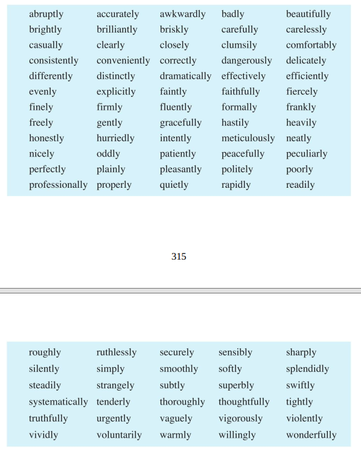

[toc]

&emsp;
&emsp; 
# 1. 副词的类型
副词大体上可分为下面几类：
> ①  时间副词（Adverbs of Time）
> ②  地点副词（Adverbs of Place）
> ③  方式副词（Adverbs of Manner）
> ④  程度副词（Adverbs of Degree）
> ⑤  强调副词（Emphasing Adverbs）
> ⑥  疑问副词（Interrogative Adverbs）
> ⑦  连接副词（Conjunctive Adverbs）
> ⑧  关系副词（Relative Adverbs）
> ⑨  句子副词（Sentence Adverbs）
> 

##  1.1  时间副词（Adverbs of Time）
时间副词有三类：
### 1.1.1 表示发生时间的副词：
> It's beginning to rain now! 现在开始下雨了！
>
> I haven't seen her recently. 最近我没见到她。
>
> Will you be free tonight? 你今晚有空吗？
>
> See you later. 回头见。
>
常见的这类副词有：
|          |            |            |
| -------- | ---------- | ---------- |
| ago      | last night | then       |
| now      | lately     | today      |
| before   | just now   | later (on) |
| recently | so far     | tomorrow   |
| tonight  | yesterday  |            |

### 1.1.2 表示频繁程度的副词， 也称频度副词（Adverbs of Frequency） ：
> She is constantly changing her mind. 她老是改变主意。
> We do m et now and then, but not regularly. 我们确实偶尔也见面， 但不经常见面。
> Lester rarely (seldom) left his room. 莱斯特很少离开他的房间。
> He goes to see her continually. 他频繁地去看她。
> 
这类副词常见的有：
|            |              |              |           |              |
| ---------- | ------------ | ------------ | --------- | ------------ |
| always     | continuously | hardly ever  | ever      | repeatedly   |
| frequently | constantly   | much         | never     | seldom       |
| normally   | continually  | occasionally | rarely    | periodically |
| regularly  | generally    | often        | sometimes | usually      |

### 1.1.3 还有一些其他表示时间的副词：
> I'll be back presently (shortly). 我一会儿就回来。
>
> What decision did you finally arrive at? 你们最后作出了什么决定？
>
> Nancy was up early. 南希很早就起来了。
>
> He has just had an operation. 他刚动过手术。
>
常见的这类副词有：
|         |       |         |           |             |
| ------- | ----- | ------- | --------- | ----------- |
| already | early | finally | first     | immediately |
| just    | late  | long    | presently | right away  |
| shortly | since | soon    | yet       |             |

##  1.2 地点副词（Adverbs of Place）
### 1.2.1 有不少表示地点的副词：
> She is studying abroad. 她在国外留学。
> If he is not here, he's about somewhere. 如果他不在这儿， 那就在附近什么地方。
> They moved downtown. 他们搬到城里去了。
> Then I went upstairs to bed. 然后我就上楼睡觉了。
> 
常见的这类副词有：
|            |             |           |           |            |
| ---------- | ----------- | --------- | --------- | ---------- |
| abroad     | outdoors    | downtown  | eastward  | elsewhere  |
| close (by) | there       | here      | home      | indoors    |
| ahead      | nextdoor    | northward | nowhere   | offshore   |
| downstairs | overhead    | overseas  | somewhere | southward  |
| halfway    | underground | upstairs  | uptown    | westward   |
| nearby     | anywhere    | ashore    | away      | everywhere |

## 1.2.2 与介词同形的副词
&emsp;&emsp; 还有一些部分与介词同形的副词， 有人称它们为副词小品词（Adverb Particles） 。 这些副词与介词同形， 跟宾语的为介词， 否则是副词： 
| 用作介词                                                  | 用作副词                                                       |
| --------------------------------------------------------- | -------------------------------------------------------------- |
| The Dead Sea is **below** see level. 死海在海平面之下。   | I could see the river down **below**. 我可以看到下方的那条河。 |
| Don't stand so **near** the train. 不要站得离火车这么近。 | He lives quite **near**. 他住得很近。                          |
| A cat climbed **up** the tree. 猫爬上了树。               | Stand **up**! 起立！                                           |
| He jumped **off** the horse. 他从马上跳了下来。           | The bird flew **off**. 鸟儿飞走了。                            |
这类副词主要有：
|        |         |         |            |
| ------ | ------- | ------- | ---------- |
| aboard | beneath | down    | throughout |
| about  | beyond  | out     | round      |
| behind | off     | around  | underneath |
| inside | on      | in      | up         |
| above  | along   | outside | below      |
| across | past    | over    | near       |

## 1.2.3 还有一些地点副词表示地区范围等：
> We have no shops locally. 我们在本地区没有商店。
> Fortunately the news was not yet spread widely. 所幸这消息还没有四处传开。
> Eight million people globally are infected with the virus. 全世界有八百万人染上了这种病毒。
> The theory has been universally accepted. 这个理论已被普遍接受。
> 
常见的这类副词有：
|                 |            |
| --------------- | ---------- |
| globally        | locally    |
| nationwide      | widely     |
| internationally | nationally |
| universally     | worldwide  |
此外， 以where构成的副词也是地点副词：
> Let's go **anywhere** where it's quiet. 咱们去一个安静的地方吧。
> Where did you go? **——Nowhere**. 你去哪儿了？ ——哪儿也没去。
> If she doesn't like it here, she can go **elsewhere**. 如果她不喜欢这里， 她可以去别的地方。
> It's the same **everywhere**. 到处都一样。
> I seemed to have met you **somewhere**. 我似乎在哪儿见过你。
> 

##  1.3  方式副词（Adverbs of Manner）
英语中有大量方式副词， 说明行为方式（回答`how`的问题） ：
> She gently refused to accept the gifts. 她委婉地拒绝接受那些礼物。
> These countries were ruthlessly invaded. 这些国家受到残暴的侵略。
> They hoped to see the problem settled peacefully. 他们希望看到这问题和平解决。
> How beautifully your wife dances. 你夫人舞跳得真优美。
> 
下面是一些常见的这类副词:

  

### 1.3.2 还有相当多的副词， 表示某些情绪：
> This I gladly accepted. 这东西我高兴地接受了。
> He shook hands eagerly with Sherlock Holmes. 他热切地与福尔摩斯握手。
> She smiled gratefully. 她感激地笑了笑。
> He looked at her sadly. 他凄然地看了看她。
> 
下面是一些常见的这类副词；
|            |              |             |               |             |
| ---------- | ------------ | ----------- | ------------- | ----------- |
| angrily    | anxiously    | bitterly    | proudly       | impatiently |
| cheerfully | confidently  | boldly      | uncomfortably | miserably   |
| furiously  | gladly       | calmly      | early         | reluctantly |
| helplessly | hopefully    | desperately | excitedly     | sadly       |
| nervously  | passionately | gloomily    | gratefully    | uneasily    |
| shyly      | sincerely    | hopelessly  | happily       | wearily     |

### 1.3.3 还有一些以-ly结尾的副词， 表示动作发生的情况：
The process was controlled automatically. 生产工序是自动控制的。
They trafficked in smuggled goods openly. 他们公开地贩卖走私货。
He left the town secretly. 他悄然离开了这座城市。
I only met her accidentally. 我只是偶然碰见她的。
常见的这类副词有：

  

### 1.3.4 大部分方式副词都由形容词加-ly构成， 但有少数不带-ly词尾：
> I had to work all alone. 我得独自一人工作。
> Do you buy wholesale or retail? 你是批发还是零售？
> She was to fly solo the next day. 第二天她将作单人飞行。
> He spoke impromptu. 他即席讲了话。
> 

##  1.4  程度副词 和 强调副词
程度副词可修饰动词， 表示“到某种程度”：
> I'm extremely disappointed in him. 我对他极其失望。
> He loved his mother dearly. 他深爱他的母亲。
> I strongly object to your saying that. 我强烈反对你这样说话。
> Is she badly hurt? 她伤得重吗？
> 
常见的这类副词有：

##  1.5 疑问副词（Interrogative Adverbs）

##  ⑦  连接副词（Conjunctive Adverbs）

##  ⑧  关系副词（Relative Adverbs）

##  ⑨  句子副词（Sentence Adverbs）