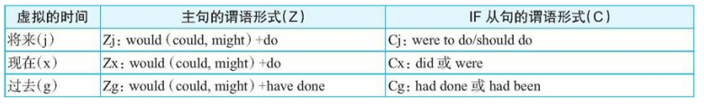

[toc]

&emsp;
&emsp; 
# 1. 综述
## 1. 有哪几种语气？
**语气（Mood）** 也是谓语动词的一种形式，用来表示说话者的意图和态度。英语中有四种 语气：
> ① 陈述语气（The Indicative Mood） 
> ② 疑问语气（The Interrogative Mood） 
> ③ 祈使语气（The Imperative Mood） 
> ④ 虚拟语气（The Subjunctive Mood）
> 
**陈述语气**陈述一个事实或提出一个想法： 
> Ours is a great socialist country. 
> 我们的国家是一个伟大的社会主义国家。（陈述事实） 
> 
> I hope our country will become strong and prosperous. 
> 我希望我们的国家繁荣富强。（提出想法） 
> 
而**疑问语气**用来提出问题： 
> Have you ever been to Japan? 你去过日本没有？ 
> 
> What's your nationality? 你是哪国人？
> 

&emsp;
&emsp; 
# 2. 祈使语气（The Imperative Mood） 
(1) 祈使句中的谓语动词，**都用动词原形**，称为祈使语气。这种句子可向对方提出请求、邀请，给予忠 告、指示、警告，发出命令等： 
> Come and join us. 来和我们一块儿玩。（邀请） 
> Harry up! 赶快！（催促） 
> Cross the bridge and turn left. 过桥向左拐。（指示） 
> Remember to give Mary a ring. 记得给玛丽打个电话。（提醒） 
> Put down your gun! 把枪放下！（命令） 
> Have one more cup of coffee. 再喝一杯咖啡。（敦促） 
> Take care! 保重！（叮嘱）
> Beware of pickpockets! 小心扒手！（警告） 
> Please be seated. 请坐下。（请求） 
> Don't overwork yourself. 不要过于劳累。（劝告）
> 

(2)这种句子的主语一般不说出，但必要时也可说出： 
> You go on;I'll wait. 你往前走，我等一等。 
> You get out of the room! 你给我滚出去！ 
> Someone go and fetch a chair. 谁去搬一把椅子来。 
> You clean the window and you clean the blackboard. 你擦窗子，你擦黑板。 
>
有时加一个呼语，表示是对谁说的： 
> Be quiet, children. 孩子们，安静点。 
> Please sign your name here, sir. 先生，请在这里签名。 
> Fasten your seatbelts, everybody. 请大家系好安全带。 
> John, (you) listen to me! 约翰，你听我说！
> 

(3) let也可引导祈使句：
> Let us stand together in this emergency. 在这紧急时刻让我们站在一起。 
> Let them go by themselves. 让他们自己去。 
> Let us not be alarmed by rumours. 咱们不要为谣言惊慌。 
> Let me out, mother! 让我出去，妈妈！ 
> You're ill. Let me get the doctor. 你病了，我去请医生。
> 

&emsp;
&emsp; 
# 3. 虚拟语气(The Subjunctive Mood)
&emsp;&emsp; 虚拟语气的确比较复杂。 读者在开始学习虚拟语气的时候， 往往会被其较为复杂的不同形式的谓语动词变化弄得晕头转向， 混淆不清。 为此， 请读者一定要首先了解本章的讲解思路： 本章首先向读者介绍三种最基本的虚拟语气的谓语形式， 即
> 将来虚拟
> 现在虚拟
> 过去虚拟
> 
然后介绍
> 混合虚拟句
> 倒装虚拟句
> 跳层虚拟句
> 
最后介绍名词从句中如何使用虚拟， 以及各种要求采用虚拟语气的句型结构。 

## 3.1 综述
### 3.1.1 虚拟语气的作用是？
&emsp;&emsp; 虚拟语气是一种表示假设状态的句型，由`if`引导的状语从句和主句构成。

### 3.1.2 虚拟语气的分类
一般来讲， 英语中的虚拟语气可以分为两大体系： 
> &emsp;&emsp; 一是表示与事实相反的或假想的情形， 通常由`if`引导， 叫做 **“非真实条件句（`unreal conditional`）** ”， 或者叫 **“虚拟条件句”**； 
> &emsp;&emsp; 另一个体系是在名词从句中使用虚拟语气， 表示建议、 命令或要求等语气， 这是一个完全不同于非真实条件句的虚拟的结构形式。 
> 
虚拟语气的重点和难点都集中在 虚拟条件句 中， 我们接下来将会在后面的各节中进行详细和深入的讨论。

### 3.1.3 虚拟条件句： 两类三时
&emsp;&emsp; 这里说的 **“两类三时”** 是指虚拟条件句具有两种类型， 并会对三种时间进行虚拟。 具体来说， 虚拟条件句的两种类型是：
> &emsp;&emsp; **① 假设条件句(hypothetical)**， 顾名思义， 是表示一种假想的情形， 表示说话者的一种主观愿望或态度等， 实现的可能性不大或极小。
> &emsp;&emsp; **② 事实相反句(counterfactual)**， 顾名思义， 是表示与现在或过去的某个事实相反的情形。
> 
对三种时间进行虚拟， 即：
> 对将来、 现在和过去这三种时间的虚拟。
> 
&emsp;&emsp; 现在来分析“两类型”与“三时间”之间的关系， 即假设条件句和事实相反句如何与将来、 现在、 过去这三个时间发生相互作用。
> &emsp;&emsp; **① 将来时间**： 将来的情形还没有发生， 因而不可能成为一个事实， 即谈到将来的一切情形都不是一个事实。 因此， 对于将来时间的虚拟不可能以事实为基础， 而只能是表达说话人的一个设想或愿望。 所以， 对于将来的虚拟只适用于假设条件句， 而不可能表达一个与事实相反的虚拟。
> &emsp;&emsp; **② 现在时间**： 对于现在的情形， 既可能是事实， 也可能是假设条件。 因此， 假设条件句和事实相反句适用于谈现在的情况。
> &emsp;&emsp; **③ 过去时间**： 既然是过去了， 那么谈到的一切情况都已既成事实， 所以过去虚拟表达的是一个与过去事实相反的情形。
>
&emsp;&emsp; 简言之， 对于将来的情形只能是假设； 对于现在的情形既可以是假设， 也可以是谈与现在事实相反的情况； 对于过去， 只能是谈与事实相反的情形。 下面先简单举几个例句来说明上面讨论过的观点， 以便让读者更好地理解。 请看例句：
> (1) If I were to have the time tomorrow, I would help him.
> 如果我明天有时间， 我就会帮他的。
> 
这里是表示将来虚拟假设的情形。 用了虚拟， 就表明说话人“我”认为自己明天有时间的可能性不大， 所以言外之意是“我”可能帮不了他。 这里用虚拟只是说明可能性不大（unlikely） ， 而不是表达与事实相违背的不可能的情形（impossible） 。

> (2) If I had the time now, I would help him.
> 如果我现在有时间， 我就会帮他的。
> 
这里是表示现在虚拟假设的情形。 用了虚拟， 就表明说话人“我”认为自己现在有时间的可能性不大， 所以言外之意是“我”可能帮不了他。 这里用虚拟也只是说明可能性不大（unlikely） ， 而不是表达与事实相违背的不可能的情形（impossible） 。 比如“我”现在完全可以抛开一切事情不做而去帮他， 所以可能性还是存在的。

> (3) If I were you, I would help him.
> 如果我是你， 我就会帮他的。
> 
这里是表示与现在事实相反的情形。 因为“我”成为“你”是不可能发生的（impossible） 情形， 而不是可能性不大（unlikely） 的情形了。

再来看下面三个表示与现在事实相反的情形：
> (4) If I were the President, I would make some changes.
> 如果我是总统， 我就会做一些改革。
> 
“我”现在不是“总统”， 这是一个现在的事实， 即这里是表示与现在事实相反的情形。

> (5) If my grandfather were alive today, he would experience a very different world.
> 如果我爷爷现在还活着， 那他就会经历一个完全不同的世界了。
> 
“我爷爷”现在已经去世（即`my grandfather is not alive today`），这是一个现在的事实，即这里是表示与现在事实相反的情形。

> (6) If my grandfather were here now, he would be angry.
> 如果我爷爷现在在这里， 他会很生气的。
> 
“我爷爷”现在不在这里， 这是一个现在的事实， 即这里是表示与现在事实相反的情形。

来看表示对过去事实虚拟的句子：
> (7) If I had had the time yesterday, I would have helped him.
> 昨天我要是有时间的话， 我就会帮他了
> 
“我”昨天没有时间， 这已成为一个确立的事实， 不可更改。 这里说“如果我昨天有时间的话”显然是与这个过去的事实相违背的情形。

&emsp;&emsp; 综上所述， **假设条件句**表达的是一种在将来或现在可能性不大（unlikely） 的情形， 但不是不可能（impossible） 的情形， 表示说话人认为不可能， 是一种比较主观的表达， 而不是与客观事实相反。 它尤其用来谈将来的情形， 也可以谈现在。 
&emsp;&emsp; **事实相反句**表达的是一种与现在或过去的事实相违背的情形， 因此是不可能发生的， 而不是可能性不大。 它适合谈现在或过去。 
&emsp;&emsp; 由此可见， 谈**将来**的情形， 只能是假设条件句； 谈**现在**的情形， 既可能是假设条件句， 也可能是事实相反句； 谈**过去**的情形， 只能是事实相反句。

### 3.1.4 虚拟条件句的谓语变化
&emsp;&emsp; 我们在上一小节中讨论了两种类型的虚拟句（即假设条件句和事实相反句） 与将来、 现在、 过去这三种时间的关系， 但对于英语学习者来说， 重要的不是如何区分两种类型的虚拟句， 而是要弄清楚在三种不同时间的情况下， 虚拟句的主句和从句的谓语动词的复杂变形。
&emsp;&emsp; 现在把三种不同时间下的主、 从句的谓语形式列表如下：

  

  <b> 图1 正向代理示意图 </b>  

注： 
> (1) 我们用汉语拼音字母Z表示主句， C表示从句；
> (2) 我们用汉语拼音字母j表示将来时间， x表示现在时间， g表示过去时间；
> (3) 因此， Zj表示主句为将来虚拟， Zx表示主句为现在虚拟， Zg表示主句为过去虚拟； Cj表示从句为将来虚拟， Cx表示从句为现在虚拟， Cg表示从句为过去虚拟。
> 
以上采用汉语拼音的首字母来标注主从句以及将来、 现在、 过去， 是为了便于读者记忆， 因为上面表格中的6种不同的谓语形式， 必须牢牢记住， 它们是正确使用虚拟语气的起点。 尤其是现在和过去的四种谓语形式， 更需要分别牢牢记住。 这里强调要“分别”记住， 是因为在实际的使用中， 主从句的谓语可能会有以下四种不同的搭配组合（以would为例） ：
> (1) 现在虚拟： ZxCx型（主现从现） ： `would do ＋ if...did`， 这里的主句和if引导的条件状语从句都是表示对现在的虚拟。
> (2) 过去虚拟： ZgCg型（主过从过） ： `would have done ＋ if...had done`， 这里的主句和if引导的条件状语从句都是表示对过去的虚拟。
> (3) 混合虚拟（一） : ZxCg型（主现从过） ： `would do ＋ if...had done`， 这里的主句是表示对现在的虚拟， 而if引导的条件状语从句是表示对过去的虚拟， 即主句与从句所虚拟的时间不一致。
> (4) 混合虚拟（二） : ZgCx型（主过从现） ： `would have done ＋ if...did`， 这里的主句是表示对过去的虚拟， 而if引导的条件状语从句是表示对现在的虚拟， 即主句与从句所虚拟的时间不一致。
> 

&emsp;
## 3.2 将来虚拟（ZjCj）
&emsp;&emsp; 下面先来讨论将来虚拟。 对于将来虚拟， 我们知道， 它只能是谈将来的 **“不大可能”** 的情形， 而不是一个与事实相反的情形。 我们常常会用将来虚拟来谈一个不太可能实现的愿望。 比如：
> (1) If I **were to live** my life over again, I **would have** you as my wife.
> 如果我有来生， 我一定会娶你为妻。
> 
这句将来虚拟表达的就是一个良好的愿望， 但将来不会实现的。

或者用将来虚拟来谈一个说话人认为不太可能发生的情形， 这表明了说话人的自信程度。 比如：
> (2) If I **should win** the lottery, I **would buy** a house.
> 万一我赢得了彩票大奖， 我就会买一栋房子。
> 
这里说话人用`should`， 就是表示他对于自己赢得大奖的信心不大， 但还是想碰碰运气。 也相当于表达了自己将来的愿望。

&emsp;&emsp; 再比如下面这句， 同样表明了将来实现的可能性不大的情形：
> (3) Sometimes I have thought it **would be** an excellent rule to live each day as if we **should die** tomorrow. Such an attitude **would emphasize** sharply the values of life.
> 我时常会想， 如果我们能以明天就要告别这个世界的态度来度过每一天的话， 那一定是极好的， 因为这种心态会让每一个人珍视生命的意义。
> 
有人说， 每个人生来就得了一种绝症——死亡。 不过， 与癌症这样普通的绝症不同的是， 我们无法预知自己的死期。 因此， 这里说“假如我们明天就会死掉”， 这不是绝对不可能发生的， 而只是可能性不大， 所以要用将来虚拟`should die`来表达这种将来的“小概率”事件。

&emsp;&emsp; 事实上， 对于很多将来的情况， 选择用虚拟还是不用虚拟， 完全取决于说话人对所陈述事件的态度，或者说虚拟语气能表明说话人的态度。 比如下面这个例句：
> (4) What do you think **would be** the value of the necklace, if I **were to sell** it?
> 假如我把这串项链卖了， 你觉得会是什么价？
> 
这里“卖项链”这个事件是说话人完全可以控制的， 不是像“假如我有来生”那样完全不能掌控， 但说话人依然用了将来虚拟的谓语形式`were to sell`， 这只是向听者／ 读者表明自己这样一个态度——自己不会卖或不大可能会卖这个项链的。 至于为什么不大可能卖这项链， 只有说话人自己才知道， 也不是听者所关心的。

&emsp;&emsp; 既然将来虚拟在很大程度上是由说话人对事件的态度决定的， 所以， 将来虚拟使用起来非常灵活。 比如， 同样是上面这个“卖项链”的事件， 如果是对于一个急需钱用而且想把自己的项链卖掉来换钱的人， 若他在询问卖价， 这时他就不会用将来虚拟了， 而是用一般陈述的语气来这样说：
> (5) What do you think **is** the value of the necklace **if** I sell it to you? 
> 如果我把这串项链卖给你， 你能出什么价？
> 
这里说话人是真想卖掉项链， 所以他就用`is`和`sell`这样的一般时态来询问卖价。

&emsp;&emsp; 再来比较下列真实条件和将来虚拟条件的区别：
> (6) 1） If it **were to rain**, I **would stay** home.
> 2） If it **rains**, I **will stay** home.
> 
> 1） 万一要下雨， 那我就在家呆着。
> 2） 如果下雨了， 我就在家呆着。
> 
这种不同语气的选择， 反映了说话人对未来下雨的可能性的信心程度不同：
> &emsp;&emsp; 在例句1） 中， 用了虚拟语气， 表明说话人认为将来不太可能会下雨。 
> &emsp;&emsp; 在例句2） 中， 用了陈述语气， 表明说话人认为将来下雨的可能性比较大。
> 

&emsp;&emsp; 再来看下面这个例句：
> (7) What **would** happen if someone **were to** dispose litter in a public place? "It **would** stir public anger and denouncement," Sonia said. "People **would** look at you strangely as if you **were** an alien from outer space. At the same time, someone **would** quietly pick it up for you. Who **wouldn't** be embarrassed by such a scene?" 
> 如果有人在公共场所公然乱扔垃圾， 会怎样呢？ 索尼娅说： “这会引起公愤， 招来谴责。 人们会用奇怪的目光看着你， 仿佛你是个外星来的怪物， 而且会有人默默地替你拾起垃圾。 如果置身于这样的场景之中， 谁能不感到尴尬呢？ ”
> 
大家看到了， 这里用的都是虚拟语气， 言外之意是， 那里的人们不可能在公共场所乱扔垃圾， 或者说这种情况极少发生。 这段文字来自一篇谈论北欧国家国民素质的文章。 可以想象， 如果这是在谈论我们国人的情况， 那笔者想就不必用虚拟语气了——因为在公共场所随地乱扔垃圾在中国是司空见惯的现象， 不是不可能发生的， 所以自然不必虚拟了。

**思维总结**
> &emsp;&emsp; 将来虚拟的谓语结构形式是： 从句用`were to do`或`should do`， 主句用`would do`。 其意义是用将来虚拟谈论自己认为不太可能发生的事情。 另外要注意的是， 将来虚拟在很大程度上是由说话人对事件的态度决定的。 所以， 将来虚拟使用起来非常灵活， 这一点需要读者注意了： 你说话语气（虚拟还是不虚拟） 的选择， 反映了你的态度。
>

&emsp;
## 3.3 现在虚拟（ZxCx）
### （一）假如世界是一个村落
&emsp;&emsp; 记得曾经读过大卫·史密斯（David J. Smith） 写的一篇文章《假如世界是一个村落》 （`If the World Were a Village`） 。大卫把拥有60多亿人口的地球想象成一个只有100人的村落， 他以这种独特的方式， 为我们提供了一个全球的视角， 让我们懂得不同民族和地域中的人们的生活是如此不同， 促使我们换一个角度重新审视自己的生活。 文章读来给人颇多感悟：
> (1) If we **could**(从句用的can的过去式could) shrink the earth's population to a village of precisely 100 people, with all the existing human ratios remaining the same, it **would look** something like the following:
> &emsp;&emsp; There **would be** 57 Asians, 21 Europeans, 14 from the Western Hemisphere, both north and south, 8 Africans.
> &emsp;&emsp; 52 **would be** female and 48 **would be** male.
> &emsp;&emsp; 70 **would be** non-white and 30 **would be** white.
> &emsp;&emsp; 70 **would be** non-Christian and 30 **would be** Christian.
> &emsp;&emsp; 89 **would be** heterosexual and 11 **would be** homosexual.
> &emsp;&emsp; 22 **would speak** Chinese, 9 **would speak** English and 7 **would speak** Spanish.
> &emsp;&emsp; 6 **would possess** 59% of the entire world's wealth and all 6 **would be** from the United States.
> &emsp;&emsp; 80 **would live** in substandard housing.
> &emsp;&emsp; 70 **would be** unable to read.
> &emsp;&emsp; 50 **would suffer** from malnutrition.
> &emsp;&emsp; 1 **would be** near death; 1 **would be** near birth.
> &emsp;&emsp; 1 (yes, only 1) **would have** a college education.
> &emsp;&emsp; 1 **would own** a computer.
> 
> 如果我们把全世界的人口按照现有的比例压缩为一个拥有100人的村子， 情况就会像下面这样：
> 在这个村子里：
> 57人是亚洲人， 21人是欧洲人， 14人来自西半球的南、 北美洲， 8人是非洲人。
> 52人是女性， 48人是男性。
> 70人是有色人种， 30人是白人。
> 70人是非基督教徒， 30人是基督徒。
> 89人是异性恋者， 11人是同性恋者。
> 22人说汉语， 9人说英语， 7人说西班牙语。
> 6人拥有全世界59％的财富， 而且这6人全是美国人。
> 80人的居住环境不达标准。
> 70人是文盲。
> 50人营养不良。
> 1人濒临死亡边缘， 1人正要出生。
> 1人（是的， 只有1人） 接受大学教育。
> 1人拥有电脑。
> 
透过这张微缩的“世界村落图”， 我们可以从国籍、 语言、 宗教信仰、 种族和教育水平等众多方面更清晰地了解这个世界。 通过这些比较和对照， 作者希望世界人民能够彼此理解和接纳， 并在书的最后告诫我们该如何去感受和珍惜现在所拥有的幸福：
> (2) The following is also something to ponder...
> &emsp;&emsp; If you woke up this morning with more health than illness, you are more blessed than the million who will not survive this week.
> &emsp;&emsp; If you have never experienced the danger of battle, the loneliness of imprisonment, the agony of torture, or the pangs of starvation...you are ahead of 500 million people in the world.
> &emsp;&emsp; If you have food in the refrigerator, clothes on your back, a roof overhead and a place to sleep...you are richer than 75% of this world.
> &emsp;&emsp; If you have money in the bank, in your wallet, and spare change in dish someplace...you are among the top 8% of the world's wealth.
> &emsp;&emsp; If your parents are still alive and still married...you are very rare, even in the United States and Canada.
> 
> 
> 再从以下角度来想想看：
> &emsp;&emsp; 如果你今天早上醒来的时候依然健康无恙， 那么， 比起活不过这一周的百万人来说， 你真是幸福多了。
> &emsp;&emsp; 如果你未曾经历过战争的危险、 入狱的孤独、 严刑的折磨或者饥饿的痛苦……那么， 比起世界上的5亿人来， 你真是幸运多了。
> &emsp;&emsp; 如果你的冰箱里有食物、 身上有衣服穿、 头上有屋篷遮蔽、 晚上有地方睡觉……那么， 比起世界上75％的人来， 你真是富足多了。
> &emsp;&emsp; 如果你银行中有存款、 钱包里有钱， 还能下馆子就餐……你便跻身于世界上最富有的8％的人口当中了。
> &emsp;&emsp; 如果你的父母依然健在， 而且他们没有离婚还在一起生活的话……那你可真是幸运之至， 因为即使是在美国和加拿大，这也是非常难得的事。
> 
&emsp;&emsp; 通过比较上述两部分的英文内容， 可以发现， 前面黑体部分英文句子的谓语形式（如`If we could shrink...it would look...`） 与后面非黑体的英文谓语形式（如最后一句`If your parents are...you are very rare...`）有很大的不同： 黑体部分的谓语大都采用了“would＋动词原形”的形式， 而下文没有黑体部分的谓语则采用了动词的一般现在时态。 这是为什么呢？
这里其实就涉及对现在一般情况的虚拟。 当大卫说：
> If we **could** shrink the earth's population to a village of precisely 100 people, with all the existing human ratios remaining the same, it **would look** something like the following.
> 
毫无疑问这是一个虚拟假设的情形， 因为我们不可能把地球上的60多亿人口缩减到100人， 所以作者在从句中用了过去式`could`， 而主句中用`would look`这样标准的一般虚拟的谓语形式。 接下来的黑体部分都是虚拟主句谓语， 所以都统一采用了`would`接动词原形的形式。 比如：
> 1） There would be 57 Asians, 21 Europeans, 14 from the Western Hemisphere, both north and south, 8 Africans.
> 2） 52 would be female and 48 would be male.
> 3） 70 would be non-white and 30 would be white.
> 4） 70 would be non-Christian and 30 would be Christian.
> 5） 89 would be heterosexual and 11 would be homosexual.
> 6） 22 would speak Chinese, 9 would speak English and 7 would speak Spanish.
> 7） 6 would possess 59% of the entire world's wealth and all 6 would be from the United States.
> 8） 80 would live in substandard housing.
> 9） 70 would be unable to read.
> 10） 50 would suffer from malnutrition.
> 11） 1 would be near death; 1 would be near birth.
> 12） 1 (yes, only 1) would have a college education.
> 13） 1 would own a computer.
> 
在第二部分， 作者说：
> If you **woke** up this morning with more health than illness, you are more blessed than the million who will not survive this week.
> 
这里从句的谓语`woke`用过去式并不是表示虚拟， 而是因为`this morning`（今天早晨） 相当于一个过去的时间， 所以`woke`就是一个一般过去时态。 同样， 主句的谓语用了一般现在时态`are`， 而不是`would be`这样的虚拟形式。 在接下来的几句里， 作者都是在叙述真实的条件， 所以都没有采用虚拟语气。 比如：
> 14） If you **have never experienced** the danger of battle, the loneliness of imprisonment, the agony of torture, or the pangs of starvation...you **are** ahead of 500 million people in the world.
> 15） If you **have** food in the refrigerator, clothes on your back, a roof overhead and a place to sleep...you **are** richer than 75% of this world.
> 16） If you **have** money in the bank, in your wallet, and spare change in dish someplace...you **are** among the top 8% of the world's wealth.
> 17） If your parents **are** still alive and still married...you are very rare, even in the United States and Canada.
> 

### （ 二）假如给我三天光明
&emsp;&emsp; 相信大家都知道美国聋哑女作家、 教育家海伦·凯勒（`Helen Keller`, 1880-1968） 的故事。 她两岁时， 一场大病夺取了她的听力和视力， 后受业于安·沙利文·麦希（ `Anne Sullivan Macy`） 夫人。 1904年， 海伦以优异的成绩毕业于剑桥大学拉德克里夫学院（` Radcliffe College`）。她终生致力于聋哑和盲人的公共救助事业。下面这篇短文就是选自她的《假如给我三天光明》( `Three Days to See`)，文章借助“虚拟”的假设来让人们进行换位思考，让人们真正意识到拥有健康是多么幸福：
> (3) &emsp;&emsp; I have often thought it **would be** a blessing if each human being **were stricken** blind and deaf for a few days at some time during his early adult life. Darkness **would** make him more appreciative of sight; silence **would** teach him the joys of sound.
&emsp;&emsp; If I **were** the president of a university I **should establish** a compulsory course in "How to Use Your Eyes". The professor **would** try to show his pupils how they could add joy to their lives by really seeing what passes unnoticed before them. He **would** try to awake their dormant and sluggish faculties.
&emsp;&emsp; Suppose you set your mind to work on the problem of how you **would use** your own eyes if you **had** only three more days to see. If with the oncoming darkness of the third night you knew that the sun **would** never rise for you again, how **would** you spend those three precious intervening days? What **would** you most want to let your gaze rest upon?

> &emsp;&emsp; 我常常想： 如果每一个人在他生活的早期都要遭受几天的眼睛失明， 耳朵失聪， 那该是多么的幸福啊！ 黑暗会使他更加珍惜视觉； 寂静无声能教会他欣赏声音的美妙。
> &emsp;&emsp; 如果我是一名大学校长的话， 我会开设一门“如何用眼”的必修课。 教授应该让学生们知道， 因为他们能够真正看到眼前所发生的一切， 这给他们的生活增添了多大的乐趣啊， 他一定要唤醒学生们迟钝、 麻木的感光官能。
> &emsp;&emsp; 设想你在思考这样一个问题： 假如你只有三天的视力， 你该如何使用你的眼睛。 假如在第三天晚上， 随着黑暗的降临，你知道明天太阳不会再为你升起， 你将如何度过这宝贵的三天？ 你最想让你的目光凝视在什么上面？
> 
读者注意上文中的这些句子表达：
> ...it **would be** a blessing if each human being **were stricken** blind and deaf for a few days at some time during his early adult life.
> If I **were** the president of a university I **should** establish a compulsory course in "How to Use Your Eyes".
> ...how you would use your own eyes if you had only three more days to see.
> If with the oncoming darkness of the third night you **knew** that the sun **would** never rise for you again, how **would** you spend those three precious intervening days?
> 
这些都是标准的现在虚拟句， 即从句使用一般过去时态； 如果是`be`动词， 则不论句子的主语是单数还是复数， 都是复数形式`were`， 而不是`was`； 相应地， 主句用`would/should ＋ 动词原形`。

### （ 三）来看下面这个幸福婚姻的秘诀：
> (4) It is not the lack of love that makes unhappy marriages; it is the lack of friendship. My advice to all men is "Choose in marriage a woman that you would choose as a friend if she were a man". This applies to women in the same way. One tragedy in many marriages is that the romantic love on which it was based never ripened into friendship.
> 婚姻不幸福并不是因为缺乏爱， 而是因为婚姻中缺少了友谊。 我对于男士们的建议是： 选取结婚对象时， 要找这样的女人——假如她们是男人的话， 你愿意和他们做朋友。 我的这个建议同样也适用于女人。 许多婚姻的不幸往往是： 作为婚姻础的浪漫爱情没有升华成为友情。
> 
这里作者说“如果这个女人是一个男人”， 但实际上女人是无法变为男人的（当然变性手术不算在内） ， 所以这是一个对一般情况的虚拟。 作者通过现在虚拟的句子`...a woman that you would choose as a friend if she were a man`， 来说明夫妻之间有友情的存在对于幸福婚姻的重要性。

### (四) 其它例子
emsp;&emsp; 说到美国人的极大浪费， 美国环境保护专家彼得·拉文（`Peter Raven`） 有这样一句话：
> (5) If everyone **lived** like Americans, then you **would need** three planet earths to sustain that level of consumption.
> 如果世界上每一个人都像美国人这般生活的话， 那我们得需要三个地球方能维持这样的消费水平。
> 
由此可见， 美国人常常指责别国破坏地球环境， 浪费资源， 殊不知他们自己才是破坏地球环境真正的的罪魁祸首。 在这句话中， 彼得就是用了虚拟语气， 因为事实上我们没有三个地球来供我们浪费和糟蹋。 所以， 主从句的谓语分别采用了“would＋动词（need） 原形”和过去式（lived） 这样标准的一般虚拟形式。

emsp;&emsp; 下面这句话则用虚拟语气反问， 假如中国也达到美国人一般的生活水准， 比如每个家庭拥有两辆小汽车、 每人每年肉类的消费量达到122公斤， 那中国该怎样应对这种需求呢？
> (6) How **would** the Chinese **cope** if the average family in China **had** two cars, and, like Americans, the average person **ate** 269 pounds (122 kilograms) of meat a year?
> 如果中国人也达到美国人那样的生活水平， 比如平均每个家庭拥有两辆小汽车、 每人每年平均消费269磅（122公斤） 肉类食品， 中国将如何应对这种情况呢？
> 
由于事实上，中国目前还远没有达到这种生活水平，所以在叙述时也不要忘了使用虚拟语气， 即主句用`would ＋ cope`，从句用过去式`ate`。

emsp;&emsp; 罗素的自传中有这个句子：
> (7) This has been my life. I have found it worth living, and **would** gladly live it again if the chance **were** offered me.
> 这就是我的一生。 我已经找到了它的价值。 而且如果有机会， 我很愿意能再活它一次。
> 

emsp;&emsp; 一个美国教授谈到语言学习时说：
> (8) emsp;&emsp; For a North American or European, languages such as Chinese, Korean, and Japanese have what is like pictograph or ideographic type of language. Native speakers of European languages often have a very difficult time in learning one of the Asian languages, as our ears are not attuned to the sounds or characters of the language. In China, I am like a child in terms of the language, and illiterate in terms of being able to read or write Chinese. If I **could** read and write in Chinese, I **would need** to recognize at least 3,000 or more characters.
> emsp;&emsp; Chinese also have a hard time learning the European languages such as English, French, Spanish, Italian, or German, because each of these languages is filled with many idioms which don't make much sense in terms of the formal language that they learn.
>
> emsp;&emsp; 对于北美人或欧洲人来说， 汉语、 韩语和日语等语言就像是图画语言或表意文字。 以欧洲语言为母语的人往往会发现这些亚洲语言很难学， 因为我们的耳朵生来就不适应这些语言的发音或写法。 在中国， 在语言方面我像是一个孩子， 就汉语的读写能力而言， 我则像是文盲。 如果我希望能够具备中文的读写能力， 我则需要认识至少3,000汉字或更多。
> emsp;&emsp; 中国人在学习欧洲的语言方面， 比如英语、 法语、 西班牙语、 意大利语或德语等， 也常常会感到困难， 因为这些语言中含有大量的成语， 而这些成语， 如果按照他们所学的正式的外语来解释， 并没有什么意思。
> 
因为这位美国教授不懂汉语， 所以他用了虚拟语气说`If I could read and write in Chinese, I would need to recognize at least 3,000 or more characters`.

emsp;&emsp; 笔者的一位美国朋友在和笔者聊起中国学生学习英文所遭遇到的众多困惑和难题时说道：
> (9) From the letters I have been receiving from our Chinese readers, the problem with tense seems to be foremost. English tenses would make me tense if I were a Chinese student.
> 从中国读者给我的来信中看出， 他们学习英文最大的难题似乎是在时态方面。 如果我是一名中国学生， 时态同样会让我
犯憷。

emsp;&emsp; 虚拟语气尤其能考量我们的英语思维能力。 在日常的口语交际中， 我们会遇到大量虚拟假设的情景， 此时就需要有良好的思维嗅觉能力， 敏感地辨别真假情形， 正确地使用语气表达。 比如对于“假如我当总统， 我会……”这样一个简单的句子， 都要根据说话人的不同身份来选择不同的语气表达。 比如，这句话若是出自一个小学生之口， 他应该说成：
> (10) If I **became** President, I **would**...
> 
因为对于一个小学生来说， “当总统”是一个与现实相反的虚拟假设， 所以这句话要借助谓语动词变化（即从句用过去式became， 主句用would接一个原形动词） 来传达这种虚拟的情形。 但若是对于一位正在竞选中的总统， 比如现在（指2004年9月笔者写下这句话的时候） 的美国民主党候选人约翰·克里（`John Kerry`） ， 他则要这么说：
> (11) If I **became** President, I **will** make America stronger at home and more respected in the world.
> 如果我当了美国总统， 我要（让美国变得更强大， 在国际上更受尊重） 。
> 
因为他应该用表示真实条件的陈述语气来表明对自己未来总统竞选获胜的信心。 如果克里用虚拟语气说：
> If I **became** President, I **would**...
> 
恐怕连本来支持他的选民都要改旗易帜支持小布什了。 由此可见虚拟语气的表达之精妙， 它决不是一个死规则， 而是一种活生生的英语思维。
**思维总结**
> emsp;&emsp; 这一节讨论的是ZxCx型虚拟语气， 即主句和从句都表示对现在一般情况的虚拟。 此时， 主句用`would do`， 而从句用一般过去时态`did`； 若从句的谓语是be动词， 则一律用`were`。
> 

&emsp;
## 3.4 过去虚拟（ZgCg）
### （一）只要有Love， 就会有Wealth和Success
&emsp;&emsp; 从前有位老妇人， 有一天在自家门口发现有三个白须飘然的老头正坐在她家前院。 但她并不认识他
们， 于是她对三个老头说道： “我想我应该不认识你们， 但我想你们一定是饿了， 请来我家吃些东西吧（`I don't think I know you, but you must be hungry. Please come in and have something to eat.`） ”听了老妇人的邀请， 他们说道： “我们三个人不会同时进去的（`We do not go into a house together.`） ”老妇人很是纳闷， 就问： “为什么呀？ ”
&emsp;&emsp; 这时， 有个老头就告诉她理由。 他指着其中一个老头说道： “他名叫‘财富’（`His name is Wealth.`） ”又指着另一个老头说： “他是‘成功’， 我是‘爱’（`He is Success and I am Love.`） ”说完， 他又补充道： “现在请你回家同你丈夫商量一下， 我们这三个人你们愿意邀请谁进去（`Now go in and discuss with your husband which one of us you want in your home.`） ”
&emsp;&emsp; 于是， 老妇人回到家里告诉她老伴儿院子里发生的事， 并且跟她老伴儿商量， 有`Wealth, Success`和`Love`三个老头， 到底该邀请谁进屋呢？ 她老伴儿提议说： “既然这样， 那我们就邀请‘财富’老人进来吧， 这样我们家就会充满财富（`Since that is the case, let us invite Wealth. Let him come and fill our home with wealth!`） ”
&emsp;&emsp; 但是老妇人对此并不同意， 她说道： “老头子， 我们为什么不邀请‘成功’老人呢（`My dear, why don't we invite Success?）` ”
&emsp;&emsp; 这时， 他们的儿媳妇听到了老两口的对话， 说出了自己的想法： “如果我们把‘爱’邀请进来不是更好吗？ 这样我们家就会充满爱（`Wouldn't it be better to invite Love? Our home will then be filled with love!`） ”老两口最后一商量， 也都赞成儿媳妇的意见， 于是老头对老妇人说： “那我们出去把‘爱’请进来作为我们的客人吧（`Go out and invite Love to be our guest.`） ”随后老妇人又来到门口准备邀请“爱”进来做客。 看着三位老头， 她问道： “你们仨谁是‘爱’呀？ 请进来做客吧（`Which one of you is Love? Please come in and be our guest.`） ”
&emsp;&emsp; 这时， 老头“爱”就站起身开始朝屋里走去， 但与此同时另外两个老头“财富”和“成功”也跟在“爱”的后面朝屋里走。 老妇人很惊讶， 就问“财富”和“成功”： “我刚才只邀请了‘爱’， 你们俩为什么也要进来呀（`Surprised, the lady asked Wealth and Success, "I only invited Love. Why are you coming in?`） ”
下面是这两位老人的精彩回答：
> (1) The old men replied together, "If you had invited Wealth or Success, the other two of us would've stayed out, but since you invited Love, wherever he goes, we go with him. Wherever there is Love, there is also Wealth and Success!"
> 两位老人齐声回答道： “如果你刚才只邀请了‘财富’或‘成功’中的任何一位， 那剩下两位都将留在门外。 但是， 既然你已经邀请了‘爱’， 所以， 他去哪里， 我们就跟到哪里， 因为只要有‘爱’的地方， 就会有‘财富’和‘成功’！ ”
> 
这个故事的寓意不需在此赘述。 我们再看看两位老人最后的回答：
> (2) If you **had invited** Wealth or Success, the other two of us **would've stayed** out.
> 
但实际上被邀请的是`Love`， 所以这句话说“如果你刚才邀请了‘财富’或‘成功’”， 显然是对过去事实的一个相反的假设， 也就是对过去的虚拟。 根据英文的思维表达， 表示对过去的虚拟， 主句的谓语要采用`would have done`的形式， 从句的谓语则要用过去完成时态`had done`。 所以， 上述例句正是采用了这一虚拟形式： `would have stayed`和`had invited`。

### （二）
&emsp;&emsp; 上面这个故事告诉我们： “只要有爱， 就会有财富和成功”。 这并不是说“爱”就真的一定会给我们带来物质和金钱上的财富， 而是要告诉我们， 爱与被爱才真正赋予了生命的意义， 就如同人们说的： `Love is a reason to live`.还有一句至理名言是这样说的： `Love makes the world go around.`不过下面这个故事也许会给恋爱中的你带来另外的启示：
> (3) &emsp;&emsp; "Do you love me?—Yes. Do you really, really love me?—Yes." It was a question that has been posed to many a lover. But Stephanie Powell had a special reason for asking her boyfriend, Wayne, if he loved her. Because Stephanie had just won $7 million on the lottery and wanted to make sure of Wayne's devotion before she told him the good news. "If he had known about the win I would never have known whether it was me or the money he would want to stay with," she said. "I don't know what I would have done if he hadn't answered yes. I love him and want to enjoy spending the money with him."
> &emsp;&emsp; “你爱我吗？ ——爱。 你是真的爱我吗？ ——真的爱。 ”这样的问题许多恋人相互之间都问过， 但是斯蒂芬妮·鲍威尔问她的男朋友韦恩是否爱她时， 却是有特别的原因。 因为她刚中了700万美元的彩票， 想先确证她男友是否真的爱她， 然后再告诉他这一好消息。 她后来说： “如果他先知道我赢得了这个大奖， 那我就无从知晓他和我交往是因为爱我， 还是因为爱我的钱。如果他当时没有回答说爱我， 我真不知道该怎么办， 因为我爱他， 所以愿意和他分享这笔巨款。 ”
> 
从这个故事我们看到， 韦恩因为说了“爱”， 而获得与女友一起分享700万美元巨款的机会。 所以， 当如果有同样的“机会”惠顾你时， 记住一定要毫不犹豫地告诉他／ 她“爱”， 因为`Wherever there is Love, there is also Wealth！`
&emsp;&emsp; 故事中的斯蒂芬妮·鲍威尔说的两句话：
> 1） If he **had known** about the win, I **would never have known** whether it was me or the money he would want to stay with.
> 2） I don't know what I **would have done** if he **hadn't answered** yes.
> 
这显然是在她后来回顾这个事件时说的话， 此时， 这个事件已成为过去。 斯蒂芬妮用了两个假设从句说“假如他知道”和“假如他没有回答‘是’”， 这两个从句都是表示与过去的事实相反。 主句同样也是表示过去虚拟假设。 因此， 主句和从句的谓语分别用了`would never have known`和`had known`， 以及`would have done`和`hadn't answered`这样的动词虚拟形式。
&emsp;&emsp; 爱情是人类永恒的话题， 但并不是每段美好的爱情最终都能走进幸福的婚姻。 如果婚姻不幸， 最终导致离婚， 那对孩子的伤害应该是最大的。 下面这篇短文就是英国球星贝克汉姆谈论父母离婚给他留下的阴影——他始终认为父母的离异或许是自己的错。

> (4) Beckham and Divorce
> &emsp;&emsp; I grew up in the love of a family. Without Mum and Dad, none of my story would be here for the telling. Like any son, I wouldn't have grown up into the person I am if they hadn't passed on their values to me. Marriage and parenthood, I think, are the two most important things any of us ever take on in our lives. That explains why my parents' splitting up has been probably the most difficult episode I've ever had to face up to in my whole life. To be honest, I'm still trying to face up to it now, probably the hardest thing to deal with has been thinking — or being made to think — that the split was somehow my fault. I remember the time and the energy they both put into me as a son and as a promising footballer. Should they have given some of the attention they gave me to each other instead?
> &emsp;&emsp; However old you are when it happens, children in a divorce always find themselves feeling guilty. I believe that what happens between husband and wife, deep down, is between husband and wife and nobody else; not even their sons and daughters can change the outcome.
> &emsp;&emsp; The story of my parents' marriage makes me feel sad, empty inside. What was home isn't anymore. Who can tell what lies down the road for you in your own life?
> 
贝克汉姆与离婚
> &emsp;&emsp; 我是在家人的关爱中成长的。 没有父母， 就没有今天我在这里所说的一切。 像世间任何一个子女一样， 没有父母的教诲， 我也就不能成为现在的“我”。 我认为， 婚姻和亲子关系是生命中最为重要的东西。 所以， 父母的离异有可能是我整个人生中必须面对的最艰难的一关。 老实说， 直到现在我都还在努力克服这件事带给我的影响。 也许， 最困难的还是自己的想法——或者说是被迫去想——认为父母的离异或许是自己的错。 我仍然铭记他们俩对我付出的时间和精力， 不论他们是把我看作一个儿子还是一个有前途的球员。 他们是否应该把部分放在我身上的精力投到彼此身上呢？
> &emsp;&emsp; 不论父母离异时孩子有多大， 孩子都会责备自己。 事实上， 我相信， 夫妻间无论发生了什么事都是夫妻间的事， 与他人无关； 即使是他们的子女都不能改变这个事实。
> &emsp;&emsp; 父母的婚姻让我觉得很伤心， 心里好像被掏空了。 家不成家。 谁又能知道在前方等待自己的又是什么呢？
> 
从最后一句， 我们能感受到， 即使是现在在谈及自己的家庭时， 小贝依然会黯然神伤。 但对于父母在他成长过程中给予他的爱， 他依然心存感激， 所以他在上文中说：
> Like any son, I **wouldn't have grown** up into the person I am if they **hadn't passed** on their values to me. Marriage and parenthood, I think, are the two most important things any of us ever take on in our lives.
> 
贝克汉姆用的是过去虚拟形式wouldn't have grown和hadn't passed， 来表示与过去事实相反的假设， 因为小贝事实是在父母的教诲下已经长大成人， 而且后来成为了世界著名的球星， 对此他自己也未曾料到。他曾在一次新闻发布会上说：
> (5) Two years ago if someone **had turned** round to me and said "in two years you'll be England captain", I **would have turned** round and said: "I don't think so!"
> 如果两年前， 有人对我说“你将在两年后成为英格兰队的队长”， 我肯定会对此一笑了之。
> 
这里同样是一个对过去事实的虚拟： 两年前并没有人跟小贝说过“你将在两年后成为英格兰队的队长”， 所以， 小贝在这
里用了虚拟语气： 从句用过去完成时`had turned`， 主句用`would have turned`。

&emsp;&emsp; 在这一节中我们讨论的这种过去虚拟语气， 其谓语的构成形式的确有点复杂。 所以， 读者朋友首先需要记准它的结构形式， 然后在实践中多加练习、 细心体会。 只有这样， 虚拟语气这种汉语所没有的思维表达方式才能逐步进入我们的思维， 从而为我们所运用。 所以， 语法的学习决不只是死记结构来应付考试，而更应该理解结构形式背后所反映的说话人真正的意念和思维。 我们常常说“言为心声”， 说的就是这个意思。 如果只是死记规则和结构， 而不去体会和领悟英语结构背后的思维规律， 那我们只能永远是屈服于英语的“奴隶”， 而不能成为驾驭英语的“将军”！

**思维总结**
> &emsp;&emsp; 这节讨论的是ZgCg型虚拟语气， 即主句和从句都表示对过去情况的虚拟。 此时， 主句谓语用`would have done`， 而从句谓语用过去完成时态`had done`。
> 
