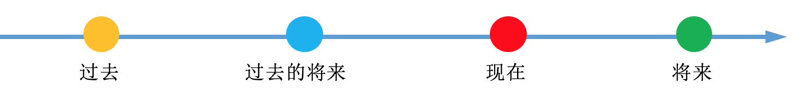

[toc]

&emsp;
&emsp; 
# 时态
## 什么是 时态？
&emsp;&emsp; 所谓 时态，就是 **时间 + 状态**。
## 时间
时间分为
> ① 过去
> ② 过去将来
> ③ 现在
> ④ 将来
>
按时间轴表示如下：

  

## 状态
状态分为四种： 
> ① 一般
> ② 进行
> ③ 完成 
> ④ 完成进行的
>

## 16中时态汇总
| 状态 \ 时间  | 过去                                 | 过去将来                                      | 现在                                   | 将来                                     |
| ------------ | ------------------------------------ | --------------------------------------------- | -------------------------------------- | ---------------------------------------- |
| **一般**     | did  一般过去时                  | would do  过去将来时                      | do  一般现在时                     | will do  一般将来时                  |
| **进行**     | be (was/ were) doing  过去进行时 | would be doing  过去将来进行时            | be (am/ is/ are) doing  现在进行时 | will be doing  将来进行时            |
| **完成**     | had done  过去完成时             | would have done  过去将来完成时           | have done  现在完成时              | will have done  将来完成时           |
| **完成进行** | had been doing  过去完成进行时   | would have been doing  过去将来完成进行时 | have been doing  现在完成进行时    | will have been doing  将来完成进行时 |

# 
## 一般时态

# 参考文献
1. [如何准确使用英语时态？](https://www.zhihu.com/question/31924369)
2. 