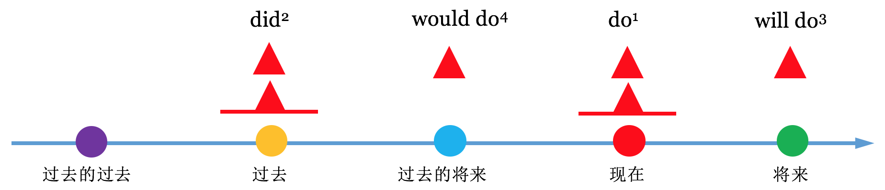
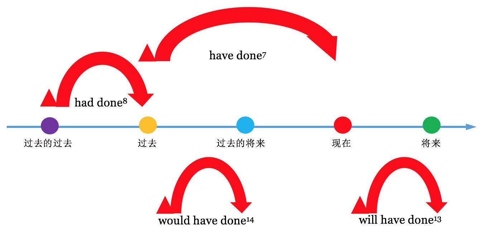
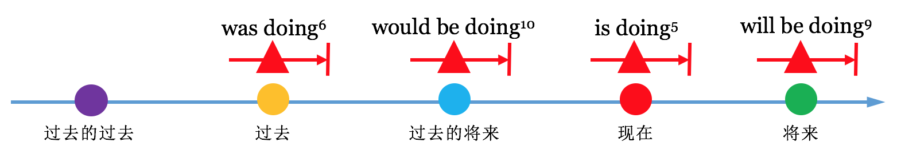
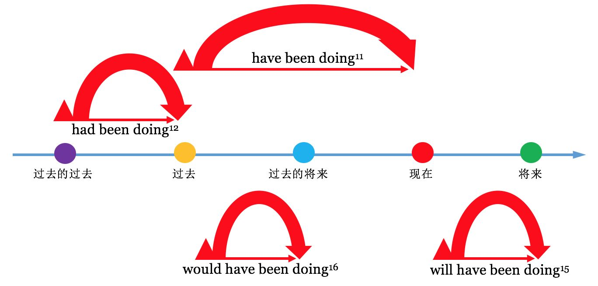

[toc]

&emsp;
&emsp; 
# 1. 综述
## 1.1 什么是 时态？
&emsp;&emsp; 所谓 时态，就是 **时间 + 状态**。
## 1.2 时间
时间分为
> ① 过去
> ② 过去将来
> ③ 现在
> ④ 将来
>
按时间轴表示如下：

  

## 1.3 状态
### 1.3.1 状态的定义
&emsp;&emsp; 状态指的是在某个时刻这个动作所处于的状态。

### 1.3.2 状态的种类
状态分为四种： 
**① 一般**
>
>
**② 进行**
>
>
**③ 完成**
>
>
**④ 完成进行**
>
>

## 1.4 16种时态汇总
| 状态 \ 时间  | 现在                                   | 将来                                | 过去                                     | 过去将来                            |
| ------------ | -------------------------------------- | ----------------------------------- | ---------------------------------------- | ----------------------------------- |
| **一般**     | do  一般现在时                     | will do  一般将来时             | did  一般过去时                      | would do  过去将来时            |
| **完成**     | have done  现在完成时              | will have done  将来完成时      | had done  过去完成时                 | would have done  过去将来完成时 |
| **进行**     | be (am/ is/ are) doing  现在进行时 | will be doing  将来进行时       | be (was/ were) doing  过去进行时     | would be doing  过去将来进行时  |
| **完成进行** |                                        | have been doing  现在完成进行时 | will have been doing  将来完成进行时 | had been doing  过去完成进行时  | would have been doing  过去将来完成进行时 |

&emsp;
&emsp; 
# 2. 一般时

  

## 2.1 一般现在时
### (1) 表示**现时的** 知觉、状态、所有
> ① I smell something burning.
> ② You look worried.
> ③ He is a student.
> 

### (2) 表示 经常发生（或反复发生）的动作
> ① He gets up at six. 他六点起床。 
> ② She works eight hours a day. 她每天工作八小时。 
> ③ Do you often wash your hair? 你经常洗头吗？
> 

### (3) 表示 真理、事实、格言
> ① The sun rises in the east.
> ② Metal expands when heated. 金属加热后会膨胀。
> 

### (4) 表 将来
1） 在口语中，一般现在时可以表示按规定、计划或时间表要发生的事，通常都有一个表示未来时间的 状语，且一般和`begin、start、arrive、leave、come、go、return` 混用： 
> ① The plane takes off at 9:20 a.m. 飞机早上九点二十分起飞。 
> ② Their delegation arrives here tomorrow afternoon. 他们的代表团明天下午到达。 
> ③ I'm in my office from two to five this afternoon. 今天下午两点到五点我在办公室。 
> ④ When does the play begin? 戏几点开始？
> 
2）在时间或条件从句中，须用一般现在时表示将来动作： 
> ① If I see Nancy I'll ask her. 如果我见到南希我会问她。 
> ② I'll discuss this with you when we meet. 我们见面时我将和你商讨此事。 
> ③ I'll tell her after you leave. 你走之后我再告诉她。
> 
3）还有一些其他从句中，可以用一般现在时表示将来动作： 
> ① I hope that you feel better soon. 我希望不久你能感觉好一点。 
> ② Suppose he doesn't come, shall we go without him? 假如他不来，我们就自己去吗？ 
> ③ Assuming it rains tomorrow, what shall we do? 假定明天下雨，我们该怎么办？
> 

### (5) 表现刻的动作
1）在一定的情况下，一般现在时可以表示现刻的动作，例如： 
① 球赛解说： 
> Hunt takes the ball forward quickly. Palmer comes across, tries to intercept him, but Hunt slips past and quickly pushes the ball to Smart. Now Smart gathers the ball. 
> 亨特快速向前带球，帕尔默跑过来企图 截住他，亨特闪过身，迅速把球传给斯马特，斯马特接住球。
> 
② 演示说明： 
> The teacher said, "Watch me. I'm doing a dangerous experiment. Now watch me. I switch on the current, and stand back..." 
> 教师说，“现在看着我，我做一个危险的实验。注意，我现在接通电流，往后 站…” 
> 
③ 动作描述或舞台动作描述： 
> When the curtain rises, Juliet is writing at her desk. Suddenly the window opens and a masked man enters. 
> 幕启时，朱丽叶在办公桌旁写东西。突然窗户开了，进来一个蒙面男子。 
> He sits down, shivers a little. Clock outside strikes twelve. 
> 他坐了下来，微微有些颤抖，外面钟敲了十 二点。
> 
2）还可用来表示一些没有时间性的动作： 
① 剧情介绍： 
> In Death on the Nile, Linet Ridgeway is the young and beautiful heiress to an immense fortune, but she has a lot of enemies. 
> 在《泥罗河上的惨案》中，年轻貌美的林奈·里奇韦是一大笔财产的继承人，但 她有很多敌人。 
> How does the story end ? 
> 故事怎样结局？ 
> The scene of this opera is set in Switzerland. 这部歌剧的故事发生在瑞士。 
> 
② 讲书面材料的内容： 
> I've just got a letter from Helen. She says she's coming to India next week.
> 我刚收到海伦的一封信，她说 下星期要来印度。 
> 
> What does the notice say？——It says, "No parking." 
> “告示说什么？”——说“禁止泊车。” 
> 
> Shakespeare says, "Neither a borrower nor a lender be." 
> 莎士比亚（在书中）说，“既不要向人借钱，也 不要借钱给人。” 
> 
> A notice at the end of the road warns people not to go any further. 
> 路尽头有个告示，警告路人不要再往 前走。 
> 
> Chaucer writes that love is blind. 
> 乔叟写道，爱情是盲目的。 
> 
③ 用来指引道路： 
> "How do I get to the station?" "You go straight on to the traffic lights, then you turn right."“火车站怎么 走？”“你径直往前走，到红绿灯处往右拐。” 
> 
④ 图片的说明： 
> The Queen arrives for the opening of Parliament. 
> 女王出席议会开幕式。 
> 
⑤ 用在`here`和`there` 后面： 
> Here Comes The Bride. 娘来了; 结婚进行曲;
> Here comes the bus! 公共汽车来了！ 
> Here Comes the Sun 太阳出来了。
> There goes the bell. 铃响了。
> 

### (6) 表示过去的动作
#### 1）有少数动词（如say， tell， hear等）可以用一般现在时表示过去发生的情况： 
> He says he can't wait any longer. 他说他不能再等了。 
> My friends tell me that you've been unwell. 我的朋友告诉我你身体欠佳。 
> I hear you want a secretary. 我听说你需要一位秘书。 
> I learn that this boy is in business in Capetown. 我听说这小伙子在开普敦做生意。 
> I forget the man's name. 这人的名字我忘了。 
> 
这是因为这类动词发生的时间在说话人的脑中已很模糊，他想表达的是后面谈的情况。 
#### 2）在下面情况下也常用一般现在时表示过去动作： 
**① 故事性读物中戏剧性的描绘（用一般现在时可给人以历历在目的印象）**： 
> They threatened to shoot, but the marchers could not be stopped. The unarmed workers press on and on. 
> 他 们威胁着要开枪，却没法挡住游行者，手无寸铁的工人们不断向前逼进。
> 
> The crowd swarms around the gateway, excitement grows as the pop star appears. 
> 人群聚集在大门口， 当那位通俗歌星出现时，众人情绪高涨。 
> 
这种用法可以称为戏剧性的现在时（Dramatic Present）。 

**② 用在报纸标题中**： 
> MASS MURDERER ESCAPES 大屠杀凶犯在逃 
> PEACE TALKS FAIL 和谈失败 
> 
情节业已发生而用一般现在时，可使标题生动。 

**③ 用在小说章节的标题中**： 
> VII Go to Bristol 第七章 去布里斯托尔途中
> 

&emsp;
## 2.2 一般过去时
### (1) 表示 过去发生的动作、存在的状态
> ① My grandfather died last year. 我祖父是去年去世的。
> ② They loved each other for twenty years. 他们相爱了二十年。
> 
> 
### (2) 表示过去习惯性的动作
> I got up at six every day in high school.
> We often played badminton together. 我们经常在一起打羽毛球。
> 
### (3) 前一会儿发生的事也要用过去时表示：
> She was here a minute ago. 她前一分钟还在这里。 
> George came in just now. 乔治刚才来过的。
>  Who told you this? 这事谁告诉你的？ 
> Did the telephone ring? 电话铃响了吗？
> 

### (4) 表示过去的经验(也可以用现在完成时)
> ① Did you ever see her before? = Have you seen her before?
> 

### (5) 句中若有`after、until、before`等连词引导的从句，由于时间先后很清楚，可用一般过去时替代过去完成时：
> ① After I had finished the work, I went home. 
> &emsp; = After I finished the work, I went home. 
> ② I had not studied English until I was 10. 
> &emsp; = I didn't study English until I was 10.
> ③ Before I have moved here, I had lived in Japan for a long time.
> &emsp; = Before I have moved here, I lived in Japan for a long time.
> 

### (6) 在叙述性文字（如小说、故事等）中用这个时态时特别多
新概念英语中就有很多文章是用 一般过去时写的

### (7) 在日常谈话中也常会用到它：
> Who said it? 这话谁说的？ 
> I didn't know you were here. 我不知道你在这儿。 
> I was glad to get your letter. 我很高兴收到你的来信。 
> I thought they were with you. 我以为他们和你在一起哩。 
> How did you find your way home? 你怎么找到回家的路的？
> 
### (9) 在口语中，一般过去时有时可用来代替一般现在时，使口气显更缓和，因而更客气
> ① I wondered (wonder) if you could do me a favour.
> 不知你可否帮我一个忙。
> ② Iwanted (want) to ask if I could borrow your car. 
> 我想问问可否借用你的车。
> ③ I hoped (hope) you could (can) give me some advice.
> 帮我出点主意。
> ④ Did (Do) you want to see me？ 
> 你是想见我吗？
> 
值得注意的是，在家人和熟人间不需用过去时代替现在时。

### (9) 已去世者的情况一般用一般过去时表示
> ① Edison was a great inventor. 爱迪生是伟大的发明家。 
> ② My grandfather lived a very simple life. 我祖父过着简朴的生活。（表示他已不在人间）
> 

&emsp;
## 2.3 一般将来时(The Simple Future Tense)
### (1) 表示 将来发生的 动作、状态
> ① Who will be on duty at six？——I will. 六点谁值班？——我值班。 
> ② I will be eighteen next week. 下星期我就十八岁了。 
> ③ We will know the result tomorrow. 明天我们就知道结果了
> 

### (2)  用在`I think... will`这类句型中，表示看法
> ① I think they'll succeed. 我想他们会成功。 
> ② I suppose they'll buy the house. 我想他们会把这房买下来。 
> ③ I'm sure he'll come back. 我肯定他会回来。 
> ④ They'll probably wait for us. 他们或许会等我们。 
> 

### (3)  表示未来习惯性的动作
> ① Spring will come again. 春天还会再来。 
> ② Birds will build nests. 鸟总要筑巢。 
> ③ These things will happen. 这样的事总是要发生的。 
> ④ The daffodils will flower in spring. 黄水仙春天开花。 
> 

### (4) 提出请求
> ① Will you type this? 你把这打一下好吗？ 
> ② If you want help—let me know, will you? 如果你需要帮助就告诉我，好吗？ 
> ③ Will you please be quiet? 你们静一点好吗？ 
> ④ Won't you take off your coat? 你把外套脱下来好吗？ 
> 

### (5) 作出允诺
> ① I'll be there, I promise you. 我答应你我会去的。 
> ② This won't happen again, I assure you. 我向你保证，这事不会再发生。 
> ③ I'll be home in time for supper. 我吃晚饭时回家。 
> ④ I won't tell anybody what you said. 你说的话我不会告诉任何人。 
> 

### (6) 表示同意
> ① Send off the invitation right today. ——Yes , I will. 今天就把请柬发出去。 ——行，没问题。 
> ② Don't be late. ——No, I won't. 别来晚了。 ——放心吧。 
> ③ Will you answer him？——Yes, I will. 你来回复他好吗？——行。
> 

### (7) 由连词`when、unless、if、once`等所引导的状语从句表示某条件时，一定要用一般现在时，而主句一般用用 一般将来时
> ① When <u>I have </u> money()，I <u> will buy</u> a car().
> &emsp;&emsp; 一般现在时 &emsp;&emsp;&emsp;一般将来时
> ② I <u> won't buy </u> a car unless <u> I have </u>money.
> &emsp; 一般将来时 &emsp;&emsp;&emsp; 一般现在时
> ③ If I <u> see </u> him, I <u> will tell </u>  him the truth.
> &emsp; 一般现在时  一将来在时
> 
**(3) am/is/are goning to do = will do**

### (8) shall 和 will
&emsp;&emsp; 首先，`shall`和`will`作为助动词，可以与动词原形一起构成一般将来时.
1） `shall`主要用于第一人称，构成疑问句以征求对方意见，这是它最主要的用法：
> ① shall I pick you up from the station?
要我去车站接你吗？
> ② let's buy some peaches, shall we?
> 我来开车，好吗？
> 
2） shall也可用在陈述句中（但现在口语中这样说的人比较少了，一般多用will）： 
> Don't worry. I shan't (won't) be late. 别担心，我不会迟到的。 
> We shall (will) be in touch. 我们会保持联系的。 
> I shall (will) ensure that you get a room. 我会保证让你得到一个房间。
> 
3） 一旦`shall`用于第二、第三人称，则含有命令、警告、允诺或威胁的语气：
> ① Candidates shall remain in their seats until all the papers have been collected.收卷前考生须留在各自的座 位上。（规定）
> ② In the rules, it says that a player shall be sent off for using bad language. 有明确规定球员出言不逊应罚 出场。（规定）
> ③ If you really want a pony, you shall have one. 如果你确实想要小马，我就给你一匹。（许诺
> ④ I shall write to you at the end of the month. 月底我会给你写信。（许诺）
> ⑤ She shall not stay under my roof. 她不得留在我家中。（命令）
> 
4） 当`Let's`（包括对方）通常用`shall you?`，而`Let us`（一般不包括对方）通常用`will we?`，比如：
> Let's go,  shall we？ 咱们去吧，怎么样？
> Let us go, will you？让我们去吧，行吗？ （征求对方的意见）
> 

&emsp;
## 2.4 一般过去将来时(The past future tens)
&emsp;&emsp; 一般过去将来时 表示从过去观点看将要发生的事

### 2.4.1 用法
#### (1) `would + 动词原形` 表示过去将来时
&emsp;&emsp; `would+动词原形` 构成过去将来时，常表示根据计划或安排即将发生的事。
> He said he would come to see me.他说他要来看我。
> He told me he would go to Beijing.他告诉我他将去北京。
> 

#### (2) `was/were + going to + 动词原形` 表示过去将来时
&emsp;&emsp; `was/were + going to + 动词原形` 也可表示根据计划或安排即将发生的事。
> 例1：She said she was going to start at once.她说她将立即出发。
> 例2：I was told that he was going to return home.他告诉我他准备要回家。
> 
`was/were + going to + 动词原形` "还可表示根据当时情况判断有可能但不一定会发生某事。例：
> It seemed as if it was going to rain.看来好像要下雨。
> 

#### (3) 某些动词的过去进行时可表示过去将来时
`come,go,leave,arrive,start`等 严格按照时间表发生(起止)的动词，可用 过去进行时 代替过去将来时：
> He said the train was leaving at six the next morning.他说火车第二天早晨出发。
> She told me she was coming to see me.她告诉我她要来看我。
> 

#### (4) 特定场合的 一般过去时 可表示过去将来时
&emsp;&emsp; 条件状语从句和时间状语从句中须用一般过去时代替过去将来时。
> I didn't know when she would come, but when she came I would let you know.我不知道她什么时候来，但她来了我会告诉你。
> 
析：第一个`when`引导宾语从句，可使用过去将来时，第二个`when`引导时间状语从句，只能用一般过去时代替过去将来时

&emsp;
&emsp; 
# 3. 完成时

  

## 3.1 现在完成时
### 3.1.1 现在完成的用法
**(1) 表示一件已发生的事，而且这件已发生事和现在的情况有联系**
> ① I have just finished my homework.
> ② She has already come.(come是ABA型)
> ③ He has gone to New York.
> ④ He hasn't gone to work yet.
> 

**(2) 用于表示到现在为止的经验**
> ① I have met him several times.(截止到到现在)我见过他几次
> ② I have never met such a man.(截止到到现在)我之前从未遇到他这样的人。
> 

**(3) 用以表示到现在为止 仍在继续 的动作或状态**
> ① She has lived here for 10 years(And still lives here.)
>  &emsp; 她已经在这住了10年了(而且现在还住这)
> ② She has studies English since 2000(And she still studies English)
> &emsp; 她从2000年就开始学英语了(现在还在学)
> ③ The strike has continued for several weeks. 
> &emsp; 罢工已持续了几个星期。 (罢工还在继续)
> ④ I have never believed those theories. 
> &emsp; 我从不相信这些理论。(现在还是不信)
> 

**(4) 常可和just， already， yet， recently， over这类副词连用：**
注意，这些副词都是和现在有联系，这个和上面的第一点是一样的：
> ① Has he phoned you yet？——No, not yet. 他给你打电话了吗？——还没有。 
> ② Jane has rung me up three times this morning already. 简今天早上已给我打过三次电话。 
> ③ Have you ever talked to him about it? 你曾和他谈过这事吗？ 
> ④ Have you seen Lewes recently? 你最近见到过路易斯吗？ 
> ⑤ I have never broken my word. 我从未违背过自己的诺言。 
> ⑥ He still hasn't finished his work. 他的工作还没干完。
> ⑦ There have been some changes lately. 近来有些变化。
>  

**(5) 和表示从过去某时到现在这段时间的状语连用**
> ① I haven't seen him **today**. 今天我没见过他。 
> ② How many letters have you received **this week**? 这星期你收到多少封信？ 
> ③ They have turned out over 1,000 cars **this month**. 这个月他们生产了一千多辆汽车
> ④ I've seen little of her **in the past few years**. 过去几年中我很少见到她。 
> ⑤ **So far** he has done very well at school. 到现在为止他在学校表现很好。 
> ⑥ **Up to now**, the work has been easy. 到现在为止，这工作还算容易。
> 

### 3.1.2 现在完成时 和 一般过去时 的比较
#### (1) 主要差别
这两个时态都谈已发生的事，主要差别在于 过去的动作与现在 **是否关系**：
| 时态       | 作用                                                                         |
| ---------- | ---------------------------------------------------------------------------- |
| 现在完成时 | 表示的动作与现在有关系，或是对现在有影响，或谈论现在以前这一段时间里发生的事 |
| 一般过去时 | 单纯谈过去的事，与现在没有联系。                                             |
**现在完成时**对表示从过去发生一直持续到现在(包括现在)的某个动作或状态，与现在有关的时间状语连用，**一般过去时**表示过去某一特定(与现在无关)的时间，与具体的表示过去的时间状语连用。例如：  
> He has lived here since he was born.自他出生从来一直居住在这儿。(since自从……以来与现在有关，说明还居住在这儿)
> Liumei went to see her grandmother last night.刘梅昨晚去看了他外婆。(只说明昨晚) 
> 

#### (2) 该用一般过去时的情况
**1）凡是有 过去时间状语时，只能用过去时**： 
> ① She was here **a minute ago**. 一分钟之前她还在这里。 
> ② They gave it to me **just now**. 这是他们刚才给我的。 
> ③ **When** did you come in? 你什么时候进来的？ 
> ④ I woke up **at six**. 我六点醒的。 
> 

**2）以when开头的特殊疑问句，要用一般过去时。** 例如：  
> ① When did you lose yourpen?你什么时候丢了钢笔? 
> ② When did you come in? 你什么时候进来的？ 
> 

**3）凡是单纯谈过去的事，与现在毫无联系时也多用过去时，试比较下面几组句子**：
> ① I've bought some fruit for you. 我给你买了点水果。(送来这里）
> &emsp; I bought the fruit in the supermarket.这些水果我是在超市买的。
> ② She has written some short stories.她写了一些短篇小说。（说明成就）
>  &emsp; She wrote the short stories in Shanghai.这些短篇小说是她在上海写的。
> ③ I have just had my lunch. 我刚吃过午饭。（因此不饿） 
>  &emsp; I had my lunch in a cafereria. 我是在自助餐厅吃的午饭。
> ④ I've learnt a lot from you.我向你学到了很多东西。(因此很感谢你) 
>  &emsp; I learnt a lot there．我在那里学到了很多东西。
> 

**4）有些动作（显然是过去的动作），尽管没有时间状语，仍需用过去时**： 
> ① Did you know that he was going to be married? 你知道他要结婚了吗？ 
> ② I didn't know you were in London too. 我不知道你也在伦敦。 
> ③ When did you get back? 你什么时候回来的？ 
> ④ I heard you were coming to China this autumn. 我听说你今年秋天要到中国来。 
> ⑤ Why did you buy this? 你为什么买这个？ 
> ⑥ Did you see anything interesting at the exhibition? 在展览会上你看到什么有趣的东西吗？ 
> ⑦ Why did you get up so early? 你为什么起得这么早？ How did you like the show? 你觉得演出如何？
>  
以上情形不宜用现在完成时

#### (3) 该用现在完成时的情况
**1）动作发生在过去。一直持续到说话的时候，并且还在延续时，要用现在完成时。** 例如：  
> We have studied English for two years(我们学英语两年了) 
> 

**2）指过去的经历，但没有表示过去的时间状语，要用现在完成时。** 例如：  
> I have been to Shanghai twice.我曾去过上海两次  
> 

**3）当`since`作介词，后面跟时间名词一起作状语时，句子要用现在完成时；当`since`作连词，引导状语从句时，主句用现在完成时，从句  用一般过去时**。  
> ① He has worked in this factory since 1996. 他自1996以来一直在这家工厂工作。
> ② I have known him since he was a child.    我从他小时候就认识他
> ③ Where have you been since I last saw you?   自从我上次见你之后你去哪啦？
> 

**4）`so far、in the last、past……`与现在完成时连用。** 例如：
> ① In the last 30 years，our lives have changed a lot. 
> ② So far，many countries have sentup satellites into space. 
> 

**5）总结**
&emsp;&emsp; 仔细分析可以知道，前面提到的几种应该使用现在完成时的情况都是 过去的事情 和现在有联系

#### (4) 容易混淆的情况
**1）just(刚刚) 与现在完成时连用，just now(刚才) 与一般过去时连用** 例如：  
> ① The train has just gone.火车刚刚离开。  
> ② The train left here just now.火车刚才离开。  
> 

**2）有时同一个动作，根据具体情况，可能需用不同的时态**，例如：
> ① He'sbeen in the army for two ycars. 他在部队两年了。（还在部队）
>   &emsp; He was in the army for twro years. 他在部队待过两年。（现已离开)
> ② She's done this all these years. 这些年她都是这样做的。(直到如今）
>   &emsp; She did this for many years. 她这样做有许多年了。（现在不这样做了）
> ③ Tom haas rung up tbree times this morning． 今天早上汤姆打来过三个电话。(现在还是早晨）
>   &emsp; Tom rang up three times this morning． 今天早上汤姆打来过三个电话。（现在是下午）
> ④ I havent seen her this afternoon. 今天下午我没见过她。（现仍是下午）
>   &emsp; I didnisee her chis afternoon. 今天下午我没见到她。（现已是晚上）
> ⑤ We'vehad little rain this summer. 今年夏天雨水很少。（现仍是夏天）
>   &emsp; We had ittle rain in the sumamer．夏天雨水很少。（现已不是夏天）
> 

### 3.1.3 有关现在完成时的几个问题
#### (1) `have gone to`和`have been to`的差别
##### 区别
|                |                                           |
| -------------- | ----------------------------------------- |
| `have gone to` | 表示“到某地去了”，因此人还在那            |
| `have been to` | 表示 “到（来）过某地”，人此时已经不在该地 |
##### 实例对比
1）`have gone to`表示“到某地去了”，因此人还在那里： 
> ① She has gone to live abroad. 她到国外居住了。（她现在国外） 
> ② The kids have gone to the zoo. 孩子们到动物园去了。（他们在动物园） 
> ③ Where has Mary gone? 玛丽到哪里去了？（她在哪里？） 
> 
2）`have been（to）` 表示 “到（来）过某地”，人此时已经不在该地：
> ① Where have you been？——I've been to the cinema. 你到哪儿去了？——我去看电影了。 
> ② Have you ever been to Hong Kong? 你到过香港吗？ 
> ③ I've been to Europe several times. 我到欧洲去过几次。 
> ④ Who's been here? 谁来过这里?（人已不在） 
> ⑤ Has she ever been in China? 她到过中国吗？ 
> 
后面还可跟不定式： 
> ① I've been to see my grandmother. 我去看我奶奶了。（现已回来） 
> ② She's been to do some shopping. 她出去买东西了。
> 

#### (2) 由since引导的从句中的时态
由since引导的从句一般用过去时（主句谓语用现在完成时）： 
> ① We've been friends ever since we met at school. 自在学校相遇以来，我们一直是朋友。 
> ② Much has changed since I was there last time. 自我上次到那里之后发生了许多变化。 
> 
当表示“有多少时间”时，主句谓语可用一般现在时： 
> ① It's two years since I left home. 我离家已经两年了。 
> ② How long is it since you came here last time? 自你上次来这里之后已经多久了？ 
> 
在从句中有时可用现在完成时，特别是动词为be时： 
> ① I have been terribly busy since I've been back. 我回来之后一直忙得要命。 
> ② She has seldom been out since she has been ill. 她生病以来很少出去。 
> ③ It's some time since I've wirtten to her. 有相当时间我没给她写信了。
> 

#### (3) 在时间及条件从句中需用现在完成时代替将来完成时
> ① I'll wirte a preface when I've finished the book. 书写完后我将写一篇序。 
> ② Don't go away until I have finished speaking to your father. 在我和你父亲谈完话之前不要走开。 
> ③ I'll tell them after you have left. 你走后我将告诉他们。 
> ④ If he hasn't got up, don't wake him. 如果他还没起床，不要叫醒他。 
> ⑤ Don't rush him unless he's already got everything ready. 除非他把一切都准备好了，否则不要催促他。
> 

#### (4) 和time一道用的情况
> ① This (It) is the first time I have seen a pagoda. 这是我首次看到宝塔。 
> ② It is only the second time he's been in a palace. 这只是他第二次进皇宫。 
> ③ That's the third time he's quarrelled with her in a week. 这是一星期中他第三次和她吵架。 
> ④ This is the fourth time she's been out with him. 这是她第四次和他一起外出。 
> 
在下面句型中也可用现在完成时： 
> ① This is the best tea I have ever drunk. 这是我喝过的最好的茶了。 
> ② This is the most interesting book I have ever read. 这是我看过的最有意思的书。 
> ③ This is the easiest job I have ever had. 这是我干过的最容易的工作。 
> ④ It's the first good meal I've had for ages. 这是好久以来我吃过的第一顿好饭。
>  

#### (5) `have got`的特殊用法
`have got`在形式上是现在完成时，在意思上却和`have`相同： 
> ① Have you got (=Do you have) a timetable? 你有时刻表吗？ 
> ② She hasn't got any relations. 她没有什么亲属。 
> ③ I've got only another three minutes. 我只有三分钟了。 
> ④ What have you got against me? 你对我有什么意见？ 
> ⑤ I've got a bad headache. 我头疼得很厉害。 
> ⑥ You've got a new dress on. 你穿新衣服了。 
> ⑦ I've got a few things to see to. 我有几件事要办。 
>  

#### (6) `have got to `和 `have to`
`have got to`和`have to`意思一样，表示“不得不”： 
> ① You've got to be careful. 你得当心。 
> ② That's what we've got to do. 这是我们不得不做的事。 
> ③ You've got to keep this in mind. 你必须把这牢记在心上。 
> ④ Have you got to leave so soon? 你一定要这么早走吗？ 
>  
在口语中，`have`有时可以省略： 
> ① We got to make ends meet. 我们得收支相抵。
> 

&emsp;
## 3.2 过去完成时
**用于表示截止到 过去某时为止 所完成 的动作或经历：**
> ① He had studied English for 10 years before he left for the states.
> ② He had already left when I came.
> ③ He was angry because he hadn't seen Mary.
> ④ He told me that he had seen the movie once.
> 
另外需要注意的是，**过去完成时不能单独存在！** 而是要和另一个 一般过去时从句(或表示之前的副词短语)连用，即在过去不同时间发生的两种动作：
> 先发生的动作：用过去完成时表示；
> 后发生的动作：用一般过去时表示
> I <u>lost</u> the book which my father <u>had given</u> me.
> 一般过去时 &emsp;&emsp;&emsp;&emsp;&emsp;&emsp;&emsp;&emsp; 过去完成时
> 

&emsp;
## 3.3 将来完成时
用来表示 将来某时为止 所完成(或仍在继续) 的动作或经历：
> ① 明天这个时候，他将已抵达芝加哥。
> &emsp; He will have arrived in Chicago by this time tomorrow.
> ② 你来的时候，每一件事将已全部完成。
> &emsp; By the time you come, everythig will have been finished.
> ③ 到月底，他就在此地住满10年了。
> &emsp; He will have lived here for 10 years by the end of this month.
> 

&emsp;
## 3.4 过去将来完成时
（would have done）过去将来完成时表示：站在某个过去的时间点，对一个之后的时间点已经发生了的动作做总结。
> ① 他说第二个月末她肯定已经动身去伦敦了。
> &emsp; He said he would have left for London by the end of next month.
> ② 
> &emsp; I guessed that Helen would have told her something.
> 

&emsp;
&emsp; 
# 4. 进行时

  

## 4.1 现在进行时
be (am/ is/ are) doing
&emsp;&emsp; 表示动作正在进行、持续进行（上图中的红色直箭头表示持续）。发生时间在现在，参照时间也是现在，表示持续进行状态。

## 4.2 过去进行时
be (was/ were) doing
表示过去正在进行、持续进行。发生时间在过去，参照时间也是过去，表示持续进行状态。
> The plane <u>was flying</u> over my head <u>last midnight</u>.
> &emsp;&emsp;&emsp;&emsp; 过去进行时 &emsp;&emsp;&emsp;&emsp; 参照时间是昨晚(过去)
> 

## 4.3 将来进行时
will be doing
表示动作将来正在进行、持续进行。发生时间在将来，参照时间则是现在，表示持续进行状态。

## 4.4 过去将来进行时
would be doing

&emsp;
&emsp; 
# 5 完成进行时
  

## 4.1 现在完成进行时
have been doing
&emsp;&emsp; 表示过去开始的某动作已经完成相当一部分，持续到现在正在进行，并且对现在有影响。发生时间在过去持续到现在，参照时间是现在，表示部分完成并持续的状态。
> I have been working for 30 days without a rest.
> 
## 4.2 过去完成进行时
had been doing
&emsp;&emsp; 表示过去的过去开始的某动作已经完成相当一部分，持续到过去某个时间点仍然正在进行，并且对过去这个时间点有影响。发生时间在过去的过去持续到过去，参照时间是过去，表示部分完成并持续的状态。
> She had been carrying out her plot to be the queen three months earlier.
> 

## 4.3 将来完成进行时
will have been doing
&emsp;&emsp; 表示到将来某个时间点，某动作已经完成了相当一部分，持续到将来这个时间点仍然正在进行，并且对将来这个时间点有影响。发生时间在将来，首先参照现在表示将来某时间1发生的动作，其次参照将来某时间2表示部分完成并持续（2晚于1）。
> The play is coming off in August. By then the play will have been running for three months.
> 

## 4.4 过去将来完成进行时
would have been doing
&emsp;&emsp; 表示到过去将来某个时间点，某动作已经完成了相当一部分，持续到过去将来这个时间点仍然正在进行，并且对过去将来这个时间点有影响。发生时间在过去的将来，首先参照过去表示过去的将来某时间1发生的动作，其次参照过去的将来某时间2表示部分完成并持续（2晚于1）。
> Up to that time he would have been translating those books．
> 

(1) 
(2) 
(3) 
(4) 
(5) 
(6) 

&emsp;
&emsp; 
# 参考文献
1. [如何准确使用英语时态？](https://www.zhihu.com/question/31924369)
2. 