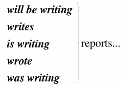
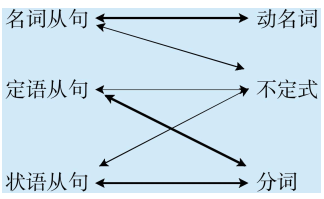

[toc]

&emsp;
&emsp; 
# 0
&emsp;&emsp; 在讨论这三大从句的简化时， 我们把从句与非谓语结合起来讨论， 以便让读者用一个全新的视角来看待从句和非谓语之间的关系， 这样才不至于把它们各自孤立和割裂开来， 造成僵化理解， 从而真正达到融会贯通、 灵活运用的境界。

&emsp;
&emsp; 
# 1.  名词从句的简化
&emsp;&emsp; 我们知道， 名词从句是属于名词性的， 而英文中的三大非谓语只有动名词和不定式具有名词的特征，可以当成名词来使用。 因此， 属于名词类的名词从句自然能被简化成两种形式——动名词和不定式。

## 1.1 名词从句与动名词
&emsp;&emsp; 在第一章“名词从句”中我们讲过， 四大类名词从句（即主语从句、 宾语从句、 表语从句和同位语从句） 主要是由三种句子转化过来的， 即陈述句、 一般疑问句和特殊疑问句。 但这三种句子不能直接作句子成分， 需要经过一些结构上的变化。 比如， 陈述句转化为名词从句时要用连词that引导； 一般疑问句转化为名词从句时要用if或whether来引导； 特殊疑问句转化为名词从句时不需要另外添加连词， 只需保留特殊疑问词（如what或who） 即可。 现在的结论是： 由陈述句变来的， 即由that引导的名词从句一般简化成动名词来表达， 通常采用动名词复合结构的形式； 由疑问句变来的， 即由whether或what等引导的名词从句一般简化为不定式。
&emsp;&emsp; 下面我们就举例说明that引导的名词从句与动名词之间的相关性。
### 一、 that引导的主语从句与动名词
直接用动名词的复合结构来替换主语从句， 放在句首作主语。 请比较：
> 1 
> 1）It surprised us that John won the marathon.
> 2）That John won the marathon surprised us.
> 3）John's winning the marathon surprised us.
> 
> 约翰赢得了马拉松比赛， 这真让我们吃惊。
> 
&emsp;&emsp; 在例句1） 中， it是形式主语， 真正的主语是that引导的从句John won the marathon， 被后置了。 
&emsp;&emsp; 在例句2） 中， that引导的从句John won the marathon作主语， 谓语是surprised。 
&emsp;&emsp; 在例句3） 中， 由例句2） 中的主语从句John won the marathon变为动名词的复合结构John's winning the marathon来充当句子的主语。

请再比较：
> 2 
> 1） That he lost the game came as a surprise to everybody.
> 2） His losing the game came as a surprise to everybody.
> 他在比赛中失利， 这让每个人都觉得很意外。
> 
&emsp;&emsp; 在例句1） 中， that引导的主语从句that he lost the game作主语， 谓语是came。 
&emsp;&emsp; 在例句2）中， 由例句1） 中的主语从句that he lost the game变为动名词的复合结构his losing the game来充当句子的主语。

### 二、 that引导的同位语从句与动名词
&emsp;&emsp; 简化that引导的同位语从句时， 也是变同位语从句为一个动名词的复合结构。 但是， 因为英文中没有“名词+动名词”这样的结构， 所以要在同位语从句修饰的名词后面加上一个介词， 来连接名词与动名词，同时表达同位语关系。 能担当此任的介词通常是of， 偶尔可以用about等。 于是句子由原来的同位语从句结构“名词+that同位语从句”变成了一个动名词结构“名词+of+动名词的复合结构”。 请比较：
3 1) There was no chance that Davy would come from the battle alive.
1) There was no chance of Davy coming from the battle alive.
妙语点睛 在例句1） 中， that引导的同位语从句Davy would come from the battle alive补充说明先行词
chance， 以表明chance的具体内容。 在例句2） 中， 由例句1） 中的同位语从句that Davy would come from the
battle alive变为动名词的复合结构Davy coming from the battle alive， 放在介词of后面， 来补充说明chance。
这里的of表示同位说明关系。
精品译文 大卫不可能从战场上生还。
再请比较：
4 1) We were greatly encouraged by the news that China had launched another man-made satellite.
1) We were greatly encouraged by the news of China having launched another man-made satellite.
妙语点睛 在例句1） 中， that引导的同位语从句China had launched another man-made satellite补充说明
先行词news， 以表明news的具体内容。 在例句2） 中， 由例句1） 中的同位语从句China had launched another
man-made satellite变为动名词的复合结构China having launched another man-made satellite， 放在介词of后
面， 来补充说明news。 这里的of表示同位说明关系。
精品译文 听到中国又发射了一颗人造卫星的消息， 我们都受到极大的鼓舞。
再请比较：
5 1) Anyone with half an eye on the unemployment figures knew that the assertion that economic recovery
would be just around the corner was untrue.
1) Anyone with half an eye on the unemployment figures knew that the assertion about economic
recovery being just around the corner was untrue.
妙语点睛 在例句1） 中， that引导的同位语从句economic recovery would be just around the corner补充
说明先行词assertion， 以表明assertion的具体内容。 在例句2） 中， 由例句1） 中的同位语从句 economic
recovery would be just around the corner变为动名词的复合结构economic recovery being just around the corner，
放在介词about后面， 来补充说明assertion。 这里的about表示同位说明关系。
精品译文 任何人只要稍稍看一眼目前的失业率就能知道， 有关经济复苏即将到来的断言是不符合事
实的。

### 三、 that引导的宾语从句与动名词
&emsp;&emsp; 由that引导的宾语从句的简化较为复杂， 因为它可以转换成动名词， 也可以转换成不定式， 这主要与主句谓语动词的用法密切相关。 请比较：
> 6 
> 1） I consider that I will emigrate to America in the future.
> 2） I consider emigrating to America in the future.
> 
> 我在考虑将来移民到美国。
> 
&emsp;&emsp; 在例句1） 中， that引导的宾语从句I will emigrate to America in the future充当动词consider的宾语。 
&emsp;&emsp; 在例句2） 中， 由例句1） 中的宾语从句I will emigrate to America in the future变为动名词emigrating toAmerica in the future。 这是因为consider的后面要接动名词， 不能接不定式， 因此该从句要简化为动名词。

有的主句的谓语动词后面还需添加一个介词， 然后才能接动名词作宾语。 例如：
> 7 
> 1）Jane's mother insisted that she should go swimming with her brother.
> 2）Jane's mother insisted on her going swimming with her brother.
> 
> 简的妈妈坚持要求她和她哥哥一起去游泳。
> 
&emsp;&emsp; 在例句1） 中， that引导的宾语从句she should go swimming with her brother充当动词insisted的宾语。 
&emsp;&emsp; 在例句2） 中， 由例句1） 中的宾语从句she should go swimming with her brother变为动名词的复合结构her going swimming with her brother， 并且之前还添加了介词on， 这是因为insist的后面要接介词on之后才能接宾语。

&emsp;&emsp; 同理类推， 对于那些要求接不定式作宾语的动词， 其后的that引导的宾语从句简化后只能是不定式。 比如：
> 8 
> 1）I hope that I can drive to work in my own car.
> 2）I hope to drive to work in my own car.
> 
> 我希望能够开着自己的车去上班。
> 
&emsp;&emsp; 在例句1） 中， that引导的宾语从句I can drive to work in my own car充当动词hope的宾语。
&emsp;&emsp; 在例句2） 中， 由例句1） 中的宾语从句I can drive to work in my own car变为不定式to drive to work in my own car， 这是因为hope的后面要接不定式， 不能接动名词， 因此该从句要简化为不定式。

&emsp;&emsp; 综上所述， 宾语从句是简化成动名词还是不定式形式， 完全取决于主句的谓语动词。 因此， 要求我们对动词的用法比较熟悉， 我们在前面各章节中已经分别列举过接动名词或不定式作宾语的动词。

### 思维总结
&emsp;&emsp; 本节主要讨论了that引导的名词从句与动名词的复合结构之间的关系， 二者可以进行相互转换， 这尤其是针对that引导的主语从句和同位语从句而言。 that引导的宾语从句是简化成动名词还是不定式形式， 完全取决于主句的谓语动词。
### 思维训练
#### 题目
> (1) The student denied that he had cheated on the exam.
> 
> (2) That the president was involved in the fraud is obvious.
> 
> (3) I consider that this is a far-reaching event.
> 
> (4) That he lost the game came as a surprise to everybody.
> 
> (5) That he worked all night in the rain caused him to catch a bad cold.
> 
> (6) The boy is worried about the possibility that he will fail in the exam.
> 
> (7) That he tries sending her girlfriend flowers every day is the only way he can think of to gain her favor.
> 
> (8) I remember that he once offered to help us if we ever got into trouble.
> 
> (9) You must tell me the truth. I insist that you should tell the truth.
> 
> (10) Nowhere in nature is aluminum found free, owing to the fact that it is always combined with other elements, most commonly with oxygen.
> 
> (11) That children object to their parents remarrying has become a prevalent social problem.
> 
> (12) The teacher said that he wouldn't tolerate that I arrived late every day.
> 
> (13) That the girl was educated in an atmosphere of simple living was what her parents wished for.
> 

#### 答案
> (1) The student denied having cheated on the exam.
> 
> (2) The president's being involved in the fraud is obvious. Or the president's involvement in the fraud is obvious.
> 
> (3) I consider this a far-reaching event. Or I consider this event far-reaching.
> 
> (4) His losing the game came as a surprise to everybody.
> 
> (5) His working all night in the rain caused him to catch a bad cold.
> 
> (6) The boy is worried about the possibility of failing in the exam.
> 
> (7) Trying sending her girlfriend flowers every day is the only way he can think of to gain her favor.
> 
> (8) I remember his once offering to help us if we ever got into trouble.
> 
> (9) You must tell me the truth. I insist on your telling the truth.
> 
> (10) Nowhere in nature is aluminum found free, owing to its always being combined with other elements, most commonly with oxygen.
> 
> (11) Children's objecting to their parents remarrying has become a prevalent social problem.
> 
> (12) The teacher said that he wouldn't tolerate my arriving late every day.
> 
> (13) The girl's being educated in an atmosphere of simple living was what her parents wished for.
> 

## 1.2 名词从句与不定式
&emsp;&emsp; 上文讲过， 由疑问句变来的， 即由whether或what等引导的名词从句一般简化为不定式， 其实主要是宾语从句简化为不定式。 此时的宾语从句中往往含有情态动词， 比较多见的是should或can/could。 请比较：
> 1 
> 1） She can't decide whether she should go with him or stay home.
> 2） She can't decide whether to go with him or（to） stay home.
> 
> 她还没有决定， 应该和他一起去还是就呆在家里。
> 
由whether引导的宾语从句whether she should go with him or stay home变为不定式whether to go with him or stay home， 这里的不定式具有“应该”的情态意义。

再比如：
> 2 
> 1）I haven't decided whether I should vote for Clint.
> 2）I haven't decided whether to vote for Clint.
> 
> 我还没有决定是否应该给克林特投票。
> 
我们再来看两个疑问句的例子：
> 3 
> 1） I don't know what I should do.
> 2） I don't know what to do.
> 我不知道该做什么。
> 
由what引导的宾语从句what I should do变为不定式what to do， 这里的不定式具有“应该”的情态意义。

> 4 
> 1） Please tell me how I can get to the bus station.
> 2） Please tell me how to get to the bus station.
> 请告诉我去汽车站怎么走。
> 
由how引导的宾语从句how I can get to the bus station变为不定式how to get to the bus station，这里的不定式具有“能够”的情态意义。

### 思维训练
#### 题目
> (1) The plumber told me how I could fix the leak in the sink.
> 
> (2) Please tell me where I should meet you.
> 
> (3) I don't know whether I should believe him or not.
> 
> (4) Sam is getting dressed to go to a party, but is having trouble deciding on what clothes he should wear.
> 
> (5) He found two shirts he liked, but he had trouble deciding which one he should buy.
> 
> (6) I was tongue-tied. I didn't know what I should say.
> 
> (7) Going to the school dance is a lot of fun. But sometimes, deciding who I can go with isn't easy.
> 
> (8) A: I don't know what I should buy for her birthday. Got any suggestions?
> B: How about a book?
> 

#### 答案
> (1) The plumber told me how to fix the leak in the sink.
> 
> (2) Please tell me where to meet you.
> 
> (3) I don't know whether to believe him or not.
> 
> (4) Sam is getting dressed to go to a party, but is having trouble deciding on what clothes to wear.
> 
> (5) He found two shirts he liked, but he had trouble deciding which one to buy.
> 
> (6) I was tongue-tied. I didn't what to say.
> 
> (7) Going to the school dance is a lot of fun. But sometimes, deciding who to go with isn't easy.
> 
> (8) A: I don't know what to buy for her birthday. Got any suggestions?
>

&emsp;
&emsp; 
# 2. 2 定语从句的简化
&emsp;&emsp; 对于定语从句的简化问题， 讨论起来稍微复杂一些。 首先可以肯定的是， 不是所有的定语从句都可以简化， 这背后的原因有很多， 其中最重要的一点原因就是与定语从句本身的结构有关。 于是我们首先要考虑的是， 什么样的定语从句才能简化为短语。 接下来的问题就是定语从句可以简化为什么样的短语， 是分词短语、 是不定式短语， 还是其他形式的短语？ 对于这些问题， 我们在本节的内容中都会有交代。

## 2.1 定语从句如何才可能简化为短语
我们先来看看下面这个例句：
> The man that I saw at the party last night is my teacher.
> 我昨晚在聚会上碰到的那个男子是我的老师。
> 
这个定语从句的结构特点是： 关系词that作从句谓语saw的宾语， 此时， 我们可以把that省去。 比如说成： The man I saw at the party last night is my teacher.但是， 对于这样的定语从句， 我们是无法把它简化为短语形式的。 由此可以得出一般规律： 关系词在定语从句中充当宾语， 这样的定语从句不能简化成一个短语。 只有当关系词在定语从句中作主语时， 才能把定语从句简化为短语。
 

&emsp;
## 2.2 定语从句与短语
&emsp;&emsp; 我们知道， 定语从句是放在被修饰的名词后面的， 因此定语从句是非常重要的一类后置定语。 说它重要， 不仅是因为它经常出现， 更重要的是其他用作后置定语的短语都可以看作是定语从句简化后的结果，或者说都可以用定语从句来改写。 请比较：
> 1 
> 1） The people who were responsible for the incident were all punished.
> 2） The people responsible for the incident were all punished.
> 
> 对此事负有责任的人都受到了惩罚。
> 
在例句1）中， 是定语从句who were responsible for the incident后置修饰people。 
在例句2）中， 是形容词短语responsible for the incident后置修饰people， 可以看成是由例句1） 简化后的结果。

再请比较：
> 2 
> 1） the girl who was standing in the corner
> 2） the girl standing in the corner
> 3） the girl in the corner
> 
> 1） 当时正站在角落中的女孩
> 2） 站在角落中的女孩
> 3） 角落中的女孩
> 
&emsp;&emsp; 在短语1） 中， 由定语从句who was standing in the corner后置修饰girl。 
&emsp;&emsp; 在短语2） 中， 由分词短语standing in the corner后置修饰girl， 可以看成是由短语1） 简化后的结果。 
&emsp;&emsp; 在短语3） 中， 由介词短语in the corner后置修饰girl， 可以看成是由短语2） 进一步简化后的结果。

&emsp;&emsp; 由此我们看到， 各个短语（如形容词短语、 分词短语和介词短语等） 作后置定语， 其实都与定语从句有着密切的关系， 都可以统一于定语从句。 相应地， 若把一个定语从句进行简化， 那么简化后的结果必然也可能是这样的一些短语， 如分词短语、 介词短语、 形容词短语或不定式短语等等。 因为本节主要是讨论定语从句与非谓语动词的关系， 所以我们在这里只讨论定语从句简化成分词短语和不定式短语的情形。
&emsp;&emsp; 另一方面， 有一个问题我们不能忽略了， 即在上述简化的过程中， 短语的意思有所改变了。 比如在第2组例子的短语1） 中， 由定语从句who was standing in the corner我们可以明确地知道， 这里谈的是一个过去进行的情形， 即“当时正站在角落中的女孩”。 而在短语2） 中， 由分词短语standing in the corner我们看不出这个过去进行时态了， 这里的standing可以相当于说who is standing或who was standing， 甚至是一般情况如who stands或who stood等。 由此可见， 后置定语与被修饰名词之间的逻辑语义关系变得模糊了， 不像定语从句表达得那么明确。 再看短语3） ， 连分词standing都没有了， 只保留了in the corner这个介词短语， 这里的含义就更模糊了， 比如说这个女孩可能是standing in the corner， 也可能是sitting in the corner， 也可能是lying in the corner等。

再请比较定语从句与分词短语在明晰性方面的巨大差异。 比如：
> 3 
> 1） The person writing reports...
> 2） The person who will write
> 

  

&emsp;&emsp; 从这个例子中我们看到， 一个分词writing可能对应的谓语形式是如此之多， 而每一种谓语形式所表达的时间都是不同的。 换句话说， 这些明确表达时间的谓语动词若简化为分词短语， 都只有一种形式即writing， 则会失去其精确性。
&emsp;&emsp; 所以， 把定语从句简化为非谓语的形式， 虽然结构变得简洁（concision） 了， 但这是以明晰性（clarity） 为代价的， 即逻辑语义关系的明晰性降低了， 意思变得模糊了。 对此， 读者应该有所了解。 这是某些定语从句不能简化成分词短语的一个重要原因。 我们将在接下来的2.3小节讨论这一点。

&emsp; 
## 2.3 定语从句与分词
&emsp;&emsp; 在关系词充当定语从句的主语的前提下， 如果从句的谓语是实义动词， 那么此时的定语从句简化后一定就是分词短语， 包括现在分词短语和过去分词短语。
### 一、 分词的动作与句子谓语的动作之间的时间关系
&emsp;&emsp; 正是由于上面讨论过的定语从句与分词短语在明晰性方面的差异， 所以有的定语从句可以简化为分词短语， 而有些定语从句则不能简化为分词短语。 判断能不能简化， 关键是看定语从句的谓语时间与主句的谓语时间之间的关系。 为什么呢？
&emsp;&emsp; 在6.1节我们讨论了现在分词和过去分词的不同意义， 比如现在分词可以表示“主动一般的动作”和“主动进行的动作”， 过去分词可以表示“被动一般的动作或完成的动作”和“主动完成的动作”。 以上只是说明了分词作定语的语态（voice） 和体态（aspect） 的特点， 并没有涉及动作完成的具体时间上的概念， 比如没有说现在分词是表示“现在进行的动作”还是“过去进行的动作”。 这是因为分词动作的时间要通过句子谓语动作的时间体现出来， 且两者一般是一致的， 比如同样表示过去， 或同样表示现在。 比如：
> 1 
> 1） The men working on the site were in some danger.
> = The men who were working on the site were in some danger.
> 
> 2） The men working on the site are in some danger.
> = The men who are working on the site are in some danger.
> 
> 1） 当时在工地上工作的那些人处境非常危险。
> 2） 现在正在工地上工作的那些人处境非常危险。
> 
在例句1） 中， 主句谓语were表明时间是过去， 所以分词working的时间也是过去， 故原句可改为The men who were working on the site were in some danger.而不能改写成~~The men who are working on the site were in some danger.~~
在例句2） 中， 主句的谓语are表明时间是现在， 所以分词working的时间也是现在， 故原句可改为The men who are working on the site are in some danger.而不能改写成~~The men who were working on the site are in some danger.~~

&emsp;&emsp; 总之， 我们上面讲了这样两层意思： 一是分词的动作是没有时间概念的， 二是分词动作的时间概念要通过句子谓语的时态体现出来， 与它一致， 笔者称之为“分词动作的时间与句子谓语的时间一致性原则”。因此， 当定语从句的谓语动作的时间与主句谓语的时间不一致时， 此时的定语从句通常不能改写成分词短语。 比如：
> 2 Do you know the boy who broke the window?
> 你认识打破了窗户的那个男孩吗？
> 
由主句的谓语do和从句的谓语broke我们知道， 这两者之间在时间上是不一致的， 前者是一般现在时态， 而后者是一般过去时态， 两者之间有一个时间差。 因此， 我们不能把这里的定语从句简化为分词短语， 比如说成： 
> ~~Do you know the boy breaking the window?~~
> 
根据我们上面说过的“分词动作的时间与句子谓语的时间一致性原则”， 此时的分词breaking还原成定语从句只能是用现在时态， 即说成：
> ~~Do you know the boy who is breaking the window?~~
> 于是句子的意思就成了：
> 你认识现在正在那里砸窗户的那个男孩吗？
> 
显然这个句子的意思比较奇怪， 现实生活中不太会出现这种情况——看见有人在砸窗户而不去制止，还有时间在一边议论。

&emsp;&emsp; 我们在这里讨论的“分词的时间与句子谓语的时间”之间的关系是有一定难度的， 但非常重要。 比如在高中英语考试中经常会出现， 但却是很多读者不了解的。 有一个中学英语老师来信问笔者下面这个问题：
张老师：
&emsp;&emsp; 你好！ 我在高中英语教学中遇到这样一个选择题：
> Do you know the fire _____ yesterday?
> A. which broke out
> B. breaking out
> 
> 答案是A， 但是B选项怎样讲给学生呢？
> 
对于这个问题， 我相信， 聪明的读者应该能够帮助他回答了。 这就是关于分词的时间与句子谓语的时间要一致的问题。 句子谓语动作的时间与分词动作的时间要一致， 否则只好用定语从句。 这个句子就是遇到了不一致的情况： 由do知道句子的谓语是现在时态， 而由yesterday知道分词是过去时态， 所以此时只好用定语从句。 故A即which broke out正确， 而B即breaking out违背了这个一致性原则。 所以这句话应该说成：
> Do you know the fire which broke out yesterday?
> 
而不能说：
> ~~Do you know the fire breaking out yesterday?~~
> 你知道昨天发生的那场大火吗？
> 
如果将Do you know the fire breaking out?改成定语从句后只能是Do you know the fire which is breaking out now?那么翻译成中文的意思就是“你知道现在正在燃烧的大火吗？ ”此时就不能用yesterday这样的表示过去时间的状语。
&emsp;&emsp; 综上所述， 分词动作的时间一般须与句子谓语的时间一致， 若不一致则不能用分词造句， 而只能用定语从句。

### 二、 可以简化成分词短语的定语从句
&emsp;&emsp; 在搞清楚了上面的结论之后， 我们现在来具体讨论定语从句的简化问题。 一般来说， 定语从句的主动式可以转换成现在分词短语， 因为现在分词表示主动的动作； 定语从句的被动式可以转换成过去分词短语， 因为过去分词通常表示被动的动作。
&emsp;&emsp; 首先， 我们来看主从句谓语动词的时间一致的情形， 包括主句的谓语和从句的谓语同为现在时间或同为过去时间这两种情形。
#### 1. 主从句的谓语同为现在时间
**（1） 主从句的谓语动词的动作都是现在的一般的动作， 即为一般现在时态。** 比如：
> 3 
> 1） China is a developing country which belongs to the third world. ?
> 2） China is a developing country belonging to the third world.
> 中国还是一个发展中国家， 属于第三世界国家。
> 
主句的谓语is与定语从句的谓语belongs同为一般现在时态， 且从句是主动语态， 所以从句的主谓结构which belongs可以简化为一个现在分词belonging， 这是现在分词表示主动的、 一般的动作。
精品译文 
> 4 
> 1） They live in a room that faces the south.
> 2） They live in a room facing the south.
> 他们住在一间朝南的房子里。
> 
主句的谓语live与定语从句的谓语faces同为一般现在时态， 且从句是主动语态， 所以从句的主谓结构that faces可以简化为一个现在分词facing， 这是现在分词表示主动的、 一般的动作。

> 5 
> 1） English has an alphabet that consists of 26 letters.
> 2） English has an alphabet consisting of 26 letters.
> 英语字母表是由26个字母组成的。
> 
主句的谓语has与定语从句的谓语consists同为一般现在时态， 且从句是主动语态， 所以从句的主谓结构that consists可以简化为一个现在分词consisting， 这是现在分词表示主动的、 一般的动作。

在以上例句中， 从句的谓语是主动结构， 我们再来看下面从句的谓语是被动结构的句子：
> 6 
> 1） Books which are written in English are more expensive.
> 2） Books written in English are more expensive.
> 英文书一般都较贵。
> 
主句的谓语are与定语从句的谓语are written同为一般现在时态， 且从句是被动语态， 所以从句的主谓结构which are written可以简化为一个过去分词written， 这是过去分词表示被动的、 一般的动作。

**（2） 主从句的时间都表示现在， 但主句的谓语表示一般状态， 而从句的谓语表示现在进行的动作**。 比如：
> 7 
> 1）Do you know the boy who is playing the violin?
> 2）Do you know the boy playing the violin?
> 你认识那个正在拉小提琴的男孩吗？
> 
主句的谓语do与定语从句的谓语is playing同为现在时态， 但主句是一般现在时态， 而从句是现在进行时态， 所以从句的主谓结构who is playing可以简化为一个现在分词playing， 这是现在分词表示主动的、 现在进行的动作。

> 8 
> 1） The man who is standing at the gate is my English teacher.
> 2） The man standing at the gate is my English teacher.
> 站在大门口的那个男子是我的英文老师。
> 
主句的谓语is与定语从句的谓语is standing同为现在时态， 但主句是一般现在时态， 而从句是现在进行时态， 所以从句的主谓结构who is standing可以简化为一个现在分词standing， 这是现在分词表示主动的、 现在进行的动作。

在以上例句中， 从句的谓语是主动进行结构， 我们再来看下面从句的谓语是被动进行结构的句子：
> 9 
> 1） The car that is being repaired is mine.
> 2） The car being repaired is mine.
> 现在正在修的那辆汽车是我的。
> 
主句的谓语is与定语从句的谓语is being repaired同为现在时态， 但主句是一般现在时态， 而从句是现在进行时态， 且为被动语态， 所以从句的主谓结构that is being repaired可以简化为一个现在分词的被动形式being repaired， 表示被动的、 现在进行的动作。

#### 2. 主从句的谓语同为过去时间
请看例句：
> 10 
> 1） He used to live in the house which faced south.
> 2） He used to live in the house facing south.
> 他曾经住在一间朝南的房子里。
> 
主句的谓语used to live与定语从句的谓语faced同为一般过去时态， 且从句是主动语态， 所以从句的主谓结构which faced可以简化为一个现在分词facing， 这是现在分词表示主动的、 一般的动作。
> 11 
> 1） The man who stole into the room was caught immediately.
> 2） The man stealing into the room was caught immediately.
> 偷偷溜进房间里的那个男子立即被逮住了。
> 
主句的谓语was caught与定语从句的谓语stole同为一般过去时态， 且从句是主动语态， 所以从句的主谓结构who stole可以简化为一个现在分词stealing， 这是现在分词表示主动的、 一般的动作。
 
#### 3. 主从句的谓语时间不一致
&emsp;&emsp; 在某些特殊情况下， 尽管主句与从句谓语的时间不一致， 但在不影响句子意思表达的情况下， 可以把定语从句简化为分词短语。 比如在下面这句话中， 从句的谓语是现在进行时态， 而主句的谓语是一般过去时态：
> 12 
> 1） The girl who is playing basketball used to be very weak.
> 2） The girl playing basketball used to be very weak.
> 正在踢足球的那个姑娘以前曾经身体瘦弱。
> 
现在分词表示主动的、 进行的动作。
精品译文 
再比如在下面这句话中， 从句的谓语是一般过去时态， 而主句的谓语是一般现在时态：
> 13 
> 1） The car that was repaired yesterday by him is mine.
> 2） The car repaired yesterday by him is mine.
> 昨天修的那辆汽车是我的。
> 
过去分词表示被动的、 一般的动作。
但是， 若简化后影响了句子意思的表达， 则只能保留定语从句， 而不能简化为分词。 比如我们上面讨论过的这个句子Do you know the boy who broke the window?不能简化的各种具体原因我们接下来进行讨论。

### 三、 无法简化成分词短语的定语从句
#### 1. 因时态限制不能转换
&emsp;&emsp; 一般来讲， 若从句谓语动作发生的时间先于主句谓语动作发生的时间， 此时从句不能简化为分词。 比如上面讲过的例句：
> 14 Do you know the boy who broke the window?
> 
就属于这种情况， 这里从句的谓语broke发生在过去， 先于主句谓语的发生的时间。 再比如：
> 15 The girl who stood at the gate yesterday is my sister.
> 
若简化为分词说成：
> 16 The girl standing at the gate yesterday is my sister.
> 
那么根据现在分词作定语的特点， 还原后只能是：
> 17 The girl who is standing at the gate yesterday is my sister.
> 
此外， 因为分词的完成式having done或having been done这两种形式都是不能用作定语的（详见分词章节中的5.2小节） ， 所以当定语从句的时态为完成时态的时候， 也不能将从句简化为分词。 比如：
> 18 Those who have finished their exercises may go now.
> 那些已经做完练习的人现在可能走了。
> 
一般不用having done的形式作定语说成：
> 19 ~~Those having finished their exercises may go now.~~
> 
英语中没有这样的句子构造形式。

#### 2. 定语从句中含有情态动词时
&emsp;&emsp; 如果定语从句中含有情态动词， 具有特定的情态含义， 那么若简化为分词， 则会失去情态的意味， 因此一般不能简化。 比如：
> 20 Is there anyone who can answer the question?
> 
这句话里含有can， 所以不能简化为分词说成：
> 21 ~~Is there anyone answering the question?~~
> 有人能回答这个问题吗？
> 
不过帮助构成将来时的will和shall不在此列。 比如：
> 22 
> 1） The boy who will come to see you tomorrow will bring you that book.
> 2） The boy coming to see you tomorrow will bring you that book.
> 明天要来看你的那个男孩会把那本书带给你。
> 
#### 3. 定语从句由be动词作谓语时
> 23 Those who are busy don't have to go.
> 
不能简化为分词说成：
> 24 ~~Those being busy don't have to go.~~
> 那些正在忙着的人不必去。
> 
因为在英语中， “being+形容词”这样的结构不能作后置定语。

#### 4. 在一些特殊的句子里， 有时由于语义上的原因， 不能转换
> 25 The man who cooked for the students has died.
> 
这里从句的谓语cooked是过去时态， 主句的谓语has died是现在完成时态。 如果改写成分词后说成：
> 26 ~~The man cooking for the students has died.~~
> 
那么根据现在分词作定语的特点， 还原后只能是：
> 27 ~~The man who is cooking/cooks for the students has died.~~
> 
这里， 一方面从句谓语is cooking或cooks表明这个人现在还活着， 现在还在为学生们做饭， 另一方面主句的谓语has died却说他已经死了， 这造成主句与从句的意思相悖。 所以保留定语从句的过去时态cooked，意思是：`曾经为学生们做饭的那位男厨师已经去世。`

&emsp;
## 2.4 定语从句与不定式
&emsp;&emsp; 上面讨论的主要是将定语从句替换成分词的形式， 这是因为分词具备形容词的功能， 主要用来作定语。 而不定式也可当作形容词来用， 在句中作定语。 一般来说， 被the only， the last， the next， 序数词和最高级形容词修饰的名词， 其后所接的定语从句往往要用不定式来替换。
> 1 
> 1）You are the only one that can understand me.
> 2）You are the only one to understand me.
> 你是唯一能够理解我的人。
> 
> 2 
> 1）The next train that arrives is from New York.
> 2）The next train to arrive is from New York.
> 下一列到达的火车是从纽约开来的。
> 
> 3 
> 1） Clint was the second person that fell into this trap.
> 2） Clint was the second person to fall into this trap.
> 克林特是第二个掉进陷阱的人。
> 

&emsp;
## 2.5 思维总结
&emsp;&emsp; 在本节中， 读者首先要明确一点： 把定语从句简化为非谓语的形式是以明晰性（clarity） 为代价的，即逻辑语义关系的明晰性降低了， 意思变得模糊了。 本节重点讨论了分词与定语从句之间的关系， 强调了分词动作的时间要通过句子谓语动作的时间体现出来， 且两者一般是一致的， 即所谓的分词动作的时间与句子谓语的时间一致性原则。 这个原则对定语从句的简化有重要影响， 可能直接导致某些定语从句不能简化为分词短语。

&emsp;
&emsp;
# 3 状语从句的简化
&emsp;&emsp; 首先， 我们还是要搞清楚在什么情况下状语从句才可能被简化。 一般来说， 只有当状语从句的主语和主句的主语相同时， 才能把状语从句换成短语。 否则， 会引起句义的改变。 例如：
> While the teacher was lecturing to the class, I fell asleep.
> 在老师上课的时候， 我睡着了。
> 
这里从句的主语是the teacher， 而主句的主语是I， 两者不一致， 因此状语从句不能简化成短语。 此句若简化成现在分词短语说成： While lecturing to the class, I fell asleep.意思则是“当我在给这个班上课时， 我睡着了”， 这样显然不妥。

&emsp;&emsp; 在三大非谓语当中， 只有不定式和分词才可能作状语， 因而状语从句自然也只能简化成这两种非谓语形式。

&emsp;
## 3.1 状语从句与分词
&emsp;&emsp; 由于分词具有副词的功能， 可以在句中作状语， 所以状语从句往往可以简化成分词短语。 具体的简化操作是： 如果状语从句中含有be动词， 我们只需把从句主语和be动词省去， 即简化成短语。 对于这种简化方式， 其实我们在第三章“状语从句”的3.2节讨论过， 在此仅举几例予以说明。 比如：
> 1 
> 1） A zero can have its meaning only when it is used with real numbers; thoughts can give off brilliant light only when they are put into actions.
> 2） A zero can have its meaning only when used with real numbers; thoughts can give off brilliant light only when put into actions.
> 
> 零， 只有和实数用在一起才有意义； 思想， 只有付诸行动才能发出光芒。
> 
这里两个when引导的从句中分别省去了it is和they are。 这里的it指主句的主语zero， they指主句的主语thoughts。

> 2 
> 1） A tiger can't be tamed unless it is caught very young.
> 2） A tiger can't be tamed unless caught very young.
> 老虎只有在年幼时抓来才能被驯服。
> 
这里unless引导的从句中省略了it is。 这里的it指主句的主语tiger。

如果状语从句中没有be动词， 我们则可把从句的主语省去并且把动词变成现在分词-ing形式。 对于这种状语从句的简化， 其实就相当于分词作状语， 详见6.2节。 在此仅举几例予以说明。 比如：
> 3 
> 1） Since I came to Beijing, I have made many new friends.
> 2） Since coming to Beijing, I have made many new friends.
> 来到北京之后我交了很多朋友。
> 
> 4 
> 1） After I finished my homework, I fed the dog.
> 2） After finishing my homework, I fed the dog.
> 做完作业， 我就喂狗了。
> 
> 5 
> 1） After he jumped out of a boat, the man was bitten by a shark.
> 2） After jumping out of a boat, the man was bitten by a shark.
> 那名男子从船上跳出后， 就被一条鲨鱼咬了。
> 

## 3.2 状语从句与不定式
&emsp;&emsp; 能够简化为不定式的状语从句一般只有目的状语从句， 因为在英语中， 作目的状语几乎成了不定式的专属功能。 详见3.5节。 在此仅举几例予以说明。 比如：
> 1 
> 1） I turned off the TV in order that my roommate could study in peace and quiet.
> 2） I turned off the TV in order for my roommate to study in peace and quiet.
> 我关掉了电视， 好让我的室友安静地学习。
> 
> 2 
> 1） I spoke slowly and clearly so that/in order that the audience could understand me.
> 2） I spoke slowly and clearly in order for the audience to understand me.
> 我讲得既慢又清晰， 以便观众能听懂我的话。
> 
> 3 
> 1） They carved the words on the stone so that/in order that the future generation should remember what they had done.
> 2） They carved the words on the stone in order for the future generation to remember what they had done.
> 他们在石头上刻字， 以便后人记住他们做过的事情。
> 
> 4 
> 1） The teacher raised his voice in order that the students in the back could hear more clearly.
> 2） The teacher raised his voice in order for the students in the back to hear more clearly.
> 老师提高了声音， 以便坐在后排的学生能听得更清楚。
> 

## 思维训练
### 题目
把下列能够简化的状语从句简化为短语， 对于不能简化的， 请说明原因。
> (1) While I was waiting for the bus, a brick fell on my head.
> 
> (2) After I turned to the corner, I saw a tile fall off the roof.
> 
> (3) After I turned to the corner, a tile fell off the roof.
> 
> (4) When I opened the door of the refrigerator, the smell was bad.
> 
> (5) While I was watching TV last night, the telephone rang.
> 
> (6) Before I came to class, I had a cup of coffee.
> 
> (7) After he had finished breakfast, he left the house and went to his office.
> 
> (8) After she had completed her shopping, she went home.
> 
> (9) Alex hurt his back while he was chopping wood.
> 
> (10) You should always read a contract before you sign your name.
> 
> (11) While I was trying to get to sleep last night, a mosquito kept buzzing in my ear.
> 
> (12) Since we arrived here, we have made many new friends.
> 
> (13) After we looked at the map, we tried to find the right street.
> 

### 答案
> (1) 因主语不同， 不能简化
> 
> (2) After turning to the corner, I saw a tile fall off the roof.
> 
> (3) 因主语不同， 不能简化
> 
> (4) 因主语不同， 不能简化
> 
> (5) 因主语不同， 不能简化
> 
> (6) Before coming to class, I had a cup of coffee.
> 
> (7) After having finished breakfast, he left the house and went to his office.
> 
> (8) After having completed her shopping, she went home.
> 
> (9) Alex hurt his back while chopping wood.
> 
> (10) You should always read a contract before signing your name.
> 
> (11) 因主语不同， 不能简化
> 
> (12) Since arriving here, we have made many new friends.
> 
> (13) After looking at the map, we tried to find the right street.
>

&emsp;
&emsp;
# 4. 写给读者的话
## 一、 从句与非谓语的相关性
&emsp;&emsp; 本书的前三章讨论了英语中的三大从句： 名词从句、 定语从句和状语从句； 在紧接下来的三章讨论了英语中的三大非谓语： 不定式、 动名词和分词。 通过本章内容的讲解， 现在我们来简单比较一下从句与非谓语的相关性。 如下图所示：

  

这里的粗箭头表示关系更密切， 而细箭头则表示关系不密切。

从上图我们可以有以下发现：
> &emsp;&emsp; 第一， 名词从句一般仅与动名词和不定式有关， 其中与动名词的关系更密切。
> &emsp;&emsp; 第二， 定语从句一般仅与分词和不定式有关， 其中与分词的关系更密切。
> &emsp;&emsp; 第三， 状语从句一般仅与分词和不定式有关， 其中与分词的关系更密切。
> 
换个角度来看， 从非谓语的角度来分析， 结论如下：
> &emsp;&emsp; 第一， 不定式像是一个“万金油”， 与三大从句都有联系， 但联系都不是非常密切。 这也就是它“不定（indefinite） ”的真正含义。
> &emsp;&emsp; 第二， 相比较不定式而言， 动名词则表现得比较“单纯”， 它只与名词从句发生关系， 而且关系非常密切， 二者可以互换。 动名词与定语从句和状语从句都没有联系。
> &emsp;&emsp; 第三， 分词则与英语中的两大重要从句即定语从句和状语从句均有密切关系， 由此可见分词的重要地位。 而分词与名词从句没有什么联系。
> 
最后， 从难易程度来看， 结论如下：
> &emsp;&emsp; 第一， 名词从句和动名词是最简单的。 结构简单， 内容较少， 容易掌握。
> &emsp;&emsp; 第二， 定语从句和分词是最难的。 结构复杂， 内容多， 二者有很多内容在理解和使用方面都比较难，所以读者对其中比较难的内容要有勇气攻克下来， 多思考、 多体会， 或者向笔者咨询。 不要因为难理解而轻易放弃。
> &emsp;&emsp; 第三， 状语从句和不定式虽然不是最难的部分， 但最为繁杂。 理解起来虽然不是很困难， 但内容多而杂乱。 比如状语从句有九大类， 有各种各样的连词用法； 不定式则在句中可以充当各种成分， 灵活多变。所以读者要有耐心， 认真比较分析， 不要混淆。
> 
