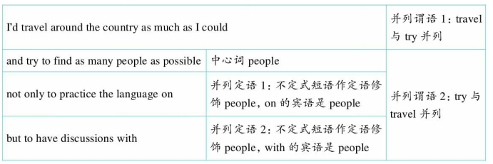

[toc]

&emsp;
&emsp; 
# 1. 综述
## 1.1 三大非谓语动词
三种非谓语动词形式， 即：
> ① 不定式（to do） 
> ② 动名词（doing） 
> ③ 两种分词（现在分词doing和过去分词done） 
>
关于非谓语动词， 有三大方面的内容是需要学习和掌握的，这就是它们
> 在句中所能充当的成分
> 时态和语态的变化
> 逻辑主语。 
>
| 非谓语动词的三个重点 | 在句中充当的成分                                                                 |
| -------------------- | -------------------------------------------------------------------------------- |
| 不定式               | 不定式，即“不一定是什么词性的成分”，不定式在句中能够充当**除谓语之外**的任何成分 |
| 动名词               | 动名词相当于名词，因此在句中主要充当主语、宾语、表语和定语                       |
| 分词                 | 分词相当于形容词和副词，因此在句中主要充当定语、状语、补足语和表语               |

&emsp;
&emsp; 
# 2 不定式的作用（一）：作主语（`It + to do`）
&emsp;&emsp; 在英语中， 不定式用作句子的主语的情况是非常常见的。 通常有两种结构： 
> 一种是把不定式`to do`直接放在句首的主语位置
> 另一种是把不定式`to do`放在句末
> 
而在句首的主语位置用形式主语it来指代句末的不定式。

## 2.1 不定式放在 `句首` 作主语
&emsp;&emsp; 不定式作主语时的位置比较特殊——通常要放在句末， 而不放在句首。 只有在一些比较特殊的情况下才直接把不定式放在句首作主语， 这种情况往往是有两个不定式构成对比关系。 比如英语里有这样一个谚语：
> 1 **To err** is human; **to forgive**, divine.
> 犯错人皆难免， 宽恕则属超凡。
>
> `err` 
> &emsp;&emsp; vi. 犯错误;做错事;出差错
> 
这里的两个不定式`to err`和`to forgive`作主语， 构成对比关系。 第二个分句是个省略句， 省去了`is`， 完整的句子应该是`to forgive is divine`。
&emsp;&emsp; 这个句子的基本意思是说： 人人都会犯错误， 但是如果能够有肚量去宽容别人的错误则实在难能可贵。 其实， 我们不仅要能够宽恕别人， 有时候也要能够宽恕自己（`It is not enough that we forgive one another, but we must also forgive ourselves.`） 。
> 2 **To love for the sake of being loved** is human, but **to love for the sake of loving** is angelic.
> 因为被爱而爱， 是人之常情； 因为爱而爱， 则难能可贵（超凡脱俗） 。
> 
这里的两个不定式`to love for the sake of being loved`和`to love for the sake of loving`作主语， 构成对比关系， 所以直接放在了句首。

&emsp;
## 2.2 不定式放在 `句末` 作主语
&emsp;&emsp; 不定式直接放在句首充当主语的句子是不常见的， 占不到10%。 更常见的是用`it`作形式主语， 放在句首， 而将真正的主语不定式（短语） 放在句子后面， 于是构成“It+to do sth.”这样的句型。 在这里， 主要讨论以下三个问题：
> (1) “It is + 形容词 + to do”结构
> (2) 其他结构
> (3) 思维差异比较
> 
### 一、 `It is` + 形容词 + `to do` 结构
比较常见的是“It i s+形容词+to do”这样的结构。 请先来看一些较为简单的例句：
> 1 **It's** better **to love someone you can't have** than to have someone you can't love.
> 与其拥有一个你不爱的人， 倒不如爱一个你无法拥有的人。
> 
> 2 **It is** possible **to give without loving**, but **it is** not possible **to love without giving**.
> 我们可以付出而不爱， 但不可能爱而不付出。
> 
从以上例句我们看出， 常见的`It is` + 形容词 + `to do`句型其实就是不定式作主语的句型。 我们再来看下面这段话：
> 3 &emsp;&emsp; Bush's remarks: Education is the best anti-crime program. **It's** important **to enforce law**. **It's** important **to hold people accountable for their actions**. **It is** important **to have consistent policy** that says, if you harm somebody, there will be a punishment for that harm. But in the best interests for my country, the long-term solution is to make sure the education system works for everybody. And when that happens, there will be a more hopeful future for people, and there will be less poverty, less hopelessness, and less crime.
> &emsp;&emsp; 小布什的言论： 教育是遏制犯罪的最佳方法。 它对于加强法制十分重要， 对于敦促人们为自己的行为负责十分重要， 对于制定稳定持续的政策十分重要， 这也就是说伤人者必受惩罚。 但是为我国的最大利益着想， 一个长期的解决方案是要确认教育体系为所有人服务， 若果真如此， 人们的未来将会更有希望， 贫穷、 失望以及犯罪将会更少。
> 
这是美国总统小布什论及教育时说的一番话。 这里三个黑体部分的句子都是用了不定式作主语。

> 4 &emsp;&emsp; As Mark Twain said, **it is** better **to deserve an honor** and not have it than **to have it** and not deserve it. Because dignity is not in possessing but deserving. **It is** better **to lose honorably** than **to succeed with dishonesty**. Losing honorably may signify lack of preparation but dishonest winning signifies lack of character.
> &emsp;&emsp; 就像马克·吐温所说的， 应得某种荣誉而并未获得它， 比获得了荣誉却并不配拥有它要好，因为高贵不在于拥有而在于应得。 优雅地失败胜于可耻地胜利。 优雅的失败意味着准备得不充分， 而可耻的胜利则表明丧失了人格。
> 
这里两个黑体部分的句子都是用了不定式作主语。

如果要明确说出不定式的逻辑主语， 则可以通过介词`for`给出， 比如：
> 5 It is impossible for us **to master English** in a short time.
> 我们不可能在很短的时间内就掌握英语。
> 
这里由for引出逻辑主语`us`， 表示`master`这个动作的执行者。

我们再来看下面这个较为复杂的句子：
> 6 &emsp;&emsp; **It is** easy for the growing number of "China watchers" through the world, enthralled by the rapid emergence of a front-ranking economic power setting new development records with each passing year, **to overlook** the fact that the past half-century has been an unusual difficult time in which to perform such feats.
> &emsp;&emsp; 有越来越多的来自世界各地的“中国观察家们”， 因为看到中国快速地成为了经济强国， 其经济发展排名一直靠前， 并且每年都在经济发展的领域创造新纪录， 他们为此感到着迷， 所以他们很容易忽略这样一个事实： 在过去的半个世纪里能够取得如此巨大的成就是非常不容易的。
> 
看完这个句子， 也许有读者开始“晕”了， 不知它要说什么意思。 大家知道， 对于这类复杂的句子， 要想理解其意思， 首先必须要搞清楚它的逻辑语义结构。 在分析句子的结构时， 要从大处着手，由表及里地逐渐深入分析。 比如这个句子， 首先要看到它其实就是一个不定式作主语的句型， 把所有的细枝末节坎去后就是： It is easy for sb. to overlook sth.只不过这里的sb.所代表的成分非常复杂， 是(for) the growing number of "China watchers" through the world, enthralled by the rapid emergence of a front-ranking economic power setting new development records with each passing year； sth. 所代表的成分也很复杂， 是(to overlook) the fact that the past half-century has been an unusual difficult time in which to perform such feats。

emsp;&emsp; 从这个句子我们看出， 真正灵活运用句型结构来分析句子对于理解句意是多么重要。
emsp;&emsp; 值得强调的是， 此处的形式主语it不能用this或that来替换， 这在考试的改错题中出现过。 比如：
> 7 This (A) is impossible for (B) people to stare directly (C) at the sun.
> 人们不可能直视太阳。
> 正确答案 A， 应改为： It。
> 
再来看下面这个TOEFL改错题：
> 8 Due to (A) the refraction of light rays, this (B) is impossible for the naked eye to determine (C) the exact location of a star close (D) to the horizon.
> 由于光线的折射， 想用肉眼来判定靠近地平线的某个星星的确切位置是不可能的。
> 正确答案 B， 应改为： it。

### 二、 其他结构
emsp;&emsp; 以上的例句都是`It is` + 形容词 + `to do`这样的结构， 但读者不要据此就认为不定式作主语只有这一种结构。 其实还可以有其他各种结构， 比如：
> 9 It **takes time and effort** to master English.
> 要掌握英语得花费时间， 付出努力。
> 
> 10 It is **my duty** to help you with your English.
> 帮你学英语是我的责任。
> 
还可能有其他各种结构， 但这里的`it`指代不定式（`to do`） 这一点不会改变， 故笔者在本节标题中用的是“It+to do”这个结构。

### 三、 思维差异比较
这里其实有一个中英文思维差异的问题。 比如上页讲过的例句：
> 11 It is impossible **for us to master English** in a short time.
> 
在汉语中说“我们不可能在很短的时间内就掌握英语”， 是“我们”作主语。 但在英语中其实是`for us to master English in a short time`这个不定式短语所表达的“我们在很短的时间内就掌握英语”这样一件事情作主语， 表示这件事“是不可能的（`is impossible`） ”。 因此， 英文中不能这么说：
> ~~We are impossible to master English in a short time.~~
> 
汉语中可以说“我们不可能”， 但英语中不能说`we are impossible`， 因为英语中的`impossible`不能修饰“人”， 而只能说明“事情”。 关于这一点， 我们将在后面的6.1小节中详细论述。再比如， 汉语中说“你在这里停车是违章的”， 但我们不能按照汉语的思维方式译成：
12 ~~You are against the regulation to park your car here.~~
> 
> 而要按照英语的思维表达习惯译成：
> It is against the regulation **for you to park your car here**.
> 
即应该采用不定式短语作主语这样的句式来翻译， 这才是地道的英文！
emsp;&emsp; 由此可见， 从英语与汉语的思维表达差异的角度来看， 不定式作主语是一个非常重要的英汉思维转换的句型。 很多句子， 若用汉语来说， 是“人”作主语； 但若用英语来说， 则应该用不定式来作主语， 即是“事”作主语。 对此， 请读者特别加以重视。

&emsp;
## 2.3思维总结
&emsp;&emsp; 确切来说， 作主语的不定式涉及到英汉思维表达差异的问题。 很多句子， 若用汉语说， 是“人”作主语； 但若用英语说， 则应该用不定式来作主语， 即是“事”作主语。 此外， 读者要知道不定式作主语的位置
特点， 即通常位于句末。

&emsp;
&emsp;
# 3. 不定式的作用（二） ： 作宾语（动词 + `to do`）
&emsp;&emsp; 我们在这里**重点探讨的是**不定式作宾语时在句中的位置特点。 不定式作宾语， 一般具有三种可能的结构： 
> ① “动词 + to do”， 
> ② “动词 + 疑问词 + to do”，
> ③ “动词 + it + 宾语补足语 + to do”。
> 

## 3.1 结构一： 动词 + `to do`
不定式可以直接跟在一个及物动词后面作宾语， 这时句子有以下两个特点：
> 第一， 句子的主语和不定式的逻辑主语是一致的， 即两个动词所表示的动作都是由全句主语发出的。
> 第二， 这时句子的谓语动词多是描写态度， 不定式的动词则说明行为。
> 

> 1 I **hope to see** you again.
> 我希望再见到你。
> 2 This company **refused to cooperate with** us.
> 这家公司拒绝与我们合作。
> 3 He **promised not to tell** anyone about it.
> 他许诺不把这件事情告诉任何人。
> 
在各类考试中， 经常会考查一个动词的后面是接不定式还是接动名词， 比如：
> 4 Why should anyone bother ______ his treasure to help a stranger?
> A. risking to lose
> B. to risk losing
> C. risking losing
> D. to risk to lose
> 
> 为什么竟然会有人冒着失去自己财产的风险而去帮助一个陌生人呢？
> 正确答案 B。
> 
`bother`后面须接不定式， 而risk后面须接动名词， 故B正确。

英语中常需要接不定式作宾语的动词有（具体词义和用法请查词典） ： 
> afford, agree, appear, arrange, ask, attempt, beg, begin, bother, care, choose, consent, dare, decide, determine, expect, ail, forget, happen, hate, help, hesitate, hope, intend, learn, like, love, manage, mean, neglect, offer, prefer, prepare, pretend, promise, propose, refuse, regret, remember, seem, start, swear, trouble, try, want, wish等。
> 

## 3.2 结构二： 动词 + 疑问词 + `to do`
&emsp;&emsp; 在一些动词之后， 可以在连接代词（what, who, which） 或连接副词（how, when, where） 及连词whether后面接一个带to的不定式， 我们可以将这种结构看成是连接词引导的宾语从句的简略形式。 事实上， 这些连词都是由相应的疑问词转化而来的， 其中whether对应于一般疑问句。 请看例句：
> 1 I wonder **who to invite**（ = who I should invite） .
> 我想知道该邀请谁。
> 
> 2 I don't know **whether to answer** his letter.
> 我不知道是否要给他回信。
> 
以上例句中的不定式是充当动词的宾语。 有时不定式是充当动词的直接宾语， 比如：
> 3 Show us **what to do**（ = what we must do） .
> 告诉我们该做什么。
> 
在一本书的前言里， 作者这么写道：
> 4 Wherever you are in life, your habits determine 95% of your thoughts, feelings and actions. This book shows you **how to develop** the lifelong habits for great success.
> 无论你身处人生的何种阶段， 你的日常习惯决定了你的思想、 感情和行为的95%。 这本书将向你展示的是， 你该如何培养良好的终生习惯以取得人生的成功。
> 
这里的不定式短语`how to develop the lifelong habits for great success`是在谓语动词`show`后面充当直接宾语， you作间接宾语。

> 5 Every aspect of our life is determined by our habits, including relationships with those we love. This book teaches you **how to acquire** new habits that can help improve your relationships automatically!
> 我们生活的方方面面， 包括与那些我们所爱的人之间的关系， 都是由我们的习惯决定的。这本书将教会你如何培养新的好习惯， 以此来自动改善你们之间的关系！
> 
这里的不定式短语`how to acquire new habits...`是在谓语动词teach后面充当直接宾语， you作间接宾语。

类似的动词（ 短语） 还有： 
> ask, consider, decide, discover, explain, forget, find out, guess, imagine, know, learn, observe, remember, see, tell, teach, think, understand, wonder等等。
> 

## 3.3 结构三： 动词 + it + 宾语补足语 + to do
&emsp;&emsp; 在“谓语动词 + 宾语 + 宾语补足语”这样的结构中， 如果宾语由一个不定式充当， 此时的不定式不能直接放在谓语动词后面， 而需要变成这样的结构： “动词+it+宾语补足语+to do”， 也就是说此时作宾语的不定式被后置， 放在了宾语补足语的后面， 而用it作形式宾语放在谓语后面作宾语。 请看例句：
> 1 I think **it** hard **to answer** the question in one go.
> 我觉得很难一下子回答这个问题。
> 
这里的it是形式宾语， 它指代不定式短语to answer the question in one go这个真正的宾语。形容词hard是宾语补足语。

> 2 He feels **it** challenging **to be** a marketing supervisor.
> 他认为担任市场总监很具有挑战性。
> 
这里的it是形式宾语， 它指代不定式短语to be a marketing supervisor这个真正的宾语。 形容词challenging是宾语补足语。

> 3 Every reader finds himself. The writer's work is merely a kind of optical instrument that makes **it** possible **for the reader to discern** what, without this book, he would perhaps never have seen in himself.
> 每位读者都需要发现他自己。 作者的工作只是起着一种类似光学仪器的作用， 如果没有这本书作这样的仪器， 读者可能就不会发现自己从未觉察到的一面， 而这本书使之成为可能。
> 
在这个that引导的从句（that makes it possible for the reader to discern...） 中， it是形式宾语，它指代不定式短语for the reader to discern...这个真正的宾语。 形容词possible是宾语补足语。

类似的结构还有：
> 4 There are over 100 night schools in the city, making **it** possible **for a professional to be re-educated** no matter what he does.
> 这座城市里有一百多所夜校， 因此对于那些在职人员来说， 不论他们从事的是什么行业，都有可能接受继续教育。
> 
我们再来看一道旧TOEFL考题：
> 5 Using many symbols makes _____ to put a large amount of information on a single map.
> A. possible
> B. it is possible
> C. it possible
> D. that possible
> 
> 通过使用多种不同的符号， 才有可能在一张地图上给出大量的信息。
> 正确答案 C。
> 
妙语点睛 本题考查的就是作宾语的不定式后置的结构。 D选项中的that不正确， 因为不能用that来指代不定式。

请读者再来看下面这个例句：
> 6 The computer **makes possible** a marvelous leap in human proficiency.
> 计算机使得人类的工作效率有了极大的飞跃。
> 
我们看到， 这句话的谓语makes后面没有形式宾语it。 为什么呢？ 原来后面的宾语不是不定式， 而是一个名词短语a marvelous leap in human proficiency。 由此得出结论： 被后置的宾语如果是不定式， 则需要it作形式宾语； 如果被后置的宾语是名词短语， 则不需要it作形式宾语。

再来比较：
> 7 
> 1) The development of steel nibs **makes it possible** to develop pens.
> 2) The development of steel nibs **makes possible** the development of pens.
> 钢制笔尖的发展使钢笔得到了发展。
> 
&emsp;&emsp; 在例句1） 中， 宾语是`to develop pens`这个不定式， 且被后置了， 所以在原来的宾语的位置需要有一个形式宾语it。 
&emsp;&emsp; 在例句2） 中， 宾语是`the development of pens`这个名词短语， 且被后置了， 所以在原来的宾语的位置不需要有形式宾语it。

> 8 
> 1）The development of steel nibs **makes it possibl**e that people can develop pens.
> 2）Many people **consider impossible** what really is possible. 
> 
> 1） 钢制笔尖的发展使钢笔得到了发展。
> 2） 很多人把完全有可能的事情认为是不可能发生的。
> 
&emsp;&emsp; 在例句1） 中， that引导的从句`that people can develop pens`充当`make`的宾语， 被后置了， 此时原来的宾语的位置有一个形式宾语it。 
&emsp;&emsp; 在例句2） 中， `what`引导的从句`what really is possible`充当`consider的`宾语， 被后置了， 此时原来的宾语的位置没有形式宾语it。

&emsp;&emsp; 综上所述， 我们可以得出这个结论： 在“动词+宾语+宾语补足语”的结构中， 当宾语被后置， 即变成“动词+宾语补足语+宾语”这样的结构时， 在动词后面是否需要形式宾语it， 取决于宾语的构成形式。 如果宾语是动词不定式或that引导的从句， 则需要形式宾语it； 如果宾语是名词短语或what引导的从句， 则不需要形式宾语it。 请认真分析下列例句：
> 9 This **calls** into question **all of our cultural assumptions that gay men are feminine**.
> 在我们的文化中， 人们一般认为男同性恋者都较为女性化， 这一点就令人们对此提出了质疑。
> 
这里calls的宾语是名词短语all of our cultural assumptions that gay men are feminine， 介词短语into question作宾语补足语， 所以在calls后面不需要形式宾语it。

> 10 Thus, the anthropological concept of "culture", like the concept of "set" in mathematics, is an abstract concept which **makes possible** immense amounts of concrete research and understanding.
> 因此， 人类学中“文化”的概念就像数学中“集”的概念一样， 是一个抽象概念， 它使大量的具体研究和认识成为可能。
> 

图解难句
|     |     |
| --- | --- |
|     |     |

这是2003年的考研翻译真题。 这里`makes`的宾语是名词短语`immense amounts of concrete research and understanding`， 所以在makes后面不需要形式宾语`it`。

在下面的例句中都需要形式宾语it：
> 11 They want to **make it** clear **to the public** that they do an important and necessary job.
> 他们想让大众知道， 他们是在做一项既重要又必要的工作。
> 
这里make的宾语是that引导的从句that they do an important and necessary job， 所以在原宾语的位置需要有代词it来指代这个宾语。 形容词短语clear to the public作宾语补足语被提前， 从而分隔了动词与其宾语。

> 12 There are those who consider it questionable that these defense-linked research projects will account for an improvement in the standard of living or, alternately, do much to protect our diminishing resources.
> 这些与防御有关的研究项目能不能说明生活水平的提高， 或者说能不能有利于保护我们日益减少的资源， 有人对此是持怀疑态度的。
> 
这里consider的宾语是that引导的从句that these defense-linked research projects will account for
an improvement in the standard of living or, alternately, do much to protect our diminishing resources， 所以在原宾语的位置需要有代词it来指代这个宾语。 形容词questionable作宾语补足语被提前， 从而分隔了动词与其宾语。

> 13 The panel has not yet reached agreement on a crucial question, however, whether to recommend legislation that would make it a crime for private funding to be used for human cloning.
> 然而， 这个专家委员会在一个关键性的问题上仍未达成一致意见， 那就是是否建议立法，将私人资金用于克隆人视为犯罪行为。
> 
这里make的宾语是不定式短语for private funding to be used for human cloning， 所以在原宾语的位置需要有代词it来指代这个宾语。 名词a crime作宾语补足语被提前， 从而分隔了动词与其宾语。

&emsp;
&emsp;
# 4 不定式的作用（三） ： 作宾语补足语（动词 + 宾语 + `to do`）
&emsp;&emsp;不定式作宾语补足语， 通常只放在某些特定的谓语动词后边， 其基本结构是“谓语动词+宾语+to do”。
请看例句：
> 1 There is still good availability of some of the hottest toys this Christmas, but we still **advise parents and shoppers to get to** stores as early as possible next week.
> 这个圣诞节期间一些热门玩具仍货源充足， 但我们还是建议家长和购物者下周尽早去商店购买。
> 
谓语动词`advise`后面通常接`sb. to do`这样的结构， 不定式作宾语补足语。

请看其他例句：
> 2 **Allow me to drink** to your success!
> 让我为你的成功干杯！ （祝酒词， 现在就背下来！ ）
> 
> 3 **Allow me to propose** a toast to our friendship!
> 我提议， 为我们的友谊干杯！
> 
> 4 They don't **allow people to smoke** in the theater.
> 他们不允许在剧场内吸烟。
> 
> 5 The chairman **declared the meeting to be** over.
> 主席宣布会议结束。
> 
> 6 Then our sense of timidity can **cause us to hesitate**, **to move slowly**, and not **to take a step** until we know the ground is safe.
> 我们的胆怯心理往往会使我们犹豫不决、 行动迟缓， 等到我们确信一切安全后方才采取行动。
> 
这个句型结构常出现在各类考试中， 比如下面这道TOEFL考题：
> 7 In hot, dry regions, the sun's heat causes the outer layer of rocks _____, process called exfoliation.
> A. are expanded and peeled away
> B. to expand and peel away
> C. expanding and peeling away
> D. they expand and peel away
> 
> 在炎热、 干旱的地区， 太阳的热使得岩石外表面膨胀、 剥落， 这个过程叫做脱落。
> 正确答案 B。
> 
该句的谓语动词cause要求接不定式作宾语补足语， 所以B正确。

能用于此结构中的动词有（具体词义和用法请查词典） ： 
> advice, allow, ask, beg, believe, cause,command, challenge, compel, declare, encourage, expect, forbid, force, get, hate, have, help, instruct, intend, invite, judge, leave, let, like, mean, make, need, oblige, order, permit, persuade, prefer, press, recommend, request, remind, teach, tell, tempt, trouble, want, warn, wish (hope不可), urge等。
> 
另外， 在let, make, have, see, hear, feel, watch, notice, listen to等动词（短语） 后面的不定式作宾语补足语的句子中， to要省略。 我们将在14节讨论这个情况。

&emsp;
&emsp;
# 5 不定式的作用（四） ： 作定语（名词+to do）
&emsp;&emsp; 不定式作定语的情况也许是读者不太熟悉的， 因为可能在平时的阅读中也不大关注， 所以我们在这里比较详细地讨论一下。 既然是作定语， 那么自然是修饰名词。 我们在这节里主要是讨论作定语的不定式与被修饰名词之间的各种逻辑关系， 以便读者在遇到时能够正确理解并翻译。
&emsp;&emsp; 在讨论逻辑语义关系之间， 我们先来看一下不定式修饰名词时与名词的位置关系。 因为不定式是由小品词to后面接一个动词而构成的， 这是一个短语的形式， 而短语作名词的定语时都要置于名词的后面， 即构成后置定语， 故此， 不定式作定语都要放在被修饰名词的后面。 请看例句：
> He is the best man **to choose**.
> 
我们看到， 这里的不定式`to choose`是放在名词man后面的， 作为后置定语来修饰man。 因此， 读者以后看到的名词后面接的不定式， 一般都是作定语用的（当然不一定全是， 因为也可能是其他原因导致某个名词后面接不定式） 。 对于作定语的不定式， 关键是要搞清楚它与其前面被修饰的名词之间的逻辑语义关系， 这样才能正确地理解和翻译句子。 就拿这个例句来说吧， 请读者思考一下该如何翻译。
&emsp;&emsp; 这句话是有歧义的。 歧义的产生就是因为man与to choose的逻辑关系不确定。 二者的关系可以理解成主语关系——被修饰的名词作不定式动词逻辑意义上的主语， 此时相当于说： 
> He is the best man to do the choosing.
> 或者： 
> He is the best man to make the choice.表示“由他来选择”。
> 
另一方面， 也可以理解成宾语关系——被修饰的名词作不定式动词逻辑意义上的宾语， 此时相当于说： 
> He is the best man that we can choose.
> 或者： He is the best man for us to choose.
> 或者： He is the best man to be chosen by us.表示“别人选择他”。 
> 
有两种逻辑语义关系， 自然就有两种截然不同的翻译：
> 主谓关系： 由他来作出选择是最好的。
> 动宾关系： 他是最佳的人选。
> 
分析到这里， 读者也应该更深刻地理解了笔者上面提到的这个观点： 对于作定语的不定式， 关键是要搞清楚它与其前面被修饰的名词之间的逻辑语义关系， 这样才能正确地理解和翻译句子。

## 5.1 宾语关系
&emsp;&emsp; 所谓宾语关系， 就是指被修饰的名词在逻辑意义上充当不定式的宾语。 若进一步细分， 又可分为下面两种情况： 一是作不定式中的动词的宾语， 二是作不定式中的介词的宾语。 下面先给出这样三个非常简单的句子：
> 1 I have a letter to write.
> 2 I need a pen to write.
> 3 I need some paper to write.
> 
相信读者都能理解这三个句子， 比如可以分别翻译成：
> 1 我有一封信要写。
> 2 我需要笔来写。
> 3 我需要纸来写。
> 
这三个句子看似简单， 但其中却“暗藏杀机”。 其实， 最后两个句子是错误的， native speakers是不会这么说的。 为什么？ 我们还是要搞清楚其中的逻辑关系。 再回头看这三个句子：
> 4 I have a letter to write.
> 5 I need a pen to write. *
> 6 I need some paper to write. *
> 
&emsp;&emsp; 在例句1中， 不定式to write修饰名词letter， 二者构成宾语关系。 我们可以直接把letter作write的宾语，即说成： write a letter。
&emsp;&emsp; 在例句2中， 不定式to write修饰名词pen， 二者构成宾语关系。 但是， 我们不可以直接把pen作write的宾语， 即说成： write a pen*， 而是要在二者之间加一个介词， 才能表达出它们的逻辑关系。 这里是工具关系， 所以我们可以用with， 比如说成： write with a pen。 因此， 例句2应该改写成： I need a pen to write with.
&emsp;&emsp; 在例句3中， 不定式to write修饰名词paper， 二者构成宾语关系。 但是， 我们不可以直接把paper作write的宾语， 即说成： write some paper*， 而是要在二者之间加一个介词， 才能表达出它们的逻辑关系。 这里是地点关系， 所以我们可以用on， 比如说成： write on some paper。 因此， 例句3应该改写成： I need some paper to write on.
这里的名词pen和paper就是分别作不定式中的介词with和on的宾语。 再比如下面这个对话：
> 7 
> Tony: My teacher insists that all our writing is done by hand. What do you think?
> Nick: I think you should get a new teacher! No serious teacher who is concerned about the writing ability of their students would ever teach writing by hand. They should be teaching digital writing.
> Tony: Digital writing? I've never heard of that! What is it?
> Nick: It's simply writing that is word processed. In other words, using a computer to write with.
> 
> 托尼： 我的老师坚持让我们用手写作文。 你觉得怎么样？
> 尼克： 我觉得你应该换一个新老师！ 没有一位认真关注学生写作能力的老师会教他们用手写作， 而应该教他们使用电子输入。
> 托尼： 电子输入？ 我从没听说过！ 那是什么？
> 尼克： 就是文字处理方法。 换句话说， 就是用电脑来写字。
> 
同样， 我们看到， 最后一句话的末尾有介词with， 来帮助建立不定式to write和被修饰名词computer之间的逻辑语义关系， 否则语义是被割裂的。 这里的computer作介词with的宾语。
 
&emsp;&emsp; 这又一次证明了我们上面提到的这个观点： 对于作定语的不定式， 关键是要搞清楚它与其前面被修饰的名词之间的逻辑语义关系。 如果不认真分析它们之间的逻辑关系， 往往写错了句子自己还不知道。
下面我们分别就这两种宾语的情况作详细讨论。
### 一、 作不定式中的动词的宾语
&emsp;&emsp; 此时， 不定式中的动词应该是一个及物动词， 而且不带有宾语， 它的宾语由前面被修饰的名词来充当。 请看例句：
> 8 We had a long journey **to make before nightfall**.
> 在天黑前， 我们还有很长的路要赶。
> 
这里的名词短语`a long journey to make before nightfall`相当于`a long journey that we will make before nightfall`， 从这个改写后的句子可以看出， 不定式短语`to make before nightfall`的逻辑宾语是`journey`，即被修饰的名词与不定式之间是动宾关系。

请再看一个例句：
> 9 I gave the kid **a comic to read**.
> 我给这孩子一本连环画看。
> 
需要提醒大家注意的是， 既然不定式中的动词已经有了自己的逻辑宾语， 该动词后面就不能再有宾语了， 比如不能说：
> 10 ~~I gave the kid a comic to read it.~~
> 

### 二、 作不定式中的介词的宾语
&emsp;&emsp; 此时的介词可以分为两种情况： 有的介词是与动词构成搭配的， 有的介词是与被修饰的名词构成搭配的。 请看例句：
> 11 She has four **children to take care of**.
> 她有四个孩子需要照顾。
> 
这句话句末的of是属于take care of这个短语中的固定搭配。 名词children作介词of的宾语，或者也可以说是作take care of这个动词短语的宾语。
 
> 12 I had no **place to live in**.
> 我当时没有地方可住。
> 
这句话句末的`in`是与`live`构成语义搭配。 名词`place`作介词in的宾语， 或者也可以说是作`live in`这个动词短语的宾语。
 
> 13 They say a person needs just three things to be truly happy in this world--someone **to love**, something **to do** and something **to hope for**.
> 人们常说， 一个人若有了三样东西， 他就会真正感到幸福： 有人爱， 有事做， 有希望。
> 
这里有三个名词短语： 
> someone to love, 
> something to do
> something to hope for， 
> 
分别相当于
> someone that he can love, 
> something that he can do
> something that he can hope for
> 
从这个改写后的句子可以看出， 不定式to love, to do和to hope for的逻辑宾语分别是someone, something和something， 即被修饰的名词与不定式之间存在宾语关系。 前两个someone和something分别直接作不定式中的动词love和do的宾语， 后一个something是作介词for的宾语， for与动词hope构成搭配。 为什么这里非得加一个for呢？ 这是因为， 动词hope后面一般要接that引导的从句， 说成hope that...。 如果不是接从句而是接名词短语的话， 则必须说hope for sth.。 故这里的hope for是一个固定搭配关系。

&emsp;&emsp; 与上句不同的是， 有时会出现多个不定式共同修饰一个名词的现象， 比如：
> 14 You just regard me as a thing, **an object to look at**, **to use**, **to touch**, but not **to listen to** or **to take** seriously.
> 你只是把我当作一件东西， 一件任你看、 任你用、 任你抚摸的东西， 但就是不听我的话，不认真对待我。
> 
这里的五个不定式`to look at, to use, to touch, to listen to`和`to take seriously`共同修饰一个名词`object`， 该名词作这五个不定式的逻辑宾语。 其中有两个不定式是带有介词的： `to look at`和`to listen to`， 这里的介词都与动词构成固定搭配。

&emsp;&emsp; 在以上讨论的例子中， 不定式中的介词都是与动词构成语义搭配的， 这种情况也是英语中最常见的。下面我们看另一种情况——介词与被修饰的名词构成搭配。 请看例句：
> 15 Why don't you get a backpack to carry your books **in**?
> 你为什么不买一个双肩背包来装你的书呢？
> 
该句句末的`in`与被修饰的名词`backpack`构成语义搭配， 表示“在双肩背包里”。
> 16 I need to buy an outfit for the gym to exercise **in**.
> 我需要买一套运动装在健身房里穿。
> 
该句句末的`in`与被修饰的名词`gym`构成语义搭配， 表示“在健身房里”。

> 17 &emsp;&emsp; According to the Chinese tradition of the Water Splashing Festival, the more water you pour over someone the more luck you give them, so we gave each other a good few hours of hair soaking and eye-reddening luck to remember each other **by**.
> &emsp;&emsp; 根据中国泼水节的传统， 往别人身上泼的水越多， 给他的祝福也就越多。 因此， 我们当时为对方泼水祝福了好几个小时， 大家的头发都湿淋淋的， 眼睛也变红了， 希望能够借此记住彼此。
> 
乍一看这个句子， 读者是不是对句末的介词by感到很奇怪呢？ 为什么这里会有个“小尾巴”by呢？ 其实， 这个介词`by`是要把不定式`to remember each other`和名词`luck`联系起来， 从而构成语义联系， 相当于说`to remember each other by this luck`， 表示“借泼水的祝福， 希望大家能够记住彼此”。 这里的`by`不是与动词`remember`构成搭配， 而是与luck构成语义搭配。

&emsp;&emsp; 从以上这个例句我们看到， 以后如果在不定式的末尾看到有个小小的介词， 我们就必须认真分析， 找到与它搭配的动词或名词， 方能正确理解句子的结构， 比如下面这个更难一点的句子：
> 18 &emsp;&emsp; If I were abroad, I'd travel around the country as much as I could and try to find as many people as possible, not only to practice the language on but to have discussions with, and I'd hope to make some real friends.
> 我要是出国， 会尽量广泛地周游这个国家， 设法尽可能多地结识一些人， 不仅以他们作为语言实践的对象， 而且要和他们讨论问题。 我希望结识一些真正的朋友。
> 
图解难句: 

  

这个句子的难点是要找到介词on和with的宾语是哪个词， 或者说与这两个介词构成语义关系的词是什么。 从结构上来看， 这个句子有三处并列关系： 
> 一是， 两个并列主句I'd travel..., and I'd hope...；
> 二是， 在第一个主句中有两个并列谓语travel...and try...； 
> 三是， 在第二个谓语部分try to find as many people as possible, not only to practice the language on but to have discussions with中有两个并列的不定式短语to practice the language on和to have discussions with， 它们作定语， 后置修饰people， 这里作定语的不定式与被修饰的名词存在宾语关系。 
> 
具体来说， 在这两个不定式短语中， 介词`on`和`with`的宾语都是`people`， 即相当于说
> `practice the language on people`
> `have discussion with people`， 
> 
分别表示“与这些人练习语言”和“与这些人进行讨论”。 由此可见， 名词`people`与其相关的介词`on`和`with`被分隔得较远。 只有理解到这一步， 才能真正理解句子的逻辑结构和意思。

&emsp;&emsp; 我们常常把自己的口语不好归因于“没有语伴与我一起练习英文”， 那么这句话该怎么说呢？ 笔者听过很多学生这么说：
> 19 ~~I have no language partner to practice speaking English.~~
> 
其实， 这里应该在句末添上一个介词`with`， 说成：
> I have no language partner to practice speaking English **with**.
> 
因为不定式短语to practice speaking English与language partner是没有逻辑关系的， 只有添加with才有逻辑关系。 对于介词的这点“小问题”， 中国的英语学习者常常忽略， 没能建立起灵活的英语思维。

&emsp;&emsp; 再比如， 笔者的一个英国朋友写了一本口语书， 在书的前言里他这样写道：
> 20 How to Get the Most out of These Dialogues
> &emsp;&emsp; Role play dialogues are excellent opportunities for learners of English to practice English because they give students the chance to assume a role that is not their own. They can be anyone they want. It does not matter if you make a mistake because it is not you who makes it. It is your character who does! You can totally assume the character and personality of your part and play it to the hilt and beyond! Your voice and actions can be completely over the top and yet it does not matter because it is only acting. Role playing is a safe and enjoyable way to learn English. It is a good idea to find **a partner to practice** the following dialogues **with**.
> 如何充分利用这些对话
> &emsp;&emsp; 对于英语学习者来说， 在英语会话中进行角色扮演是锻炼英语水平的一个绝好的机会， 这使得学生们有机会去担任一个完全不同于自己本人的任何角色。 即使犯了错误也无所谓， 因为错误并不是你犯的， 而是你扮演的角色犯下的！ 你完全可以设想自己所扮演角色的性格特征并将其发挥至极致。 你的声音、 你的动作都可以很夸张， 这并没有什么， 不过是在演戏罢了。 角色扮演是一个安全并且自得其乐的英语学习方式。 找个搭档与你一起练习书中的对话， 是个不错的主意。
> 
同样， 笔者的朋友没有忘记在最后一句的句末加上`with`， 以使不定式`to practice the following dialogues`能够与被修饰的名词`partner`构成很好的逻辑关系。

另外要注意的是， 不定式已经有了逻辑宾语， 所以不定式动词后面不能再加宾语了， 比如不能说：
> 21 ~~She has four children to take care of them.~~
> 
总之， 被修饰的名词不论是充当不定式中的动词的宾语， 还是作不定式中的介词的宾语， 实际上都是作宾语， 笔者在这里统称为“宾语关系”。

&emsp;
## 5.2 主语关系
所谓主语关系， 就是指被修饰的名词在逻辑意义上充当不定式中动词的主语。 请看例句：
> 1 The man **to help** you is Mr. Johnson.
> 能够帮你的人就是约翰逊先生。
> 
 这里的名词短语`the man to help you`相当于`the man who can help you`， 从这个改写后的句子可以看出， 不定式`to help`的逻辑主语是`man`， 即被修饰的名词与不定式之间存在主谓关系。

> 2 Have you got a key **to unlock** this door?
> 你有能够打开这个门的钥匙吗？
> 
这里的名词短语`the key to unlock this door`相当于`the key that can unlock this door`， 从这个改写后的句子可以看出， 不定式`to unlock`的逻辑主语是`key`， 即被修饰的名词与不定式之间存在主谓关系。

&emsp;&emsp; 值得注意的是， 在这种具有主语关系的不定式结构中， 被修饰的名词前面还通常会有only、 last、next、 序数词、 最高级形容词等修饰成分。 请看例句：
> 3 I don't think he is **the best man to do** the job.
> 我认为他并不是做这项工作的最佳人选。
> 
> 4 **The next train to arrive** is from New York.
> 下一列到达的火车是从纽约开来的。
> 
> 5 Clint was **the second person to fall** into this trap.
> 克林特是第二个掉进陷阱的人。
> 
> 6 Clint was **the only person to survive** the air crash.
> 克林特是这次空难事故中唯一的幸存者。
> 
> 7 He was **the second person to be killed** in this way.
> 他是第二个这样被害的人。
> 

&emsp;
## 5.3 同位语关系
&emsp;&emsp; 所谓同位语关系， 就是指不定式短语的内容是对被修饰的名词作进一步补充说明， 因此名词与不定式短语之间构成同为说明的关系。 请看例句：
> 1 The need **to love and to be loved** seems universal. Maybe this is one trait that separates human beings from other animals.
> 爱与被爱的需要似乎是人类普遍的特性， 或许正是这一特性把人和动物区分开了。
> 
这里的不定式短语`to love and to be loved`是补充说明名词need的具体内容的， 表示“爱与被爱这样的需要”。 没有这个不定式短语， need的内容就不完整、 不明确。
 
&emsp;&emsp; 当然不是所有的名词与不定式连用都能够表示同位语关系， 这样的名词一般仅限于两类： 一类是与动词相关的名词， 一类是与形容词相关的名词。
&emsp;&emsp; 所谓与动词相关的名词， 是指那些要求与不定式连用的动词， 因而它们的名词形式也要接不定式。 常见的这样的名词有： 
> arrangement, attempt, claim, decision, hope, determination, failure, need, plan, promise,refusal, resolution, tendency, threat, wish等等。 
> 
请比较：
> 2 
> 1） He **refused to** co-operate with us.
> 2） His **refusal to co-operate** makes us angry.
>
> 1） 他拒绝与我们合作。
> 2） 他拒绝与我们合作， 这让我们很生气。
> 
我们知道， refuse的后面需要接不定式to do， 所以其名词refusal也要接不定式， 因此不能说~~refusal of doing~~。 这里的不定式`to co-operate`是作名词`refusal`的同位语。

> 3 
> 1） I don't wish to change.
> 2） I have no wish to change.
> 
> 我不愿意改变。
> 
我们知道， 动词wish的后面需要接不定式to do， 所以其名词wish也要接不定式， 因此不能说~~wish of doing~~。 这里的不定式to change是作名词wish的同位语。

&emsp;&emsp; 所谓与形容词相关的名词， 是指那些要求与不定式连用的形容词， 因而它们的名词形式也要接不定式。 这样的名词有： 
> ability, ambition, anxiety, eagerness, inclination, reluctance等等。 
> 
请比较：
> 4 
> 1）She was **reluctant to accept** his invitation.
> 2）Her **reluctance to accept** his invitation upset him.
> 
> 1） 她很不愿意接受他的邀请。
> 2） 她很不愿意接受他的邀请， 这使他很心烦。
> 
我们知道， 形容词reluctant的后面需要接不定式to do， 所以其名词reluctance也要接不定式， 因此不能说reluctance of doing*。 这里的不定式to accept是作名词reluctance的同位语。

> 5 
> 1） They were **eager to help** me.
> 2） Their **eagerness to help** pleased me.
> 
> 1） 他们非常热心地帮助我。
> 2） 他们的热心帮助真让我高兴。
> 
我们知道， 形容词eager的后面需要接不定式to do， 所以其名词eagerness也要接不定式， 因此不能说~~eagerness of doing~~。 这里的不定式to help是作名词eagerness的同位语。

我们再来看下面这个句子：
> 6 &emsp;&emsp; In order to grow, to travel new roads, people need to have a **willingness to take** risks, **to confront** the unknown, and **to accept** the possibility that they may "fail" at first. How we see ourselves as we try a new way of being is essential to our **ability to grow**.
> &emsp;&emsp; 为了成长， 为了踏上新的人生征途， 人们需要勇于承担风险， 面对未知以及接受可能的出师不利导致的失败。 在尝试新事物时我们如何看待自己， 这对我们成长能力的培养至关重要。
> way of being 生存方式
> 
我们看到， 这里的两个名词willingness和ability都是分别由形容词willing和able变化而来的。 由于我们说willing to do和able to do， 所以它们对应的名词也要接不定式to do。 另外， 在willingness的后面接有三个并列的不定式to take risks, to confront the unknown和to accept the possibility that...作后置定语来共同修饰willingness。

这种同位语关系的用法在考试中常常见到， 所以读者应该重点掌握。 比如下面这道考研题：
> 7 A decision _____ stock by one or a few of these large companies may have a very important effect on the market as a whole.
> A. buying or to sell
> B. to buy or selling
> C. buying or selling
> D. to buy or sell
> 
> 一两家大公司若是决定在市场上买进或卖出股票， 都可能会对整个股票市场造成很大的影响。
> 正确答案 D。
> 
这里的名词是decision， 它是由动词decide变化而来的。 我们知道， 动词decide的后面是需要接不定式to do的， 所以名词decision的后面也需要接不定式， 因此选项D。 这里的不定式to buy or sell stock by one or a few of these large companies作decision的同位语。

再比如下面这道旧TOEFL的改错题：
> 8 According to Darwin, random changes that enhance a species' (A) ability for surviving (B) are (C)naturally selected and passed on to succeeding (D) generations.
> 
> 根据达尔文的遗传学理论， 某一物种的某些改变若是能够提高该物种的生存能力， 那么这种改变自然就会被选择保存下来， 并传给下一代。
> 正确答案 B， 应改为： to survive。
> 
因为able的后面要接to do， 所以名词ability的后面也须接to do。
 
&emsp;&emsp; 最后， 需要说明的是， 我们在这里讨论的名词与不定式之间的这种同位语关系， 其实从真正的意义上来说， 这里的不定式应该是作名词的同位语而不是定语。 但为了让读者易于理解（to make life easier for my readers） ， 我们在这里不区分同位语和定语， 而是把它们统称为定语。 如果真的是要作严格区分， 又会引出很多其他方面的问题， 这样就会把问题搞得过于复杂， 所以特此说明。

&emsp;
## 5.4 状语关系
&emsp;&emsp; 所谓状语关系， 就是指被修饰的名词在逻辑意义上充当不定式中动词的状语， 比如可以表示不定式动作的方式、 时间或地点等， 即分别构成方式状语、 时间状语或地点状语等。
### 一、 方式状语关系
表示方式状语关系时， 被修饰的名词往往是way。 请看例句：
> 1 Role playing is a safe and enjoyable way **to learn English**.
> 角色扮演是一个安全并且自得其乐的英语学习方式。
> 
这是笔者上面提到过的英国朋友书里的一个句子。 这里的名词短语...way to learn English相当于...way that you should learn English或...way in which you should learn English， 或直接说to learn English in a safe and enjoyable way。 从这几个改写后的句子可以看出， 被修饰的名词way在逻辑语义上相当于不定式to learn English的方式状语， 即被修饰的名词与不定式存在方式状语的关系。

> 2 There are two basic **ways to see growth**: one as a product, the other as a process.
> 基本上有两种方式来看待成长： 一种是把成长看成是一个结果， 另一种是把成长看作是一个过程。
> 
这里的不定式短语（two basic） ways to see growth相当于说to see growth in two basic ways，由此可以看出被修饰的名词ways在逻辑语义上相当于不定式to see growth的方式状语， 即被修饰的名词与不定式存在方式状语的关系。

> 3 In this process, the journey never really ends; there are always new **ways to experience the world**, new ideas to try, new challenges to accept.
> 在这个成长的过程中， 人生的旅程永远没有尽头， 因为总会不断经历新世界， 尝试新观念， 接受新挑战。
> 
这里有三个并列的不定式短语： new ways to experience the world, new ideas to try和new challenges to accept， 但是名词与不定式之间的逻辑语义关系是不同的。 第一个是状语关系， 相当于说to experience the world in the new ways； 后两个是宾语关系， 相当于说to try new ideas和to accept new challenges。

### 二、 时间状语关系
&emsp;&emsp; 表示时间状语关系时， 被修饰的名词往往是表示时间的名词如time等。 请看例句：
> 4 The time to go is July.
> 应该在7月份去。
> 
整个句子可以改写成： 
> The time at which you should go is July.
> 
从这个改写后的句子可以看出， 被修饰的名词time在逻辑语义上相当于不定式to go的时间状语， 即被修饰的名词与不定式之间存在时间状语的关系。
 
### 三、 地点状语关系
&emsp;&emsp; 表示地点状语关系时， 被修饰的名词往往是表示地点的名词， 如place等。 请看例句：
> 5 A good place to eat is the Sichuan restaurant around the corner.
> 一个吃饭的好地方就是拐角的那家川菜馆。
> 
整个句子可以改写成： 
> A good place at which you can eat is the Sichuan restaurant around the corner.
> 
从这个改写后的句子可以看出， 被修饰的名词place在逻辑语义上相当于不定式to eat的地点状语， 即被修饰的名词与不定式之间存在地点状语的关系。

&emsp;
## 5.5 补语关系
&emsp;&emsp; 所谓补语关系， 就是指被修饰的名词在逻辑意义上充当不定式中动词的逻辑主语的补语。 请看例句：
> The thing (for you) to be these days is a gold-collar.
> 在现代这个社会， 你一定要努力成为一个金领人士。
> 
整个句子可以改写成： The thing that you should try to be these days is a gold-collar.这里被修饰的名词thing在be后面作表语， 但实际上是补充说明句子主语you的， 即补足语。

&emsp;
## 5.6 思维总结
&emsp;&emsp; 综上所述， 作后置定语的不定式与被修饰的名词可以有各种逻辑语义关系， 比如宾语关系、 主语关系、 同位语关系、 状语关系以及补语关系等， 在英译汉时应特别注意分辨， 搞清楚这些逻辑关系。 在这五种逻辑关系中， 最重要的是宾语关系， 尤其是需要有介词的情形， 这对于中国学生来说比较难。 其次是同位语关系， 注意其中两类名词要接不定式。 对于主语关系， 要注意名词前面有最高级形容词修饰的情形，这在考试中也比较常见。 对于状语关系和补语关系， 因为非常少见， 所以只需了解即可。

&emsp;
&emsp;
# 6. 不定式的作用（五） ： 形容词 + to do
&emsp;&emsp; 在上一节里， 我们讨论了用在名词后面的不定式， 在这一节里我们再来讨论用在形容词后面的不定式。 用在名词后面的不定式是充当名词的后置定语的， 那么有读者也许会问， 用在形容词后面的不定式是充当什么成分呢？ 这个问题很难回答， 因为形容词后面的不定式具体充当何种成分是不一定的， 不能用某个统一的术语来概括。 为此， 笔者统一在“形容词+to do”这个标题下讨论。 其实， 具体作何种成分并不重要， 关键是要搞清楚不定式的逻辑语义关系， 只有这样才有助于我们理解句义。
&emsp;&emsp; 这节的内容更为复杂， 可以说是不定式语法项目中内容最为复杂的， 但同样非常重要， 请读者做好心理准备。 在展开具体的讨论之前， 我们先来看下面这道高考题：
> 1  A: Is my wish to become a scientist possible _____?
> &emsp;B: Yes, your wish is sure _____.
> 
> A. to realize, to realize
> B. to be realized, to be realized
> C. to realize, to be realized
> D. to be realized, to realize
> 
> A： 我想成为科学家这个愿望能够实现吗？
> B： 当然能， 你的愿望一定能实现。
> 正确答案 C。
> 
这道题看似考查被动语态的问题， 但实际上与“形容词+不定式”结构密切相关。 我们看到，这里的选项中都是不定式， 分别放在possible和sure这两个形容词后面， 一个要用主动语态说成(possible) to realize， 另一个要用被动语态说成(sure) to be realized。 为什么会有这种差异呢？ 请读者仔细考虑。
 
暂且抛开这道高考题不说， 我们再来看看其他句子。 比如：
> 2 
> 1） He is easy **to fool**.
> 2） He is afraid **to be fooled**.
> 
> 1） 他很容易被骗。
> 2） 他很害怕被骗。
> 
我们看到， 这两个句子都是表示“他被骗”， 但为什么例句1） 中用主动语态的不定式to fool， 而例句2） 却用被动语态的不定式to be fooled？再比如这两个句子：
> 3 
> 1） He is easy **to please**.
> 1） He is eager **to please.**
> 
> 1） 他很容易被取悦。
> 2） 他很喜欢取悦别人。
> 
妙语点睛 这里的please是“让某人高兴， 取悦”的意思。 两句话的结构看似完全一样， 差别只在形容词
easy和eager上， 但为什么句1） 是表示“别人取悦他”， 而句2） 却表示“他取悦别人”呢？

再比如口语中常说的这句话：
> 4 He is interesting **to listen to**.
> 
这句话要表达什么意思？ 是“他很有兴趣听别人讲话”， 还是表示“别人听他讲话很有趣”？
&emsp;&emsp; 以上提到的这些句子都涉及“形容词+不定式”结构。 对于上面那道高考题， 似乎简单点， 因为即使我们选不出正确答案， 但丝毫不影响我们对那个对话的理解与翻译——这就是英文的特点： 看懂意思了， 并不代表我们就真正“懂”英文了。 这个姑且可以不必深究， 但对于He is easy to please和He is eager to please， 就不得不搞清楚其逻辑关系了， 否则不知道是“谁取悦谁”。 还有最后一句He is interesting to listen to， 这到底作何理解？ 所以， 如果读者只满足于看懂句子的意思就行了， 而不去真正理解英语的思维规律， 那么英语水平是无法真正提高的。 这就是为什么大量中国英语学习者的英语水平就停留在能看懂但是说不出、 写不来的尴尬境地， 究其原因， 还是因为没有真正“懂英文”！
&emsp;&emsp; 以上的问题， 不是一句话能解释清楚的。 等读者看完本节讨论的所有内容之后， 自然就清楚为什么会这样选择了。
&emsp;&emsp; 上面我们提到， 对于“形容词+to do”这样的结构， 关键是要搞清楚不定式的逻辑语义关系， 但是笔者并没有说要搞清楚不定式与谁的逻辑关系。 在上一节讨论的“名词+to do”的结构中， 我们是要搞清楚“名词”与to do之间的关系。 也许有读者据此认为， 在这一节里我们是要搞清楚“形容词”与to do之间的关系。 其实不是。 这里是要搞清楚“句子主语”与to do之间的关系。
&emsp;&emsp; 因此， 对于本节要讨论的内容， 请读者注意我们的思路： 重点区分形容词的不同语义特点， 在此基础
上进而来考查形容词的语义如何影响“句子主语”与to do之间的逻辑语义关系。

&emsp;
## 6.1 宾语关系（一） ： `He is interesting to listen to`.
看到标题中的句子， 读者朋友的第一反应是什么呢？
> 1 He is interesting to listen to.
> 
笔者曾经问过很多学生， 该怎么理解这个句子， 他们想当然地理解成：
> 他对听别人讲话很感兴趣。
> 
看到这里， 也许有读者还是这么理解的。 其实这是错误的。 既然这里的形容词用的是`interesting`， 那么就是表示“他”能够引起别人的兴趣， 所以上面这句话应该理解成：
> 听他讲话很有意思。
> 
不能正确理解这个句子的一个重要原因， 是没有真正理解这个句子的如下“深层结构”：
> It is interesting **to listen to him**.
> 
或者是：
> **To listen to him** is interesting.
> 
也就是说， 在表层结构上， he是作句子的主语（He is...） ， 但在深层结构上， he是作listen to的逻辑宾语（...listen to him） 。 而句子的真正主语是to listen to him这件事， 而不是he这个人。 这里不定式to listen to的逻辑主语是泛指大众， 在句中没有明确给出， 而只是隐含其中。
这种句子结构在英语中是非常常见的。 我们下面将通过很多例句来说明， 然后总结出该句型的特点。
我们来分析下面这个句子：
> 2 He is easy to fool.
> = It is easy to fool him.
> = To fool him is easy.
> 他很容易被骗。
> 
该句的深层结构是It is easy to fool him或To fool him is easy， 由此可见， 该句真正的主语是to fool him这件事， 而不是he这个人。 he在深层结构上是充当动词fool的逻辑宾语。

&emsp;&emsp; 在上面这个译文中， 虽然汉语说“他很容易被骗”， 但原句真正的含义是说“骗他”这件事是很容易的，而不是说“他”这个人很容易。 换句话说， 形容词easy强调的是“骗他”这件事的性质特征， 而不是强调“他”这个人的性质特征。 为了说明这一点， 我们把上一句中的不定式to fool去掉， 看看会发生什么语义上的改变。 比如：
> 1） He is easy to fool.
> 2） ~~He is easy.~~
> 
句2） 在英语中是不存在的， 是没有实际意义的， 这就证明了表示人的he是无法充当easy的主语的， 这也证明了句1） 中的he并不是真正意义上的主语， 而只是一个形式上的主语， 或者说是语法结构上的主语罢了。
我们再来看下面这个例句：
> 3 He is difficult to understand.
> = It is difficult to understand him.
> = To understand him is difficult.
> 他讲话的意思很难理解。
> 
该句的深层结构是It is difficult to understand him或To understand him is difficult， 由此可见， 该句真正的主语是to understand him这件事， 而不是he这个人。 he在深层结构上是充当动词understand的逻辑宾语。

&emsp;&emsp; 同样道理， 这里的形容词difficult通常也是强调“事情”的， 而不是强调“人”。 我们把该句中的不定式to understand去掉， 看看会发生什么语义上的改变。 比如：
> 1） He is difficult to understand.
> 2） He is difficult.
> 
句2） 中的difficult的意思是“难以相处”， 整个句子的意思是“他这人很难相处”。 由此可见， 句1） 与句2） 中的difficult的语义发生了很大的改变。 换句话说， He is difficult to understand与He is difficult两句之间并没有必然的语义联系。 这就证明了句1） 中的he并不是真正意义上的主语， 而只是一个形式上的主语， 或者说是语法结构上的主语罢了。
&emsp;&emsp; 实际上， 因为difficult强调“事情”而不是强调“人”， 这使得我们一般不用“人”来充当它真正意义上的主语。 比如汉语中可以说：
> 4 我们很难一夜之间把英语学好。
> 
但把这句话译成英文时， 不可以直接翻译成：
> We are difficult to learn English well overnight. *
> 
而要改用“一夜之间学好英语”这件事来充当主语， 于是可以说成：
> For us to learn English well overnight is difficult.
> 或者说：
> It is difficult for us to learn English well overnight.
> 

现在我们来比较这两个句子：
> 5 
> 1） **He** is **difficult** to understand.
> 2） ~~We are difficult to learn English well overnight.~~
> 
表面上来看， 这两句都是用“人”作主语， 但两句的深层结构是不同的。 在例句1） 中， he并不是真正语义上的主语， 而是由to understand him这个短语作主语， 符合difficult要强调“事情”的这个语义特点， 因而是正确的。 在例句2） 中， we却是真正语义上的主语， 这与difficult的语义特点有冲突， 所以该句错误。

再比如下面这道考研题：
> 6 The speaker who has no specific words in his working vocabulary may be _____ to explain or describe in a way that can be understood by his listeners.
> A. difficult
> B. impossible
> C. unable
> D. improbable
> 
> 说话者如果在他可用的词汇里找不到确切的词来表达自己的意思， 那么听者可能就无法理解他的解释或描述。
> 正确答案 C。
> 
这是1994年的考研完形填空真题。 按照汉语思维的表达习惯， 我们可以说“说话人很难（difficult） 解释”， 或“说话人不可能（impossible） 解释”， 或“说话人不大可能（improbable） 解释”。 但在英语中， difficult, impossible和improbable都只能修饰“事情”， 而不是“人”， 所以A、 B和D选项都错误。 正确答案只能是C。

举这个反例就是想证明， 本小节中讨论的形容词重在强调“事情”而不是“人”。 再比如这个例句：
> 7 &emsp;&emsp; Tony: I see. In China, if a woman is sexually experienced, we will think that she had many boyfriends in the past and may be very easy to sleep with. And if we marry this kind of woman, she might be unfaithful to her husband in the future. So we will still choose an innocent faithful girl to be with.
> 托尼： 我明白了。 在中国， 要是一个女人性经验很丰富， 我们就会觉得她之前有过很多男朋友， 而且很容易就被搞上床。 要是和这种女人结了婚， 将来她也许会对她的丈夫不忠。 所以， 我们还是会选择与单纯的、 忠诚的女孩交往。
> 
这里she may be very easy to sleep with=it is very easy to sleep with her = to sleep with her is very easy， 即该句真正的主语是to sleep with her这件事， 而不是she这个人。 另外， 这里的girl to be with是属于“名词+不定式”的结构。

再看下列其他例句：
> 8 &emsp;&emsp; By contrast, **the process of personal growth** is much more **difficult to determine**, since by definition it is a journey and not the specific signposts or landmarks along the way. The process is not the road itself, but rather the attitudes and feelings people have, their caution or courage, as they encounter new experiences and unexpected obstacles.
> 相比之下， 个人成长的过程更加难以衡量， 因为这样定义的“成长”， 应该是一个“人生旅程”， 而不是“旅途”中的某一个具体路标或驿站。 过程并不是行程本身， 而是当人们遇到新的经历和意外障碍时所具有的心态和感受， 以及他们的谨慎或胆识。
> 
在上文中：
> **the process of personal growth** is much more **difficult to determine** 
> = it is much more difficult **to determine the process of personal growth**
> = **to determine the process of personal growth** is much more difficult。
> 

> 9 **She** is very nice to **talk to**.
> = It is very nice to **talk to her**.
> = **To talk to her **is very nice.
> 和她聊天很开心。
>

> 10 **Mary** is easy **to get on with**.
> = It is easy **to get on with Mary**.
> = **To get on with Mary** is easy.
> 玛丽很容易相处。
>

> 11 **Bob** is hard t**o convince**.
> = It is hard **to convince Bob**.
> = T**o convince Bob** is hard.
> 鲍勃很难被说服。
> 

> 12 Bill is fun to be with: he has a great sense of adventure.
> 和比尔待在一起很刺激， 因为他非常有冒险精神。
> 
这句话里的Bill is fun to be with = it is fun to be with Bill = to be with Bill is fun

到目前为止， 我们举的例句都是用“人”作主语的。 下面列举一些用“事物”作主语的例子。 比如：
> 13 **English** is difficult **to speak**.
> = It is difficult **to speak English**.
> = **To speak English** is difficult.
> 说好英文不容易。
> 
虽然说这里的形容词修饰“事物”的可接受性远比修饰“人”的要大， 但它们还是侧重于强调“事情”或“活动”的性质特征， 而不是“事物”。 比如：
> 14 
> 1） English is **difficult to speak**.
> 2） English is **difficult**.
> 
虽然说例句1） 与例句2） 在语义上有一定的联系， 但还是不完全一样的。 相比较来说， 句1） 的意思更具体， 而句2） 的意思比较笼统。 比如我们可以说：
> English is difficult to speak, but it is not hard to read.
> 说好英文不容易， 但看懂不难。
> 
在某些情况下， 有无不定式， 两者的意思可能没有必然的联系。 比如：
> 15 
> 1） The bread is **hard to bake**.
> 2） The bread is **hard**.
> 
> 1） 烤面包很不容易。
> 2） 这个面包很硬。
> 
例句1）的意思相当于It is hard to bake the bread， 即表示“烤面包”这件事不容易。 
例句2）的意思是“这个面包很硬”， 不是软面包。 所以， 这里hard的意思是不同的。

再看其他例句：
> 16 
> Sally: I've been reading Shakespeare's Romeo and Juliet but I find it really tough going as the **language** is so difficult **to understand**.
> Nick: That's true for native speakers, too. I know that when I read one of his plays I am always glancing at the glossary and notes so that I can understand the words.
> 
> 萨利： 我最近一直在读莎士比亚的《罗密欧与朱丽叶》 ， 但我发现实在读不下去， 因为里面的语言太晦涩难懂了。
> 尼克： 没错， 即使对母语为英语的人来说也很困难。 我记得当年我读他的一部戏剧的时候， 得不停地翻阅生词表、 看注释， 才能明白是什么意思。
> 

> 17 **Relativity theory** isn't easy **to understand**.
> = It isn't easy **to understand relativity theory**.
> = **To understand relativity theory** isn't easy.
> 相对论不好理解。
> 

> 18 **Football** is very interesting **to watch**.
> =It is very interesting **to watch football**.
> 看足球很有趣。
> 
> 19 T**he opening ceremony** was exciting **to watch**.
> =It was exciting **to watch the opening ceremony**.
> 开幕式很激动人心。
> 
> 20 **The instructions** were hard **to follow**.
> 这指示很难遵从。
> 
> 21 **This car** isn't safe **to drive.**
> 这辆车开起来不安全。
> 
> 22 **This idea** is difficult **to comprehend**. Can you explain it to me again?
> 这一点很难理解。 你能再给我解释一遍吗？
> 
综观以上众多例句， 我们总结出该句型结构的特点是：
**(1) 句子的表层结构与深层结构**
&emsp;&emsp; 从句子的表层结构来看， 通常是“人”作主语（如He is easy to fool.） 或“事物”作主语（English is difficult to speak.） 但在句子的深层结构中， 是一个“事件”或“活动”充当真正意义上的主语（如To fool him is easy.和To speak English is difficult.） 从逻辑语义上来看， 句子的主语是充当不定式的逻辑宾语。 具体来说， 可以是充当不定式动词的宾语（如He is easy to fool.） ， 或者是充当不定式中的介词的宾语（如He is interesting to listen to.） 这完全类似于4.5.1节中讨论的宾语关系。

**(2) 句型变换特点**
&emsp;&emsp; 由特点1决定了， 这类句子可以由表层结构到深层结构进行句型变换， 但句义不变。 我们常用的句式变换， 是把作主语的不定式直接置于句首， 如To fool him is easy.或者是用it作形式主语， 而把真正的主语（不定式） 放在句末， 如It is easy to fool him.

**(3) 形容词特点**
&emsp;&emsp; 这个句型中的形容词侧重于强调“事情”或“活动”（event or activity） 的性质特征， 而不是强调“人”（person） 的性质特征。 具体来说， 这个句型中的形容词， 有的是无法修饰“人”的（如easy） ； 有的可以修饰人， 但单独使用的形容词的含义与带不定式的形容词的含义会有差别（如difficult） 。 这样的形容词常见的有： agreeable（适宜的） , awful（糟糕的） , comfortable, convenient, dangerous, delightful, difficult, disagreeable（令人不愉快的） , dreadful, easy, hard, horrible, impossible, lovely, marvelous, safe, unsafe, splendid, strange, terrible, wonderful等， 以及下列动词的现在分词： alarm, amaze, amuse, annoy, astonish, bewilder, bore, depress, disappoint, discourage, disgust, embarrass, encourage, excite, frighten, horrify, interest, surprise, terrify, upset（令人心绪烦乱的） 。

**(4) 动词特点**
&emsp;&emsp; 主要有两种情况： 第一， 是及物动词且不带宾语。 因为， 此时句子的主语要充当不定式动词的逻辑宾语， 因此不定式动词一定是个及物动词， 且其后没有带宾语。 第二， 若是不及物动词， 则须添加适当的介词（如listen to） 。

&emsp;&emsp; 总结完该句型的上述四方面特点， 下面要提醒读者， 在使用这个句型时注意以下三点：
**(1) 不定式动词一般不用被动态（最容易出错）**
&emsp;&emsp; 在这一点上中国学生最容易出错， 也是他们最感到困惑的地方。 比如说“他很容易被骗”， 这里既然是被动的意思“他被骗”为什么不说：
> ~~He is easy to be fooled. ~~
而只能说：
> He is easy to fool.
> 
很多老师也问过笔者这个问题。 看来还是有英语学习者注意到了这个问题。 解决这个问题的关键还是要在形容词身上找原因。
&emsp;&emsp; 比如这里的形容词easy是强调“事情”的， 所以该句真正的主语是to fool him这件事， 而不是he这个人。这里的不定式用主动的to fool， 以使得句子的主语he能够填补不定式to fool后面的宾语空缺（fill the gap of objects） 。 如果不定式用被动结构to be fooled， 则he无法后移充当fool的宾语， 而“被迫”成为真正的主语，但这与easy的语义特征——修饰“事情”——有冲突， 故不定式只能用to fool这样的主动结构。
同样不能说：
> ~~English is difficult to be spoken.~~
> ~~Football is interesting to be watched.~~
> 

**(2) 不定式后不能再加宾语**
&emsp;&emsp; 表面上， 不定式中的动词或介词缺少了宾语， 但实际上句子的主语充当了不定式的逻辑宾语， 故不能再添加宾语。 比如不能说：
> ~~He is easy to fool him.~~
> ~~Football is very interesting to watch it.~~
> ~~She is nice to talk to her.~~
>
这就好比去餐馆吃饭， 虽然有一个空桌位， 但已经被别人预订了（reserved） ， 所以后来的人就不能再坐在这个位置上， 或者餐馆也不能单方面取消订座。 同样的道理， 不定式中的动词或介词后的宾语位置已经被句子主语“预订”了， 所以既不能有其他名词或代词来填补这个已被主语“预订”的宾语的位置， 也不能找来一个被动的不定式， 如to be fooled——这相当于由不定式单方面“取消预订”， 而只能用主动的不定式to fool来为句子的主语“留个座位”。

**(3) 有时需要在不定式中添加适当的介词**
&emsp;&emsp; 这是针对不及物动词来说的。 因为此时若没有介词， 句子的主语就被架空了， 无法回到句末作宾语。比如不能说：
> ~~She is interesting to listen.~~
> ~~She is easy to get on.~~
> 
这就好比餐馆方面给你留了空桌， 但是桌子周围的椅子被搬走了， 这一定让你感到很别扭——有空桌但没地方坐。 所以， 这里既要为句子主语留下“空桌”（如to listen） ， 还得保留“椅子”（如介词to） 。 有了完整的“桌子+椅子”（即to listen+to） ， 主语才能“安然入座”——在不定式中作宾语（如to listen to her） 。
&emsp;&emsp; 以上笔者费了不少笔墨对“宾语关系（一） ”的用法特点作了比较详尽的描述， 相信读者看完后， 脑子里应该会有这么一个大概的印象： 一是句子的主语实际上是在不定式中作宾语， 二是这些句子的主语都可以移到句末的宾语位置， 从而变换了句子结构。
&emsp;&emsp; 有了这样的印象之后， 现在请读者思考这样一个问题： 在满足上述第一点的情况下， 是否一定会存在第二点所说的句式变换呢？ 带着这个问题， 请读者看4.6.2节的内容。

&emsp;
## 6.2 宾语关系（二） ： `The book is interesting to buy`.
我们先来看标题中的这个句子：
> 1 **The book** is interesting to **buy**.
> 这本书很有趣， 可以买下来。
> 
这里的不定式动词buy是一个及物动词， 且其后面没有直接带宾语， 而句子的主语`the book` 充当它的逻辑宾语。再比如这个句子：
> 2 **The food** is ready to **eat**.
> 食物做熟了， 可以吃了。
这里的不定式动词eat是一个及物动词， 且其后面没有直接带宾语， 而句子的主语the food充当它的逻辑宾语。
&emsp;&emsp; 在上面的例句中， 句子的主语充当不定式动词的逻辑宾语。 我们再来看另一种情况的宾语， 即句子的主语充当不定式中的介词的宾语。 请看例句：
> 3 **The water** is warm to **swim in**
> 这水很温暖， 可以在里面游泳。
这里句子的主语the water充当不定式中的介词in的逻辑宾语。

> 4 **The dorm** is too noisy to **study in**.
> 宿舍里太吵， 无法在里面学习。
> 
这里句子的主语the dorm充当不定式中的介词in的逻辑宾语。

> 5 **The money** is enough for you **to buy** books **with**.
> 这些钱够你买书用了。
> 
这里句子的主语the money充当不定式中的介词with的逻辑宾语。

&emsp;&emsp; 由此可见， 和上面“宾语关系（一） ”中讨论过的一样， 这里句子的主语同样是在不定式短语中作宾语， 比如充当动词的宾语或介词的宾语， 这是二者的共同点。 但二者之间也存在重大差别， 这就是笔者要把它们区别开来讨论的原因。 具体区别如下：
**一、 结构上的不同： 不能进行句式变换**
尽管“宾语关系（一） ”和“宾语关系（二） ”具有相同的深层结构： 句子的主语在不定式短语中充当动词的宾语或介词的宾语， 但是“宾语关系（二） ”中的句子不可以进行句式变换。 比如上面的五个例句不能这么改写：
> 6 ~~It is interesting to buy the book.~~
> 
这里的interesting是表示“书”这个“事物（thing） ”有趣， 而不是表示“买书（to buy the book） ”这样的“事件（events） ”有趣。
> 7 ~~It is ready to eat the food.~~
> 
这里的ready是表示“食物”这个“事物（things） ”熟了或准备好了， 而不是表示“吃东西（to eat the food） ”这样的“事件（events） ”准备好了。
> 8 ~~It is warm to swim in the water.~~
> 
这里的warm是表示“水”这个“事物（things） ”是温暖的， 而不是表示“在水里游泳（to swim in the water） ”这样的“事件（events） ”是温暖的。
> 9 ~~It is too noisy to study in the dorm.~~
> 
这里的noisy是表示“宿舍”这个“地方（place） ”吵闹， 而不是表示“在宿舍里学习（to study in the dorm） ”这样的“事件（events） ”吵闹。
> 10 ~~It is enough for you to buy books with the money.~~
> 
这里的enough是表示“钱”这个“事物（things） ”足够， 而不是表示“用这个钱买书（to buy books with the money） ”这样的“事件（events） ”是足够的。
&emsp;&emsp; 看到这里， 也许有读者不禁要问： 为什么这些句子不能像“宾语关系（一） ”讲解的那样进行句式改写呢？ 这就要从形容词身上找原因了。 从上面的解释中我们看到， 上面这些句子中的形容词往往是表示句子主语的性质特点， 而不是描述某件事情或活动的性质特点。 由此我们可以推导出二者的第二点不同之处，如下：
**二、 形容词的特点不同**
&emsp;&emsp; 在宾语关系（一） 所示句型中的形容词主要是用来描述“事件（events） ”的性质特点（有的也可以描述“事物（things） ”的性质特点） ， 而本节所示句型中的形容词只表示“事物（things） ”的性质特点， 而不表示“事件（events） ”的性质特点。 请比较：
> 11 
> 1）The book is interesting to buy.
> 2）The book is interesting to read.
> 
&emsp;&emsp; 例句1） 是说“书有趣”， 不是说“买书有趣”。 如果要改成To buy the book is interesting. 则表示“买书”这个行为本身很有趣， 而不是讲这本书有趣。 也就是说The book is interesting to buy.和To buy thebook is interesting.这两句的意思是截然不同的。 我们可以这样改写句1） ： The book is interesting enough to buy.或者The book is so interesting that you can buy it.
&emsp;&emsp; 在例句2） 中， The book is interesting to read.和To read the book is interesting.这两句的意思是相同的。 这个句子比较特殊， 因为interesting描述“书有趣（The book is interesting.） ”， 在意思上就相当于“看这本书有趣（To read the book is interesting.） ”， 因为书就是用来看的。
再比如：
> 12 The tea is too hot to drink.
> 这茶太烫， 喝不了。
> 
这里的hot显然是描述“事物（tea） ”的特征， 而不能描述“喝茶”这行为的特征。 所以不能说
> ~~To drink the tea is too hot.~~
> 

> 13 The air is frosty to breathe.
> 这空气呼吸起来很凉。
> 
这里的frosty显然是描述“事物（air） ”的特征， 而不能描述“呼吸空气”这个动作的特征。 所以不能说~~To breathe the air is frosty.~~

> 14 Its fur is soft to touch.
> 它的皮毛摸起来非常柔软。
> 
这里的soft显然是描述“事物（fur） ”的特征， 而不能描述“摸皮毛”这个动作的特征。 所以不能说To touch its fur is soft. *

**三、 不定式是否可以省去**
&emsp;&emsp; 我们在宾语关系（一） 中讨论的不定式短语一般不能省去， 或省去以后句子的意思会发生改变。 而这里的不定式短语可以省去而不改变句子的核心意思， 而且对于某些形容词， 往往还不需要带不定式。 比如：
> 15 The food is ready.
> = The food is ready to eat.
>  食物准备好了。
> 
> 16 The tea is too hot.
> = The tea is too hot to drink.
>  茶太烫了。
> 
> 17 The air is frosty.
> = The air is frosty to breathe.
> 这空气呼吸起来很凉。
> 
> 18 Its fur is soft.
> = Its fur is soft to touch.
> 它的皮毛摸起来非常柔软。
> 
我们现在再来看看在宾语关系（一） 中讨论的句子在省去不定式之后， 意思上会发生什么样的重大变化。 请比较：
19 
> 1） He is easy to fool.
> 2） ~~He is easy.~~
> 
例句1） 相当于说It is easy to fool him.即表示“骗他很容易”。 在例句2） 中， 没有了不定式短语来补充说明在什么方面easy， 所以这句话没有什么意思。

&emsp;&emsp; 总之， 两者的区别主要在于形容词， 宾语关系（一） 中的形容词主要是用来描述“事件”或“活动”的性质特征， 而宾语关系（二） 中的形容词侧重描述“事物”的性质特征， 由此导致了在句式变换以及不定式是否可以省去这两方面的差异。 因为， 当句式变换了或者不定式被省去了， 这都会引起“事件”与“事物”之间的差异， 从而会导致某个句子的可接受性问题。不过， 对于某些特殊的形容词， 很难判断是属于哪种情形。 比如：
> The bed is comfortable to sleep in.
> 
&emsp;&emsp; 这个句子具有宾语关系（一） 的特点， 比如可以把它改写成这样：`It is comfortable to sleep in the bed.`或者：`To sleep in the bed is comfortable.`这样一来是强调“事件”——睡在这张床上很舒服。同时它也具有宾语关系（二） 的特点， 比如可以把不定式省去而不改变句义：`The bed is comfortable.`这主要是因为`comfortable`这个形容词既可以描述bed的性质特征， 又可以描述sleep in the bed这个行为的性质特征。

&emsp;&emsp; 因此， 读者对于宾语关系（一） 和宾语关系（二） 这两种句型要灵活、 辩证地去看。 说到底， 语言是非常灵活的， 绝不是非此即彼、 黑白分明的， 而是存在很多“模糊区域”和“灰色地带”。 这个原则适用于本书中所讨论的绝大多数的规则区分。

&emsp;&emsp; 分析至此， 其实笔者已经回答了4.6.1节最后提出的问题： 在满足上述第一点的情况下， 即句子的主语在不定式中充当逻辑宾语时， 是否一定会存在第二点所说的句式变换呢？ 回答是： 不一定， 这要看句子中的形容词是强调“事件”或“活动”的特征（如宾语关系（一） 中讨论的情况） ， 还是只是强调“事物”的特征（如宾语关系（二） 中讨论的情况） 。 若是后者， 则不能进行It is...to do.这样的句式变换。

&emsp;&emsp; 以上两节内容着重讨论了“句子的主语在不定式中作宾语”的情形， 此时不定式的逻辑主语没有具体给出， 如He is easy to fool. 里并没有说明“fool这个动作是由谁发出的”， 也就是说to fool的逻辑主语不明确。与此相反， 下面三节要讨论的是“句子的主语在不定式中作主语”的情况， 即不定式的逻辑主语就是句子的主语。 在讨论时， 我们还是要注意比较和区分形容词的特点。

&emsp;
## 6.3 主语关系（一） ： `He is kind to help us.`
我们还是先来分析标题中的这个典型例句：
> 1 **He** is kind **to help us**.
> 他真好， 来帮我们。
> 
这里的`he`既是谓语`is kind`的主语， 表示“他人好”， 同时也是不定式`to help us`的逻辑主语， 表示“他帮我们”。 所以， 这个句子的主语`he`与不定式动词构成“主语关系”。对于这个句子可以进行下面这样的改写：
改写一： `It is...of sb. to do sth.`
> **It is** kind **of** him **to help** us.
> 
改写二： `so...as to do sth.`
> He is **so** kind **as to** help us.
> 
比如我们在口语中常用的一个请求句型就是采用了这个句型， 说成：
> Would you be **so** kind **as to** help me?
> 
以上这两种改写方式比较常见， 其中第一种最为常见。 此外， 我们还可以在第一种句型的基础上改为一个感叹句：
> 改写三： `How...of sb. it is to do sth. !`
> **How** kind **of** him it is **to** help us!
> 
> 这里的`it is`常常省去， 于是变成：
> How kind of him to help us!
> 

对于某些形容词， 我们还可以采用其名词形式来表达一个类似的意思。 比如：
> 2 
> 1） You are foolish to spend so much.
> 2） You are a fool to spend so much.
> 你真愚蠢， 花了这么多钱。
> 
同样的道理， 上面这个句子可以有三种结构变换：
> 改写一： It is foolish of you to spend so much.
> 改写二： You are so foolish as to spend so much.
> 改写三： How foolish of you（it is） to spend so much!
> 
再看其他例句：
> 3 **Scott** is very generous **to be always inviting us out for meals**.
> 
> = It is generous of Scott to be always inviting us out for meals.
> = Scott is so generous as to be always inviting us out for meals.
> = How generous of Scott（it is） to be always inviting us out for meals!
> 斯科特为人真是慷慨大方， 总是请我们出去吃饭。
> 

> 4 **The boy** was careless **to break the windo**w.
> 
> = It was careless of the boy to break the window.
> = The boy was so careless as to break the window.
> = How careless of the boy（it was） to break the window!
> 这个男孩不小心把窗子打破了。
> 

> 5 **He** was wrong **to tell lies**.
> 
> = It was wrong of him to tell lies.
> = He was so wrong as to tell lies.
> = How wrong of him（it was） to tell lies！
> 他当时撒谎了， 这是他的不对。
> 

> 6 **We** were silly **to believe him**.
> 
> = It was silly of us to believe him.
> = We were so silly as to believe him.
> = How silly of us to believe him!
> 我们当时真傻， 相信了他。
> 

> 7 **Donna** is clumsy **to dance**. While I was dancing with her, she stepped on my feet three times!
> 多娜跳舞真笨。 那次我和她跳的时候， 她踩了我三次！
> 
这句话中的
> Donna is clumsy to dance. 
> 
> = It is clumsy of Donna to dance. 
> = Donna is so clumsy as to dance. 
> = How clumsy of Donna to dance!
> 

> 8 **He** is inconsiderate not to **write a thank-note** to his host.
> = It is inconsiderate of him not to write a thank-note to his host.
> 他真是考虑不周， 作为客人他没有给主人写封感谢信。
> 

&emsp;&emsp; 综观以上众多例句， 我们可以总结出该句型中的形容词的特点： 这一句型中的形容词通常是表示评价人的行为的形容词。 具体来说， 是表示人的性格特征或行为表现的形容词， 比如brave, careful, careless, considerate, cowardly, crazy, cruel, generous, good, greedy, kind, nice（=kind善良的） , mad, mean（卑鄙的， 吝啬的） , modest, rude, selfish, thoughtful, wrong等； 或者是表示人的智能方面的形容词， 如clever, foolish, idiotic, intelligent, sensible, wise, silly, stupid等。

&emsp;&emsp; 注意这类形容词与“宾语关系（一） ”中的形容词重要区别是： 前者强调“人”的特点， 后者强调“事情”的特点。 而且在用It is...to do句型来改写时， 要使用不同的介词——前者是“of+人”， 后者用“for+人”。请比较：
> 9 
> 1） It is kind of him to help us.
> 2） It is easy for you to fool him.
> 
在例句1） 中， 因为kind表示“人”的特征， 所以用介词of。 这个句子源于He is kind to help us. he在不定式中作主语。 在例句2） 中， 因为easy表示“事情”的特征， 所以用介词for。 这个句子源于He is easy for you to fool. he在不定式中作fool的宾语。
&emsp;&emsp; 事实上， 除了kind这类形容词要用of引导不定式的逻辑主语之外， 在其他情况下都用for来引导不定式的逻辑主语。 关于不定式的逻辑主语问题， 我们将在第9节讨论。

&emsp;
## 6.4 主语关系（二） ： `He is glad to help us.`
我们还是先来分析标题中的这个典型例句：
> 1 He is glad to help us.
> 他很高兴帮我们。
> 
这里的he既是谓语`is glad`的主语， 表示“他高兴”， 同时也是不定式`to help us`的逻辑主语， 表示“他帮我们”。 所以， 这个句子的主语he与不定式动词构成“主语关系”。 这与“主语关系（一） ”中阐述的道理是一样的。
&emsp;&emsp; 在上面这个例句中， he既是is glad的主语， 也是to help us的主语。 当然我们还可以通过for来单独引出不定式自己的逻辑主语， 以与句子的主语相区别。 请比较：
> 2 
> 1） She's anxious **to win** the competition.
> 2） She's anxious **for her daughter to win** the competition.
> 
> 1） 她迫切地想赢得这个比赛。
> 2） 她非常渴望她女儿能赢得这个比赛。
> 
在例句1） 中， 句子的主语she同时充当不定式`to win the competition`的逻辑主语， 表示“她迫切地想赢得这个比赛”。 
在例句2） 中， 句子的主语是she， 但不定式`to win the competition`的逻辑主语是`her daughte`r， 表示“她女儿赢得这个比赛”。

我们现在比较它与“主语关系（一） ”中的形容词有什么不同。 请比较：
> 3 
> 1）He is kind to help us.
> 2）He is glad to help us.
> 
在例句1） 中， 形容词`kind`是别人对he的评价， 而并不是描述he本身的性质特征。 
在例句2） 中， 形容词`glad`不是别人对he的评价， 而是主语`he`本身的性质特征， 或者说是`he`对`to help us`这件事情的态度或情感。

再比如与glad类似的表示主语情感或态度的例句：
> 4 I am **sorry** to hear it.
> 听说此事我很遗憾。
> 
> 5 I'm **sorry** to have kept you waiting.（=I'm sorry because I have kept you waiting.）
> 抱歉让你久等了。
> 
> 6 I was **excited** to be there.（=To be there excited me.）
> 去那让我感到很激动。
> 
> 7 He is **afraid** to be fooled.
> 他很害怕被骗。
> 
> 8 Donna thinks Phil stole her cell phone. But she's **afraid** to confront him about it.
> 多娜认为菲尔偷了她的手机， 但她不敢当面和他对质。
> 
> 9 We are extremely **fortunate** not to know precisely the kind of the world we live in.
> 无法确知我们生活在何种世界里， 这是何等幸运。
> 
> 10 Jenny isn't **desperate** to get married. She's quite happy being single.
> 珍妮并不急着结婚， 她对自己的单身生活感到很开心。
> 
> 11 He was most **reluctant** to lend us the money.
> 他很不情愿地把钱借给我们。
> 
从以上这些例句我们看出， 这里的形容词是表示情感的， 具体来说是表示人对某件事的态度或情感。常常是过去分词转化来的形容词（这与“宾语关系（一） ”形成对比， 那里是现在分词） 。 这样的形容词有： 
> afraid, angry, anxious, ashamed, content, curious, determined, desperate, eager, frightened, furious, glad, happy, impatient, indignant, jubilant, keen, reluctant, thankful等； 过去分词有： annoyed, astonished, bored, concerned, delighted, depressed, disappointed, disgusted, dissatisfied, embarrassed, fascinated, frightened, interested, overjoyed, overwhelmed, perturbed, prepared, puzzled, relieved, reluctant, surprised, willing, unwilling, worried等。
> 
这些形容词是表示情感的， 而其后面的不定式短语表示产生这种情感的原因。 所以， 有语法家把这里的不定式看作是充当原因状语。 既然是相当于状语， 所以我们还可以把形容词变为副词来直接修饰动词。比如：
> 12 &emsp;&emsp; In Shanghai, East meets West. Back in the 1840s, China was **reluctant to open** its doors to foreigners. While foreigners weren't very welcome years ago, Shanghai is today **eager to invite** foreign investment.
> &emsp;&emsp; 在上海， 东西文化交汇。 早在19世纪40年代， 中国就被迫向外国人打开了自己的大门。 尽管很多年以前老外并不怎么受欢迎， 但现如今上海渴望吸引外来投资。
> 
这句话里的两处黑体部分可以分别改写为`China reluctantly opened its doors to foreigners`和`Shanghai today eagerly invites foreign investment`。

> 13 Young people are increasingly **reluctant to** get hitched in early life. We take a look at why attitudes to
marriage have changed.
> 现在的年轻人越来越不愿意早结婚。 我们来看看人们对婚姻的态度为什么会改变。
> 

下面我们把这里的句型特点分别与“宾语关系（一） ”以及“主语关系（一） ”作个比较：
**比较一： 与宾语关系（一） 比较**
&emsp;&emsp; 关键在于形容词的语义特点不同， 二者形成鲜明对比： “宾语关系（一） ”中的形容词是强调外界对“事情”的评价， 而这里的形容词是强调“人”自身对某件事产生的态度或情感。 请比较：
> 14 
> 1）He is **easy to please**.
> 2）He is **eager to please**.
> 
> 1） 别人取悦他很容易。 /他很容易就被逗开心了。
> 2） 他热切地想取悦别人。 /他很喜欢逗别人开心。
>  
首先要注意， 这里的please作动词是“取悦（某人） ”的意思。 在例句1） 中， please是一个及物动词， he是please的逻辑宾语， 相当于说To please him is easy.即表示别人取悦他是很容易的（比如买块糖给他吃， 他就很高兴了） ， 这是外界对“取悦他”这件事的评价——很容易做到。 在例句2） 中， please是一个不及物动词， he是please的逻辑主语， 即表示他喜欢取悦别人， 这是表示主语he自身对“取悦别人”的态度——他的态度是eager（渴望的， 迫切的） 。

再比如：
> 15 
> 1）He is **easy to fool**.
> 2）He is **afraid to be fooled**.
> 
> 1） 他很容易被骗。
> 2） 他很害怕被骗。
> 
&emsp;&emsp; 在例句1） 中， 形容词easy是强调事情的， 所以该句真正的主语是to fool him这件事， 而不是he这个人。 虽然该句的表层结构是用he作主语， 但在深层结构上， he是充当fool的逻辑宾语， 因此该句的深层结构是To fool him is easy.或者It is easy to fool him.由此我们看到， easy的真正的主语不是he这个人， 而是to fool him这件事， 这与easy修饰事情这一语义相吻合。 这里的不定式用主动的to fool， 以使得句子的主语he能够填补fool后面的宾语的位置。 如果不定式用被动结构to be fooled， 则he无法后移充当fool的宾语，而“被迫”成为真正的主语。 但这与easy的语义——修饰事情有冲突， 故不定式只能用to fool这样的主动结构。 
&emsp;&emsp; 在例句2） 中， 形容词afraid是强调人的情感， 所以用he来充当主语， 符合afraid的基本语义， he是句子真正意义上的主语。 又因为he与fool是被动关系， 所以这里的不定式要用被动的to be fooled。 该句无法像例句1） 那样变成~~It is afraid...~~这样的结构。
&emsp;&emsp; 从以上这对例句我们看到， 不同的形容词会导致其后面的不定式的主动和被动关系不同。 另外， 从句式变换的角度来看， 二者也有差异。 比如我们可以说：
> It is easy to please him.
> 
但无法说：
> ~~It is eager for him to please.~~
> 
因为eager是描述“人”的， 不能描述“事情”。

**比较二： 与主语关系（一） 比较**
&emsp;&emsp; 关键在于形容词的语义特点不同。 上面说过， 主语关系（一） 中的形容词是外界对主语的行为进行评
价， 而这里的形容词是主语自身的感受或态度， 而不是对外界对主语的评价。
16 
> 1） He is **kind** to help us.
> 2） He is **glad** to help us.
> 
上页刚讨论过， 在例句1） 中， 形容词kind是别人对he的评价， 而并不是he本身的性质特征。 在例句2） 中， 形容词glad不是别人对he的评价， 而是主语he本身的性质特征， 或者说是he对to help us这件事情的态度或情感。

&emsp;&emsp; 另外， 从句式变换的角度来看， 二者也有差异。 比如， 对于主语关系（一） 中的句子， 我们可以有如下这么多变换形式：
> 17 He is kind to help us.
> = It is kind of him to help us.
> = He is so kind as to help us.
> = How kind of him（it is） to help us!
> 
上面这么多变换的句式对于主语关系（二） 中的句子一个也不适用， 比如不能说：
> ~~It is glad of him to help us.~~
> 
不过， 对于某些主语关系（二） 中的句子， 可以添加for来引出不定式的逻辑主语， 比如：
> 18 
> 1） **She**'s anxious **to win** the competition.
> 2） She's anxious **for her daughter to win** the competition.
> 
这点主语关系（一） 中的句子做不到， 比如不能说：
> ~~He is kind for her to help us.~~
> 

&emsp;
## 6.5 主语关系（三） ： `He is slow to react.`
&emsp;&emsp; 这里的形容词既不是像主语关系（一） 中的那样表示评价“人”的行为， 也不像主语关系（二） 中的那样表示“人”的情感， 而是在逻辑语义上说明不定式动作的特点， 因而可以把形容词变为副词来直接修饰动词， 相当于方式状语。 请看例句：
> 1 He is **slow to react**.
> = He **reacts slowly**.
> 他反应很慢。
> 
通过这个例句我们看到， 可以把不定式的动词变成一个谓语动词， 而把其中的形容词变为一个副词来充当方式状语， 修饰这个动词。 再比如：
> 2 He was **slow to realize** that times had changed.
> = He **realized only slowly** that times had changed.
> 他慢慢地才认识到时代不同了。
> 

> 3 Bob is **slow to make** a decision.
> 鲍勃迟迟不作决定。
> 

> 4 Do we think we're **slow to adapt** to change or that we're not smart enough to cope with a new challenge? Then we are likely to take a more passive role or not try at all.
> 我们会认为自己很难适应变革， 或者自己不够聪明来应对新的挑战吗？ 如果是这样， 我们很可能会表现得相当被动， 甚或根本不去尝试。
> 
属于这一类的形容词不多， 除slow外， 常用的还有quick和prompt， 都表示“迅速的”之意。

最后需要提醒的是， 不要把这一节的“形容词+to do”与6.2节讨论的“作主语的不定式要放在形容词后边”混淆。 请比较：
> 5 It would be fun/exciting/interesting to canoe down the river.
> 划小艇顺河而下是很好玩的/令人兴奋的/有趣的。
> 
> 6 It is **boring to do** the same thing every day.
> 每天做同样的工作是很单调乏味的。
> 
> 7 It is not **feasible** for me **to finish** this project by tomorrow. I just don't have the time.
> 我明天不可能完成这个项目， 我没时间。
> 
> 8 When you haven't had enough sleep, your body is vulnerable. It's really easy for you **to get** sick.
> 如果睡眠不足， 你身体的抵抗力就会降低， 你就很容易得病。
> 
以上这些句子中的不定式， 表面上来看是放在形容词后面， 但与我们这一节讨论的都是不同的。 这些句子实际的结构是：
> 5 **To canoe down the river** would be fun/exciting/interesting.
> 
> 6 **To do the same thing every day** is boring.
> 
> 7 **For me to finish this project by tomorrow** is not feasible. I just don't have the time.
> 
> 8 When you haven't had enough sleep, your body is vulnerable. **For you to get sick** is really easy.
> 
对此， 读者要注意区分。

&emsp;
## 6.6 思维总结
以上讨论的这些不同的句型与形容词的语义密切相关， 这取决于特定的形容词的用法， 现总结如下：
### (1). 在宾语关系（一） 中， 形容词是对“事情”、 “事件”或“活动”的评价， 比如说某事容易或者难。 
典型例句：
> 1) He is interesting to listen to.
> 2) He is easy to fool.
> 3) He is easy to please.
> 

### (2). 在宾语关系（二） 中， 形容词是对“事物”的评价。 典型例句：
> 4) The food is ready to eat.
> 5) The tea is hot to drink.
> 

### (3). 在主语关系（一） 中， 形容词是对“人”的行为进行评价。 典型例句：
> 6) He is kind to help us.
> 7) He was wrong to tell lies.
> 

### (4). 在主语关系（二） 中， 形容词不是评价， 而是说明“人”的情感。 具体说就是表示句子的主语， 即
某“人”自身对外界事件的情感或态度， 相当于原因状语。 典型例句：
> 8) He is glad to help us.
> 9) He is afraid to be fooled.
> 10) He is eager to please.
> 
### (5). 在主语关系（三） 中， 形容词既不是像主语关系（一） 中的那样表示评价“人”的行为， 也不像主语关系（二） 中的那样表示“人”的情感， 而是在逻辑语义上说明不定式动作的特点， 相当于方式状语。 
典型例句：
> 11) He is slow to react.
> 

&emsp;&emsp; 最后需要说明的是， 关于“形容词+to do”这一结构， 我们这里总结出了五种逻辑语义关系， 但是还有内容没有讨论。 笔者认为读者只要能真正理解上面总结的这五种逻辑语义关系就已经足够了。 这些逻辑语义305关系， 关键在于形容词的用法。 需要注意的是， 一个形容词会因为其意思的不同而导致用法不同。 比如impossible这个词通常不能用“人”作主语， 因为它不是描写人的特征， 而是对“事情”、 “事件”或“活动”的评价， 比如说“某事不可能完成”。 这就属于上面讲过的宾语关系（一） 中的句型， 比如说He is impossible to work with. 相当于说It is impossible to work with him.这里的he并不是真正的主语。 但是， impossible还可以形容一个人“让人讨厌”， 此时就可以用“人”作主语， 比如说He is impossible.总之， 一个形容词或许会因为其意思的变化而改变用法， 从而可能会从一种句型变为另一种句型。 对此， 读者应该注意。

&emsp;&emsp; 回到本节开头的那道高考题：
> A: Is my wish to become a scientist possible _____ ?
> B: Yes, your wish is sure _____ .
> A. to realize, to realize
> B. to be realized, to be realized
> C. to realize, to be realized
> D. to be realized, to realize
>
> A： 我想成为科学家这个愿望能够实现吗？
> B： 当然能， 你的愿望一定能实现。
> 正确答案 C。
> 
在A的话语中， possible是表示对“事情”的评价， 即属于宾语关系（一） 所述的类型， 所以要用主动的不定式to realize。 把这个句子还原成陈述句就是：
> My wish to become a scientist is possible to realize.
> =It is possible to realize my wish to become a scientist.
> =To realize my wish to become a scientist is possible.
> 
&emsp;&emsp; 注意， 这里的名词wish后面接了一个不定式to become a scientist来作定语， 修饰wish， 这个用法我们在5.3小节中讨论过。
&emsp;&emsp; 在B的话语中， sure是表明说话人对某件事的态度的， 即是主语关系（二） 所述的类型， 在那里我们讨论过这么个例句：
> He is afraid to be fooled.
> 
我们现在把该句变成这样一个填空题：
> He is afraid _____（fool） .
> 
&emsp;&emsp; 因为fool是及物动词， 若填入主动to fool， 则fool后面必须接一个宾语， 比如： He is afraid to fool her girlfriend.（他害怕欺骗他的女朋友。 ） 但现在没有宾语， 所以只能填入被动的不定式to be fooled， 以表示“他害怕自己被骗”。
&emsp;&emsp; 同样的道理， 这里的your wish与realize是被动关系， 所以要用被动的不定式to be realized， 相当于说I am sure that your wish will be realized.这就类似于把He is afraid to be fooled.变成He is afraid that he will be fooled.区别只是在于前一个句子的主句的主语I和从句的主语your wish不一致； 后一个句子的主句的主语he 与从句的主语he是同一个人， 即一致的。

&emsp;
&emsp;
# 7 不定式的作用（六） ： 作状语
&emsp;&emsp; 说到不定式充当状语， 读者最熟悉的应该就是目的状语（adverbial of purpose） ， 可以说这是不定式的“招牌”状语成分， 几乎成了不定式的专属功能。 因为在英语中很少有其他形式能够充当目的状语的， 比如动名词不会充当目的状语， 分词尽管最擅长作状语， 但也不作目的状语。 所以， 不定式最主要的状语功能就是表示目的。 除此以外， 不定式作状语还可以表示结果、 条件以及原因。 因此， 不定式主要可以充当目的状语、 结果状语、 条件状语和原因状语。

## 7.1 目的状语
&emsp;&emsp; 上面刚刚提到， 作目的状语是不定式最主要的功能之一， 甚至是它的专属功能， 因为在英语中很少有其他结构能担当此任。 所以， 不定式用作目的状语的情况是非常常见的。

**首先， 我们可以把to do结构放在句末， 来表示句中某个动作的目的， 即为目的状语。** 比如：
> 1 Hating people is like burning down your own house **to get rid of a rat**.
> 憎恨别人， 就好像为了赶走一只老鼠而把自己的房子烧掉。
> 
句末的不定式短语to get rid of a rat用来表示谓语部分is like burning down your own house的目的， 即为目的状语。

我们再来看下面这个例句：
> 2 I'd climb the highest mountain, just **to see you smile**. I'd swim the ocean, just **to hold your hand**. I'd run a million miles, just **to be with you forever**.
> 我愿意翻越最高的山脉， 就是为了目睹你的微笑； 我愿意横渡海洋， 就是为了与你牵手；我愿意跨越万里， 只是为了与你永远共度此生。
> 
该句中的三个不定式短语to see you smile, to hold your hand和to be with you forever分别表示三个谓语动作climb the highest mountain, swim the ocean和run a million miles的目的， 即均为目的状语。 
&emsp;&emsp; 另外， 细心的读者也许会注意到， 这里的三个谓语用的都是虚拟语气， 即would climb, would swim和would run。 这是would虚拟假设的用法， 我们在虚拟语气相关的章节中已经详细讨论过。这里使用虚拟语气， 只是为了表明“爱你”的勇气和决心， 实际上这些动作不会真的发生。 这句话就相当于我们汉语中的如“海枯石烂”、 “地老天荒”等等这样的海誓山盟。 即使是这样虚拟的“爱的谎言”， 但听起来还是让人心动。
 
**其次， 若要强调目的状语， 我们可以把to do提置句首。** 比如：
> 3 To avoid criticism, do nothing, say nothing, be nothing.
> 为了不被批评， 那只好什么也不做， 什么也不说， 最后就什么也不是。
> 
> 4 To acquire knowledge, one must study; but to acquire wisdom, one must observe.
> 要想获得知识， 就必须学习； 但要想获得智慧， 就必须学会观察。
> 
> 5 Don't avoid the problem. To succeed, you have to tackle your difficulties.
> 不要逃避问题。 要想获得成功， 你得学会应对难题。
> 
> 6 You wake up one morning and think: Am I living my own life, or someone else's? The French writer Camus once said, "To be happy, we must not be too concerned with others."
> 也许某一天早晨醒来， 你就想： 我是在过自己想要的生活吗， 还是别人的生活？ 法国作家加缪曾经说过： “要想快乐， 你不应太在乎别人。 ”
> 

再比如下面这个笑话：
> 7 &emsp;&emsp;A waiter is bringing the food to Mr. Smith's table. "Waiter!" exclaimed Mr. Smith. "Why have you got your thumb on my steak?" "Ah," said the waiter thoughtfully. "To prevent it from falling off the plate, sir!"
> &emsp;&emsp; 一名服务员正往史密斯先生的餐桌上端菜。 这时， 史密斯先生大喊道： “服务员！ 你怎么把大拇指放在我的牛排上啊？ ”服务员想了一会回答道： “哦， 先生， 这样是为了防止牛排从盘子里掉出来啊！ ”
> 

**再次， 我们可用`in order to do`或`so as to do`来强调目的状语。** 比如：
> 8 I quote others in order better to express my own self.
> 我引用别人的话， 是为了更好地表达自己。
> 
再比如：
> 9 We had better start early so as to catch the train.
> 我们最好早点出发， 以便赶上火车。
> 
> 10 I went to the post office in order to mail a letter.
> 我去邮局寄一封信。
> 
> 11 In order to play tennis, you need a tennis racket and tennis balls.
> 你得买个网球拍和网球才能打网。
> 

**第四， 作目的状语的不定式， 其逻辑主语往往需要与句子的主语一致。** 比如上面的句子：
> 12 To acquire knowledge, one must study; but to acquire wisdom, one must observe.
> 
这个句子的主语one同时充当不定式to acquire的逻辑主语。
> 13 Don't avoid the problem. To succeed, you have to tackle your difficulties.
> 
这个句子的主语you同时充当不定式to succeed的逻辑主语。
> 14 You wake up one morning and think: Am I living my own life, or someone else's? The French writer Camus once said, "To be happy, we must not be too concerned with others."
> 
这个句子的主语we同时充当不定式to be happy的逻辑主语。

**如果不定式的逻辑主语不像上面几个句子这样明确， 那么句子虽然显得不太规范， 但并不认为它们是错误的。** 比如：
> 15 
> 1）~~To study English well, a lot of practices are needed.~~
> 2）~~A lot of practices are needed to study English well.~~
> 
尽管这两句话在汉语中讲得通， 即“要学好英语， 大量练习是必要的”， 但在英文中， 以上两句话均因句子的主语a lot of practices不能作不定式to study的逻辑主语而使得句子不规范。 这两句话可以说成：
> 1） To study English well, you need a lot of practices.
> 2） A lot of practices are needed for you to study English well.
> 
对此， 读者需多加小心。 再比如：
> 16 For any adhesive to make a really strong bond, the surfaces to be glued must be absolutely clean and free from moisture or grease.
> 对于任何黏合剂， 要想粘得牢固的话， 则被粘的表面必须绝对清洁且不能潮湿或有油渍。
> 
句子的主语是the surfaces， 但它不能充当不定式to make a really strong bond的逻辑主语， 所以我们只好借助for另外引出any adhesive来充当目的状语to make a really strong bond的逻辑主语。

**最后要注意的是， 不定式充当目的状语时， 它的否定形式要用in order not to或so as not to， 而不能单独用not to。** 比如：
> 17 We'd better start early, in order not to miss the train.
> 
> 而不能说：
> ~~We'd better start early, not to miss the train.~~
>

&emsp;
## 7.2 结果状语
&emsp;&emsp; 由于目的状语算是不定式作状语的“头牌”， 因此当我们用不定式作状语表示其他意义时， 一般都要附加一些限制条件， 以免抢了目的状语的“风头”。 所以， 读者将会看到， **不定式作其他状语都仅限于一些特定的结构中**， 以避免与目的状语混淆。 比如我们接下来要讨论的不定式作结果状语的情况往往就用于某些特定的句型结构中。
在很特殊的情况下， 不定式to do可以直接用在句中作结果状语。 比如：
> 1 He lived **to see** the Second World War.
> 他一直活到二战。
> 
该句中的`to see`表示结果， 此句相当于`He lived until he saw the Second World War.`

> 2 He lived **to be** a hundred years.
> 他活到了100岁。
> 
> 3 What have I done **to offend** you?
> 我做什么得罪你了？
> 
> 4 John left his hometown ten years ago, **never to return**.
> 约翰10年前离开家乡后就再也没有回去。
> 
> 5 We parted **never to see** each other.
> 我们一别之后就再也没有见过面了。
> 
&emsp;&emsp; 虽然有上面这些直接用`to do`表示结果的例子， 但作结果状语的不定式往往要用在一些固定的句型中。下面我们来讨论表示结果的四类不定式结构。
### 一、 only to do
&emsp;&emsp; 我们常用`only to do` 引出意想不到的或不愉快的结果， 表示说话人并不希望它发生。 因此， 这个结构具有消极的含义。 请看例句：
> 6 We hurried to the railway station, **only to find** the train had just left.
> 我们匆匆忙忙赶到火车站， 结果却发现火车刚刚出站。
> 
不要认为这里的不定式是表示目的， 否则会误解成“我们匆匆忙忙赶到火车站， 目的就是为了看火车开走”， 就会闹笑话。

> 7 All too often, women complain that they're educated as equals, **only to go** out into the workforce to be treated as inferiors.
> 女人往往抱怨说， 她们和男人接受同样的教育， 结果在职场上却被认为低人一等。
> 
这个句型在以前的四六级考试中多次出现， 比如：
> 8 He worked very hard, _____ he had not finished half of the job.
> A. to find
> B. finding
> C. just finding
> D. only to find
> 
> 他工作非常卖力， 可却发现他连一半都没有完成。
> 正确答案 D。
> 
这里前一个分句的意思是“他勤奋工作”， 后一个分句的意思是“他还没有完成一半工作”，显然后半句是表示一个消极的意思。 如果选`to find`来表示目的， 显然语义逻辑上不通。 选项B和C是现在分词， 可以表示结果， 但由于这句话有强烈的消极意思， 所以最佳答案应该是D。

### 二、 `so...as to do`/`such as to do`
&emsp;&emsp; 上面提到`so as to do`可以作目的状语， 但分开写的`so...as to do`却是表示结果的。 这里`so`的后面常接一个形容词。 注意不要漏掉as。 请看例句：
> 9 Her story is **so** sad **as to** arouse our sympathy.
> 她的经历如此悲惨， 以至于引起了我们的同情。
> 
> 10 He is **so** indifferent **as to** make everyone despair.
> 他是如此的无动于衷， 让大家都很绝望。
> 
> 11 Her voice is **so** bad **as to** make everyone stare.
> 她的嗓音如此糟糕， 让大家都盯着她看。
> 
> 12 She looks **so** beautiful **as to** attract all of us.
> 她是如此的美貌， 吸引了我们所有人。
> 
另外， 我们还可以用`such`来替换“so+形容词”， 于是便有了`such as to`表示结果。 比如上面的句子可以这样改写：
> 13 Her story is **so** sad **as to** arouse our sympathy.
> = Her story is **such as to** arouse our sympathy.
> 
> 14 He is **so** indifferent **as to** make everyone despair.
> = His indifference is **such as to** make everyone despair.
> 
> 15 Her voice is **so** bad **as to** make everyone stare.
> = Her voice is **such as to** make everyone stare.
> 
此外，` such`可以接不定冠词然后修饰名词， 如：
> 16 She had **such a good friend as to** help her when she was in trouble.
> 当她身处困境时， 有这么好的一个朋友帮了她。
> 

### 三、 `...enough to do`
这个结构读者应该非常熟悉， `enough`置于一个形容词后边。 请读者看下面这个哲理故事：
> 17 &emsp;&emsp; Monkey-hunters use a box with an opening at the top, **big enough** for the monkey **to slide** its hand in, inside the box are nuts. The monkey grabs the nuts and now its hand becomes a fist. The monkey tries to get its hand out but the opening is **big enough** for the hand **to slide in**, but too small for the fist to come out. Now the monkey has a choice, either to let go of the nuts and be free forever or hand on to the nuts and get caught. Guess what it picks every time? You guessed it. He hangs on to the nuts and gets caught.
> 捕猴人一般用一个顶端开口的盒子来抓猴子。 这个开口的大小足够猴子把手伸进盒子， 盒子里有坚果。 猴子抓住坚果后， 手就变成了一个拳头。 然后猴子试图把手拿出来， 但是盒子开口的大小只够它把手伸进去但不能把拳头拿出来。 现在猴子有两个选择： 要不放弃坚果， 重获自由； 要不紧握坚果不放， 等着被抓。 你猜它每次会怎么选择？ 你猜对了。 它每次都是紧握坚果不放手， 最后只好被人捕获。
> 
生活中有太多这样“执著”的猴子了， 他们为情、 为名、 为利， 紧握这些“坚果”而不松手。 殊不知， 有时过于执着也会造成伤害， 不仅害己还会害人。 放手吧， 人生路上， 轻装上阵， 退一步海阔天空！

### 四、 too...to do
&emsp;&emsp; 对于这个句型， 读者应该比较熟悉， 但在使用过程中要注意以下四点：
#### (1). 肯定形式， 否定意思
&emsp;&emsp; 对于这个结构， 我们常熟悉的意思是“太……而不能”， 即“肯定形式， 否定意思”。 这里的否定意思其实来源于too这个词， 因为在英语中too含有消极、 负面的意思， 因此整个句型的基本含义就是“对于（to do） 这件事来说， （主语） 显得太怎样了， 因而做不了”， 由此变成了“太……而不能”。 比如上面那个故事中的这句话：
> 18 The opening is big enough for the hand to slide in, but **too small** for the fist **to** come out.
> 
我们再来看下面这个小笑话：
> 19 
> Mistress: Be careful not to drop those china dishes.
> Maid: Don't worry, madam. If they did fall they are **too** light **to** hurt my feet.
> 
> 女主人： 小心， 不要摔了那些瓷器。
> 女仆人： 别担心， 夫人。 即使它们掉下来也不会伤着我的脚的， 因为它们很轻。
> 
我们看到， 女仆的话里用了too...to do结构， 其字面意思是“对于要弄伤我的脚来说， 这些瓷器也太轻了， 所以伤不了我的脚”。 另外请注意， if引导的从句的谓语是一个虚拟语气形式did fall， 这里不表示过去， 只表示可能性极小。

由这个例句我们看出， 这里的副词too后面往往要接一个形容词（如light） ， 然后再加不定式to do。 所以， too...to do结构也属于我们在4.6节讨论过的“形容词+to do”句型。 这里的逻辑关系是： 句子的主语（they） 同时充当不定式（to hurt my feet） 的逻辑主语。 当然也有句子的主语在不定式中作逻辑宾语的情况， 比如：
> 20 The box is **too** heavy for me **to** even move.
> 这箱子太沉了， 我挪不动。
> 
妙语点睛 句子的主语the box充当不定式动词move的逻辑宾语， for me引出了不定式的逻辑主语。

> 21 The tea is **too** hot **to** drink.
> 这茶太烫， 喝不了。
> 
句子的主语the tea充当不定式动词drink的逻辑宾语。

> 22 Both parents and communities must be involved in the local schools. Education is **too** important to leave solely **to** a group of professional educators.
> 家长和整个社会都必须参与到当地的学校中来， 因为教育非常重要， 不能仅交给一些专业的教育人士来负责。
> 
这是布什总统在谈到教育时说的一句话。 句子的主语education充当不定式动词leave的逻辑宾语。

#### (2). 肯定形式， 肯定意思（一）
&emsp;&emsp; 在上面的例句中我们看到， too...to do句型通常是表示一个否定的意思， 而且我们也解释了这个否定的意思来源于too， 对于这些读者应该已经非常熟悉了。 但是， 在too的后面接一些特殊的形容词时， 如ready（乐意的） ， anxious（热心的， 急切的） ， eager（热切的） 和willing（愿意的） ， 此时这个句型表示肯定的意思， 相当于说“非常想”， “急于”， “时刻准备”等意思。 请看例句：
> 23 You are **too** ready **to** find faults with other people.
> 你也太爱找别人的茬/挑刺了。
> 
因为too的后面有特殊形容词ready， 所以是肯定意思。

> 24 I'm just too eager to help you.
> 我非常乐意帮助你。
> 
因为too的后面有特殊形容词eager， 所以是肯定意思。

#### (3). 肯定形式， 肯定意思（二）
&emsp;&emsp; 当too的前面有`only`, `all`, `but`, `really`修饰时， 这个结构亦表示肯定意思。 请看例句：
> 25 He would be **only too** glad **to** be her boyfriend, but he knew he couldn't match her in family status.
> 他何尝不想成为她的男朋友， 但他知道自己的门第配不上她。
> 
因为有`only`修饰`too`， 所以是肯定意思， 不能作否定理解， 即“他太高兴了， 所以不想成为她的男朋友”。

> 26 I am **only too** pleased **to** help you.
> 我非常乐意帮助你。
> 

#### (4). 否定句
&emsp;&emsp; 以上我们看到的都是`too...to do`这个句型的肯定形式。 它当然也有否定形式， 而且还有两种否定形式：
> 一种是在too前面否定， 如`not too...to do`， 也即否定句子的谓语； 
> 另一种是在to前面否定， 如`too...not to do`，也即否定不定式结构。 
> 
但这两种否定结构的意思不一样： 前者表示`“不很……所以能够”`； 后者表示`“很……所以不会不”`。 请看例句：
> 27 We are **never too** old **to** learn.
> 活到老， 学到老。
> 
> 28 He is **too** smart **not to** see your point.
> 他很聪明， 不会不明白你的意思。
> 

&emsp;
## 7.3 条件状语
&emsp;&emsp; 当不定式表示条件时， 句子的谓语通常含有助动词， 如： `will, would, shall, should, must, can, could`等，因为此时不定式短语前面的句子相当于一个主句， 而不定式短语相当于一个条件状语从句。 请看例句：
> 1 The father **will** be proud **for his son to win the gold medal**.
> = The father will be proud **if his son wins the gold medal**.
> 如果他儿子能夺得金牌， 这位父亲将非常自豪。
> 
从这个改写后的句子我们看出， 不定式短语`for his son to win the gold medal`相当于一个条件状语从句`if his son wins the gold medal`。 相应地， 前面的`the father will be proud`就成了一个主句， 故此时句子的谓语往往带有情态动词， 比如这里的`will`。
再比如：
> 2 One **must** be out of his mind **to do such a thing**.
> = One must be out of his mind **if he does such a thing**.
> 如果有人真的做出这种事来， 那他一定是脑子有问题。
> 
既然不定式相当于一个条件状语从句， 那么也可以表示一个虚拟条件， 类似于一个虚拟语气， 此时句子谓语的情态动词就要用过去形式， 如would。 请看例句：
> 3 I would have been happy **to be invited to the party**.
> = I would have been happy **if I had been invited to the party**.
> 当时如果有人邀请我参加那个聚会， 我当然会非常高兴（但实际上没有人邀请我） 。
> 
从这个改写后的句子我们看出， 不定式短语`to be invited to the party`相当于一个表示过去的虚拟条件状语从句`if I had been invited to the party`。 相应地， 前面的`I would have been happy`就成了一个表示过去的虚拟的主句。

再看下面这个对话， 其中的不定式同样是表达一个虚拟条件：
> 4 
> A: I guess I should've brought my umbrella.
> B: It would be nice **to have one** but how could you have known that this morning?
> = It would be nice **if you had one** but how could you have known that this morning?
> 
> A： 我猜想我本该带把伞来。
> B： 如果有一把当然好啦， 但是今早你怎么能知道呢？
> 
从这个对话的语境我们知道， A并没有带伞， 所以B用了虚拟语气的it would be nice to have one， 相当于说“如果有一把伞当然好了”。 这里的不定式to have one相当于一个对现在一般情况进行虚拟的条件状语从句if you had one。
&emsp;&emsp; 从这个对话我们能推断出， 今天早上天气一定很晴朗， 不像要下雨的样子， 但是在说话的这个时候似乎要下雨了。 这是旧TOEFL的一道听力题， 所以在听的时候， 考生要能够听出这个弦外之音。 另外， 这里的should've brought以及could have known这种过去虚拟的谓语形式， 我们在《英语语法新思维中级教程——通悟语法》 里详细讨论过。 其实， 这里的could have known这种谓语形式具有非常丰富的言外之意， 有兴趣的读者可以参见《英语语法新思维中级教程——通悟语法》 。

&emsp;
## 7.4 原因状语
&emsp;&emsp; 表示产生某种感情的原因。 这种用法的不定式不多见， 在此不过多阐述， 仅举几例予以说明。 请看例句：
> 1 They laughed **to see the clown**.
> = They laughed as **they saw the clown**.
> 看到那小丑他们都大笑起来。
> 
> 2 I was delighted **to meet him**.
> = I was delighted **as I met him**.
> 见到他我很高兴。
> 
> 3 He is happy **for his daughter to marry a wealthy man**.
> = He is happy **as his daughter married a wealthy man**.
> 因为他女儿嫁给了一个有钱人， 他为此感到很高兴。
> 

&emsp;
## 7.5 思维总结
&emsp;&emsp; 对于不定式用作状语的情况， 最重要的就是作目的状语。 另外， 不定式作状语， 在结构上并没有什么特点， 因为英语中的状语本来就没有什么特点， 很难找出一个共性的结构规律。 所以读者即使有时很难判断某个不定式到底是作状语还是别的什么成分也没关系， 只要能够理解句义即可。

&emsp;
&emsp;
# 8 不定式的作用（七） ： 独立使用的不定式
这节主要讨论两个内容： 
> 一是不定式引导的短语， 作独立成分； 
> 二是不定式引导一个完整的句子。
> 
## 8.1 不定式作独立成分
不定式可用作独立成分， 用来修饰整个句子， 常见的有： 
> to begin with（首先） ， 
> to tell the truth（老实说） ， 
> to make a long story short（长话短说） ， 
> so to speak（可以这么说） ， 
> to be brief/exact/frank/honest（简单地说/确切地说/坦率地说/坦白地说） ， 
> to say nothing of（姑且不说） ， 
> to say the least（至少可以这么说） 
> 等等。 
> 
请看例句：
> 1 **To begin with**, on behalf of all of your American guests, I wish to thank you for the incomparable hospitality.
> 首先， 我谨代表你们所有的美国客人向你们表示感谢， 感谢你们无可比拟的盛情款待。
> 
这是1972年尼克松访华时致的祝酒词开篇的一句话。

> 2 About an hour into the match, Eddie's favorite wrestler, Bob Armstrong came into the ring for his match. Eddie was overjoyed **to say the least**.
> 比赛进行了大概一个小时后， 轮到埃迪最喜欢的摔跤手鲍勃·阿姆斯特朗上场比赛了， 埃迪简直是欢喜若狂。
> 
> 3 
> A: You're in pretty lousy mood, huh?
> B: **To say the least**.
> 
> A： 你的心情糟透了吧？
> B： 何止是啊。
> 
> 4 I have a point there, **to say the least**.
> 至少可以这么讲， 我说的是有道理的。
> 
> 5 **To make a long story short**, he is in hospital now.
> 一句话， 他现在医院里。
> 

## 8.2 不定式引导独立的句子
&emsp;&emsp; 有时不定式可引导独立的句子， 表达愿望、 担心、 惊讶等强烈的情感。 常见的结构是： `to think`, `to imagine`， 这样的结构常理解为： “你想想……竟有这样的事”。 这种句子在TOEFL考试中屡见不鲜。 请看例句：
> 1 **To think** she wanted to walk all the way to the park.
> = It's too far to walk to the park.
> 你想想看， 她竟然想大老远地走到公园去。
> 
> 2 **To imagine** even for a minute that I would do a thing like that on purpose.
> = I would never do that intentionally.
> 你想想看， 我能故意做出那种事来吗？
> 
当然， 有时也会用其他动词的不定式结构来引导独立地句子， 比如：
> 3 **To spend** so much money on something he didn't even need.
> = He spent money unwisely.
> 他竟然花那么多钱买了一些自己根本不需要的东西。
> 

&emsp;
&emsp;
# 9 不定式的逻辑主语
&emsp;&emsp; 我们先要简单说明一下什么是逻辑主语， 然后分别讨论不定式的逻辑主语的两种构成方式。

## 9.1 何谓逻辑主语
&emsp;&emsp; 在英语中， 逻辑主语都是针对非谓语动词来说的。 对于三种非谓语动词都有一个逻辑主语的问题， 这是因为它们都是动词的变化形式。 既然是动词， 就应该有动作的执行者， 即主语。 之所以称之为逻辑主语， 是为了区别于句子结构上的语法主语， 因为句子谓语的主语和非谓语动词的逻辑主语并不总是统一的， 有时并不一致。 请比较：
> 1 **He** was anxious **to meet you**.
> 2 He was anxious **for his sister to meet you**.
> 
> 1 他渴望认识你。
> 2 他渴望让他妹妹认识你。
> 
&emsp;&emsp; 在例句1中， 句子的主语是`he`， 不定式`to meet`的动作也是由`he`发出， 因此he也是不定式的逻辑主语。 此时我们说， 句子的主语和不定式的逻辑主语一致。 
&emsp;&emsp; 在例句2中， 句子的主语是`he`， 不定式`to meet` 的动作不是由`he`发出， 而是由`his sister`发出， 因此`his sister`是不定式的逻辑主语。 此时我们说， 句子的主语`he`和不定式的逻辑主语`his sister`不一致。
&emsp;&emsp; 对于动名词和分词， 同样存在句子的主语和逻辑主语或一致， 或不一致这两种情形， 对此我们将在动名词和分词的相关章节中分别讨论。 在此先分析不定式的逻辑主语。

## 9.2 不定式逻辑主语的构成（一） ： `for` + 名词或代词 + `to do`
&emsp;&emsp; 从以上例句我们看出， 不定式逻辑主语的构成通常是在to do前面添加for引导的一个介词短语， 从而构成“for+名词或代词+to do”结构， 这里的名词或代词即为不定式动作的逻辑主语。 比如我们在4.7节中讨论过的这个句子：
> 1 &emsp;&emsp; Monkey-hunters use a box with an opening at the top, big enough **for the monkey to slide** its hand in, inside the box are nuts. The monkey grabs the nuts and now its hand becomes a fist. The monkey tries to get its hand out but the opening is big enough **for the hand to slide in**, but too small **for the fist to come out**. Now the monkey has a choice, either to let go of the nuts and be free forever or hand on to the nuts and get caught. Guess what it picks every time? You guessed it. He hangs on to the nuts and gets caught.
> 
这里都是采用了`for`来引导不定式的逻辑主语。 具体来说: 
> 不定式`to slide its hand in`的逻辑主语是`the monkey`， 而该句的主语是`monkey-hunters`； 
> 不定式`to slide in`的逻辑主语是`the hand`， 而该句的主语是`the opening`； 
> 不定式`to come out`的逻辑主语是`the fist`， 而该句的主语是`the opening`。 
> 
所以我们看到，这里的句子的主语与不定式的逻辑主语都是不一致的。
请再比较：
2 
> 1） The father will be proud **for his son to win** the gold medal.
> 2） The father will be proud **to win** the gold medal.
> 
> 1） 如果儿子能够赢得金牌， 作为父亲他将会非常自豪。
> 2） 如果这位父亲能够赢得金牌， 他将会非常自豪。
> 
&emsp;&emsp; 在例句1） 中， 不定式to win的逻辑主语是his son， 而该句的主语是the father， 即句子的主语与不定式的逻辑主语是不一致的。 
&emsp;&emsp; 在例句2） 中， the father既是句子的主语， 同时也是不定式to win的逻辑主语， 即句子的主语与不定式的逻辑主语是一致的。 
&emsp;&emsp; 所以， 我们看到两句话的差别在于： 例句1） 中夺金的是his son， 例句2） 中夺金的是the father。

> 3 He was very willing **for everyone else** to come.
> 他很愿意让其他所有的人都来。
> 
在以上的例句中， 不定式“for+名词或代词+to do”结构都是用在作表语的形容词后面的， 此时的不定式短语相当于一个状语， 比如表示结果（如the opening is big enough for the hand to slide in） 、 条件（如for his son to win the gold medal） 或其他意义。 下面我们来看看不定式短语“for+名词或代词+to do”作主语的例子：
> 4 It's important **for you** to go there in person.
> 你有必要亲自去那一趟。
> 
注意这里的不定式`for you to go there in person`虽然表面上也是在形容词`important`后面， 但实际上是作主语的， 所以原句的结构是`For you to go there in person is important`.
 
> 5 It is very common for him to be absent without leave.
> 不请假就擅自离开是他的一贯作风。
> 
注意这里的不定式for him to be absent without leave虽然表面上也是在形容词common后面，但实际上是作主语的， 所以原句的结构是For him to be absent without leave is common.

下面我们再来看不定式“for+名词或代词+to do”结构放在名词后面作定语的例子。 比如：
> 6 Both Chinese and American parents were asked what they wanted most for their children. Chinese parents wanted their children to be successful, while American parents expressed a desire **for their children to be happy**.
> 在一次访问中， 中美两国的父母被问及他们对孩子的最大的愿望是什么， 中国的父母表示， 希望自己的孩子将来能出人头地、 取得成功， 而美国的父母们则表示， 最大的愿望就是希望自己的孩子能过得幸福。
> 
该句中的不定式短语`for their children to be happy`是在`desire`后面作定语， 表示同位关系。

我们下面来看不定式“for + 名词或代词 + to do”结构作目的状语的例子：
> 7 **For any adhesive to make** a really strong bond, the surfaces to be glued must be absolutely clean and free from moisture or grease.
> 对于任何黏合剂， 要想粘得牢固的话， 则被粘的表面必须绝对清洁且不能潮湿和有油渍。
> 
该句中的不定式短语`for any adhesive to make...`放在句首作目的状语。

再比如下面这个例句：
> 8 
> Hilary: Hi Catherine. How's life?
> Catherine: Everything's great! How are you and Kevin?
> Hilary: We're fine, too. You should find a boyfriend and then we all could go out on dates together.
> Catherine: Not for me! I think campus love is a waste of time. I'd rather be studying.
> Hilary: But studying all the time is so boring! You need to enjoy life while you're here. I know I do.
> Catherine: You know my parents have sacrificed a lot **for me to come** here. They want me to do well.
> How will they feel if they hear that I'm spending most of my time with my boyfriend instead of my textbooks!
> 
> 希拉里： 你好， 凯瑟琳， 最近怎么样？
> 凯瑟琳： 一切都还好。 你和男友凯文好吗？
> 希拉里： 我们也很好。 你也应该找个男友， 这样我们大家就可以一起出去玩了。
> 凯瑟琳： 我可不！ 我觉得在大学谈恋爱是浪费时间， 我宁愿学习。
> 希拉里： 但老是学习也挺无聊的， 你也需要享受生活啊， 我就知道享受。
> 凯瑟琳： 你知道， 我父母为了让我能来上大学付出了很多。 他们希望我有出息。 如果他们知道我把大把的时间花在交男友上面而不是在学习， 他们会怎么想啊！
> 
该句中的不定式短语`for me to come here`用在句末作目的状语。

我们下面来看不定式“for+名词或代词+to do”结构作表语的例子：
> 9 The eye of an animal is quite easy to see. How then can the eyes be prevented from spoiling the animal's blending with its environment? One solution would be **for the animal to keep** its eyes closed when danger threatens.
> 动物的眼睛很容易被发现， 因此， 如何防止眼睛不破坏动物与其周围环境的融合呢？ 有一个方法是， 当危险来临时， 动物们可以把自己的眼睛闭起来。
> 
该句中的不定式短语`for the animal to keep...`放在`be`动词后面作表语。
&emsp;&emsp; 综上所述， 不定式的逻辑主语常由“for+名词或代词”引出， 这里的“名词或代词”即是不定式的逻辑主语， 来说明不定式动作的执行者。 这个“for+名词或代词+to do”结构在句中可以作状语、 主语、 定语或表语等等。

## 9.3 不定式逻辑主语的构成（二） ： `of sb. to do`
&emsp;&emsp; 除了上面讨论的for引导不定式的逻辑主语外， 在某些特殊情况下， 我们要用`of`来引导逻辑主语。 这种特殊情况就是我们在6.3小节讨论过的这样的形容词： 用来说明人的性格特征或行为表现的形容词， 当它们与不定式连用时， 要用“of+名词或代词”这一结构引出不定式的逻辑主语。 这样的形容词主要有： 
> &emsp;&emsp; brave, careful, careless, clever, cruel, foolish, generous, kind, modest, nice, polite, rude, selfish, silly, stupid, thoughtful等。 
> 
请看例句：
> 1 It's wise **of you not to argue** with your boss.
> 明智的做法是不要与你的老板争论。
> 
> 2 It's generous **of him to lend** me his car.
> 他很慷慨， 把他的车借给了我。
> 
> 3 It was very careless **of him to make** such silly mistakes.
> 他太粗心了， 居然犯了这样愚蠢的错误。
> 
这种结构的用法非常有限， 仅限于作主语的不定式， 不能像“for+名词或代词+to do”结构可以用来作各种成分， 比如作状语、 主语、 定语或表语等等。

&emsp;&emsp; 另外值得注意的是， 用of的句子， 可以用“人”作主语将句子改写， 而用for的句子则不能。 试比较：
> 4 
> 1）You are wise not to argue with your boss.
> 2）~~You are important to go there in person.~~
>  
&emsp;&emsp; 究其原因， 是因为wise是强调人的性格特征或行为表现的， 所以可以用“人”作主语； 而important这样的形容词是强调事情的， 不是强调人的， 所以不能用“人”直接作它的主语。 关于这一点， 读者可参见6.1小节的内容。

## 思维总结
&emsp;&emsp; 不定式的的逻辑主语主要是通过介词for来引导， 此时不定式的逻辑主语与句子的主语是不一致的。 另外， 对于某些形容词则要用of来引导不定式的逻辑主语， 读者对这些形容词要特别注意。

&emsp;
&emsp;
# 10 不定式的时态和语态（一） ： 被动式（to be done）
## 10.1 不定式时态/语态简介
&emsp;&emsp; 不定式作为一种动词的变化形式， 具有动词的一般特征， 即有时态和语态的变化。 英文中把动作的完成程度分为四种， 即有四种不同的体态（aspect） ： 一般式、 进行式、 完成式和完成进行式。 同理， 不定式也具备这四种体态， 而且不定式同样还有语态方面的变化。 因此， 不定式的时态和语态的构成如下（以write为例） ：
| 四种体态   | 主动                 | 被动                 |
| ---------- | -------------------- | -------------------- |
| 一般式     | to write             | to be written        |
| 完成式     | to have written      | to have been written |
| 进行式     | to be writing        | 一般不用             |
| 完成进行式 | to have been writing | 一般不用             |
&emsp;&emsp; 从以上的表格我们看到， 不定式可能有六种不同的结构形式。 搞清楚不定式的各种构成形式之后， 接下来更重要的是要搞清楚每种形式都能表达何种意义。 本节将讨论不定式的一般被动式to be done。

&emsp;
## 10.2 被动不定式
&emsp;&emsp; 一般来讲， 在句中若出现了不定式动作的执行者时， 则不定式用主动形式； 若没有执行者， 或不定式所修饰的成分是不定式动作的承受者， 则不定式用被动形式。 请比较：
> 1 
> 1） He wants someone **to take** some photographs.
> 2） He wants some photographs **to be taken**.
> 
> 他想找人拍几张照片。
> 
在例句1）中， 因为有`someone`充当`take`的执行者， 所以不定式用主动的`to take`。 
在例句2）中， 因为`he`不是`take`的执行者， 且找不到其他的执行者， 所以不定式用被动的`to be taken`。

> 2 
> 1） I have three letters **to type** today.
> 2） I want the letters **to be typed** at once.
> 
> 1） 我今天要打印三封信。
> 2） 我想找人立即把这些信打印出来。
> 
在例句1）中， 句子的主语`I`是动作`type`的执行者， 所以不定式用主动的`to type`。 
在例句2）中， 句子的主语`I`不是动作`type`的执行者， 不是`I`来`type`， 对`the letters`来说就是“被打字录入（`be typed`） ”， 所以不定式用被动的`to be typed`。

> 3 
> 1） I have a lot of clothes **to wash**.
> 2） I have a lot of clothes **to be washed**.
> 
> 1） 我有很多衣服要洗（自己洗） 。
> 2） 我有很多衣服要洗（找别人洗） 。
> 
在例句1） 中， 由“我”自己来洗衣服， 即I是动作wash的执行者。 
在例句2） 中， 用被动to be washed则表示并不是“我”来洗衣服， 而是让别人来洗。

我们再来看更多的例句：
**一、 作主语的被动不定式**
> 4 It's an honor for me **to be invited** to address the international conference.
> 我很荣幸能受邀在这次国际会议上发言。
> 
> 5 It is necessary for us **to be constantly reminded** of our shortcomings.
> 经常有人提醒我们注意自己的缺点是必要的。
> 

**二、 作宾语的被动不定式**
> 6 She doesn't like **to be treated** as a distinguished guest.
> 她不喜欢被人当作贵宾。
> 
she是动作treat的承受对象， 是动作的承受者。

> 7 No one hoped **to be laughed at** like that.
> 谁也不会希望自己被那样嘲笑。
> 
> 8 She asked **to be given** an easy assignment.
> 她要求分给她一份轻松的活。
> 
> 9 Mr. Johnson preferred **to be given** heavier work to do.
> 约翰逊先生宁愿被分配做繁重些的工作。
> 
> 10 It is known that electrical and chemical energy began **to be studied** systematically in the last century.
> 众所周知， 电能和化学能是在上个世纪开始被系统研究的。
> 

**三、 作宾语补足语的被动不定式**
> 11 He wanted the letter **to be delivered** at once.
> 他想让信立即发出。
> 

**四、 作表语的被动不定式**
> 12 These sheets are **to be washed**.
> 这些床单是要洗的。
> 
> 13 This form is **to be filled out** in ink.
> 这份表格要用钢笔填写。
> 

**五、 作状语的被动不定式**
> 14 She was too old **to be assigned** such work.
> 她年纪大了， 不适宜做这份工作。
> 
> 15 He was afraid **to be fooled**.
> 他很害怕被骗。
> 
最后请注意， to let（出租） 和to blame（责备） 这两个短语是固定用法， 主动形式表示被动意思。 比如：
> 16 You should be **to blame** for it.
> 你该为此受责备。
> 不能说：~~You should be to be blamed for it.~~
> 

> 17 The house is **to let**.
> 这房子要出租。
> 不能说： ~~The house is to be let.~~
> 

&emsp;
## 10.3 双重被动式
&emsp;&emsp; 与被动不定式有关的还有一个双重被动结构。 所谓双重被动， 就是指句子的谓语是被动的， 谓语后面所接的不定式也是被动的， 因而形成两个被动结构连用的现象， 即称为双重被动结构。
&emsp;&emsp; 我们先来看单一被动句。 单一被动有两种情况， **其一， 可以是句子的谓语用主动， 而不定式用被动**，比如上面讨论过的例句：
> 1 No one hoped **to be laughed at** like that.
> 谁也不会希望自己被那样嘲笑。
> 
> 2 This form is **to be filled out** in ink.
> 这份表格要用钢笔填写。
> 

**其二， 也可以是句子的谓语用被动， 而不定式用主动**， 比如：
> 3 You **are not allowed** to smoke here.
> 不允许在这里抽烟。
> 
句子的主语you与allow是被动关系， 所以谓语要用被动的are allowed； 但you与smoke是主动关系， 所以不定式要用主动的to smoke。
 
> 4 You **are not allowed** to take the exam paper out of the classroom.
> 你不允许把试卷带出教室。
> 
句子的主语you与allow是被动关系， 所以谓语要用被动的are allowed； 但you与take是主动关系， 所以不定式要用主动的to take。

如果句子的谓语与不定式都采用被动结构， 即变成双重被动。 比如：
> 5 The book is **not allowed to be taken** out of the library.
> 这本书不允许带出图书馆。
> 
我们看到， 这个句子的谓语用了被动的`is not allowed`， 同时不定式也用了被动的`to be taken`。

另外， 不定式还可能是完成被动式。 比如：
> 6 The book is said **to have been published**.
> 据说这本书已经出版了。
> 
句子的谓语用了被动的is said， 而不定式用了完成被动式to have been published。

再比如：
> 7 The construction is reported **to have been completed**.
> 据报道， 建筑工程已经竣工。
> 
句子的谓语用了被动的`is reported`， 而不定式用了完成被动式`to have been completed`。

至于不定式何时要用完成式， 我们将在下一节详细讨论。

## 思维总结
&emsp;&emsp; 通过这一节的学习， 读者要了解不定式各种可能的结构形式， 并真正理解各种形式所能表达的各种含义。 要能够正确判断不定式何时该用被动式， 何时该用主动式。 为了检验自己的掌握程度， 请读者做下面的练习。

&emsp;
&emsp; 
# 11 不定式的时态和语态（二） ： 完成式（to have done）
&emsp;&emsp; 我们在上一节讨论了不定式的被动语态， 从这一节开始我们来讨论它的时态。 在本节里， 我们主要集中讨论不定式的完成式（`to have done`） 的含义。 不定式的完成式最主要的含义， 是表达一个发生在谓语动作之前的动作， 其次是表达过去虚拟。 最后， 用在某些特定的动词后面， 可以表达一个将来的动作。 我们接下来就具体讨论这三方面的含义。
## 11.1 表示在谓语动作之前发生的动作
在展开具体的讨论之前， 我们先来看一个对话：
> 1 
> A: Look, I'm sorry **to bother** you about this, but that music's really loud.
> B: I didn't realize you could hear it.
> 
> A： 嘿， 对不起， 打扰您一下， 您播放的音乐声太大了。
> B： 我不知道你能听得见。
> 
这里的不定式采用的是一般式（to bother） 。 现在来分析谓语am sorry与不定式to bother之间的时间先后关系： 说话人先说“抱歉（sorry） ”， 然后再提“打扰（bother） ”， 最后具体阐述为什么要打扰对方——对方播放的音乐声太大了。 显然谓语am sorry发生在前， 说话人是先表达歉意的态度， 然后再bother， 即不定式to bother发生在谓语sorry的状态之后。
&emsp;&emsp; 从上面这个例子我们看出， 若不定式的动作或状态发生在谓语的动作或状态之后， 此时不定式采用一般时态， 即to do（如to bother） 。 我们再来看一个含有bother的例子：
> 2 I'm sorry to bother you, but can you please send me Nancy's phone number?
> 抱歉打扰一下， 你能把南希的手机号码发给我吗？
> 
这是笔者收到的一条短信， 一个美国朋友让笔者把另一个朋友的手机号告诉他。 他这里用的也是`I'm sorry to bother you, but..`.这个句型， 这句话里的不定式用的是一般式， 也是因为先表示抱歉， 然后具体说出为什么打扰， 即不定式`to bother`是在谓语`sorry`之后发生的。
&emsp;&emsp; 这个句型显然是在要麻烦某人之前说的， 那么如果是在给别人添了麻烦之后再向别人道歉， 又该怎么说呢？ 我们来看下面这个例句：
> 3 I'm sorry to have bothered you with so many questions on such an occasion.
> 很抱歉， 在这个时候还问了你这么多问题来打扰你。
> 
这句话是1999年6月份的四级考试题。 这里用不定式的完成式to have bothered表示问题已经问完， 即是在问完问题之后说的这句话。 若是还没有问对方问题， 则要说成I am very sorry to bother you with some questions.

&emsp;&emsp; 读者不妨记住这两个句型： 
> `I am sorry to bother you, but...`， 当你因为某件事情要打扰对方时， 就可以用上这句话， 显得很有礼貌。 
> `I'm sorry to have bothered you ...` 是在给别人添了麻烦之后再向别人道歉
> 

&emsp;&emsp; 通过比较I'm sorry to bother you和I'm sorry to have bothered you， 我们就发现这样的规律： 
> &emsp;&emsp; 如果不定式的动作或状态发生在谓语的动作或状态之前， 此时不定式就要用完成式， 即`to have done`。 因此， 要判断不定式用一般式还是用完成式， 需要将它与谓语的动作或状态发生的时间相比较： 如果不定式的动作在谓语的动作之后发生， 不定式用一般式； 如果不定式的动作在谓语的动作之前发生， 则不定式用完成式。 这是完成不定式to have done最主要的含义和用法， 要求读者以后一边要注意谓语的时间， 一边还要注意不定式的时间， 然后将两个时间作一个比较， 看谁先谁后。 若不定式在先， 不定式用完成式； 若不定式在后， 不定式用一般式。
> 
&emsp;&emsp; 看到这里， 也许有读者还是觉得比较麻烦： 又是要分析谓语的时间， 又是要分析不定式的时间， 而我们汉语思维里对动作发生的时间并不那么敏感。 那能不能找到一个更简单易行的办法呢？ 经过多年的语料收集和分析， 笔者发现有这样的一般规律：
> &emsp;&emsp; 首先是谓语动词比较特殊。 具体来说， 不是所有的谓语动词后面都接不定式的完成式， 而是只有特殊的一小类动词才可能接to have done。 这类谓语动词主要有三类： 态度情感、 观点、 推断。 更具体地说， 表示态度情感的主要是一些作谓语的形容词， 比如上面讨论过的I'm sorry， 此外常见的还有I'm happy, I'm blessed等； 观点类的谓语动词有say, believe和think等， 而且这些谓语常用于被动结构， 即is said, is believed和is thought等； 推断类的谓语主要是seem这个词， 此外还有appear等。
> &emsp;&emsp; 其次， 谓语的时间表示现在， 即句子谓语的时间往往是表示现在的一般情况， 而不定式往往是谈过去的情况， 不定式的动作在谓语的动作之前发生， 所以不定式要用完成式to have done。 从这个意义上来讲，不定式的完成式相当于不定式的一般过去时态。
> 
下面就以上两点规律展开讨论。
### 一、 态度情感类谓语
&emsp;&emsp; 上面提到过， 这类谓语往往是一些表示个人情感态度的形容词。 此时谓语通常用一般现在时态来表示说话人此刻的心态， 而不定式用完成式来表示过去发生的动作。 请看例句：
> 4 I am **sorry not to have come** on Thursday.
> = I **am sorry** that I **didn't come** on Thursday.
> 很抱歉我周四没能来。
> 
这里的不定式说的是过去发生的动作， on Thursday在这里是一个过去的时间， 修饰不定式的动作come， 二不是修饰谓语am sorry。 句子的谓语用现在时态表示说话人现在的心态， 即抱歉。
请比较：
> 5 
> 1） I'm sorry **to keep** you waiting.
> 2） I'm sorry **to have kept** you waiting so long.
> 
> 1） 对不起， 请稍等一下。
> 2） 很抱歉让你久等了。
> 
&emsp;&emsp; 在例句1） 中， 不定式用一般式to keep， 表示马上就要到来的将来。 说完这句话， “我”也许就要离开一会。 
&emsp;&emsp; 在例句2） 中， 不定式用完成式to have kept， 表示动作已经发生了， 是一个过去的动作， 比如“我”回来之后向大家道歉。
&emsp;&emsp; 两句话的语境完全不同： 句1） 是说话人在即将离开之前说的， “让对方等”这个动作即将发生； 句2）是说话人返回后说的， 这时“让对方等”这个动作已经发生了。下面再提供一个更完整的语境来区分上面两个句子， 比如对于句1） ：
> 6 I have a call coming. Sorry **to keep** you waiting.
> 有人打电话找我， 对不起， 请稍等一下。
> 
对于句2） ， 比如约会迟到了， 你很抱歉地对对方说：
> 7 I am sorry **to have kept** you waiting so long. The traffic was terrible on my way here.
> 很抱歉让你久等了， 来的路上堵车很严重。
> 
请再比较：
> 8 
> 1） We are **happy to visit** so many historic places in Beijing.
> 2） We are **happy to have visited** so many historic places in Beijing.
> 
> 1） 将要参观那么多北京的名胜古迹， 我们感到很高兴。
> 2） 在北京参观了那么多的名胜古迹， 我们感到很高兴。
> 
&emsp;&emsp; 在例句1） 中， 不定式用一般式`to visit`表示将要发生的事情， 比如这是在去北京的路上说的， 表示“将要参观那么多北京的名胜古迹， 我们感到很高兴”。 
&emsp;&emsp; 在例句2） 中， 不定式用完成式`to have visited`， 则表明已经参观完了北京的名胜古迹， 比如这是在返回途中说的。

> 9 Nelson, married to her husband for nearly 12 years, knows the meaning of happiness. "God gave me the best husband ever," she said. "I am incredibly **blessed to have met** him."
> 与丈夫厮守了近12载的尼尔森更加明白幸福的真谛： “上帝赐予了我最好的丈夫， 能在茫茫人海中遇到他， 我真是幸福至极。 ”
> 
谓语`am blessed`是一般现在时态， 表示说话人此刻的心情； 而不定式用完成式`to have met`，表示过去的动作。

&emsp;&emsp; 即使不定式不是表示过去发生的具体动作， 而是表示一个发生在过去的状态， 也要用完成式。 比如：
> 10 It's been nice talking to you. I really have enjoyed our conversation, but I have to leave now. I'm very happy **to have had** this opportunity to meet you and talk with you. Let's try to get together again soon.
> 和你聊了这么多很开心， 真的非常喜欢我们的交谈。 不过我现在得走了。 很高兴能有这样的机会与你见面并交谈， 我们下次再聚吧。
> 
这里的`to have had`表示一个过去发生的状态。

### 二、 观点类谓语
&emsp;&emsp; 最常见的动词有`say`, `believe`和`think`这三个， 而且一般都用于被动语态， 即`is said`, `is believed`和`is thought`， 然后再接完成不定式， 于是呈现出`is said to have done`, `is believed to have done`和`is thought to have done`这样的谓语形式。 请看例句：
> 11 &emsp;&emsp; The marathon has been a traditional part of the Olympics since 1896. Legend says that a messenger ran 42 km, without stopping, from the battlefield at Marathon to Athens. After he reported the news of Greece's victory, the messenger fell down and died. The marathon **is said to have come** from this event.
> &emsp;&emsp; 自从1896年以来， 马拉松就成为奥运会的一个常规的比赛项目。 据说， 一个信使从马拉松战场跑到雅典， 共跑了约42公里， 一刻也没有停。 在他报告完希腊胜利了之后， 这位信使就倒地而亡。 据说后来的马拉松比赛就源于这次事件。
> 
这里的`is said`（ 现在时态） 表示人们现在仍然持这个观点； 但“来源于此次事件”已成为过去， 所以不定式要用完成式to have come， 以表示这个动作发生在过去。

再比如一个“启用了”奥黛丽·赫本（ Audrey Hepburn） 的红茶广告上有这样一串英文：
> 12 Taking afternoon tea is a unique custom which **is said to have started** in the early 19th century.
> 喝下午茶是一个非常独特的风俗， 据说起源于19世纪。
> 
谓语is said表示是现在的情况， 比如人们现在还这么认为； 而不定式的完成式to have started是表示过去发生的动作。 这里的early 19th century修饰的是不定式to have started， 而不是谓语is said。

> 13 Humans **are believed to have evolved** from the primate species.
> 人们相信， 人类是由灵长类动物进化来的。
> 
这里的are believed是现在时态， 表示人们现在仍然持这个观点； 但“人类进化”已成为过去， 所以不定式要用完成式to have evolved， 以表示这是个过去的动作。

这种不定式的完成结构在各类考试中都出现过， 比如下面这道旧TOEFL考题：
> 14 The Bunsen burner is so named because it is thought to _____ by Robert Bunsen, who was German by birth.
> A. be invented
> B. have been invented
> C. have invented
> D. invent
> 
> 本生灯之所以如此命名， 是因为据信它是由出生于德国的科学家罗伯特·本生发明的。
> 正确答案 B。
> 
因为“发明”是一个过去的动作， 所以不定式要用完成式； 并且“发明”与句子的主语是被动关系， 所以要用完成被动结构， 因此B正确。

当然我们还可以用`think`的同义词`consider`。 比如：
> 15 The modern detective story, in which a detective solves a crime by discovering and interpreting evidence, **is considered to have originated** with Edgar Allan Poe's The Murders in the Rue Morgue in 1841.
> 现代侦探小说通常的写作套路是， 一名侦探通过发现证据以及推理判断来破案， 据信这种写法源自埃德加·爱伦·坡于1841年所著的《莫尔格街凶杀案》 。
> 
我们来看一个含有is estimated的例子：
> 16 Albert Einstein, the great American scientist, **is estimated to have had** the incredible intelligence quotient of 200.
> 据估计， 爱因斯坦的智商高达200， 这真让人难以置信。
> 
这句话的谓语用is estimated表示人们现在依然这么认为； 但是爱因斯坦已故去， 所以他“有”这样的智商已成为过去， 因此要用完成式to have had来精确地表达这个过去的时间， 即不定式的时间在谓语动作的时间之前。

&emsp;&emsp; 笔者仿照上面这个句子， 造一个类似的汉语句子：`据估计， 张老师的智商高达200， 这真让人难以置信。`请读者思考一下这句汉语该如何翻译。
这两句话从汉语来看， 结构形式都是一样的， 只是把“爱因斯坦”换成了“张老师”。 但对应的英语译文是一样的吗？ 如果刚才有读者模仿上面的英语句子也用不定式的完成式`to have had`这样来翻译：
> Mr. Zhang **is estimated to have had** the incredible intelligence quotient of 200.
> 
那么这句话是什么意思呢？ 这里的不定式用了完成式to have had表明张老师现在没有这样的智商了，所以除非是两种情况： 要不张老师已经死掉了， 要不张老师已经疯掉或成了植物人， 否则这句话是不对的。 因为张老师（笔者） 现在还活得很好， 而且精神都非常正常， 所以你就不能用表示“过去有”的不定式的完成式to have had， 而只能用一般式的to have， 于是应该译成：
> Mr. Zhang **is estimated to have** the incredible intelligence quotient of 200.
> 
我们可以把这两个句子分别改写成：
> 1）**It is** estimated that Einstein **had** an incredible intelligence quotient of 200.
> 2）**It is** estimated that Mr. Zhang **has** an incredible intelligence quotient of 200.
> 
&emsp;&emsp; 这两个改写后的句子清楚地表明了时间上的不同： 爱因斯坦已经故去， 所以用过去时的had； 而笔者还活着， 所以用现在时的has。 它们对应的不定式就分别用完成式的to have had和一般式的to have。

&emsp;&emsp; 所以我们看到， 在汉语表达中， “爱因斯坦有”和“张老师有”丝毫表现不出有什么时间上的差异。 但是， 在英文表达中， 却有一个形式上的重大差别： `to have had`和`to have`。 这种形式上的差别只是一个表象，我们透过表象看到问题的本质， 表达形式的差别背后蕴藏了逻辑思维， 或者说中英文思维的差别。 尽管老外不知道`to have had`在语法术语上叫什么， 但他却有这样一个思维， 即： `to have done`表示发生在过去的行为。 我们也可以不管这种形式在语法上的名称， 但我们必须理解这两种形式所反映出的思维上的差异！

### 三、 推断类谓语
&emsp;&emsp; 这类谓语是表示推断某种可能的情况。 最常用的动词是seem， 后面再接一个不定式的完成式`to have done`。 比如：
> 17 
> A: I **seem to have lost** some weight. Look how baggy my pants are.
> B: They don't look that loose to me.
> 
> A： 我好像瘦了些， 你看这裤子我穿着都松松垮垮的。
> B： 我看倒没那么松啊。
> 
这里的I seem to have lost some weight. 相当于说**It seems now that I have lost** some weight.即“我”“现在看起来”在“过去”减轻了体重， 也就是说不定式to have lost发生在谓语的动作之前。

> 18 The rain seems to have stopped.
> 雨似乎已经停了。
> 
这句话相当于说The rain seems now to have stopped a few minutes ago.即不定式的动作发生在谓语的动作之前。

请比较：
> 19 
> 1） It **seems to have rained** last night.
> 2） It **seems to rain** any time soon.
> 
> 1） 昨晚似乎下雨了。
> 2） 似乎很快要下雨了。
> 
&emsp;&emsp; 在例句1） 中， last night修饰不定式， 不是修饰谓语seem的， 即表明不定式的动作发生在谓语的动作之前。 
&emsp;&emsp; 在例句2） 中， 不定式to rain表示一个将来的动作， 即雨“将要下”。

> 20 It has been proved that some people's best ideas **seem to have occurred** when they were relaxing.
> 现已证明， 有些人的最佳主意是在他们放松的时候已经出现。
> 
我们看到， when引导的从句的谓语were是过去时， 这个从句修饰不定式的动作， 所以不定式的动作是发生在过去的， 故用to have occurred。
> 21 &emsp;&emsp; In the 1980s and early 1990s, athletes entering international sports competitions seemed to be getting younger and younger. Talented young athletes--boys and girls--were spotted early on in their school career, and were given special training. Gymnastics, tennis and skating were sports where young girls in particular **seem to have done** very well.
> &emsp;&emsp; 在20世纪80年代及90年代早期， 参加国际大赛的运动员的年龄似乎越来越小。 那些有天赋的年轻男女运动苗子很早就会在学校被发现， 然后对他们进行专门的训练。 年轻的女选手似乎在体操、 乒乓球、 滑冰等运动项目上一直表现出色。
> 
> 22 Sorry, I wasn't being insulting. I simply commented that you **seem to have put** on rather a lot of weight lately.
> 抱歉， 我当时不是有意要得罪你。 我只是说你最近似乎长胖了不少。
> 

看一个含有appear的例句， 这是一道旧TOEFL考试的语法题：
> 23 The redwood appears _____ some 100 years ago in northern forests around the world.
> A. having to flourish
> B. to flourish
> C. to have flourished
> D. have flourished
> 
> 红杉出现于大约100年前， 分布在世界各地北方的森林里。
> 正确答案 C。
> 
句子的谓语appears表示现在， 而some 100 years ago表示不定式的动作发生在过去， 所以不定式应该用完成式， 故选to have flourished正确。

&emsp;&emsp; 另外， 形容词`likely`也是表示推测的， 因而当`likely`后面的不定式的动作发生在谓语的动作之前时， 不定式也要用完成式。 比如：
> 24 &emsp;&emsp; Despite her many political faults and weaknesses, she was a champion of democracy and human rights and an advocate of dealing harshly with the country's armed and determined Islamic militants. These radicals are believed to be the ones most **likely to have killed** her.
> &emsp;&emsp; 抛开她的诸多政治错误和缺陷不论， 她是一个民主与人权的斗士， 不屈不挠地与这个国家顽固的伊斯兰武装激进分子斗争。 这些激进分子最可能是刺杀她的凶手。
> 
2007年12月27日， 巴基斯坦前总理贝·布托（former Pakistani Prime Minister Benazir Bhutto） 遇刺身亡， 有媒体推测伊斯兰激进分子最可能是凶手。

&emsp;&emsp; 到目前为止， 在我们上面所举的例子中， 句子的谓语都是一般现在时态， 而不定式的动作是在过去发生的， 于是要用完成式的`to have done`， 从这个意义上说不定式的完成式相当于不定式的过去式。 但是， 句子的谓语也可以用过去时态， 此时如果不定式仍然用完成式的`to have done`， 则依然是表示不定式的动作发生在谓语的动作之前， 只不过此时的不定式就相当于一个过去完成时态。 请看例句：
> 25 &emsp;&emsp; Species at one time **was thought to have become** extinct at the time of the dinosaurs. An Indonesian fisherman has caught a coelacanth, an ancient fish once thought **to have become** extinct at the time of the dinosaurs, a fishery expert said on Monday.
> &emsp;&emsp; 曾经被认为已经在恐龙时代就灭绝了的物种现在又被发现了。 一位鱼类专家本周一说， 一个印尼渔民日前捕捞到一条腔棘鱼， 这是一种古老的鱼类， 曾经被认为在恐龙时代就已经灭绝。
> 
这是雅虎网站上刊登的一则新闻， 说的是一个印尼渔民捕捞到一条腔棘鱼（coelacanth） ，这可不是一般的鱼， 因为人们一直认为这种鱼已经灭绝了， 但现在却发现还有活着的。 因为有了这条活腔棘鱼为证， 所以谓语用过去时was thought来表示“过去”人们认为该鱼类已经灭绝（to have become extinct） 。 这里的不定式的动作又是在`was thought`之前发生的， 所以依然要用完成式`to have become`， 这个不定式的完成式就相当于过去完成时态had become。 比如原句可以这样改写： 
> It **was thought** that this ancient fish had become extinct at the time of the dinosaurs.
> 
&emsp;&emsp; 从这个例句我们可以得到启示： 不定式的完成式to have done不一定都是表示过去时态。 事实上， 不定式的完成式只是表示不定式的动作在谓语的动作之前发生， 并不能代表具体的时态。 至于它具体能相当于什么时间的动作， 这与句子的谓语以及句子其他方面的信息有关。 一般来讲， 它主要相当于一个过去时
态， 此外还可以是现在完成时态或过去完成时态。 请比较：
> 26 I am sorry **to have kept** you waiting for so long.
> = I am sorry that I **have kept** you waiting for so long.
> 
> 27 She said she was sorry **to have missed** you.
> = She said she was sorry that she **had missed** you.
> 
> 28 I am sorry **not to have come** on Thursday.
> = I am sorry that I **didn't come** on Thursday.
> 
从以上改写后的句子我们可以清楚地看出， 其中的不定式的完成式分别等于不同的时态。 所以， 一般的语法书上把不定式的完成式称为“不定式的过去时态”， 直接说成是表示过去的动作， 这是不十分准确的。 对此， 读者需要明确。 其实， 不仅如此， 不定式的完成式还可以表示过去的虚拟事件， 即表达一个“非真实的”过去。 请看下一节的详细讲解。

&emsp;
## 11.2 表示“非真实的”过去
&emsp;&emsp; 我们可以把不定式的完成式用在表示打算、 需要或计划等动词的过去时后面， 表示“过去本打算做但事实上没有实现的动作”。 这些动词有： 
> mean, intend, think, plan, hope, wish和propose等等。 
> 
请看例句：
> 1 I meant **to have telephoned**, but I forgot.
> 我本来打算打电话的， 但是我忘记了。
> 
> 2 I planned **to have visited** you yesterday evening, but I was too busy.
> 我本来想昨晚去看你， 但我太忙了。
> 
另外， 我们还可以用上述动词的过去完成时态来表示虚拟， 但此时的不定式不可用完成式的`to have done`， 而要用一般式的to do。 请看例句：
> 3 I had intended to see you, but I was busy.
> 不能说：
> ~~I had intended to have seen you, but I was busy.~~
> 
最后， 我们还可用下面这几种结构表达同样的意思： was/were to have done, would like to have done,
should like to have done。
请看例句：
> 4 I **was to have visited** you yesterday evening.
> 
> 5 I **was to have telephoned**, but I forgot.
> 
> 6 Russian President Vladimir Putin **was to have been** here for this meeting, but he canceled his trip, because of the hostage-taking incident last week at a Moscow theater.
> 俄罗斯总统普京原计划要来参加此次会议， 但他取消了这次行程， 因为上周在莫斯科的一家剧院发生了一起劫持人质的事件。
> 
**综上所述， 表示“过去想做而实际未做成”的事， 有下述三种表达方式：**
> (1) was/were to have done, would like to have done, should like to have done
> (2) intended (meant, designed, hoped, planned, thought, wished, proposed) + to have done
> (3) had intended (meant, designed, hoped, planned, thought, wished, proposed) + to do
> 

&emsp;
## 11.3 偶尔表示将来的动作
&emsp;&emsp; 在某些特殊的结构中， 不定式的完成式还可以表示一个将来的活动， 相当于一个将来完成时态。 比如：
> 1 She hopes **to have finished** the work by the time he comes back.
> 她希望在他回来之前把这些工作都做完。
> 
这句话本来是由宾语从句转换而来的， 原宾语从句的结构是：
> She hopes that she **will have finished** the work by the time he comes back.
> 
由于句中的by the time对应的主句一般用完成时态， 因此改成不定式也要用完成式， 这时表示的是一个将来要完成的动作。

&emsp;&emsp; 到目前为止， 我们讨论的不定式的完成式都是放在谓语后面的， 与谓语动词一起构成复合谓语。 我们看一个用在名词后面作定语的例子：
> 2 Great Wall of China (220 B. C. and 1368-1644 A. D.) It is the largest man-made monument ever **to have been buil**t.
> 中国的长城， 这是人类迄今为止建造的最宏伟的工程。
> 
该句的不定式的完成式to have been built放在名词monument后面作定语。 因为长城是在过去建造的， 所以用了完成被动式。

&emsp;&emsp; 这种用法非常少见， 所以我们不再详细论述。

&emsp;
## 11.4 思维总结
&emsp;&emsp; 对于不定式的完成式的意义和用法， 读者重点是要掌握4.11.1小节讨论的“表示在谓语动作之前发生的动作”。 要能够敏感地发现谓语的动作与不定式的动作之间的时间差， 判断谁先谁后。 若不定式在先， 不定式用完成式； 若不定式在后， 不定式用一般式。 此外， 要能够熟练使用4.11.2小节讨论的用不定式的完成式表示“非真实的”过去。

&emsp;
&emsp;
# 12 不定式的时态和语态（三） ： 进行式（`to be doing`）
&emsp;&emsp; 不定式的进行式即`to be doing`， 它的含义类似于一个进行时态， 所以， 常用来表示一个进行的动作。 具体来说， 用于描写在我们谈论的时间（现在或过去） 正在发生的动作， 或者说与谓语的动作同时发生的动作。

> 1 He pretended **to be listening** attentively when the teacher came by.
> 当老师走过时， 他假装正在专心听讲的样子。
> 
这里的不定式的进行式`to be listening`相当于一个过去进行时态， 还原后的句子相当于
> He pretended that he was listening attentively when the teacher came by.
> 

> 2 He pretended **to be sleeping** when she came in.
> 当她进来的时候， 他假装在睡觉。
> 
这里的不定式的进行式`to be sleeping`相当于一个过去进行时态， 还原后的句子相当于
> He pretended that he was sleeping when she came in.
> 

> 3 He happened **to be singing** in the room when I came in this morning.
> 今天早晨我进来的时候， 他碰巧正在唱歌。
> 
这里的不定式的进行式`to be singing`相当于一个过去进行时态， 还原后的句子相当于
> It happened that he was singing in the room when I came in this morning。
> 

> 4 I happened **to be standing** outside the bank, and I saw the robbery take place!
> 我当时正好就在银行外面站着， 亲眼目睹了这次抢劫案！
> 
这里的不定式的进行式`to be standing`相当于一个过去进行时态， 还原后的句子相当于
> It happened that I was standing outside the bank and...
> 

我们下面来看一则有关达尔文的笑话：
> 5
> A Charming Monkey
> &emsp;&emsp; Charles Darwin was once invited to dinner. He happened **to be sitting** with a beautiful young lady.
> &emsp;&emsp; "Mr. Darwin," the lady asked the scientist in a joking voice, "In your opinion, man is changed from the monkey. Was I changed from a monkey, too?"
> &emsp;&emsp; "Oh, of course you are," Darwin said politely, looking at her. "But you were not changed from a plain, but from a very charming monkey."
> 迷人的猴子
> &emsp;&emsp; 有一次， 达尔文应邀去赴宴， 碰巧和一位年轻貌美的小姐坐在一起。
> &emsp;&emsp; “达尔文先生， ”那位小姐以戏谑的口吻问这位科学家。 “依您之见， 人类是由猴子变来的， 请问我也是从猴子变来的吗？ ”
> &emsp;&emsp; “那当然喽， ”达尔文望着她彬彬有礼地答道。 “不过， 您不是由普通的猴子变来的， 而是由一只非常迷人的猴子变来的。 ”
> 
这里的不定式的进行式`to be sitting`相当于一个过去进行时态， 还原后的句子相当于
> It happened that he was sitting with a beautiful young lady.
> 

&emsp;&emsp; 在以上的例句中， 不定式的进行式都是用在过去时里， 此时就相当于一个过去进行时态。 下面我们来看几个用于现在时的句子， 比如：
> 6 
> A: Have you saved enough to buy that new printer for your computer yet?
> B: You know money seems **to be burning** a hole in my pocket lately. Maybe next month.
> 
> A： 为你的电脑买那台新的打印机的钱你攒够了吗？
> B： 你知道， 最近我有钱在口袋里就搁不住， 就要花掉， 所以也许要等下个月了。
> 
这里的不定式的进行式`to be burning`相当于一个现在进行时态， 还原后的句子相当于
> It seems that money is burning a hole in my pocket.
>  

> 7 The economy was in a slump, but now it seems **to be bouncing** back.
> 经济曾一度下滑， 不过现在似乎正在反弹。
> 
这里的不定式的进行式`to be bouncing`相当于一个现在进行时态， 还原后的句子相当于
> It seems that the economy **is bouncing** back.
>  

&emsp;&emsp; 此外， 不定式的进行式`to be doing`还可以表示反复发生的一般性动作。 因为进行时态可以表示一个最近一段时间内持续进行的一般性动作， 同样， 不定式的进行式也可表示一个反复发生的一般性动作， 此时带有很强的感情色彩。 请看例句：
> 8 &emsp;&emsp; In the 1980s and early 1990s, athletes entering international sports competitions seemed **to be getting** younger and younger. Talented young athletes--boys and girls--were spotted early on in their school career, and were given special training.
> &emsp;&emsp; 在20世纪80年代及90年代早期， 参加国际大赛的运动员的年龄似乎越来越小。 那些有天赋的年轻男女运动苗子很早就会在学校被发现， 然后接受专门的训练。
> 
这里的不定式的进行式谈到的是跨越八九十年代的事情， 所以宜解释为一个一直在持续的一般性活动。

&emsp;&emsp; 从以上众多例句我们可以发现， 不定式的进行式往往用在一些特定的谓语动词后面， 这些谓语动词包括`seem`， `happen`和`pretend`等。 不过也可以放在其他一些谓语动词后面， 比如：
> 9 The most way to miss someone is **to be sitting** right beside them knowing you can't have them.
> 思念一个人最无助的情形是： 你就在此人身边却无法拥有他/她。
> 
这里的不定式的进行式直接放在be动词后边。

> 10 Smile at your interviewer to show you are glad **to be talking** with him or her. When you first meet, look your interviewer in the eye.
> 在面试的时候， 要面带微笑， 这样可以向面试官表明你非常乐意与他们交谈。 当你们初次见面时， 你要看着他们的眼睛。
> 
这里的不定式的进行式放在形容词glad的后边。

&emsp;&emsp; 最后要说明的是， 不定式的进行式没有被动结构， 只有主动结构。 还有， 它远没有不定式的完成式常用。 对此， 读者不妨了解一下。

## 思维总结
&emsp;&emsp; 不定式的进行式一般也是仅用于特定的谓语动词后面， 通常是在seem和happen等动词后面， 表示一个正在进行的动作， 或说与谓语动作同时发生的动作， 相当于一个进行时态。 这种形式出现得比较少， 读者
了解即可。

&emsp;
&emsp;
# 13 不定式的时态和语态（四） ： 完成进行式（`to have been doing`）
&emsp;&emsp; 不定式的完成进行式`to have been doing`可以表示 在谓语动作之前已经开始 并且一直在持续进行 的某一动作， 其含义类似于一个完成进行时态。 例如：
> 1 They are said **to have been collecting** folk songs in Yunnan.
> = It is said that they **have been collecting** folk songs in Yunnan.
> 据说他们一直在云南收集民歌。
> 
其他例句还有：
> 2 He seems **to have been sitting** there all day.
> 他似乎整天都坐在那里。
> 
> 3 I seem **to have been learning** English for over ten years.
> 我好像已经学了十几年英语了。
> 
> 4 The little girl seems **to have been watching** TV all this evening.
> 这个小女孩今晚好像一直在看电视。
> 
最后要说明的是， 不定式的完成进行式用得非常少， 且没有被动态， 只有主动态。 对此， 读者了解一下即可。

&emsp;
&emsp;
# 14 省去to的不定式
&emsp;&emsp; 我们知道， 不定式是由小品词`to`加一个动词构成的， 即`to do`， 然后在句中充当各种成分。 不过有时这个小品词`to`可以省去， 甚至是必须省去。 本节就对省去to的不定式进行总结。

## 14.1 在某些动词的复合宾语中
最常见的不定式需要省去to的情况是出现在某些动词的宾语补足语中。 这样的动词主要包括两类：
> (1) 感觉动词（perceptional verb） ： see, hear, watch, notice, feel, observe
> (2) 使役动词（causative verb） ： let, make, have
> 
我们先来看下面这篇短文：
> 1 &emsp;&emsp; Americans love television talk shows. They love to **hear** celebrities **talk** about their personal lives before a national audience. And they love to **watch** people with different views **get** into heated debates. Larry King obviously knows what audiences want. That's why Americans love to watch his show, Larry King Live. Celebrities and politicians talk with King about their lives, troubles, plans and politics. And Americans enjoy **watching** this ordinary guy **ask** hard-hitting questions of the world's most prominent people.
> &emsp;&emsp; 美国人喜欢看电视脱口秀节目， 因为他们喜欢听名人们在全国电视观众面前谈论自己的私生活， 他们还喜欢看人们因为观点不同而彼此激烈地争论交锋。 拉里·金显然明白观众们的所需， 这就是为什么美国观众爱看他的直播电视脱口秀节目《拉里·金在线》 。 在节目中， 名人和政治家们与金谈论他们的生活、 困难、 计划和政治。 美国观众非常热衷于看到这名普通的主持人对那些世界的知名人士提出刁钻的问题。
> 
我们看到， 这段话里有三处省去to的不定式： 
> hear celebrities talk, 
> watch people with different views get, 
> watching this ordinary guy ask。 
> 
这里没有说to talk, to get和to ask， 原因就是因为这三个补足语都是用在了感觉动词hear, watch和watching后面。

再比如下面这些例句：
> 2 The mother **makes** her son **play** the violin three hours a day.
> 这个母亲让她儿子每天练习三个小时的小提琴。
> 
> 3 The minister **had** his secretaries **arrange** a press conference.
> 部长让他的秘书安排一次新闻发布会。
> 
> 4 The teacher **lets** us **write** a composition every week.
> 老师让我们每周写一篇作文。
> 
> 5 I **heard** him **quarrel** with his wife last night.
> 我听到他昨晚与妻子吵架。
> 
> 6 I **saw** a man **enter** the shop.
> 我看到一个人进了商店。
> 
注意， 上述谓语动词若转换为被动结构时， 其后的不定式需加`to`。 比如：
> A man was seen **to enter** the shop.
> 
另外， 在help, listen to, look at后面可用to， 也可不用to。 比如：
> 7 Would you like to listen to me **read** the poem?
> 你想听我读这首诗吗？
> 
> 8 The teacher will help you（to） **study** English well.
> 老师会帮你学好英语。
> 

## 14.2 在特定的句型结构中
### 一、 在一些短语结构中
&emsp;&emsp; 这些结构包括： had better, would rather, would sooner, would just as soon, might (just) as well, cannot but, cannot choose but, cannot help but等。
> 1 I **cannot but admire** his courage.
> 我不得不敬佩他的勇气。
> 
> 2 We **might as well put up** here for tonight.
> 今晚我们不妨就在这里过夜。
> 
> 3 It all started so innocently that warm June night, when I first met you, you looked so beautiful and lovely I **couldn't help but fall** in love with you, even though we both agreed our worlds were far apart, and could never be one.
> 在那个温暖的6月的晚上， 当时我第一次见到你， 一切就悄然发生了。 当时你看起来是那么美， 那么可爱， 我情不自禁地坠入情网， 即使我们俩都知道， 我们的世界完全不同， 永远无法相交。
> 

### 二、 在more than, rather than, other than, than后面加不带to的不定式
这些句型中的than后面一般不接to do， 而直接用动词原形。 请看例句：
> 4 Teachers do much **more than impart** knowledge. They are forces in young lives.
> 老师不只是授业解惑， 他们还是年轻生命的力量源泉。
> 
这是布什总统地夫人劳拉（Laura） 对老师的评价。 她自己也曾经是一名教师。 这句话地意思相当于韩愈的那个名句： “师者， 传道， 授业， 解惑也”。

> 5 I would rather go naked **than wear** furs.
> 我宁愿裸体， 也不愿穿动物毛皮。
> 
> 6 **Rather than wait** anymore, I decided to go home by taxi.
> 我决定打车回家， 而不想再等下去了。
> 
> 7 **Rather than** go on with his work, he went home.
> 他回家了， 不再继续工作。
> 
> 8 No one could do **other than admire** it.
> 大家都很推崇它。
> 
> 9 To my great surprise, she preferred to give herself up **rather than hide** herself.
> 她宁愿选择投降而不躲藏起来， 这令我大吃一惊。
> 
> 10 In the course of a day students do far **more than just attend** classes.
> 一天的课程中， 学生们除了上课还要做其他很多事情。
> 

### 三、 在do nothing/anything/everything but do句型中
&emsp;&emsp; 在这个句型里关键是因为前面有do， 所以but后面的不定式要省去to， 因此说成but do， 而不是~~but to do~~。 请比较：
> 11 
> 1） I have nothing to **do but wait**.
> 2） I have no choice **but to wait**.
> 我没办法， 只好等。
> 
在例句1） 中， 因为`but`前面有`do`， 所以wait前面省去`to`。 
在例句2） 中， 因为`but`前面没有`do`， 所以wait前面保留`to`。

> 12 He will **do** anything **but give in**.
> 他决不会屈服。
> 
再比如， 下面的句中因为没有do， 所以but后面都保留了to：
> 13 He needs nothing **but to succeed**.
> 他要的只是成功。
> 
> 14 That was so serious a matter that I had no choice **but to call** in the police.
> 情况太严重了， 我只有打电话报警。
> 
> 15 Having missed that last bus, Bob had no alternative **but to take** a taxi home though he did not like the idea.
> 由于错过了最后一班公共汽车， 鲍勃只好打车回家， 虽然他并不愿意这样。
> 

&emsp;&emsp; 还有， 对于解释`do`的精确含义的主语从句或者定语从句的句子， 在主句谓语`be`动词后直接加`do`， 而不是`to do`。 萨达姆是在2006年12月30日星期六上午11点被处决的。 谈到他被处死， 媒体上评论说：
> 16 Saddam Hussein has been executed. All his execution **do** is **stir** up a real vendetta.
> 萨达姆·侯赛因已经被处决了。 他的被处死只能激起更深的仇恨。
> 
这里`all`作主语， 后面是定语从句`his execution do`， 此时is的后面直接用`stir`而不是~~to stir~~。 这里`stir up a real vendetta`是解释前面的do的精确含义的， 相当于一个强调句型。

我们再看看下面这对夫妻的争执：
> 17 
> Husband: I have a very demanding job. I'm tired when I get home.
> Wife: I also have a demanding job, but I'm expected to come home from the office and cook, care for thechildren and clean the house. All you **do** is **sit and watch** television and complain about how tired you are.
> 
> 丈夫： 我的工作压力很大， 所以下班回家后我很累。
> 妻子： 我的工作压力也不小， 可是我下班回家后还得做饭、 照顾孩子、 收拾房间。 而你就只是坐在那里看电视， 还有抱怨自己有多累。
> 
我们看到， 这里没有说~~is to sit and watch~~， 而是省去了`to`。

我们再来看下面这句话：
> 18 No mountain's too high for you to climb. All you have to **do** is **have** some climbing faith. No river's too wide for you to make it across. All you have to do is **believe** it when you pray.
> 没有哪座山因为太高而令你无法翻越， 只要你有攀登的信念； 没有哪条河因为太宽而令你无法跨越， 只要你相信当你祈祷时奇迹就会发生。
> 
我们看到， 这里do后面作表语的不定式have和believe的前面都省去了to。

最后， 请读者记住下面这句话：
> 19 We can't make everyone love us. All we can **do** is **let** ourselves be loved.
> 虽然我们无法做到让所有人都爱我们， 但我们要能做到让自己有人爱。
> 
这里其实共有三处to被省去： 一是make后面的love， 不是to love； 二是is后面的let， 不是to let； 三是let后面的be loved， 不是to be loved。

### 四、 在why（not） +do句子中
&emsp;&emsp; 在特殊疑问词中， 只有why后面要接省去to的不定式。 其中， 肯定形式的Why do sth.表示“为什么要做某事呢？ ”含有责怪之意， 通常表明做某事是无意义或愚蠢的。 请看例句：
> 20 
> A: I really hate to write the essay Professor Smith assigned us.
> B: Why **bother** then?
> 
> A： 史密斯教授布置的那篇论文我真不想写。
> B： 那干吗还费劲去写呢？
> 
不能说~~Why to bother then?~~

> 21 Why **pay** to see that movie, since you can see it on TV for nothing?
> 既然你不花钱就可以在电视上看到那个电影， 那为什么还要花钱去看呢？
> 
而否定形式的Why not do sth.?则通常表示建议， 在口语中非常常用。 比如：
> 22 Why not take a holiday?
> 为什么不休个假呢？
> 

### 五、 在并列结构中， to常被省去
&emsp;&emsp; 具体来说， 两个动词由and, or, but等词连接时， 为了避免重复而把连词后面的不定式的to省去。 比如：
> 23 I'd like to lie down and (to) go to sleep.
> 我想躺下睡觉。
> 
> 24 Do you want to have lunch now or (to) wait till later?
> 你想现在就吃午饭还是等一会再吃？
> 
> 25 I haven't decided whether to go home or (to) stay at school during the coming summer vacation.
> 快放暑假了， 可我还没决定是回家还是呆在学校。
> 
不过需要注意的是， 若两个不定式动词之间有对比之义， 则均须保留to。 比如在5.3小节讨论过的这个例句：
> 26 The need **to love** and **to be loved** seems universal. Maybe this is one trait that separates human beings from other animals.
> 爱与被爱的需要似乎是人类普遍的特性， 或许正是这一特性把人和动物区分开了。
> 
这里的to love与to be loved之间显然有强调对比之意， 所以and后面的不定式保留了to。

请看更多的例句：
> 27 It is the greatest happiness on earth **to love** and **to be loved**.
> 爱与被爱是世界上最大的幸福。
> 
> 28 I came not **to praise**, but **to scold** you.
> 我来不是为了要夸奖你， 而是要批评你。
> 
其实， 即使不只是在并列结构中， 只要不定式有对比强调的含义， 此时不定式的to都会保留。 比如：
> 29 **To play fair** is as important as **to play well**.
> 公平竞争与赛出水平同等重要。
> 
> 30 He likes **to be respected**, not **to respect** others.
> 他喜欢被别人尊重， 但就是不愿尊重别人。
> 

### 六、 在一些固定的动词搭配中
&emsp;&emsp; 这些搭配包括： 
| 英           | 中              |
| ------------ | --------------- |
| make do      | 设法应付， 对付 |
| make believe | 假装            |
| let drop     | 使……掉下来      |
| let fall     | 让……倒下        |
| let fly      | 放飞            |
| let slip     | 放走， 错失机会 |
| let go of    | 松开            |
| hear say     | 听              |
| leave go of  | 放走            |
请看例句：
> 31 Let's **make believe** we are now on a deserted island.
> 现在让我们来假想自己是在一座孤岛上。
> 
谈到美国的好莱坞， 有这样一个句子：
> 32 Hollywood is the land of make-believe. Actors pretend they're someone else, and when the movie's finished, the producers **make believe** it's good.
> 好莱坞就是这么一个“虚假的”地方： 演员们假装自己是别的什么人， 电影拍完后， 制片人假想它很卖座。
> 

## 思维总结
&emsp;&emsp; 对于不定式to的省略结构， 重点是4.14.1小节， 以及4.14.2小节的第一和第三点， 读者应该掌握这些用法。

