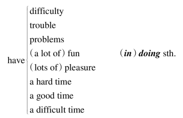

[toc]

&emsp;
&emsp; 
# 0. 综述
&emsp;&emsp; 动名词的构成即是在动词后面加`-ing`， 构成`doing`的形式。 它在意义上相当于一个名词， 但同时又保留有动词的特征。 说它相当于一个名词， 是因为它在句中主要是充当名词可以充当的成分， 比如作主语、 宾语或表语， 此外还可以作定语。 说它保留有动词的特征， 是因为它可以有自己的宾语， 有自己的时态和语态变化， 并且也可保留自己的逻辑主语。 

&emsp;
&emsp; 
# 1 动名词的作用（一） ： 作主语
&emsp;&emsp; 与不定式作主语不同， 动名词作主语一般直接放在句首， 谓语动词用单数。 只有在某些特定的句型中才会出现把动名词放在句末作主语， 句首用it形式主语来指代的情况， 这类似于不定式作主语的结构。 在这一节里我们将分别对这两种情况进行讨论。
## 1.1 动名词位于`句首`作主语
动名词作主语一般直接放在句首， 谓语动词用单数。 请看例句：
> 1 **Hating people** is like burning down your own house to get rid of a rat.
> 憎恨别人， 就好像为了赶走一只老鼠而把自己的房子烧掉。
> 
这个句子的主语是`hating people`这个动名词短语， 而不是`people`这个名词， 所以谓语动词要用单数形式的`is`。

&emsp;&emsp; 讲到生别人的气， 有一次笔者和一个外国朋友在网上聊天时， 他说的一句话很有哲理， 给笔者的印象非常深刻。 他说：
> 2 **Getting mad at others** means other people are getting control of my emotions!
> 如果我生别人的气， 就意味着我让别人控制了自己的情绪！
> 
所以， 下次当你要对某人生气的时候， 你就在心里问问自己： 我宁愿让别人来控制我的情绪吗？ 如果不愿意， 那我为什么还如此“惦念”他呢？ 因此要赶快把那个让你憎恨的人从你的大脑里赶走（take him/her out of your mind） ， 不要让他占据你的心灵， 把他忘掉（Forget） ！ 如果实在不能忘掉， 那怎么办？ 那就努力做到第二个“F”——Forgive（宽容， 宽恕） 。 戴尔·卡耐基（Dale Carnegie） 说： 
> Instead of getting mad at people, let's try to understand them. Let's try to figure out why they do what they do. That's a lot more profitable and intriguing than criticism; and it breeds sympathy, tolerance and kindness. "To know all is to forgive all."
> 与其对别人生气， 不如我们尽力去理解他们， 搞清楚他们为什么这么做。 这远比批评他们要有利和有意思得多， 可以让我们去同情、 容忍和仁慈， 因为“理解一切， 就能宽容一切”。 
> 
所以， 当自己要生气、 发怒的时候， 我们不妨记住这两个“F”——Forget和Forgive， 让自己学会忘记， 不要让愤怒的坏情绪占据自己的心灵， 哪怕只是一分钟！ 同时让自己学会宽容。 真正做到“我的快乐， 我做主”！

&emsp;&emsp; 近几年， 中国在环境污染、 气候变化等问题上， 经常遭到西方国家的指责。 下面这句话是英国一个非政府组织代表批评西方政府在气候变化问题上对中国的态度。 联合国气候变化大会2007年12月3日在印尼的巴厘岛开幕， 就在会议开幕的当天， 这个组织发布的报告认为， 在气候变化问题上指责中国实际上是在转移话题， 分散人们对于西方自身责任的注意力。 关于这个问题， 请看下面的例句：
> 3 &emsp;&emsp; **Using the mass media to point the finger at China** will not help get the global deal we need to avert climate change disaster. Not only have rich countries historically caused the problem, but they are also importing emissions from the developing world.
> &emsp;&emsp; 利用大众传媒对中国横加指责， 无助于达成我们制止气候变化灾难所需的全球协议。 富国不仅在历史上是这一问题的始作俑者， 它们现在也正在从发展中国家进口排放权。
> 
下面这句话道出了外语学习的关键：
> 4 
> A: I studied French in high school but I never really learned it until I spent the summer in Paris.
> B: **Really using a language** makes all the difference, doesn't it?
> A： 我是在高中时学习法语的， 但直到上次去巴黎过了一个夏天我才觉得那才是真正的学习法语。
> B： 真正去使用一门外语感觉完全不一样， 对吧？
> 
这个句子的主语是`really using a language`这个动名词短语， 这是动名词具有名词特征的一个体现。 另外， `using`前面带有一个修饰语， 即副词`really`， 这又是动名词具有动词特征的一个体现， 即动词可以被副词修饰。
&emsp;&emsp; 其实， 学习外语的关键在于“运用”， 这里的“运用”不仅仅是用它来阅读， 更重要的是用它来进行口语及书面的交流， 否则学了也会很快忘记或荒废， 这就叫“Use it or lose it!”

我们再来看其他例句：
> 5 **Being deeply loved by someone** gives you strength; while loving someone deeply gives you courage.
> 被爱给你力量； 爱人给你勇气。
> 
这里第一个句子是动名词的被动结构作主语， 副词deeply修饰动名词， 同样是动名词具有动词特征的体现。

> 6 &emsp;&emsp;  No man is an isolated island. Your circle of friends is there to give you moral support. **Spending time and engaging in worthwhile activities with them** could give you a very satisfying feeling. Nothing feels better than having group support.
> &emsp;&emsp; 没有人是一座孤岛， 因为你有自己的朋友圈子， 这会给你精神上的支持。 和朋友待在一起， 参加一些有意义的活动， 这可以给你一种非常满意的感觉。 没有什么比能获得团体的支持让你感觉更好的了。
> 
此外， 在各类考试中经常会出现动名词作主语的考题， 比如下面这两道TOEFL题：
> 7 _____ by transferring the blame to others is often called scapegoating. (TOEFL)
> A. The eliminated problems
> B. Eliminating problems
> C. Eliminate problems
> D. Problems are eliminated
> 
> 通过把罪责推卸到别人身上， 以此来逃避问题， 这叫做找替罪羊。
> 正确答案 B。
> 
谓语动词是单数的is， 选项A是复数的主语， 因此排除。 C和D都有谓语， 是一个完整的句子， 但我们这里只缺主语。 所以B正确， 即动名词短语作主语。

> 8 _____ to inanimate objects, such as machines, is a form of animism. (TOEFL)
> A. When attributing emotion
> B. Attributing emotion
> C. Emotion is attributed
> D. If emotion is attributed
> 
> 认为没有生命的物体（如机器） 也具有感情， 这是一种“万物有灵论”的观点
> 正确答案 B。
> 
谓语动词是单数的is， 句子缺少主语， 因此空格处要填入一个名词性短语来充当主语。 选项A有连词when， C是一个完整的句子， D有连词if， 所以均不正确。 因此B正确， 即动名词短语作主语。

## 1.2 动名词位于`句末`作主语
&emsp;&emsp; 上面刚刚讲过， 作主语的动名词通常直接放在句首， 这样的位置关系与习惯于放在句末作主语的不定式不同。 不过， 有时候我们也可以把动名词放在句末作主语， 但**这一般仅限于某些特定的句型**。 英文中有几个动名词后置作主语的固定句型， 现列举如下：
### 一、 句型一： it is no `good/use` doing sth.
&emsp;&emsp; 表示 “**干某事没有用”**。 这里的it只是形式主语， 真正的主语是句末的动名词短语doing sth.。 其中， no good可替换为any/some good, any/some/no use以及a waste of time等。 其实， 这里的doing的前面省去了介词in。 请看例句：
> 1 It's no use **crying over spilt milk**.
> 后悔没有用。
> 
本句的字面意思是“牛奶被打翻了， 再去哭是没有用的”， 就相当于汉语说的“覆水难收（Spilt water cannot be gathered up again.） ”或“后悔没用”。

再看下面这个笑话：
> 2 When Helen was visiting an old aunt she had not seen for years, she saw a parrot on a perch in the cornerof the room.
> "Oh, what a lovely parrot you've got. Hello, Polly. Who's a pretty boy, then. Hello, Polly."
> "**It's no use talking to** that parrot."
> "Why?" joked Helen. "Is it tongue-tied（结巴的） ?"
> "No," said the aunt. "It's stuffed!"
> 
> 海伦去看望一个多年没见的姑姑， 在姑姑家的墙角， 她看到一只鹦鹉站在栖木上。
> “哦， 您这只鹦鹉多么可爱呀！ 你好， 波利。 真是个漂亮的孩子。 你好， 波利。 ”
> “跟那个鹦鹉说话没用。 ”
> “为什么？ ”海伦打趣地说， “它结巴了？ ”
> “不是。 ”姑姑回答， “它是一只毛绒玩具！ ”
> 

> 3 **Is it any good trying to** explain?
> 努力解释有用吗？
> 
> 4 **It's not much use my buying** salmon if you don't like fish.
> 如果你不喜欢吃鱼的话， 那么我就没必要买鲑鱼了。
> 
> 5 It's simply a waste of time and money seeing that movie.
> 看那个电影纯粹是浪费时间和金钱。
> 

再来看下面这两个笑话：
> 6 
> Bobby: You're impossible, Claire. **It's a waste of time talking** to you. You're so stupid.
> Dad: Stop upsetting your little sister. Say you're sorry.
> Bobby: OK. Claire?
> Claire: What?
> Bobby: I'm sorry you're stupid!
> 
> 鲍比： 真拿你没办法， 克莱尔。 跟你说话简直是浪费时间。 你太笨了！
> 父亲： 不许你这么挖苦你妹妹。 向她说对不起。
> 鲍比： 好吧。 克莱尔？
> 克莱尔： 什么事？
> 鲍比： 我很遗憾你竟然这么笨！
> 
我们看到， 这里的`it's a waste of time`后面接有动名词`talking`。 这个笑话通过`sorry`的双关意思来制造幽默： sorry既可以表示“向某人道歉”， 也可以表示某人因为某事而感到遗憾或失望。 所以， `say you're sorry`是父亲要求`Bobby`向妹妹道歉， 而`Bobby`说`I'm sorry you're stupid!`则是表示“我很遗憾你竟然这么笨！ ”
 
> 7 
> A: For goodness sake! You are SO stupid. **It's a waste of time trying to** explain it to you. You're the closest thing to a complete idiot!
> B: Oh! So you want me to move away from you, do you?
> 
> A： 看在老天的份上！ 你太笨了。 跟你解释那件事情简直就是浪费时间。 你几乎是一个十足的白痴！
> B： 哦， 那么你是想让我离你远点了， 对吗？
> 
我们看到， 这里的it's a waste of time后面接有动名词trying。 理解这个笑话的关键在于the closest thing to a complete idiot。 A的意思是“你几乎是一个十足的白痴”， 即把closest理解成“接近， 几乎是”； B则是按字面意思理解成“你现在是离一个大笨蛋最近的人”， 这就是说A是complete idiot， 所以B问道： “你是想让我离你远点？ ”

### 二、 句型二： there is no `point/use/good`（in） doing sth.
&emsp;&emsp; 表示 **“干某事没有必要/没有意义”， “干某事没有用”**。 请看例句：
> 8 **There is no point in my going out** to date someone. I might really like if I met him at the time, but who, right now, has no chance of being anything to me but a transitional man.
> 现在让我出去和人约会没有用。 如果我碰上了意中人， 我自然会爱上他的。 可是在现在这个时候我跟谁也不会有结果的， 除非是为了解解闷。
> 
> 9 **There is no use your arguing** with him.
> 你没必要和他争论。
> 
再看下面这两个笑话：
> 10 
> A boy fell from a tree and hit his head. In the ambulance, the doctor asked him his name.
> "What's your name, young man?"
> "Why?" asked the boy.
> "So that we can tell your family."
> "But **there's no point in doing that**. They already know my name!"
> 
> 一个男孩从树上掉下来摔破了头。 在救护车上， 医生问他的名字。
> “你叫什么名字， 年轻人？ ”
> “为什么问这个？ ”男孩问道。
> “这样我们就能通知你的家人了。 ”
> “没必要， 他们都知道我叫什么名字！ ”
> 
> 
> 11 
> A giant American car sped into a sleepy English village. The driver rolled down his window and shouted to a villager.
> "Tell me. Am I on the right road to William Shakespeare's house?"
> "Yes, but **there's little use in hurrying** to get there."
> "Why?"
> "He's dead! He died years ago."
> 
> 一辆美国的大汽车开进了一座宁静的英国村庄， 司机摇下车窗冲着一个村民大喊。
> “告诉我， 我现在是在去威廉·莎士比亚的房子的路上吗？ ”
> “没错， 不过不必这么匆匆忙忙地赶过去。 ”
> “为什么？ ”
> “他已经死了！ 他很多年以前就死了。 ”
> 

### 三、 句型三： there is no doing sth.
&emsp;&emsp; 意思相当于`it's impossible to do sth.`或`we can't do sth.`， 表示 **“不可能做某事”**。 请看例句：
> 12 **There is no telling** what will happen tomorrow.
> 谁也无法预知明天会发生什么。
> 
> 13 **There's no knowing** the future.
> = It's impossible to know the future.
> = We can't know the future.
> 谁也无法预知未来。
> 
此外还有： 
> there is no denying the fact that...， 
> there is no gainsaying the fact that...， 
> 
意思都是“毋庸置疑”。

&emsp;
## 1.3 思维总结
&emsp;&emsp; 本节介绍了动名词作主语的两种结构： 一是放在句首， 此时的谓语要用单数形式； 二是放在句末， 此时只适用于特定的句型结构中。 读者需要记住这些句型结构。

&emsp;
&emsp;
# 2 动名词的作用（二） ： 作宾语
&emsp;&emsp; 动名词主要就是放在某些特定的动词后面或者介词后面作宾语， 此外还可以用在某些特定的句型结构中。 本节就从这三方面来讨论动名词作宾语的用法。
## 2.1 在动词后面作宾语
&emsp;&emsp; 这些动词（短语） 后面一般要用动名词作宾语： 
> admit, advise, anticipate, appreciate, avoid, consider, contemplate delay, deny, detest, discuss, dislike, encourage, endure, enjoy, escape, excuse, fancy, favor, feel like, finish, forbid, forgive, give up, can't help, imagine, involve, leave off, mention, mind, miss, overlook, permit, postpone, practice, prohibit, put off, resent, resist, risk, can't stand, suggest, tolerate, understand等。
> 
请看例句：
> 1 Many of the things we do **involve taking** some risk in order to achieve a satisfactory result.
> 要想取得满意的结果， 我们必须冒一些风险。
> 
动词`involve`后面需要接动名词， 所以用`taking`而不说`to take`。

> 2 Putting in a new window will **involve cutting** away part of the roof.
> 要想安装一扇新窗户就必须把房顶打掉一块。
> 
动词`involve`后面需要接动名词， 所以用`cutting`而不说`to cut`。

> 3 Being a bad-tempered man, he would not **tolerate having** his lectures interrupted.
> 因为脾气不好， 所以他不能容忍自己讲课被打断。
> 
动词`tolerate`后面需要接动名词， 所以用`having`而不说`to have`。

> 4 Peter, who had been driving all day, **suggested stopping** at the next town.
> 彼得因为已经开了一整天的车了， 所以他建议在下一个小镇停车休息。
> 
这是2000年6月份的四级考试题。 动词suggest后面需要接动名词， 所以用stopping而不说to stop。

> 5 They are **considering buying** the house before the prices go up.
> 他们正在考虑买下这栋房子， 以防房价再上涨。
> 
这是1989年1月份的四级考试题。 动词consider后面需要接动名词， 所以用buying而不说to buy。

> 6 She was so angry that she **felt like throwing** something at him.
> 她当时是那么生气， 以至于真想找东西砸他。
> 
这是1992年6月份的四级考试题。 动词短语feel like后面需要接动名词， 所以用throwing而不说to throw。

&emsp;&emsp; 一名现年28岁的澳大利亚男子蒂姆·科普三年前突发奇想， 决定重走“成吉思汗之路”。 2004年6月， 他骑马从蒙古出发， 途经哈萨克斯坦、 俄罗斯、 乌克兰和匈牙利， 于2007年9月22日抵达匈牙利小镇乌普兹塔西泽， 行程达一万公里。 在结束自己的长途跋涉生活之后， 他说：
> 7 I can't **imagine saying** goodbye to the horses. It's become my way of life for the last three years.
> 我无法想象跟马告别。 在过去三年里， 这已经成为我的生活方式。
> 
该句的谓语imagine后面要接动名词saying， 而不能说to say。

> 8 &emsp;&emsp; Richard Doran, a professional radio host in China, remains skeptical that such shows are actually improving mutual understanding. "They still ask if we know how to use chopsticks," he says. "Can you **imagine a European television station putting** a Pakistani immigrant family on television and **asking** if they'd learned to use a knife and fork yet?"
> &emsp;&emsp; 理查德·多兰（中文名董漠涵） 在中国是一名专业的电台主持人， 他对外国人参与中国的电视节目能否真正增进中国与外界的相互了解依然持怀疑态度。 “中国的节目主持人依然会问‘你们会用筷子吗？ ’这类问题， ”他说， “你能想象一个欧洲的电视台采访一个巴基斯坦移民家庭， 然后问他们‘你们学会使用刀叉了吗？ ’这类的问题吗？ ”
> 
与上一句的imagine后面直接用动名词`saying`不同， 在该句中， 谓语动词`imagine`后面接了一个名词短语a `European television station`， 然后再接两个动名词putting和asking。 二者一起构成了动名词的复合结构`a European television station putting...and asking...`， 其中名词短语`a European television station`充当动名词的逻辑主语。 关于动名词的逻辑主语， 我们将在5.5节详细介绍。

&emsp;&emsp; 从以上这个例句我们看出， 在这类动词后面， 还可以接动名词的复合结构（详见5.5节） 。 再比如下面这句话：
> 9 I will **overlook your being** so rude to my sister this time but don't let it happen again.
> 这次你对我妹妹态度粗鲁就算了， 但下不为例。
> 
该句的谓语`overlook`后面接了物主代词`your`， 然后再接动名词`being`， 二者一起构成了动名词的复合结构`your being...`， 其中your是动名词`being`的逻辑主语。

&emsp;
## 2.2 在介词后面作宾语
&emsp;&emsp; 在介词后面不能直接用动词原形作宾语， 必须改为动名词。 不过， 对于介词to稍微有些特殊， 因为它既可以是不定式的小品词从而后面接动词原形， 也可以是介词从而后面要接动名词。 因此， 读者遇到to时， 必须搞清楚它是作为介词还是作为不定式的符号。 为了便于读者掌握， 笔者总结了常见的介词to短语， 都必须接动名词， 而不能接动词原形。 这些短语有： 
> look forward to, object to, be/get used to, prefer doing to doing, in addition to, be accustomed to do/doing, amount to doing（意味着） , take to doing（开始喜欢做） , devote...to doing/be devoted to doing, dedicate...to doing/be dedicated to doing, be averse to doing, be opposed to doing, get round to doing, the alternative/approach/solution to doing等。 
> 
请看例句：
> 1 I am **looking forward to hearing** from you.
> 我期待你的来信。
> 
> 2 I **am used to sleeping** with the lights on.
> 我习惯了开着灯睡觉。
> 
> 3 I **am accustomed to sleeping** with the lights on. 
>   I **am accustomed to sleep** with the lights on.
> 我习惯了开着灯睡觉。
> 
> 4 The students **object to increasing** their tuition.
> 学生们反对提高学费。
> 
> 5 After a long delay I finally **got round to making** inquiries into the matter.
> 拖了很长时间以后， 我才终于抽出时间来过问这件事。
> 
现在的上班族中间很流行“拼车（carpooling） ”， 于是有了下面这段话：
> 6 &emsp;&emsp; As an **alternative to using** a single-occupancy vehicle, carpooling **involves** two to five commuters **sharing** a vehicle. The more people in a carpool, the greater the savings. Depending on the arrangements made, one person can do all the driving and be reimbursed by the riders. 
> &emsp;&emsp; Carpooling can limit use of personal vehicle for daily commuting, reduce air pollution, save time by using High Occupancy Vehicle Lane and provide useable time for riders--read, sleep, work and talk. It is also a viable solution for employees who do not drive. 
> &emsp;&emsp; Carpooling can be encouraged through computerized matching of riders with similar commute patterns and preferences.
>
> &emsp;&emsp; 作为单人驾车之外的选择， 拼车是指两到五个通勤者共乘一辆车。 拼车的人越多， 省的越多。 一个人可以自始至终驾车， 而由其他乘车人付费， 就看如何安排了。
> &emsp;&emsp; 拼车可以减少用于日常通勤的私车的数量， 减少空气污染， 使用拼车专行道从而可以节省时间， 而乘车人也有了可支配的时间， 用来阅读、 睡觉、 工作和谈话。 对于不开车的员工来说， 拼车也是解决通勤问题的可行之道。
> &emsp;&emsp; 通过电脑匹配的方式， 可以让有相似通勤模式和偏好的人更容易寻找到共同的乘车人， 从而鼓励人们拼车。
> 
这里的to是介词， 后面接动名词using。 另外， involve后面接的就是上面提到过的动名词的复合结构two to five commuters sharing a vehicle， 其中two to five commuters充当动名词sharing a vehicle的逻辑主语。

> 7 Many people don't understand the difference between idle time and leisure time. Idle time **amounts to wasting** or **stealing** time; leisure time is earned. Procrastinating **amounts** to not **working**.
> 许多人不知道无聊时光和闲暇时光的区别。 无聊时光意味着浪费时间， 而闲暇时光则意味着忙碌之后的休闲， 是应该享受的。 拖延就意味着不在工作。
> 
关于这样的短语， 需要大家在平时的学习过程中注意不断地积累和总结。

&emsp;
## 2.3 在特定的句型中作宾语
&emsp;&emsp; 英语中有很多固定的句型结构是要求接动名词作宾语的， 下面我们一一列举：
### 一、 “做某事遇到了麻烦/困难”
&emsp;&emsp; 最常见的是表示“做某事遇到了麻烦/困难”， 或“做某事很开心”。 具体如下：

  

我们先来看下面这个四级考试的听力题：
> 1 
> Woman: How do you find your new apartment?
> Man: Well, it's quite nice really, although I **have a hard time getting** used **to living** in a big place.
> 
> 女： 你觉得你那新公寓怎么样？
> 男： 哦， 真的很好， 尽管我一时还没有适应住这么大的房子。
> 
我们看到， 这里的短语have a hard time后面接了getting这个动名词。 另外get used to的后面也要求接动名词， 所以用living。
&emsp;&emsp; 这里要提醒大家注意： How do you find...这个句型的含义是“你觉得……怎么样”， 是在向对方征询意见或看法的， 不要误解成“你是怎么发现……的”， 比如这句话不能理解成“你是怎么找到你的新公寓的？ ”如果要表达后者的意思， 则要用过去时， 说成“How did you find...?”

&emsp;&emsp; 再看下面这个“租房难”的例句， 这是一道TOEFL听力题：
> 2 
> A: We are **having all kinds of trouble finding** a new apartment for next year. What about you?
> B: My roommate and I decided that this year we'd stay put.
> 
> A： 我们在为明年找房子租， 遇到了各种麻烦。 你怎么样？
> B： 我和我的室友决定今年不搬家了。
> 
我们再来看下面这几个旧TOEFL听力题：
> 3 
> A: You certainly have a lot of clocks. There seems to be one in every room.
> B: My family gave them to me because I **have trouble keeping** track of the time.
> 
> A： 你有这么多钟表啊， 好像每个房间里都有一个。
> B： 这是我家里给我的， 因为我很难守时。
>
> 
> 4 
> A: I **had a hard time getting** through this novel.
> B: I know how you feel. Who can remember the names of 35 different characters.
> 
> A： 这本小说我很难再继续看下去了。
> B： 我知道你的感受， 有谁能够一下子记住里面35个不同人物的名字啊！
>
> 
> 5 
> A: I'm **having a hard time keeping** up in my biology class. I'm seriously considering hiring a tutor.
> B: A word of advice, don't make a mistake I made last semester and wait until after the midterm exam todo it.
> 
> A： 生物课我有点跟不上了， 我在认真考虑是否要请一个家教。
> B： 给你忠告， 你可别犯我上学期犯过的错误， 等到期中考试之后才去请家教。
> 

下面是一个美国教授谈到语言学习时说的一番话：
> 6 &emsp;&emsp; For a North American or European, languages such as Chinese, Korean, and Japanese have what is like pictograph or ideographic type of language. Native speakers of European languages often **have a very difficult time in learning** one of the Asian languages, as our ears are not attuned to the sounds or characters of the language. In China, I am like a child in terms of the language, and illiterate in terms of being able to read or write Chinese. If I could read and write in Chinese, I would need to recognize at least 3, 000 or more characters. Chinese also **have a hard time learning** the European languages such as English, French, Spanish, Italian, or German, because each of these languages is filled with many idioms which don't make much sense in terms of the formal language that they learn.
> &emsp;&emsp; 对于北美人或欧洲人来说， 汉语、 韩语和日语等语言就像是图画语言或表意文字。 以欧洲语言为母语的人往往会发现这些亚洲语言很难学， 因为我们的耳朵生来就不适应这些语言的发音或写法。
在中国， 在语言方面我像是一个孩子， 就汉语的读写能力而言， 我则像是文盲。 如果我希望能够具备中文的读写能力， 我则需要认识至少3, 000汉字或更多。中国人在学习欧洲的语言方面， 比如英语、 法语、 西班牙语、 意大利语或德语等， 也常常会感到困难， 因为这些语言中含有大量的成语， 而这些成语， 如果按照他们所学的正式的外语来解释， 并没有什么意思。
> 
我们看到， 这里的短语`have a very difficult time`和`have a hard time`后面都接了动名词（in）learning， 不能说to learn。

> 7 When we moved to Canada a few years ago, we **had a hard time communicating** with foreigners, so we started to read a lot of English books and magazines to improve our conversation and listening skills.
> 我们几年前刚搬到加拿大时， 和老外交流非常困难。 所以我们开始大量地阅读英语书籍和杂志来提高我们的口语和听力技巧。
> 
> 8 They turn the volume up full blast（以最大的音量） and begin to party. The music is so loud that we **have a hard time carrying** on a conversation without raising our voices.
> 他们把音量开到最大， 开始举行聚会。 音乐声音太大了， 如果我们不提高嗓门就很难继续谈话了。
> 
下面这句话说出了要勇于面对变化、 保持乐观的道理：
> 9 I have learned, however, that change always seems more difficult at the outset, and if I work hard at remaining positive and view changes as opportunities to grow, I **have an easier time dealing** with them.
> 不过， 我已经明白， 变化一开始似乎总是更困难。 但是， 如果我努力保持乐观积极的心态， 并且把变化当作是成长的机会， 我就会比较容易应对变化。
> 

但要注意下列短语的后面要接不定式： `take the trouble to do sth.`, `trouble to do sth.`, `have (no) time to do sth.`。 比如：
> 10 I worked so late in the office last night that I hardly **had time to catch** the last bus.
> 我昨晚加班到很晚， 几乎都来不及赶末班车了。
> 
这是1999年的考研题。 这里不说had time catching...*。

### 二、 表示“情不自禁”， “不得不”的短语
这些短语包括： 
> can't help doing, can't resist doing, can't keep from doing, can't hold back from doing和can't keep back from doing等等。 
> 
请看例句：
> 11 **No** one **can help liking** Tom; he is such a cute boy.
> 没有人不喜欢汤姆， 他实在太可爱了。
> 
不过要注意下面的短语要接动词原形， 但它们的意思不变： `can't help but do`, `can't but do`和`can't choose but do`。

### 三、 其他句型结构
&emsp;&emsp; 此外， 还有其他一些短语， 比如`be worth doing`,表示“值得做”。 注意这些短语要用主动形式， 但表示被动的意思。
> 12 The book is **worth reading**.
> 这本书值得一读。
> 
还要注意这个句型结构：` be worthy of being done/to be done`。 比如上面这个例句可以改写为：
> The book is worthy **of being read**.
> The book is worthy **to be read**.
> 
再比如`be busy doing`这个句型结构。 请看例句：
> 13 The money will be used to keep a space vehicle on the moon busy sending back to the earth photographs and other information about the surface of the moon.
> 这些钱将被用来使月球上的航空飞行器持续不停地把有关月球表面的图片和其他信息发回到地球。
> 
关于这些接动名词作宾语的句型或短语， 需要读者在日常的学习过程中注意积累。

## 思维总结
&emsp;&emsp; 本节讨论了动名词作宾语的情况， 主要内容包括三个方面： 一是在动词后面作宾语， 此时要记住有哪些动词要接不定式； 二是在介词后面作宾语， 此时尤其要分辨to是作为介词还是不定式符号； 三是在特定的句型中作宾语。 这三点都非常重要， 要求读者全部掌握。 本节是动名词的重点内容之一。

&emsp;
&emsp; 
# 3 动名词的作用（三） ： 作表语
&emsp;&emsp; 动名词用作表语， 主要就是直接放在`be`动词后边， 以补充说明句子主语的具体内容。 
请看例句：
> 1 His hobby is **collecting stamps**.
> 他的爱好是集邮。
> 
这里的`collecting stamps`是用来说明`hobby`的内容， 所以`collecting stamps`是动名词短语。

> 2 Reading is **permitting** a man to talk a long time, and **refusing** you the right to answer.
> 阅读， 就如同允许作者一个人长时间地说， 而你却无权回应。
> 
这里的`permitting`和`refusing`都是动名词， 直接放在`is`后面作表语。

再比如下面这个对话涉及东西方文化的差异：
> 3 
> Nick: Another odd thing I see would be **girls holding hands**. If two girls their age did that in Britain we would think they were gay!
> Lucy: It's just because girls get very close to each other and treat them as sisters.
> Nick: I think that's very touching but I'm glad the boys don't do that!
> 
> 尼克： 我发现， 还有一件奇怪的事情就是女孩子们手拉手。 这要是在英国， 我们会认为她们是同性恋！
> 露茜： 这不过是因为女孩子们的感情很好， 把彼此当作姐妹罢了。
> 尼克： 太吓人了。 好在男孩子们不是这样！
> 
该句中的`girls holding hands`是一个动名词的复合结构， 放在be后面作表语。

&emsp;
&emsp; 
# 4 动名词的作用（四） ： 作定语
&emsp;&emsp; 动名词用作定语， 主要就是放在被修饰的名词前面， 一般表示所修饰名词的用途。 
请看下面的例子：
> 1 a sleeping car
> 小卧车
> 
> 2 a reading room
> 阅览室
> 
> 3 a swimming pool
> 游泳池
> 
在英语中， 动名词作定语的情况比较少见， 远没有现在分词作定语常见。

&emsp;
&emsp; 
# 5 动名词的逻辑主语
&emsp;&emsp; 同不定式类似， 动名词也是动词的一种变化形式。 既然是动词就应该有动作的执行者， 即主语。 而句子的主语和动名词的动作执行者并不总是统一的， 有时是一样的， 有时不一样， 所以称之为逻辑主语， 以区别于句子的主语。 动名词与其逻辑主语一起构成动名词的复合结构。 在本节中， 我们先讨论动名词复合结构的构成， 然后讨论它的用法。

## 5.1 动名词复合结构的构成
&emsp;&emsp; 物主代词（如his, my, your等） 或所有格名词（如Mary's, Tom's等） 与动名词连用， 即构成动名词的复合结构（如`his doing`, `Mary's doing`等） ， 用来引出动名词的逻辑主语。 当句子的主语并不是动名词动作的执行者时， 我们往往需要给出动名词自己的动作发出者， 即动名词的逻辑主语。 请比较：
> 1 
> 1） Clint insisted on reading the letter.
> 2） Clint insisted on **my reading** the letter.
> 
> 1） 克林特坚持要看信。
> 2） 克林特坚持要我看信。
> 
&emsp;&emsp; 在例句1） 中， 没有使用动名词的复合结构， 此时， 句子的主语Clint同时充当动名词reading的逻辑主语， 即“Clint看了信”。 
&emsp;&emsp; 在例句2） 中， 采用了动名词的复合结构， 此时， 句子的主语Clint并非动名词reading的逻辑主语， 而my才是reading的逻辑主语， 即“我看了信”。

> 2 
> 1） I object to making private calls on this phone.
> 2） I object to **his making** private calls on this phone.
> 
> 1） 我不赞成用这部电话打私人电话。
> 2） 我不赞成他用这部电话打私人电话。
> 
&emsp;&emsp; 在例句1） 中， 没有使用动名词的复合结构， 此时， 动名词making的逻辑主语并不明确，可以是指某一类人。 在
&emsp;&emsp; 例句2） 中， 采用了动名词的复合结构， 此时， 动名词making的逻辑主语非常明确，即“他”。

&emsp;&emsp; 我们看到， 在以上两个例句中， 动名词的复合结构是由物主代词（如my和his） 后面接一个动名词构成的。 动名词的复合结构也可以由名词所有格接动名词构成。 请比较：
> 3 
> 1） Would you mind telling us the whole story?
> 2） Would you mind **Tom's telling** us the whole story?
> 
> 1） 你是否愿意把事情的经过告诉我们？
> 2） 你是否愿意让汤姆把事情的经过告诉我们？
> 
&emsp;&emsp; 在例句1） 中， 没有使用动名词的复合结构， 此时， 句子的主语you同时充当动名词telling的逻辑主语， 即“你来讲述”。 
&emsp;&emsp; 在例句2） 中， 采用了动名词的复合结构， 此时， 句子的主语you并非动名词telling的逻辑主语， 而Tom才是telling的逻辑主语， 即“汤姆来讲述”， 相当于说Would you mind if Tom tells us the whole story？

> 4 
> 1） He disliked working late.
> 2） He disliked **his wife's working** late.
> 
> 1） 他不喜欢加班。
> 2） 他不喜欢他妻子加班。
> 
&emsp;&emsp; 在例句1） 中， 没有使用动名词的复合结构， 此时， 句子的主语he同时充当动名词working的逻辑主语， 即“他加班”。 
&emsp;&emsp; 在例句2） 中， 采用了动名词的复合结构， 此时， 句子的主语he并非动名词working的逻辑主语， 而his wife才是working的逻辑主语， 即“他妻子加班”。

再看其他例句：
> 5 The eye of an animal is quite easy to see. How then can the eyes be prevented from spoiling **the animal's blending** with its environment? One solution would be for the animal to keep its eyes closed when danger threatens.
> 动物的眼睛很容易被发现， 因此， 如何防止眼睛不破坏动物与其周围环境的融合呢？ 有一个方法是， 当危险来临时， 动物们可以把自己的眼睛闭起来。
> 
该句中的动名词的复合结构`the animal's blending`是由名词所有格the animal's与动名词blending构成的。

&emsp;&emsp; 值得注意的是， 在某些情况下， 动名词的逻辑主语可以不是物主代词或名词所有格， 而是直接采用宾格代词（如me和him） 或普通格名词（如Tom和his wife） 。 请看下面例句：
> 6 That yearning for study was still there. I came here with no thought of **it being** an unusual thing at all.
> 我仍有强烈的学习的愿望， 到这来我一点也不觉得有什么反常的。
> 
这句话是由时年95岁的美国老太太诺拉·奥克斯说的。 她于2007年5月12日从美国堪萨斯州海斯堡州立大学毕业， 成为全球最年长的大学毕业生。 该句中的动名词的复合结构`it being`是由宾格代词it与动名词being构成的。 当然这里我们也可以说`its being`。

> 7 &emsp;&emsp; Romantic love is very much a part of American culture. Movies, TV shows and books in America all picture **people falling in love**. Americans know no romance is perfect, but still they try to find the ideal person.
> &emsp;&emsp; 浪漫爱情是美国文化的重要组成部分。 美国的电影、 电视和书籍都描绘人们如何坠入爱河。 美国人知道没有哪段罗曼史是完美的， 但他们还是努力去寻找自己理想的意中人。
> 
该句中的动名词的复合结构`people falling in love`是由普通格名词`people`与动名词`falling`构成。 当然这里我们也可以说`people's falling in love`。

> 8 &emsp;&emsp; Physically and mentally women are by far the superior to men. The old chestnut about **women being more emotional than men** has been forever destroyed by the facts of two great wars.
> &emsp;&emsp; 女性在身体上和精神上都大大优越于男性。 两次世界大战的事实永远粉碎了女人比男人更多愁善感的陈词滥调。
> 
该句中的动名词的复合结构`women being more emotional than men`是由普通格名词`women`与动名词`being`构成的。 当然这里我们也可以说`women's being more emotional than men`。

&emsp;&emsp; 看到这里， 读者也许不禁要问： 如何判断该用所有格还是普通格呢？ 对这个问题， 笔者将在下面的小节里给出答案。

&emsp;
## 5.2 所有格还是普通格？
&emsp;&emsp; 在应用动名词的复合结构时， 什么时候用普通格， 什么时候用所有格， 一般遵循下面的规定：
### 一、 若动名词的复合结构在句中作主语， 最好用所有格形式
请看例句：
> 1 **Tom's refusing** to accept the invitation upset me.
> 汤姆拒绝接受邀请， 这让我很恼火。
> 
该句中的动名词的复合结构`Tom's refusing to accept the invitation`在句中作主语， 因而不宜用普通格名词`Tom refusing...`。

> 2 **His refusing** to accept the invitation upset me.
> 他拒绝接受邀请， 这让我很恼火。
> 
该句中的动名词的复合结构`his refusing to accept the invitation`在句中作主语， 因而不宜用宾格代词`Him refusing...`。

### 二、 动名词的复合结构在句中作宾语时， 用普通格或所有格均可
请看例句：
> 3 Do you mind **me/my making** a suggestion?
> 我提个建议， 你介意吗？
> 
> 4 I am annoyed about **John/John's forgetting** to pay.
> 约翰忘记付钱， 这让我很生气。
> 
> 5 I remember **him once offering** to help us if we ever got into trouble.
> 我记得他曾经承诺， 一旦我们遇到麻烦他就会来帮助我们。
> 

> 6 The latest revolution isn't simply a matter of **gentlemen reading other gentlemen's e-mail**.
> 最近的这次革命不只是一些人偷看另一些人的电子邮件的问题。
> 
这里的`gentlemen reading other gentlemen's e-mail`即是一个动名词的复合结构， 其中动名词的逻辑主语用了普通格名词`gentlemen`， 当然也可以用所有格`gentlemen's`。
 
> 7 All these conditions tend to increase the probability of **a child committing a criminal act**.
> 所有这些条件往往会增加青少年犯罪的可能性。
> 
这里的`a child committing a criminal act`即是一个动名词的复合结构， 其中动名词的逻辑主语用了普通格名词`a child`， 当然也可以用所有格`a child's`。

> 8 &emsp;&emsp; If you are part of the group which you are addressing, you will be in a position to know the experiences and problems which are common to all of you and it'll be appropriate for you to make a passing remark about the inedible canteen food or the chairman's notorious bad taste in ties. With other audiences you mustn't attempt to cut in with humor as they will resent **an outsider making** disparaging remarks about their canteen or their chairman.
> &emsp;&emsp; 如果你是你谈话对象的一部分， 你就能够了解你们所共有的经历和问题， 就可以对餐厅那不可入口的食物和老总在选择领带方面糟糕的品位评头论足。 而对于其他听众， 你就不能试图插入这种幽默， 因为他们不喜欢外人对他们的餐厅或老总有如此微词。
> 
因为resent的后面要求接动名词作宾语， 所以这里的`an outsider making disparaging remarks`即是一个动名词的复合结构， 其中动名词的逻辑主语用了普通格名词`an outsider`， 当然也可以用所有格`an outsider's`。

### 三、 当动名词的逻辑主语是无生命的“物”而不是“人”时， 最好用普通格
请看例句：
> 9 The noise of **the desks being opened and closed** can be heard out in the street.
> 课桌开关的声音在大街上都能听得到。
> 
这里的`the desks being opened and close`d即是一个动名词的复合结构， 其中动名词的逻辑主语用了普通格名词`the desks`， 因为是表示“物”。

> 10 There is a necessity for **this type of houses being built**.
> 有必要修建这种类型的房屋。
> 
这里的`this type of houses being built`即是一个动名词的复合结构， 其中动名词的逻辑主语用了普通格名词`this type of houses`， 因为是表示“物”。

> 11 In the event of `the project not being a success`, the investors stand to lose up to $30 million.
> 万一这个项目投资失败， 投资者将会损失三千万美元。
> 
这里的`the project not being a success`即是一个动名词的复合结构， 其中动名词的逻辑主语用了普通格名词`the project`， 因为是表示“物”。

> 12 **The young leading the young**, is like the blind leading the blind; "They will both fall into the ditch." The only sure guide is he who has often gone the road which you want to go. Let me be that guide, who have gone all roads, and who can consequently point out to you the best.
> 青年为青年引路， 如同盲人为盲人引路； “两人会一同掉进沟里。 ”唯一可靠的向导是这样的人： 他常走的路正是你想走的路。 且让我当这样一位向导吧， 我走过各种各样的路， 所以能够为你指明门路。
> 
这里的`the young leading the young`即是一个动名词的复合结构， 其中动名词的逻辑主语是the young， 表示“年轻人”。 虽然是表示“人”， 但由于是形容词， 而形容词是没有所有格形式的， 所以不说the young's。

### 四、 当动名词的逻辑主语是不定代词（如someone, anyone, everyone等） 时， 最好用普通格
请看例句：
> 13 He was awakened by **someone knocking** on the door.
> 有人敲门， 把他吵醒了。
> 

### 五、 当动名词的逻辑主语由较长的一组词构成时， 最好用普通格
请看例句：
> 14 There is no point **any one of us arguing** with him.
> 我们谁与他争论都没有用。
> 
这里的`any one of us arguing`即是一个动名词的复合结构， 其中动名词的逻辑主语`any one of us`是一个短语， 不便用所有格代词。

> 15 I've always had in my mind a dream of **my father, mother and I living** together.
> 我一直有一个梦想， 我的父亲、 母亲和我生活在一起。
> 
这里的`my father, mother and I living together`即是一个动名词的复合结构， 其中动名词的逻辑主语`my father, mother and I`是一个名词短语， 不便用所有格代词。

> 16 Do you remember **John and his father coming** to see us last Christmas?
> 你还记得约翰和他父亲去年圣诞节来看望我们吗？
> 
这里的`John and his father coming to see us last Christmas`即是一个动名词的复合结构， 其中动名词的逻辑主语`John and his father`是一个名词短语， 不宜用所有格。

再比如我们在2.1小节讨论过的这个句子：
> 17 Richard Doran, a professional radio host in China, remains skeptical that such shows are actually improving mutual understanding. "They still ask if we know how to use chopsticks," he says. "Can you **imagine a European television station putting** a Pakistani immigrant family on television and **asking** if they'd learned to use a knife and fork yet?"
> 理查德·多兰在中国是一名专业的电台主持人， 他对外国人参与中国的电视节目能否真正增进中国与外界的相互了解依然持怀疑态度。 “中国的节目主持人依然会问‘你们会用筷子吗？ ’这类问题， ”他说， “你能想象一个欧洲的电视台采访一个巴基斯坦移民家庭， 然后问他们‘你们学会使用刀叉了吗？ ’这类的问题吗？ ”
> 
这里的`a European television station putting...`即是一个动名词的复合结构， 其中动名词的逻辑主语`a European television station`是一个短语， 不宜用所有格。

再比如我们在5.2.2小节讨论过的这个句子：
> 18 &emsp;&emsp; As an alternative to using a single-occupancy vehicle, carpooling involves **two to five commuters sharing** a vehicle. The more people in a carpool, the greater the savings. Depending on the arrangements made, one person can do all the driving and be reimbursed by the riders.
> &emsp;&emsp; Carpooling can limit use of personal vehicle for daily commuting, reduce air pollution, save time by using High Occupancy Vehicle Lane and provide useable time for riders--read, sleep, work and talk. It is also a viable solution for employees who do not drive.
> &emsp;&emsp; Carpooling can be encouraged through computerized matching of riders with similar commute patterns and preferences.
> &emsp;&emsp; 作为单人驾车之外的选择， 拼车是指两到五个通勤者共乘一辆车。 拼车的人越多， 省的越多。 一个人可以自始至终驾车， 而由其他乘车人付费， 就看如何安排了。
> &emsp;&emsp; 拼车可以减少用于日常通勤的私车的数量， 减少空气污染， 使用拼车专行道从而可以节省时间， 而乘车人也有了可支配的时间， 用来阅读、 睡觉、 工作和谈话。 对于不开车的员工来说， 拼车也是解决通勤问题的可行之道。
> &emsp;&emsp; 通过电脑匹配的方式， 可以让有相似通勤模式和偏好的人更容易寻找到共同的乘车人， 从而鼓励人们拼车。
> 
这里的two to five commuters sharing a vehicle即是一个动名词的复合结构， 其中动名词的逻辑主语two to five commuters是一个短语， 不便用所有格。

在以上五点内容中， 前两点是与动名词的复合结构在句中所充当的成分有关， 后三点则是与动名词的逻辑主语本身的构成有关。

&emsp;
## 5.3 动名词复合结构的用法
&emsp;&emsp; 这种结构常在句中作主语或宾语。 请看例句：
### 一、 用作主语
> 1 **Tom's coming** home at last was a great consolation.
> 2 &emsp;&emsp; **The young leading the young**, is like the blind leading the blind; "They will both fall into the ditch." The only sure guide is he who has often gone the road which you want to go. Let me be that guide, who have gone all roads, and who can consequently point out to you the best.
> 

### 二、 用作动词的宾语
> 3 Do you mind **my making** a suggestion?
> 
> 4 Would you mind **Tom's telling** us the whole story?
> 
> 5 &emsp;&emsp; As an alternative to using a single-occupancy vehicle, carpooling involves **two to five commuters sharing** a vehicle. The more people in a carpool, the greater the savings. Depending on the arrangements made, one person can do all the driving and be reimbursed by the riders.
> 
> 6 &emsp;&emsp; Can you imagine **a European television station putting** a Pakistani immigrant family on television and **asking** if they'd learned to use a knife and fork yet?

### 三、 用作介词的宾语
> 7 Our discussion of earthquakes would be incomplete if we didn't raise the possibility of **their being caused** by external forces.
> 
> 8 Clint insisted on **my reading** the letter.
> 
> 9 What are the chances of **a sleepwalker's committing** a murder or doing something else extraordinary in his sleep?
> 
> 10 When I was a child, I would take a flashlight to bed with me so that I could read comic books without **my parents' knowing** about it.
> 

&emsp;
&emsp;
# 6 动名词的时态和语态（一） ： 被动式（being done）
## 6.1 动名词的时态和语态概述
&emsp;&emsp; 动名词作为一种动词的变化形式， 具有动词的一般特征， 即有时态和语态的变化。 英文中把动作的完成程度分为四种， 即有四种不同的体态（aspect） ： 一般式、 进行式、 完成式和完成进行式。 但不同于我们在关于不定式的章节讨论过的不定式具备的这四种体态， 动名词没有这么多体态， 只有两种： 一般式和完成式。 另外， 动名词同样还有语态方面的变化。 因此， 动名词的时态和语态的构成如下（以write为例） ：
| 四种体态   | 主动           | 被动                |
| ---------- | -------------- | ------------------- |
| 一般式     | writing        | being written       |
| 完成式     | having written | having been written |
| 进行式     | 没有           | 没有                |
| 完成进行式 | 没有           | 没有                |
&emsp;&emsp; 从以上表格我们看到， 动名词可能有四种不同的结构形式， 我们常说的doing其实是动名词的一般主动式， 这种形式是最常见的。 本节将讨论动名词的一般被动式（being done） ， 在5.7节讨论完成主动式（having done） 和完成被动式（having been done） 。
&emsp;&emsp; 搞清楚动名词的各种构成形式之后， 接下来更重要的是要搞清楚每种形式都能表达何种意义。 本节主要讨论动名词的被动语态。

&emsp;
## 6.2 动名词的被动式
&emsp;&emsp; 一般来说， 当动名词所修饰的名词或代词在意义上是充当动名词动作的承受者， 或者说是作动名词的逻辑宾语时， 动名词要用被动形式。 请看例句：
> 1 He narrowly escaped **being run over**.
> 他差一点就被车轧着了。
> 
该句中的动名词`being run over`修饰主语`he`， 二者存在被动关系， 即表示“他被车子轧”， 所以动名词要用被动结构。

&emsp;&emsp; 英国著名作家奥斯卡·王尔德（Oscar Wilde） 说过这样一句话：
> 2 There is only one thing in the world worse than **being tal**ked about, and that is not **being talked** about.
> 世界上比被人议论更糟糕的一件事情就是根本没有人去议论。
> 
该句中的动名词`being talked about`修饰名词`one thin`g， 二者是被动关系， 所以动名词要用被动结构。

请比较：
> 3 
> 1） I still remember **being taken** to the zoo for the first time.
> 2） I remember my **parents' taking me** to the zoo for the first time.
> 
> 1） 我还记得第一次被带到动物园去的情景。
> 2） 我还记得父母第一次带我去动物园的情景。
> 
&emsp;&emsp; 在例句1） 中， 动名词being taken修饰主语I， 二者存在被动关系， 即表示“我被带去动物园”， 所以动名词要用被动结构。 
&emsp;&emsp; 在例句2） 中， 采用了动名词的复合结构my parents' taking， 此时， 动名词taking与my parents是主动关系， 所以动名词要用主动结构。

&emsp;&emsp; 上面的例句2） 中采用了动名词的复合结构， 但如果动名词的逻辑主语与动名词是被动关系， 此时动名词也同样要用被动结构。 比如：
> 4 I have not the least objection to the child **being punished**.
> 对这孩子进行惩罚我丝毫不反对。
> 
该句中采用了动名词的复合结构the child being punished， 因为逻辑主语the child与动名词存在被动关系， 所以这里的动名词要用被动的being punished。

&emsp;&emsp; 再比如上面5.2小节讨论过的这些句子：
> 5 The noise **of the desks being opened and closed** can be heard out in the street.
> 课桌开关的声音在大街上都能听得到。
> 
该句中采用了动名词的复合结构the desks being opened and closed， 因为逻辑主语the desks与动名词存在被动关系， 所以这里的动名词要用被动的being opened and closed。

> 6 There is a necessity for **this type of houses being built**.
> 有必要修建这种类型的房屋。
> 
该句中采用了动名词的复合结构this type of houses being built， 因为逻辑主语this type of houses与动名词存在被动关系， 所以这里的动名词要用被动的being built。

> 7 &emsp;&emsp; Global warming is the hot topic around the world at this time but, there is also dissention about **the evidence being presented** to support the argument. The earth is known to go through cycles although; the past has never produced an age of **so much industrialization causing the pollution currently being experienced**. A major source of the problem is the increase in carbon dioxide levels but, other gases, such as, sulphur dioxide and nitrogen dioxide, have also contributed.
> &emsp;&emsp; 目前， 全球变暖成了一个世界性的热门话题。 但是人们对于有关全球变暖的各项证据还有争议。 现已知道， 地球的发展是经历周期变化的。 但在以前的周期变化中， 地球上还从未经历过现如今这样的时代， 即高度发达的工业化造成了人们目前正在遭受的空气污染。 全球变暖主要是由于二氧化碳气体的增多， 另外， 二氧化硫和二氧化氮等气体也难辞其咎。
> 
该句中采用了动名词的复合结构the evidence being presented to support the argument以及so much industrialization causing the pollution， 因为逻辑主语the evidence与动名词存在被动关系， 所以这里的动名词要用被动的being presented to support the argument， 而so much industrialization与动名词存在主动关系， 所以动名词要用主动的causing the pollution。

&emsp;
## 6.3 主动形式表示被动意思
&emsp;&emsp; 在上一小节我们看到， 若动名词与其所修饰的名词之间是被动关系， 则动名词要用被动形式。 **但是，在`demand`, `deserve`, `need`, `require`和`want`等动词后面， 动名词的主动形式就表示被动的意思， 而不需用动名词的被动形式。** 请看例句：
> 1 The garden needs **watering**.
> 这个花园需要浇水。
> 而不说：
> ~~The garden needs being watered.~~
> 
> 2 He deserved **praising**.
> 他应该受到表扬。
> 而不说：
> ~~He deserved being praised.~~
> 
再看更多的例句：
> 3 Your hair wants **cutting**. You'd better have it done tomorrow.
> 你的头发需要剪了， 你最好明天就去理发。
> 
> 4 The steak is raw. It needs **cooking** more before I can eat it.
> 这个牛排还是生的， 需要再煎一会才能吃。
> 

**请注意， 这些动词的后面也可以接不定式， 但必须用动词不定式的被动形式。** 所以上面的句子都可以改写为被动的不定式结构， 比如：
> 5 The garden needs **to be watered**.
> 
> 6 He deserved **to be praised**.
> 
> 7 Your hair wants **to be cut**. You'd better have it done tomorrow.
> 
> 8 The steak is raw. It needs **to be cooked** more before I can eat it.
> 
请比较：
> 9 
> 1） He deserves **shooting** first.
> 2） He deserves **to shoot** first.
> 
> 1） 他应该第一个被枪毙。
> 2） 他应该第一个开始射击。
> 
&emsp;&emsp; 在例句1） 中， 因为用在deserve后面的动名词是主动形式表示被动意思， 所以这里shooting的意思是被动的， 即表示“他应该第一个被枪毙”。 若改成不定式则应该说He deserves to be shot first. 
&emsp;&emsp; 在例句2） 中， 不定式采用了主动形式， 即表示“他应该第一个开始射击”。

&emsp;&emsp; 从以上这个例句我们看到， 正确使用动词的形式是多么重要， 真可谓“差之毫厘， 谬以千里”——用shooting表示被动“他被枪毙”， 而用to shoot表示主动“他开枪射击”。 关于这一点， 我们将在第七章详细讨论其背后的英语思维规律。

&emsp;
&emsp;
# 7 动名词的时态和语态（二） ： 完成式（having done）
## 7.1 动名词的完成主动式
&emsp;&emsp; 一般来说， 动名词的完成式表明动名词的动作发生在谓语的动作之前， 尤其是当动名词的动作是在谓语之前的一段较长时间内持续的情况。下面的短文讲到了在英国公司的雇员可以因为自家的宠物生病了而请假照顾它们， 就像因为孩子生病需要照顾而请假一样：
> 1 &emsp;&emsp; Now in Britain you get time off work not only if you're sick but if your dog is. Companies there are beginning to allow employees to work from home or take days off to look after unwell pets. Some companies have introduced policies giving staff paid leave to care for ill dogs and cats or to take them to the vet.
> &emsp;&emsp; Paid leave is awarded if you need to go to the vet or your animal needs an operation, in the same way people might need time off for a baby or to look after a child. Research by Petplan, a British insurance company, found that 35 percent of its customers **admitted to having taken** time off work to look after pets or settle new animals.
> &emsp;&emsp; Cary Cooper, professor at Lancaster University, advised against the practice. "When jobs are insecure, telling a boss that you want time off work to look after a pet does not go down well," he said.
> 
> &emsp;&emsp; 现在的英国不仅因为你生病了可以请假， 就连你的狗生病了， 你也可以请假照顾它。 公司开始允许雇员在家里工作， 或者请几天假来照顾自己生病的宠物。 有的公司为此还施行了新政策， 给予员工带薪假， 以便于他们照顾病狗、 病猫， 或者带它们去看兽医。
> &emsp;&emsp; 如果你需要带宠物去看兽医或者是它需要做手术， 公司可以准你带薪假， 这就像你需要时间照顾婴儿或是生病的孩子一样。 一家英国保险公司Petplan的研究表明， 它的35%的客户都承认， 自己曾经请假回家照看宠物或安置新宠物。
> 
这里动名词的完成式·类似于一个过去完成时态， 相当于说
> its customers admitted that they **had taken** time off work to look after pets...
> 
表示一种过去的经历。 所以， 这里动名词的动作是发生在谓语的动作**之前**， 自然用完成式比较合适。

再看其他例句：
> 2 He denied **having been** there.
> = He denied that he had been there.
> 他否认去过那里。
> 
动名词的动作在谓语的动作之前， 所以说`having been`。

> 3 He regretted not **having gone** to university.
> 他很后悔当初没有上大学。
> 
动名词的动作在谓语的动作之前， 所以说`having gone`。

> 4 I repented **having shot** the bird.
> 我后悔射杀了那只鸟。
> 
> 5 I have always regretted not **having studied** harder at school.
> 我一直后悔上学时没有更加努力地学习。
> 
> 6 The man in the corner confessed to **having told** a lie to the manager of the company.
> 墙角处的那个人承认对这家公司的经理说了谎。
> 

&emsp;
## 7.2 动名词的完成被动式
&emsp;&emsp; 动名词的完成被动式的构成是`having been done`， 它兼具完成式和被动式的双重特点。 下面这个句子讲的是一个孤儿的感受：
> 1 &emsp;&emsp; As they backed out of my drive way I stared at Jonathon's face. His eyes were sunk in and deep in the sockets. I knew it would take him many years to get over **never having been loved**. He was now free to make a life for himself and to make choices on his own.
> &emsp;&emsp; 当他们的车子后退离开我的车道时， 我凝视着乔纳森的脸庞。 他的双目深陷。 我知道他将花上许多年的时间才能消除那种从来就没有被爱过的感觉。 他现在可以自由地过自己想要的生活了， 也可以自己作出选择。
> 
该句的动名词`never having been loved`是用在`get over`后面作宾语， 显然动名词的动作是在谓语的动作之前， 表示在过去一段较长时期内， 他因为是孤儿而没有被人爱过， 所以自然用完成被动式`having been loved`合适。

再看其他例句：
> 2 I appreciate having been given the opportunity to study abroad two years ago.
> 我很感激两年前得到一次出国留学的机会。
> 
谓语appreciate是表示当前的情况， 而动名词having been given是谈两年前的情况， 即动名词的动作发生在谓语的动作之前， 因此要用完成式。

> 3 He prided himself on **having never been beaten** in chess.
> 他为自己在棋奕上从未被击败而自豪。
> 
最后， 我们再来比较两个例句， 分析括号中的动词该用何种形式填入空格：
> 4 
> 1） Our modern civilization must not be thought of as (create) in a short period of time.
> 2） Mark often attempts to escape (fine) whenever he breaks traffic regulations.
> 
&emsp;&emsp; 这两个例句都是四级考题。 在例句1） 中， 首先， 句子的主语civilization与create是被动关系， 所以该用动名词的被动式； 其次， “文明的创建”显然是在谓语动作be thought of as之前很长时间发生的， 故要用完成式。 被动式与完成式结合， 即要用完成被动式的动名词， 所以空格内应该填入having been created。 在例句2） 中， 首先， 句子的主语Mark与fine是被动关系， 表示“马克被罚款”， 所以该用动名词的被动式； 其次， 这里“罚款”是表示一般的情况， 并不是发生在谓语的动作之前， 所以要用一般式。 被动式与一般式结合即要用一般被动式的动名词， 所以空格内应该填入being fined。 因此上面两句应该说成：
> 正确答案 1） been created, 2） being fined。
> 1） Our modern civilization must not be thought of as having been created in a short period of time.
> 2） Mark often attempts to escape being fined whenever he breaks traffic regulations.
> 
> 1） 我们的现代文明决不能认为是在一朝一夕之间建立起来的。
> 2） 马克每次违反了交通规则后常常试图逃避罚款。
> 

&emsp;
&emsp;
# 8. 8 there be 的不定式与动名词形式
&emsp;&emsp; 本节主要是比较`there be`句型的两种非谓语形式以及它们的用法。
## 8.1 there be的动名词形式
&emsp;&emsp; `there be`的动名词形式为`there being`， 依然表示“有”的意思， 多用于介词后面。
请看例句：
> 1 He spoke **of there being** danger.
> 他当时提到过有危险。
> 
因为有介词of， 所以该用动名词形式， 即`there being`。

曾经有学生问过笔者： 为什么这里要有`there`？ 我们不用`there`不可以吗？ 比如说：
> ~~He spoke of being danger.~~
> 
这主要是句子意思表达的需要， 因为这里要表示“有危险”的意思， 而不是“是危险”。 所以要用`there be`而不是`be`。 再者， 因为要用在介词`of`后面， 所以要用动名词`there being`。
再比如下面这个例句：
> 2 No one would have dreamed **of there being** such a good place.
> 谁也不会想到， 会有这么一个好地方。
> 
这里表示“有”且有介词of， 故要用`there be`的动名词结构， 即`there being`。

谈到中国人的婚姻状况， 有一项研究得出下面的结论：
> 3 Do not bet **on there being** many marriages in China that began with love at first sight. Most Chinese marry for practical--not romantic--reasons. That is the conclusion of a four-year study sponsored by the Ford Foundation of New York City.
> 别以为许多中国人的婚姻始于“一见钟情”。 实际上， 大多数中国人结婚是出于非常实际的一些原因， 而并非因为浪漫爱情。 这是由纽约福特基金会主办的一项为期四年的调查研究得出的结论。
> 
这里表示“有”且有介词on， 故要用`there be`的动名词结构， 即`there being`。

&emsp;
## 8.2 there be的不定式形式
&emsp;&emsp; there be的不定式形式为`there to be`， 用在接不定式作宾语的动词后面或介词`for`后面。 请看例句：
> 1 I don't **mean there to be** any unpleasantness.
> 我并没有任何冒犯之意。
> 
在mean的后面要接不定式， 表示“打算”， 所以用there to be。

> 2 I don't **want there to be** any misunderstanding on this point.
> 我不希望在这一点上有什么误解。
> 
在`want`的后面要接不定式， 所以用there to be。

> 3 The students **expected there to be** more reviewing classes before the final exam.
> 同学们都希望在期末考试之前能够多上一些复习课。
> 
在`expect`的后面要接不定式， 所以用`there to b`e。

我们再来看用在介词for后面的含有there to be的例句：
> 4 **For there to be life**, there must be air and water.
> = In order that there may be life, there must be air and water.
> 要想有生命， 首先得要有空气和水。
> 
这里的不定式表示目的， 相当于一个目的状语从句`in order that there may be life`。

> 5 **For there to be** successful communication, there must be attentiveness and involvement in the discussion itself by all present.
> = In order that there may be successful communication, there must be attentiveness and involvement in the discussion itself by all present.
> 为了达到成功的交流， 就必须要求所有的参与者都专心听讲， 并且积极参与讨论。
> 
这里的不定式表示目的， 相当于一个目的状语从句`In order that there may be successful communication...`。

下面例句中的不定式是用在for引导的逻辑主语结构中， 放在了形容词后面。 比如：
> 6 It was too late **for there to be any buse**s.
> 当时太晚了， 没有任何公共汽车。
> 
> 7 It isn't cold enough **for there to be** a frost tonight; so I can leave Jim's car out quite safely.
> 今晚外面不那么冷， 不会有霜冻， 因此我可以很安全地把吉姆的汽车放在外面。
> 

&emsp; 
## 8.3 思维总结
&emsp;&emsp; 本节主要是讨论了`there be`（表示“有”） 的非谓语形式的用法。 读者需要掌握何时该用`there being`和`there to be`这两种形式， 这在各类考试中经常出现。

