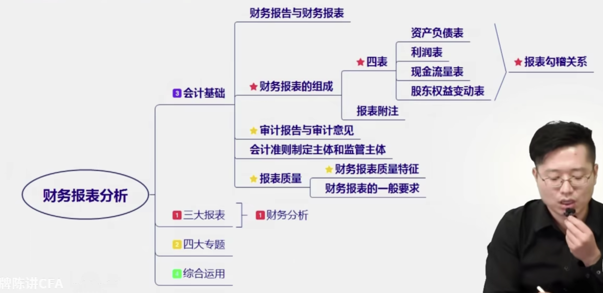
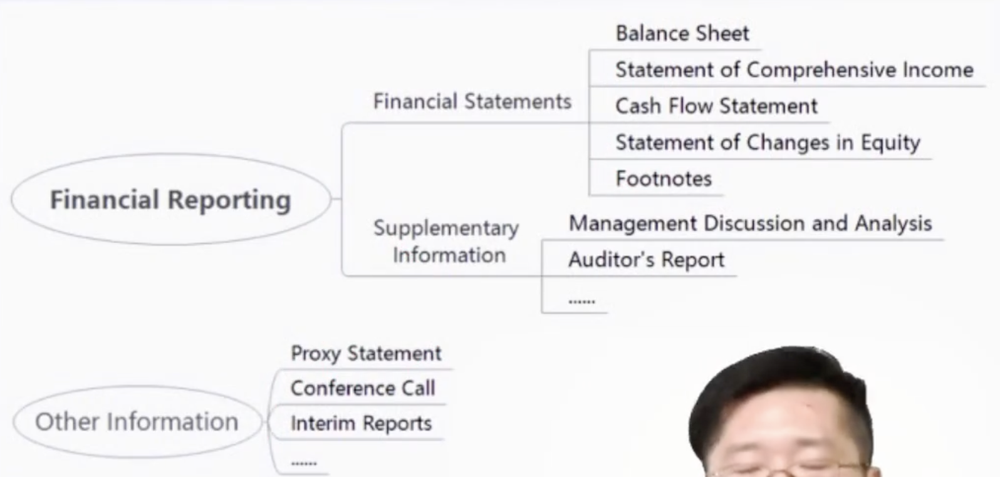

[toc]

&emsp;
&emsp; 
# 1. 综述
## 2. components of Financial Statement Analysis

  

 <b>  财报分析章节脉络图 </b> 

财务报表分析大致可以分为四块，这四块的重要程度在途中用`1、2、3、4`标了出来，最重要的是 `三大报表以及对应的财务分析`，这是需要重点掌握的。

&emsp;
&emsp; 
# 2. 会计基础
## 2.1 财务报告
掌握概念即可
### 2.1.1 区分 财务报告 和 财务报表
财务报告 和 财务报表是不一样的，他们各自的英文如下：
> 财务报告 : `Financial reporting`
> 财务报表 : `financial statement`
> 
他们之间的关系是 包含和被包含:
> 财务报告 **包含**  财务报表(四表一附注) 和 补充信息(Supplementary Information)
> 

### 2.1.2 财务报告
#### (1) 财务报告的定义
> **Financial reporting** refers to the way companies show their financial performance to investors, creditors, and other interested parties by preparing and presenting financial statements.
> 
#### (2) 财务报告的构成
财务报告 **包含** 
> &emsp;&emsp; 财务报表(四表一附注)
> &emsp;&emsp; 补充信息(Supplementary Information)
> 

  

 <b>  财务报告组成 </b> 

### 2.1.3 财务报表
#### (1) 财务报表的定义
> &emsp;&emsp; The role of **financial statements** issued by companies is to provide information about a company’s 
> &emsp; ① `financial position`,
> &emsp; ② `financial performance`, 
> &emsp; ③ and `changes in financial position`
> 
that is useful to a wide range of users in making economic decisions. 
另外徐需要注意的是：
> `financial position` 是一个时间点上的概念，
> `financial performance` 是一个时间段上的财务表现，
> `changes in financial position` 也是一个时间段上的概念
> 

#### (2) 财务报表 包含哪些内容？
财务报表包括 `四表一附注`：
> ① Balance Sheet
> ② Statement of Comprehensive Income
> ③ Cash Flow Statement
> ④ Statement of Changes in Equity
> ⑤ Footnotes(financial statement notes)
> 
以下几点需要注意：
&emsp;&emsp; 虽然我们一直说`四表一附注`，但`附注`并不是独立存在的，而是`四表`都有自己的附注，比如 资产负债表有资产负债表的附注，综合收益表有综合收益表的附注。
&emsp;&emsp; `附注`是`财务报表`的组成部份，**不属于** `补充信息(Supplementary Information)`，因为附注是要和`财务报表`一起审计的。

### 2.1.4 补充信息(Supplementary Information)
#### (1) `补充信息`包括哪些内容？
&emsp;&emsp; 前面介绍过， `财务报告 = 财务报表 + 补充信息`，那`补充信息`包括哪些内容呢？
&emsp;&emsp; 我们到打开一个上市公司公司的网站上，把这个公司的财务报告下载下来，里面的东西剔除财务报告（四表一附注）后，剩下的都是都属于 `补充信息`，比如说：
> ① `Management Discussion and Analysis`(经营管理层的分析与讨论)
> ② `Auditor's Report`(审计报告)
> 等等...
> 
划重点： **在一份财务报告中，除了四表一附注，其它属于 补充信息！**

## 2.2 其它信息(Other Information)
### 2.2.1 其它信息 和 财务报告 的关系

### 2.2.2 其它信息 包含哪些内容？
> ① `Proxy Statement`(委托代理声明)
> ② `Conference Call`(电话会议的会议纪要)
> ③ `Interim Reports`(期中报告)
> 等等
> 

### 2.2.3 其它信息(Other Information) 需要被审计吗？

&emsp;
## 2.3 financial statement analysis
### 2.3.1 definition of `financial statement analysis`
> &emsp;&emsp; The role of **financial statement analysis** is to use financial reports prepared by companies, combined with other information, to evaluate the past, current, and potential performance and financial position of a company **for the purpose of making investment, credit, and other economic decisions**. 
> 
### 2.3.2 财务报表的分析对象是什么？ 分析的目的是什么？
分析的对象是：
> `financial reports` + `other information`
>
> 财务报告（四表一附注 + 补充信息） + 其它信息
> 
分析的目的是: 
> 进行 经济决策(`for the purpose of making investment, credit, and other economic decisions`)
> 

&emsp;
## 2.4 financial statements
重点掌握 四表一附注 及 他们之间的勾稽关系
### 2.4.1 Balance Sheet
#### (1) definition of `Balance Shee`
资产负债表(Balance Sheet)
> &emsp;&emsp; The `balance sheet` (also called the `statement of financial position` or `statement of financial condition`) presents a company’s **current financial position(注意是时间点)** by disclosing the resources the company controls (assets) and its obligations to lenders and other creditors (liabilities) **at a specific point in time**.
> 
**current financial position**  : 
|                        |                                                         |
| ---------------------- | ------------------------------------------------------- |
| **current**            | `date of balance sheet`（资产负债表日（中国是12月31日）） |
| **financial position** | 该公司的 资产 、 负债 所有者权益                        |

 
### (2) what does a Balance sheet consists of?
The balance sheet consists of three elements:
> 1） **Assets** are the resources controlled by the firm.
> 2） **Liabilities** are amounts owed to lenders and other creditors.
> 3） **Owners’ equity** (also `shareholders’ equity`, `shareholders’ funds`, or `net assets`) is the residual interest in the net assets of an entity that remains after deducting its liabilities from its assets.
> 
Transactions are measured so that the fundamental accounting equation holds: 
> `assets` = `liabilities` + `owners’ equity`
> 
The proportions of liabilities and equity used to finance a company are known as the company’s capital structure.
#### Liabilities 和 Debt
Liabilities 的范围更广，它包含了Debt

### 2.4.2 `Statement of Comprehensive Income` and `Income Statement`
#### (1) Difference between `Statement of Comprehensive Income` and `Income Statement`
一般来说美国公司对于体现公司收入费用的方式有两个选择：
> ① 采用 `综合收益表（Statement of Comprehensive Income）`的形式;
> ② 采用 `利润表（Income Statement）` + `其他综合收益表（（Other Comprehensive Income Statement）` 两个报表的形式;
> 
 
    综合收益表与利润表的区别 其实就是两个表格是 分开 还是合起来 那么简单而已。

**① 采用 `综合收益表（Statement of Comprehensive Income）`的形式**
&emsp;&emsp; 综合收益表除了包括`利润表（Income Statement）`里的所有内容外，还包含`其他综合收益（Other Comprehensive Income）`。用个公式表达就是：
> 综合收益（综合收益表内容） = 净利润（利润表内容） + 其他综合收益（其他综合收益表内容）
> 
> Comprehensive income = Net income + Other Comprehensive income
> 

**② 采用 `利润表（Income Statement）` + `其他综合收益表（（Other Comprehensive Income Statement）` 两个报表的形式**

#### (2) `Income Statement`
`The income statement` (also known as `the statement of operations` or `the profit and loss statement(P&L)`) reports on the financial performance of the firm **over a period of time**(注意，是一段时间的表现). The elements of the income statement include revenues, expenses, and gains and losses.
Revenues are inflows from delivering or producing goods, rendering services, or other activities that constitute the entity’s ongoing major or central operations.
Expenses are outflows from delivering or producing goods or services  that constitute the entity’s ongoing major or central operations.
Other income includes gains that may or may not arise in the ordinary course of business.

#### Net income
**Net income** is known as the bottom line(因为它一般出现在收益表的最后一行)

**参考文献：**
> [综合收益表与利润表有什么区别？](https://www.zhihu.com/question/22229391)
> 

### 利润表 和 现金流量表 在记账上的差异
利润表 : 权责发生制，当对应的权利和义务发生的话，那在利润表中就会有体现，
现金流量表：收付实现制，即钱进来了记账，钱溜出去了记账，其他情况统统不记账
举个例子：
> 当公司A把自己的产品卖给客户后，如果这里交易可以符合收货确认的原则，那在利润表中就要体现这笔收入（即使客户在一年后才能付款），而此时现金流量表不会体现这笔收入（只有一年后客户付款后才会体现）
> 

### 2.3 Cash Flow Statement
`Cash flow statement` reports the sources(钱从哪来) and uses(钱去哪了) of cash **over a period of time（一段时间）**
Elements on cash flow statement
> • Cash flows from **operating** activities (CFO)
> • Cash flows from **investing** activities (CFI)
> • Cash flows from **financing** activities (CFF)
> 

### 2.4 Statement of Changes in Equity
这个考的不多
**The statement of changes in equity** reports the amounts and sources of changes in equity investors’ investment in the firm over a period of time.
The basic components of owners' equity are 
> paid-in capital, 
> retained earing
> accumulated other comprehensive income
> 

### 2.5 四表之间的勾稽关系
TODO：

### 2.6 Footnotes(financial statement notes)

## 2. 审计报告与审计意见
掌握结论即可，不需要太过深究

## 2. 会计准则制定主体和监管主体

## 2. 报表质量

