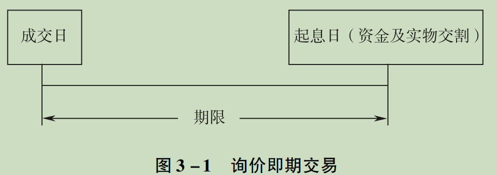
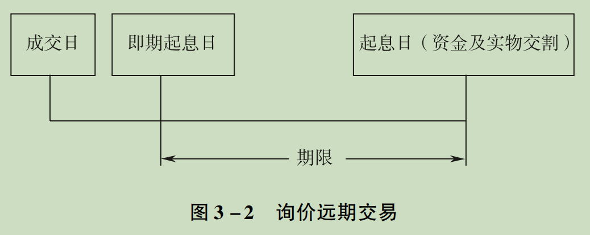
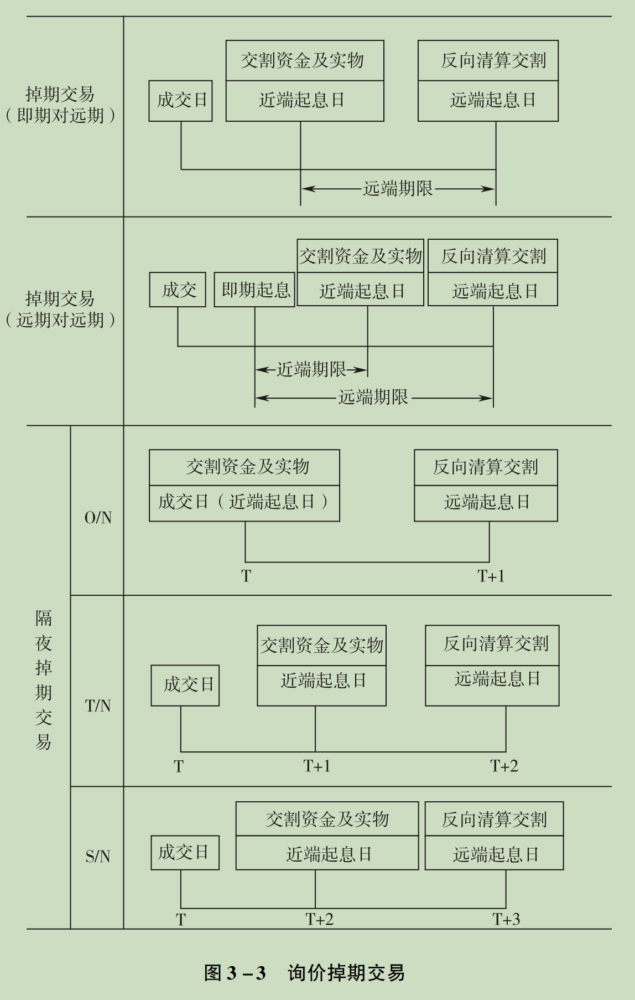

[toc]

&emsp;
# 0 基本概念
## 0.1 上金所有哪些交易模式？
根据交易模式的不同, 上海黄金交易所的上市合约分为：
| 交易类型 | 交易规则简述                                             | 交易/合约分类                                                | 备注                            |
| -------- | -------------------------------------------------------- | ------------------------------------------------------------ | ------------------------------- |
| 竞价     | 采用自由报价方式，采用“价格优先，时间优先”的撮合成交模式 | 现货实盘合约，现货延期交收合约 Au(T+D)，现货即期合约 Au(T+N) | 撮合成交模式与股票交易类似      |
| 询价     | 以双边“自主报价，协商成交”的方式进行                     | 即期交易、远期交易和掉期交易                                 | 一般针对非标准化合约            |
| 集中定价 | 不同于竞价撮合的一种“以价询量，数量撮合”交易模式         |                                                              |                                 |
| 报价     |                                                          |                                                              |                                 |
| 其他     |                                                          | 质押业务，租借业务，入库，出库，ETF交易，冲抵保证金          | ETF交易是上金所和上证所合作完成 |

## 0.2 合约
### 0.2.1 什么是合约？
&emsp;&emsp; 标准化合约是指其标的资产（基础资产）的交易价格、交易时间、资产特征、交易方式等都是事先标准化的，因此此类合约大多在交易所上市交易，如期货。
&emsp;&emsp; 标准化合约的条款都是事先规定好的，具有普遍性和统一性。
### 0.2.2 合约的作用是？
&emsp;&emsp; 合约是由交易所统一制定、约定在将来某一特定的时间和地点交割一定数量标的物的标准化合约
### 0.2.3 一个合约包含了那些内容？
&emsp;&emsp; 一个合约规定了除了价格之外，还将合约的其它要素如交易品种、交易方式、质量标准、交易单位、报价单位、交易手续费、交割方式、交割品种、交割时间等确定下来。
### 0.2.4 按交易模式分类，交易所有哪些合约？
根据交易模式的不同, 上海黄金交易所的上市合约分为：
> ① 竞价交易合约
> ② 询价交易合约
> ③ 集中定价交易合约
> ④ 报价交易合约
> ⑤ 其他经中国人民银行批准的合约
> 

## 0.3 `T+D` 和 `T+0` `T+1` `T+2`
### 0.3.1 `T+D`
&emsp;&emsp; 黄金`T+D`，是指由上海黄金交易所统一制定的、规定在将来某一特定的时间和地点交割一定数量标的物的标准化合约。`T+D`里的"T"是`Trade`（交易）的首字母，"D"是`Delay`（延期）的首字母。
#### `T+D`和`T+1`的区别是？
&emsp;&emsp; 值得注意的是，`T+D`和`T+1`（以及`T+2`）关系不太大：
> `T+D`里的"T"是`Trade`（交易）
> `T+1`里的"T"是指交易登记日
>
换句话说`T+D`其实是一种交易模式，而`T+0`是指 交易登记日当天

### 0.3.2 `T+0` `T+1` `T+2`
#### (1) `T+0`中的 `T` 表示什么？
&emsp;&emsp; `T`指交易登记日，因此`T+0`表示交易登记日当天，而`T+1`表示 登记日的次日。
#### (2) `T+0`是什么？
&emsp;&emsp; `T+0`原文为`Transaction plus 0 days`，是证券交易与结算制度的一种简称。在学术研究和实际业务中，`T+0`又可以细分为：
> ① `T+0`交易制度
> ② `T+0`结算制度
> 
通俗的说，就是：
> &emsp;&emsp; ① `T+0`交易制度，是指“投资者当天卖出股票获得的资金在当天就可以买入股票、当天买入的股票在当天就可以卖出”的一种证券交易机制。实际上，`T+0`交易是我国证券市场参与者之间的一种通俗叫法，正式名称为“当日回转交易”。
> &emsp;&emsp; ② `T+0`结算制度，是指“证券买卖成交实际发生当天证券和资金就清算交割完成”的一种证券交易机制。我国证券市场采用`T+1`结算，即在证券成交后的第二个工作日完成清算交割。
> 

### 0.3.3 `T+1` `T+2`
&emsp;&emsp; `T+1` : “T”指交易登记日，“T+1”指登记日的次日。
&emsp;&emsp; `T+2` : T+2是T日后的第二天：例如T日是周一15：00前，那么T+2就是周三，还有我们说的T+0就是T日当天。

&emsp;
## 0.4 黄金交易所上市的交易品种有哪些？
一共有四种：
> ① 黄金
> ② 白银
> ③ 铂金
> ④ 金币
> 

&emsp;
##  0.5 上海黄金交易所的交易时间
### 哪些时间是交易日？
&emsp;&emsp; 上海黄金交易所的交易日为每周一至周五 (国家法定节假日及交易所公告的休市日除外), 交易所一般于年末在网站公布下一年度的全年节假日休市安排, 如有变更将另行公告。

### 交易时间是怎样的？
TODO：

&emsp;
&emsp;
# 1. 竞价交易（Competitive price transaction）
## 1.1 基础知识
### 1.1.1 何为竞价交易？
&emsp;&emsp; 竞价交易是指在交易所按“价格优先、时间优先”的原则, 以自由报价、撮合成交的方式进行的交易。

### 1.1.2  在竞价交易中，什么情况下会自动成交？假如成交，成交价是多少？
#### (1) 何时成交？
> 买入价 (bp) = buying price 
> 卖出价 (sp) = selling price
> 前一成交价（cp） 
> 
&emsp;&emsp; 当 `买入价 >= 卖出价`时，系统自动撮合成交。

#### (2) 成交价如何确定？
### 1.1.1 何为竞价交易？
&emsp;&emsp; 撮合成交价等于 买入价(bp)、 卖出价(sp) 和前一成交价(cp) 三者中居中的一个价格: 
> 当 ` bp ≥s p ≥ cp` 时, 最新成交价 = sp; 
> 当 ` bp ≥ cp ≥ sp` 时, 最新成交价 = cp; 
> 当 ` cp ≥ bp ≥ sp` 时, 最新成交价 = bp。 
> 
&emsp;&emsp; 例如, 针对某黄金合约已有的买报价为 `280` 元, 前一成交价为 `279.9` 元的行 情, 之后的卖报价为 `279.8` 元时, 成交价取上述三个价格按数值大小排序后, 处于中间的 `279.9` 元。 
#### (4) 为何要采取 “三价取其中” 的策略？
&emsp;&emsp; “三价取其中” 的原则能在一定程度上规避错单造成市场 价格的异常波动, 减少错单损失。而且使成交价格具有相对连续性，避免了不必要的无规律跳跃。

&emsp;
## 1.2 竞价交易的分类
### 1.2.1 竞价交易分为哪几种？
根据**交易方式**的不同, 竞价交易合约可分为3种：
> ① 现货实盘
> ② 现货即期
> ③ 现货延期
> 
### 1.2.2 这几种竞价交易之间的区别是？
| 合约分类         | 规则                                                                                                                                                                                      | 合约示例                                       |
| ---------------- | ----------------------------------------------------------------------------------------------------------------------------------------------------------------------------------------- | ---------------------------------------------- |
| 现货实盘合约     | (1) 买方报价时必须有全额资金；卖方报价时必须有足额实物； (2) 报价后，对应的资金或实物被冻结； (3) 成交后，实物实时交割，钱货两讫方式进行清算。                                    | 黄金 有`Au50g` `Au100g` `Au99.99` `Au99.95` 等 |
| 现货延期交收合约 | (1) 以支付保证金的方式进行交易；  (2) 可以在成交当日交割，也可以延期交割，不限定最后交割日期；  (3) 可以在当天或者其后日期，通过平仓结束合约； (4) 以每日无负债方式进行结算。 | 黄金有`Au(T+D)`、`mAu(T+D)`                    |
| 现货即期合约     | (1) 以支付保证金的方式进行交易； (2) 必须在 T+2 日进行实物交割，否则需要赔偿违约金； (3) 不可以进行平仓操作； (4) T+1 进行结算。                                              | Ag99.99                                        |

## 1.3 在竞价交易的交易时间
不同交易方式的交易时间安排各有不同, 竞价交易的交易时间安排有两种模式：
> 普通交易日模式 (模式A) 
> 节假日(非周末，如国庆节后第一个工作日)后第一个交易日模式(模式B)
> 
两种交易日安排模式的具体交易时间明细见官网或书里原文。

## 1.4 竞价交易合约综述
### 1.4.1 竞价交易合约有哪几种？
&emsp;&emsp; 根据**交割地点**的不同, 上海黄金交易所上市合约分为主板合约和国际板合约。
&emsp;&emsp; 根据**交易方式**的不同, 竞价交易合约包括**现货实盘合约**、 **现货即期合约**、 **现货延期交收合约**及其他经中国人民银行批准的合约：
> ① **现货实盘合约**包括 Au100g、 Au99.99、 Au99.95、 Au99.5、 Pt99.95、 iAu100g、 iAu99.99、 iAu99.5、 PGC30g, 其中 iAu100g、 iAu99.99、 iAu99.5 为国际板合约。 
> ② **现货即期合约**有 Ag99.99。 
> ③ **现货延期交收合约**包括 Au (T + D)、 mAu (T + D)、 Au (T + N1)、 Au (T + N2)、 Ag (T + D)、 NYAuTN06、 NYAuTN12 等。 新增合约根据交 易所公告确定合约类型。
> 
#### `PGC30g` 是什么合约？
&emsp;&emsp; `PGC30g` 是熊猫金币30克，是一个现货实盘合约

#### `Au (T + D)`中的`T` 和 `D` 分别表示什么？ 
&emsp;&emsp; 黄金`T+D`，是指由上海黄金交易所统一制定的、规定在将来某一特定的时间和地点交割一定数量标的物的标准化合约。`T+D`里的"T"是`Trade`（交易）的首字母，"D"是`Delay`（延期）的首字母。要将其和`T+1`区分开来。

#### `Au(T + D)` 和 `mAu (T + D)`有何区别
他俩的差异主要在**交易单位**上：
> `Au(T + D)`是`1千克/手`
> `mAu(T + D)`是 `100克/手`
>
另外，他们在**最大单笔报价量**、**交割品种**也有差异。

#### `Au(T + N1)`、 `Au (T + N2)` 和 `Au(T + D)` 有何区别？
&emsp;&emsp; `Au(T + N1)`、 `Au (T + N2)`与`Au(T + D)`的差异主要体现在 **延期费支付方式** 上：`T+N`合约的延期补偿费 在延期费支付日集中支付，
> `Au(T+N1)`的延期费支付日为每年的6月15日，
> `Au(T+N2)`的延期费支付日为每年的12月15日，
> 
非延期费支付日不设延期补偿费，延期补偿费率为6%，对应合约进入6月和12月份时，将提高保证金比例。

#### `NYAuTN06` 和 `NYAuTN12`

#### 黄金T+D 和 黄金期货有何区别？

&emsp;
### 1.4.2 竞价交易合约参数包括哪些？
#### (1) 交易单位
&emsp;&emsp; 交易单位是指每手合约代表的标的物数量, 一般以 “手” 为交易单位。 不同交易合约每手代表的商品数量各不相同, 报价量必须是1手的整数倍。例如：
> &emsp;&emsp; 对于`Au100g`，1手是`100g`，买卖时必须是`100g`的整数倍，比如`100g` 或 `200g`等，而不能是`150g`这样的非整数倍。
> 

#### (2) 报价单位
&emsp;&emsp; 报价单位 是指合约对应的每计量单位的货币价格。 如黄金、铂金的报价单位为 元(人民币)/克, 白银的报价单位为 元(人民币)/千克。

#### (3) 最小变动价位
&emsp;&emsp; 最小变动价位是指在竞价交易过程中, 对合约每计量单位报价的最小变动数值。 报价的最小变动数值必须是最小变动价位的整数倍。 如:
> 黄金 `Au99.99`和`Au(T + D)`合约的最小变动价位为 0.01元/克, 
> 黄金 `Au(T + N1)`和`Au(T + N2)`合约的最小变动价位为 0.05 元/ 克, 
> 白银 `Ag(T + D)`合约的最小变动价 位为 1元/千克。
> 
#### (4) 每日价格最大波动限制
&emsp;&emsp; 每日价格最大波动限制 规定了上海黄金交易所合约在一个交易日中交易价格波动不得高于或者低于规定的涨跌幅度。
&emsp;&emsp; 上海黄金交易所规定现货实盘合约涨跌幅计算的基准价为合约上一交易日的收盘价, 现货即期合约与现货延期交收合约涨跌幅计算的基准价为合约上一交易日的结算价。 
&emsp;&emsp; 对应的基准价加上允许的合约当日最大涨幅构成当日价格上涨的上限, 称为涨停板; 基准价减去允许的合约当日最大跌幅构成当日价格下跌的下限, 称为跌停板。 
&emsp;&emsp; 合约涨跌停板的设定主要取决于合约交易保证金比例以及标的物价格波动的剧烈程度, 如白银的历史价格波动剧烈程度高于黄金, 对应合约的每日价格涨跌停板相对较大。 而对于现货实盘合约, 理论上不需要有每日价格最大波动幅度的限制, 但作为交易系统合约设置上的参数项, 设置成不太可能触及的 30% 。 

#### (5) 最大(小)单笔报价量
&emsp;&emsp; 最大(小)单笔报价量, 是上海黄金交易所对单笔报单申报数量的限制, 大于最大单笔报价量和小于最小单笔报价量的报单无效。 目前, 上海黄金交易 所竞价合约的最小单笔报价量均为 1 手, 部分活跃合约 Au99. 99、 Au100g、 Au (T + D)、Ag (T + D) 的最大单笔报价量当前分别为 50000 手 (500 千克)、 1000 手 (100 千克)、 200 手 (200 千克)、 10000 手 (10 吨)。 

#### (6) 最低交易保证金比例
&emsp;&emsp; 最低交易保证金比例 是指上海黄金交易所针对盘中实行保证金交易的合约设定的最低保证金标准, 上海黄金交易所可在此基础上根据市场情况调整合约交易保证金水平（注意，保证金比例不是固定的）。 会员参与上海黄金交易所各类合约的交易, 应当按交易所的规定缴纳交易手续费。 需要说明的是, 合约参数表中关于交易保证金比例、 交易手续费等参数项是上海黄金交易所对交易所会员的规定。 上海黄金交易所要求会员开展延期交收合约等保证金产品代理业务时, 对客户收取的交易保证金比例必须高于上海黄金交易所对会员收取的保证金比例。

#### (7) 合约实例
| Au99.99              |                                              |
| -------------------- | -------------------------------------------- |
| 交易品种             | 黄金                                         |
| 合约代码             | Au99.99                                      |
| 交易方式             | 现货实盘交易                                 |
| 交易单位             | 10克/手                                      |
| 报价单位             | 元（人民币）/克                              |
| 最小变动价位         | 0.01 元/克                                   |
| 每日价格最大波动限制 | 上一交易日收盘价±30%                         |
| 最小单笔报价量       | 1 手                                         |
| 最大单笔报价量       | 50000手                                      |
| 交易时间             | 日间：9:00至15:30，夜间:19:50 至次日 02:30。 |
| 清算方式             | 钱货两讫                                     |
| 交割品种             | 标准重量 1 千克、成色不低于 99.99％的金锭    |
| 交割方式             | 实物交割                                     |
| 交割时间             | T+0                                          |
| 质量标准             | 太长了，略。。。                             |
| 交割地点             | 交易所指定仓库                               |
| 交易手续费           | 成交金额的万分之三点五                       |
| 交割费               | 0                                            |
| 上市日期             | 2002年10月30日                               |

&emsp;
### 1.4.3 竞价交易合约的行情
&emsp;&emsp; 上海黄金交易所一般将实时行情数据提供给资讯公司, 由资讯公司将制作而成的行情产品提供给市场。 
#### (1) 交易所提供哪些行情？
上海黄金交易所网站提供 延时行情 和 每日盘后行情

#### (2) 竞价合约的主要行情字段包括哪些？
&emsp;&emsp; 竞价合约的主要行情字段包括 昨收盘、 昨结算、 开盘价、 最高价、 最低价、 最新价、 涨跌、 涨跌幅、 买价、 买量、 卖价、 卖量、 成交量、 成交金额、 持仓量、 交收量、 收盘价、 结算价等。
##### ① 开盘价
&emsp;&emsp; **现货实盘合约**的开盘价为该合约当日第一笔成交价；
&emsp;&emsp; **现货即期合约**与**现货延期交收合约**通过集合竞价产生开盘价; 开盘集合竞价**没有产生**开盘价的, 以当日第一笔成交的价格作为开盘价。 
##### ② 收盘价
&emsp;&emsp; 收盘价是该合约当日最后`5`笔成交的加权平均价; 若当日无成交价格, 则以上一交易日的收盘价作为当日收盘价。 
##### ③ 最高价与最低价
&emsp;&emsp; 最高价与最低价 是指一段时间内某合约成交价中的最高价与最低价, 合约收盘后为该交易日的最高价与最低价。 
##### ④ 最新价:
&emsp;&emsp; 最新价是指某交易日某合约交易期间的最新一笔即时成交价格。 
##### ⑤ 涨跌与涨跌幅
&emsp;&emsp; 现货实盘合约盘中的涨跌计算为最新价减去上日收盘价, 全日的涨跌为今收盘减去昨收盘。 现货即期合约与现货延期交收合约的盘中涨跌计算为最新价减去上日结算价, 全日的涨跌为今收盘减去昨结算。 涨跌幅按涨跌数值进行相应计算。 
##### ⑥ 结算价
&emsp;&emsp; 结算价为某合约当日一定时间内成交价格按照成交量计算的加权平均价, 当前上海黄金交易所合约结算价的统计时段为整个交易日; 当日合约 无成交的, 以上一交易日的结算价作为当日结算价。 结算价是当日交易结束后, 对当日合约持仓或实物交割等进行保证金、 盈亏及交割货款结算的基准价。 
##### ⑦ 成交量与成交金额
&emsp;&emsp; **成交量**是某合约当日成交合约的双边累计数量, 单位 为 “手”。 
&emsp;&emsp; **成交金额**为某合约按每笔成交价格、 交易量及每手代表的交易单位计 算的累计成交金额。 上海黄金交易所允许现货实盘合约的大宗交易, 大宗交易仅将成交量与成交金额在盘后计入对应实盘合约的行情, 行情价格不作改变。 
##### ⑧ 持仓量
&emsp;&emsp; **持仓量** 也称**未平仓合约量**, 是指交易者在某时点上持有的某未平仓合约的双边数量。 
##### ⑨ 交收量
&emsp;&emsp; **交收量** 是指某延期交收合约的实物交割的双边累计数量, 为交收 申报与中立仓申报集中交割匹配成功的双边量。 
##### 昨收盘与昨结算: 
&emsp;&emsp; 昨收盘 是 “昨日收盘价” 的简称；
&emsp;&emsp; 昨结算 是 “昨日结算价” 的简称。

&emsp;
## 1.5 竞价交易合约一：现货实盘合约
### (1)  进行现货实盘合约交易时，对买卖双方有何要求？
&emsp;&emsp; **买报价**时必须有全额资金, **卖报价**时交易账户中必须有相应的实物。 另外，在报价后, 对应的资金或实物即被冻结, 若资金或实物不足, 报价无法提交。

### (2) 现货实盘合约的交割
&emsp;&emsp; 上海黄金交易所对现货实盘合约实行 **实时交割**, 报价成交后, 买入的黄金 实物可用于当日或以后交易日的卖出, 也可以申请提货; 
&emsp;&emsp; 买入的铂金实物不能在交易所卖出,只能申请提货。 
&emsp;&emsp; 客户卖出实物所得货款为可用资金, 可用于本交易日内的交易, 但不能提取。日终清算后, 可用资金余额转为可提资金。

### (3) 有哪些现货实盘合约？
&emsp;&emsp; 上海黄金交易所当前的**黄金**现货实盘合约有 Au100g、 Au99. 99、 Au99. 95、Au99. 5、 iAu100g、 iAu99. 99、 iAu99. 5、 PGC30g 共 8 个合约, **铂金**现货实盘合约有 Pt99. 95。
&emsp;&emsp; 注意，**白银没有**现货实盘合约。

### (4) 现货实盘合约的大宗交易 
####  什么样的算大宗交易？
&emsp;&emsp; 大宗交易的单笔交易金额 要求不小于 200万元
####  大宗交易是否显示在 实时行情 中？
&emsp;&emsp; 大宗交易成交与该合约的现货实盘竞价成交为同一合约的不同成交方式, 大宗交易成交信息**不在**竞价实时行情中显示, 大宗交易的成交价不计入行情, 成交量和成交金额在盘后计入历史行情。 大宗交易达成后会员可在会员服务系 统查询大宗交易成交单

&emsp;
## 1.6 竞价交易合约二：现货即期合约
### (1) 何为现货即期交易？
&emsp;&emsp; 现货即期交易是指客户在 `T + 0`日以保证金达成交易, 在 `T + 2`日以 `T + 0`日的结算价进行实物交割的交易。
### (2) 现货即期交易业务流程
&emsp;&emsp; ① 客户进行买报价或卖报价时, 必须有 `20%` 的保证金。 
&emsp;&emsp; ② 以成交当日为 `T + 0` 日, 日终结算时对买入量和卖出量进行轧差, 轧差后 的净头寸按当日结算价冻结 `20%` 的保证金, 同时对成交价与结算价的差额进行结算。 在 `T + 2` 交易日日终结算时, 按 `T + 0` 日的结算价, 对 `T + 0` 日的净头寸执行实物交割。
&emsp;&emsp; ③ 上海黄金交易所对 `T + 2` 日不能履行实物交割的一方按即期合约交割违约处理, 根据违约金比例向违约方收取违约部分的违约金, 根据违约金比例向守约方支付被违约部分的补偿金, 同时实物交割终止。 违约金比例为 `20%`。 
&emsp;&emsp; ④ 实物交割后卖方的保证金转换为向买方交付增值税专用发票的担保金, 上海黄金交易所收到买方已取得卖方增值税发票的信息后, 释放该担保金。
### (3) 有哪些现货即期合约
&emsp;&emsp; 目前只有白银`Ag99.99`合约采用现货即期交易方式
### (4) 现货即期合约 和 现货实盘合约 有何区别？
&emsp;&emsp; 他们的区别主要是 **交割时间**上的差异：
> 现货即期合约 实行 `T + 2`交割；
> 现货实盘合约 实行 当日(即`T + 0`)交割
> 

&emsp;
## 1.7 竞价交易合约三：现货延期交收合约
### 1.7.1 何为现货延期交收合约？
&emsp;&emsp; 现货延期交收交易（`T+D`交易） 是在实物黄金业务的基础上，运用杠杆效应，以提供保证金的形式建立做多与做空双向交易机制。
&emsp;&emsp; `T+D`合约采用双向保证金交易方式和逐日盯市的清算方式，合约**不设**到期日，需要交割的多、空持仓，可在每日15:00-15:30进行交收申报，完成交割配对的申报，在当日清算时完成实物交割。，根据交收申报多头收货量和空头交货量的对比情况，确定多、空持仓之间延期补偿费的收付方向。T+D合约按自然日计算延期补偿费，周五（或节假日前）按当日延期费支付方向结算周六和周日的延期费。

&emsp;
### 1.7.2 现货延期交收合约 和 现货实盘合约 有何区别？
&emsp;&emsp; 现货实盘合约交易的 交易标的 是 实物, 一般投资者只能先买入, 持有实物后才能择机卖出。 
&emsp;&emsp; 延期交收合约的 交易标的 是 标准化合约, 采用可以买空或卖空的双向保证金交易机制, 投资者可以在看涨交易合约标的物的情况下买入延期交收合约, 持多头持仓, 待价格上涨后卖出平仓, 进行获利了结; 反之,投资者在看跌交易合约标的物的情况下可以先卖出延期交收合约, 持空头持仓,待价格下跌后买入平仓, 进行获利了结。

&emsp;
### 1.7.3 有哪些现货延期交收合约？
现**货**（实物）延期交收合约
> 对于实物交割延期交收合约, 客户可选择在成交当日,或延期进行实物交割; 实物交割延期交收合约同时引入延期补偿费机制来调节实物供求矛盾。
> 
现**金**交割延期交收合约
> 现金交割延期交收合约没有延期补偿费机制, 且只允许在固定日期进行现金交割。
> 
目前, 上海黄金交易所延期交收合约包括:
> Au ( T + D)、mAu (T + D)、 Au ( T + N1 )、 Au ( T + N2 )、 Ag ( T + D)、 NYAuTN06、NYAuTN12 等; 
> 
其中, `NYAuTN06`、` NYAuTN12` 为现金交割延期合约，剩余的都是 现货延期交收合约。

&emsp;
### 1.7.4 延期交收合约 的买卖
#### (1) 开仓和平仓
&emsp;&emsp; 延期交收合约的交易按**买卖方**向和**交易性质**分为买入开仓、 卖出平仓、 卖出开仓、 买入平仓四类。
&emsp;&emsp; 其中, 买入开仓、 卖出开仓为增加持仓的操作, 需按申报价冻结规定比例的保证金; 买入平仓、 卖出平仓是减少原有持仓的操作,将按上日结算价释放规定比例的保证金。 
&emsp;&emsp; 具体为买入开仓形成多头持仓; 卖出平仓是对多头持仓进行反向的卖出, 以了结多头的交易。 卖出开仓形成空头持仓; 买入平仓是对空头持仓进行反向的买入, 以了结空头的交易。 上海黄金交易所按照先开先平的原则进行平仓处理。

#### (2) 双向持仓
上海黄金交易所对延期交收合约的双向同时持仓无限制。 例如：
> 客户有 10手 Au(T + D)合约的 空头持仓, 想要进行 买入平仓了结时, 如果误操作成买入开仓, 就会形成同时持有 10手多头 和 10手空头 的情况。
> 
换句话说，就是黄金交易所支持 **同时持有** 同一延期交收合约的 多头持仓 和 空头持仓。

&emsp;
### 1.7.5  延期交收合约的保证金
&emsp;&emsp; 当前, 上海黄金交易所会员单位参与黄金延期交收合约交易的保证金比例一般为 `6%` 、 参与白银延期交收合约交易的保证金比例一般为 `7%` 。 
&emsp;&emsp; 同时, 上海黄金交易所要求会员开展代理业务时的交易保证金必须高于交易所当时对会员要求的交易保证金水平。
&emsp;&emsp; 因为延期交收合约是有较高杠杆的保证金交易（黄金是6%）, 盈利或者亏损相对交易保证金而言都被成倍放大。

&emsp;
### 1.7.6 延期交收合约的限仓管理
**交易所 在限仓管理中的作用**
&emsp;&emsp; 上海黄金交易所在 会员席位 和 客户 两个层面对现货延期交收合约的最大单
边持仓数量进行管理。 
> &emsp;&emsp; 当**会员席位**多头或空头某一方向的合计持仓达到该方向的席位限仓上限时, 其席位下的所有客户在该方向上只能进行平仓报价, 不能进行开仓报价。 
> &emsp;&emsp; 当**客户**多头或空头某一方向的合计持仓达到该方向的客户限仓上限时, 客户在该方向上只能进行平仓报价, 不能进行开仓报价。
> 
**会员席位 在限仓管理中的作用**
&emsp;&emsp; 会员可在上海黄金交易所客户限仓基础上对客户进行限仓。

&emsp;
### 1.7.7 延期交收合约的交割制度
#### (1) 交收申报的申请时间
&emsp;&emsp; 实行实物交割的延期交收合约没有固定的合约到期日, 每天都可以进行交割。 实物交割采用交收申报制度, 在每个交易日的 15:00 ~ 15:30, 不论当日新增持仓或历史持仓, 都可进行交收申报。 多头持仓可进行收货申报, 空头持仓可进行交货申报。

#### (2) 交易所将如何处理 未进行交收申报的持仓？
&emsp;&emsp; 未进行交收申报的持仓 和 进行了交收申报但最终没有实现交割配对的持仓, 自动延期到下一交易日, 直至平仓了结或交收申报成功后通过实物交割了结合约持仓。

#### (3) 交收申报 的数量
&emsp;&emsp; 客户进行交收申报时, 应按合约最小交收申报量的整数倍进行申报, 当前,黄金延期交收合约的最小交收申报量为 1 手, 白银延期交收合约的最小交收申报量为 15 手。

#### (4) 交收申报后，客户在持仓和资金上会有什么变化？
&emsp;&emsp; 交收申报时上海黄金交易所系统冻结相应数量的持仓, 同时, 对交货申报冻结交割所需的相应实物, 对收货申报按上一交易日结算价冻结足额货款, 确保交收配对成功后客户能够履行实物交割。

#### (5) 若在一个交易日中，对某个合约要求交货的数量 和 收货的持仓数量 不相等时，交易所如何处理？
&emsp;&emsp; 由于延期交收持仓的实物交割可每天进行, 但对某个合约要求交货或收货的持仓数量往往是不相等的, 为此, 实物交割延期交收交易引入 **延期补偿费机制** 来调节合约交易中的实物供求矛盾。

&emsp;
### 1.7.8 延期补偿费机制
#### (1) 为何需要引入 延期补偿费？
&emsp;&emsp; 延期补偿费 是用来调解 **延期交收合约** 的 交收矛盾的。
**① 交收申报带来的问题：**
> &emsp;&emsp; 上金所延期交收合约采用实物交收申报制度，多头持仓可以进行收货申报，空头持仓可以进行交货申报。因为交收申报是由客户自自由申报，因此不可避免的会出现交货数量和收货数量不同的情况。
>
**② 问题的解决办法：**
> &emsp;&emsp; 如果出现了交货数量和收货数量不同的情况，该怎么办呢？考虑到已经递交的交货申报、收货申报，生效后是不能撤销的，因此必须按照交货、收货数量多的一方去补足。
> &emsp;&emsp; 因此，为了调节实物供求矛盾，引入延期补偿费机制，延期补偿费 由交收数量少的一方，支付给另一方的融通资金或者实物的成本。如果有持仓，就可能参与当天延期补偿费的计算，结果可能是支付延期补偿费，也可能是获得延期补偿费。
> 

#### (2) 哪些合约要收延期补偿费？
**实物**交割延期交收合约 引入了延期补偿费机制来调节实物供求矛盾；
**现金**交割延期交收合约 没有延期补偿费机制。

#### (3) 延期补偿费的支付方向如何确定？(即如何确定客户是 收延期补偿费 还是 付延期补偿费呢？)
&emsp;&emsp; 延期补偿费是客户延期交收时, 为了融通资金或实物所发生的成本, 延期补偿费的支付方向**根据交货申报和收货申报的数量对比情况确定** ：
> &emsp;&emsp; 当某实物交割延期交收合约 空头方申报的交货量 小于 多头方申报的收货量时, 当日延期补偿费支付方向为 “空付多”, 结算时该合约的全部空头持仓, 按一一对应的方式向全部的多头持仓支付延期补偿费。 
> &emsp;&emsp; 当某实物交割延期交收合约 空头方申报的交货量 大于 多头方申报的收货量时, 当日延期补偿费支付方向为 “多付空”, 结算时该合约的全部多头持仓, 按一一对应的方式向全部的空头持仓支付延期补偿费。 
> &emsp;&emsp; 当交货申报量等于收货申报量时, 不发生延期补偿费支付。 
> 
总结起来就是: 
> 根据交收申报结果, 申报量少的一方对应的持仓方向 须向 申报量多的一方对应的持仓方向 支付延期补偿费。
> 

#### (4) 延期补偿费的 收付方式
实行实物交割延期交收合约的延期补偿费有 按日收付 和 定期收付 两种收付方式:
**① 按日收付**
> &emsp;&emsp; 每日根据交收申报情况执行合约的延期补偿费收付, 收付数量为从本交易日到下一交易日前的自然日天数 (含节假日)。 目前 `Au(T + D)`、 `mAu(T + D)`、`Ag(T + D)`等延期交收合约采用按日收付这种方式。
> 
**② 定期收付**
> &emsp;&emsp; 合约的延期补偿费只根据指定的延期补偿费收付日的交收申报情况, 对当日的日终持仓执行延期补偿费收付, 其他交易日可以进行交收申报, 不进行延期补偿费收付。 目前 `Au(T+N1)`、 `Au(T+N2)` 延期交收合约采用定期收付,`Au(T+N1)` 的延期费支付日为 6月15 日, `Au(T + N2)` 的延期费支付日为 12月15日。
> 

#### (5) 延期补偿费的 计算方法
`延期补偿费` = `持仓量` × `当日结算价` × `延期补偿费率` × `收付数量`
延期补偿费率
> &emsp;&emsp; 当前, **按日收**付的延期交收合约的延期补偿费率为 `1.5‱`, **定期收付**的延期交收合约的延期补偿费费率为 `3%` , 上海黄金交易所根据市场利率水平和实物交收情况调整延期补偿费率。
> 
&emsp;&emsp; 另外，作为一种有针对性的持仓成本, 延期补偿费也被作为应对交割异常的风险控制手段, 根据市场情况临时调整延期补偿费率。

### 1.7.9 中立仓机制
#### (1) 中立仓机制 的作用是？
&emsp;&emsp; 由于延期交收持仓的实物交割可每天进行, 但对某个合约要求交货或收货的持仓数量往往是不相等的，要解决交货/收货的供求矛盾，必须有人出面 补上短缺的申报量。但如果是按照普通交货、收货的申报，没有足够的好处，无法吸引手上有资金或者黄金实物的参与者。
&emsp;&emsp; 因此，交易所引入了中立仓，通过中立仓申报，可以最大限度地满足合约的实物交割需求。
&emsp;&emsp; 换句话说，当某实物交割延期交收合约的交货申报量与收货申报量不相等, 即存在交收申报量差时, 通过中立仓申报调节合约实物交收不平衡的矛盾。

#### (2) 客户为什么会有动力申报中立仓？
&emsp;&emsp; 申报中立仓的客户可以获得 延期补偿费，这样客户就有动力了。

#### (3) 中立仓的申报方式
中立仓是客户根据交收申报结果以实物或货款平衡交收申报量差时生成的持仓。 中立仓的具体申报方式为：
> &emsp;&emsp; 当交收申报结果为 收货量 大于 交货量 时, 市场上有闲置实物的客户以交实物的形式进行中立仓交货申报; 
> &emsp;&emsp; 当交收申报结果的 交货量 大于 收货量 时, 市场上有闲置资金的客户以收实物的形式进行中立仓收货申报。
> 

#### (4) 中立仓的申报时间
&emsp;&emsp; 中立仓申报时间为每个交易日的 15: 31 ~ 15: 40（其实就是在交收申报结束后立即开始中立仓申报）, 客户在中立仓申报时间段内, 按照某合约当日交收申报结果确定的中立仓方向进行中立仓申报时, 上海黄金交易所按合约当日结算价冻结获取反向持仓所需的保证金, 同时按申报方向冻结履行实物交收所需的全额货款或相应实物。 中立仓申报同样需按最小交收申报量的整数倍申报, 申报状态结束前客户可以撤销申报。

#### 中立仓申报是如何撮合配对的？
&emsp;&emsp; 交收申报和中立仓申报按 “时间优先” 的原则进行集中撮合配对, 配对成功的交收申报和中立仓申报在当日结算时按合约当日结算价完成实物交割。

#### 中立仓申报成功后将为申报者形成反向持仓
&emsp;&emsp; 中立仓通过弥补交收申报量差的形式参与延期交收合约实物交割的同时, 系统自动为其生成了与交割行为方向相反的延期交收合约持仓。 中立仓收货成功后, 按当日结算价生成空头持仓; 中立仓交货成功后, 按当日结算价生成相应的多头持仓;

#### 中立仓 手续费是多少？
&emsp;&emsp; 上海黄金交易所对中立仓免收手续费。

#### 实物交割延期交收合约 是期货还是现货？
&emsp;&emsp; 实物交割延期交收合约交易是属于现货范畴的交易, 其每日可以进行实物交割的制度安排, 使合约交易价格与现货每日有交集, 价格稍有偏出就有现货
交割套利空间, 市场力量进入让价格回归, 所以实物交割延期交收合约交易执行的是现货价格。 
> &emsp;&emsp; 以上海黄金交易所竞价交易金额最大的 Au ( T + D) 合约为例, 合约日均实物交收量与成交量之比长期稳定在 25% 左右, 通过中立仓机制,长期维持实物交收的平衡状态, 大量的生产企业直接通过 Au (T + D) 合约完成日常的黄金销售或采购。
> 

### 1.7.10 交收申报实例说明
书第60页

### 1.7.11 延期交收合约的现金交割制度
#### (1) 什么是 现金交割？
&emsp;&emsp; 除 实物交割 外, 上海黄金交易所延期市场部分合约实施现金交割制度。 
&emsp;&emsp; 现金交割是指 到期的未平仓合约按合约到期日的交割结算价进行统一清算、 划付盈亏并了结合约的交割方式。

#### (2) 有哪些合约是 现金交割合约？
&emsp;&emsp; 目前实施现金交割的场内合约有 2019 年 10 月上线的 **沪纽金合约** `NYAuTN06` 和 `NYAuTN12` 

#### (3) 现金交割合约 的 交割结算价
&emsp;&emsp; 现金交割合约的核心要素之一是交割结算价。 沪纽金的交割结算价由全球最具流动性的纽约黄金期货市场结算价体系计算得出, 保证了交割结算价的权威性、 公允性、 不可操纵性。

### 1.7.12 今日仓、 平今仓、 历史仓 和 超期持仓
今日仓、 平今仓、 历史仓 和 超期持仓 是上海黄金交易所的**现货延期交收交易**中的几个与持仓相关的概念。
#### (1) 今日仓
&emsp;&emsp; 今日仓是指 本交易日内 新开或新增 的持仓。

#### (2) 平今仓
&emsp;&emsp; 平今仓是指平仓了结今日新增的持仓。
> &emsp;&emsp; 较长时期以来上海黄金交易所对延期交收交易执行平今仓免收手续费的优惠措施, 只要某交易日内, 客户在某合约的交易记录中先出现了开仓交易, 之后又出现该合约平仓交易时, 不管该客户是否有该合约的历史持仓, 与当日开仓量对应的平仓数量, 一律视为平今仓, 日终清算时可享受交易所 “平今仓免手续费” 的优惠。
> 
#### (3) 历史仓
&emsp;&emsp; 历史仓是指本交易日之前所开的持仓。

#### (4) 超期持仓
&emsp;&emsp; 超期持仓是指连续持有时间超过上海黄金交易所规定期限的持仓。

#### (5) 超期费
&emsp;&emsp; 上海黄金交易所可以对连续持有时间超过规定期限的超期持仓征收超期费。 超期费已演变成一项风险控制指标,正常情况下不设置延期合约的超期期限, 不启用超期费, 如果启用按照上海黄金交易所相关公告执行。

&emsp;
## 1.8 几种竞价合约的对比

&emsp;
## 1.9 竞价交易合约的操作
### 1.9.1 客户如果想在黄金交易所 参与 交易，需要通过哪些环节？
&emsp;&emsp; 客户若参与上海黄金交易所相关合约的交易, 一般涉及开户、 下单、 结算、 交割等业务环节。

### 1.9.2 如何获取参与交易的资格？
&emsp;&emsp; 上海黄金交易所会员 可以直接参与交易；
&emsp;&emsp; 但 机构客户 和 个人客户 必须通过会员代理参与交易, 类似于个人若参与股票交易, 须先前往证券公司开户, 通过券商代理进入证券交易所交易。

&emsp;
&emsp;
# 2. 报价交易 
&emsp;&emsp; 报价交易是指由上海黄金交易所指定的做市商为报价合约提供连续买卖报价, 其他客户通过点击做市商报价的形式与做市商直接成交的交易。 报价交易合约按交易方式不同分为保证金报价合约和实盘报价合约。
## 2.1 什么是报价交易？
&emsp;&emsp; 上海黄金交易所的报价交易是指按照 “双边报价、 点价成交” 的原则, 由交易所指定的做市商为报价合约提供连续买卖报价, 其他客户通过点击做市商报价的形式与做市商成交的交易。

&emsp;
## 2.2 什么是 做市商
### (1) 维基百科
&emsp;&emsp; **做市商**（英语：Market Maker），是指在证券市场上，由具备一定实力和信誉的独立证券经营法人作为特许交易商，不断向公众投资者报出某些特定证券的买卖价格（即双向报价），并在该价位上接受公众投资者的买卖要求，以其自有资金和证券与投资者进行证券交易。（与一般投资者不同，造市商获豁免可同时对同一股票发出买入及卖出指示。）买卖双方不需等待交易对手出现，只要有做市商出面承担交易对手方即可达成交易，做市商从双方赚取买卖价差而从中获利。
&emsp;&emsp; **做市商制度**（香港称“市场庄家”制度）的市场也称报价驱动市场。做市商在美国纽约证券交易所市场称作“专家”（Specialist），在香港证券市场被称作“庄家”。在台湾称为“造市者”。
&emsp;&emsp; 与“报价驱动”的做市商制度相对的是“订单驱动”的竞价交易制度，客户订单通过代理商与其他客户订单直接交易，具体有连续竞价交易制度和集合交易制度等。

### (2) 某银行官网
&emsp;&emsp; **做市商** 是指中国人民银行批准在银行间市场开展做市业务，享有规定权利并承担流动性业务的金融机构。做市商在银行间市场须按照中国人民银行对做市券种数量、类型、代偿期的要求连续报出做市券种的双边价格，并按其报价与其他市场参与者达成交易。

&emsp;
## 2.3 什么是双边报价?
### 2.3.1 买卖双边价
#### (1) 什么是 买卖双边价？
&emsp;&emsp; “买卖双边价”是指在金融市场中，市场提供者（如银行、券商或交易所）给出的一对价格，通常包括买入价和卖出价。这两个价格分别表示市场提供者愿意以什么价格买入（即“买价”）和卖出（即“卖价”）某个金融工具（如外汇、股票或商品）的报价。
> &emsp;&emsp; **买入价（Bid Price）**：这是市场提供者愿意购买某一金融工具的价格。当你想卖出某个资产时，市场会按照这个价格向你买入。
> &emsp;&emsp; **卖出价（Ask Price）**：这是市场提供者愿意出售某一金融工具的价格。当你想买入某个资产时，市场会按照这个价格向你出售。
> 
买入价和卖出价之间的差距叫做**点差（Spread）**，点差通常反映了市场的流动性和交易成本。点差越小，意味着市场的流动性越好，交易成本也越低。反之，点差越大，流动性差，交易成本就会相应增加。

#### (2) 如何理解买卖双边价的市场影响？
&emsp;&emsp; 买卖双边价不仅仅是一个简单的数字，它反映了市场的流动性、情绪以及市场参与者的需求与供给状况。通过分析买卖双边价，交易者可以获得很多市场的信息。
&emsp;&emsp; **市场流动性**： 如果一个市场的买卖双边价非常接近，这通常意味着市场流动性较好，交易较为活跃。这种市场中，投资者可以较为容易地以接近市价的价格完成买入和卖出操作。
&emsp;&emsp; **市场情绪**： 如果买卖双边价相差较大，可能反映了市场的不确定性或波动性增大，交易者的情绪变得较为谨慎。在这种情况下，市场提供者可能会扩大点差，以应对潜在的风险。
&emsp;&emsp; **价格信号**： 有时，买卖双边价的变动本身也可以作为市场走势的信号。例如，当市场的买入需求大于卖出需求时，买入价可能会相对提高；而当卖出需求强烈时，卖出价可能会下跌。

&emsp;
### 2.3.2 双边报价
&emsp;&emsp; 双边报价是指经中国人民银行批准在银行间债券市场债券买卖价差范围内连续报出该券种的买卖实价（即 买入价 和 卖出价），并可同时报出该券种的买卖数量、清算速度等交易要素。进行双边报价的参与者有义务在报价或合理范围内与对手方达成交易。

&emsp;
## 2.4 报价交易市场 是比 竞价交易市场 同级的还是更低？
&emsp;&emsp; 报价交易系统是与竞价交易系统、 定价交易系统 **并列** 的场内交易平台, 将规划黄金、 白银、 铂金、 钯金等贵金属及其他多种创新业务和产品, 不同报价产品的交易按各自交易细则的规定执行。

&emsp;
## 2.5 报价交易平台的参与者有哪些？
&emsp;&emsp; 报价交易平台参与者包括做市商、 会员、 机构客户、 自然人客户等。
&emsp;&emsp; 客户之间不能进行报价交易成交，只能通过做市商。

&emsp;
## 2.6 报价交易合约
&emsp;&emsp; 报价交易合约按交易方式不同, 分为 现货实盘报价合约 和 保证金报价合约 两类。 
&emsp;&emsp; 实盘报价合约, 客户进行卖出交易时需要拥有该合约规定的实物、 凭证、 资金或其他形式的足额交割标的, 会员或客户进行买入交易时需要全额的资金。 
&emsp;&emsp; 保证金报价合约, 客户通过支付一定比例保证金的形式参与合约交易, 增加持仓的交易冻结保证金, 减少持仓的交易释放保证金。 保证金报价合约的持仓管理与竞价市场的延期交收合约不同, 实行单向净持仓管理, 若客户已持有某报价合约的多头持仓, 客户点击做市商的买报价进行卖出交易时, 交易系统先进行多头持仓的扣减, 多头持仓减至零后, 才能建立空头方向的持仓; 反之亦然。

&emsp;
&emsp;
# 3. 跨市套利
## 3.1 什么是跨市套利？
&emsp;&emsp; 跨市套利，是指在某个市场买入（或者卖出）某一交割月份的某种商品合约的同时，在另一个市场上卖出（或者买入）同种商品相应的合约，以期利用两个市场的价差变动来获利。
&emsp;&emsp; 具体来说，就是在两个交易所同时买入和卖出同一期货合约，等待未来价差变化带来有利时机再进行对冲。

## 3.2 如何做到跨市套利？
&emsp;&emsp; 虽然黄金（白银）作为全球性商品，他们在不同地域的价格是高度相关的，但还是会存在着一定的价差, 而且这个价差不是一成不变的, 而是根据市场条件持续频繁波动。因此投资者可以利用这个价差实现跨市套利
&emsp;&emsp; 黄金、 白银是市场上较为典型的适合跨市场套利交易的品种, 两者都是国际性交易品种, 产品标准统一、 交易量大、 参与者多、 市场流动性好, 在全球多个时区可实现 24 小时连续交易。

&emsp;
&emsp;
# 4. 询价交易 
## 4.1 什么是询价交易？
&emsp;&emsp; 询价业务是指在上海黄金交易所指定询价交易平台达成的询价交易业务, 或交易双方通过其他方式达成询价交易后, 在上海黄金交易所进行的询价登记, 以及其在上海黄金交易所开展的结算、 交割等业务。 上海黄金交易所的询价业 务分为以交易双方信用关系为基础的双边信用型询价业务和交易所收取保证金 并进行逐日盯市结算的履约担保型询价业务。 

&emsp;
## 4.2 如何理解询价交易？
&emsp;&emsp; 询价交易通常发生在选择卖家、 讨价还价、 双边交易的过程中。 在日常生活中, 客户通过淘宝选择卖家、 沟通议价、 双边交易的网购过程就可以理解成为一个典型的询价交易场景。

&emsp;
## 4.3 &emsp;
## 询价是场内交易吗？
&emsp;&emsp; 不是，询价属于 场外交易（OTC），

&emsp;
## 4.4 询价市场和竞价市场的差异
|                  | **竞价市场**                     | **询价市场**                            |
| ---------------- | -------------------------------- | --------------------------------------- |
| **交易场所**     | 场内                             | 场外                                    |
| **交易机制**     | “价格优先、 时间优先” 的撮合机制 | 交易双方询价、 议价; 自行选择交易对手方 |
| **交易对手**     | 不指定交易对手                   | 自行选择交易对手                        |
| **履约担保机制** | 交易所冻结保证金；每日无负债管理 | 交易所不冻结保证金；可采用信用交易机制  |
| **常见品种**     | AuT+D）、Au99.99现货合约等       | 即期、远期、掉期等                      |
| **参与主体**     | 会员; 个人及法人客户             | 会员; 法人客户                          |

&emsp;
## 4.5 询价市场的结构
&emsp;&emsp; 依托上海黄金交易所指定询价交易平台, 上海黄金交易所询价市场包括
> ① 银行间询价市场
> ② 银企询价市场
> ③ 国际板询价市场
> 
三个各有侧重、 充分联通的细分市场板块。

### 4.5.1 银行间询价市场
&emsp;&emsp; 该市场定位为场外询价批发市场, 以黄金进口银行、 各类金融机构为主,主要发挥批发融通、 价格形成、 风险对冲等场外市场中枢功能。 市场建有做市商制度, 经批准的做市机构向市场连续提供 3 个月、 6 个月、 1 年等标准期限买、 卖双边价格, 提供流动性。 该市场主要依托上海黄金交易所指定的中国外汇交易中心系统进行线上交易, 金融机构同时可根据业务需要, 通过上海黄金交易所询价交易系统进行同业询价交易。

### 4.5.2 银企询价市场
&emsp;&emsp; 该市场依托上海黄金交易所询价交易系统, 定位为场外询价基础市场, 以各类企业法人客户、 商业银行为主, 主要发挥着套期保值、 大宗交易、 配置投资等自营和代理的服务, 是银行间询价市场发展的重要客户来源。

### 4.5.3 国际板询价市场
&emsp;&emsp; 该市场定位为我国场外询价国际化平台, 引入境外机构、 国际投资者, 支持主板交易席位、 国际板交易席位之间通过上海黄金交易所询价交易系统互通交易, 主要发挥对接境内外场外询价业务需求, 提升人民币黄金中远期基准价格影响力的国际化功能。

&emsp;
## 4.6 询价交易 的 合约分类
按照**交易类型**不同, 上海黄金交易所挂牌询价合约包括
> ① 询价即期、 远期、 掉期合约
> ② 询价期权合约
> ③ 询价拆借合约
> 
按照**交割地点**的不同, 上海黄金交易所挂牌询价合约包括
> ① 主板询价合约
> ② 国际板询价合约
> 
上海黄金交易所询价交易分为
> ① 以交易双方信用关系为基础的双边信用型询价业务(目前上市的合约皆为此类型)
> ② 交易所收取保证金并进行逐日盯市的履约担保型询价业务（暂未上架）
> 
目前, 上海黄金交易所已经上市的询价交易为双边信用型询价业务

&emsp;
## 4.7 询价市场的参与者
**(一) 会员机构**
&emsp;&emsp; 上海黄金交易所对询价业务实行准入管理, 会员机构开展相关询价业务,应当事先根据申请条件和办理手续向上海黄金交易所提出申请。
&emsp;&emsp; 会员机构开展询价业务必须配备相应的交易员和席位用户。 会员根据上海黄金交易所相关规则, 通过上海黄金交易所指定系统为其交易员、 席位用户进行相关询价业务权限授权, 交易员、 席位用户根据系统授权在上海黄金交易所指定系统进行的操作, 均被视为其所属会员的行为, 具有法律效用。

**(二) 代理客户**
&emsp;&emsp; 询价市场为机构投资者市场, 法人客户参与上海黄金交易所询价业务, 应委托其代理会员机构进行, 自然人客户暂不允许参与上海黄金交易所询价业务。
&emsp;&emsp; 会员机构接受代理客户询价业务申请时, 应当与客户签署委托代理协议,明确询价业务中双方的权利与义务, 协议应至少包括客户授权会员代理询价交易、 登记、 确认、 变更、 执行和清算、 结算与交割等内容。
&emsp;&emsp; 会员机构对其自营询价业务承担履约责任, 代理客户对其委托的询价业务承担履约责任。

**(三) 做市商**
&emsp;&emsp; 上海黄金交易所询价市场实行做市商制度。 做市商是指经审核批准, 能够按规定在询价市场持续提供买、 卖双边可成交报价的机构。
&emsp;&emsp; 做市商应根据要求积极开展做市业务, 履行其做市义务, 提高市场流动性,完善市场价格发现机制。 作为做市商, 机构还应遵守相关规则, 在规定的交易时间内, 在银行间黄金询价市场连续提供买、 卖双边价格, 且所报双边价格应是有效的可成交价格, 双边报价价差应处于合理范围。 此外, 做市商应本着诚实交易的原则, 不得虚假报价, 不利用非法或其他不当手段操纵市场价格, 努力维护市场的健康平稳发展。 正式做市商对黄金询价市场远期价格曲线进行定盘报价。
&emsp;&emsp; 在履行义务的同时, 做市商也享有黄金询价市场新业务试点的优先权、 在黄金市场进行产品创新的政策支持等权利。
&emsp;&emsp; 上海黄金交易所定期对做市商进行日常管理和考核评价管理, 分为月度、季度、 年度考核评价。 做市商资格实行年审制, 年审周期按照做市商管理办法
有关规定执行, 上海黄金交易所根据做市商年审考核周期内的得分以及市场扩容需要对做市商资格执行年审调整。
&emsp;&emsp; 目前, 银行间市场核定做市商 17 家, 其中, 11 家正式做市商为交通银行、中国银行、 中国建设银行、 中信银行、 中国农业银行、 兴业银行、 招商银行、中国工商银行、 宁波银行、 平安银行和中国民生银行; 6 家尝试做市商为广发银行、 上海浦东发展银行、 上海银行、 中国光大银行、 大华银行和澳新银行 (中国)。 若做市商资格发生调整, 上海黄金交易所会及时向市场公布。

**(四) 经纪商**
&emsp;&emsp; 上海黄金交易所询价市场实行经纪商制度。 经纪商是指经上海黄金交易所认定的, 通过电子技术或其他手段, 帮助市场参与者达成询价交易并从中收取
佣金的中介服务机构。
&emsp;&emsp; 经纪商本着公正、 公平、 诚信、 为客户保密的原则开展业务, 并按照审慎经营的原则, 制定与上海黄金交易所询价经纪业务相适应的管理办法和操作流程, 建立全面有效的风险管理程序和内部控制制度。
&emsp;&emsp; 上海黄金交易所对经纪商实行备案管理。 有意向参与询价交易经纪业务服务的机构须向上海黄金交易所提交书面备案材料, 经上海黄金交易所核准后方可开展上海黄金交易所询价经纪业务。 目前, 已通过备案的经纪商为上海国利货币经纪有限公司、 上海国际货币经纪有限责任公司、 平安利顺国际货币经纪有限责任公司、 中诚宝捷思货币经纪有限公司、 天津信唐货币经纪有限责任公司。
&emsp;&emsp; 会员可通过指定系统为其自营席位和代理客户选择绑定经上海黄金交易所备案的经纪商, 授权其提供经纪服务。 经纪商在会员和客户的授权下, 为会员和客户提供交易撮合或登记等中介服务。

&emsp;
## 4.8 询价市场产品一：询价即期、 远期、 掉期合约
### 4.8.1  何为询价即期交易？询价远期交易？询价掉期交易？
#### ① 询价即期交易
&emsp;&emsp; **询价即期交易**是指交易双方以约定的合约、 数量、 价格等要素, 在交易当日 (`T+0` 日) 或后续两个交易日 (`T + 1`日、 `T + 2`日) 到期结算交割的交易 ：

  

&emsp;&emsp; 其中, **起息日**是指交易达成后, 交易双方履行资金及实物划拨, 其资金或付款能真正执行生效的日期。一般情况下, 起息日与结算日、交割日相同。

#### ② 询价远期交易
&emsp;&emsp; **询价远期交易**是指交易双方以约定的合约、 数量、 价格等要素, 在未来某一交易日 (不含 `T + 1` 日、 `T + 2` 日) 到期结算交割的交易：

  

其中, 期限指交易所跨时间长度, 通常以起息日与该交易品种即期起息日的时间差表示, 分为标准期限与非标准期限。

#### ③ 询价掉期交易
&emsp;&emsp; **询价掉期交易**是指交易双方以约定的合约、 数量、 价格等要素, 在两个不同的交易日进行方向相反、数量相等的两次到期结算交割的交易

  

&emsp;&emsp; 每笔掉期交易包含一个 近端期限 和一个 远端期限, 分别用于确定近端起息日和远端起息日。 这两个期限可以是标准期限, 也可以是非标准期限。 **近端起息日**是第一次资金及实物交割的日期; **远端起息日**是第二次资金及实物交割的日期。
&emsp;&emsp; 按照起息日的不同, 掉期交易分为 ① 即期对远期掉期交易 ( Spot - Forward) 、 ② 远期对远期掉期交易 (Forward - orward) 、 ③ 隔夜掉期交易，其中隔夜掉期交易包括 `O/N(Overnight)`、 `T/N(Tomorrow - Next)` 和 `S/N(Spot - Next)` 三种：
| 期限  | 全称            | 近端起息日     | 远端起息日 |
| ----- | --------------- | -------------- | ---------- |
| O/ N  | Overnight       | 交易日 (T + 0) | T + 1      |
| T / N | Tomorrow - Next | T + 1          | T + 2      |
| S / N | Spot - Next     | T + 2          | T + 3      |

### 4.8.2 询价即期、 远期、 掉期合约种类
&emsp;&emsp; 上海黄金交易所挂牌的询价即期、 远期、 掉期合约按照交割地点的不同,分为主板合约和国际板合约。 
&emsp;&emsp; 主板合约包括 `PAu99.95`、 `PAu99.99`、 `PAg99.99`等; 国际板合约包括 `iPAu99.5`、`iPAu99.99`、 `iPAu100g` 等。 
&emsp;&emsp; 上海黄金交易所指定的中国外汇交易中心系统挂牌的黄金询价交易品种货币对为`AUX.CNY`、`AUY.CNY`, 分别对应 `PAu99.95`、 `PAu99.99` 的主板合约。

### 4.8.3 询价即期、 远期、 掉期合约的合约参数
&emsp;&emsp; 询价即期、 远期、 掉期合约的主要参数包括合约代码、 交易单位、 交易类型、 即期报价单位、 即期最小变动价位、 远掉期点报价单位、 远掉期点最小变动价位、 最大报单量、 最小报单量、 涨跌幅限制、 参考合约、 可选参考价格、到期结算方式、 资金结算方式、 交割品种、 交割地点、 交易时间、 登记时间等。
&emsp;&emsp; (1) 询价即期、 远期和掉期合约的到期结算方式分为实物交割和现金结算。其中, 实物交割交易指交易双方在到期日按照约定要素根据钱货两讫原则进行结算与交割的交易。 现金结算交易是指交易双方在到期日以约定的参考价格与交易价格轧差后对现金差额进行资金结算的交易。 参考价格是交易双方指定日期对应的收盘价、 开盘价、 加权平均价、 “上海金” 基准价等上海黄金交易所公开的市场价格或交易双方约定的其他价格。
&emsp;&emsp; (2) 询价即期、 远期和掉期合约的资金结算方式分为上海黄金交易所结算资金和非上海黄金交易所结算资金两种方式。 其中, 上海黄金交易所结算资金指交易双方委托上海黄金交易所进行资金结算; 非上海黄金交易所结算资金指由交易双方自行完成资金结算。 实物交割交易的资金结算方式必须为上海黄金交易所结算资金。
&emsp;&emsp; 各询价合约有关参数按询价即期、 远期、 掉期业务合约参数表执行。 上海黄金交易所可根据市场发展需要调整合约或合约参数, 并向市场公告。

### 4.8.4 询价即期、 远期、 掉期合约的交易要素
&emsp;&emsp; 询价即期、 远期、 掉期交易的交易要素主要包括合约代码、 交易品种、 数量、 方向、 到期日、 期限、 成交价格、 到期结算方式、 资金结算方式、 参考价格、 交易双方信息等。
&emsp;&emsp; (1) 询价即期、 远期、 掉期交易的数量须为 1 手的整数倍。 其中, 询价掉期交易的近端数量与远端数量须相等。
&emsp;&emsp; (2) 询价即期、 远期交易的方向以黄金、 白银等交易品种的买卖方向为准,包括买入和卖出。 方向为买入的一方称为买方, 方向为卖出的一方称为卖方。询价掉期交易的方向以黄金、 白银等交易品种的近端买卖方向为准, 包括买入 (Buy / Sell, 以下简称 B / S) 和卖出 (Sell / Buy, 以下简称 S / B)。 方向为买入 (B / S) 的一方称为买方, 方向为卖出 (S / B) 的一方称为卖方。
&emsp;&emsp; (3) 询价即期、 远期、 掉期交易的到期日为交易双方约定的到期结算交割日期。 其中, 询价掉期交易到期日包括近端到期日、 远端到期日。
&emsp;&emsp; (4) 询价即期交易的期限是指到期日与交易日的日期间隔。 询价远期交易的期限是指到期日与 T + 2 日的日期间隔。 询价掉期交易的期限包括近端期限和远端期限。

### 4.8.5 询价即期、 远期、 掉期合约交易示例
书中P85

&emsp;
## 4.9 询价市场产品二：询价期权合约
### 4.9.1 何为 询价期权交易？
&emsp;&emsp; **询价期权交易** 是指买入方有权在约定的时间按照约定价格买入或者卖出约定数量的标的合约的交易。 期权买方以支付权利金的方式拥有权利; 期权卖方收取权利金, 并在期权买方选择行权时履行义务。

### 4.9.2 询价期权交易中的相关术语
#### (1) 权利金 (Premium)
&emsp;&emsp; 权利金又称期权费、 期权金, 是期权的价格, 是期权的买方为获取期权合约所赋予的权利而必须支付给卖方的费用。

#### (2) 内涵价值
`看涨期权的内涵价值` = `标的资产市场价格` - `执行价格`

`看跌期权的内涵价值` = `执行价格` - `标的市场资产价格`

#### (3) 时间价值
`时间价值` = `权利金` - `内涵价值`
&emsp;&emsp; 期权距到期时间越长, 时间价值越大, 因为对期权买方来说获利的可能性越大; 期权距到期时间越短, 时间价值越小, 因为期权卖方所需要承担的风险越小, 因此卖方在卖出期权时所要求的权利金也不会很多。 其他条件不变的情况下, 越临近到期日, 时间价值的衰退速度就会越快; 在到期日, 期权没有时间价值。

#### (4) 历史波动率
&emsp;&emsp; 历史波动率是由标的资产的历史价格数据经过分析整理后, 得出的波动率数值, 是对历史价格波动情况的反映。

#### (5) 隐含波动率
&emsp;&emsp; 隐含波动率是通过期权的权利金价格对市场未来波动情况的预期。

### 4.9.3 期权种类
#### (1) 按买方行权的方向划分
&emsp;&emsp; **看涨期权 (Call Options)** 是指期权的买方向期权的卖方支付一定数额的权利金后, 即拥有在期权合约的有效期内, 按事先约定的价格向期权卖方买入一定数量标的合约的权利, 但不负有必须买进的义务。 期权买方若不想买, 只需让该合约到期作废即可。 如有人买, 也可将看涨期权转卖出去。 对看涨期权卖方来说, 有义务在期权规定的有效期限内, 应期权买方的要求, 以期权合约预先约定的价格卖出相关标的合约。
&emsp;&emsp; **看跌期权 (Put Options)** 是指期权的买方向期权的卖方支付一定数额的权利金后, 即拥有在期权合约的有效期内, 按事先约定的价格向期权卖方卖出一定数量标的合约的权利, 但不负有必须卖出的义务。 同样地, 若不想卖, 可让期权到期作废, 也可将看跌期权转售。 对看跌期权卖方来说, 则有按期权合约的约定随时买入相关标的合约的义务。

#### (2) 按交割时间划分
&emsp;&emsp; 美式期权是指在规定的有效期限内的任何时候都可以行使权利。 期权买方既可以在期权合约到期日这一天行使权利, 也可以在期权行权日之前约定的任何一个交易日行使权利。
&emsp;&emsp; 欧式期权是指在规定的合约行权日方可行使权利。 期权买方在期权合约到期日之前不能行使权利。
&emsp;&emsp; 美式期权与欧式期权的划分并无地域上的区别。 近年来, 无论在欧洲还是在美国, 或是其他地区, 美式期权已占据主流, 欧式期权虽仍存在, 但其交易量已比不上美式期权。执行价格与标的资产市价的比较如下表：
| 期权类型 | 看涨期权                        | 看跌期权                        |
| -------- | ------------------------------- | ------------------------------- |
| 实值期权 | 期权执行价格 < 标的资产市场价格 | 期权执行价格 > 标的资产市场价格 |
| 虚值期权 | 期权执行价格 > 标的资产市场价格 | 期权执行价格 < 标的资产市场价格 |
| 平值期权 | 期权执行价格 = 标的资产市场价格 | 期权执行价格 = 标的资产市场价格 |

### 4.9.4 影响期权价格的主要因素
#### (1) 标的资产的市场价格与期权的执行价格
&emsp;&emsp; 由于看涨期权在执行时, 其收益等于标的资产当时的市价与执行价格之差。因此, 标的资产的价格越高、 执行价格越低, 看涨期权的价格就越高。
&emsp;&emsp; 对于看跌期权而言, 由于执行时其收益等于执行价格与标的资产市价的差额, 因此, 标的资产的价格越低、 执行价格越高, 看跌期权的价格就越高。
#### (2) 期权的期限
&emsp;&emsp; 对于美式期权, 由于期限较长的期权包含期限较短的期权的所有执行机会,因此期限越长, 期权价格越高。 对于欧式期权, 上述结论不一定成立。
&emsp;&emsp; 但在一般情况下 (即剔除标的资产支付大量收益这一特殊情况), 由于期限越长, 标的资产的风险就越大, 因此即使是欧式期权, 期限越长, 其期权价格也越高, 即期权的边际时间价值 (Marginal Time Value) 为正值。
#### (3) 标的资产价格的波动率
&emsp;&emsp; 由于期权买方的最大亏损额仅限于期权价格, 而最大盈利则取决于执行期权时标的资产市场价格与执行价格的差额, 因此波动率越大, 对期权买方越有利, 期权价格也相应更高。
&emsp;&emsp; 无风险利率、 标的资产的收益率等相关因素也会对期权价格产生影响。

### 4.9.5 询价期权合约
#### (1) 合约种类
&emsp;&emsp; 上海黄金交易所挂牌的询价期权合约包括 `OAu99.99` 和 `OAu99.95`, 其标的合约分别为 `PAu99.99` 和 `PAu99.95` 即期合约。

#### (2) 合约参数
&emsp;&emsp; 询价期权合约的主要参数包括合约代码、 交易单位、 交易类型、 行权方式、最大报单量、 最小报单量、 标的合约代码、 标的合约期限、 权利金和行权价报价单位、 权利金最小变动价位、 行权价最小变动价位、 结算方式、 可选参考价格、 交割品种、 实物交割地点、 交易时间、 登记时间、 行权时间、 平仓时间等。
&emsp;&emsp; ①询价期权的交易类型包括看涨期权和看跌期权。
&emsp;&emsp; ②询价期权的行权方式包括欧式期权和美式期权。
&emsp;&emsp; ③询价期权合约按结算方式分为实物交割期权和现金结算期权。 实物交割期权: 期权标的合约为实物交割型询价即期合约, 即期权行权后所产生的询价即期交易, 在到期结算时将进行实物交割。 现金结算期权: 期权标的合约为现金结算型询价即期合约, 即期权行权后所产生的询价即期交易, 在到期结算时将进行现金结算。
&emsp;&emsp; ④询价期权合约的交易单位 (即每手重量) 与其标的合约的交易单位一致。询价期权合约权利金与行权价的报价单位同其标的合约报价单位一致。 各交易合约有关参数按询价期权业务合约参数表执行。 上海黄金交易所可根据市场发展需要调整合约或合约参数, 并向市场公告。

#### (3) 交易要素
&emsp;&emsp; 询价期权交易的交易要素主要包括合约代码、 行权方式、 交易类型、 数量、方向、 行权日、 结算日、 期限、 行权价格、 权利金、 参考价格、 交易双方信息等。
&emsp;&emsp; ① 询价期权交易的方向以期权行权权利的买卖方向为准, 包括买入和卖出。其中, 方向为买入的一方称为买方, 又称期权持有方, 指支付一定权利金, 有权在约定时间按照约定价格通过标的合约买入或者卖出约定数量的黄金、 白银等交易品种的一方; 方向为卖出的一方称为卖方, 又称期权立权方, 指收取一定权利金, 有义务在约定时间按照约定价格通过标的合约买入或者卖出约定数量的黄金、 白银等交易品种的一方。
&emsp;&emsp; ② 询价期权交易的行权日指交易双方约定的期权买方选择是否行权的日期。询价期权交易的结算日指期权买方在行权日行权后, 交易双方按照约定的行权价格通过标的合约实际执行结算交割的日期。
&emsp;&emsp; 询价期权交易的行权日为结算日前第 N 个交易日, N 为该询价期权标的合约期限, 具体按照对应合约参数表的标的合约期限 (T + N) 相关规定执行。 美式期权可在交易双方约定的行权日之前行权, 对应的实际结算日为实际行权日后第 N 个交易日。
&emsp;&emsp; 询价期权交易的行权日、 结算日应晚于交易当日 (T + 0 日)。
&emsp;&emsp; ③ 询价期权交易的结算日为交易当日后续两个交易日 (T + 1 日、 T + 2 日)的, 期限为结算日与交易日的日期间隔; 结算日晚于 T + 2 日的, 期限为结算日与 T + 2 日的日期间隔。
&emsp;&emsp; ④ 权利金总额根据交易双方约定的权利金、 重量所确定, 计算公式为
> 权利金总额 = 权利金 × 重量
> 

&emsp;
## 4.10 询价市场产品三：询价拆借合约
### 4.10.1 什么是 询价拆借？
&emsp;&emsp; 询价拆借交易是指在金融机构以及上海黄金交易所批准的其他机构之间进行的, 交易一方以约定利息从另一方拆入黄金等贵金属实物, 并约定在未来某一日期归还的交易。

### 4.10.2 询价拆借合约分类
&emsp;&emsp; 合约按上海黄金交易所挂牌的询价拆借合约按照交割地点的不同, 分为主板合约和国际板合约。 
> 主板合约包括 `LAu99.95`、 `LAu99.99` 等。 
> 国际板合约包括`iLAu99.99`、`iLAu99.5`、`iLAu100g` 等。
> 

### 4.10.3 合约参数
&emsp;&emsp; 询价拆借合约的主要参数包括合约代码、 交易单位、 交易期限、 最小报单量、 最大报单量、 利率单位、 利率最小变动价位、 计息基准价单位、 计息基准价最小变动价位、 利息结算方式、 交割品种、 替代还金品种、 交割地点、 交易时间、 登记时间等。
**(1) 计息基准价**
&emsp;&emsp; 询价拆借交易的计息基准价指用于确定拆借名义本金的价格。

**(2) 计息基准**
&emsp;&emsp; 计息基准为根据拆借计息期计算拆借利息的方法, 包括 “实际天数/实际天数”、“实际天数/365”、“实际天数/ 365(固定)”、“实际天数/ 360”、“30 / 360” 等类型。

**(3) 利息结算方式**
&emsp;&emsp; 询价拆借交易的利息结算方式分为 上海黄金交易所结算利息 和 非上海黄金交易所结算利息: 上海黄金交易所结算利息指交易双方委托上海黄金交易所进行利息结算; 非上海黄金交易所结算利息指交易双方自行完成利息结算。
&emsp;&emsp; 各交易合约有关参数按询价拆借业务合约参数表执行。 上海黄金交易所可根据市场发展需要调整合约或合约参数, 并向市场公告。

### 4.10.4 交易要素
&emsp;&emsp; 询价拆借交易的交易要素主要包括合约代码、 数量、 方向、 起息日、 到期日、 期限、 货物属性、 利息结算方式、 拆借利率、 计息基准、 计息基准价、 名义本金、 付息日、 交易双方信息等。
**(1) 方向**
&emsp;&emsp; 询价拆借交易的方向以实物的拆借方向为准, 包括拆入和拆出。 拆入的一方称为拆入方, 拆出的一方称为拆出方。
**(2) 起息日**
&emsp;&emsp; 询价拆借交易的起息日为交易双方约定的, 拆出方将实物过户交付至拆入方的日期。
**(3) 到期日**
&emsp;&emsp; 询价拆借交易的到期日为交易双方约定的, 拆入方将实物过户归还至拆出方的日期。
**(4) 期限**
&emsp;&emsp; 询价拆借交易的期限指到期日与起息日的日期间隔。
**(5) 货物属性**
&emsp;&emsp; 询价拆借交易的货物属性指交易双方约定的所拆借实物的交割品种和仓库归属。 询价拆借交易在归还时, 货物属性默认与拆借时的货物属性保持一致;涉及替代归还的, 交易双方通过询价拆借交易的还金参数修改另行约定所归还实物的货物属性。
**(6) 名义本金**
&emsp;&emsp; 名义本金是交易双方约定的询价拆借上海黄金交易所对应实物的货币价值,计价货币为人民币, 计算公式为
> 名义本金 = 计息基准价 × 重量
> 
**(7) 付息日**
&emsp;&emsp; 付息日指交易双方约定的, 拆入方将利息支付给拆出方的日期。 付息日可选择起息日至到期日之间的任一交易日 (含起息日、 到期日当日)。

### 4.10.5 计息基准说明
**(1) “实际天数/ 实际天数” (简写为 A/ A)**
&emsp;&emsp; 指该计息期的实际天数除以 365 的商。 如果该计息期的任何部分属于闰年,则应为以下二者之和: 
> ①计息期属于闰年那部分的实际天数除以 366 的商;
> ②计息期属于非闰年的那部分的实际天数除以 365 的商。
> 
**(2) “实际天数/ 365” (简写为 A/ 365)**
&emsp;&emsp; 指该计息期的实际天数除以 365 的商, 若该计息期包含 2 月 29 日, 计算该日利息。
**(3) “实际天数/ 365 (固定)” (简写为 A/ 365F)**
&emsp;&emsp; 指该计息期的实际天数除以 365 的商, 若该计息期包含 2 月 29 日, 不计算该日利息。
**(4) “实际天数/ 360” (简写为 A/ 360)**
&emsp;&emsp; 指该计息期的实际天数除以 360 的商。
**(5) “30 / 360”**
&emsp;&emsp; 指计息期计息天数除以 360 的商。 计息期计息天数的计算根据一年 12 个月,每个月 30 天的原则计算, 但下述两种情况应按以下指定的天数计算当月天数:
> &emsp;&emsp; 一是若计息期第一天不是 30 日或 31 日, 但最后一天为 31 日时, 计息期最后一天所在月份应为 31 天; 二是若计息期最后一天是 2 月的最后一天, 则 2 月计息天数应为当月的实际天数。
> 

### 4.10.6 拆借交易示例

&emsp;
## 4.11 询价交易流程
### 4.11.1 询价交易流程
&emsp;&emsp; 狭义上, 询价交易流程指市场参与者以双方询价方式达成交易的过程, 包括交易发起方 (Taker) 发送询价请求, 输入黄金询价交易品种、 交割日期、 买入/ 卖出数量, 等待交易报价方 (Maker) 回应价格。 同时, 发起方 (Taker) 可以选择向指定的一方或几方进行询价, 也可以直接向市场最优价的报价方询价。接着, 交易报价方接到询价请求后, 综合考虑交易品种、 交割日期、 买卖方向信息输入价格和价格有效时间, 发送给交易发起方, 发起确认成交。 若发起方在有效时间内没有确认价格, 该价格作废。

### 4.11.2 询价业务流程
&emsp;&emsp; 广义上, 询价业务流程包括在上海黄金交易所指定询价交易平台达成的询价交易业务, 交易双方通过其他方式达成询价交易后在上海黄金交易所进行的询价登记, 以及其在上海黄金交易所开展的清算、 结算与交割等业务。
①市场准入
* **交易所**：管理会员业务准入；管理经纪机构业务准入
* **会员**：管理法人客户询价业务准入
* **机构客户、自营客户**：自行绑定询价经纪机构

② 交易登记
* **询价交易**：交易双方通过线上公开报价/竞争性询价达成交易
* **询价登记**：线下交易，通过登记入口提交，交易所提供后续服务

③ 交易确认
* **客户确认**：确认交易意愿及交易要素正确
* **会员确认**：确认承接该交易的清算
* **交易所确认**：权限检查等

④ 存续管理
* **交易所**：对信用交易不冻结会员资金
* **会员**：自行管理客户信用风险
* **场务操作**
* **会员存续操作**：撒销、行权平仓、违约申报等

⑤ 到期履约
* **交易双方**：准备到期履约所需资金实物
* **交易所**：多边净额清算交割，不作履约担保
* **违约处理**：可申请按原要素再次清算

&emsp;
## 4.12 交易、 登记及确认
### 4.12.1 线上交易与线下交易
&emsp;&emsp; 上海黄金交易所会员、 客户可以通过上海黄金交易所指定询价交易平台进行询价交易, 也可以在上海黄金交易所外通过其他方式达成询价交易后向上海黄金交易所提交登记。 
> 通过上海黄金交易所指定询价交易平台进行的询价交易称为线上询价交易; 
> 非通过上海黄金交易所指定询价交易平台达成的询价交易称为线下询价交易。
> 

### 4.12.2 询价登记
&emsp;&emsp; 询价登记是指线下询价交易达成后, 交易相关方向上海黄金交易所提交询价交易各项要素的行为。

#### 4.12.3 询价确认
&emsp;&emsp; 询价确认是指线上询价交易达成或线下询价交易登记提交后, 各相关方进行交易后确认的行为。

&emsp;
&emsp;
# 5. 清算与结算业务
## 5.1 清算和结算的基本概念
&emsp;&emsp; 清算与结算环节位于交易执行环节以后, **清算环节**是交易各方之间支付结算义务的计算过程, **结算环节**是这些义务生效的过程。
### 5.1.1 相关定义
#### (1) 清算
&emsp;&emsp; 国际支付结算体系委员会 (CPSS) 关于**清算**的定义如下: 在结算之前, 对支付指令或交易指令进行传送、 匹配、 在某些情况下确认的过程, 也可能包含指令轧差以及最终结算头寸的确定。
#### (2) 结算
&emsp;&emsp; 上海黄金交易所关于**结算**的定义如下: 根据交易结果和上海黄金交易所有关规定对交易各方资金和实物应收或应付数额进行清算后, 按照确定的清算结果完成 资金划转 和 实物交割 的业务活动。

### 5.1.2 清算的类型
&emsp;&emsp; 从广义上说, 清算可以是全额的, 也可以是净额的; 可以是双边的, 也可以是多边的。
#### (1) 全额清算
&emsp;&emsp; 交易双方对所有达成的交易 **不进行轧差处理**, 而是逐笔全额确定应收应付义务的过程。

#### (2) 净额清算
&emsp;&emsp; 交易双方根据交易成交结果进 **行轧差处理后** 确定相互间应收应付义务的过程。

#### (3) 双边清算
&emsp;&emsp; 交易双方 根据交易成交结果确定相互间应收应付义务的过程。 在双边清算中, 交易双方对清算环节负责。

#### (4) 多边清算
&emsp;&emsp; 众多交易主体 根据交易成交结果确定相互间应收应付义务的过程。

#### (5) 中央对手方 (CCP) 清算
&emsp;&emsp; 在双边或多边清算中, 若各交易主体的责任由中央对手方来承担, 则形成中央对手方清算。 具体而言, 中央对手方清算是指中央对手方通过合约替代、公开报价系统或具有法律约束力的机制安排介入交易双方, 充当所有 “买方的卖方” 和所有 “卖方的买方”, 根据交易成交结果与交易对手方确定相互间应收应付义务的过程。
&emsp;&emsp; 相较于双边清算，通过中央交易对手进行清算具有明显的好处。中央交易对手介入两个原始交易对手之间，使原始交易对手相互隔离，一方面可以降低金融机构之间的关联性，另一方面还有助于防止金融违约，从而促进金融稳定。当然，集中清算也会将金融风险集中于中央交易对手，因此，中央交易对手自身的稳健性至关重要。 中央交易对手清算机制是否具有分散风散的功能取决于两大关键因素：一是采用该清算机制的成员所投入的资本量；二是与未偿付的风险敞口相匹配的原始抵押值。针对此，中央交易对手会要求其成员至少每天根据头寸价格变动情况对抵押品进行调整。
下文来自 [何为中央对手方？](https://www.zhihu.com/question/29653981)
> &emsp;&emsp; 如果我和你达成一笔交易，清算时如果需要计算我们两者之间的资金/证券交付，那么就是点对点的双边清算模式；
> &emsp;&emsp; 如果我和你达成一笔交易，清算时如果只要计算我们各自与中央对手方之间的资金/证券交付，资金/证券不在我们两者之间直接流动，那么就是中央对手方（CCP）的清算模式。
> &emsp;&emsp; CCP在国内的应用其实已经很普遍，而且也在发展过程中。比如沪深股票市场（和股票期权市场）集中竞价交易，中登上海及深圳分公司担任中央对手方。
> &emsp;&emsp; 再如银行间市场的利率互换（IRS）也在前几年通过上清所逐步实现了中央对手方管理。
> &emsp;&emsp; 这种清算模式的好处是市场参与者可以较少地考虑交易对手信用风险。比如做股票期权交易，我对实值期权到期行权，如果在双边清算交收下，对方可能会违约；但中央对手方清算交收下，CCP肯定履约，如果对手方违约，CCP会向对方追索，后续处理我不需要关心了。如果是竞价交易模式甚至不需要知道真实的对手方是谁。
> 
**Notes:**
> 双边清算其实就是 在清算是，只要计算 买家 和 卖家 之间的应付和应收；
> 中央对手方清算就是 在 买家 和 卖家 之间有一个 中央对手方，买家 和 卖家各自计算和这个中央对手方之间的应付和应收，换句话说，这个中央对手方有点像 中介。
> 

### 5.1.3 上海黄金交易所的清算原则
&emsp;&emsp; 上海黄金交易所按照 “集中、 净额、 分级” 的原则进行清算。
> **“集中”** 是指上海黄金交易所为会员提供集中清算, 由上海黄金交易所继承交易双方的权利及义务;
> **“净额”** 是指上海黄金交易所对会员在交易所的成交额进行轧差处理;
> **“分级”** 是指上海黄金交易所负责对会员实行清算, 会员负责对其代理客户实行清算。
> 

&emsp;
## 5.2 结算机构
### 5.2.1 结算机构的形式
#### (1) 垂直模式
&emsp;&emsp; 结算机构是交易所的内部机构或者是交易所完全控股的子公司, 其优点是能够提高交易、清算与结算的效率, 统筹合约设计阶段和清算、 结算环节的风险因素, 满足合约异质化特点, 降低管理成本, 提高交易所的整体竞争力。
#### (2) 水平模式
&emsp;&emsp; 结算机构采取独立运营模式, 不隶属于任何一家交易所, 其优点是可以促进交易所之间的竞争, 不同交易所若选择同一结算机构, 可以提高投资者的资金利用效率。 其缺点是若清算对象为非同质化合约, 可能导致效率降低、 创新受阻。

### 5.2.2 上海黄金交易所的结算机构
&emsp;&emsp; 上海黄金交易所的结算机构上海黄金交易所结算机构的形式为垂直模式, 上海黄金交易所内设结算部门负责交易所交易的统一结算、 保证金的管理及结算风险的防范, 其主要职责包括:
> (1) 组织结算业务;
> (2) 控制结算风险;
> (3) 编制会员的结算表及其他会计报表;
> (4) 负责管理会员保证金;
> (5) 解决会员保证金账款纠纷;
> (6) 法律、 法规、 规章和上海黄金交易所规定的其他职责。
> 

### 5.2.3 会员的结算部门
&emsp;&emsp; 会员设立结算部门 (或专职结算人员) 负责会员与上海黄金交易所、 会员与其代理客户之间的结算工作。

&emsp;
## 5.3 存管银行
### 5.3.1 存管银行的定义以及资格条件
#### 存管银行的定义
&emsp;&emsp; 保证金存管银行 (以下简称存管银行) 是指上海黄金交易所指定的、 协助上海黄金交易所 办理保证金存管 和 资金结算业务 的商业银行。
#### 存管银行的资格条件
取得存管银行资质须符合以下条件:
> (1) 是全国性的商业银行, 且资金雄厚、 信誉良好;
> (2) 在全国各主要城市设有分支机构和营业网点;
> (3) 拥有先进、 快速的同城和异地资金划拨网络;
> (4) 具有健全的资金管理制度;
> (5) 拥有掌握贵金属交易结算知识、 期货知识和具有较强风险防范意识的专业人员;
> (6) 上海黄金交易所认为必须具备的其他条件。
> 
&emsp;&emsp; 符合以上条件, 并经上海黄金交易所同意成为存管银行后, 存管银行应与上海黄金交易所签订相应协议, 明确双方的权利和义务, 以规范相关业务手续。

### 5.3.2 存管银行名单
&emsp;&emsp; 上海黄金交易所目前指定的存管银行包括中国工商银行、 中国农业银行、 中国银行、 中国建设银行、 平安银行、 上海银行、 华夏银行、 兴业银行、 招商银行、上海浦东发展银行、 交通银行、 中国光大银行、 广东发展银行、 中信银行、 中国邮政储蓄银行、 北京银行、 中国民生银行、 上海农商银行, 共计 18 家。

&emsp;
## 5.4 账户管理
&emsp;&emsp; 上海黄金交易所在存管银行开设交易所结算专用账户, 用于存放会员保证金及相关款项。 会员须按席位在存管银行分别开立结算专用账户, 用于存放自营或客户保证金及相关款项, 自营业务和代理业务保证金不得混用。 上海黄金交易所与会员之间的资金往来和资金结算通过上海黄金交易所结算专用账户和会员结算专用账户办理。 客户的保证金应存入会员代理席位结算专用账户, 严禁会员挪用客户保证金。 会员开设、 更名、 更换或者注销结算专用账户, 须向交易所提交书面申请材料, 并填妥相关资料, 经上海黄金交易所批准后方可生效。
&emsp;&emsp; 上海黄金交易所对会员存入交易所结算专用账户的资金实行分账管理, 为每一会员的每一席位设立明细账户, 按日序时登记核算每一席位资金转入和转出、 盈亏、 交易保证金、 手续费等。
&emsp;&emsp; 会员应对其代理客户存入会员代理席位结算专用账户的资金实行分账管理,为每一客户设立明细账户, 按日序时登记核算每一客户资金转入和转出、 盈亏、交易保证金、 手续费等。

&emsp;
## 5.5 结算风险管理
&emsp;&emsp; 上海黄金交易所采取保证金、 涨跌停、 限仓、 交易限额、 风险基金等制度,严格管理结算风险。
### 5.5.1 保证金制度
&emsp;&emsp; 保证金是指会员用于结算和保证履约的资金, 分为结算准备金和交易保证金。 经上海黄金交易所批准, 会员及其代理客户可以根据有关规定提交有价物以按不同比例充抵保证金。
&emsp;&emsp; **结算准备金**是指会员为了交易结算, 在交易所结算专用账户中预先准备的资金, 是未被合约占用的保证金。 上海黄金交易所对会员按席位设定结算准备金最低余额标准。 自营席位结算准备金最低余额为 20 万元, 代理席位结算准备金最低余额为 50 万元, 上海黄金交易所有权根据会员业务规模、 会员申请的业务类型以及市场情况进行调整。 会员应当以自有资金缴纳最低结算准备金, 并且每日足额维持。
&emsp;&emsp; 会员可以根据需要向其代理的法人客户收取不高于 1 万元人民币的结算准备金, 并存入会员代理席位结算专用账户, 用于风险控制和未了费用结算。
&emsp;&emsp; **交易保证金**是指会员在交易所结算专用账户中保证合约履行的资金, 是已被合约占用的保证金。 当买卖双方成交后, 上海黄金交易所按持仓合约价值的一定比例或上海黄金交易所规定的其他方式向双方收取交易保证金。 上海黄金交易所对不同方向持仓分别收取交易保证金, 但在下列情形下, 上海黄金交易所可以按照交易保证金单边较大者进行收取: (1) 同一客户在同一会员席位处的延期交收合约同品种双向持仓; (2) 上海黄金交易所认为必要的其他情形。

### 5.5.2 风险基金制度
&emsp;&emsp; 风险基金是指由上海黄金交易所设立, 用于维护市场正常运转、 提供财务担保和弥补因交易所不可预见风险带来的损失的资金。 风险基金应当单独核算, 专户存储。 风险基金的动用应按规定的用途和程序进行, 并报中国人民银行备案。
&emsp;&emsp; 风险基金的来源:
> (1) 按向会员收取的手续费的一定比例提取;
> (2) 政府指定用于风险基金的专项拨款;
> (3) 对违规会员的罚款、 罚息收入;
> (4) 其他来源。
> 

&emsp;
## 5.6 清算与结算安排
&emsp;&emsp; 上海黄金交易所负责对会员实行清算, 根据交易结果对会员的贷款、 保证金、 盈亏、 手续费等应收或应付资金及会员或客户的应收或应付实物进行清算
&emsp;&emsp; 上海黄金交易所于清算完成后根据清算结果组织结算, 从相关会员或客户账户扣划其应付资金或实物, 向相关会员或客户账户划付其应收资金或实物。结算一旦完成不可撤销。 结算完成后, 上海黄金交易所将结算数据和结算单据等成功发送至指定系统视为已送达会员。
&emsp;&emsp; 每一个交易日交易结束后, 会员负责对其代理客户实行清算, 根据上海黄金交易所清算结果对其代理客户进行清算。

&emsp;
## 5.7 出入金管理
&emsp;&emsp; 入金是指从会员结算专用账户向交易所结算专用账户划入资金的行为。 
&emsp;&emsp; 出金是指从交易所结算专用账户向会员结算专用账户划出资金的行为。
会员出金应当符合交易所规定。 会员的出金标准为
> `当日可提资金余额` = `当日结算准备金余额` - `当日最低结算准备金余额` - `当日收到的货款额` - `上日已用充抵额度 / 最大配比倍数`
> 
会员当日收到的货款 以及 日终结算后收到的当日盈利等款项 可以于 下一个交易日 出金时间申请出金。

&emsp;
## 5.8 违约处理
### 5.8.1 违约责任
&emsp;&emsp; 上海黄金交易所结算时, 会员或客户应当确保其资金账户或实物账户在结算前备足结算所需的资金或实物。 会员出现包括但不限于下述情形时, 交易所有权认定该会员违约:
> (1) 会员或客户未能在其资金账户或实物账户上备足资金或实物, 导致实物交割失败的;
> (2) 会员结算准备金不足, 且未在规定时间内补足的。
> 
&emsp;&emsp; 会员应当承担其自营交易违约的违约责任, 并先行承担其代理交易违约的全部责任。 客户对自己委托的交易负全部责任, 并有向交易所反映会员代理业务中存在问题的权利。 发生实物交割违约, 交易所向守约方支付补偿金, 并向违约方收取违约金, 同时交收终止。
> &emsp;&emsp; 违约金 = 违约量 × 结算价 × 违约金比例
> &emsp;&emsp; 补偿金 = 被违约量 × 结算价 × 违约金比例
> 
上述公式中, 现货即期合约和定价交易合约的结算价为成交日的结算价,延期交收合约的结算价为交割日的结算价。
### 5.8.2 违约处置
&emsp;&emsp; 会员结算准备金不足, 且未在上海黄金交易所规定的时间内补足的, 上海黄金交易所有权采取下列措施:
> (1) 暂停开仓;
> (2) 按规定强行平仓, 并用平仓后释放的保证金履约赔偿;
> (3) 将交存作为保证金的充抵物处置变现, 用变现所得履约赔偿;
> (4) 依法处置质押物;
> (5) 依法处置该会员的实物库存;
> (6) 用该会员的会员资格费或会员资格转让所得款项或其他资金履约赔偿;
> (7) 按规定动用上海黄金交易所风险基金;
> (8) 按规定动用上海黄金交易所自有资金;
> (9) 上海黄金交易所可以采取的其他措施。
> 
上海黄金交易所动用风险基金或自有资金代会员承担责任后, 取得对该会员的相应追偿权或索赔权。

&emsp;
## 5.9 有价物充抵保证金业务
### 5.9.1 相关概念
#### (1) 什么是 有价物充抵保证金业务？
&emsp;&emsp; **有价物充抵保证金业务** (以下简称充抵业务) 指会员或客户将 经上海黄金交易所批准的 在交易所指定仓库托管的 黄金和白银等库存类有价物, 以及外币、有价证券类和其他有价物, 作为保证金使用的业务。 
&emsp;&emsp; 充抵业务的期限最长不超过 180 个自然日, 最短不低于 1 个自然日, 用于充抵的有价物市值不小于 10 万元。

#### (2) 充抵业务涉及的相关概念
**① 充抵额度**
&emsp;&emsp; 充抵额度是会员或客户通过充抵业务获得的可作为保证金使用的资金额度,表现为有价物最大配比金额和有价物折后价值的较低值。 每日结算时, 上海黄金交易所根据当日有价物基准价和会员实有货币资金情况重新确定会员充抵额度。 会员充抵额度体现在会员自营席位保证金账户上; 客户充抵额度体现在会员代理席位保证金账户上, 客户充抵额度的使用由会员管理。 充抵额度只作为交易保证金使用, 不能用于支付货款、 亏损、 费用、 税金等款项, 不能提取现金。

**② 有价物最大配比金额**
&emsp;&emsp; 有价物最大配比金额是会员席位保证金账户内实有货币资金与最大配比倍数的乘积。 上海黄金交易所可以根据有价物的流动性和风险性确定其最大配比倍数, 并可根据市场风险和有价物所有人的资信调整最大配比倍数。

**③ 有价物基准价**
&emsp;&emsp; 有价物基准价是上海黄金交易所对有价物估值时使用的公允价格, 其中库存类有价物基准价为对应合约结算价, 非库存类有价物基准价由交易所根据相应市场成交情况发布。

**④ 有价物折算率**
&emsp;&emsp; 有价物折算率是指上海黄金交易所计算充抵额度时对有价物估值进行折算的比率。

### 5.9.2 宽限期及违约处置
&emsp;&emsp; 上海黄金交易所在当日结算时, 对申请撤销的充抵业务和到期的充抵业务进行统一处理。 会员货币可报价余额充足的, 上海黄金交易所收回充抵额度,并按原路径归还有价物; 会员货币可报价余额不足的, 上海黄金交易所将采取相关风险控制措施, 同时给予该笔充抵业务 2 个交易日的宽限期, 会员应在宽限期内补足资金。
&emsp;&emsp; 宽限期满后, 会员货币可报价余额仍不足的, 上海黄金交易所有权对有价物进行处置。 由此产生的损失或费用由相关会员或客户承担。
&emsp;&emsp; 上海黄金交易所处置有价物所得资金, 用于补足该会员的货币可报价余额或清偿相关债务。 尚有余额的, 将余额部分退还该会员; 余额仍然不足的, 上海黄金交易所有权向该会员进一步追索。

&emsp;
&emsp;
# 6. 交割业务
## 6.1 交割的概念
&emsp;&emsp; 上海黄金交易所提供实物登记托管、 交割、 质量认证、 物流配送、 质押过户、 租借过户和黄金 ETF 等业务服务。 交割分为 实物交割与 现金交割 两种方式：
> &emsp;&emsp; 实物交割 是指为履行交易合约, 按照交易所的规则和程序进行的相应实物所有权转移的行为。 
> &emsp;&emsp; 现金交割 (又称现金结算) 是指按照交易所的规则和程序, 以规定的结算价格进行现金差额结算, 了结交易合约的行为。
> 

&emsp;
## 6.2 实物账户
&emsp;&emsp; 上海黄金交易所实物交割实行一户一码制, 会员及客户开户成功即获得各自的实物账户代码, 实物交割处理到每个会员及客户的实物账户。

&emsp;&emsp; 会员及客户登记、 托管在上海黄金交易所的实物分为交割品种和保管品种：
> 交割品种为可参与上海黄金交易所交易交割业务的实物；
> 保管品种为不可参与交易所交易交割业务的实物。
> 
&emsp;&emsp; 实物账户分席位登记交割, 同一会员或客户在不同席位下的库存独立使用。
&emsp;&emsp; 实物账户分为 未分配账户 和 分配账户：
> 未分配账户 的实物不按会员及客户单独摆放, 按重量交割, 不指定到条块。 
> 分配账户 的实物指定条块交割。 
> 
黄金和铂金交割品种为未分配账户, 白银交割品种为分配账户。 保管库实物为分配账户, 条块按照不同客户单独摆放。

&emsp;&emsp; 未分配账户包括 剩余库存账户 及 买入货权账户：
> 剩余库存 是会员及客户存入指定仓库的实物, 记入其剩余库存账户; 
> 买入货权 是会员及客户买入的实物,记入其买入货权账户。 分
> 
配账户的实物统一记入剩余库存账户。

**Notes:**
> 上面一个是实物**品种**的分类：即 交割品种 和 保管品种；
> 另一个是实物**账户**的分类：即 未分配账户 和 分配账户。
> 

&emsp;
## 6.3 实物交割
### 6.3.1 实物质量标准
&emsp;&emsp; 上海黄金交易所交割、 保管的 **金锭、金条** 为经上海黄金交易所认定的可提供标准金锭、 金条企业生产的符合交易所执行的 《金锭》 《金条》 标准的实物,及上海黄金交易所认可的国际相关市场认定的合格供货商生产的标准实物。 
&emsp;&emsp; 上海黄金交易所交割的 **铂锭** 为上海黄金交易所认可的国际相关市场认定的或经上海黄金交易所认定的合格铂锭供货商生产的标准实物。 
&emsp;&emsp; 上海黄金交易所交割的 **银锭** 为经交易所认定的可提供标准银锭企业生产的符合交易所执行的 《银锭》标准的实物, 及上海黄金交易所认可的国际相关市场认定的合格供货商生产的标准实物。

### 6.3.2 交割品种
&emsp;&emsp; 上海黄金交易所实物交割品种分为主板交割品种和国际板交割品种。 主板交割品种用于主板合约的交割, 国际板交割品种用于国际板合约的交割。上海黄金交易所交割品种如下
| 交割品种名称 | 交割品种                                                                                  | 交割品种属性   |
| ------------ | ----------------------------------------------------------------------------------------- | -------------- |
| Au99. 95     | 标准重量 3 千克, 成色不低于 99. 95% 的金锭                                                | 主板交割品种   |
| Au99. 99     | 标准重量 1 千克, 成色不低于 99. 99% 的金锭                                                | 主板交割品种   |
| Au99. 5      | 标准重量 12. 5 千克, 成色不低于 99. 5% 的金锭                                             | 主板交割品种   |
| Au100g       | 标准重量 0. 1 千克, 成色不低于 99. 99% 的金条                                             | 主板交割品种   |
| PGC30g       | 标准重量 30 克、 成色为 99. 9% 、 由中国人民银行发行属于国家法定货币的熊猫金币            | 主板交割品种   |
| Pt99.95      | 标准重量分别为 0.5千克、1千克、2千克、3千克、4千克、5千克、6千克, 成色不低于99.95% 的铂锭 | 主板交割品种   |
| Ag99. 99     | 标准重量 15 千克, 成色不低于 99. 99% 的银锭                                               | 主板交割品种   |
| Ag (T + D)   | 标准重量 15 千克, 成色不低于 99. 99% 的银锭                                               | 主板交割品种   |
| iAu99. 99    | 标准重量 1 千克, 成色不低于 99. 99% 的金锭                                                | 国际板交割品种 |
| iAu99. 5     | 标准重量 12. 5 千克, 成色不低于 99. 5% 的金锭                                             | 国际板交割品种 |
| iAu100g      | 标准重量 0. 1 千克, 成色不低于 99. 99% 的金条                                             | 国际板交割品种 |

### 6.3.3 交割量、 交割时间及交割顺序
#### (1) 交割量
&emsp;&emsp; 现货实盘合约、 现货即期合约、 黄金现货延期交收合约、 定价交易合约最小交割量为 1 手, 并按 1 手的整数倍交割。 
&emsp;&emsp; 白银现货延期交收合约最小交割量为15 手, 并按 15 手的整数倍交割。

#### (2) 交割时间
&emsp;&emsp; 对于现货实盘合约, 实物交割时间为成交时间, 实物交割量为买入、 卖出成交量; 
&emsp;&emsp; 对于现货即期合约, 上海黄金交易所以成交当日为 `T + 0` 日, 实物交割时间为第 `T + 2` 日交易所日终结算时, 实物交割量为成交日净买卖量; 
&emsp;&emsp; 对于现货延期交收合约, 实物交割时间为交收申报日上海黄金交易所日终结算时, 实物交割量为交收申报成交量及中立仓申报成交量; 
&emsp;&emsp; 对于定价交易合约, 上海黄金交易所以成交当日为 `T + 0 日`, 实物交割时间为第 `T + 2` 日交易所日终结算时,实物交割量为成交日净买卖量; 
&emsp;&emsp; 对于询价交易合约, 实物交割分为日终与实时两种。

#### (3) 交割顺序
&emsp;&emsp; 上海黄金交易所日终实物交割顺序为现货即期合约、 现货延期交收合约、定价交易合约、 询价交易合约。 其中, 现货延期交收合约实物交割顺序为Au(T + D)、 Au(T + N1)、 Au(T + N2)、 mAu(T + D)、 Ag( T + D)。 会员及客户参与竞价交易、 定价交易、 报价交易、 询价交易等合约交割的实物实行同一账户管理。 交割顺序在前的合约所得实物可用于顺序在后合约的实物交割。

### 6.3.4 交割违约
&emsp;&emsp; (1) 会员或客户应当确保其资金账户或实物账户在结算前备足结算所需的资金或实物。 结算一旦完成不可撤销。 会员或客户未能在其资金账户或实物账户上备足资金或实物, 导致实物交割失败的, 交易所有权认定其违约。
&emsp;&emsp; (2) 发生实物交割违约, 交易所向守约方支付补偿金, 并向违约方收取违约金, 同时交收终止。
&emsp;&emsp; (3) 对双边信用型询价交易, 违约交易由交易双方根据交易所有关规定自行协商处理。

&emsp;
## 6.4 实物出入库
&emsp;&emsp; 这一节直接看书就行，都是一些条文性质的内容。

&emsp;
## 6.5 租借
### 6.5.1 什么是 黄金租借？
&emsp;&emsp; 黄金租借是指黄金市场中的一方 (出租方) 以租赁的方式按一定期限向另一方 (承租方) 出租实物黄金, 到期后收回等量实物黄金, 并以合同约定方式收取租借费的业务。

### 6.5.2 租借的分类
根据租借双方性质不同, 租借分为银企租借、 同业拆借和内部租借：
> ① 银企租借 为银行和企业间的实物租借, 
> ② 同业拆借 为金融机构间的实物租借, 
> ③ 内部租借 为同一机构内部总部和分支机构间的租借。
> 

### 6.5.3 租借的步骤
#### (1) 借出
&emsp;&emsp; 国内会员、 国内客户间可开展主板交割品种租借业务; 国际会员、 国际客户间可开展主板交割品种租借业务; 国际会员、 国际客户可开展国际板交割品种租借业务。
&emsp;&emsp; 借出方与借入方根据双方签订的租借合同通过交易所会员服务平台分别向交易所提出租借申请并提交相关材料, 交易所审核后完成实物过户。

#### (2) 归还
① 实物归还由租借双方向交易所提出归还申请, 交易所配合完成实物过户。归还实物可以为同一品种的不同交割品种, 但主板交割品种与国际板交割品种不能交叉归还, 借入主板交割品种必须归还主板交割品种, 借入国际板交割品种必须归还国际板交割品种。
② 租借可以申请部分归还。
③ 租借双方可委托交易所代为结算租借利息。
④ 租借到期借入方未能正常归还实物的, 借出方应按租借合同及时处置,处置结束必须进行系统登记。

#### (3) 发票
&emsp;&emsp; 对于主板黄金、 铂金品种出库, 借入方借入的实物选择 “租借提货” 办理出库且归还的实物为通过交易所买入的, 上海黄金交易所根据其出库及买入成交记录为其开具增值税专用发票。 借入方将实物存入上海黄金交易所指定仓库用于归还的, 上海黄金交易所不向其开具增值税专用发票。

&emsp;
## 6.6 质押
### 6.6.1 什么是 质押？
&emsp;&emsp; 黄金质押 是指黄金市场中的一方 (出质方) 期初将托管于上海黄金交易所的黄金实物作为质物, 向另一方 (质权方) 获得贷款, 到期后, 以合同约定方式支付利息并收回等量黄金实物的业务。
**Notes:**
> 其实就是 抵押贷款 的一种，只是 抵押物 是 黄金
>  

### 6.6.2 哪些东西可用于质押？
&emsp;&emsp; 会员及客户托管于上海黄金交易所的黄金、 铂金、 白银等 **实物** 可用于质押。质权人为具有上海黄金交易所会员资格的银行, 出质人为上海黄金交易所会员及客户。 出质人应当对出质实物的真实性与合法性负责。

### 6.6.3 在质押业务中，交易所的职责是？
&emsp;&emsp; 质押双方须签订质押合同, 上海黄金交易所的职责是依据双方申请, 协助办理质物转移手续。 客户向上海黄金交易所提出的质押申请由会员代理。 实物在质押期内不得重复设置质押。

&emsp;
## 6.7 库存互换
### 6.7.1 什么是库存互换？
&emsp;&emsp; 库存互换分为交易库库存互换和保管库库存互换：
> 交易库库存互换 指会员及客户间以各自持有的存放在交易库的实物进行对换。 
> 保管库库存互换 指会员及客户间以各自持有的存放在保管库的实物进行对换。
> 

### 6.7.2 在库存互换业务中，交易所的职责是？
&emsp;&emsp; 参与库存互换双方应签订库存互换协议, 上海黄金交易所的职责是依据双方申请, 协助办理实物过户转移手续。

### 6.7.3 哪些库存可以进行互换？
&emsp;&emsp; 互换的实物只能属于同一实物大类, 如黄金、 铂金、 白银, 不同实物大类间不能互换。 属于交易库库存互换的, 双方互换的实物可以属于不同交割品种。属于保管库库存互换的, 双方互换的实物可以属于不同保管品种。 交割品种和保管品种间不能互换。 换入实物标准重量须与换出实物标准重量一致。
&emsp;&emsp; 双方可委托上海黄金交易所代为清算库存互换品种间的升贴水差价, 由双方在提交申请时明确库存互换费的支付方向及费率。

&emsp;
## 6.8 保管库场外实物清算过户
&emsp;&emsp; 具备保管库业务资格的国际会员及客户在场外达成交易后, 可委托上海黄金交易所进行实物清算过户, 交易双方根据签订的交易合同通过上海黄金交易所会员服务平台向交易所提出保管库场外实物清算过户申请, 经国际板指定仓库审核后, 完成交易双方的实物过户。 国际客户向上海黄金交易所提出的保管库场外清算过户申请由国际会员代理。

&emsp;
## 6.9 移库
### 6.9.1 什么是移库？
&emsp;&emsp; 移库是指国际会员及国际客户将其存放在同一指定仓库内的保管库实物转存为交易库实物 或 将交易库实物转存为保管库实物的业务。 
&emsp;&emsp; 保管库实物转存至交易库的, 计入国际会员及国际客户剩余库存账户。 交易库实物转存至保管库分为自提移库、 交提移库、 部分交提移库。 自提移库指国际会员及国际客户将其交易库剩余库存账户的实物转存至保管库; 交提移库指国际会员及国际客户将其交易库买入货权账户的实物转存至保管库; 部分交提移库指国际会员及国际客户将其交易库部分剩余库存账户、 部分买入货权账户的实物转存至保管库。

&emsp;
## 6.10 溢短
### 6.10.1 什么是溢短？
&emsp;&emsp; 溢短装（More or Less）是一个国际贸易概念，指卖方在向买方的实际交货操作中，可能出现一些意外（事先估计的可以多装，但实际装不了那么多；或者是事先没有估计那么多，但实际比事先估计的多装一些），因此双方事前达成关于多装或少装的约定，称为合同的溢短装条款，以方便在装运的时候有效利用空间，也避免了实际装运后再来修改L/C或者单据的麻烦。合同的溢短装条款，简称溢短装。

打个比方，合同上要求工厂生产5000件商品，在实际发货的时候，可能出现如下两种情况：
> (1) 工厂给其发货5100件，说明溢装100件
> (2) 工厂给其发货4900件，说明短装100件
> 溢，多的意思； 短，少的意思。
> 

### 6.10.2 

&emsp;
## 6.11 费用
### 6.11.1 仓储费
&emsp;&emsp; 仓储费 是指定仓库保管实物产生的保管费用。 仓储费计算重量为实物标准重量。 仓储费由交易所代收代付, 仓储费结算日为每月的 25 日 (遇法定节假日提前到上一交易日)。 上海黄金交易所在仓储费结算日向每个会员及客户收取仓储费, 并在规定时间统一向指定仓库支付。

### 6.11.2 运保费
&emsp;&emsp; 运保费 是指上海黄金交易所统一调拨各指定仓库实物产生的费用, 运保费由买卖双方共同承担。

### 6.11.3 出入库费
&emsp;&emsp; 会员及客户在指定仓库存入实物或提取实物时, 需向指定仓库支付入库费和出库费, 出入库费由上海黄金交易所代收代付, 不足 1 千克的按 1 千克计收。

### 6.11.4 交割费
&emsp;&emsp; 交割费是指参与实物交割的会员及客户向交易所缴纳的交割手续费。 交割费计算公式为
> 交割费 = 交割费率 × 交割标准重量
> 

### 6.11.5 实物搬运费
&emsp;&emsp; 国际会员及国际客户办理移库业务、 保管库库存互换业务、 保管库场外实物清算过户业务须向国际板指定仓库支付实物搬运费。 实物搬运费由上海黄金交易所代收代付。 其中, 保管库库存互换按双方各自换出标准重量收取, 保管库场外实物清算过户按过户标准重量由双方各自承担 50% 。

&emsp;
&emsp;
# 7. 国际板业务
## 7.1 国际会员和国际客户只能参与国际板的交易吗？
&emsp;&emsp; 不是，他们也可以参与主板的相关合约的交易。

## 7.2 主板的客户可以购买国际板合约 吗？
&emsp;&emsp; 国际板合约的投资者范围不仅限于国际会员, 国内投资者和会员同样可以交易国际板合约。

## 7.3 `iAu99.99` 和 `Au99.99` 有何区别？
&emsp;&emsp; 国际板合约与主板合约对应的黄金实物的主要区别在于实物存放的仓库性质不同。 以 `iAu99.99` 和 `Au99.99` 合约为例, 本质上都是成色为 99. 99% 的黄金实物, 区别在于实物存放交割仓库不同: iAu99. 99 存放在自贸区内 (境外) 的国际板指定仓库, 而 Au99. 99 则存放于自贸区外境内的主板指定仓库。 两类仓库性质上分属于境外和境内。 国际会员交易获得的 iAu99. 99 如需提取可从国际板指定仓库直接出库至境外, 国内投资者和会员交易获得的 iAu99. 99 如需提取可从国际板指定仓库办理进口和移库手续后至主板指定仓库出库, 此时提取的黄金若再次入库则视为 Au99. 99, 并存放在主板指定仓库。

&emsp;
&emsp;
# 8. 集中定价交易业务
&emsp;&emsp; 采用集中定价交易模式的目前有 “上海金” “上海银” 两个合约。 “上海金” “上海银” 集中定价交易是指市场参与者在交易所平台上, 通过 “以价询量、 数量匹配” 的定价过程, 在市场量价平衡时, 形成 “上海金” 和 “上海银” 人民币基准价, 所有申报按基准价成交的交易。 集中定价过程产生的基准 价反映的是定价时点上的市场价格信息。 
## 8.1 集中定价交易是怎样进行的？
&emsp;&emsp; 集中定价交易是指市场参与者在上海黄金交易所平台上, 通过 “以价询量、数量匹配” 的定价过程, 在市场量价平衡时, 形成 “上海金” “上海银” 人民币基准价, 并按基准价成交的交易。

&emsp;
## 8.2 集中定价交易与竞价交易的区别是？
区别在于交易原则: 
> &emsp;&emsp; 集中定价交易 是按照 “以价询量、量价平衡” 的交易原则进行的时点交易, 即在某一具体时点, 寻找使所有买卖供求平衡的价格, 并确保该价格的有效申报 **全部** 成交, 整个市场的供求力量平衡对成交起决定作用; 
> 
> &emsp;&emsp; 竞价交易 是按照 “价格优先、 时间优先” 的交易原则进行连续交易, 即在某一会员或客户带量出价要约买进或卖出时, 另一会员或客户以 “时间优先” 原则、 以此要约价格或更优价格卖出或买进成交, 成交的是该要约价格项下的部分量或全量。
> 

&emsp;
## 8.3 有哪些合约采用的是 集中定价交易模式？
&emsp;&emsp; 采用集中定价交易模式的目前有 “上海金（`SHAU`）” “上海银（`SHAG`）” 两个合约。

&emsp;
## 8.4 什么是 基准价？
&emsp;&emsp; “上海金基准价（Shanghai Gold Benchmark Price）” “上海银基准价（Shanghai Silver Benchmark Price）” 是指在上海黄金交易所通过集中定价交易方式达到市场量价相对平衡后最终形成的黄金、 白银人民币价格基准价。

&emsp;
## 8.5 集中定价交易的意义
&emsp;&emsp; 中国作为世界最大的黄金和白银生产国和消费国，但全球黄金和白银市场仍由伦敦和纽约市场分别掌握着全球黄金和白银现货和期货定价权。发展以人民币定价的“上海金”交易，增加黄金市场中的人民币存在，具有重要的战略价值。
&emsp;&emsp; 大部分依靠进口, 交易基本都以美元计价, 结算带来的汇兑损失和外汇保值成本, 加重了黄金行业企业负担。 推出以人民币计价的黄金基准价, 使之逐渐被全球所接受和运用, 是未来我国黄金行业在发展以及进一步开拓全球业务进程中的客观需要。
**Notes:**
> (1) 增加我国在世界金融体系的话语权；
> (2) 以前国内的企业买卖黄金都是用美元结算，因此会受 美元/人民币 的汇率的影响，上海金推出以后，企业就多了一个选择，可以避免收到汇率的影响。
>

&emsp;
## 8.6 集中定价合约的基本要素
### 8.6.1 定价交易什么时候开始？
&emsp;&emsp; 每个交易日, 集中定价交易分为早盘定价交易和午盘定价交易两场。 在市场量价相对平衡, 形成 “上海金” “上海银”人民币基准价后, 该场定价交易结束。

### 8.6.2 集中定价合约的 涨跌幅
&emsp;&emsp; “上海金” “上海银” 人民币集中定价交易不设涨跌停板限制, 有利于寻找在具体定价时点上市场供求平衡时的真实价格。

### 8.6.3 集中定价合约的交割
#### (1) 集中定价合约的交割时间是？
&emsp;&emsp; 集中定价合约的有效成交将在交易日以后的第二个交易日进行交割, 即交割时间为` T+2` 日。 在 `T+2` 日日终清算时, 按 `T+0` 日的结算价, 对 `T + 0` 日的净头寸执行资金清算和实物交割。 

#### (2) 为何集中定价合约的交割不采用其他现货合约一样的交割时间？
&emsp;&emsp; “上海金” 集中定价合约实行 `T+2` 日交割的优势在于, 上海黄金交易所已有的现货合约为 `T + 0` 日交割, 要求会员和客户在黄金已全数存入交易所仓库或资金已全额存入交易所交易账户后, 才能交易。 交易产生的价格是这部分黄金和资金供求力量关系的体现。 
&emsp;&emsp; 集中定价合约的`T+2` 日交割的优势和根本考虑在于:
> 除上海黄金交易所仓库存放的黄金可参与交易, 交易所指定仓库以外的、 在途的、 在工厂等的黄金, 均可在保证金的基础上参与交易。 其交易产生的价格在反映全市场黄金和资金供求力量关系方面更具代表性。
> 
Notes:
> 定价交易合约的实物: 在交易所仓库的黄金(白银)实物 + 仓库外的实物；
> 其他现货合约： 在交易所仓库的黄金(白银)实物才能参与交易，仓库外的不能参与；
> 因此，定价交易合约的实物更多，所有定价交易形成的价格更能反应真实的供需关系。
> 

### 8.6.4  集中定价交易合约 属于那种类型的合约？现货还是延期，或者是其他类型
&emsp;&emsp; “上海金” “上海银” 集中定价交易合约是上海黄金交易所黄金、 白银**现货**合约，所有交易均基于保证金。

### 8.6.5 集中定价交易合约 清算类型是？
&emsp;&emsp; 定价交易采用的是 **中央对手方（CCP）的清算模式**，上海黄金交易所是所有定价交易的中央交易对手方, 实行集中清算交割,所有交易均基于保证金。 交易会员和客户参与定价时, 无须考虑和担心其他会员和客户的信用风险、 资金和实物风险等问题, 上海黄金交易所将对所有定价交易提供集中清算交割。

&emsp;
## 8.7 集中定价交易的定价机制
书P189

&emsp;
&emsp;
# 9. 创新业务
## 9.1 黄金 ETF 业务
### 9.1.1 什么是ETF？
&emsp;&emsp; ETF (Exchange Traded Funds) 即**交易型开放式指数基金**, 又被称为**交易所交易基金**, 是一种在交易所上市交易的、 基金份额可变的开放式基金。
&emsp;&emsp; 归根到底ETF是一个基金。所谓基金，就是一揽子股票的组合。但是，ETF属于**场内基金**，就是赌场开门的时候（9：15——15：00）在赌场里可以自由交易的一种基金，所以它又和股票有点像，并且交易也必须要有证券账户；而我们平常在天天基金、蚂蚁财富这些APP上购买的基金属于场外基金，是不可以自由交易的（不能卖给其他人），只能自己申购或者赎回。
&emsp;&emsp; 简单地说，ETF是可交易和申购赎回的“复合股票”，投资者可以通过ETF投资跟踪一篮子股票的整体市场表现，降低单只股票的投资风险。
&emsp;&emsp; 目前，绝大多数ETF都是股票指数基金，其相关定义和特点如下：
> &emsp;&emsp; （1）股票指数：股票指数是一篮子股票的集合，可以反映股票价格的平均水平。比如常见的沪深300指数，由贵州茅台、宁德时代、中国平安等300只沪深市场中规模大、流动性好的上市公司股票组成，可以用来反映沪深市场大盘股票的整体价格水平。
> &emsp;&emsp; （2）指数基金：指数基金以特定指数作为产品的跟踪目标，并以该指数的底层资产为投资对象，通过购买该指数的全部或部分底层资产构建投资组合，实现与指数大体一致的收益。比如沪深300指数基金，其跟踪沪深300指数，购买300只成份股构建投资组合，实现了与沪深300指数相似的收益。
> &emsp;&emsp; （3）ETF：ETF的主要特点在于“交易型”及“开放式”。“交易型”指ETF在交易所上市，投资者可以像买卖股票一样，通过证券账户直接在交易所买卖ETF；“开放式”指投资者可以向基金管理人申购和赎回基金份额。比如，投资者参与沪深300ETF投资，既可以通过交易所二级市场直接买卖，也可以在一级市场申购赎回。
> 
**封闭式基金和开放式基金的区别**：
> &emsp;&emsp; (1) **存续期限不同** 开放式基金没有固定期，投资者可随时向基金管理人赎回基金单位；而封闭式基金通常有固定的封闭期，一般为10年或15年，经受益人大会通过并经主管机关同意可以适当延长期限。
> &emsp;&emsp; (2) **规模可变性不同** 开放式基金通常无发行规模限制，投资者可以随时提出认购或赎回申请，基金规模因此而增加或减少；而封闭式基金在招募说明书中列明其基金规模，发行后在存续期内总额固定，未经法定程序认可不 能再增加发行。
> &emsp;&emsp; (3) **可赎回性不同** 开放式基金具有法定的可赎回性。投资者可以在首次发行结束一段时间 该期限最长不得超过3个月后，随时提出赎回申请。而封闭式基金在封闭期间不能赎回，挂牌上市的基金可以通过证券交易所进行转让交易，份额保持不变。
> &emsp;&emsp; (4) **交易价格计算标准不同** 封闭式基金的交易价格受市场供求关系影响，常出现溢价或折价交易现象 通常为折价交易 ，并不必然反映基金的净资产值；而开放式基金的申购价一般是基金单位净资产值加一定的购买费，赎回价是基金净资产值减一定的赎回费，与市场供求情况的相关性不大。
> &emsp;&emsp; (5) **投资策略不同** 为了应付投资者随时赎回兑现，开放式基金必须在投资组合上保留一部分现金和高流动性的金融商品；而封闭式基金的基金资本不会减少，有利于长期投资，基金资产的投资组合能在有效的预定计划内进行。
> 

### 9.1.2 国内的黄金ETF
&emsp;&emsp; 黄金ETF基金（ExchangeTradedFund）是指将绝大部分基金财产投资于上海黄金交易所挂盘交易的黄金品种，紧密跟踪黄金价格，使用黄金品种组合或基金合同约定的方式进行申购赎回，并在证券交易所上市交易的开放式基金。目前，我国主要有两类黄金ETF产品：
> 一类跟踪上海黄金交易所`Au99.99`现货实盘合约价格，
> 另一类跟踪上海黄金交易所上海金集中定价合约（合约代码：`SHAU`）价格。
>

&emsp;
## 9.2 沪纽金
&emsp;&emsp; 通过与芝加哥商业交易所集团进行相互价格授权合作, 于 2019 年向全市场推出沪纽金延期合约。 沪纽金延期合约是使用 COMEX 黄金期货价格进行到期结算的现金交割产品, 共设立 `NYAuTN06` 和 `NYAuTN12` 两个合约, 以元 (人民币) / 克计价, 分别以 6 月 15 日和 12 月 15 日为交割结算日。
&emsp;&emsp; 沪纽金 `NYAuTN06` 和 `NYAuTN12` 合约与 `Au(T+N1)` 和 `Au(T+N2)` 类似, 以保证金交易, 每手为 100 克、 最小变动价格 0.05 元, 非交割日日终结算时按合约自身成交的结算价进行每日无负债清算, 计入单向大边保证金模式的黄金组合, 遵循相同的风险控制管理模式。 不同之处在于, 沪纽金分别以 6 月15 日和 12 月 15 日当天亚洲时段 `COMEX` 黄金期货价格的人民币换算价格为最终结算价, 对市场未平仓的合约进行盈亏计算和持仓了结, 且没有交收申报和延期补偿费制度。

