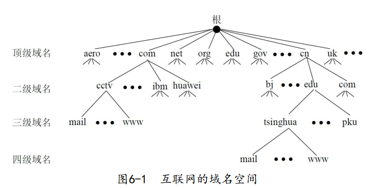
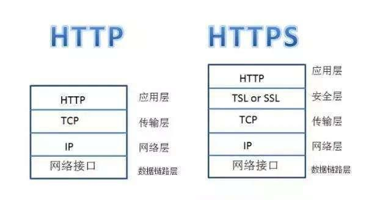

[toc]

&emsp;
&emsp;
# 1. GET 和 POST
&emsp;&emsp; HTTP最早被用来做浏览器与服务器之间交互HTML和表单的通讯协议；后来又被被广泛的扩充到接口格式的定义上。所以在讨论GET和POST区别的时候，需要现确定下到底是浏览器使用的GET/POST还是用HTTP作为接口传输协议的场景。
## 1.1 浏览器的 GET和POST

## 1.2 接口中的 GET和POST

&emsp;
&emsp;
# 2. 浏览器从输入 URL 开始到页面显示内容，中间发生了什么？
基本过程：
> (1) DNS解析域名，获取ip端口 
> (2) 建立tcp链接 
> (3) http发送请求 
> (4) 服务器处理请求 
> (5) 服务器端返回数据 
> (6) 关闭tcp链接 
> (7) 浏览器解析html 
> (8) 浏览器布局渲染TODO:
> 
详细过程：[浏览器从输入 URL 开始到页面显示内容，中间发生了什么？](https://www.nowcoder.com/exam/interview/detail?questionClassifyId=0&questionId=2412585&questionJobId=161&type=1)

&emsp;
&emsp;
# 3. 说说 HTTP 状态码及其含义
&emsp;&emsp; HTTP 状态码由三个十进制数字组成，第一个十进制数字定义了状态码的类型。响应分为五类：信息响应(100–199)，成功响应(200–299)，重定向(300–399)，客户端错误(400–499)和服务器错误 (500–599)：
| 分类  | 分类描述                                         |
| ----- | ------------------------------------------------ |
| `1**` | 信息响应，服务器收到请求，需要请求者继续执行操作 |
| `2**` | 成功响应，操作被成功接收并处理                   |
| `3**` | 重定向，需要进一步的操作以完成请求               |
| `4**` | 客户端错误，请求包含语法错误或无法完成请求       |
| `5**` | 服务器错误，服务器在处理请求的过程中发生了错误   |

&emsp;
&emsp;
# 4. 解释一下URL `https://www.tsinghua.edu.cn/zsjy.htm` 
网站的URL会分为两部分：
> ① 通信协议
> ② 域名地址
> 
|            |                             |
| ---------- | --------------------------- |
| `https`    | 使用的应用层通讯协议        |
| `www`      | 万维网World Wide Web        |
| `tsinghua` | 三级域名                    |
| `edu`      | 二级域名(也有顶级域名`edu`) |
| `cn`       | 顶级域名                    |
| `zsjy.htm` | 路径名                      |

  

  <b> 互联网的域名空间 </b>  

&emsp;
&emsp;
# 5. HTTP 和 HTTPS 的区别是？
先看看他俩的名字
| 缩写  | 全称                               | 中文               |
| ----- | ---------------------------------- | ------------------ |
| HTTP  | Hyper Text Transfer Protocol，HTTP | 超文本传输协议     |
| HTTPS | Hypertext Transfer Protocol Secure | 超文本传输安全协议 |
可以看到的是`HTTPS`多了一个`S`，这个`S`是`Secure`的意思，这也是他们之间的最核心的区别。

首先来谈谈HTTP的缺陷：
> &emsp; ① 请求信息明文传输，容易被窃听截取；
> &emsp; ② 数据的完整性未校验，容易被篡改；
> &emsp; ③ 没有验证对方身份，存在冒充危险；
> 
为了解决上述HTTP存在的问题，HTTPS 出现了：
> &emsp;&emsp; HTTPS 使用了`SSL/TLS`协议进行了加密处理，验证服务器的身份，并为浏览器和服务器之间的通信进行加密。
> 

  

SSL又是什么？
&emsp;&emsp; **SSL（Secure Socket Layer，安全套接字层）** 位于 运输层与应用层之间，为数据通讯提供安全支持。
&emsp;&emsp; **TLS（Transport Layer Security，传输层安全）** 是更为安全的升级版SSL。

&emsp;
&emsp;
# 6. 