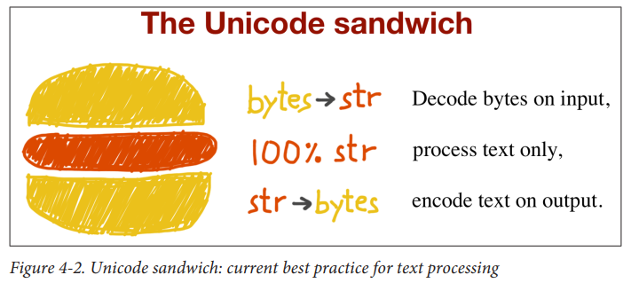

- [1. 编码和解码](#1-编码和解码)
	- [1.1 编解码器(codec/'kodɛk/)](#11-编解码器codeckodɛk)
	- [1.2 编解码问题](#12-编解码问题)
		- [1.2.1 有哪些编码错误？](#121-有哪些编码错误)
	- [Unicode 三明治](#unicode-三明治)
	- [不依赖默认编码](#不依赖默认编码)

&emsp;
&emsp;
&emsp; 
# 1. 编码和解码
## 1.1 编解码器(codec/'kodɛk/)
&emsp;&emsp; Python 自带了超过 100 种编解码器（codec, encoder/decoder），用于在文本和字节之间相互转换。 每个编解码器都有一个名称， 如 'utf_8'， 而且经常有几个别名， 如 'utf8'、 'utf-8' 和 'U8'。 这些名称可以传给 `open()、str.encode()、bytes.decode()`等函数的 `encoding` 参数。

## 1.2 编解码问题
### 1.2.1 有哪些编码错误？
① `UnicodeEncodeError`
② `UnicodeDecodeError`
③ `SyntaxError: (unicode error)`

## Unicode 三明治
书中配图如下：

  

解读：
> ① `bytes → unicode` ：尽早 字节序列解码成字符串；
> ② `process text only` : 三明治中的“肉片”是程序的业务逻辑，在这里只能处理字符串对象；
> ③ `unicode → bytes` ：尽量晚地把字符串编码成字节序列显示编码。
> 

## 不依赖默认编码
&emsp;&emsp; 需要在多台设备中或多种场合下运行的代码，一定不能依赖默认编码。打开文件时始终应该明确传入 `encoding=` 参数，**因为不同的设备使用的默认编码可能不同**，有时隔一天也会发生变化。
&emsp;&emsp; 如果遵从 Unicode 三明治的建议， 而且始终在程序中显式指定编码， 那将避免很多问题。 

