- [1. 可迭代对象(Iterable)](#1-可迭代对象iterable)
  - [1.1 什么是 可迭代对象？](#11-什么是-可迭代对象)
  - [1.2 可迭代对象 有何共同点？或者说可迭代对象必须含有什么特征？](#12-可迭代对象-有何共同点或者说可迭代对象必须含有什么特征)
  - [1.3 如何判断一个对象 是否 可迭代对象？](#13-如何判断一个对象-是否-可迭代对象)
    - [1.3.1 几种判断方法](#131-几种判断方法)
    - [1.3.2 总结](#132-总结)
  - [1.4 如何自定义 可迭代类型A？](#14-如何自定义-可迭代类型a)
- [2. 迭代器(iterator)](#2-迭代器iterator)
  - [2.1 什么是迭代器？](#21-什么是迭代器)
  - [2.2 如何判断一个对象是否 迭代器？](#22-如何判断一个对象是否-迭代器)
  - [2.3 迭代器 和 其它可迭代对象(序列和字典等) 之间的有什么区别？又有什么联系？](#23-迭代器-和-其它可迭代对象序列和字典等-之间的有什么区别又有什么联系)
    - [2.3.1 区别](#231-区别)
    - [2.3.2 联系](#232-联系)
  - [2.4 `__next__`方法的作用是？](#24-__next__方法的作用是)
  - [2.5 如何生成迭代器？](#25-如何生成迭代器)
  - [2.6 迭代器 存在的 意义(作用) 是什么？](#26-迭代器-存在的-意义作用-是什么)
- [3. 生成器(generator)](#3-生成器generator)
  - [3.1 生成器基础](#31-生成器基础)
    - [3.1.1 什么是生成器？它的作用是？](#311-什么是生成器它的作用是)
    - [3.1.2 生成器有什么优点？](#312-生成器有什么优点)
  - [3.2 生成器与迭代器的关系](#32-生成器与迭代器的关系)
  - [3.3 如何获得一个生成器？（生成器的定义方式）](#33-如何获得一个生成器生成器的定义方式)
    - [3.3.1 使用 生成器表达式(又称为生成器推导)](#331-使用-生成器表达式又称为生成器推导)
    - [3.3.2 使用函数(生成器函数)](#332-使用函数生成器函数)
  - [3.4 生成器 和 迭代器 是什么关系？](#34-生成器-和-迭代器-是什么关系)
  - [3.5 如何访问一个生成器](#35-如何访问一个生成器)
  - [3.6 生成器函数的工作原理（执行流程）](#36-生成器函数的工作原理执行流程)
    - [3.6.1 如何区分 普通函数 和 生成器函数？](#361-如何区分-普通函数-和-生成器函数)
    - [3.6.2 生成器的工作原理](#362-生成器的工作原理)
    - [3.6.3 总结：](#363-总结)
  - [3.7 生成器对象的专属方法](#37-生成器对象的专属方法)
    - [3.7.1 生成器有哪些专属方法？](#371-生成器有哪些专属方法)
    - [3.7.2 `send()` 方法](#372-send-方法)
      - [(1) `send()`的使用](#1-send的使用)
      - [(2) `send()`的作用](#2-send的作用)
      - [(3) `send()`和`next()`的差异](#3-send和next的差异)
      - [(4) 使用`send()`的注意事项](#4-使用send的注意事项)
    - [3.7.3 `throw()`方法](#373-throw方法)
    - [3.7.4 `close()` 方法](#374-close-方法)
- [4.`for ... in ...`](#4for--in-)
  - [4.1 当调用`for`循环 遍历一个 可迭代对象时，解释器做些哪些工作？](#41-当调用for循环-遍历一个-可迭代对象时解释器做些哪些工作)
  - [4.2 如何让自定义的类支持`for ... in ...`操作？](#42-如何让自定义的类支持for--in-操作)
- [5. `yiled from`](#5-yiled-from)
  - [5.1 `yiled from`的使用](#51-yiled-from的使用)
  - [5.2 `yiled from`的原理](#52-yiled-from的原理)
  - [5.3 `yiled from`的优势](#53-yiled-from的优势)


&emsp;
&emsp; 
## 1. 可迭代对象(Iterable)
### 1.1 什么是 可迭代对象？
&emsp;&emsp; Python中有一类工具叫做**迭代工具**，他们能从左至右扫描对象。这包括了for循环、列表解析、in成员关系测试以及map内置函数等。
&emsp;&emsp; 而**可迭代对象**，顾名思义就是可以用在上述迭代工具环境中，通过一次次迭代不断产生结果的对象。

### 1.2 可迭代对象 有何共同点？或者说可迭代对象必须含有什么特征？
&emsp;&emsp; Python中的 可迭代对象 并不是指某种具体的数据类型，它是指实现了 `__iter__()`方法 或是 实现了序列语义`__getitem__( )`方法并定义了一个返回序列长度的`__len__()` 方法 的任意自定义类对象。
**① `__iter__()`方法**
&emsp;&emsp; `__iter__`方法返回一个指向该对象的迭代器

**② `__getitem__( )`方法**
&emsp;&emsp; `__getitem__( )`方法 是让对象可以通过 `obj[index]` 的方式访问实例中的元素：

以下都是可迭代对象：

```mermaid
graph LR
A[可迭代对象] 
    A --> D(迭代器)
    A --> E(内置类型)
    A --> L(自定义类型)

    L --> N["定义序列语义__getitem__( )方法并定义了一个返回序列长度的__len__()方法的类"]
    L --> M["定义了__iter__()方法的类"]

    E --> F{序列}
    E --> K{字典}
    E --> O{"open()打开文件时返回的文件句柄"}    

    F --> G[字符串]
    F --> H[列表]
    F --> I[元组]
    F --> J[集合]            
```


### 1.3 如何判断一个对象 是否 可迭代对象？
#### 1.3.1 几种判断方法
**有两种方法可以判断：**
&emsp; ① 利用`collections.Iterable` 和 `isinstance()`(**此方法不太准，不推荐**)：
```python
from collections import Iterable 
isinstance(obj, Iterable) 
```

&emsp; ② 看该对象是否可以通过`iter()`返回迭代器(**推荐这个方法**)：
&emsp; &emsp; 对于哪些只定义了`__getitem__( )`方法的对象，用`isinstance()`无法判断，可以通过对其调用`iter()`函数，看其是否可以返回迭代器：
```python
#自定义一个实现__getitem__方法的序列
class A():
    def __init__(self, *args):
        self.args = args 

    def __getitem__(self, i): 
        return self.args[i]

    def __len__(self):
        num = 0
        while True:
            try:
                self.args[num]
                num += 1
            except:
                return num

a = A(1,2,3,'ss','dd')

#可以看到实例化后的对象是可以通过 for...in 进行循环访问的，表示其是可迭代对象。
print("items in a: ", end="")
for i in range(len(a)):
    print(a[i], end=", ")
print()

#我们使用collections模块的Iterable进行判断：
from collections import Iterable,Iterator

print("isinstance(a, Iterable)      : ", isinstance(a, Iterable))
#结果出乎意料，判定对象a不是可迭代对象，为什么呢？
#因为collections模块的Iterable自动忽略了对象的__getitem__方法，只根据对象是否有__iter__方法进行判断。一般来说，标准的序列均实现了__iter__方法。
#既然上面方法无法判断具有__getitem__方法的序列是否是可迭代对象，那又该如何判断呢？
#可以使用iter()函数，如果不报错，说明是可迭代对象，报错就不是
a_iter = iter(a)
print("isinstance(a_iter, Iterable) : ", isinstance(a_iter, Iterable))
print("isinstance(a_iter, Iterator) : ", isinstance(a_iter, Iterator))
```
输出结果：
```
items in a: 1, 2, 3, ss, dd, 
isinstance(a, Iterable)      :  False
isinstance(a_iter, Iterable) :  True
isinstance(a_iter, Iterator) :  True
```
**结果分析：**
&emsp;&emsp;  ① 我们可以对 `A`类型的对象`a`进行`for`遍历，说明`A`属于可迭代类型；
&emsp;&emsp;  ② 但是`isinstance(a, Iterable)`返回的却是`False`，那是因为`collections`模块的`Iterable`自动忽略了对象的`__getitem__`方法，只根据对象是否有`__iter__`方法进行判断。一般来说，标准的序列均实现`了__iter__`方法。
&emsp;&emsp;  ③ `a_iter` 是`iter(a)`的返回对象，这更说明`A`是可迭代对象类型；
&emsp;&emsp;  ④ `isinstance(a_iter, Iterable)` 和 `isinstance(a_iter, Iterator)`返回的都是`True`，这说明可以通过`iter()`返回迭代器 的类型都是 可迭代类型。
#### 1.3.2 总结
&emsp;&emsp;  可迭代对象支持内置函数iter，通过对可迭代对象调用`iter()`函数，会返回一个迭代器，因此最稳妥的方法就是对 需要判断的对象调用`iter()`函数，然后再对其返回值调用`isinstance(a_iter, Iterator)`。

### 1.4 如何自定义 可迭代类型A？
有两种方法：
> 方法1：在类`A`中 实现`__iter__()`方法，而且`__iter__()`**必须返回一个迭代器**；
> 方法2：在类`A`中 实现**序列语义**`__getitem__( )`方法，并定义一个**返回序列长度的**`__len__()` 方法。
> 
需要注意的是，`__iter__()`**必须返回一个迭代器**；`__getitem__( )`方法必须是实现了**序列语义**，`__len__()` 方法必须**返回序列长度**。

&emsp;
## 2. 迭代器(iterator)
### 2.1 什么是迭代器？
&emsp;&emsp;  迭代器其实就是一个用来表示一连串数据流的对象，它本身也是一种 可迭代对象，迭代器可以记住遍历位置，其内部有一个状态用于记录迭代所在的位置，以便下次迭代时候能取出正确的元素。迭代器的内部实现了`__iter__`和`__next__`方法：
> `__iter__`：用来返回一个 一个迭代器，其实就是返回自己；
> `__next__`：用来返回可迭代对象的下一个元素(它可以记住遍历位置的对象，其内部有一个状态用于记录迭代所在的位置)；
> 

### 2.2 如何判断一个对象是否 迭代器？
`isinstance(a_iter, Iterator)`，其中`Iterator`来自`collections`模块：
```python
from collections import Iterator

print("isinstance(a_iter, Iterator) : ", isinstance(a_iter, Iterator))
```

### 2.3 迭代器 和 其它可迭代对象(序列和字典等) 之间的有什么区别？又有什么联系？
#### 2.3.1 区别
>  需要实现`__iter__`方法
> 和可迭代对象不同的是的是，迭代器 不仅要实现`__iter__`方法(或同时实现`__getitem__( )`和`__len__()`)，还需要实现`__next__`方法
> 
```python
s = set([1, 2, 3, 4, 5])
print(next(s))
```
报错如下：
```
Traceback (most recent call last):
  File "test.py", line 3, in <module>
    print(next(s))
TypeError: 'set' object is not an iterator
```
从报错信息可以知道，`set`对象 不是 迭代器。
**总结：**
&emsp;&emsp; 迭代器 和 序列、字典 一样，都是可迭代对象，但是迭代器比序列和字典多实现了一个方法：`__next__` 

#### 2.3.2 联系
&emsp;&emsp; 可迭代对象 通过`iter()`函数 可以生成迭代器，当把 可迭代对象 作为参数传给 内置函数 `iter()` 时，该函数会返回该对象的迭代器：

写段代码验证：
```python
s = set([1,2,3,4,5])

# 使用itr()方法将 可迭代对象s 获取 迭代器对象it
it = iter(s)

# 对于 迭代器对象it，我们可以调用next()方法进行迭代：
print(next(it))
print(next(it))
print(next(it))
```
输出结果：
```
1
2
3
```
结果证明的前面的结论。

### 2.4 `__next__`方法的作用是？
&emsp;&emsp; `__next__`可以用来对迭代器进行迭代访问：对**迭代器对象**调用 `__next__()`方法将返回迭代器的下一个元素(迭代器内部会记住上一次迭代到哪了)，当到达迭代器的尾部时，会引发`StopIteration`异常：
```python
s = set([1,2,3])

# 使用itr()方法将 可迭代对象s 获取 迭代器对象it
it = iter(s)

# 对于 迭代器对象it，我们可以调用next()方法进行迭代：
print(next(it))
print(next(it))
print(next(it))
print(next(it))
```
输出结果：
```
1
2
3
Traceback (most recent call last):
  File "d:\code_practice\practice.py", line 10, in <module>
    print(next(it))
StopIteration
```

### 2.5 如何生成迭代器？
生成迭代器有两种方法：
> ① 使用内置的`iter(object[, sentinel])`函数；
> ② 直接调用可迭代对象的`__iter__()`方法；
> 

值得注意的是，上面两种方式表示可以生成迭代器，但并不是使用这两个函数就一定生成迭代器，这取决于运行这两个函数返回的是什么

### 2.6 迭代器 存在的 意义(作用) 是什么？
&emsp;&emsp; 在说明迭代器存在的意义之前，我们需要引入一个容器的概念。什么是容器？容器是众多对象（在python中对象的抽象是类class）的集合，根据存储方式不同，python可分为四种容器：
> ① 列表(list): 对象以队列方式进行存储 
> ② 元组(tuple):对象以队列方式进行存储，和列表一样，只是存储数据后，不可更改， 
> ③ 集合(set): 对象以无序的方式进行存储 
> ④ 字典(dict):对象以键值对映射的方式存储数据
> 
在编程中，最常见的操作就是从这些容器中拿出数据。而容器一般是不具备取出数据的功能的。我们平时取出数据的操作实际上是先经过`__iter__()`方法转为迭代器，之后再通过`__next__()`方法拿取的（参考`for`循环,`map()`,`filter()`）。可以说迭代器赋予了容器取出数据的能力，但迭代器每次调用`__next__()`方法只能取出一个数据，这种方法显然是很笨拙的，于是引入`for`循环，每次循环自动调用`__next__()`方法，这使得访问容器中的对象变得十分方便。
&emsp;&emsp; 举个例子，迭代器的存在有点像指针。迭代器具有`__iter__()`方法(可迭代对象)就好比具备存放指针的资格，而`__next__()`方法，表示指针调度的规则。每次访问容器中的元素，首先调用`__iter__()`方法在容器元素头部放一个指针，此指针不指向任何元素，位于所有元素前面，为待操作状态，随时准备被调用。然后通过`__next__()`方法制定的规则来调度这个指针，使其指向不同的对象，指针所指之处便是所访问对象。此指针默认有一些属性：只能向前，不能回退，当没有元素时，抛出`StopIteration`,过程结束，过程如图：
<div align="center">  </div>

**使用迭代器一个明显的优势是：减少内存占用**：
> **不使用迭代器**：如果我们想访问一个容器中的所有元素，就需要将所有的元素都加载到内存中，然后一次性打印，对于少量元素来说，这无关紧要，但当数据量非常大时，这种做法将占用很大的内存，影响程序性能。
> **使用迭代器**：我们访问一个容器中的所有元素，不会将所有元素都加载出来，而是一个一个的加载，然后打印，这样会极大的减少内存的占用。
> 

&emsp;
## 3. 生成器(generator)
### 3.1 生成器基础
#### 3.1.1 什么是生成器？它的作用是？
&emsp;&emsp; 生成器是一个**用于创建迭代器**的简单而强大的工具。

#### 3.1.2 生成器有什么优点？
&emsp;&emsp; 我们都知道列表中的数据是存在内存中的，数量少还好，如果数量巨大（如1000w条）的话可能会挤爆内存，如果列表元素梦按照某种算法推算出来，那我们就可以在循环的过程中不断推算出后续的元素，这样就不必创建完整的list，从而节省大量的空间。二生成器就是用来完成这个工作的。
&emsp;&emsp; 简单一句话：想要得到庞大的数据，又想让它占用空间少，那就用生成器！

### 3.2 生成器与迭代器的关系
&emsp;&emsp; 生成器是一种迭代器(而且生成器类 是 迭代器类 的一个子类)，因为生成器对象都有 `__iter__` 和 `__next__` 方法，且 `__iter__` 方法返回自身。我们可以来验证一下：
**验证方式一**：使用 `isinstance` 和抽象基类 `collections.abc.Iterator` 验证。
```python
from collections.abc import Iterator
g = (i for i in 'Hello World')
print(isinstance(g, Iterator))
```
运行结果：
```
True
```
**结果分析：**
&emsp;&emsp; 显然，生成器是迭代器的一种。
**验证方式二**：使用 `dir(g)` 查看生成器 `g` 内部方法，并使用 `iter(g)` 检查返回值：
```python
print(dir(g))
print(id(g))
print(id(iter(g)))
print(iter(g) is g)
```
运行结果：
```
['__class__', '__del__', '__delattr__', '__dir__', '__doc__', '__eq__', '__format__', '__ge__', '__getattribute__', '__gt__', '__hash__', '__init__', '__init_subclass__', '__iter__', '__le__', '__lt__', '__name__', '__ne__', '__new__', '__next__', '__qualname__', '__reduce__', '__reduce_ex__', '__repr__', '__setattr__', '__sizeof__', '__str__', '__subclasshook__', 'close', 'gi_code', 'gi_frame', 'gi_running', 'gi_yieldfrom', 'send', 'throw']
2531698317840
2531698317840
True
```
**结果分析：**
&emsp;&emsp; 可以看到的是，生成器 `g` 内部确实有`__iter__` 和 `__next__` 方法，而且`__iter__` 方法返回自身，显然是生成器`g`是一个迭代器。

**验证方式三**：使用 `issubclass` 判断 `Generator` 是否是 `Iterator` 的子类。
```python
from collections.abc import Generator
from collections.abc import Iterator

print(issubclass(Generator, Iterator))
```
运行结果：
```
True
```
**结果分析：**
&emsp;&emsp; 显然，生成器类 是 迭代器类 的一个子类。


### 3.3 如何获得一个生成器？（生成器的定义方式）
#### 3.3.1 使用 生成器表达式(又称为生成器推导)
把一个列表生成式的`[]`改成`()`，就创建了一个 生成器：
```python
L = [x * x for x in range(6)]
print(L)

G = (x * x for x in range(6))
print(G)
```
输出结果：
```
[0, 1, 4, 9, 16, 25]
<generator object <genexpr> at 0x00000232B24F9A10>
```
根据上面的代码可知，创建`L`和`G`的区别仅在于最外层的`[]`和`()`，`L`是一个`list`，而`G`是一个`generator`。

#### 3.3.2 使用函数(生成器函数)
&emsp;&emsp; 生成器非常强大。如果推算的算法比较复杂，用类似列表生成式的`for`循环无法实现的时候，还可以用函数来实现。比如，著名的斐波拉契数列（Fibonacci），除第一个和第二个数外，任意一个数都可由前两个数相加得到：
> 1, 1, 2, 3, 5, 8, 13, 21, 34, ...
> 
斐波拉契数列用列表生成式写不出来，但是，用函数把它打印出来却很容易：
```python
def fib(max):
    n, a, b = 0, 0, 1
    while n < max:
        print(b)
        a, b = b, a + b
        n = n + 1

fib(6)
```
上面的函数和生成器仅一步之遥。要把`fib()`函数变成生成器，只需要把`print(b)`改为`yield b`就可以了：
```python
def fib(max):
    n, a, b = 0, 0, 1
    while n < max:
        yield b
        a, b = b, a + b
        n = n + 1

print(fib(6))
```
输出结果：
```
<generator object fib at 0x000001995FE89A10>
```
这就是定义生成器的另一种方法。如果一个函数定义中包含`yield`关键字，那么这个函数就不再是一个普通函数，而是一个生成器：

### 3.4 生成器 和 迭代器 是什么关系？
简单点理解，生成器就是 迭代器的一种：
<div align="center">  </div>

### 3.5 如何访问一个生成器
&emsp;前面已经提到，生成器其实就是迭代器的一种，因此我们之前是怎么访问迭代器，就可以怎么访问生成器：
> &emsp;&emsp; ① 使用`__next__`方法；
> &emsp;&emsp; ② 使用`for ... in ...`等迭代工具
> 
**① 使用`__next__`方法；**
```python
G = (x * x for x in range(6))
print(G)

# 通过 __next__ 访问
print(next(G))
print(next(G))
print(next(G))
print(next(G))
print(next(G))
print(next(G))
print(next(G))
```
输出结果：
```
0
1
4
9
16
25
Traceback (most recent call last):
  File "d:\code_practice\practice.py", line 11, in <module>
    print(next(G))
StopIteration
```
**② 使用`for ... in ...`等迭代工具**
```python
G = (x * x for x in range(6))
print(G)

# 通过 for循环 访问：
for i in G:
    print(i)
```
输出结果：
```
0
1
4
9
16
25
```

### 3.6 生成器函数的工作原理（执行流程）
#### 3.6.1 如何区分 普通函数 和 生成器函数？
&emsp;&emsp; 有`yield`语句的就是 生成器函数。
#### 3.6.2 生成器的工作原理
&emsp;&emsp; 生成器的写法类似于标准的函数，但当它们要返回数据时会使用`yield`语句。每次在生成器上调`用next()` 时，它会从上次离开的位置恢复执行（它会记住上次执行语句时的所有数据值）。
&emsp;&emsp; 生成器 和 函数 的执行流程不一样：
> 函数是顺序执行，遇到`return`语句或者最后一行函数语句就返回。
> 而变成generator的函数，在每次调用`next()`的时候执行，遇到`yield`语句返回，**再次执行时**从上次返回的`yield`语句处继续执行。
> 
举个简单的例子，定义一个generator，依次返回数字1，3，5：
```python
def odd():
    print('step 1')
    yield 1
    print('step 2')
    yield 3
    print('step 3')
    yield 5

o = odd()
print(next(o))
print(next(o))
print(next(o))
print(next(o))
```
输出结果：
```
step 1
1
step 2
3
step 3
5
Traceback (most recent call last):
  File "d:\code_practice\practice.py", line 13, in <module>
    print(next(o))
StopIteration
```
**结果分析**：
&emsp;&emsp; 可以看到，`odd`不是普通函数，而是generator，在执行过程中，遇到`yield`就中断，下次又继续执行。执行3次`yield`后，已经没有`yield`可以执行了，所以，第4次调用`next()`就报错。

**再来看前面的 生成器`fib`：**
```python
def fib(max):
    print("Inside of fib()")
    n, a, b = 0, 0, 1
    while n < max:
        yield b
        a, b = b, a + b
        n = n + 1


for i in fib(6):
    print(i)
```
输出结果：
```
Inside of fib()
1
1
2
3
5
8
```
**结果分析**
&emsp;&emsp; 我们可以看到，`print("Inside of fib()")`只调用了一次，也证实了 在对生成器进行迭代的时候 **它会从上次离开的位置恢复执行（它会记住上次执行语句时的所有数据值）**。
#### 3.6.3 总结：
&emsp;&emsp; 含有`yield`的函数就是生成器，对生成器函数进行迭代的时候，生成器遇到`yield`就返回，**下次迭代时代码会从`yield`的下一条语句开始执行**，直到没有可以数据可以返回时就抛出`StopIteration`异常。
&emsp;&emsp; 对于生成器函数的调用一般不会直接用`next()`，而是借助`for ... in ...`之类的迭代工具来简化操作。

### 3.7 生成器对象的专属方法
#### 3.7.1 生成器有哪些专属方法？
&emsp;&emsp; 咱们之前已经提到，生成器都是迭代器，但是生成器还有一些专属方法，具体有哪些方法可以通过差集运算来查看：
```python
from collections.abc import Generator
from collections.abc import Iterator

print(set(dir(Generator)) - set(dir(Iterator)))
```
运行结果：
```
{'send', 'close', 'throw'}
```
**结果分析：**
所以，生成器的几个专属方法如下：
> ① send()
> ② throw()
> ③ close()
> 

#### 3.7.2 `send()` 方法
##### (1) `send()`的使用
`generator.send(value)`
* 作用：向生成器发送一个值，随后恢复执行。
* `value` 参数是 `send` 方法向生成器发送的值，这个值会作为当前所在的 `yield` 表达式的结果。
* 随后生成器恢复执行，直到下一个 `yield`，把它后面的值作为 `send` 方法的结果返回。

如果恢复执行后再也没有 `yield` 语句，生成器退出，并抛出 `StopIteration` 异常。

如果一开始使用 `send` 启动生成器，必须使用 `None` 作为参数，因为一开始没有可以接收值的 `yield` 表达式。
**其实可以这么理解`send()`：**
> send的执行分三步：==发送值、恢复执行、返回值==，而 `next` 只有两步：==恢复执行、返回值==，`send` 就像是升级版的 `next`，比起 `next` 它多了发送值到生成器内的功能。
> `g.send(None)` 和 `next(g)` 等价，也就是说，发送一个 `None` 相当于省去了发送值的这一步骤。
> 
上面说起来比较抽象，来看下面的例子：
```python
def MyGenerator():
    value = (yield 1)
    value = (yield value)
 
 
gen = MyGenerator()
print(next(gen))
print(gen.send(2))
print(gen.send(3))
```
运行结果：
```
1
2
Traceback (most recent call last):
  File "d:\code_practice\practice.py", line 9, in <module>
    print(gen.send(3))
StopIteration
```
**结果分析：**
上面代码的运行过程如下:
&emsp;&emsp; 当调用`next(gen)`方法时，首先会执行`MyGenerator`方法的`yield 1`语句。由于是一个`yield`语句，因此方法的执行过程被挂起，而`next`方法返回值为`yield`关键字后面表达式的值，即为`1`。
&emsp;&emsp; 当调用`gen.send(2)`方法时，python首先恢复`MyGenerator`方法的运行环境。同时，将表达式`yield 1`的返回值定义为`send`方法参数的值，即为`2`。这样，接下来`value=(yield 1)`这一赋值语句会将`value`的值置为`2`。继续运行会遇到`yield value`语句。因此，`MyGenerator`方法再次被挂起。同时，`send`方法的返回值为`yield`关键字后面表达式的值，也即`value`的值，为`2`。
&emsp;&emsp; 当调用`send(3)`方法时先恢复`MyGenerator`方法的运行环境。同时，将表达式`(yield value)`的返回值定义为`send`方法参数的值，即为`3`。这样，接下来`value=(yield value)`这一赋值语句会将`value`的值置为`3`。继续运行，`MyGenerator`方法执行完毕，故而抛出`StopIteration`异常。
&emsp;
##### (2) `send()`的作用
&emsp;&emsp; `send()`一般用来和生成器进行交互，因为在执行`send`方法时会把上一次挂起的`yield`语句的返回值通过参数来设定。
&emsp;
##### (3) `send()`和`next()`的差异
&emsp;&emsp; 总的来说，`send`方法和`next`方法**唯一的区别**是：
> 在执行`send`方法会首先把上一次挂起的`yield`语句的返回值通过参数设定，从而实现与生成器方法的交互。
> 
**总结一下就是：**
> &emsp;&emsp; `send`方法和`next`方法**唯一的区别**是在执行`send`方法多了发送值这一步，换句话说，如果在`send`的时候将`value`指定为None，则`send`和`next`等价，即：`g.send(None)` 和 `next(g)` 等价。
> 
&emsp;
##### (4) 使用`send()`的注意事项
&emsp;&emsp; 需要注意的是，在一个生成器对象没有执行`next`方法之前，由于没有`yield`语句被挂起，所以执行send方法会报错。例如：
```python
def MyGenerator():
    value = (yield 1)
    value = (yield value)
 
 
gen = MyGenerator()
print(gen.send(1))
```
运行结果：
```
Traceback (most recent call last):
  File "d:\code_practice\practice.py", line 7, in <module>
    print(gen.send(1))
  File "d:\code_practice\practice.py", line -1, in MyGenerator
TypeError: can't send non-None value to a just-started generator
```
显然，报错信息告诉了我们：“不能将非None类型的值传给一个刚启动的生成器。”。但是，传一个`None`过去就没有问题：
```python
def MyGenerator():
    value = (yield 1)
    value = (yield value)
 
 
gen = MyGenerator()
print(gen.send(None)) # 传过去的是None
```
运行结果：
```
1
```
**因为当`send`方法的参数为`None`时，它与`next`方法完全等价。**但是注意，虽然上面的代码可以接受，但是不规范。所以，在调用`send`方法之前，还是先调用一次`next`方法为好。

#### 3.7.3 `throw()`方法
`generator.throw(type[, value[, traceback]])`
> 作用：在 ==生成器暂停的地方== 抛出类型为 `type` 的异常，并返回下一个 `yield` 的返回值。
> 如果生成器函数没有捕获并处理传入的异常，或者说抛出了另一个异常，那么该异常会被传递给调用方。
> 如果生成器退出时还没有 `yield` 新值，则会抛出 `StopIteration` 异常。
> 
使用`throw`方法时，可能的情况有三种：
> ① 捕获并处理传入的异常，得到下一个 `yield` 的返回值。
> ② 没有捕获并处理 throw 传入的异常，异常会回传给调用方
> ③ 生成器退出时没有 yield 新值，会抛出 StopIteration 异常。
> 
**① 捕获并处理传入的异常，得到下一个 `yield` 的返回值**
```python
def gen():
    n = 0
    while True:
        try:
            yield n
            n += 1
        except ZeroDivisionError:
            print('捕获到了 ZeroDivisionError')
            print('此时的 n 为：%s' % n)

g = gen()
ret = next(g)
print('第一次 yield 的返回值：%s\n' % ret)

ret = g.throw(ZeroDivisionError)
print('第二次 yield 的返回值：%s\n' % ret)

ret = next(g)
print('第三次 yield 的返回值：%s' % ret)
```
运行结果：
```
第一次 yield 的返回值：0

捕获到了 ZeroDivisionError
此时的 n 为：0
第二次 yield 的返回值：0

第三次 yield 的返回值：1
```
**结果分析：**
**为什么第二次`yield`的返回值和第一次`yield`一样，都是`0`？**
&emsp;&emsp; 我这是因为在第一次 `yield` 的地方抛出了 `ZeroDivisionError` 异常，而该异常被 `except` 捕获，从而跳过了 `n += 1` 的步骤。在 `except` 异常处理器中也可以看到，`n` 并没有改变，仍然是 `0`
而且从上面的第三次`yield`可以看到，如果通过 `throw` 传入的异常被捕获的话，生成器能够恢复执行直到下一个 `yield。`

**② 没有捕获并处理 throw 传入的异常，异常会回传给调用方**

```python
def gen():
    n = 0
    while True:
        yield n
        n += 1

g = gen()

# 位置① 
ret1 = next(g)
print('第一次 yield 的返回值：%s\n' % ret1)

# 位置②
try:
    ret2 = g.throw(ZeroDivisionError)  # ret2 并没有收到任何值
except ZeroDivisionError:
    print('调用方捕获到 ZeroDivisionError 异常')
    print(sys.exc_info(), end='\n\n')

# 位置③
# 因为赋值没有发生就抛出了异常，所以变量 ret2 还不存在
try:
    print(ret2)
except NameError:
    print('捕获到了 NameError')
    print(sys.exc_info())

# 位置④
print('\n尝试再次从生成器中获取值')
print(next(g))
```
运行结果：
```
第一次 yield 的返回值：0

调用方捕获到 ZeroDivisionError 异常
(<class 'ZeroDivisionError'>, ZeroDivisionError(), <traceback object at 0x000001D203B40700>)

捕获到了 NameError
(<class 'NameError'>, NameError("name 'ret2' is not defined"), <traceback object at 0x000001D203B40700>)

尝试再次从生成器中获取值
Traceback (most recent call last):
  File "d:\code_practice\practice.py", line 28, in <module>
    print(next(g))
StopIteration
```
**结果分析：**
&emsp;&emsp; **位置①**： 第一次调用`next`，`yield`正常返回，此时`n`为`0`；
&emsp;&emsp; **位置②**： 通过`throw`向生成器`g`抛出异常，但是生成器函数里面没有处理这个异常，因此异常抛回给了调用方；
&emsp;&emsp; **位置③**： 在 位置② 因为抛出了异常，所以变量 `ret2` 还不存在，因此会抛出`NameError`；
&emsp;&emsp; **位置④**： 因为生成器`g`在位置②已经抛出了异常，所以对它进行调用会一直返回`StopIteration`
从上面的输出我们可以知道：
> 对于已经通过抛出异常而退出的生成器再使用 `next(g)` 会持续抛出 `StopIteration` 异常
> 

**③  生成器退出时没有 yield 新值，会抛出 StopIteration 异常。**
```python
def gen():
    try:
        # 注意是在当前暂停的 yield 处抛出异常
        # 所以要在这里捕获
        yield 1
    except Exception as e:
        print('在生成器内部捕获了异常')
        print(e.args)
        print('处理完毕，假装什么也没发生\n')

g = gen()

# 位置① 
print(next(g), end='\n\n')

# 位置① 
g.throw(TypeError, '类型错误~')
```
运行结果：
```
1

在生成器内部捕获了异常
('类型错误~',)
处理完毕，假装什么也没发生

Traceback (most recent call last):
  File "d:\code_practice\practice.py", line 16, in <module>
    g.throw(TypeError, '类型错误~')
StopIteration
```
**结果分析：**
&emsp;&emsp; **位置①**： 第一次调用`next`正常返回值`1`；
&emsp;&emsp; **位置②**： 通过`throw`抛出异常，生成器内部也捕获了该异常，但此时生成器没有`yield`一个新值，因此会抛出`StopIteration`异常。

#### 3.7.4 `close()` 方法
`generator.close()`
&emsp;&emsp; **作用**：**在生成器函数暂停的地方** 抛出一个 `GeneratorExit` 异常，但这并不等价于 `generator.throw(GeneratorExit)`，后面会说原因。
&emsp;&emsp; TODO: https://juejin.cn/post/6992917747973750821#heading-11


&emsp;
## 4.`for ... in ...` 
### 4.1 当调用`for`循环 遍历一个 可迭代对象时，解释器做些哪些工作？
&emsp;&emsp; 可迭代对象都可以直接用 `for… in…` 循环访问，这个语句其实做了两件事：
> ① 调用`__iter__()`获得一个迭代器`itr`；
> ② 对前面得到的迭代器`itr`循环调用`__next__()`，不断的依次获取元素，并在捕捉到`StopIteration`异常时确定完成迭代。
> 
以上就是完整的迭代过程。

### 4.2 如何让自定义的类支持`for ... in ...`操作？
给这个类定义一个`__iter__()`函数，这个函数返回一个迭代器：
```python
class ForIn():
    def __init__(self, l):
        self.numbers = l

    def __iter__(self):
        return self.numbers.__iter__()

a = ForIn ([1, 2, 3])

for i in a:
    print(i)
```
输出结果：
```
1
2
3
```


&emsp;
## 5. `yiled from`
### 5.1 `yiled from`的使用
`yiled from`是python3.3引入的新特性，用它可以简化代码：
```python
def gene():
    for c in 'AB':
        yield c  # 遇到yield程序返回循环，下次从yield后面开始。
    for i in range(3):
        yield i 

print(list(gene())) #list内部会预激生成器
```
运行结果：
```
['A', 'B', 0, 1, 2]   
```
上面的代码可以使用`yiled from`来简化：
```python
def gene():
    yield from 'AB'
    yield from range(3)

print(list(gene())) #list内部会预激生成器
```
运行结果：
```
['A', 'B', 0, 1, 2]  
```
**结果分析：**
&emsp;&emsp; 由上面两种方式对比，可以看出，yield from 后面加上可迭代对象，他可以把可迭代对象里的每个元素一个一个的 yield 出来，对比 yield 来说代码更加简洁，结构更加清晰。

### 5.2 `yiled from`的原理
&emsp;&emsp; `yield from x` 表达式对`x`对象做的第一件事是，调用 `iter(x)`获取一个指向`x`的迭代器。所以`x`必须是可迭代对象。

### 5.3 `yiled from`的优势
&emsp;&emsp; ① 使代码更简洁；
&emsp;&emsp; ② 解释器对`yiled from`进行了优化，速度要比用`for`循环迭代要快。