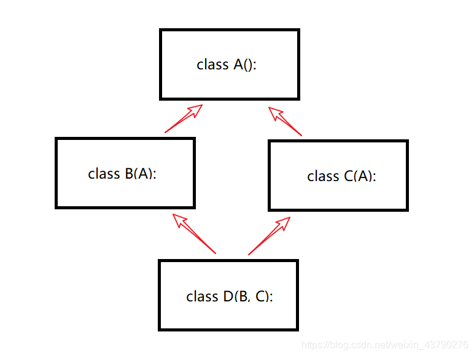

# 1. 类基础
## 1.1 `__init__()`
### (1) `__init__()`的作用是？
&emsp;&emsp; 不是，`__init__()`负责的是初始化数据成员。
### (2) `__init__()`的第一个参数`self`代表的是什么？
&emsp;&emsp; `self`，表示创建的实例本身，而不是类。因此，在`__init__`方法内部，就可以把各种属性绑定到`self`，因为`self`就指向创建的实例本身。
### (3) `__init__()`是构造函数吗？
&emsp;&emsp; 不是，`__init__()`只负责初始化成员，不负责构造对象。具体谁是python类的构造函数，可以看本文后面的笔记。

&emsp;
## 1.2 类的方法
### 1.2.1 类有几种方法？它们各有和特点？
类的内部有三类函数：
| 名称       | 如何定义                                                                           | 谁能调用               |
| ---------- | ---------------------------------------------------------------------------------- | ---------------------- |
| ① 实例方法 | 第一个参数必须是类的实例对象(即`self`)                                             | 只能由实例对象调用     |
| ② 类方法   | 使用装饰器`@classmethod`。第一个参数必须是当前类(即`cls`)                          | 实例对象和类都可以调用 |
| ③ 静态方法 | 使用装饰器`@staticmethod`。形参没有`self`和`cls`，函数体中不能使用实例的属性和方法 | 实例对象和类都可以调用 |

### 1.2.2 如何定义这几种类方法？
<span style= "color:red; font-size:21px; font-weight:bold"> ① 实例方法 </span>
&emsp;&emsp; 在类的内部定义一个函数，该函数的一个参数必须是 `self`, 用来代表的是类的实例：


<span style= "color:red; font-size:21px; font-weight:bold"> ② 类方法 </span>
&emsp;&emsp; 在类的内部定义一个函数，并使用装饰器`@classmethod`，第一参数为`cls`，用来表示类本身。


<span style= "color:red; font-size:21px; font-weight:bold"> ③ 静态方法 </span>
&emsp;&emsp; 在类的内部定义一个函数，使用装饰器`@staticmethod`，不需要`self`和`cls`。

```python
class Example:
    # 实例方法
    def obj_method(self, a):
        print(a)
    
    # 类方法
    @classmethod
    def class_method(cls, a):
        print(a)
    
    @staticmethod
    def static_method(a):
        print(a)
```

### 1.2.3 这几种类方法 在继承类中有何区别？
&emsp;&emsp; 这三类方法都会被子类继承，当然也能被子类重写：
```python
class Father:
    x = "X from father."

    @staticmethod
    def static_print(s):
        print(s)
    
    @staticmethod
    def static_call():
        print('static_call from Father')
        Father.static_print(Father.x)

    @classmethod
    def class_call(cls):
        print('class_call from Father')
        cls.static_print(cls.x)


class Son(Father):
    x = "X from son."

    @staticmethod
    def static_print(s):
        print(s)


s = Son()

s.static_print(Son.x)
print()

s.static_call()
print()

s.class_call()
```
运行结果：
```
X from son.

static_call from Father
X from father.

class_call from Father
X from son.
```

### 1.2.4  `classmethod` 与 `staticmethod`
#### (1) 联系
&emsp;&emsp; 这两个方法的用法是类似的，在上面的例子中大多数情况下，`classmethod`也可以通过`staticmethod`代替，在通过类调用时，这两者对于调用者来说是不可区分的。
#### (2) 区别
&emsp; 这两者的区别在于，`classmethod`增加了一个对实际调用类的引用，这带来了很多方便的地方：
> &emsp;&emsp; ① 方法可以通过`cls`参数判断出自己是通过基类被调用，还是通过某个子类被调用；
> &emsp;&emsp; ② 通过子类调用时，方法可以返回子类的实例而非基类的实例；
> &emsp;&emsp; ③ 通过子类调用时，方法可以调用子类的其他`classmethod`；
> 

&emsp;
## 1.3 类属性和实例属性
### (1) 什么是类属性？实例属性？
&emsp;&emsp; **类属性**又称为类变量， 在整个实例化的对象中是公用的。类变量定义在类中且在函数，和C++类的静态成员变量作用一样。
&emsp;&emsp; 与类变量相对于的变量是 **实例变量(又称 实例属性)**，实例变量就是形如`self.obj`的变量，它只属于该实例。
### (2) 如何定义、使用类变量？
&emsp;&emsp; 如果希望一个变量被 所有该类的实例 共享，就将其定义成一个**类变量**，类变量定义在类中且在函数体的外面，使用的时候的语法为`class_name.member`，来看一个例子：
```python
class Employee(object):
    count = 0
    def __init__(self, name, salary):
        self.name = name
        self.salary = salary
        Employee.count += 1 # 使用的时候要加通过类名

print(Employee.count)
emp_1 = Employee('jack', '8000')
print(Employee.count)
emp_2 = Employee('jack', '10000')
print(Employee.count)
```
运行结果：
```
0
1
2
```
可以看到的是，`Employee.count`是在所有`Employee`对象之间共享的。


&emsp;
&emsp; 
# 2. 访问控制
&emsp;&emsp; 对于公有成员，外面可以随意访问，还能对公有成员变量进行修改，但是一些变量和方法我们可能并不希望用户可以从外部访问，此时就需要进行访问控制。
## 2.1 python有几种访问级别？
&emsp;&emsp; python类的属性只有两种访问级别，也就是`public`和`private`。

## 2.2 私有成员(private)
### 2.2.1 如何声明私有成员？
在变量名前面加上双下划线`__`即可，如`__name`就是一个私有变量。
```python
class MyClass(object):
    def __init__(self):
        # public
        self.name = "MyClass" # public变量
        self.__age = 10       # private变量

    def method_publicted(self): # 一般类方法 public
        print("call public function")

    def __method_private(self): # 私有类方法 private
        print("call private function")

    def call_method_inClass(self):#类内访问public，protected，private方法
        self.method_publicted()
        self.__method_private()
        return

obj.method_publicted()  # 类外直接访问public方法，ok

obj.__method_private() # 类外不允许直接访问private方法，会抛异常
```
运行结果：
```
call public function
Traceback (most recent call last):
  File "d:\code_practice\practice.py", line 27, in <module>
    obj.__method_private() # 类外不允许直接访问private方法，会抛异常
AttributeError: 'MyClass' object has no attribute '__method_private'
```
再来访问一下类成员：
```python
print(obj.name) 
print(obj.__age)
```
运行结果：
```
MyClass
Traceback (most recent call last):
  File "d:\code_practice\practice.py", line 34, in <module>
    print(obj.__age)
AttributeError: 'MyClass' object has no attribute '__age'
```
**结果分析：**
&emsp;&emsp; 可以看到的是，不论是成员变量还是成员函数，只要带有`__`就是私有的，不能直接访问，想要访问只能在类的内部。

### 2.2.2 为什么说python中没有真正意义上的私有成员？
&emsp;&emsp; 因为python的private属性是通过变换属性名称实现的，如果知道了python类的名称变换规则，那用户就可以在任何一个类实例中对其进行访问，而这个类的变换规则是统一的，这个规则被称为 **名称转写(name mangling)**：
> 以双下划线开头，并以最多一个下划线结尾的标识符，例如`__mem`，会被转写为`_classname__mem`，其中`classname`为类名。
> 
这个机制实现起来非常简单，而且很大程度避免了调用者的误访问，但并不能像Java和C++的private限定符那样完全杜绝外部的访问。我们以代码直观展示：
```python
# MyClass类的定义同上
obj = MyClass()
print(obj._MyClass__age)
```
运行结果：
```
10
```
**结果分析：**
&emsp;&emsp; 可以看到，通过这个规则确实可以访问到python类的私有变量。

&emsp;
## 2.3 python的访问控制和C++的访问控制有何区别和联系？
&emsp;&emsp; C++是通过访问控制符`public、protected、private`来进行访问控制的，但在python中是通过在成员(方法)前面加下划线来进行访问控制的：
| C++         | python                                                                  | 何处可见             |
| ----------- | ----------------------------------------------------------------------- | -------------------- |
| `public`    | **没有**以下划线开头的变量或者方法，如：`value、func()`                 | 本类内、子类内、类外 |
| `protected` | 以单下划线开头的变量是`protected`，但这只是约定成俗，编译器不做强制要求 | 和`public`一样       |
| `private`   | 以**双**下划线开头的变量或者方法，如：`__value、__func()`               | 本类内               |

&emsp;
## 2.4 那些以双下划线开头，并以双下划线结尾的方法是什么？
&emsp;&emsp; Python中存在一些特殊的方法，有些方法以双下划线 `__`开头和结尾，它们是Python的魔法函数，比如`__init__()`和`__str__`等等。不用要这种方式命名自己的变量或者函数。

&emsp;
## 2.5 单下划线`_` 和 python类 
### 2.5.1 类名 以单下划线`_` 开头
当类名以单下划线`_` 开头时，它和普通的类**只有一个区别**：
> 不能用`from module import *` 导入，只能被显式导入。
> 
现有两个文件`test.py`和`main.py`：
`test.py`定义了两个类，代码如下：
```python
class A:
    def __init__(self):
        self.name = 'A'

# 类 _B 是以单下划线开头
class _B:
    def __init__(self):
        self.name = 'B'
```
`main.py`使用`import *`导入：
```python
from test import *

a = A()
print(a.name)
b = _B()
print(b.name)
```
运行`main.py`，报错如下：
```
A
Traceback (most recent call last):
  File "d:\code_practice\practice.py", line 5, in <module>
    b = B()
NameError: name 'B' is not defined
```
**结果分析：**
&emsp;&emsp; 显然，类`A`成功的被导入，而以下划线开头的类`_B`却导入失败，我们修改一下`main.py`的代码：
```python
from test import A, _B

a = A()
print(a.name)
b = _B()
print(b.name)
```
再次运行`main.py`，结果如下：
```
A
B
```
运行结果证明，以单下划线`_`开头的类，不能用`from module import *` 导入，只能被显式导入。

### 2.5.2 类的方法、变量 以 单下划线`_`开头
&emsp;&emsp; 当涉及到 类的变量和方法名称时，单个下划线前缀`_`有一个约定俗成的含义。 单下划线前缀的含义是告知其他程序员：以单个下划线开头的变量或方法仅供内部使用。 该约定在PEP 8中有定义，但这不是Python强制规定的，而更像一个 君子协议。
&emsp;&emsp; 既然是君子协议，那就意味着 全靠自觉，但是你要是强行访问的话，编译器也不会拦着，来看代码：
```python
class test:
    def __init__(self):
        self.name = 'Maria'
        self._age = '28'

    def _get_age(self):
        return self._age


obj = test()
print(obj._get_age())
print(f'{obj.name} is {obj._age}')
```
运行结果：
```
28
Maria is 28
```
**结果分析：**
&emsp;&emsp; 显然，用户可以对以 单下划线`_`开头的 变量和方法 自由的访问。

## 2.6 python到底有没有`protected`呢？
&emsp;&emsp; python的类属性只有`public`和`private`，一般约定成俗的将以单下划线开头的变量看做`protected`，但是还是可以在类外对其进行访问。


&emsp;
&emsp; 
# 3. 继承
## 3.1 什么是超类？
&emsp;&emsp; 超类 是 父类的另一个名字。

&emsp;
## 3.2  子类对父类成员的继承
### 3.2.1 子类会继承父类的哪些方法？私有成员(方法)会被继承吗？
在python中，**子类会继承父类的所有方法，包括私有方法**，不信用代码来验证一下：
```python
class Creature:
    def __init__(self, name, age) -> None:
        self.name = name
        self.__age = age

    def get_age(self):
        return self.age

    def __set_age(self, new_age):
        self.__age = new_age

class Human(Creature):
    pass


c_obj = Creature('unknown', '2')
h_obj = Human('jack', '20')


# ① 对父类和子类的方法集合求差
print(set(dir(h_obj)) - set(dir(c_obj)))

print(h_obj.name)

# ② 访问父类的私有成员变量
print(h_obj._Creature__age)

# ③ 访问父类的私有方法
h_obj._Creature__set_age(100)
print(h_obj._Creature__age) 
```
运行结果：
```
set()
jack
20
100
```
**结果分析：**
&emsp;&emsp; ① 可以看到，对父类和子类的方法集合求差得到是一个空集合，说明父类有的方法子类也有；
&emsp;&emsp; ② 对父类的私有成员也访问成功，成功获取了`__age`(通过`_Creature__age`)
&emsp;&emsp; ③ 最后可以看到私有方法也能访问成功，我们通过`_Creature__set_age`(转换过后的`__set_age`)成功修改了私有成员`__age`。
**综上所述，子类会继承父类的所有成员，包括私有成员！**

### 3.2.2 子类 如何访问 父类的私有成员？
&emsp;&emsp; 我们都知道，解释器会对类的私有成员进行 名称转写，在子类中，也是通过 名称转写后的名字来访问 父类的私有变量(方法)的，具体例子可以见上面。

&emsp;
## 3.3 重写
### 3.3.1 什么是重写？什么时候需要重写？
&emsp;&emsp; 其实就是覆盖父类的方法，一般是父类的方法不能满足需求时做的，只要在子类中定义一个和父类一样的函数即可。

### 3.3.2 如何重写父类的方法？
&emsp;&emsp; 只要在子类中定义一个和父类一样的函数即可。

&emsp;
## 3.4 基类和派生类之间的`isinstance()`
用`isinstance()`判断，子类是父类，但是父类不是子类：
```python
class Creature:
    def __init__(self, name, age) -> None:
        self.name = name
        self.__age = age

    def get_age(self):
        return self.age

    def __set_age(self, new_age):
        self.__age = new_age

class Human(Creature):
    pass


c_obj = Creature('unknown', '2')
h_obj = Human('jack', '20')

print(f'c_obj is Human? {isinstance(c_obj, Human)}')
print(f'h_obj is Creature? {isinstance(h_obj, Creature)}')
```
运行结果：
```
c_obj is Human? False
h_obj is Creature? True
```
**结果分析：**
&emsp;&emsp; 结果和上面的结果一致。

&emsp;
## 3.5 定义一个类时 继承 与 不继承 `object` 有何区别？
&emsp;&emsp; 这是在python2中才有的概念，在python3中类定义时会默认继承`object`，所以写不写没有区别。

&emsp;
## 3.6 子类的初始化
### 3.6.1 创建子类的实例时，父类的`__init__()`方法是否会被自动调用？
&emsp; 这个得分情况：
> &emsp;&emsp;① 如果子类**不重写**父类的`__init__()`方法，则在创建子类的实例的时候，父类的`__init__()`**将被自动调用**；
> &emsp;&emsp;② 如果子类**重写了**父类的`__init__()`方法，则在创建子类的实例的时候，父类的`__init__()`将**不会被自动调用**；
> 
**情况一：子类不重写`__init__()`方法：**
```python
class Creature:
    def __init__(self, name, age) -> None:
        self.name = name
        self.__age = age

    def get_age(self):
        return self.age

    def __set_age(self, new_age):
        self.__age = new_age

class Human(Creature):
    pass


h_obj = Human('jack', '20')
print(h_obj.name)
```
运行结果：
```
jack
```
**结果分析：**
&emsp;&emsp; 类`Human`没有重写`__init__()`方法，但是基类的成员都被成功的初始化了，显然是解释器自动调用了父类的`__init__()`方法。

**情况二：子类重写`__init__()`方法：**
```python
class Creature:
    def __init__(self, name, age) -> None:
        self.name = name
        self.__age = age

    def get_age(self):
        return self.age

    def __set_age(self, new_age):
        self.__age = new_age

class Human(Creature):
    def __init__(self, g) -> None:
        self.gender = g


h_obj = Human("male")
print(h_obj.gender)
print(h_obj.name)
```
运行结果：
```
male
Traceback (most recent call last):
  File "f:\code\python\test\test.py", line 19, in <module>
    print(h_obj.name)
AttributeError: 'Human' object has no attribute 'name'
```
**结果分析：**
&emsp;&emsp; 显然，解释器没有自动调用了父类的`__init__()`方法。

### 3.6.2 在子类已经重写`__init__()`方法的情况下，如何初始化基类的数据成员？
利用`super()`函数，显示调用基类的`__init__()`方法：
```python
class Creature:
    def __init__(self, name, age) -> None:
        self.name = name
        self.__age = age

    def get_age(self):
        return self.age

    def __set_age(self, new_age):
        self.__age = new_age

class Human(Creature):
    def __init__(self, n, a, g) -> None:
        super(Human, self).__init__(n, a)
        self.gender = g


h_obj = Human("jack", 22, "male")
print(h_obj.gender)
print(h_obj.name)
```
运行结果：
```
male
jack
```

&emsp;
## 3.7 多层继承
### 3.7.1 什么是多层继承？
多层继承就是继承关系有很多层：
```python
class Creature:
    def __init__(self, name, age) -> None:
        self.name = name
        self.__age = age

class Human(Creature):
    def __init__(self, n, a, g) -> None:
        super(Human, self).__init__(n, a)
        self.iq = g

class Man(Human):
    def __init__(self, n, a, g, a_a):
        super(Man, self).__init__(n, a, g)
        self.Adam_apple = a_a  # 喉结的英语是：Adam's apple

    def attack(self):
        print("Attacking...")

m_obj = Man("jack", '20', 120, 'faint')

m_obj.attack()
print(f"Man is Creature? {isinstance(m_obj, Creature)}")
print(set(dir(Man)) - set(dir(Creature)))
```
运行结果：
```
Attacking...
Man is Creature? True
{'attack'}
```

### 3.7.2 多层继承会继承它的爷爷类的方法吗？
&emsp;&emsp; 会的，因为父类会继承爷爷类的所有资产，而孙子类又会继承父类的所有资产，那显然孙子类会包含爷爷类的所有方法。

### 3.7.3 如过父类重写了爷爷类的方法，孙子类会继承谁哪个版本的方法？
&emsp;&emsp; 继承的是父类的方法。

### 3.7.4 当孙子类调用一个继承而来的方法时，查找顺序是怎样的？
&emsp;&emsp; 自底向上，通过父类有就调用父类的，父类没有就去爷爷类里面找，如果到最后都没有找到就报错。

&emsp;
## 3.8 多重继承
### 3.8.1 什么是多重继承？
&emsp;&emsp; Python有单继承与多继承。
> 单继承即子类继承于一个类；
> 多继承即子类继承于多个类，语法为`class A(B, C, D):`
> 

### 3.8.2 若不同的父类中存在 同名的方法，子类对象在调用该方法时，会调用哪一个父类中的方法呢？
会通过`MRO(Method Resolution Order)`来解析，MRO的顺序其实就是从左往右：
```python
class Father():
    def drive(self):
        print("Father drives his son to school")

    def teach(self):
        print("Father taught me how to play football.")

class Mother():
    def cook(self):
        print("Mother loves to cook for her son")

    def teach(self):
        print("Mother taught me how to read.")

class Son(Father, Mother):
    def love(self):
        print("I love my Parents")

    def test(self):
        self.teach()


s = Son()
s.test()
print(Son.__mro__)
```
运行结果：
```
Father taught me how to play football.
(<class '__main__.Son'>, <class '__main__.Father'>, <class '__main__.Mother'>, <class 'object'>)
```
**结果分析：**
&emsp;&emsp; 结果证实了前面的结论。

### 3.8.3 多重继承的初始化
#### (1) 多重继承的初始化存在什么坑？
有两个需要注意：
&emsp;&emsp; ① 菱形继承带来的 顶层父类的`__init__()`方法被多次调用的问题，这个前面已经介绍，此处不再重复；
&emsp;&emsp; ② 如果子类不定义自己的`__init__()`，那编译器只会调用 继承列表中最左边那个父类的`__init__()`方法，来看代码：
```python
class A():
    def __init__(self):
        self.a = 'A()'

class B():
    def __init__(self):
        self.b = 'B()'

class C(A, B):
    pass

c = C()
print(c.a)
print(c.b)
```
运行结果：
```
A()
Traceback (most recent call last):
  File "d:\code_practice\practice.py", line 14, in <module>
    print(c.b)
AttributeError: 'C' object has no attribute 'b'
```
**结果分析：**
&emsp;&emsp; 可以看到的是，最左边的父类`A`的`__init__()`被成功执行，而父类`B`的`__init__()`却被跳过了。

#### (2) 多重继承如何确保成功的正确的初始化？
&emsp;&emsp; 定义自己的`__init__()`方法，并通过`super()`来调用`__init__()`，可以确保万无一失，**但需要注意的是，父类们也要调用`super().__init__()`！**：
```python
class A():
    def __init__(self):
        super(A, self).__init__() # 父类也要用super()调用自己父类（其实就是object类）的__init__函数
        self.a = 'A()'

class B():
    def __init__(self):
        super(B, self).__init__() # 同上
        self.b = 'B()'

class C(A, B):
    def __init__(self):
        super(C, self).__init__() # 改用 super()来调用

c = C()
print(c.a)
print(c.b)
```
运行结果：
```
A()
B()
```

### 3.8.4 菱形继承
#### (1) 什么是菱形继承？
&emsp;&emsp; 在多层继承和多继承同时使用的情况下，就会出现复杂的继承关系，多重多继承。其中，就会出现菱形继承：
<div align="center">  </div>

#### (2) 菱形继承会带来什么问题？
菱形继承 有可能导致 顶层父类 的方法被调用多次：
```python
class A():
    def __init__(self):
        print('       init A...')
        print('       end A...')

class B(A):
    def __init__(self):
        print('  init B...')
        A.__init__(self)
        print('  end B...')

class C(A):
    def __init__(self):
        print('    init C...')
        A.__init__(self)
        print('    end C...')

class D(B, C):
    def __init__(self):
        print('init D...')
        B.__init__(self)
        C.__init__(self)
        print('end D...')

d = D()
```
运行结果：
```
init D...
  init B...
       init A...
       end A...
  end B...
    init C...
       init A...
       end A...
    end C...
end D...
```
**结果分析：**
&emsp;&emsp; 可以看到的是，`A.__init__()`被调用了两次，这就是菱形继承带来的问题。

#### (3) 如何解决菱形继承带来的问题？
&emsp;&emsp; 使用`super()`，详见后面关于`super()`的介绍。

### 我们知道多重继承时方法解析采用的是就近原则，那如果不想调用最近的那个父类方法时应该怎么做？
TODO:

&emsp;
## 3.9 `super()`
### 3.9.1 直接用类名调用父类方法不就行了吗，为什么需要`super()`？
&emsp;&emsp; 直接用类名调用父类方法在使用单继承的时候没问题，但是如果使用多继承，会涉及到查找顺序（MRO）、重复调用（钻石继承）等种种问题。`super()`在多继承中按照MRO顺序逐个调用，在多继承中避免‘类名调用’带来的父类方法重复执行问题。

### 3.9.2 `super()`的原理
&emsp;&emsp; `super`本质上是一个类，内部记录着`MRO`信息，并根据C3算法来确保同一个类只会被搜寻一次，这样就避免了顶层父类中的方法被多次执行了。

### 3.9.3 `super()`
#### 3.9.3.1 `super()`的语法
以下是 `super()` 方法的语法:
```python
super(type[, object-or-type])
```
参数：
* type -- 类名
* object-or-type -- 类，一般是 `self`
#### 3.9.3.2 使用`super()`解决菱形继承带来的问题时，需要注意什么？
&emsp;&emsp; 需要注意的是，不仅仅是子类需要修改，**继承列表里的父类们** 也需要通过`super()`调用父类的`__init__()`:
```python
class A():
    def __init__(self):
        print('       init A...')
        print('       end A...')

class B(A):
    def __init__(self):
        print('  init B...')
        super(B, self).__init__() # 修改为通过`super()`调用父类的`__init__()`
        print('  end B...')

class C(A):
    def __init__(self):
        print('    init C...')
        super(C, self).__init__() # 修改为通过`super()`调用父类的`__init__()`
        print('    end C...')

class D(B, C):
    def __init__(self):
        print('init D...')
        super(D, self).__init__() # 修改为通过`super()`调用父类的`__init__()`
        print('end D...')

d = D()
```
运行结果：
```
init D...
  init B...
    init C...
       init A...
       end A...
    end C...
  end B...
end D...
```
**结果分析：**
&emsp;&emsp; 可以看到的是，`A.__init__()`只被调用了一次，成功的解决了菱形继承带来的问题。

&emsp;
## 3.10 MRO
### 3.10.1 什么是MRO？
&emsp;&emsp; MRO(Method Resolution Order)，也就是 **方法解析顺序**，具体的顺序是采用`C3`算法确定的。

### 3.10.2 `__mro__`又是什么？
&emsp;&emsp; `__mro__`是类的一个方法，它返回一个元组，里面记录着mro顺序。


&emsp;
&emsp; 
# 4.python类的构造函数和析构函数
## 4.1 构造函数
### 4.1.1 python类的构造函数是哪个？`__init__()`吗？
&emsp;&emsp; 首先，`__init__()`不是构造函数，因为构造函数需要完成两项工作：
> ① 创建对象；
> ② 对新对象进行初始化；
> 
而`__init__`只负责初始化，不负责创建对象。

**那么哪个才是python中类的构造函数呢？**
&emsp;&emsp; 在python中，负责分配对象的方法是`__new__()`，但`__new__`是构造函数吗？答案是否定的，因为`__new__`只负责分配，不负责初始化。**准确的说，`__new__()` + `__init__` 才是 python的构造函数**，它们的各自的工作是：
> **`__new__()`**：分配对象并将其返回；
> **`__init__`** ：初始化`__new__()`返回的对象
> 

### 4.1.2 `__new__()` 和 `__init__` 什么时候被调用？
&emsp;&emsp; 在创建实例时会调用他俩，先调用`__new__()`创建对象，然后调用`__init__`对成员进行初始化：
```python
class Employee:
    def __new__(cls,name, salary, *args, **kwargs):
        print("In __new__.")
        instance = object.__new__(cls, *args, **kwargs)
        return instance

    def __init__(self, name, salary):
        print("In __init__().")
        self.name = name
        self.salary = salary


emp = Employee('jack', 8000)
print(f'{emp.name} earns {emp.salary}￥ a week')
```
输出为：
```
In __new__.
In __init__().
jack earns 8000￥ a week
```
**结果分析：**
&emsp;&emsp; 显然，`__new__()`在`__init__`前面被调用。

&emsp;
## 4.2 析构函数
TODO:


&emsp;
&emsp; 
# 5. 类属性、方法的查找顺序
## 5.1 类属性的查找顺序
&emsp; 当我们调用`obj.m`时的访问顺序大致为：
> 类实例自身的属性 -> 类的属性 —> 父类的属性里找，也就是：
> &emsp;&emsp; ① 先查找 `obj.__dict__['m']` 是否存在
> &emsp;&emsp; ② 不存在再到`type(obj).__dict__['m']`中查找
> &emsp;&emsp; ③ 然后找`type(obj)`的父类
> 
在上面的过程中，如果找到，那就输出，如果一直到最顶层的父类都没找到那就报错。

## 5.2 类方法是查找顺序
TODO:


&emsp;
&emsp; 
# 6 python的魔术方法
## 6.1 什么是魔术方法？
&emsp;&emsp; 在Python中，所有以双下划线`__`包起来的方法（如`__init__`），统称为`Magic Method`（魔术方法），它是一种的特殊方法，普通方法需要调用，而魔术方法不需要调用就可以自动执行。
&emsp;&emsp; 魔术方法在类或对象的某些事件出发后会自动执行，让类具有神奇的“魔力”。如果希望根据自己的程序定制自己特殊功能的类，那么就需要对这些方法进行重写。
&emsp;&emsp; Python中常用的运算符、for循环、以及类操作等都是运行在魔术方法之上的。

&emsp;
## 6.2 `__new__`
### `__new__`的作用
&emsp;&emsp; `__new__()`负责创建对象，每次创建一个新对象时，第一个调用的函数就是他。
&emsp;&emsp; `__new__()`会返回一个创建好的实例，然后`__init__()`会获取这个实例，然后对它进行初始化，**`__new__()` + `__init__` 是 python的构造函数**，它们的各自的工作是：
> **`__new__()`**：分配对象并将其返回；
> **`__init__`** ：初始化`__new__()`返回的对象
> 

### 6.2.1 `__new__`的其它应用
<span style="color:red; font-weight:bold; font-size:21px"> ① 实现单例模式 </span> 

&emsp;&emsp; 前面介绍了，`__new__()`是创建对象时调用的第一个函数，那意味着创建任何对象都要通过它，用它来实现单例模式太合适不过了：
```python
class Singleton:
    _instance = None
    def __new__(cls,*args, **kwargs):
        if cls._instance is None:
            cls._instance = object.__new__(cls,*args, **kwargs)
        return cls._instance


s1 = Singleton()
s2 = Singleton()
print(s1)
print(s2) 
```
运行结果：
```
<__main__.Singleton object at 0x00000289C2A33100>
<__main__.Singleton object at 0x00000289C2A33100>
```
**结果分析：**
&emsp;&emsp; 成功的用`__new__()`实现了单例模式。

<span style="color:red; font-weight:bold; font-size:21px"> ② 实现工厂模式 </span>

https://zhuanlan.zhihu.com/p/35943253

&emsp;
## 6.3 `__call__`
### 6.3.1 `__call__`的作用是？
&emsp;&emsp; `__call__`的功能类似于在类中重载 `()` 运算符，使得 **类实例对象**(注意是类对象，而不是类本身) 可以像调用普通函数那样，以`对象名()`的形式使用：
```python
from datetime import datetime

class Animal:
    def __init__(self, name, age) -> None:
        self.name = name
        self.__age = age


class Creature:
    def __init__(self, name, age) -> None:
        self.name = name
        self.__age = age

    def __call__(self):
        print(f"现在是{datetime.now().strftime('%a, %b %d %H:%M')}，你正在调用 __call__方法。")


c = Creature('jack', 20)
c()
print("\n","*"*50,"\n")
a = Animal('jack', 20)
a()
```
运行结果：
```
现在是Fri, Nov 19 21:47，你正在调用 __call__方法。

 **************************************************

Traceback (most recent call last):
  File "f:\code\python\test\test.py", line 23, in <module>
    a()
TypeError: 'Animal' object is not callable
```
**结果分析：**
&emsp;&emsp; `c`是`Creature`对象，因为`Creature`类定义了`__call__`对象，所以我们可以像调用一个函数一样调用它。
&emsp;&emsp; 但是`Animal`没有定义`__call__`对象，所以我们不能像函数一样调用它，因此会报错。


&emsp;
&emsp; 
# 7. Python的内置属性
## 7.1 `__dict__`属性
### 7.1.1 `__dict__`中存放的是什么？ 
&emsp;&emsp; `__dict__`是一个字典，其键为属性名，值为属性的值。

### 7.1.2 类本身的`__dict__` 和 类实例的`__dict__` 中存放的有何不同？
类本身的`__dict__` ：
> 类内部的函数都存在这，包括 静态函数、类函数、普通函数
> 类属性
> 
类实例的`__dict__` ：
> 只存放 实例属性(即`self.xxx`这样的。)
> 
```python
class Student:
    count = 0
    def __init__(self, n, g):
        self.name = n
        self.gender = g
        Student.count += 1
    
    def get_name(self):
        return self.name
    
    @staticmethod
    def static_test():
        print('a static func.')

    @classmethod
    def class_test(self):
        print('a class func.')

print(Student.__dict__, end="\n\n")

s = Student("Jack", "Man")
print(s.__dict__)
```
运行结果：
```
{'__module__': '__main__', 'count': 0, '__init__': <function Student.__init__ at 0x00000206B2E3E8C0>, 'get_name': <function Student.get_name at 0x00000206B2E3E950>, 'static_test': <staticmethod(<function Student.static_test at 0x00000206B2E3E9E0>)>, 'class_test': <classmethod(<function Student.class_test at 0x00000206B2E3EA70>)>, '__dict__': <attribute '__dict__' of 'Student' objects>, '__weakref__': <attribute '__weakref__' of 'Student' objects>, '__doc__': None}    

{'name': 'Jack', 'gender': 'Man'}
```
**结果分析：**
&emsp;&emsp; 可以看到的是，类内部函数全都在类的`__dict__`里面，类变量`count`也在里面；
&emsp;&emsp; 实例属性只存在于 实例自己的`__dict__`里面。
以上结果和前面的结论相符

### 7.1.3 类内的 属性、方法 分别存放在哪里？
① 所有的方法，包括 静态函数、类函数、普通函数，都保存在类本身的`__dict__` 中；
② 类属性存放在类本身的`__dict__` 中
③ 除了类属性外，其它的属性都存放在 实例的`__dict__` 中

### 7.1.4 `__dict__`的应用
#### (1) 简化`__init__`的编写
```python
class Person:  
    def __init__(self,_obj):
        self.name=dicts["name"]
        self.age=dicts["age"]
        self.sex=dicts["gender"]
        self.hobby=dicts["hobby"]

dicts={"name":"lisa","age":23,"sex":"women","hobby":"hardstyle"}
a=A(dicts)        
```
上面这么写是不是很冗长，很繁琐？使用`__dict__`t一句话就可以搞定：
```python
cclass Person:  
    def __init__(self, init_dict):  
        self.__dict__.update(init_dict)

dicts={"name":"lisa","age":23,"gender":"female","hobby":"hardstyle"}
a=A(dicts)            
```        

&emsp;
## 7.2 `__slots__`
https://zhuanlan.zhihu.com/p/25930288


&emsp;
&emsp; 
# 8. `Mixin`类
## 8.1 什么是`Mixin`?
&emsp;&emsp; `Mixin`即`Mix-in`，是一种**编程模式**，在 Python 等面向对象语言中，`Mixin`通常一个简单的类，它实现了某种功能单元，用于被其他子类继承，将功能组合到子类中。**我们可以将其看做是一项 代码复用 的技术**，使用它可以减少代码量。

## 8.2 它可以用来解决什么问题？
&emsp;&emsp; 多重继承是一个很有用的技术，但是很难用好，而且很难被其他开发者看懂，而`Mixin`可以一定程度上弥补这些缺陷。
&emsp;&emsp; 换句话说，`mixin`强调的是扩展及代码复用。

## 8.3 什么时候应该使用`Mixin`？
&emsp;&emsp; 当多个类都实现了同一种功能时，这时应该考虑将该功能抽离成 `Mixin`类，然后需要这个功能的类都可以继承它。

## 8.4 如何使用？
举个例子吧，定义一个简单的类：
```python
class Person:
    def __init__(self, name, gender, age):
        self.name = name
        self.gender = gender
        self.age = age
```
我们可以通过调用实例属性的方式来访问：
举个例子吧，定义一个简单的类：
```python
p = Person("小陈", "男", 18)
print(p.name)  # "小陈"
举个例子吧，定义一个简单的类：
```
然后我们定义一个 Mixin 类：
```python
class MappingMixin:
    def __getitem__(self, key):
        return self.__dict__.get(key)

    def __setitem__(self, key, value):
        return self.__dict__.set(key, value)
```
`MappingMixin`类可以让子类拥有像 `dict` 一样调用属性的功能。我们将这个 `Mixin`类 加入到 `Person`类中：
```python
class Person(MappingMixin):
    def __init__(self, name, gender, age):
        self.name = name
        self.gender = gender
        self.age = age
```
现在 `Person`拥有另一种调用属性方式了：
```python
p = Person("小陈", "男", 18)
print(p['name'])  # "小陈"
print(p['age'])  # 18
```
再定义一个 `Mixin`类，这个类实现了 `__repr__` 方法，能自动将属性与值拼接成字符串：
```python
class ReprMixin:
    def __repr__(self):
        s = self.__class__.__name__ + '('
        for k, v in self.__dict__.items():
            if not k.startswith('_'):
                s += '{}={}, '.format(k, v)
        s = s.rstrip(', ') + ')'  # 将最后一个逗号和空格换成括号
        return s
```
利用多重继承，将`ReprMixin`也加到`Person`类中：
```python
class Person(MappingMixin, ReprMixin):
    def __init__(self, name, gender, age):
        self.name = name
        self.gender = gender
        self.age = age

p = Person("小陈", "男", 18)
print(p['name'])  # "小陈"
print(p)  # Person(name=小陈, gender=男, age=18)
```
运行结果：
```
小陈
Person(name=小陈, gender=男, age=18)
```

## 8.5 可以为`Mixin`类创建对象吗？
&emsp;&emsp; 可以的，这有点像带单下划线`_`的类对象是属于`proctected`对象一样，是一个约定成俗的东西，解释器并没有强制，但是最好按规矩办事。

## 8.6 `Mixin`这项技术强调的是什么？
&emsp;&emsp; `mixin`强调的是 代码复用。

## 8.7 `mixin`类一般有什么特征？
① 类名以`Mixin`结尾，如`MappingMixin`；
② `Mixin`类一般不带 实例属性，也没有`__init__()`；
③ 

## 8.7 总结
&emsp;&emsp; 其实可以把 `mixin`类 看成是一个插件，如果你创建的类要用到这个插件(`Mixin`)类提供的功能的话，那你就把这个`Mixin`类放到你的派生列表中。一般来说一个类会需要很多个功能，所以会需要好几个插件(即`Mixin`类)，所以它通常会和多重继承一起出现。


&emsp;
&emsp; 
# 9. 抽象基类(abstract base class,ABC)
## 8.1 什么是抽象类？
&emsp;&emsp; 在C++中，抽象基类是指类里定义了纯虚成员函数的类。
&emsp;&emsp; 在python中，抽象基类一般指的是只提供接口，不能实例化的类。

## 9.2 抽象基类有什么特点？
&emsp;&emsp; 抽象基类不能被实例化。

## 9.3 如何定义抽象基类？
Python没有定义抽象基类的语法，只能通过使用 `abc` 模块来定义抽象基类：
```python
from abc import ABCMeta, abstractmethod

class MyAbc(metaclass=ABCMeta):
    @abstractmethod
    def my_abstractmethod(self):
        print("my_abstractmethod")


m = MyAbc()
```
运行结果：
```
Traceback (most recent call last):
  File "d:\code_practice\practice.py", line 9, in <module>
    m = MyAbc()
TypeError: Can't instantiate abstract class MyAbc with abstract method my_abstractmethod
```


&emsp;
&emsp; 
# 10. `property`属性
## 9.1 基本介绍
### 10.1.1 `property`是什么？
&emsp;&emsp; `property`是一种内置的语法，使用`property`属性，可以把 类的方法 伪装成 类的属性(成员变量)，调用的方式也从原来的`Foo.func()`变为了`Foo.func`。

### 10.1.2 `property`属性 的原理
#### (1) `property`的实现
`property`其实是一个类，它有有三个成员方法和三个装饰器函数：
成员函数：
> `fget`：
> `fset`：
> `fdel`：
> 
装饰器函数：
> `getter` ：
> `setter` ：
> `deleter`：
> 
一个 `property`属性 其实就是一系列相关绑定方法的集合。如果查看拥有`property` 的类，就会发现 `property` 本身的 `fget`、 `fset` 和 `fdel`属性 就是类里面的普通方法。比如：
```python
print(Person.first_name.fget)
print(Person.first_name.fset)
print(Person.first_name.fdel)
```
运行结果：
```
<function Person.first_name at 0x0000022F50A3E950>
<function Person.first_name at 0x0000022F50A3E9E0>
<function Person.first_name at 0x0000022F50A3EA70>
```
通常来讲，我们不会直接取调用 `fget` 或者 `fset`，它们会在访问 property 的时候自动被触发。
#### (2) `property`的运行原理
&emsp;&emsp; 前面已经介绍，`property`会使 方法 **伪装成** 属性，这就导致该方法可以和属性一样使用：不再需要`()`。后面对这个`property`的读取会映射到`getter`上；修改会映射到`setter`上；`del`会映射到`deleter`上面。具体实例可以看下面对 通过装饰器定义的`Person`类 的代码运行分析。


&emsp; 
## 10.2 使用`property`属性
### 10.2.1 `property`属性 有哪些使用方法？
`property`属性有两种使用方法：
> **① 通过装饰器；**
> **② 通过`property()`函数**
> 

### 10.2.2 通过装饰器
#### (1) 通过装饰器定义`property`属性时需要注意哪些点？
&emsp;&emsp; ① `get`方法不需要显示定义，因为使用装饰器`@property`的那个方法其实就是该属性的`get`方法；
&emsp;&emsp; ② 一个属性中3个相关联的方法的名字都必须一样，而且必须和被修饰的方法名一致，比如`Person`类中的`first_name`；
&emsp;&emsp; ③ 只有在 `get`属性 被创建后，后面的两个装饰器 `set`属性 和 `del`属性 才能被定义；
&emsp;&emsp; ④ `@property`方法必须执行的很快。复杂或缓慢的操作(如IO或其它会引发副作用的那些任务)，还是用普通的方法来实现比较好。

#### (2) 实例
```python
class Person:
    def __init__(self, first_name):
        self.first_name = first_name # 注意，self.first_name调用的是 @first_name.setter

    # Getter function
    @property
    def first_name(self):
        return self._first_name

    # Setter function
    @first_name.setter
    def first_name(self, value):
        if not isinstance(value, str):
            raise TypeError('Expected a string')
        self._first_name = value

    # Deleter function (optional)
    @first_name.deleter
    def first_name(self):
        raise AttributeError("Can't delete attribute")

a = Person('Guido')
print(a.first_name)
a.first_name = 'jack'
print(a.first_name)
```
运行结果：
```
Guido
jack
```
> ① ·`print(a.first_name`访问的其实是被`@property`修饰的函数；
> ② `a.first_name = 'jack'`中的`a.first_name `访问的是被`@first_name.setter`修饰的函数；
> 


#### (3) 为什么在上面的代码中，`__init__()`明明是不带下划线的`first_name`，而在`property`的函数中访问的却是带下划线的`_first_name`?
&emsp;&emsp; 因为在`Person.__init__()`中，`self.first_name = first_name`的`self.first_name`调用的是`@first_name.setter`属性，我们来给上面的代码加点`log`：
```python
class Person:
    def __init__(self, first_name):
        print("Entered __init__.")
        self.first_name = first_name
        print("Left __init__.")

    # Getter function
    @property
    def first_name(self):
        return self._first_name

    # Setter function
    @first_name.setter
    def first_name(self, value):
        if not isinstance(value, str):
            raise TypeError('Expected a string')
        print("in @first_name.setter") # log 加在这里了
        self._first_name = value

    # Deleter function (optional)
    @first_name.deleter
    def first_name(self):
        raise AttributeError("Can't delete attribute")

a = Person('Guido')
print('\n', '*'*20, '\n')
print(a.first_name)
```
运行结果：
```
Entered __init__.
in @first_name.setter
Left __init__.

 ********************

Guido
```
**结果分析：**
&emsp;&emsp; 根据日志可以知道，`Person.__init__()`调用了`@first_name.setter`属性。

### 10.2.3 通过`property()`函数
#### (1) 如何使用`property()`函数？
&emsp;&emsp; 通过`property()`函数，我们可以还能在已存在的 get 和 set 方法基础上定义 property。
```python
class Person:
    def __init__(self, first_name):
        self.set_first_name(first_name)

    # Getter function
    def get_first_name(self):
        return self._first_name

    # Setter function
    def set_first_name(self, value):
        if not isinstance(value, str):
            raise TypeError('Expected a string')
        self._first_name = value
        
    # Deleter function (optional)
    def del_first_name(self):
        raise AttributeError("Can't delete attribute")

    # Make a property from existing get/set methods
    name = property(get_first_name, set_first_name, del_first_name)


a = Person('Guido')
print(a.name)
a.name = 'jack'
print(a.name)
```
运行结果：
```
Guido
jack
```

### 10.2.4 这两种定义`property()`属性的方法 我们应该使用哪个？
&emsp;&emsp; 一般情况下，建议使用装饰器来定义`property()`属性，一般在重构代码的时候才会使用`property()`函数来定义`property()`属性。

&emsp; 
## 10.3 `property`属性的应用
### 10.3.1 使用 `property()`属性的 原则是？
原则就是，不要写没有做任何其他额外操作的 `property`，例如：
```python
class Person:
    def __init__(self, first_name):
        self.first_name = first_name

    @property
    def first_name(self):
        return self._first_name

    @first_name.setter
    def first_name(self, value):
        self._first_name = value
```
上面的代码完全可以用成员函数来替代，而且这样做有如下缺点：
> 首先，它会让你的代码变得很臃肿，并且还会迷惑阅读者。
> 其次，它还会让你的程序运行起来变慢很多。
> 最后，这样的设计并没有带来任何的好处。特别是当你以后想给普通 attribute 访问添加额外的处理逻辑的时候，你可以将它变成一个 property 而无需改变原来的代码。因为访问 attribute的代码还是保持原样
> 

### 10.3.2 `property`属性有哪些应用场景
`property`属性一般有如下应用场景：
> ① 数据检查；
> ② 定义 需要动态计算的属性
> ③ 阻止属性被修改
**① 数据检查**
上面的`Person`类就是这样的例子：
```python
class Person:

    # 其它成员，略...

    # Setter function
    @first_name.setter
    def first_name(self, value):
        if not isinstance(value, str):
            raise TypeError('Expected a string')
        self._first_name = value
```
上面的`setter`属性检查了传过来的值是不是`str`，不是就`raise`。

**② 定义动态计算的属性**
&emsp;&emsp; `Properties` 还是一种定义动态计算 `attribute` 的方法。这种类型的 `attributes` 并不会被实际的存储，而是在需要的时候计算出来。
&emsp;&emsp; 比如，一个记录个人信息的类中，一般会要求输入生日，但是一般不会要用户输入自己的年龄，因为年龄是会随着时间而动态变化的，这个时候`property`属性就派上了用场：
```python
from datetime import datetime

class Person:
    def __init__(self, name, birthday, gender):
        self.name = name
        self.birthday = datetime.strptime(birthday, "%Y-%m-%d")
        self.gender = gender

    @property    
    def age(self):
        return datetime.now().year - self.birthday.year  


p1 = Person("张无忌", "2000-05-06", "男")
p2 = Person("周芷若", "2002-05-06", "女")

print(p1.age)
print(p2.age)
```
运行结果：
```
21
19
```
**③ 阻止属性被修改**
下面的`@ohms.setter`可以阻止 父类的 属性 被修改：
```python
class Resistor:
    def __init__(self, ohms):
        print("Enterd Resistor.__init__()")
        self.ohms = ohms
        self.voltage = 0
        self.current = 0
        print("Left Resistor.__init__()\n")

class FixedResistance(Resistor):
    def __init__(self, ohms):
        super().__init__(ohms)

    @property
    def ohms(self):
        return self._ohms

    @ohms.setter
    def ohms(self, ohms):
        print("    Entered @ohms.setter")
        if hasattr(self, '_ohms'):
            raise AttributeError("Ohms is immutable")
        self._ohms = ohms
        print("    Left @ohms.setter")


r4 = FixedResistance(1e3)
r4.ohms = 2e3
```
运行结果：
```
Enterd Resistor.__init__()
    Entered @ohms.setter
    Left @ohms.setter
Left Resistor.__init__()

    Entered @ohms.setter
Traceback (most recent call last):
  File "f:\code\python\test\test.py", line 27, in <module>
    r4.ohms = 2e3
  File "f:\code\python\test\test.py", line 21, in ohms
    raise AttributeError("Ohms is immutable")
AttributeError: Ohms is immutable
```
**结果分析：**
&emsp;&emsp; `super().__init__(ohms)`会运行基类的初始化函数，基类的初始化函数中的`self.ohms = ohms`的`self.ohms`会调用子类的`@ohms.setter`，所以`_ohms`在此时被创建了；
&emsp;&emsp; `r4.ohms = 2e3`调用的也是`@ohms.setter`，而此时`_ohms`已经在初始化的时候被创建了，所以报错


&emsp;
&emsp; 
# 11. 描述符(descriptor)
## 11.1 什么是描述符？描述符协议 又是什么？
&emsp;&emsp; 描述符的定义很简单，实现了下列 **任意一个或多个** 方法的 `Python`对象 就是一个描述符：
```python
__get__(self, instance, type=None)
__set__(self, instance, value)
__delete__(self, instance)
```
这些方法的参数含义如下：
> **`self`** 是当前定义的描述符对象实例。
> **`instance`** 是该描述符将作用的对象实例。
> **`type`** 是该描述符作用的对象的类型（即所属的类）。
> 
上述方法也被称为**描述符协议(descriptor protocol)**，Python 会在特定的时机按协议传入参数调用某一方法，如果我们未按协议约定的参数定义方法，调用可能会出错。
&emsp;&emsp; **本质上看，描述符就是一个类**，只不过它定义了**另一个类**中属性的访问方式。换句话说，一个类可以将属性管理全权委托给描述符类。


&emsp;
## 11.2 描述符的作用是？
&emsp;&emsp; 描述符就是一个“绑定行为“的对象属性，在描述符协议中，它可以通过方法重写属性的访问。我们或许经常看见描述符的作用描述中，有两个关键词“绑定行为”和“托管属性”，那到底是什么意思呢，这有一个通俗的解释：
> &emsp;&emsp; **绑定行为**：所谓的绑定行为，是指在属性的访问、赋值、删除时还绑定发生了其他的事情，正如前面属性控制三剑客所完成的事情一样；
> &emsp;&emsp; **托管属性**：python描述符是一种创建“托管属性”的方法，即通过描述符（类）去托管另一个类的相关属性，也可以说是类的属性的一个代理。为了方便的理解“托管属性”这个概念，将通过几个通俗的例子去说明。
> 
以人类而言，Person是一个类，人应该有很多属性，比如人是美丽的、性感的、成熟的、博学的、大方的等等，所谓的“描述”，本身指的就是描述某一个类的某一些特性的，在程序设计中，属性就是用来描述类的特征的，所谓的描述符（描述类）就是专门再创建一个类，让这个类去描述本身那个类的相关属性，这也正是“描述”二字的由来，其实和我们生活中的描述是一个意思。
&emsp;&emsp; 总而言之，描述符的作用是用来代理另外一个类的属性的。


&emsp;
## 11.3 描述符的类型
### 11.3.1 描述符有哪几种类型？
根据**所实现的协议方法不同**，描述符可分为两类：
* ① 若实现了 `__set__()` 或 `__delete__()` 任一方法，该描述符是一个**数据描述符（data descriptor）**。
* ② 若仅实现 `__get__()` 方法，该描述符是一个**非数据描述符（non-data descriptor）**。
* 
### 11.3.2 这几种描述符类型有何差异？
两者的在表现行为上存在差异：
> 数据描述符 总是会覆盖实例字典 `__dict__` 中的属性。
> 而非数据描述符 会被实例字典 `__dict__` 中定义的属性所覆盖。
> 
下面写段代码来验证一下:
```python
class NonDataDescriptor:
    def __get__(self, instance, owner):
        if instance is None:
            print('NonDataDescriptor.__get__(): Accessing y from the class', owner)
            return self

        print('NonDataDescriptor.__get__(): Accessing y from the object', instance)
        return 'Y from non-data descriptor'

class Descriptor:
    def __get__(self, instance, owner):
        if instance is None:
            print('Descriptor.__get__(): Accessing x from the class', owner)
            return self
        
        print('Descriptor.__get__(): Accessing x from the object', instance)
        return 'X from descriptor'

    def __set__(self, instance, value):
        print('Descriptor.__set__(): Setting x on the object', instance)
        instance.__dict__['_x'] = value

class Bar:
    x = Descriptor()
    y = NonDataDescriptor()


bar = Bar()
print(bar.x, end = "\n\n")
print(bar.y, end = "\n\n")

# 下面通过__dict__修改
print("通过__dict__修改之后：")
bar.__dict__['x'] = "x"
bar.__dict__['y'] = "y"
print(bar.x, end = "\n\n")
print(bar.y, end = "\n\n")
```
运行结果：
```
X from descriptor

NonDataDescriptor.__get__(): Accessing y from the object <__main__.Bar object at 0x000001EE5C523E80>
Y from non-data descriptor

通过__dict__修改之后：
Descriptor.__get__(): Accessing x from the object <__main__.Bar object at 0x000001EE5C523E80>
X from descriptor

y

```
**结果分析：**
&emsp;&emsp; 可以看到，通过`__dict__`覆盖后，类型为数据描述符的`x`还是调用的`Descriptor.__get__()`；而类型为非数据描述符的`y`被覆盖了。


&emsp;
## 11.4 描述符的具体使用
### 11.4.1 使用实例
&emsp;&emsp; 前面提到，要实现所谓的描述符，就是要实现上面描述符协议中的三个魔术方法，但是和普通类定义的方式不一样，因为“属性代理（属性托管）”的机制，我们需要定义两个类：
> 一个 描述符类`A`，它实现描述符协议中方法；
> 一个 被描述符代理的类`B`，即所谓的描述类，它会使用前面定义的 描述符类`A`。
> 
来看一个例子，其中`Descriptor`是描述符类，`Foo`使用了描述符类：
```python
class Descriptor:
    def __get__(self, instance, owner):
        if instance is None:
            print('__get__(): Accessing x from the class', owner)
            return self
        
        print('__get__(): Accessing x from the object', instance)
        return 'X from descriptor'

    def __set__(self, instance, value):
        print('__set__(): Setting x on the object', instance)
        instance.__dict__['_x'] = value

class Foo:
    x = Descriptor()


print("通过类访问：")
print(Foo.x)    

print("\n通过实例访问：")
foo = Foo()
print(foo.x)
foo.x = 5
```
运行结果：
```
通过类访问：
__get__(): Accessing x from the class <class '__main__.Foo'>
<__main__.Descriptor object at 0x00000248C0AEE980>

通过实例访问：
__get__(): Accessing x from the object <__main__.Foo object at 0x00000248C0B92FE0>
X from descriptor
__set__(): Setting x on the object <__main__.Foo object at 0x00000248C0B92FE0>
```
**结果分析：**
&emsp;&emsp; 可以看到的是，无论是通过类本身，还是通过类实例，访问`Foo.x`都会自动调用该属性所绑定的描述符实例的 `__get__()`方法。
&emsp;&emsp; 对 实例对象`foo`的`x`进行赋值，会调用描述符的`__set__()` 方法。

### 11.4.2 注意事项
&emsp;&emsp; 我们注意到，上面的`Foo`类在使用描述符类的时候，是将`x`定义成了类属性，如果将`x`定义成实例属性会发生什么呢？我们写段代码来验证一下：
```python
class Descriptor:
    # 同上，略...

class Foo:
    def __init__(self):
        self.x = Descriptor()


foo = Foo()
print(foo.x)
foo.x = 5
```
运行结果：
```
<__main__.Descriptor object at 0x0000023607BA2F50>
```
**结果分析：**
&emsp;&emsp; 可以看到的是，描述符没有生效，只是打印了`self.x`自己的地址。

&emsp;&emsp; <span style="color:red; font-size:21px; font-weight:bold"> 需要注意的是，描述符在属性查找过程中会被`.`点操作符调用，且只有在作为类变量使用时才有效。如果直接赋值给实例属性，描述符不会生效。 </span>
另外，使用`__dict__`属性访问描述符也不会调用 描述符的协议方法，而是返回描述符实例本身：
```python
class Descriptor:
    # 同上，略...

class Foo:
    x = Descriptor()

print(Foo.__dict__['x'])
```
运行结果：
```
<__main__.Descriptor object at 0x0000023607BA2F50>
```


&emsp;
## 11.5 描述其的运行原理
### 11.5.1 实例讲解
现有描述符`Grade`和 使用描述符的`Exam`类：
```python
class Grade:
    def __get__(self, instance, instance_type):
        ...
        
    def __set__(self, instance, value):
        ...

class Exam:
    # Class attributes
    math_grade = Grade()
    writing_grade = Grade()
    science_grade = Grade()        
```
我们需要给`Exam`实例的`writing_grade`属性赋值
```python
exam = Exam()
exam.writing_grade = 40
```
那么解释器会把这次赋值操作转译为：
```python
Exam.__dict__['writing_grade'].__set__(exam,
```
获取这个属性也一样：
```python
exam.writing_grade
```
将被翻译成：
```python
Exam.__dict__['writing_grade'].__get__(exam, Exam)
```
上面的转译效果是由`object`类的` __getattribute__()`方法完成的，简单的说，就是当 `Exam`实例 中没有名为`writing_grade`的属性时，Python会转而在类的层面查找，如果类的层面有，而且还是个实现了`__get__()` 和  `__set__()` 的对象，那么系统就会认为你想通过描述符协议定义的这个属性的访问行为。

&emsp;
## 11.6 描述符的应用
### 11.6.1 Python 内部的描述符
&emsp;&emsp; 除了一些自定义的场景，Python 本身的语言机制中就大量使用了描述符：
> ① `@property`属性
> ② 类方法`@classmethod`
> ③ 静态方法`@staticmethod`
> 

### 11.6.2 自定义描述符
#### (1) 概述
描述符的本质在于“描述”二字，最大的用处是对属性的个性定制与控制，如前所说，
&emsp;&emsp; (1）可以在设置属性时，做些检测等方面的处理   
&emsp;&emsp; (2）设置属性不能被删除？那定义_delete_方法，并raise 异常。 
&emsp;&emsp; (3）还可以设置只读属性 
&emsp;&emsp; (4）把一个描述符作为某个对象的属性。这个属性要更改，比如增加判断，或变得更复杂的时候，所有的处理只要在描述符中操作就行了。 
这一系列其实都是为了更好地去控制一个属性。
#### (2) 实现可复用的`@property`属性
&emsp;&emsp; 详见 [Effective Python Item 46](../Effective%20Python.md)的相关笔记。


&emsp;
## 11.7 总结
&emsp;&emsp; 其他类在使用描述符的时候，必须将描述符实例定义成类属性，不能定义成实例属性：
```python
class Descriptor:
    # 同上，略...

class Foo:
    x = Descriptor() # 正确
    def __init__(self):
        self.y = Descriptor() # 错误
```

&emsp;
## 参考文献
1. [面向对象（深入）|python描述器详解](https://zhuanlan.zhihu.com/p/32764345)


&emsp;
&emsp; 
# 12. 元编程