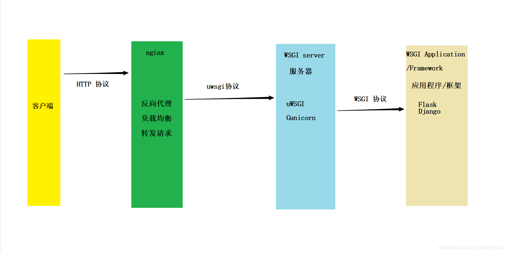
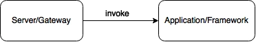
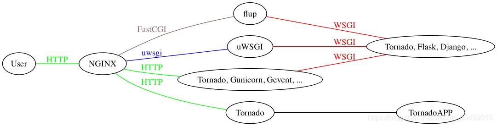
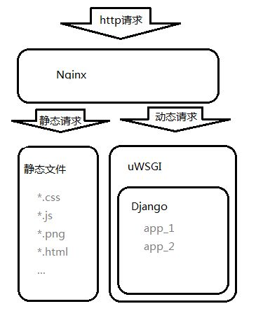

[toc]


&emsp;
&emsp;
# 一、 Nginx
## 1. Nginx在里面起到了什么作用？
在这里`Nginx`主要有如下几个作用：
> (1) 反向代理(Reverse Proxy)
> (2) 动静分离
> 
**① 反向代理(Reverse Proxy)**
&emsp; 反向代理 隐藏了 原始资源服务器，它带来了如下几个优点：
> &emsp;&emsp; ① `Nginx`在其中扮演了隔离墙的角色，这提高了资源的安全性，还可以拦截攻击；
> &emsp;&emsp; ② 负载均衡，提高了并发性(具体怎么提高见其它笔记)。
> 

**(2) 动静分离**
&emsp;&emsp;  动静分离是指在web服务器架构中，将静态页面与动态页面(或静态内容接口和动态内容接口)分开不同系统访问的架构设计方法，进而提升整个服务访问性能和可维护性，简单点来说，就是：
> &emsp;&emsp; 若用户只是简单的访问 图片，html等静态的请求时，`Nginx`直接返回，无需发给应用程序，这减小了应用程序的负担；
> &emsp;&emsp; 如果是发送动态请求时候(需要应用程序进行处理的请求)，就由`Nginx` 把请求发送给程序，进行动态处理。
> 
换句话说，动静分离是 一种为应用程序减小负担的技术。

## 2. 如何配置Nginx？
```shell

```

https://blog.csdn.net/qq_60387497/article/details/121512895

https://www.cnblogs.com/xiaoxiamiaichiyu/p/14116240.html


&emsp;
&emsp;
# 二、 wsgi相关
## 1. 概念总结
&emsp;&emsp; ① **WSGI**：一种通信协议，是 WSGI Server(比如uWSGI服务器) 和 WSGI app(django或flask等) 之间的通用 通信规范；
&emsp;&emsp; ② **uwsgi**：一种线路协议(不是通信协议)，是 uWSGI服务器的独占协议，用于 nginx和uWSGI服务器之间的通信；
&emsp;&emsp; ③ **uWSGI**: 一种Web服务器程序，实现了`uwsgi`和`WSGI`两种协议(也支持`HTTP`协议)；

<div align="center">  </div>
<center> <font color=black> <b> 图4 WSGI_uwsgi_uWSGI_调用过程图解 </b> </font> </center>


## 2. WSGI
### 2.1 WSGI是什么？
&emsp;&emsp; WSGI，全称 Web Server Gateway Interface，或者 Python Web Server Gateway Interface ，是为 Python 语言定义的 **Web服务器 和 Web应用程序或框架 之间的** 一种 **简单而通用的接口规范** ，以提高web应用在一系列web服务器间的移植性。
&emsp;&emsp;Web 应用通常部署在服务器上（Apache、Nginx 等），服务器负责处理客户端请求，应用则专注业务实现。为了方便开发封装一些常用功能，就成了各种 Web 框架（如 Django、Flask、Tornado），不同的框架各有差异，但都需要与服务器交互才能提供服务。为了方便应用在不同服务器间迁移，实现高拓展性，就需要一个统一的标准，服务器和应用按照统一的通信标准实现，就可以方便应用的迁移拓展。Python Web 开发中，在 PEP 333 中定义了该标准，即 The Web Server Gateway Interface（WSGI）。
从以上介绍我们可以看出：
> (1) WSGI是**一套接口标准协议/规范**；
> (2) **通信（作用）区间是** Web服务器和Python Web应用程序之间；
> (3) **目的是**制定标准，以保证不同Web服务器可以和不同的Python程序之间相互通信

&emsp;&emsp; 也就是说,WSGI 不是Server、不是python模块、不是python框架，也不是用python编写的软件，而是一个python标准(协议)，由 PEP 3333描述,它用来规定Web Server如何与python应用程序通信。
&emsp;&emsp; 如果一个Python应用程序（或框架，如Django）符合WSGI标准，那么它可以在任何符合WSGI标准的Server上运行（比如Apache）。

### 2.2 为什么需要WSGI？
我们明确一下web应用处理请求的具体流程：
> (1) 用户通过**浏览器**向**web服务器**发送请求
> (2) 请求经过互联网转发至对应的web服务器
> (3) web服务器 将请求转交给 **web应用程序**，web应用程序 处理请求
> (4) web应用程序 将请求结果返回给 web服务器，由web服务器返回用户响应结果
> (5) 浏览器收到响应，向用户展示

&emsp;&emsp;可以看到，请求时Web服务器需要和web应用程序进行通信，但是web服务器有很多种啊，Python web应用开发框架也对应多种啊，所以WSGI应运而生，定义了一套通信标准。试想一下，如果不统一标准的话，就会存在Web框架和Web服务器数据无法匹配的情况，那么开发就会受到限制，这显然不合理的。
&emsp;&emsp;也就是说假如没有WSGI的话，那么各个应用框架就需要自己定义如何与服务器交互，那必然会造成各自有各自的实现，那么相对应的，服务器的开发者想要完全支持所有的应用框架，几乎是不可能的，因此Python官方定义了WSGI，WSGI只是一个规范，它定义了框架应该如何与服务器交互，框架的开发者及服务器的开发者只需要参考WSGI规范来实现自己的逻辑即可，之后就可以在不同的服务器和框架之间组合使用。也就是说WSGI统一了规范，

### 2.3 WSGI是如何工作的
&emsp;&emsp; WSGI协议分为两部分，分别为WSGI Server和WSGI Application，WSGI Server负责接受客户端请求、解析请求、并按照协议规范将请求转发给WSGI Application，同时负责接受WSGI Application的响应并发送给客户端；WSGI Application负责接受由WSGI Server发送过来的请求，实现业务处理逻辑，并将标准的响应发回给WSGI Server。
<div align="center">  </div>
<center> <font color=black> <b> 图1 WSGI工作示意图 </b> </font> </center>

&emsp;&emsp; 具体来说，WSGI Server解析客户端由socket发送过来的http数据包，将请求的http version、method、host、path等包装成environ参数，并提供start_response回调函数，并将environ和start_response函数作为参数传递给由WSGI Application提供的callable对象，获取callable对象的返回结果，处理后依照http协议传递给客户端，完成一次请求。

### 2.4 WSGI的标准或规范是怎样的？
&emsp;web服务器在将请求转交给web应用程序之前，需要先将http报文转换为WSGI规定的格式。
&emsp;WSGI规定，Web程序必须有一个可调用对象，且该可调用对象接收两个参数，返回一个可迭代对象：
> **environ** ：字典，包含请求的所有信息
> **start_response**：在可调用对象中调用的函数，用来发起响应，参数包括状态码，headers等

### 2.5 WSGI中的角色
&emsp;&emsp;在WSGI中定义了两个角色，**Web服务器端** 称为server或者gateway，**应用程序端** 称为application或者framework（因为WSGI的应用程序端的规范一般都是由具体的框架来实现的）。
server端会先收到用户的请求，然后会根据规范的要求调用application端，如下图所示：
<div align="center">  </div>
<center> <font color=black> <b> 图2 WSGI中的角色 </b> </font> </center>

### 2.6 如何使用WSGI？
&emsp;&emsp;要使用WSGI，需要分别实现server角色和application角色。
&emsp;&emsp;**Application端的实现** 一般是由Python的各种框架来实现的，比如Django, web.py等，一般开发者不需要关心WSGI的实现，框架会会提供接口让开发者获取HTTP请求的内容以及发送HTTP响应；
&emsp;&emsp;**Server端的实现** 会比较复杂一点，这个主要是因为软件架构的原因。一般常用的Web服务器，如Apache和nginx，都不会内置WSGI的支持，而是通过扩展来完成。比如Apache服务器，会通过扩展模块mod_wsgi来支持WSGI。Apache和mod_wsgi之间通过程序内部接口传递信息，mod_wsgi会实现WSGI的server端、进程管理以及对application的调用。Nginx上一般是用proxy的方式，用nginx的协议将请求封装好，发送给应用服务器，比如uWSGI，应用服务器会实现WSGI的服务端、进程管理以及对application的调用。
###2.7 常用的WSGI服务器
+ **Nginx + uWSGI**：nginx本身并没有实现WSGI协议，通常要在nginx上部署Python Web应用的话会借助uwsgi来实现，+ uwsgi使用私有的uwsgi协议与nginx通信，并在内部实现wsgi协议与Web框架交互，uwsgi本身也可以作为独立的+ WSGI Server提供http服务。
&emsp;
+ **Apache + mod_wsgi**：Apache的扩展mod_wsgi实现了完整的wsgi协议，其在Apache进程内部实例化Python虚拟机，+ 并将Apache解析后的http请求转发给Web框架
&emsp;
+ **Gunicorn**：Gunicorn是一个独立和完整的WSGI Server，它可独立接受并解析http请求，并通过WSGI协议与Web框架交互，Gunicorn还可以配合gevent等模块达到很高的性能


&emsp;
## 3. uwsgi
&emsp;&emsp;  **是一种二进制协议**，是**uWSGI服务器的独占协议**，用于定义传输信息的类型(type of information)，每一个uwsgi packet 前4byte 为传输信息类型的描述，与WSGI协议是两种不同的协议。
&emsp;&emsp; **uwsgi一般用于 nginx反向代理 和 uWSGI服务器 之间的通信。**


&emsp;
## 4. uWSGI
### 4.1 uWSGI是什么？
&emsp;&emsp; uWSGI 是实现了uwsgi和WSGI两种协议的**Web服务器**（也就是说，WSGI、uwsgi是协议规范，而uWSGI是一种 服务器，这个服务器实现了这两种协议）。
<div align="center">  </div>
<center> <font color=black> <b> 图2 uWSGI </b> </font> </center>

### 4.2 既然有了uWSGI服务器，为什么部署的时候还需要nginx呢？
&emsp;&emsp; 因为nginx具备优秀的静态内容处理能力，如果客户端请求的是静态内容，那nginx会直接返回，不需要发给uWSGI服务器，然后将动态内容转发给uWSGI服务器，这样可以达到很好的客户端响应。其实如果是小网站，没有静态文件需要处理，只用 uWSGI 也是可以的，但加上 Nginx 这一层，优势可以很具体：
+ 对于运维来说比较方便，如果服务器被某个 IP 攻击，在 Nginx 配置文件黑名单中添加这个 IP 即可，如果只用 uWSGI，那么就需要在代码中修改了。另一方面，Nginx 是身经百战的 Web 服务器了，在表现上 uWSGI 显得更专业，比如说 uWSGI 在早期版本里是不支持 https 的，可以说 Nginx 更安全。
+ Nginx 的特点是能够做负载均衡和 HTTP 缓存，如果不止一台服务器，Nginx 基本就是必选项了，通过 Nginx，将资源可以分配给不同的服务器节点，只有一台服务器，也能很好地提高性能，因为 Nginx 可以通过 headers 的Expires or E-Tag，gzip 压缩等方式很好地处理静态资源，毕竟是 C 语言写的，调用的是 native 的函数，针对 I/O做了优化，对于动态资源来说，Nginx 还可以实现缓存的功能，配合 CDN 优化（这是 uWSGI 做不到的）。Nginx 支持epoll/kqueue 等高效网络库，能够很好地处理高并发短连接请求，性能比 uWSGI 不知道高到哪里去了。
+ 如果服务器主机上运行了PHP，Python 等语言写的多个应用，都需要监听80端口，这时候 Nginx 就是必选项了。因为我们需要一个转发的服务。

### 4.3 nginx 和uWISG 服务器之间如何配合工作的？
>(1)首先浏览器发起http 请求到nginx 服务器
(2)Nginx 根据接收到请求包，进行url 分析，判断访问的资源类型，如果是静态资源，直接读取静态资源返回给浏览器
(3)如果请求的是动态资源就转交给uwsgi服务器，uwsgi 服务器根据自身的uwsgi 和WSGI 协议，找到对应的Django 框架。
(4)Django 框架下的应用进行逻辑处理后，将返回值发送到uwsgi 服务器，然后uwsgi 服务器再返回给nginx。
(5)最后nginx将返回值返回给浏览器进行渲染显示给用户。
<div align="center">  </div>
<center> <font color=black> <b> 图3 nginx和uWISG服务器之间如何配合工作 </b> </font> </center>

