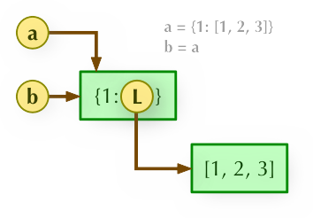
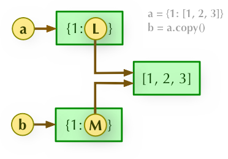

- [1. 如何实现三元表达式？](#1-如何实现三元表达式)
- [2. python中如何交换两个变量的值？](#2-python中如何交换两个变量的值)
- [3. 介绍一下python的解包](#3-介绍一下python的解包)
- [4. 介绍下`enumerate`函数](#4-介绍下enumerate函数)
- [5. `zip()`函数](#5-zip函数)
- [6. `while`和`for`循环 后面的`else`语句块什么时候会运行？](#6-while和for循环-后面的else语句块什么时候会运行)
  - [结论](#结论)
- [7. 赋值表达式(assignment expression)](#7-赋值表达式assignment-expression)
  - [7.1 什么是 赋值表达式？语法特点是](#71-什么是-赋值表达式语法特点是)
  - [7.2 赋值表达式 和 赋值语句 有何区别？](#72-赋值表达式-和-赋值语句-有何区别)
  - [7.3 赋值表达式的应用](#73-赋值表达式的应用)
    - [(1) 在`if/else`中](#1-在ifelse中)
      - [① 简化`if/else`](#-简化ifelse)
      - [② 用来实现`switch`](#-用来实现switch)
    - [(2) 实现`do while`语句](#2-实现do-while语句)
    - [(3) 用在 推导式 中](#3-用在-推导式-中)
- [8. Python中对象](#8-python中对象)
  - [8.1 Python的对象有哪几个属性？](#81-python的对象有哪几个属性)
  - [8.2 这些属性分别表示什么？如何获取这几个属性？](#82-这些属性分别表示什么如何获取这几个属性)
- [9. `is` 和 `==` 的区别](#9-is-和--的区别)
- [10. python的 可变和不可变数据类型](#10-python的-可变和不可变数据类型)
  - [10.1 不可变数据类型](#101-不可变数据类型)
    - [10.1.1 什么是不可变数据类型？](#1011-什么是不可变数据类型)
    - [10.1.2 哪些是不可变数据类型？](#1012-哪些是不可变数据类型)
  - [10.2 可变数据类型](#102-可变数据类型)
    - [10.2.1 什么是 可变数据类型？](#1021-什么是-可变数据类型)
    - [10.2.2 哪些是 可变数据类型？](#1022-哪些是-可变数据类型)
- [10. 直接赋值、浅拷贝 和 深拷贝](#10-直接赋值浅拷贝-和-深拷贝)
  - [前提](#前提)
  - [10.1 不可变对象 的直接赋值、浅拷贝 和 深拷贝](#101-不可变对象-的直接赋值浅拷贝-和-深拷贝)
  - [10.2 可变对象 的直接赋值、浅拷贝 和 深拷贝](#102-可变对象-的直接赋值浅拷贝-和-深拷贝)
    - [10.2.1 原理](#1021-原理)
    - [10.2.2 实例验证](#1022-实例验证)
  - [10.3 下面这段代码的输出是什么？为什么？](#103-下面这段代码的输出是什么为什么)
- [11. `lambda`表达式](#11-lambda表达式)
  - [11.1 什么是 `lambda`表达式](#111-什么是-lambda表达式)
  - [11.2 语法特点](#112-语法特点)
  - [11.3 lambda函数的输入输出](#113-lambda函数的输入输出)
  - [11.4 `lambda`表达式 的应用](#114-lambda表达式-的应用)
- [12. 如何多标准排序？](#12-如何多标准排序)
- [13. 内置字典类型 的`get()`和`setdefault`的区别](#13-内置字典类型-的get和setdefault的区别)
  - [13.1 先介绍一下这两个方法：](#131-先介绍一下这两个方法)
  - [13.2 区别](#132-区别)
  - [13.3 代码验证](#133-代码验证)
- [14. 当函数返回多个值时，解释器做了什么？](#14-当函数返回多个值时解释器做了什么)
- [15. 变量注解](#15-变量注解)
  - [15.1 参数注解是什么时候引入的？](#151-参数注解是什么时候引入的)
  - [15.2 怎么使用？](#152-怎么使用)
  - [15.3 进行了变量注解后，解释器会做类型检查吗？](#153-进行了变量注解后解释器会做类型检查吗)
- [16. `__closure__`属性 表示的是什么？](#16-__closure__属性-表示的是什么)
- [17. 函数的默认参数](#17-函数的默认参数)
  - [17.1  函数的默认参数在何时加载？](#171--函数的默认参数在何时加载)
  - [17.2 当给函数用默认参数时，需要注意什么？](#172-当给函数用默认参数时需要注意什么)
  - [17.2 如何给函数提供 值可能会变的默认实参？](#172-如何给函数提供-值可能会变的默认实参)
- [18. Python如何表示无穷大和无穷小？](#18-python如何表示无穷大和无穷小)
- [19. Python中下划线的种含义](#19-python中下划线的种含义)
  - [19.1 单前导下划线： `_var`](#191-单前导下划线-_var)
    - [19.1.1 用在类内](#1911-用在类内)
    - [19.1.2 用在普通函数](#1912-用在普通函数)
  - [19.2 单末尾下划线： `var_`](#192-单末尾下划线-var_)
  - [19.3 双前导下划线： `__var`](#193-双前导下划线-__var)
  - [19.4 双前导和末尾下划线： `__var__`](#194-双前导和末尾下划线-__var__)
  - [19.5 单下划线： `_`](#195-单下划线-_)
- [20. 命名元组(named tuple)](#20-命名元组named-tuple)
  - [20.1 命名元组 和 普通元组 有何区别？](#201-命名元组-和-普通元组-有何区别)
  - [20.2 如何使用?](#202-如何使用)
    - [20.2.1 基本使用](#2021-基本使用)
    - [20.2.2 `namedtuple`的第一个参数是什么？必须和 `=`左边一样吗？](#2022-namedtuple的第一个参数是什么必须和-左边一样吗)
  - [20.3 命名元组的属性和方法](#203-命名元组的属性和方法)
  - [20.4  `namedtuple`占的内存会比 普通元组 大吗？](#204--namedtuple占的内存会比-普通元组-大吗)
  - [20.5 `namedtuple`的使用场景](#205-namedtuple的使用场景)
- [21 `defaultdict`](#21-defaultdict)
  - [21.1 `defaultdict`可以解决什么问题？](#211-defaultdict可以解决什么问题)
  - [21.2 `defaultdict`的另一个用法](#212-defaultdict的另一个用法)
- [22. 如何让一个 类的实例 可以像 一个函数那样调用？](#22-如何让一个-类的实例-可以像-一个函数那样调用)
- [23.如果一定要用多重继承，你有什么建议？](#23如果一定要用多重继承你有什么建议)
- [24. 如何定义一个抽象基类？](#24-如何定义一个抽象基类)
- [25. `collections.abc` 与 `abc`模块 是同一个东西吗?](#25-collectionsabc-与-abc模块-是同一个东西吗)
- [26. 如果想自己定义容器，应该怎么做？](#26-如果想自己定义容器应该怎么做)
- [27. python是否存在内存泄漏？](#27-python是否存在内存泄漏)
- [28. 当使用`class`关键字创建一个类时，解释器在幕后做了些什么？](#28-当使用class关键字创建一个类时解释器在幕后做了些什么)
- [29. 如何改变对象的字符串显示？](#29-如何改变对象的字符串显示)
- [30. 如果计算时涉及到浮点数，如何保证精度不会缺失？](#30-如果计算时涉及到浮点数如何保证精度不会缺失)
- [31. python中，如何对浮点数进行四舍五入？](#31-python中如何对浮点数进行四舍五入)
- [32. 可以用`list`实现`FIFO`队列吗？](#32-可以用list实现fifo队列吗)
- [33. Python中的二分搜索（插入）算法在哪个模块里面？](#33-python中的二分搜索插入算法在哪个模块里面)
- [34. Python的`socket`编程如何提高并发？](#34-python的socket编程如何提高并发)


&emsp;
&emsp;
# 1. 如何实现三元表达式？


&emsp;
&emsp;
# 2. python中如何交换两个变量的值？
直接用 **解包(unpacking)** 就能做到，不需要用临时变量：


&emsp;
&emsp;
# 3. 介绍一下python的解包


&emsp;
&emsp;
# 4. 介绍下`enumerate`函数


&emsp;
&emsp;
&emsp;
# 5. `zip()`函数


&emsp;
&emsp;
# 6. `while`和`for`循环 后面的`else`语句块什么时候会运行？
&emsp;&emsp; 无论是`for … else` 还是 `while … else`，`else`中的语句 会在循环 **正常执行完**（即 `for(while)` 不是通过 `break` 跳出而中断的）的情况下执行：
&emsp;&emsp; 换句话说，如果  `while … else`，`else`中的语句 **不是正常执行完**，如通过`break`跳出了循环，则`else`中的语句不会被执行
```python
# 1. 正常执行
for i in range(3):
	print(i)
else:
	print("else block!")

print("*"*30)

# 通过break让循环体 不正常执行完
for i in range(3):
	if(i >= 2):
		break
	print(i)
else:
	print("else block!")
```
运行结果：
```
0
1
2
else block!
******************************
0
1
```

## 结论
&emsp;&emsp; 如果  `while … else`，`else`中的语句 **不是正常执行完**，如通过`break`跳出了循环，则`else`中的语句不会被执行。


&emsp;
&emsp;
# 7. 赋值表达式(assignment expression)
## 7.1 什么是 赋值表达式？语法特点是
&emsp;&emsp; **赋值表达式** 是在 python3.8中加入的新特性，它会用到 **海象操作符(walrus operator)** 。
赋值表达式的语法是 `NAME := expr`，顾名思义，它完成了两个操作：
> ① 计算表达式 `expr` 的结果，然后把结果赋值给名为 `NAME` 的变量
> ② 返回`NAME`变量
> 
```python
walrus = False
print(tmp := walrus)
```
输出结果：
```
False
```
可见 `print(walrus := True)` 一句话，做了两句话的工作：
> ① 赋值：`walrus = True`
> ② 将`walrus`返回给`print`：`print(walrus)`
> 

## 7.2 赋值表达式 和 赋值语句 有何区别？
&emsp;&emsp; 赋值表达式 和 赋值语句的区别在于：**赋值表达式 在完成赋值之后，还会将`:=`左边的变量作为一个返回值返回。**

```python
walrus = False
print(tmp := walrus)

print(tmp = walrus)
```
运行结果：
```
False
Traceback (most recent call last):
  File "d:\code_practice\practice.py", line 4, in <module>
	print(tmp = walrus)
TypeError: 'tmp' is an invalid keyword argument for print()
```

## 7.3 赋值表达式的应用
&emsp;&emsp; 有了赋值表达式，可以节省代码量，还可以 清晰的模拟出`switch`和`do ... while`语句。
### (1) 在`if/else`中
#### ① 简化`if/else`
```python
fresh_fruit = {
	'apple': 10,
	'banana': 8,
	'lemon': 5,
}

def make_lemonade(count):
	print("make_lemonade()")

def out_of_stock():
	print("out_of_stock()")

# 以前的写法：    
count = fresh_fruit.get('lemon', 0)
if count:
	make_lemonade(count)
else:
	out_of_stock()

# 有了 赋值表达式后的写法
if count := fresh_fruit.get('lemon', 0) :
	make_lemonade(count)
else:
	out_of_stock()
```
用赋值表达式写的代码虽然只是少了一行，但是读起来却清晰了不少，因为这种写法明确的表示了`count`变量只和`if/else`有关。
#### ② 用来实现`switch`
```python
fresh_fruit = {
	'apple': 10,
	'banana': 8,
	'lemon': 5,
}

def slice_bananas(count):
	print("slice_bananas")


def make_lemonade(count):
	print("make_lemonade()")

def make_smoothies(count):
	print("make_smoothies()")

def make_cider(count):
	print("make_cider()")

count = fresh_fruit.get('banana', 0)
if count >= 2:
	pieces = slice_bananas(count)
	to_enjoy = make_smoothies(pieces)
else:
	count = fresh_fruit.get('apple', 0)
	if count >= 4:
		to_enjoy = make_cider(count)
	else:
		count = fresh_fruit.get('lemon', 0)
		if count:
			to_enjoy = make_lemonade(count)
		else:
			to_enjoy = 'Nothing'
```
上面的代码虽然实现了`switch`的功能，但是可读性太差了，来看看 赋值表达式 模拟`switch`语句：
```python
if (count := fresh_fruit.get('banana', 0)) >= 2:
	pieces = slice_bananas(count)
	to_enjoy = make_smoothies(pieces)
elif (count := fresh_fruit.get('apple', 0)) >= 4:
	to_enjoy = make_cider(count)
elif count := fresh_fruit.get('lemon', 0):
	to_enjoy = make_lemonade(count)
else:
	to_enjoy = 'Nothing'
```
很显然，不论是代码量还是可读性，用 赋值表达式 来实现都更完美。

### (2) 实现`do while`语句
&emsp;&emsp; python里面是没有`do ... while`语句的。如果我们希望把新引入的水果做成果汁并存到瓶子里，直到水果用完为止：
**① 普通循环：**
```python
def pick_fruit():
	print("pick_fruit()")

def make_juice(fruit, count):
	print("make_juice")

bottles = []
while True: # Loop
	fresh_fruit = pick_fruit()
	if not fresh_fruit: # And a half
		break
	for fruit, count in fresh_fruit.items():
		batch = make_juice(fruit, count)
		bottles.extend(batch)
```
上面的代码写成了无限循环，需要依靠`break`才能退出循环。
**② 赋值表达式实现：**
&emsp;&emsp; 用海象操作符，我们可以在每一次`while`循环的开始给`fresh_fruit`变量赋值，并根据返回值决定是否进行下一轮赋值，这样写可读性显然更好：
```python
bottles = []
while fresh_fruit := pick_fruit():
	for fruit, count in fresh_fruit.items():
		batch = make_juice(fruit, count)
		bottles.extend(batch)
```

### (3) 用在 推导式 中
```python
members = [
	{"name": "小五", "age": 23, "height": 1.75, "weight": 72},
	{"name": "小李", "age": 17, "height": 1.72, "weight": 63},
	{"name": "小陈", "age": 20, "height": 1.78, "weight": 82},
]

count = 0

def get_bmi(info):
	global count
	count += 1

	print(f"执行了 {count} 次")

	height = info["height"]
	weight = info["weight"]

	return weight / (height**2)

print([get_bmi(x) for x in members if get_bmi(x) > 25])
```
运行结果：
```
执行了 1 次
执行了 2 次        
执行了 3 次        
执行了 4 次        
[25.88057063502083]
```
使用 赋值表达式 修改上述列表推导：
```python
print([bmi for x in members if (bmi:=get_bmi(x)) > 25])
```
运行结果：
```
执行了 1 次
执行了 2 次        
执行了 3 次        
[25.88057063502083]
```
可以明显看到，代码简洁了，`get_bmi()`也调用少了一次。


&emsp;
&emsp;
# 8. Python中对象
## 8.1 Python的对象有哪几个属性？
Python中，对象具有三要素：
> ① 标识(identity)
> ② 类型(type)
> ③ 值(value)
> 

## 8.2 这些属性分别表示什么？如何获取这几个属性？
**① 标识(identity)：**
&emsp;&emsp; 用于唯一标识对象，通常对应对象在计算机内存中的地址。使用内置函数`id(obj)`返回对象唯一标识。

**② 类型(type)：**
&emsp;&emsp; 对象中含有标准的头部信息：类型标识符。标识对象类型，表示对象存储的数据的类型。
&emsp;&emsp; 类型可以限制对象的取值范围和可执行的操作。使用内置函数`type(obj)`返回对象所属类型。
每一个对象都有两个标准的头部信息：
>  类型标识符，去标识对象的（数据）类型；
>  引用计数器，记录当前对象的引用的数目。
> （回收机制：变量的引用计数器为0，自动清理。 ※ 较小整数型对象有缓存机制。）
> 
**③ 值(value)：**
&emsp;&emsp; 表示对象存储的数据的信息。使用内置函数`print(obj)`可以直接打印值。


&emsp;
&emsp;
# 9. `is` 和 `==` 的区别
它俩判断的依据不一样：
> **`is`** 
> &emsp;&emsp; 判断两个变量是否指向同一个对象，比较两个引用是否代表了内存中同一个地址，是否指向同一块内存空间。通过`id(obj)`返回值判断。
> **`==`** 
> &emsp;&emsp; 比较对象的本身内容`类型(type)`和`值(value`)是否一致(默认会调用对象的`__eq__`方法)，当type与value相同时，`==` 为`True`。
> 
换句话说：
> 我们在检查 `a is b` 的时候，其实相当于检查 `id(a) == id(b)`。
> 而检查 `a == b` 的时候，实际是调用了对象`a` 的 `__eq()__` 方法，即相当于 `a.__eq__(b)`。
> 


&emsp;
&emsp;
# 10. python的 可变和不可变数据类型
&emsp;&emsp; python中主要有6种标准数据类型，分为可变和不可变两类。
## 10.1 不可变数据类型
### 10.1.1 什么是不可变数据类型？
&emsp; python中不可变数据类型的定义为：
> &emsp;&emsp; 当该数据类型的对应变量的值发生了改变，那么它对应的内存地址也会发生改变，就称不可变数据类型，包括：`int`（整型）、`string`（字符串）、`tuple`（元组）。
> &emsp;&emsp; 也就是说，在修改 不可变数据类型对象的值 时，由于其内存中的值不可以被改变，所以会把原来的值复制一份再进行改变，这样就会计算机会开辟一段新的内存空间来存储新的值。
> 

### 10.1.2 哪些是不可变数据类型？
**① 整型**
&emsp;&emsp; 首先我们来看一下整型为什么是不可变数据类型。给一个变量x赋值，然后改变这个x的值，输出前后两次的内存地址id和数据类型type
```python
# 赋值
x = 1
# 打印x的内存地址和数据类型
print(id(x), type(x))
# 输出：8791164511056 <class 'int'>

# 改变x的值
x = 2
# 打印改变后的x的内存地址和数据类型
print(id(x), type(x))
# 输出：8791164511088 <class 'int'>
```
从上面的代码我们可以得出，变量x为整型，且当x的值发生改变的时候，变量的内存地址也发生了改变。所以整型是不可变的数据类型。

**② 字符串**
&emsp;&emsp; 根据上面的实例，我们把变量x的值换成字符串试试：
```python
# 赋值
x = 'abcdefg'
# 打印x的内存地址和数据类型
print(id(x), type(x))
# 输出：30828000 <class 'str'>

# 改变x的值
x = 'higklmn'
# 打印改变后的x的内存地址和数据类型
print(id(x), type(x))
# 输出：30828168 <class 'str'>
```
代码中当变量改变时，变量的内存地址由30828000 变为了30828168 。所以字符串是不可变数据类型。

**③ 元组**
元组被称为只读列表，即数据可以被查询，但不能被修改。如果我们强行修改元组中的数据，会报错。
```python
t = (1, 2, 3, 4, 5)
# 修改元组的值
t[1] = 100

#直接报错：TypeError: 'tuple' object does not support item assignment
```

## 10.2 可变数据类型
### 10.2.1 什么是 可变数据类型？
python中对可变数据类型的定义为：
> 当该数据类型的对应变量的值发生了改变，那么它对应的内存地址不发生改变，就称可变数据类型。包括：set（集合）、list（列表）、dict（字典）
> 也就是说，可变类型的变量 被改变后，其所指向的内存地址上面的值 直接被改变，没有发生复制行为，也没有发生开辟新的内存地址行为，不会重新开辟空间。
> 
### 10.2.2 哪些是 可变数据类型？
**① 集合**
我们先来看一下集合，先定义一个集合set1，改变set1的值，且输出两次的内存地址
```python
set1 = {1, 2, 3, '123'}
print("集合:", set1, "内存地址：", id(set1), "\t", "数据类型：", type(set1), "\t")
# 输出：集合: {1, 2, 3, '123'} 内存地址： 41388296     数据类型： <class 'set'>    

# 给set1添加一个元素
set1.add(100)
print("集合:", set1, "内存地址：", id(set1), "\t", "数据类型：", type(set1), "\t")
# 输出：集合: {1, 2, 3, 100, '123'} 内存地址： 41388296    数据类型： <class 'set'>    
```
从上面代码我们可以看出，即使一个集合发生了改变，这个集合的内存地址是不变的。所以集合是可变数据类型。

**② 列表**
```python
list1 = [1, 2, 3, 4, 5]
print("列表:", list1, "内存地址：", id(list1), "\t", "数据类型：", type(list1), "\t")
# 输出：列表: [1, 2, 3, 4, 5] 内存地址： 1860168   数据类型： <class 'list'> 

list1[0] = 100
print("列表:", list1, "内存地址：", id(list1), "\t", "数据类型：", type(list1), "\t")
# 输出：列表: [100, 2, 3, 4, 5] 内存地址： 1860168     数据类型： <class 'list'>   
```
当列表中的值发生了改变时，内存地址依旧不变，所以列表是可变数据类型。

**③ 字典**
字典是python中唯一的映射类型，采用键值对（key-value）的形式存储数据。字典中的key值必须是可哈希的数据类型，也就是整型，字符串，元组等。
```python
dict1 = {'name': 'kkk', 'age': 18}
print("字典:", dict1, "内存地址：", id(dict1), "\t", "数据类型：", type(dict1), "\t")
# 字典: {'name': 'kkk', 'age': 18} 内存地址： 31033960      数据类型： <class 'dict'> 

dict1['sex'] = 'man'
print("字典:", dict1, "内存地址：", id(dict1), "\t", "数据类型：", type(dict1), "\t")
# 字典: {'name': 'kkk', 'age': 18, 'sex': 'man'} 内存地址： 31033960    数据类型： <class 'dict'>   
```
从上面代码可以看出，当字典中的元素发生改变时，内存地址不变，都是31033960。所以字典是可变数据类型。


&emsp;
&emsp;
&emsp;
# 10. 直接赋值、浅拷贝 和 深拷贝
## 前提
&emsp;&emsp; 首先，需要明确一点是：
> &emsp;&emsp; 浅拷贝和深拷贝之间的区别只适用于 可变对象。对于非可变对象没有区别，都是对象拷贝，相当于重新赋值，生成一个新的对象
> 

## 10.1 不可变对象 的直接赋值、浅拷贝 和 深拷贝
对于不可变对象，直接赋值、浅拷贝、深拷贝效果都一样：
```python
str2 = str1

str1 = "Good bye!"

print("str1: ", str1)
print("str2: ", str2)
```
运行结果：
```
str1:  Good bye!
str2:  Hello World!
```
**结果分析：**
&emsp;&emsp; 可以看到的是，`str1`的改变并不会影响`str2`的值，验证了前面的结论。

## 10.2 可变对象 的直接赋值、浅拷贝 和 深拷贝
### 10.2.1 原理
**(1) 直接赋值**： 其实就是对象的引用（别名）。
`b = a`: 赋值引用，`a` 和 `b` 都指向同一个对象。
<div align="center">  </div>
<center> <font color=black> <b> 直接赋值 </b> </font> </center>

&emsp;
**(2) 浅拷贝(copy)**： 拷贝父对象，不会拷贝对象的内部的子对象。
`b = copy.copy(a)`: 浅拷贝, `a` 和 `b` 是一个独立的对象，但他们的子对象还是指向统一对象（是引用）
<div align="center">  </div>
<center> <font color=black> <b> 浅拷贝 </b> </font> </center>

&emsp;
**(3) 深拷贝(deepcopy)**： copy模块 的 deepcopy方法，完全拷贝了父对象及其子对象。
`b = copy.deepcopy(a)`: 深度拷贝, `a` 和 `b` 完全拷贝了父对象及其子对象，两者是完全独立的。
<div align="center">  </div>
<center> <font color=black> <b> 深拷贝 </b> </font> </center>

### 10.2.2 实例验证
```python
import copy

a = [1, 2, 3, 4, ['a', 'b']] #原始对象

b = a                # 直接拷贝
c = copy.copy(a)     # 浅拷贝
d = copy.deepcopy(a) # 深拷贝

a.append(5)         # 修改对象a
a[4].append('c')    # 修改对象a的子对象 ['a', 'b']

print( 'a = ', a )
print( 'b = ', b )
print( 'c = ', c )
print( 'd = ', d )
```
运行结果：
```
a =  [1, 2, 3, 4, ['a', 'b', 'c'], 5]
b =  [1, 2, 3, 4, ['a', 'b', 'c'], 5]
c =  [1, 2, 3, 4, ['a', 'b', 'c']]   
d =  [1, 2, 3, 4, ['a', 'b']]  
```
&emsp;&emsp; 在原始对象被改变后，只有进行直接赋值的`b`受到了影响，这证实了`b`其实和 原始对象`a` 指向了同一对象；
&emsp;&emsp; 在对 原始对象`a`的子对象 进行修改后，进行浅拷贝的`c`也受到了影响，这证实了浅拷贝后，它们的子对象还是指向统一对象。


## 10.3 下面这段代码的输出是什么？为什么？
```python
a = (1, 2)
b = a
a = (3, 4)

print(a, b)
```
**输出结果：**
```
(3, 4) (1, 2)
```
**为什么：**
&emsp;&emsp; 因为元组是不可变类型，因此 `a = (3, 4)`相当于新建了一个元组`(3, 4)`然后让`a`指向它，因此不会影响元组`b`。


&emsp;
&emsp;
&emsp;
# 11. `lambda`表达式
## 11.1 什么是 `lambda`表达式
&emsp;&emsp; lambda 表达式（lambda expression）是一个**匿名函数**，通俗的说就是没有名字的函数，是一种快速定义单行的最小函数，可以用来简化代码。

## 11.2 语法特点
lambda的语法形式如下：
```python
lambda argument_list: expression
```
① `argument_list` 是参数列表。它的结构与Python中函数(function)的参数列表是一样的，可以有非常多的形式。例如：
> a, b
> a=1, b=2
> *args
> **kwargs
> a, b=1, *args
> 空
> 
② `expression`是一个关于参数的表达式。表达式中出现的参数需要在argument_list中有定义，并且表达式只能是单行的。以下都是合法的表达式：
> 1
> None
> a + b
> sum(a)
> 1 if a >10 else 0
> 

## 11.3 lambda函数的输入输出
用一个例子来说明把：
```python
lambda x, y: x*y
```
① 输入：参数列表里的就是输入，如上面的`x`
② 输出：`x*y`的结果就是输出

## 11.4 `lambda`表达式 的应用
**① 将lambda函数赋值给一个变量，通过这个变量间接调用该`lambda`函数。**
```python
add = lambda x, y : x + y

print(add) # 输出lambda函数的地址

print(add(1, 1))
```
输出结果：
```
<function <lambda> at 0x00000213238289D0>
2
```

**② 将lambda函数赋值给其他函数，从而将其他函数用该lambda函数替换。**
&emsp;&emsp; 例如，为了把标准库`time`中的函数`sleep`的功能屏蔽(Mock)，我们可以在程序初始化时调用：`time.sleep=lambda x:None`。这样，在后续代码中调用`time`库的`sleep`函数将不会执行原有的功能。例如，执行`time.sleep(3)`时，程序不会休眠3秒钟，而是什么都不做。

**③ 将lambda函数作为其他函数的返回值，返回给调用者。**
&emsp;&emsp; 函数的返回值也可以是函数。例如return lambda x, y: x+y返回一个加法函数。这时，lambda函数实际上是定义在某个函数内部的函数，称之为嵌套函数，或者内部函数。对应的，将包含嵌套函数的函数称之为外部函数。内部函数能够访问外部函数的局部变量，这个特性是闭包(Closure)编程的基础，在这里我们不展开。

**④ 将lambda函数作为参数传递给其他函数。**
就拿`sort()`来举例吧，如果想实现以 绝对值排序，用`lambda`可以这么写：
```python
numbers = [2, -4, 9, 5, -6, 1, 7, -3, 8]
numbers.sort( key=lambda x : abs(x))
print(numbers)
```
运行结果：
```
[1, 2, -3, -4, 5, -6, 7, 8, 9]
```


&emsp;
&emsp;
&emsp;
# 12. 如何多标准排序？


&emsp;
&emsp;
&emsp;
# 13. 内置字典类型 的`get()`和`setdefault`的区别
## 13.1 先介绍一下这两个方法：
**(1) `setdefault()`方法**
&emsp;&emsp; `dict.setdefault(key, default=None)` ---有`key`则返回对应的值、没`key`则插入，`value`设为`default`的值：
> 如果 key 在 字典中，返回对应的值。
> 如果 key 不在字典中，则插入 key 及设置的默认值 default，并返回 default(default 默认值为 None)
> 
 
**(2) `get()`方法**
&emsp;&emsp; `dict.get(key, default=None)` ---有key获取值、没key返回default：
> 返回指定键的值，如果值不在字典中返回默认值 None。
> 
## 13.2 区别
&emsp; 当目标`key`**不在字典里时**：
> &emsp;&emsp; `setdefault()`方法会将目标可以插入到字典里，`value`设为`default`的值(默认为`None`)，然后返回`default`的值；
> &emsp;&emsp; 直接返回`default`的值(默认为`None`)，不会进行插入操作。
> 

## 13.3 代码验证
```python
car = {
  "brand": "Porsche",
  "model": "911",
  "year": 1963
}

x = car.get("weight", 2000)
y = car.setdefault("color", "White")

print(car)
```
输出：
```
{'brand': 'Porsche', 'model': '911', 'year': 1963, 'color': 'White'}
```
**结果分析：**
&emsp;&emsp; ① `weight`原来不在字典`car`里面的，调用`get`方法后还是不再，说明`get`确实不会对字典进行插入操作。
&emsp;&emsp; ② `color`原来不在字典`car`里面的，但调用`setdefault`方法后，`color`已经插入到`car`了，说明`setdefault`方法确实会进行插入操作。。


&emsp;
&emsp;
&emsp;
# 14. 当函数返回多个值时，解释器做了什么？
&emsp;&emsp; 当函数返回多个值时，解释器会将它们打包成一个元组，所以我们可以对函数的返回值做 unpacking操作。


&emsp;
&emsp;
&emsp;
# 15. 变量注解
## 15.1 参数注解是什么时候引入的？
&emsp;&emsp; python3.6开始引入的。

## 15.2 怎么使用？
语法：`tmp:int = 2`

## 15.3 进行了变量注解后，解释器会做类型检查吗？
不会，来看代码：
```python
tmp:int = 2

tmp = "Hello World"
print(tmp)
```
运行结果：
```
Hello World
```


&emsp;
&emsp;
&emsp;
# 16. `__closure__`属性 表示的是什么？
&emsp;&emsp; `__closure__`属性 中保存的是 闭包中绑定的自由变量。


&emsp;
&emsp;
&emsp;
# 17. 函数的默认参数
## 17.1  函数的默认参数在何时加载？

## 17.2 当给函数用默认参数时，需要注意什么？

## 17.2 如何给函数提供 值可能会变的默认实参？


&emsp;
&emsp;
&emsp;
# 18. Python如何表示无穷大和无穷小？
Python中可以用如下方式表示正负无穷：
```python
float("inf")
float("-inf")
```

**① 利用 `inf` 做简单加、乘算术运算仍会得到 `inf`：**
```python
print(1 - float("inf"))
print(1 - float("-inf"))
```
运行结果：
```
-inf
inf
```

**② 除了 INF 外的其他数除以 INF ，会得到0：**
```python
print(-100 / float("inf"))
print(-100 / float("-inf"))
```
运行结果：
```
-0.0
0.0
```


&emsp;
&emsp;
&emsp;
# 19. Python中下划线的种含义
## 19.1 单前导下划线： `_var`
### 19.1.1 用在类内
TODO:
https://zhuanlan.zhihu.com/p/36173202
### 19.1.2 用在普通函数

## 19.2 单末尾下划线： `var_`

## 19.3 双前导下划线： `__var`

## 19.4 双前导和末尾下划线： `__var__`

## 19.5 单下划线： `_`


&emsp;
&emsp;
&emsp;
# 20. 命名元组(named tuple)
## 20.1 命名元组 和 普通元组 有何区别？
&emsp;&emsp; 顾名思义，命名元组就是有名字的元组，这里的名字指的是 元组里每个字段都有 一个字段名。

## 20.2 如何使用?
### 20.2.1 基本使用
注意，**第一个参数是类型名称**，和等号左边一样：
```python
from collections import namedtuple

Grades = namedtuple('Grades', ('score', 'weight')) 

a = Grades(95, 0.8)

print(a.score, "  ", a.weight)
```
运行结果：
```  
95    0.8
```
命名元组的字段名还可以是由空格分隔开的字段名组成的字符串：
```python
from collections import namedtuple

# 这个命名元组是由各个字段的名是由空格分隔开的字段名组成的字符串
# 等价于namedtuple('City', (name, country, population, coordinates))
City = namedtuple('City', 'name country population coordinates') 


tokyo = City('Tokyo', 'JP', 36.933, (35.689722, 139.691667))

print(tokyo.name)
print(tokyo.population)
```
运行结果：
```
Tokyo
36.933
```

### 20.2.2 `namedtuple`的第一个参数是什么？必须和 `=`左边一样吗？
不一定要一样，`namedtuple`的第一个参数决定的是`__name__`：
```python
from collections import namedtuple

Grades = namedtuple('不需要和左边一样', ('score', 'weight')) 

a = Grades(95, 0.8)

print(a)
print(a.score, "  ", a.weight)
print(Grades.__name__)
```
运行结果：
```  
不需要和左边一样(score=95, weight=0.8)
95    0.8
不需要和左边一样
```


## 20.3 命名元组的属性和方法
TODO:

## 20.4  `namedtuple`占的内存会比 普通元组 大吗？
&emsp;&emsp; 不会，用 `namedtuple` 构建的类的实例所消耗的内存跟元组是一样的， 因为字段名都被存在对应的类里面（字段名是一个 类属性，被所有对象共享）。 这个实例跟普通的对象实例比起来也要小一些， 因为 Python 不会用 `__dict__` 来存放这些实例的属性。

## 20.5 `namedtuple`的使用场景
&emsp;&emsp; `namedtuple`适合用来构建只有少数属性但是没有方法的对象，比如 **数据库条目**
```python
import collections

# suit n. 套装，西装；同花色的一组纸牌 
#      v. 适宜
Card = collections.namedtuple('Card', ['rank', 'suit'])

class FrenchDeck:
    ranks = [str(n) for n in range(2, 11)] + list('JQKA')
    suits = 'spades diamonds clubs hearts'.split()

    def __init__(self):
        self._cards = [Card(rank, suit) for suit in self.suits
                                        for rank in self.ranks]

    def __len__(self):
        print("__len__() called.")
        return len(self._cards)

    def __getitem__(self, position):
        print("__getitem__() called.")
        return self._cards[position]

        
    def __contains__(self, item):
        print("__contains__() called.")
        return item in self._cards

deck = FrenchDeck()

print(Card('Q', 'hearts') in deck)
```
上面的代码用`namedtuple('Card', ['rank', 'suit'])`来表示一张扑克牌，`rank`表示大小, `suit`表示花色。


&emsp;
&emsp;
&emsp;
# 21 `defaultdict`
## 21.1 `defaultdict`可以解决什么问题？
&emsp;&emsp; 我们都知道，内置字典在 直接用 `dic[key]`的方式获取对应的值时，若`key`不存在会报错。`defaultdict`就是用来解决这个问题的：
> `defaultdict(typename)` 会返回一个字典，这个字典和内置字典不一样的是，当你通过`dic[key]`的方式获取对应的值时，若`key`不存在，它不但不会报错，还会往里面插入一个类型为`typename`的空值。
> 
```python
math_grages = {} # 普通字典
jack = math_grages['jack']

print(jack)
print(math_grages)
```
运行结果：
```
Traceback (most recent call last):
  File "f:\code\python\test\test.py", line 2, in <module>
	jack = math_grages['jack']
KeyError: 'jack'
PS F:\code\python\t
```
**结果分析：**
&emsp;&emsp; 显然，访问不存在的`key`会报错。下面我们改用`defaultdict`：
```python
from collections import defaultdict

math_grages = defaultdict(list) # 注意，math_grages是一个字典
jack = math_grages['jack']

print(jack)
print(math_grages)
```
运行结果：
```
[]
defaultdict(<class 'list'>, {'jack': []})
```
**结果分析：**
&emsp;&emsp; 当访问不存在的`key`时，`defaultdict(list)`会返回将这个`key`插到字典中，`value`为一个空`list`。

## 21.2 `defaultdict`的另一个用法
&emsp;&emsp; `defaultdict`除了接受类型名称作为初始化函数的参数之外，还可以使用任何不带参数的可调用函数，到时**使用该函数的返回结果作为默认**值，这样使得默认值的取值更加灵活：
```python
from collections import defaultdict

def key_missing():
	print(f"key added.")
	return 60 # 这个返回值会作为默认结果

math_grades = defaultdict(key_missing)

print(math_grades)

math_grades['Jack'] = 80
math_grades['Jane'] = 85
math_grades['Elizabeth']

print(math_grades)
```
运行结果：
```
defaultdict(<function key_missing at 0x000001F9EABC3E20>, {})
key added.
defaultdict(<function key_missing at 0x000001F9EABC3E20>, {'Jack': 80, 'Jane': 85, 'Elizabeth': 60})
```
**结果分析：**
&emsp;&emsp; 可以看到，我们没有对`math_grades['Elizabeth']`进行赋值，于是它把`key_missing()`返回的`60`作为了默认值。


&emsp;
&emsp;
&emsp;
# 22. 如何让一个 类的实例 可以像 一个函数那样调用？
&emsp;&emsp; 为这个类添加`__call__`方法即可，具体操作见，[类高级.md](grammar/10.%20类高级.md)中关于`__call__`的介绍。


&emsp;
&emsp;
&emsp;
# 23.如果一定要用多重继承，你有什么建议？
&emsp;&emsp; 可以使用`Mixin`类。`Minxin`即`Mix-in`，是一种**编程模式**，在 Python 等面向对象语言中，通常它是实现了某种功能单元的类，用于被其他子类继承，将功能组合到子类中。
&emsp;&emsp; `Minxin`一般和多重继承配合起来用。


&emsp;
&emsp;
&emsp;
# 24. 如何定义一个抽象基类？
利用`abc.ABCMeta`和`abc.abstractmethod`，详见[类基础.md](grammar/09.%20类基础.md)


&emsp;
&emsp;
&emsp;
# 25. `collections.abc` 与 `abc`模块 是同一个东西吗?
&emsp;&emsp; 不是一个东西，`collections.abc`是基于`abc`模块的，它从`abc`模块中导入抽象基类( `ABCMeta` ， `abstractmethod` )，进而封装了一系列抽象基类;
&emsp;&emsp; 而`abc`(即`Lib/abc`) 本质就是一个单独模块，是用来定义抽象基类的，也可以说是抽象基类的接口；
**总结：**
&emsp;&emsp; `abc`模块是定义抽象基类的基础，而`collections.abc`是基于 `abc`模块定义了一些有用的的抽象基类，这些基类可以方便我们开发；


&emsp;
&emsp;
&emsp;
# 26. 如果想自己定义容器，应该怎么做？
&emsp;&emsp; 如果要自己定义容器，一般建议直接继承`collections.abc`中定义的那些抽象类，不但可以减少开发量，还能降低出错的概率。具体介绍在《Effective Python》里面有介绍。


&emsp;
&emsp;
&emsp;
# 27. python是否存在内存泄漏？
Item 46、81TODO:
`weakref.WeakKeyDictionary`


&emsp;
&emsp;
&emsp;
# 28. 当使用`class`关键字创建一个类时，解释器在幕后做了些什么？
&emsp;&emsp; 当使用`class`关键字创建一个类时，解释器会调用`type()`来创建这个类。另外，`type()`本身是一个元类，的具体使用见[11. 元编程](11.%20元编程.md)


&emsp;
&emsp;
&emsp;
# 29. 如何改变对象的字符串显示？
&emsp;&emsp; 可以通过定义魔术方法 `__str__()` 和 `__repr__()`来做到。


&emsp;
&emsp;
&emsp;
# 30. 如果计算时涉及到浮点数，如何保证精度不会缺失？
&emsp;&emsp; 使用`Decimal`类，并且一定要注意的是，构造`Decimal`对象时一定要传 包含数字的`str`类型，而不是直接传一个`float`过去。具体`Decimal`的使用，见 [Effective Python]()。


&emsp;
&emsp;
&emsp;
# 31. python中，如何对浮点数进行四舍五入？
&emsp;&emsp; 可以用`round()`函数，如果想 自定义舍入规则，还是建议使用`Decimal`类的`quantize()`方法，它可以做到自定义舍入规则，具体使用见 [Effective Python]()。


&emsp;
&emsp;
&emsp;
# 32. 可以用`list`实现`FIFO`队列吗？
&emsp;&emsp; 可以，但是不推荐，因为`list`是 动态数组实现的，对其进行`pop()`所花的时间和`list`的长度成正比，因为当我们对其进行`pop(n)`的时候，解释器会把`n`后面的元素都往前移动一个位置；
&emsp;&emsp; 更推荐使用 **`deque`**来实现`FIFO`，它的底层是链表，`pop(n)`的时候时间是固定的。


&emsp;
&emsp;
&emsp;
# 33. Python中的二分搜索（插入）算法在哪个模块里面？
&emsp;&emsp; `bisect`模块里，它叫这个名字是因为它内部用的是bisection algorith(二分法)。


&emsp;
&emsp;
&emsp;
# 34. Python的`socket`编程如何提高并发？
&emsp;&emsp; 使用`memoryview`和`bytearray` 实现 零拷贝的`bytes`操作
