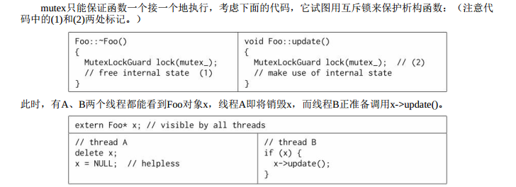

## 1. 如何解决 对象析构时 可能存在的 race condition（竞态条件） 的问题？
&emsp;&emsp; 与其他面向对象语言不同， C++要求程序员自己管理对象的生命期， 这在多线程环境下显得尤为困难。 当一个对象能被多个线程同时看到时， 那么对象的销毁时机就会变得模糊不清， 可能出现多种竞态条件（race condition） ：
* 在即将析构一个对象时， 从何而知此刻是否有别的线程正在执行该对象的成员函数？
* 如何保证在执行成员函数期间， 对象不会在另一个线程被析构？
* 在调用某个对象的成员函数之前， 如何得知这个对象还活着？ 它的析构函数会不会碰巧执行到一半？
&emsp;&emsp; 解决这些race condition是C++多线程编程面临的基本问题。muduo库使用 智能指针 `shared_ptr` 和 `weak_ptr` 来解决这个问题。 这也是实现线程安全的Observer模式的必备技术。


&emsp;
&emsp;
## 2. 如何保证线程安全？
### 2.1 编写类时保证线程安全
TODO:
### 2.2 对象构造时保证线程安全
#### 2.2.1 如何保证对象构造时的线程安全？为什么？
##### 2.2.1.1 如何保证构造对象的线程安全
对象构造要做到线程安全， <span style="color:green;"> 唯一的要求是 </span> <span style="color:red;"> 在构造期间 </span>  不要泄露this指针， 即
> * (1) 不要在构造函数中注册任何回调；
> * (2) 也不要在构造函数中把this传给跨线程的对象；
> * (3) 即便在构造函数的最后一行也不行。
> &emsp;&emsp;因为Foo有可能是个基类， 基类先于派生类构造， 执行完Foo::Foo()的最后一行代码还会继续执行派生类的构造函数， 这时most-derived class的对象还处于构造中，仍然不安全。
> 
##### 2.2.1.2 为什么？
&emsp; 之所以不能在 构造期间（注意是构造期间！）泄露this指针，主要是因为：
> &emsp;&emsp; 在构造函数执行期间对象还没有完成初始化， 如果this被泄露（escape） 给了其他对象（其自身创建的子对象除外），那么别的线程有可能访问这个半成品对象， 这会造成难以预料的后果。
#### 2.2.2 书中的例子
```cpp
// 不要这么做（ Don't do this.）
class Foo : public Observer
{
    public:
        Foo(Observable* s)
        {
            s->register_(this); // 错误，泄露了this指针，非线程安全
        }
        virtual void update();
};


// 对象构造的正确方法：
// 要这么做（Do this）
class Foo : public Observer
{
    public:
        Foo();
        virtual void update();
// 另外定义一个函数，在构造之后执行回调函数的注册工作
        void observe(Observable* s)
        {
            s->register_(this);
        }
};
Foo* pFoo = new Foo;
Observable* s = getSubject();
pFoo->observe(s); // 二段式构造，或者直接写 s->register_(pFoo);
```
##### 2.2.1.3 为什么`即便在构造函数的最后一行也不能泄露this指针`？
&emsp;&emsp; 即使构造函数的最后一行也不要泄露this， 因为Foo有可能是个基类， 基类先于派生类构造， 执行完`Foo::Foo()`的最后一行代码还会继续执行派生类的构造函数， 这时most-derived class的对象还处于构造中，仍然不安全。

### 2.3 对象析构时的线程安全
#### 2.3.1 对象析构难在哪里？
&emsp;&emsp; 对于一般的成员函数，做到线程安全的办法是让它们顺次执行，而不要并发执行（关键是不要同时读写共享状态），也就是让每个成员函数的临界区不重叠。 这是显而易见的， 不过有一个隐含条件或许不是每个人都能立刻想到： 成员函数用来保护临界区的互斥器本身必须是有效的。 而析构函数破坏了这一假设， 它会把mutex成员变量销毁掉。 
<div align="center">  </div>
<center> <font color=black> <b> 图1 mutex不是办法 </b> </font> </center>

尽管线程A在销毁对象之后把指针置为了NULL， 尽管线程B在调用x的成员函数之前检查了指针x的值， 但还是无法避免一种race condition：
> 1．线程A执行到了析构函数的(1)处， 已经持有了互斥锁， 即将继续往下执行。
> 2．线程B通过了`if (x)`检测， 阻塞在(2)处。
> 
接下来会发生什么， 只有天晓得。 因为析构函数会把mutex_销毁， 那么(2)处有可能永远阻塞下去， 有可能进入“临界区”， 然后core dump， 或者发生其他更糟糕的情况。这个例子至少说明delete对象之后把指针置为NULL根本没用， 如果一个程序要靠这个来防止二次释放， 说明代码逻辑出了问题。


&emsp;
&emsp;
## 3 为什么说 两个线程读写用一个`mutex`保护的对象时，有潜在的死锁可能？为什么呢？
### 3.1 为什么存在这种可能？
比如说下面这个`swap()`这个函数：
```cpp
void swap(Counter& a, Counter& b)
{
    MutexLockGuard aLock(a.mutex_); // potential dead lock
    MutexLockGuard bLock(b.mutex_);
    int64_t value = a.value_;
    a.value_ = b.value_;
    b.value_ = value;
}
```
如果线程A执行`swap(a, b)`;而同时线程B执行`swap(b, a)`;，就有可能死锁。
`operator=()`也是类似的道理：
```cpp
Counter& Counter::operator=(const Counter& rhs)
{
    if (this == &rhs)
        return *this;

    MutexLockGuard myLock(mutex_); // potential dead lock
    MutexLockGuard itsLock(rhs.mutex_);
    value_ = rhs.value_; // 改成value_ = rhs.value() 会死锁
    return *this;
}
```
如果线程A执行`a=b`，而如果线程B执行`b=a`，则会发生死锁

### 3.1 如何避免？
&emsp;&emsp; 一个函数如果要锁住相同类型的多个对象， 为了保证始终按相同的顺序加锁， 我们可以比较mutex对象的地址， 始终先加锁地址较小的mutex。
对于前面的`swap()`，我们可以修改为：
```cpp
void swap(Counter& a, Counter& b)
{
    // 加一段判断，先加锁地址小的 mutex，这样就能避免死锁
    if (a.mutex_ < b.mutex_){
        MutexLockGuard aLock(a.mutex_); 
        MutexLockGuard bLock(b.mutex_);
    else{
        MutexLockGuard bLock(b.mutex_);
        MutexLockGuard aLock(a.mutex_);
    }
    int64_t value = a.value_;
    a.value_ = b.value_;
    b.value_ = value;
}
```