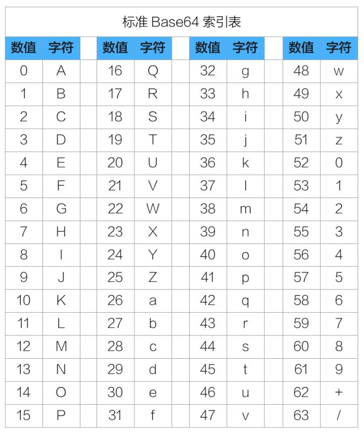

[toc]

# 1. 字符编码
## 1.1 什么是字符编码？
&emsp;&emsp; 因为计算机只能处理二进制，如果要处理文本，就必须先把文本转换为二进制序列才能处理。字符编码方式其实就是将字符和二进制对应起来。换句话说，我们其实可以将字符编码看成是一套规则：
> 例如在`ASCII`编码中，字符`A`对应的是`01000001`
> 

## 1.2 为什么需要字符编码？
&emsp;&emsp; 试想一下，如果没有字符编码，我们想输入字符`A`，那我们就需要输入二进制`01000001`，这样就太不方便了。可以说字符编码是用来方便程序员的。

## 1.3 有哪些常见的编码？
&emsp;&emsp; 常见的编码有`ASCII`、`GB2312`、`GBK`和`utf8`。

&emsp;
&emsp;
&emsp;
# 2. `Unicode`
## 2.1 什么是`Unicode`
&emsp;&emsp; `Unicode`，也被称为统一码，也叫万国码、单一码。它为 每种语言中的 每个字符 设定了统一并且唯一的二进制编码，以满足跨语言、跨平台进行文本转换、处理的要求。
&emsp;&emsp; 换句话说，它为世界上所有的文字都设定了一个二进制编码，这样就能做到跨语言交流。
&emsp;&emsp; 学名是`Universal Multiple-Octet Coded Character Set`，简称为`UCS`。是计算机科学领域里的一项业界标准，包括字符集、编码方案等。
&emsp;&emsp; 注意，Unicode 是一项业界标准，通俗来说它是一个「字符集」。

## 2.2 `Unicode`出现的必要性
### 2.2.1 为什么有的时候打开文件会有乱码？
&emsp;&emsp; 对于一个文件来说，它需要按一定的编码方式存储，假设有一个 含有中文的文件，它用的是用`gbk`编码存储，如果你用的是`utf8`打开它那他就会是乱码。
&emsp;&emsp; 就拿汉字`中`来说，它在`gbk`和`utf8`对应的二进制编码是不一样的，因此会出现乱码。

### 2.2.2 为什么需要`Unicode`
&emsp;&emsp; 显然的是，全世界有上百种语言，日本把日文编到`Shift_JIS`里，韩国把韩文编到`Euc-kr`里，中文用的是`GB2312`和`GBK`，也就是说各国有各国的标准，就会不可避免地出现冲突，结果就是，在多语言混合的文本中，显示出来会有乱码。因此，`Unicode`应运而生。`Unicode`把所有语言都统一到一套编码里，这样就不会再有乱码问题了。
&emsp;&emsp; 换句话说，而`Unicode`为世界上所有的文字都设定了一个二进制编码，这样就能做到跨语言交流，所以`Unicode`才会被称为 统一码。

## 2.3 `Unicode`是几字节编码？
&emsp;&emsp; 两字节。现在用的是`UCS-2`，即2个字节编码，而`UCS-4`是为了防止将来2个字节不够用才开发的。

## 2.4 Unicode存在的问题？
&emsp;&emsp; Unicode只是一个符号集，它只规定了符号的二进制代码，却没有规定这个二进制代码应该如何存储。
&emsp;&emsp; 比如，汉字“严”的`unicode`是十六进制数4E25，转换成二进制数足足有15位（100111000100101），也就是说这个符号的表示至少需要2个字节。表示其他更大的符号，可能需要3个字节或者4个字节，甚至更多。这里就有两个严重的问题:
> &emsp;&emsp; **第一个问题是**，如何才能区别`unicode`和`ascii`？计算机怎么知道三个字节表示一个符号，而不是分别表示三个符号呢？
> &emsp;&emsp; **第二个问题是**，我们已经知道，英文字母只用一个字节表示就够了，如果`unicode`统一规定，每个符号用三个或四个字节表示，那么每个英文字母前都必然有二到三个字节是0，这对于存储来说是极大的浪费，文本文件的大小会因此大出二三倍，这是无法接受的。
> 
它们造成的结果是：
> 1) 出现了`unicode`的多种存储方式，也就是说有许多种不同的二进制格式，可以用来表示`unicode`。
> 2) `unicode`在很长一段时间内无法推广，直到互联网的出现。
> 

## 2.5 `Unicode`的实现
&emsp;&emsp; `Unicode`的实现主要有`UTF-8、UTF-16、UTF-32`。`UTF`是`UCS Transformation Format`的缩写

## 2.6 总结
(1) `Unicode`不是一种编码方式，而是一种字符集；
(2) 它只规定了符号的二进制代码，却没有规定这个二进制代码应该如何存储；
(3) `Unicode`为世界上的每一个字符都设置了特定的二进制编码，也就是说它的字符集里面包含了世界上所有的文字。

&emsp;
&emsp;
&emsp;
# 3. `ASCII`、`GB2312`、`GBK`和`utf8`
## 3.1 `ASCII`
&emsp;&emsp; 很久很久以前，有一群人，他们决定用`8`个可以开合的晶体管来组合成不同的状态，以表示世界上的万物。他们看到`8`个开关状态是好的，于是他们把这称为”字节“。再后来，他们又做了一些可以处理这些字节的机器，机器开动了，可以用字节来组合出很多状态，状态开始变来变去。他们看到这样是好的，于是它们就这机器称为 **计算机**。
&emsp;&emsp; 开始计算机只在美国用。八位的字节一共可以组合出256(2的8次方)种不同的状态。他们把其中的编号从0开始的32种状态分别规定了特殊的用途，一但终端、打印机遇上约定好的这些字节被传过来时，就要做一些约定的动作：
> 遇上`0×10`, 终端就换行；
> 遇上`0×07`, 终端就向人们嘟嘟叫；
> 遇上`0x1b`, 打印机就打印反白的字，或者终端就用彩色显示字母。
> 
&emsp;&emsp; 他们看到这样很好，于是就把这些`0×20`以下的字节状态称为”控制码”。他们又把所有的空格、标点符号、数字、大小写字母分别用连续的字节状态表示，一直编到了第`127`号，这样计算机就可以用不同字节来存储英语的文字了。大家看到这样，都感觉 很好，于是大家都把这个方案叫做 ANSI 的 **Ascii编码**（`American Standard Code for Information Interchange`，美国信息互换标准代码）。当时世界上所有的计算机都用同样的ASCII方案来保存英文文字。

## 3.2 `GB2312`、`GBK` 和 `GB18030`
### 3.2.1 它们的来源
&emsp;&emsp; 后来，就像建造巴比伦塔一样，世界各地都开始使用计算机，但是很多国家用的不是英文，他们的字母里有许多是ASCII里没有的，为了可以在计算机保存他们的文字，他们决定采用 127号之后的空位来表示这些新的字母、符号，还加入了很多画表格时需要用下到的横线、竖线、交叉等形状，一直把序号编到了最后一个状态255。从128 到255这一页的字符集被称”扩展字符集“。从此之后，贪婪的人类再没有新的状态可以用了，美帝国主义可能没有想到还有第三世界国家的人们也希望可以用到计算机吧！
&emsp;&emsp; 等中国人们得到计算机时，已经没有可以利用的字节状态来表示汉字，况且有6000多个常用汉字需要保存呢。但是这难不倒智慧的中国人民，我们不客气地把那些127号之后的奇异符号们直接取消掉, 规定：一个小于127的字符的意义与原来相同，但两个大于127的字符连在一起时，就表示一个汉字，前面的一个字节（他称之为高字节）从0xA1用到0xF7，后面一个字节（低字节）从0xA1到0xFE，这样我们就可以组合出大约7000多个简体汉字了。在这些编码里，我们还把数学符号、罗马希腊的字母、日文的假名们都编进去了，连在 ASCII 里本来就有的数字、标点、字母都统统重新编了两个字节长的编码，这就是常说的”全角”字符，而原来在127号以下的那些就叫”半角”字符了。中国人民看到这样很不错，于是就把这种汉字方案叫做 **GB2312**。GB2312 是对 ASCII 的中文扩展。
&emsp;&emsp; 但是中国的汉字太多了，我们很快就就发现有许多人的人名没有办法在这里打出来，特别是某些很会麻烦别人的国家领导人。于是我们不得不继续把GB2312 没有用到的码位找出来老实不客气地用上。后来还是不够用，于是干脆不再要求低字节一定是127号之后的内码，只要第一个字节是大于127就固定表示这是一个汉字的开始，不管后面跟的是不是扩展字符集里的内容。结果扩展之后的编码方案被称为 **GBK** 标准，GBK包括了GB2312 的所有内容，同时又增加了近20000个新的汉字（包括繁体字）和符号。 后来少数民族也要用电脑了，于是我们再扩展，又加了几千个新的少数民族的字，GBK扩成了 **GB18030**。从此之后，中华民族的文化就可以在计算机时代中传承了。

### 3.2.2 总结
&emsp;&emsp; **GB2312** 是对 ASCII 的中文扩展；
&emsp;&emsp; **GBK**是对GB2312的扩充，它包括了GB2312 的所有内容，同时又增加了近20000个新的汉字（包括繁体字）和符号。
&emsp;&emsp; **GB18030**是对GBK的扩充，它在GBK的基础上增加了咱们国家的少数民族的文字。

## 3.3 `UTF8`
### 3.3.1 什么是 `UTF8`？
&emsp;&emsp; `UTF-8`是`Unicode`的实现方式之一，全名为（8位元，Unicode Transformation Format）它可以用来表示Unicode标准中的任何字符，而且其编码中的第一个字节仍与`ASCII`兼容，使得原来处理`ASCII`字符的软件无须或只进行少部份修改后，便可继续使用。因此，它逐渐成为电子邮件、网页及其他存储或传送文字的应用中，优先采用的编码。
&emsp;&emsp; 互联网的普及，强烈要求出现一种统一的编码方式。`UTF-8`就是在互联网上使用最广的一种`Unicode`的实现方式。其他实现方式还包括`UTF-16`和`UTF-32`，不过在互联网上基本不用。

### 3.3.2 `UTF8`的编码规则是怎样的？
&emsp;&emsp; `UTF-8`最大的一个特点，就是**它是一种变长的编码方式**。它可以使用`1~4`个字节表示一个符号，根据不同的符号而变化字节长度。
UTF-8的编码规则很简单，只有两条：
> 1）对于单字节的符号，字节的第一位设为0，后面7位为这个符号的unicode码。因此对于英语字母，UTF-8编码和ASCII码是相同的。
> 2）对于n字节的符号（n>1），第一个字节的前n位都设为1，第n+1位设为0，后面字节的前两位一律设为10。剩下的没有提及的二进制位，全部为这个符号的unicode码。
> 

### 3.3.3  `UTF8`是几字节编码？
| 字符                           | 字节数                   |
| ------------------------------ | ------------------------ |
| 数字、英文字符                 | 1 字节                   |
| 带有附加符号的拉丁文、希腊文等 | 2 字节                   |
| 中文                           | 有的占3字节，有的占4字节 |

### 3.3.4 为什么`utf-8`要采用 变长编码？
我们先捋一捋`ASCII`编码和`Unicode`编码的区别：ASCII编码是1个字节，而`Unicode`编码通常是2个字节。
> 字母`A`用`ASCII`编码是十进制的65，二进制的01000001；
> 字符`0`用`ASCII`编码是十进制的48，二进制的00110000，注意字符'0'和整数0是不同的；
> 汉字`中`已经超出了`ASCI`I编码的范围，用`Unicode`编码是十进制的`20013`，二进制的`01001110 00101101`。
> 
你可以猜测，如果把`ASCII`编码的A用Unicode编码，只需要在前面补0就可以，因此，`A`的`Unicode`编码是 ：`00000000 01000001`。
&emsp;&emsp; **现在新的问题又出现了**：如果统一成`Unicode`编码，乱码问题从此消失了。但是，如果你写的文本基本上全部是英文的话，用`Unicod`e编码比`ASCII`编码需要多一倍的存储空间，在存储和传输上就十分不划算。
&emsp;&emsp; 所以，本着节约的精神，又出现了把Unicode编码转化为“可变长编码”的UTF-8编码。UTF-8编码把一个Unicode字符根据不同的数字大小编码成1-6个字节，常用的英文字母被编码成1个字节，汉字通常是3个字节，只有很生僻的字符才会被编码成4-6个字节。如果你要传输的文本包含大量英文字符，用UTF-8编码就能节省空间：
| 字符 | ASCII    | Unicode           | UTF-8                      |
| ---- | -------- | ----------------- | -------------------------- |
| A    | 01000001 | 00000000 01000001 | 01000001                   |
| 中   | 无       | 01001110 00101101 | 11100100 10111000 10101101 |
从上面的表格还可以发现，UTF-8编码有一个额外的好处，就是ASCII编码实际上可以被看成是UTF-8编码的一部分，所以，大量只支持ASCII编码的历史遗留软件可以在UTF-8编码下继续工作。
**总的来说，** 将`utf8`设计为变长字符是为了节省空间

&emsp;
&emsp;
&emsp;
# 4. `Base64`编码
## 4.1 什么是`Base64`编码？
&emsp;&emsp; `Base64` 是一种基于 `64` 个可打印字符来表示二进制数据的表示方法。由于 `2^6=64`，所以每 `6` 个比特为一个 `Base64` 单元，对应某个可打印字符。`3` 个字节有 `24` 个比特，对应于 `4` 个 `Base64` 单元，即 `3` 个字节可由 `4` 个可打印字符来表示。

## 4.2 `Base64`是一种加解密的技术吗？
&emsp;&emsp; 它不是一种加解密技术，而是一种简单的编解码技术。它其实只是定义用可打印字符传输内容一种方法，并不会产生新的字符集！

## 4.3 `Base64`中的`64`指的是什么？
&emsp;&emsp; `Base64`是一种用 **`64`** 个字符来表示任意二进制数据的方法，64指的是64个可打印字符是 `A-Za-z0-9+/`，分别依次对应索引值 0-63。索引表如下：

## 4.4 `Base64`的转换规则是怎样的？
(1) 第一步，将待转换的字符串每三个字节分为一组，每个字节占8bit，那么共有24个二进制位。
(2) 第二步，将上面的24个二进制位每6个一组，共分为4组。

(3) 第三步，在每组前面添加两个0，每组由6个变为8个二进制位，总共32个二进制位，即四个字节。
(4) 第四步，根据Base64编码对照表（见上图）获得对应的值。
从上面的步骤我们发现：
> Base64字符表中的字符原本用6个bit就可以表示，现在前面添加2个0，变为8个bit，会造成一定的浪费。因此，Base64编码之后的文本，要比原文大约三分之一。
> 为什么使用3个字节一组呢？因为6和8的最小公倍数为24，三个字节正好24个二进制位，每6个bit位一组，恰好能够分为4组。
> 

## 4.5 `Base64`的应用场景有哪些？
(1) 电子邮件刚问世的时候，只能传输英文，但后来随着用户的增加，中文、日文等文字的用户也有需求，但这些字符并不能被服务器或网关有效处理，因此Base64就登场了。随之，Base64在URL、Cookie、网页传输少量二进制文件中也有相应的使用。
(2) 在做支付系统时，系统之间的报文交互都需要使用Base64对明文进行转码，然后再进行签名或加密，之后再进行（或再次Base64）传输
(3) 在参数传输的过程中经常遇到的一种情况：使用全英文的没问题，但一旦涉及到中文就会出现乱码情况。与此类似，网络上传输的字符并不全是可打印的字符，比如二进制文件、图片等。Base64的出现就是为了解决此问题，它是基于64个可打印的字符来表示二进制的数据的一种方法。

## 4.6 `Base64`的原理是什么？
&emsp;&emsp; Base64是一种通过查表的编码方法，不能用于加密，即使使用自定义的编码表也不行。还可以自己定义64个字符的排列顺序，这样就可以自定义Base64编码，不过，通常情况下完全没有必要。

# 5. `\x` 与 `\u`
首先，无论是`\x` 还是 `\u`，前面的`\`都表示的是转义。
`\x` 表示的是 **十六进制**，与其相对的是 `\d`：十进制；`\o`：八进制。
`\x` 后边跟2位，则表示单字节编码，比如`\xe4`就表示的是一个字节；

`\u`表示的是`unicode`码

&emsp;
&emsp;
&emsp;
# 参考文献
1. [字符串和编码](https://www.liaoxuefeng.com/wiki/1016959663602400/1017075323632896)
2. [Unicode 和 UTF-8 有什么区别？](https://www.zhihu.com/question/23374078)