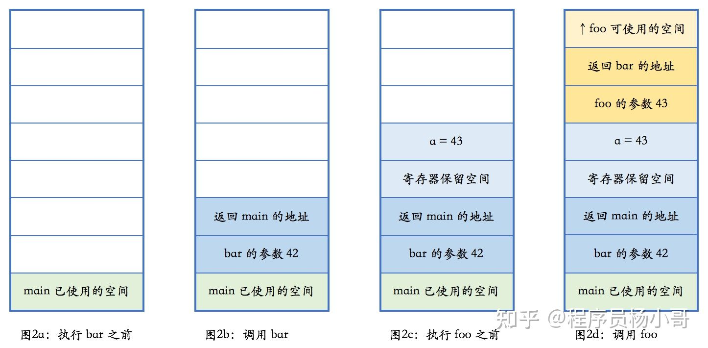

## 栈
### 栈展开(Stack Unwinding)
&emsp;&emsp; 在运行时期间从函数调用栈中删除函数实体，称为栈展开。栈展开通常用于异常处理。
&emsp;&emsp; 在C++中，如果一个异常发生了，会线性的搜索函数调用栈，来寻找异常处理者，并且带有异常处理的函数之前的所有实体，都会从函数调用栈中删除。所以，如果异常没有在抛出它的函数中被处理，则会激活栈展开。
&emsp;&emsp; 最常见的栈展开就是正常的函数调用，任何一个函数返回都存在栈展开。C++引入异常机制后，当程序抛出异常，在异常向上传递的过程中，其函数调用栈也会展开。
&emsp;&emsp; 我们先来看一段示例代码，来说明 C++ 里函数调用、本地变量是如何使用栈的。当然，这一过程取决于计算机的实际架构，具体细节可能有所不同，但原理上都是相通的，都会使用一个后进先出的结构。
```cpp
void foo(int n)
{

}
void bar(int n){
    int a = n + 1;
    foo(a);
}
int main(){
    bar(42);
}
```
<div align="center">  </div>
<center> <font color=black> <b> 图1 栈展开图解 </b> </font> </center>

注意，生长方向: 栈是朝着地址减小的方向生长的，而堆是朝着地址增大的方向生长的。
当函数调用另外一个函数时，会把参数也压入栈里然后把下一行汇编指令的地址压入栈，并跳转到新的函数。 新的函数进入后，首先做一些必须的保存工作，然后会调整栈指针，分配出本地变量所需的空间，随后执行函数中的代码，并在执行完毕之后，根据调用者压入栈的地址，返回到调用者未执行的代码中继续执行。
&emsp;&emsp; 本地变量就保存在栈上，当函数执行完成之后，保存本地变量的栈内存就被释放掉了。
&emsp;&emsp; 上述例子中本地变量是内置的类型，本地变量不光可以是内置的类型，还可以是复杂的类型，比如说类的对象，这时，如果函数调用结束之后或者发生异常时，编译器会自动调用类的析构函数，这个过程叫做栈展开(stack unwinding)。


其它的见 TLPI第六章

&emsp;
&emsp;
## 参考文献
1.[C++堆，栈，RAII](https://zhuanlan.zhihu.com/p/354611651)