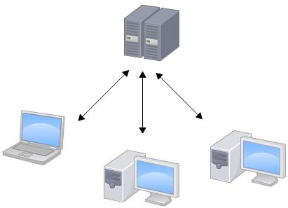
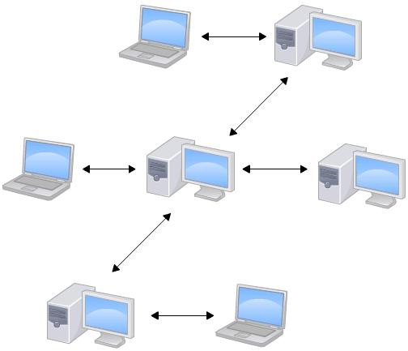
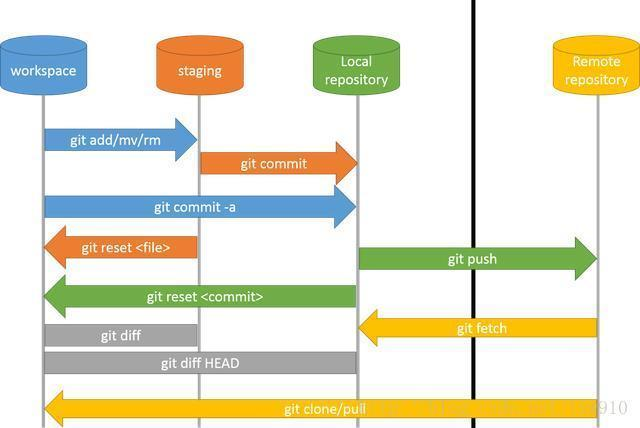

- [1. Git 与 SVN 的比较](#1-git-与-svn-的比较)
  - [1.1  集中式vs分布式](#11--集中式vs分布式)
    - [1.1.1 SVN](#111-svn)
      - [优点](#优点)
      - [缺点](#缺点)
    - [1.1.2 Git](#112-git)
  - [1.2 内容存储方式上的区别](#12-内容存储方式上的区别)
  - [1.3 分支管理上的区别](#13-分支管理上的区别)
    - [1.3.1 什么是分支](#131-什么是分支)
    - [1.3.2 SVN的分支](#132-svn的分支)
    - [1.3.3 Git的分支](#133-git的分支)
  - [1.4 版本号](#14-版本号)
  - [1.5 内容完整性的差异](#15-内容完整性的差异)
- [2. Git的工作流](#2-git的工作流)
  - [2.1 git的3个区](#21-git的3个区)
- [3. git命令](#3-git命令)
  - [4.1 把代码拉到工作电脑](#41-把代码拉到工作电脑)
  - [4.2 配置个人信息](#42-配置个人信息)
  - [4.3 将代码提交到远程仓库](#43-将代码提交到远程仓库)
    - [4.3.1 将修改推到暂存区](#431-将修改推到暂存区)
    - [4.3.2 提交代码到仓库](#432-提交代码到仓库)
    - [4.3.3 将代码推到远程仓库](#433-将代码推到远程仓库)
    - [4.3.4 如果在本地修改了一个文件`server.conf`文件，应该怎么把它推到远程仓库？](#434-如果在本地修改了一个文件serverconf文件应该怎么把它推到远程仓库)
  - [4.4 同步远程仓库的改动](#44-同步远程仓库的改动)
    - [4.4.1 方法一：两步走](#441-方法一两步走)
    - [4.4.2 方法二：一步搞定](#442-方法二一步搞定)
  - [5. 查询](#5-查询)
- [4. 分支冲突](#4-分支冲突)
- [git能彻底保证没有冲突吗？](#git能彻底保证没有冲突吗)


&emsp;
&emsp; 
# 1. Git 与 SVN 的比较
## 1.1  集中式vs分布式
### 1.1.1 SVN
&emsp;&emsp; SVN属于集中式的版本控制系统，它有一个单一的中心服务器用于保存所有文件的修订版本，各个用户都通过客户端连到这台服务器，取出最新的文件或者提交更新，原理如下图：
<div align='center'>  </div>

SVN的特点概括起来主要由以下几条：
> ① 每个版本库有唯一的URL（官方地址），每个用户都从这个地址获取代码和数据；
> ② 获取代码的更新，也只能连接到这个唯一的版本库，同步以取得最新数据；
> ③ 提交必须有网络连接（非本地版本库）；
> ④ 提交需要授权，如果没有写权限，提交会失败；
> ⑤ 提交并非每次都能够成功。如果有其他人先于你提交，会提示“改动基于过时的版本，先更新再提交”… 诸如此类；
> ⑥ 冲突解决是一个提交速度的竞赛：手快者，先提交，平安无事；手慢者，后提交，可能遇到麻烦的冲突解决。
> 
#### 优点
SVN的这种集中式的组织方式有如下优点：
> 每个人都可以一定程度上看到项目中的其他人正在做些什么。而管理员也可以轻松掌控每个开发者的权限。
> 
#### 缺点
> 因为SVN是集中式的，因此所有的数据都经过中央服务器进行交换同步。如果用户不能连接到服务器上，就不能提交，还原，对比等工作。
> 如果中央服务器的磁盘发生故障，并且没做过备份或者备份得不够及时的话，还会有丢失数据的风险。
> 
### 1.1.2 Git
&emsp;&emsp; Git属于分布式的版本控制系统，原理大致如下：
<div align='center'>  </div>

## 1.2 内容存储方式上的区别
&emsp;&emsp; SVN只记录文件的修改部分，不产生多余的数据。
&emsp;&emsp; 而Git只关心文件数据的整体是否发生变化。Git 不保存文件内容前后变化的差异数据。

## 1.3 分支管理上的区别
### 1.3.1 什么是分支
&emsp;&emsp; 在版本管理里，分支是很常使用的功能。在发布版本前，需要发布分支，进行大需求开发，需要 feature 分支，大团队还会有开发分支，稳定分支等。在大团队开发过程中，常常存在创建分支，切换分支的需求。
### 1.3.2 SVN的分支
&emsp;&emsp; 在SVN中，分支就是版本库中的另外的一个目录。
### 1.3.3 Git的分支
Git 分支是指针指向某次提交，这个特性使 Git 的分支切换非常迅速，且创建成本非常低。

## 1.4 版本号
&emsp;&emsp; Git没有一个全局的版本号，而 SVN 有。

## 1.5 内容完整性的差异
&emsp;&emsp; Git的内容完整性要优于SVN，因为它用的是 `SHA-1哈希算法`。这能确保代码内容的完整性，确保在遇到磁盘故障和网络问题时降低对版本库的破坏。


&emsp;
&emsp; 
# 2. Git的工作流
## 2.1 git的3个区
下面是 Git 工作区、暂存区和版本库概念：
| 名称                   | 概念                             |
| ---------------------- | -------------------------------- |
| 工作区(Workspace)      | 电脑中实际的目录                 |
| 暂存区(stage 或 index) | 类似于缓存区域，临时保存你的改动 |
| 版本库(Repository)     | 分为本地仓库和远程仓库           |


&emsp;
&emsp; 
# 3. git命令
下图(来自于网络)是Git的常用命令：
<div align='center'>  </div>

## 4.1 把代码拉到工作电脑
```bash
# 初始化
$ git init
# 克隆一个项目，url是这个项目的地址
$ git clone [url]
```
## 4.2 配置个人信息
```bash
# 设置提交代码时的用户信息
$ git config [--global] user.name "[name]"
$ git config [--global] user.email "[email address]"
```
## 4.3 将代码提交到远程仓库
### 4.3.1 将修改推到暂存区
```bash
# 添加当前目录的所有文件到暂存区
$ git add .

# 添加指定文件到暂存区
$ git add <file1> <file2> ...

# 添加指定目录到暂存区，包括其子目录
$ git add <dir>

# 删除工作区文件，并且将这次删除放入暂存区
$ git rm [file1] [file2] ...


# 改名文件，并且将这个改名放入暂存区
$ git mv [file-original] [file-renamed]
```
### 4.3.2 提交代码到仓库
```bash
# 提交暂存区到仓库区
$ git commit -m [message]
```
### 4.3.3 将代码推到远程仓库
```bash
# 上传本地指定分支到远程仓库
$ git push [remote] [remote-branch]
```
### 4.3.4 如果在本地修改了一个文件`server.conf`文件，应该怎么把它推到远程仓库？
```bash
$ git add server.conf
$ git commit -m "此处写修改日志"
$ git push # 默认推到主分支，也可以指定分支
```
## 4.4 同步远程仓库的改动
### 4.4.1 方法一：两步走
```bash
$ git fetch
$ git merge
```
### 4.4.2 方法二：一步搞定
```bash
$ git pull
```
换句话说，`pull=fetch+merge`，pull的话，下拉远程分支并与本地分支合并。fetch只是下拉远程分支，怎么合并，可以自己再做选择。

## 5. 查询
```bash
# 查看工作区文件修改状态
$ git status

# 查看工作区文件修改具体内容
$ git diff [file]

# 查看暂存区文件修改内容
$ git diff --cached [file]

# 查看版本库修改记录
$ git log

# 查看某人提交记录
$ git log --author=someone

# 查看某个文件的历史具体修改内容
$ git log -p [file]

# 查看某次提交具体修改内容
$ git show [commit]
```


&emsp;
&emsp; 
# 4. 分支冲突
# git能彻底保证没有冲突吗？
https://www.zhihu.com/question/20093241

